# 00 — PesoPilot v2.0 Source of Truth (Part I)

> **Document Version:** 2.0.0
> **Status:** Draft (Architecture Freeze Pending)
> **Phase:** Phase 11A – Rule-Based Financial Intelligence
> **Owner:** Kenneth Vier Cerrado
> **Last Updated:** June 2026

---

# Table of Contents (Source of Truth)

## Part I — Foundation (This Document)

1. Document Purpose
2. Product Vision
3. Product Philosophy
4. Core Design Principles
5. Architectural Principles
6. Financial Intelligence Philosophy
7. AI Philosophy
8. Technology Stack
9. Overall System Architecture
10. High-Level Sequence Diagram
11. Development Roadmap

---

## Part II

12. Insight Engine Architecture
13. InsightBundle Contract
14. Rule Engine Architecture
15. Clean Architecture Mapping
16. Dependency Rules
17. Folder Structure

---

## Part III

18. Financial Health Engine
19. Recommendation Engine
20. Summary Generator
21. Dashboard Integration
22. Reports Integration
23. Cashflow Integration

---

## Part IV

24. Spring Boot AI Architecture
25. Ollama Integration
26. Prompt Builder
27. AI Safety Rules
28. Testing Strategy
29. Future Expansion

---

# 1. Document Purpose

This document is the **master architectural specification** for PesoPilot v2.0.

Unlike the Phase 0–10 documentation, which primarily described implementation details of financial management features, this document defines the architecture of PesoPilot's **Financial Intelligence Platform**.

Its purpose is to establish a stable, deterministic, and extensible foundation for every future insight, recommendation, and AI capability.

This document is considered the **highest authority** for Phase 11 and beyond.

---

## Objectives

This document defines:

* overall financial intelligence architecture
* system boundaries
* dependency rules
* design philosophy
* module responsibilities
* implementation roadmap
* future AI integration

It intentionally avoids implementation-specific business rules that belong in subsystem documents.

---

## Scope

This document governs:

* Rule-Based Financial Intelligence
* Insight Engine
* Recommendation Engine
* Summary Generation
* Health Score
* Spring Boot AI Integration
* Ollama Integration
* Future Financial Coach

It does **not** redefine:

* Expenses
* Income
* Savings
* Reports
* Cashflow
* Settings
* Merchant Rules
* Salary Cutoff

Those remain governed by the PesoPilot v1.x documentation.

---

# 2. Product Vision

## Mission

PesoPilot exists to help ordinary people make better financial decisions through transparent, explainable, and trustworthy financial intelligence.

Rather than acting as a bookkeeping application alone, PesoPilot should become a financial companion that helps users understand:

* where their money goes,
* how healthy their finances are,
* what has changed,
* and what they can realistically improve.

---

## Product Evolution

```text
PesoPilot v1

Finance Tracking

↓

Expenses

Income

Savings

Reports

Cashflow
```

↓

```text
PesoPilot v2

Financial Intelligence

↓

Analyze

Explain

Recommend

Coach
```

The application evolves from recording financial activity to interpreting financial behavior.

---

# 3. Product Philosophy

PesoPilot follows one central philosophy:

> **Financial intelligence must always be explainable.**

Users should never wonder:

> "Why did the application tell me this?"

Every recommendation must be backed by observable financial data.

Example:

Instead of:

```text
Health Score: 84
```

PesoPilot should explain:

```text
Health Score: 84

Reason

• Expenses are only 48% of income.

• Savings rate is 21%.

• You contributed to all active savings goals.

• Cashflow remains positive.
```

Every insight should have a clear origin.

---

# 4. Core Design Principles

## Principle 1 — Truth Before Intelligence

Financial facts always come before interpretation.

The application never invents numbers.

---

## Principle 2 — Explainability

Every calculation must be reproducible.

Every recommendation must identify:

* source data
* applied rule
* resulting insight

---

## Principle 3 — Determinism

Given identical financial records,

the application must always produce identical insights.

Randomness is not permitted.

---

## Principle 4 — Separation of Concerns

Financial calculations belong to the Rule Engine.

Presentation belongs to the UI.

Narrative belongs to AI.

These responsibilities must never overlap.

---

## Principle 5 — Progressive Intelligence

PesoPilot grows in layers.

```text
Financial Data

↓

Rule Engine

↓

Insights

↓

Recommendations

↓

Summaries

↓

AI Narrative
```

Each layer depends only on the previous one.

---

# 5. Architectural Principles

PesoPilot continues using Clean Architecture.

The intelligence layer extends—not replaces—the existing architecture.

```text
React Page

↓

Hook

↓

Service

↓

Rule Engine

↓

Existing Feature Services

↓

Repositories

↓

Dexie
```

This ensures that financial intelligence remains independent from the UI.

---

## Single Source of Truth

Only one module is allowed to generate financial intelligence.

```text
Insight Engine
```

No page should calculate:

* health score
* savings rate
* recommendations
* summaries

Pages consume results only.

---

## Centralized Intelligence

Incorrect

```text
Dashboard

↓

calculates health

Cashflow

↓

calculates health

Reports

↓

calculates health
```

Correct

```text
Dashboard

↓

Insight Engine

↓

Health
```

Everything consumes the same generated output.

---

# 6. Financial Intelligence Philosophy

The Financial Intelligence Platform transforms financial records into explainable knowledge.

It is not an AI.

It is not machine learning.

It is a deterministic reasoning engine.

Input:

```text
Income

Expenses

Savings

Savings Goals

Cutoffs
```

↓

Output:

```text
Health Score

Insights

Recommendations

Summary
```

No external model is required.

---

## Why Rule-Based First?

Rules provide:

* consistency
* transparency
* testability
* reproducibility

This makes PesoPilot suitable for personal finance, where trust is more important than creativity.

---

# 7. AI Philosophy

Artificial Intelligence is **not** responsible for financial calculations.

Instead:

```text
Rule Engine

↓

InsightBundle

↓

AI

↓

Narrative
```

AI should only answer:

> "How do I explain these results?"

It should never answer:

> "What are the results?"

This distinction protects the integrity of financial advice.

---

## AI Responsibilities

AI may:

* summarize
* explain
* simplify
* encourage
* answer questions

AI must not:

* invent totals
* estimate missing records
* fabricate transactions
* perform financial calculations
* override the Rule Engine

---

# 8. Technology Stack

## Frontend

* React
* Vite
* Zustand
* React Router
* Dexie
* IndexedDB

---

## Local Storage

Primary persistence:

```text
IndexedDB
```

Secondary:

```text
localStorage
sessionStorage
```

---

## Rule Engine

Language:

```text
JavaScript
```

No backend dependency.

---

## Backend (Phase 11B)

```text
Spring Boot

Java 21
```

Purpose:

* Prompt orchestration
* Ollama communication

Not financial calculations.

---

## AI

Local LLM

```text
Ollama
```

Future compatible:

* OpenAI
* Gemini
* Claude
* Azure OpenAI

without changing the Rule Engine.

---

# 9. Overall System Architecture

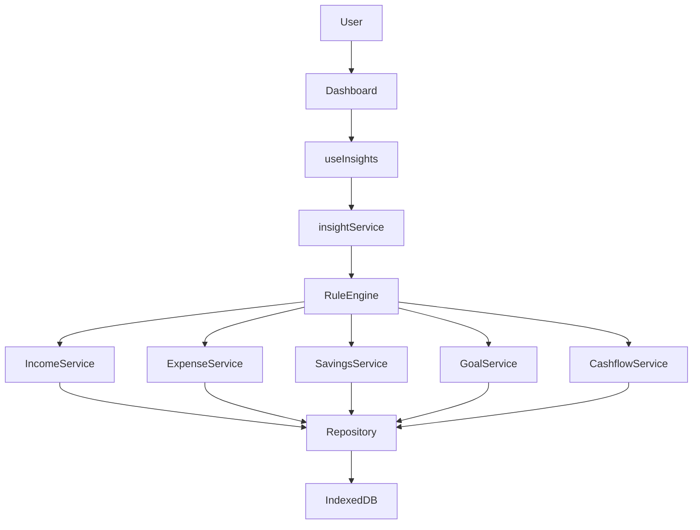

---

## Architectural Observation

Notice that the Rule Engine does **not** communicate directly with IndexedDB.

Instead, it reuses the existing application services.

This ensures:

* consistent business rules
* reusable validation
* single source of financial truth
* minimal duplication

---

# 10. High-Level Sequence Diagram

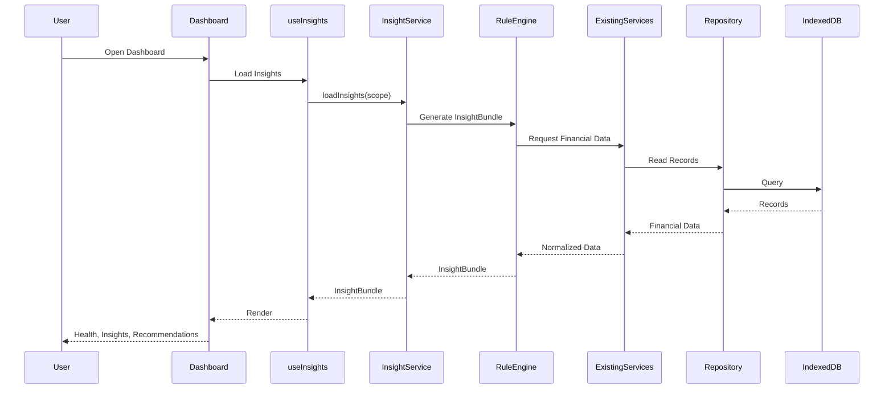

---

# 11. Development Roadmap

The implementation order is intentional.

Each milestone builds on the previous one.

```text
11A.0

Insight Architecture

↓

11A.1

Financial Health Engine

↓

11A.2

Expense Intelligence

↓

11A.3

Income Intelligence

↓

11A.4

Savings Intelligence

↓

11A.5

Savings Goal Intelligence

↓

11A.6

Cashflow Intelligence

↓

11A.7

Cutoff Intelligence

↓

11A.8

Recommendation Engine

↓

11A.9

Summary Generator

↓

11A.10

Dashboard Integration

↓

11A.11

Insights Page

↓

11A.12

Summary History

↓

Phase 11B

Spring Boot AI

↓

Ollama Narrative Layer
```

---

# Part I Summary

At the completion of Part I, the architectural direction of PesoPilot v2.0 is established:

* Financial intelligence is deterministic and rule-based.
* The Insight Engine is the sole producer of insights.
* The UI consumes insight data but never calculates it.
* AI explains insights but never generates financial facts.
* Clean Architecture principles remain intact.
* The system is designed to evolve toward an AI-assisted financial coach without sacrificing explainability or trust.

---

**End of Part I**

**Next Document Section:** *Part II — Insight Engine Architecture & Rule Engine Design*


# 00 — PesoPilot v2.0 Source of Truth (Part II)

> **Document Version:** 2.0.0
> **Status:** Draft (Architecture Freeze Pending)
> **Section:** Insight Engine Architecture & Rule Engine Design

---

# 12. Insight Engine Architecture

## Purpose

The Insight Engine is the core of PesoPilot v2.0.

It transforms raw financial records into deterministic financial intelligence.

Unlike the existing financial modules, which are responsible for recording and organizing financial data, the Insight Engine is responsible for answering questions such as:

* How healthy are the user's finances?
* What changed this cutoff?
* What should the user pay attention to?
* Which financial habits are improving?
* Which habits are becoming risky?

The engine produces structured outputs that every presentation layer can consume.

---

## Primary Responsibility

```text
Financial Records

↓

Analysis

↓

Insights

↓

Recommendations

↓

Summary

↓

Presentation
```

The engine never concerns itself with:

* UI rendering
* Styling
* Navigation
* React components
* Spring Boot
* Ollama

---

## Architectural Position

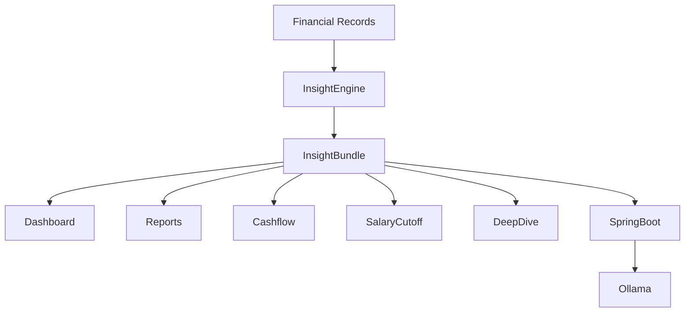

The Insight Engine becomes the single producer of financial intelligence.

---

# 13. InsightBundle

## Purpose

Every consumer receives exactly the same object.

There are no page-specific calculations.

No duplicate financial logic.

Everything flows through the InsightBundle.

---

## InsightBundle Philosophy

Instead of:

```text
Dashboard

↓

Expense Calculations

↓

Income Calculations

↓

Health Calculations
```

Every page receives:

```text
InsightBundle
```

---

## Structure

```text
InsightBundle

├── metadata

├── health

├── income

├── expenses

├── savings

├── goals

├── cashflow

├── cutoff

├── recommendations

└── summary
```

---

## InsightBundle Lifecycle

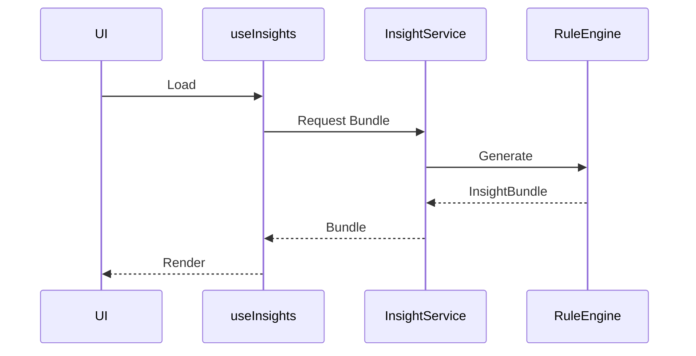

---

## Design Principle

Every section of the bundle is independent.

Meaning:

Health does not need Dashboard.

Recommendations do not need Reports.

Cashflow does not need Health.

Each module computes its own output before everything is assembled.

---

# 14. Rule Engine Architecture

## Philosophy

Rather than creating one giant financial calculator,

PesoPilot uses multiple specialized rule modules.

Each module owns exactly one responsibility.

---

## Architecture

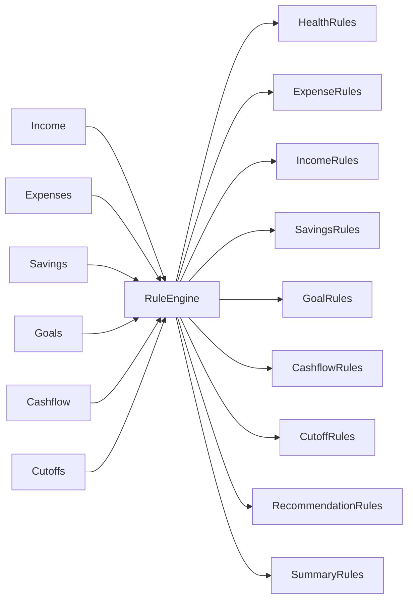

---

## Benefits

Instead of:

```text
1 file

5,000 lines
```

we obtain

```text
Small

Independent

Testable

Reusable

Predictable
```

modules.

---

# 15. Rule Module Responsibilities

Each module owns only one responsibility.

---

## Health Rules

Responsible for:

* financial health score
* health breakdown
* health status

Never computes:

* recommendations
* summaries

---

## Expense Rules

Responsible for:

* category analysis
* merchant analysis
* spending rate
* largest expense
* expense trends

Never computes:

* savings
* health

---

## Income Rules

Responsible for:

* income stability
* income comparison
* income trends
* income totals

---

## Savings Rules

Responsible for:

* savings rate
* contribution analysis
* savings trends
* savings consistency

---

## Goal Rules

Responsible for:

* goal progress

* contribution participation

* completion %

* remaining amount

---

## Cashflow Rules

Responsible for:

* remaining cash

* cashflow stability

* spending pace

* utilization

---

## Cutoff Rules

Responsible for:

* cutoff comparison

* monthly comparison

* best cutoff

* worst cutoff

---

## Recommendation Rules

Consumes outputs from every previous rule module.

Never reads repositories.

Never queries IndexedDB.

---

## Summary Rules

Consumes:

Health

Recommendations

Income

Expenses

Savings

Cashflow

Produces:

Human-readable summaries.

---

# 16. Clean Architecture Mapping

PesoPilot continues following Clean Architecture.

The intelligence layer simply extends it.

```mermaid
graph TD

Page

↓

Hook

↓

Insight Service

↓

Rule Engine

↓

Existing Feature Services

↓

Repositories

↓

Dexie
```

---

## Responsibilities

### React Pages

Responsible for:

* rendering

* loading

* navigation

Never calculate.

---

### Hooks

Responsible for:

* loading

* refresh

* state

Never calculate.

---

### Insight Service

Responsible for:

* orchestration

* assembling InsightBundle

Never contain financial formulas.

---

### Rule Modules

Responsible for:

all financial intelligence.

Every calculation belongs here.

---

### Existing Feature Services

Remain responsible for:

* retrieving financial records

* existing business validation

They should not know insights exist.

---

# 17. Dependency Rules

This is one of the most important sections.

---

## Allowed Dependencies

```text
Dashboard

↓

useInsights

↓

InsightService

↓

Rule Modules

↓

Existing Services

↓

Repositories

↓

Dexie
```

---

## Forbidden Dependencies

Dashboard

❌ Repository

Dashboard

❌ Dexie

Dashboard

❌ Expense Calculations

Dashboard

❌ Health Score Formula

---

Rule Modules

❌ React

❌ Components

❌ Hooks

---

Recommendation Rules

❌ IndexedDB

Recommendation Rules

❌ Repository

Recommendations consume rule outputs only.

---

Spring Boot

❌ Dexie

Spring Boot

❌ Repositories

Backend receives InsightBundle only.

---

Ollama

❌ Financial Records

Ollama

❌ Health Formula

Ollama

❌ Expense Formula

Ollama only explains.

---

# 18. Folder Structure

```text
src/features/

insights/

├── hooks/

│   useInsights.js

├── services/

│   insightService.js

│   recommendationService.js

│   summaryService.js

├── rules/

│   healthRules.js

│   expenseRules.js

│   incomeRules.js

│   savingsRules.js

│   goalRules.js

│   cashflowRules.js

│   cutoffRules.js

│   recommendationRules.js

│   summaryRules.js

├── models/

│   insightBundle.js

│   insightTypes.js

├── utils/

│   severity.js

│   priority.js

│   formatters.js

│   calculations.js

├── components/

│   HealthScoreCard.jsx

│   RecommendationCard.jsx

│   SummaryCard.jsx

│   InsightCard.jsx

├── pages/

│   InsightsPage.jsx

└── tests/
```

---

## Why This Structure?

The architecture separates:

Business Intelligence

from

Presentation.

Meaning:

```text
rules/

↓

knowledge
```

while

```text
components/

↓

display
```

No React component should ever know how a Health Score is calculated.

---

# 19. Insight Engine Design Principles

Every future insight must satisfy five rules.

---

## Rule 1

Deterministic

Same input

↓

Same output

Always.

---

## Rule 2

Explainable

Every insight must answer:

Why?

---

## Rule 3

Composable

InsightBundle can be expanded

without breaking existing consumers.

---

## Rule 4

Independent

Each module can evolve independently.

Health Rules should never require modifying Expense Rules.

---

## Rule 5

Reusable

One calculation

↓

Many consumers

Dashboard

Reports

Cashflow

Spring Boot

Mobile

All reuse the same output.

---

# Part II Summary

The Insight Engine is now formally defined as the central intelligence layer of PesoPilot.

Key architectural decisions established in this section:

* InsightBundle is the single contract for all financial intelligence.
* Financial logic is divided into specialized, independent rule modules.
* Rule modules are the only place where financial calculations are allowed.
* UI layers consume insights but never compute them.
* Recommendation and Summary generation depend on rule outputs, not raw financial records.
* The architecture remains fully compatible with Clean Architecture and prepares the system for Phase 11B, where Spring Boot and Ollama will consume the InsightBundle without owning financial business logic.

---

**End of Part II**

**Next Document Section:** *Part III — Financial Intelligence Engines (Health, Recommendations, Summary Generation & UI Integration)*


# 00 — PesoPilot v2.0 Source of Truth (Part III)

> **Document Version:** 2.0.0
> **Status:** Draft (Architecture Freeze Pending)
> **Section:** Financial Intelligence Engines, Recommendation Engine, Summary Generation & UI Integration

---

# 20. Financial Intelligence Pipeline

## Purpose

The Financial Intelligence Platform is composed of multiple independent engines.

Each engine answers one financial question.

Rather than building one massive financial calculator, PesoPilot divides intelligence into specialized modules.

Each engine:

* has one responsibility
* produces one output
* can be tested independently
* can evolve independently

---

## Overall Pipeline

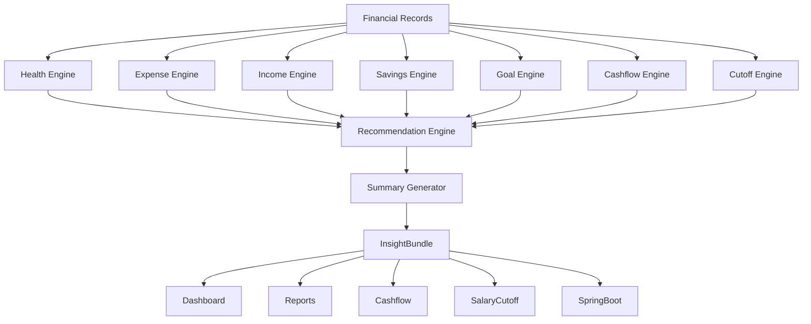

---

# 21. Health Engine

## Objective

The Health Engine evaluates the user's current financial condition.

It is **not** a budgeting score.

It is **not** a credit score.

It is PesoPilot's internal assessment of financial wellness.

---

## Inputs

```text
Income

Expenses

Savings

Savings Goals

Cashflow

Current Cutoff
```

---

## Outputs

```text
Health Score

Health Status

Health Breakdown

Health Summary
```

---

## Sequence Diagram

```mermaid
sequenceDiagram

participant InsightService

participant HealthEngine

participant ExpenseRules

participant SavingsRules

participant CashflowRules

InsightService->>HealthEngine: calculate()

HealthEngine->>ExpenseRules: expense ratio

ExpenseRules-->>HealthEngine

HealthEngine->>SavingsRules: savings rate

SavingsRules-->>HealthEngine

HealthEngine->>CashflowRules: remaining cash

CashflowRules-->>HealthEngine

HealthEngine-->>InsightService: HealthInsight
```

---

## Health Score Philosophy

The score exists to communicate financial condition quickly.

It should never be treated as absolute.

Instead:

```text
Health Score

↓

Conversation Starter

↓

Recommendations

↓

Financial Improvement
```

The score is not the goal.

Financial improvement is.

---

## Health Score Range

```text
90–100

Excellent

75–89

Healthy

60–74

Fair

40–59

Needs Attention

0–39

Critical
```

---

## Health Breakdown

Every score must explain itself.

Example

```text
Health Score

84

Breakdown

Expense Management

26 / 30

Savings

18 / 20

Cashflow

25 / 25

Goal Participation

10 / 15

Income Stability

5 / 10
```

---

# 22. Expense Intelligence Engine

## Objective

Understand spending behavior.

Not simply total expenses.

The engine should answer:

> Where is money going?

---

## Responsibilities

Generate:

* largest category
* category distribution
* largest merchant
* largest expense
* daily burn rate
* unusual spending
* spending trend
* cutoff comparison

---

## Sequence Diagram

```mermaid
sequenceDiagram

participant InsightService

participant ExpenseEngine

participant ExpenseService

ExpenseEngine->>ExpenseService: load expenses

ExpenseService-->>ExpenseEngine

ExpenseEngine->>ExpenseEngine: categorize

ExpenseEngine->>ExpenseEngine: aggregate

ExpenseEngine->>ExpenseEngine: compare

ExpenseEngine-->>InsightService
```

---

## Design Principle

Expense Intelligence never recommends.

It only analyzes.

Recommendations belong elsewhere.

---

# 23. Income Intelligence Engine

## Objective

Understand income quality.

Not merely total income.

Questions answered:

* Is income stable?

* Is income increasing?

* Are income sources diversified?

* Was income recorded?

---

## Outputs

```text
Income Total

Income Stability

Income Trend

Income Comparison

Income Sources

Missing Income Detection
```

---

# 24. Savings Intelligence Engine

## Objective

Analyze saving behavior.

Questions answered:

* Are you saving consistently?

* Are you saving enough?

* Are contributions increasing?

---

## Outputs

```text
Savings Rate

Contribution Count

Largest Contribution

Savings Trend

Savings Comparison
```

---

# 25. Goal Intelligence Engine

## Objective

Understand savings goal progress.

Not contribution records.

Questions answered:

* Which goals are progressing?

* Which goals are neglected?

* Which goals are complete?

---

## Outputs

```text
Progress %

Remaining Amount

Contribution Count

Completion Status

Highest Funded Goal

Inactive Goal Detection
```

---

## Philosophy

Goal progress is always derived.

Never stored.

---

# 26. Cashflow Intelligence Engine

## Objective

Understand current financial position.

Not historical bookkeeping.

Questions answered:

* Can current income sustain current expenses?

* Is spending accelerating?

* Is cashflow healthy?

---

## Outputs

```text
Remaining Cash

Net Cashflow

Positive/Negative

Cashflow Stability

Spending Pace

Income Coverage

Savings Coverage
```

---

# 27. Cutoff Intelligence Engine

## Objective

Compare financial cycles.

Questions answered:

* Is this cutoff better?

* Is spending improving?

* Is saving improving?

---

## Outputs

```text
Current vs Previous

Current vs Monthly Average

Best Cutoff

Worst Cutoff

Trend Direction
```

---

# 28. Recommendation Engine

## Purpose

Recommendations are generated from completed analyses.

Recommendations never inspect financial records directly.

---

## Architecture

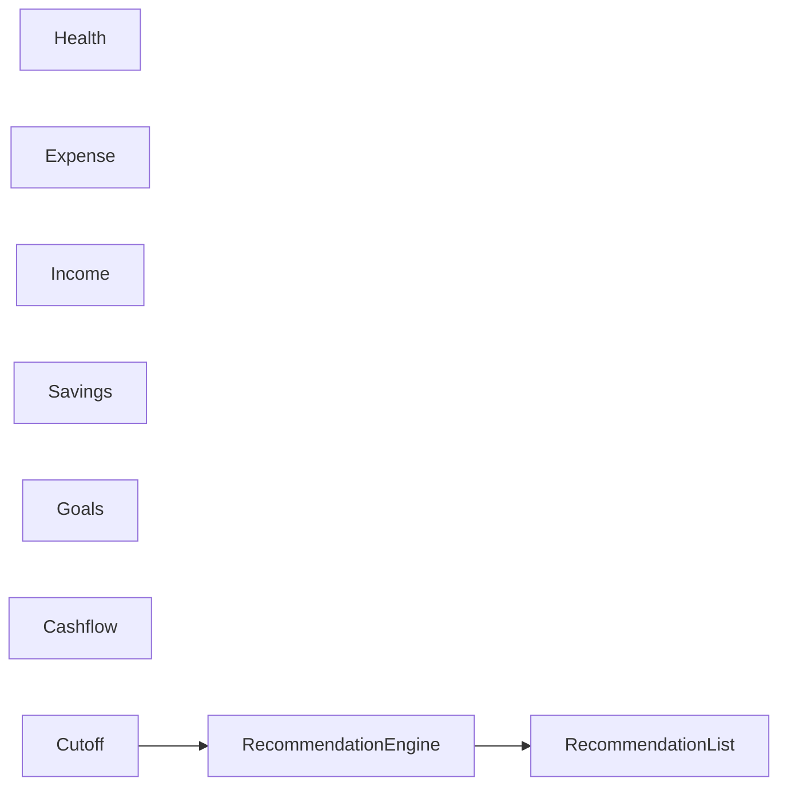

---

## Why?

Because recommendations should depend on conclusions.

Not raw data.

---

## Example

Instead of

```text
Expense = 14,000
```

Recommendation Engine receives

```text
Expense Rate = 72%

Largest Category = Food

Savings Rate = 6%
```

This dramatically simplifies recommendation logic.

---

## Recommendation Lifecycle

```mermaid
sequenceDiagram

participant Engines

participant RecommendationEngine

participant Bundle

Engines->>RecommendationEngine

RecommendationEngine->>RecommendationEngine

RecommendationEngine-->>Bundle
```

---

## Recommendation Structure

Each recommendation contains

```text
Priority

Severity

Category

Title

Explanation

Action

Destination
```

---

## Example

```text
Priority

HIGH

Severity

Warning

Title

Increase Savings

Reason

Savings rate is below 10%.

Action

Add Savings

Destination

/savings
```

---

# 29. Summary Generation Engine

## Purpose

Transform insights into readable summaries.

This is **not AI**.

The Summary Engine is deterministic.

---

## Input

```text
Health

Recommendations

Expense

Income

Savings

Cashflow
```

---

## Output

```text
Current Cutoff Summary

Monthly Summary

Historical Summary
```

---

## Sequence Diagram

```mermaid
sequenceDiagram

participant RecommendationEngine

participant SummaryEngine

participant Bundle

RecommendationEngine->>SummaryEngine

SummaryEngine->>SummaryEngine

SummaryEngine-->>Bundle
```

---

## Example Summary

```text
You saved 22% of your income this cutoff.

Food remains your largest expense category.

You contributed to all active savings goals.

Your cashflow remains positive with ₱8,200 available.
```

Every sentence originates from rules.

Never AI.

---

# 30. Dashboard Integration

## Philosophy

Dashboard becomes a presentation layer.

It never computes.

---

## Sequence Diagram

```mermaid
sequenceDiagram

Dashboard->>useInsights

useInsights->>InsightService

InsightService-->>useInsights

useInsights-->>Dashboard

Dashboard-->>User
```

---

## Dashboard Responsibilities

Display

* Health Score
* Current Summary
* Top Recommendations
* Financial Snapshot

Nothing else.

---

# 31. Reports Integration

Reports remain analytical.

Reports never calculate recommendations.

Instead

```text
Reports

↓

InsightBundle

↓

Summary

↓

Display
```

Reports become consumers.

---

# 32. Cashflow Integration

Cashflow currently calculates metrics.

After Phase 11A

it also displays

* Remaining Cash Insight
* Spending Pace
* Utilization Analysis
* Cashflow Stability

These come directly from the engine.

---

# 33. Salary Cutoff Integration

Salary Cutoff receives

* Cutoff Performance

* Spending Pace

* Savings Pace

* Cutoff Summary

The page never calculates them.

---

# 34. Insight Lifecycle

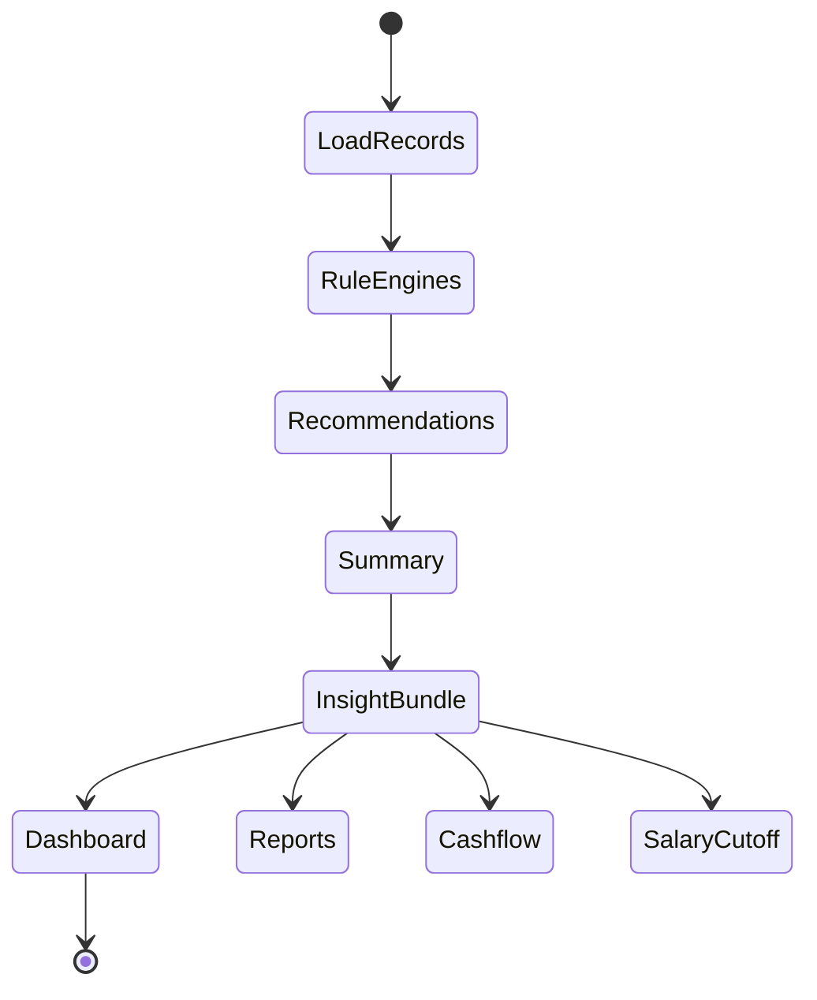

---

# 35. Design Rules

Every financial engine must obey:

---

## Rule 1

Own exactly one responsibility.

---

## Rule 2

Never communicate with React.

---

## Rule 3

Never query IndexedDB.

---

## Rule 4

Consume normalized financial data only.

---

## Rule 5

Produce deterministic outputs.

---

## Rule 6

Be individually testable.

---

## Rule 7

Never duplicate another engine's responsibility.

---

# 36. Future Compatibility

The engine architecture intentionally supports future features without redesign.

Examples:

```text
Can I Buy This?

↓

uses Health + Cashflow + Recommendations
```

```text
Retirement Planning

↓

uses Savings + Goals + Summary
```

```text
Subscription Analysis

↓

uses Expense Engine
```

```text
AI Financial Coach

↓

uses InsightBundle
```

No existing engines need modification.

New engines simply plug into the pipeline.

---

# Part III Summary

Part III defines the operational architecture of PesoPilot's Financial Intelligence Platform.

The architecture is composed of specialized engines that each own a single analytical responsibility:

* Health Engine
* Expense Intelligence
* Income Intelligence
* Savings Intelligence
* Goal Intelligence
* Cashflow Intelligence
* Cutoff Intelligence

These engines feed a Recommendation Engine, which in turn feeds a deterministic Summary Generator. The resulting InsightBundle becomes the single source of truth consumed by the Dashboard, Reports, Cashflow, Salary Cutoff, and eventually the Spring Boot AI layer.

This layered approach ensures that business intelligence remains deterministic, modular, testable, and reusable while keeping all presentation layers free from financial calculation logic.

---

**End of Part III**

**Next Document Section:** **Part IV — Spring Boot AI Architecture, Ollama Integration, AI Safety, Testing Strategy & Future Roadmap**


# 00 — PesoPilot v2.0 Source of Truth (Part IV)

> **Document Version:** 2.0.0
> **Status:** Draft (Architecture Freeze Pending)
> **Section:** Spring Boot AI Architecture, Ollama Integration, AI Safety, Testing Strategy & Future Roadmap

---

# 37. Purpose of Phase 11B

## Vision

Phase 11A transforms financial records into deterministic financial intelligence.

Phase 11B transforms that intelligence into natural conversations.

The distinction is fundamental.

```text id="yw3w0z"
Phase 11A

Calculates

↓

Phase 11B

Explains
```

The backend never becomes another calculation engine.

Instead, it becomes an orchestration layer that communicates with AI models while preserving the integrity of PesoPilot's financial logic.

---

# 38. Overall AI Architecture

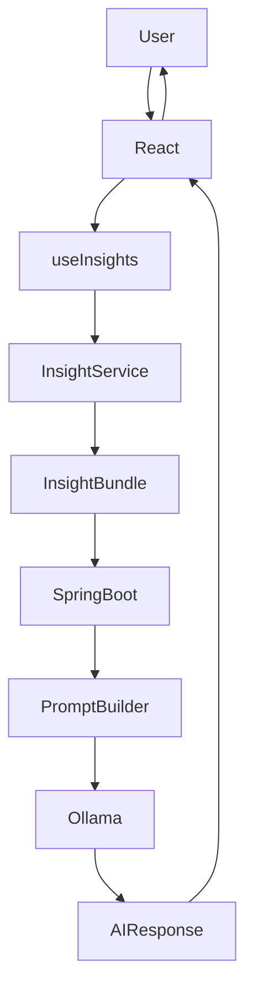

---

## Philosophy

The Rule Engine remains the source of financial truth.

Spring Boot never computes financial metrics.

Ollama never computes financial metrics.

Neither component has direct access to financial records.

---

# 39. Spring Boot Architecture

## Purpose

Spring Boot serves as the orchestration layer between the frontend and the local language model.

Responsibilities:

* receive InsightBundle
* validate request
* build prompts
* communicate with Ollama
* parse responses
* return structured AI output

Responsibilities explicitly excluded:

* expense calculations
* health score
* recommendation generation
* report calculations
* repository access
* IndexedDB access

---

## Module Structure

```text id="3ckbqz"
pesopilot-api/

src/main/java/com/pesopilot/

├── ai/

│   ├── controller/

│   │   AiSummaryController.java

│   ├── service/

│   │   AiSummaryService.java

│   │   PromptBuilder.java

│   │   OllamaClient.java

│   ├── dto/

│   │   InsightBundleRequest.java

│   │   AiSummaryResponse.java

│   ├── config/

│   │   OllamaConfiguration.java

│   ├── exception/

│   └── tests/
```

---

## Clean Architecture

```mermaid id="hdkjgc"
graph TD

Controller

↓

Service

↓

Prompt Builder

↓

Ollama Client

↓

Ollama
```

---

# 40. InsightBundle Contract

Spring Boot receives only one object.

```text id="zcot4m"
InsightBundle
```

Nothing else.

Not repositories.

Not transactions.

Not IndexedDB.

Not React state.

---

## Request Flow

```mermaid id="8cpcu9"
sequenceDiagram

React->>SpringBoot: POST InsightBundle

SpringBoot->>PromptBuilder

PromptBuilder->>Ollama

Ollama-->>PromptBuilder

PromptBuilder-->>SpringBoot

SpringBoot-->>React
```

---

## Example Request

```json
{
  "scope": "current_cutoff",
  "generatedAt": "2026-07-01T10:00:00Z",

  "health": {
    "score": 87,
    "status": "Healthy"
  },

  "income": {},

  "expenses": {},

  "savings": {},

  "recommendations": [],

  "summary": {}
}
```

The payload intentionally contains conclusions rather than raw financial records.

---

# 41. Prompt Builder

## Purpose

The Prompt Builder translates structured financial intelligence into safe prompts for the language model.

It is responsible for:

* prompt construction
* prompt formatting
* prompt constraints
* prompt versioning

It is not responsible for:

* calculations
* recommendations
* financial decisions

---

## Prompt Pipeline

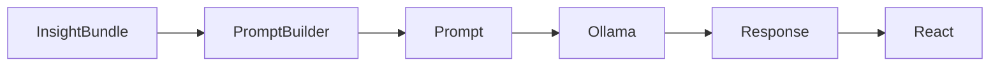

---

## Prompt Template

The Prompt Builder should always prepend system instructions such as:

```text id="2gvm2v"
You are PesoPilot's financial explanation assistant.

Use only the provided financial data.

Never invent transactions.

Never estimate missing values.

Never calculate new financial metrics.

Never provide investment advice.

Never provide legal advice.

Never provide tax advice.

Explain the financial information clearly, accurately, and neutrally.
```

---

# 42. Ollama Integration

## Purpose

Ollama acts as the local language model.

Its responsibility is to generate natural language explanations.

It never owns business logic.

---

## Sequence Diagram

```mermaid id="3dlwpk"
sequenceDiagram

SpringBoot->>PromptBuilder

PromptBuilder->>Ollama

Ollama-->>PromptBuilder

PromptBuilder-->>SpringBoot

SpringBoot-->>React
```

---

## Model Independence

PesoPilot must never become coupled to a specific language model.

```text id="zshodq"
Today

↓

Ollama

↓

Tomorrow

↓

OpenAI

↓

Gemini

↓

Claude

↓

Azure OpenAI
```

Only the client implementation changes.

The Rule Engine remains untouched.

---

# 43. AI Safety Principles

## Principle 1

AI explains.

AI never calculates.

---

## Principle 2

AI only uses InsightBundle.

No raw financial records.

---

## Principle 3

AI never invents information.

---

## Principle 4

AI never overrides the Rule Engine.

---

## Principle 5

When AI is uncertain,

it should explicitly state uncertainty.

---

## Allowed AI Behavior

```text id="kik8g5"
Summarize

Explain

Simplify

Encourage

Clarify

Educate
```

---

## Forbidden AI Behavior

```text id="5lq8tt"
Invent transactions

Invent totals

Guess income

Recommend investments

Provide tax advice

Provide legal advice

Replace Health Score

Modify recommendations
```

---

# 44. AI Failure Handling

AI services are optional.

The application must continue functioning without AI.

---

## Architecture

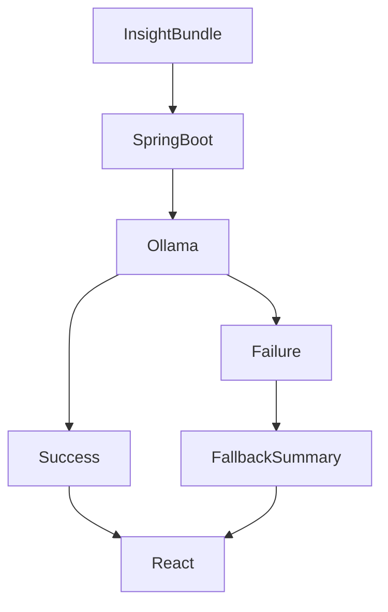

---

## Fallback Strategy

If AI fails:

Display:

```text id="j6gokg"
AI explanations are currently unavailable.

Your financial insights remain available through the Rule Engine.
```

The application must never lose financial functionality because AI is unavailable.

---

# 45. Testing Strategy

Testing is divided into four layers.

---

## Layer 1

Rule Engine

Unit tests.

Every financial calculation.

---

## Layer 2

Insight Service

Integration tests.

InsightBundle generation.

---

## Layer 3

Frontend

React integration.

Dashboard

Reports

Cashflow

Salary Cutoff

---

## Layer 4

Spring Boot

Controller

Prompt Builder

Ollama Client

DTO validation

---

## Testing Pyramid

```mermaid id="jlwmvh"
graph TD

E2E

↓

Integration

↓

Service

↓

Rule Engine
```

Most testing effort belongs in Rule Engine modules.

---

# 46. Documentation Strategy

Future documentation follows the same layered approach.

```text id="l08vju"
Source of Truth

↓

Architecture

↓

Subsystem

↓

Implementation

↓

Testing
```

Every document references the Source of Truth.

No architecture should be duplicated across multiple documents.

---

# 47. Future Roadmap

The architecture intentionally supports future intelligence modules.

---

## Financial Coach

```text id="nsgqdb"
InsightBundle

↓

AI Coach

↓

Conversation
```

---

## Can I Buy This?

Consumes:

* Health Score
* Remaining Cash
* Cashflow
* Goals

No new financial calculations.

---

## Retirement Planning

Consumes:

* Savings
* Goals
* Cashflow

---

## Subscription Intelligence

Consumes:

Expense Engine.

---

## Spending Forecast

Consumes:

Expense Trends

Cashflow Trends

Savings Trends

Still built on the Rule Engine.

---

## Cloud Sync

Replace:

```text id="u9jlwm"
IndexedDB
```

with

```text id="wvt4g8"
Cloud Repository
```

Rule Engine remains unchanged.

---

## Mobile Application

```text id="66d1d3"
Flutter

↓

InsightBundle API

↓

Same Intelligence Engine
```

No duplicate business logic.

---

# 48. Long-Term Vision

PesoPilot evolves through three stages.

---

## Stage 1

Finance Tracking

```text id="oep21g"
Record

Organize

Report
```

---

## Stage 2

Financial Intelligence

```text id="t8bkxa"
Analyze

Recommend

Summarize

Coach
```

---

## Stage 3

Personal Financial Platform

```text id="d5x2jc"
Cross-device

Cloud

AI Coach

Planning

Automation

Forecasting
```

Each stage builds upon the previous one without replacing it.

---

# 49. Architecture Freeze Policy

Once Phase 11A Architecture is approved:

The following become architectural contracts:

* InsightBundle
* Rule Engine
* Engine responsibilities
* Dependency rules
* Prompt Builder boundary
* Spring Boot boundary

Future changes should extend these contracts rather than redesign them.

Breaking architectural contracts requires updating the Source of Truth before implementation.

---

# 50. Final Architecture Overview

```mermaid id="0yxtwy"
graph TD

User

--> React

React

--> useInsights

useInsights

--> InsightService

InsightService

--> RuleEngine

RuleEngine

--> Health

RuleEngine

--> Expenses

RuleEngine

--> Income

RuleEngine

--> Savings

RuleEngine

--> Goals

RuleEngine

--> Cashflow

RuleEngine

--> Cutoffs

Health --> Recommendations

Expenses --> Recommendations

Income --> Recommendations

Savings --> Recommendations

Goals --> Recommendations

Cashflow --> Recommendations

Cutoffs --> Recommendations

Recommendations --> Summary

Summary --> InsightBundle

InsightBundle --> Dashboard

InsightBundle --> Reports

InsightBundle --> Cashflow

InsightBundle --> SalaryCutoff

InsightBundle --> SpringBoot

SpringBoot --> PromptBuilder

PromptBuilder --> Ollama

Ollama --> Narrative

Narrative --> User
```

---

# Source of Truth Summary

The PesoPilot v2.0 architecture is founded on one core principle:

> **Financial intelligence must be deterministic, explainable, and reusable.**

To achieve this:

* The Rule Engine is the sole producer of financial intelligence.
* Every insight is derived from real financial records through deterministic business rules.
* The InsightBundle is the single contract consumed by all presentation layers.
* Spring Boot orchestrates AI interactions but never performs financial calculations.
* Ollama (or any future LLM) explains insights rather than generating them.
* The architecture cleanly separates financial logic, presentation, and AI narration, ensuring that future capabilities—such as conversational coaching, cloud synchronization, forecasting, and mobile applications—can be added without compromising the integrity of the financial intelligence engine.

This Source of Truth serves as the architectural foundation for PesoPilot v2.0 and should be treated as the governing reference for all future development of the Financial Intelligence Platform.

---

**End of Part IV**

**End of Document: 00 — PesoPilot v2.0 Source of Truth**