# 01 — Rule-Based Financial Intelligence Architecture

> **Document Version:** 2.0.0
> **Status:** Draft — Architecture Review Pending
> **Parent Document:** `00-PesoPilot-v2.0-Source-of-Truth.md`
> **Phase:** Phase 11A — Rule-Based Financial Intelligence
> **Owner:** Kenneth Vier Cerrado
> **Last Updated:** June 2026

---

# 1. Purpose

This document defines the technical architecture of PesoPilot's Rule-Based Financial Intelligence Platform.

The Source of Truth document defines the **vision and philosophy** of PesoPilot v2.0. This document defines the **engineering blueprint** for how that vision is implemented.

It explains:

* how financial records become insights,
* how insight modules interact,
* where calculations belong,
* how pages consume intelligence,
* how recommendations are generated,
* how summaries are built,
* and how the system remains compatible with the future Spring Boot + Ollama AI layer.

This document is the primary reference for implementing **Phase 11A**.

---

# 2. Architecture Goals

The Financial Intelligence Platform must satisfy the following goals.

## 2.1 Deterministic Intelligence

Given the same financial data, PesoPilot must always produce the same insights.

```txt
Same data
↓
Same rules
↓
Same InsightBundle
```

No randomness, model inference, or external AI calls are allowed in Phase 11A.

---

## 2.2 Explainable Financial Logic

Every insight must be traceable to a rule.

A user should be able to understand why PesoPilot generated a recommendation.

Example:

```txt
Recommendation:
Review food spending.

Reason:
Food accounts for 42% of current cutoff expenses.
```

---

## 2.3 Centralized Financial Intelligence

No page should calculate financial intelligence directly.

Correct:

```txt
Dashboard
↓
useInsights()
↓
insightService
↓
Rule Engine
```

Incorrect:

```txt
Dashboard
↓
calculate health score
↓
calculate top category
↓
calculate recommendation
```

---

## 2.4 AI-Ready Architecture

Phase 11A must produce structured insight data that Phase 11B can pass to Spring Boot and Ollama.

The AI layer must receive conclusions, not raw financial records.

```txt
Rule Engine
↓
InsightBundle
↓
Spring Boot
↓
Ollama
```

---

# 3. Architectural Constraints

The architecture must respect all current PesoPilot MVP constraints.

## 3.1 Local-First

The primary data source remains:

```txt
IndexedDB via Dexie
```

Phase 11A does not introduce cloud sync or backend persistence.

---

## 3.2 Existing Feature Services Remain Authoritative

The Insight Engine must use existing feature services or normalized read models.

It must not bypass the application architecture by directly querying Dexie from UI code.

---

## 3.3 No Backend in Phase 11A

Phase 11A is frontend-only.

No Spring Boot.

No Ollama.

No HTTP API.

No external AI calls.

---

## 3.4 No Financial Logic in AI

Future AI must not calculate:

* health score,
* income totals,
* savings rate,
* expense trends,
* recommendations,
* cutoff performance.

Those remain owned by the Rule Engine.

---

# 4. Financial Intelligence Platform

The Financial Intelligence Platform is the layer that turns financial records into financial understanding.

## 4.1 Input

The platform consumes existing PesoPilot financial data:

```txt
Income
Expenses
Savings Contributions
Savings Goals
Salary Cutoffs
Categories
Cashflow Data
```

---

## 4.2 Processing

The platform processes data through specialized rule engines:

```txt
Health Rules
Expense Rules
Income Rules
Savings Rules
Goal Rules
Cashflow Rules
Cutoff Rules
Recommendation Rules
Summary Rules
```

---

## 4.3 Output

The platform produces one central object:

```txt
InsightBundle
```

This object is consumed by:

* Dashboard
* Reports
* Cashflow
* Salary Cutoff
* future Insights Page
* future Spring Boot AI API
* future Ollama narrative layer

---

# 5. Platform Layers

The architecture is organized into eight conceptual layers.

```txt
Layer 1 — Financial Records
Layer 2 — Data Loading
Layer 3 — Normalization
Layer 4 — Rule Engines
Layer 5 — Recommendation Engine
Layer 6 — Summary Generator
Layer 7 — InsightBundle
Layer 8 — Presentation / AI Narrative
```

---

## 5.1 Layer Diagram

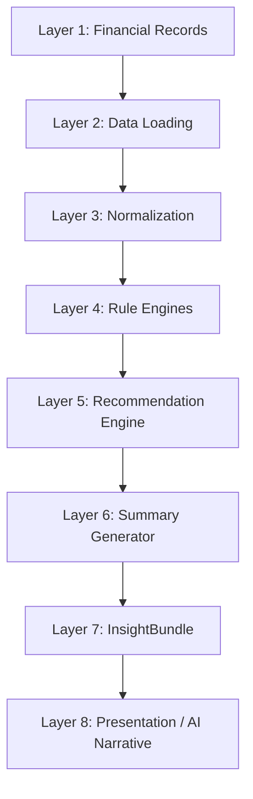

---

## 5.2 Layer Responsibilities

| Layer                       | Responsibility                    | Calculates?               |
| --------------------------- | --------------------------------- | ------------------------- |
| Financial Records           | Store user data                   | No                        |
| Data Loading                | Retrieve data                     | No                        |
| Normalization               | Prepare consistent input          | Minimal transformation    |
| Rule Engines                | Analyze financial data            | Yes                       |
| Recommendation Engine       | Create actions from rule outputs  | Yes                       |
| Summary Generator           | Format deterministic summaries    | Yes                       |
| InsightBundle               | Transport structured insight data | No                        |
| Presentation / AI Narrative | Display or explain results        | No financial calculations |

---

# 6. System Context Diagram

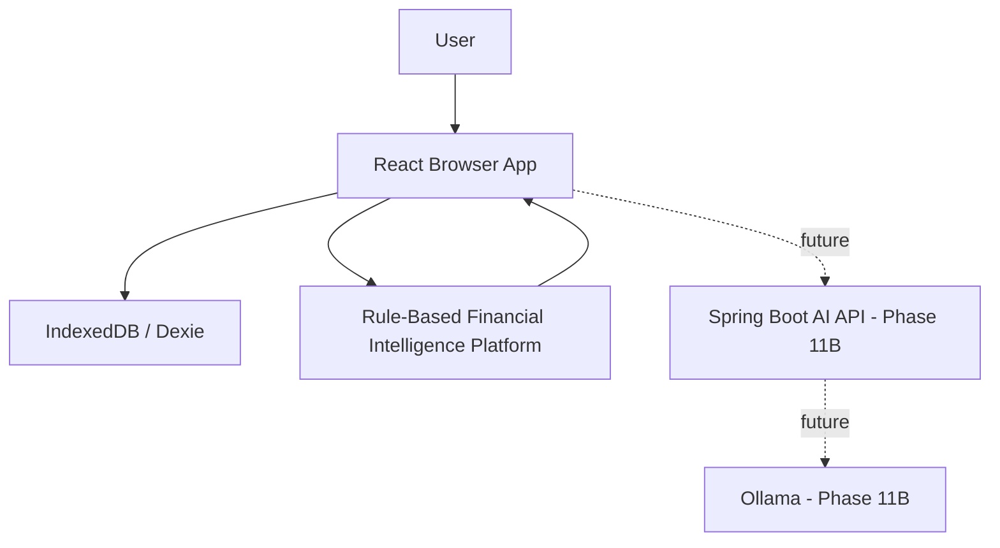

---

# 7. High-Level Architecture

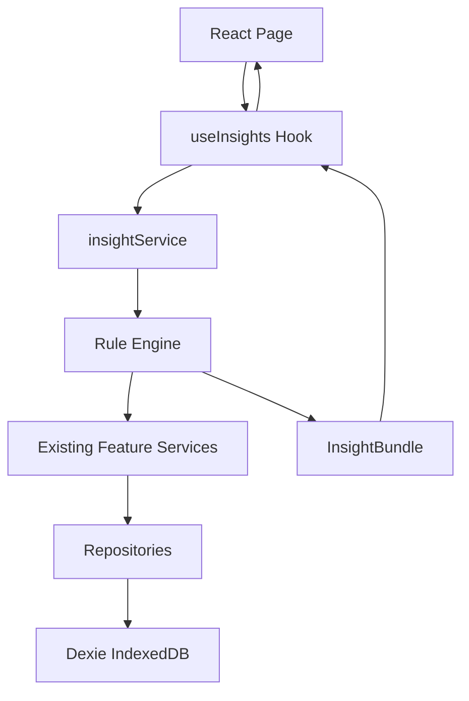

---

# 8. Core Components

## 8.1 React Pages

Examples:

* Dashboard
* Cashflow
* Income
* Salary Cutoff
* Reports
* future Insights Page

Responsibilities:

* render insight data,
* show loading states,
* show error states,
* trigger refresh,
* navigate users.

Pages must not calculate financial intelligence.

---

## 8.2 `useInsights`

The hook owns UI-facing insight state.

Responsibilities:

* call `insightService`,
* manage loading state,
* manage error state,
* expose refresh behavior,
* provide the `InsightBundle`.

It must not contain business rules.

---

## 8.3 `insightService`

The service is the orchestration layer.

Responsibilities:

* load required financial data,
* normalize data,
* call rule engines,
* call recommendation engine,
* call summary generator,
* assemble the final `InsightBundle`.

It coordinates but should not contain complex financial formulas.

---

## 8.4 Rule Engine

The Rule Engine is the calculation layer.

Responsibilities:

* analyze financial data,
* produce deterministic insight sections,
* provide explainable breakdowns,
* return structured outputs.

Every financial calculation belongs here.

---

## 8.5 Recommendation Engine

The Recommendation Engine consumes rule outputs.

It does not read raw financial records.

It produces actionable recommendations based on already-computed conclusions.

---

## 8.6 Summary Generator

The Summary Generator creates deterministic text summaries.

It does not use AI.

Every sentence should come from a rule output.

---

## 8.7 InsightBundle

The InsightBundle is the central contract.

It is the only output consumed by presentation layers and the future AI backend.

---

# 9. Intelligence Pipeline

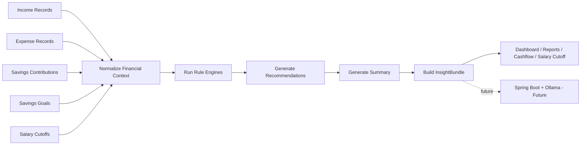

---

# 10. Rule Engine Architecture

The Rule Engine is composed of specialized modules.

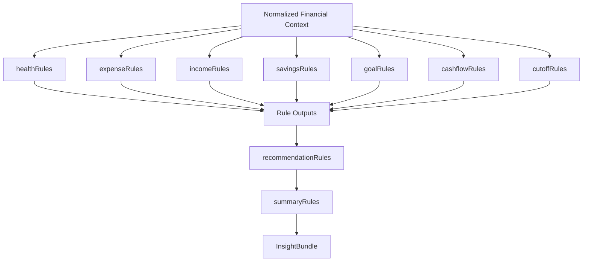

---

# 11. Rule Module Responsibilities

## 11.1 Health Rules

Responsible for:

* health score,
* health status,
* health breakdown,
* health explanation.

Must not generate final recommendations.

---

## 11.2 Expense Rules

Responsible for:

* top spending category,
* category distribution,
* largest expense,
* largest merchant,
* spending pace,
* expense trend.

---

## 11.3 Income Rules

Responsible for:

* total income,
* missing income detection,
* income source breakdown,
* income trend,
* income comparison.

---

## 11.4 Savings Rules

Responsible for:

* savings total,
* savings rate,
* contribution count,
* savings trend,
* savings consistency.

---

## 11.5 Goal Rules

Responsible for:

* goal progress,
* goal completion,
* remaining amount,
* goals without contributions,
* latest contribution.

---

## 11.6 Cashflow Rules

Responsible for:

* remaining cash,
* net cashflow,
* cashflow status,
* spending pace,
* income coverage,
* savings coverage.

---

## 11.7 Cutoff Rules

Responsible for:

* current vs previous cutoff,
* cutoff performance,
* best cutoff,
* worst cutoff,
* trend direction.

---

## 11.8 Recommendation Rules

Responsible for:

* actionable recommendations,
* severity,
* priority,
* category grouping,
* navigation action.

Consumes rule outputs only.

---

## 11.9 Summary Rules

Responsible for:

* current cutoff summary,
* monthly summary,
* historical summary,
* deep dive text.

Consumes rule outputs and recommendations.

---

# 12. InsightBundle Lifecycle

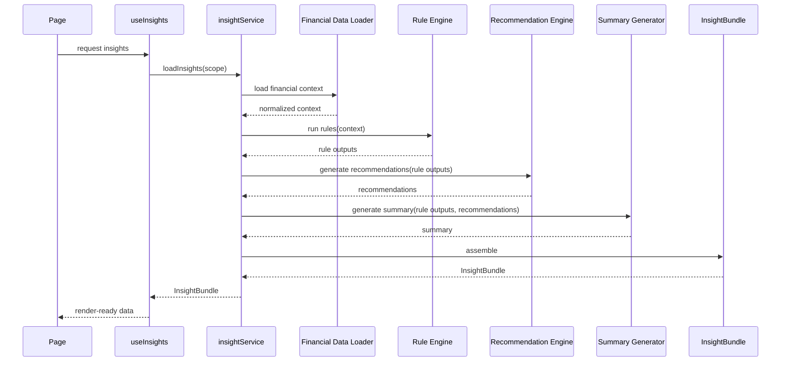

---

# 13. Frontend Consumption Sequence

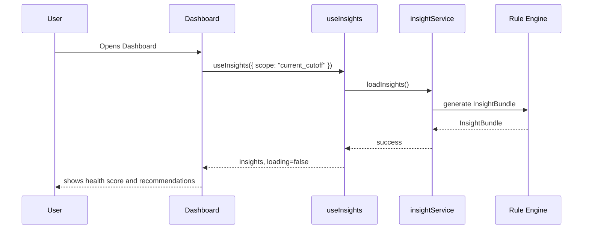

---

# 14. Reports Consumption Sequence

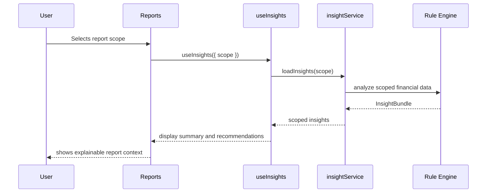

---

# 15. Future AI Narrative Sequence

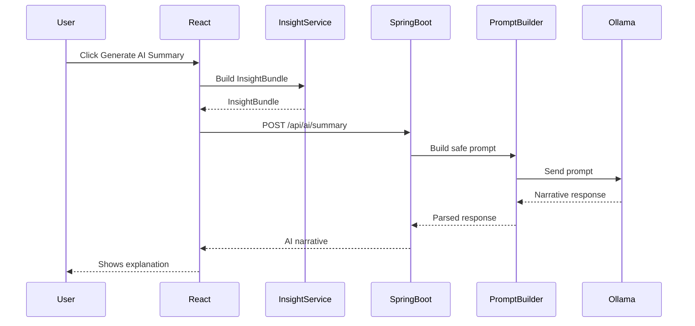

---

# 16. Dependency Rules

## 16.1 Allowed Dependency Direction

```txt
Page
↓
Hook
↓
Service
↓
Rule Engine
↓
Existing Feature Services
↓
Repository
↓
Dexie
```

---

## 16.2 Forbidden Dependencies

Pages must not depend on:

* repositories,
* Dexie,
* financial rule modules,
* health score formulas.

Rule modules must not depend on:

* React,
* hooks,
* UI components,
* routing,
* browser storage.

Recommendation modules must not depend on:

* repositories,
* raw database access,
* React components.

Spring Boot must not depend on:

* Dexie,
* browser storage,
* raw financial records.

Ollama must not depend on:

* raw transactions,
* financial formulas,
* user database.

---

# 17. Component Responsibility Matrix

| Component             | Responsibility          |            May Calculate? | May Render UI? |
| --------------------- | ----------------------- | ------------------------: | -------------: |
| React Page            | Presentation            |                        No |            Yes |
| Hook                  | State orchestration     |                        No |             No |
| insightService        | Orchestration           |                   Minimal |             No |
| Rule Module           | Financial calculations  |                       Yes |             No |
| Recommendation Engine | Recommendations         |                       Yes |             No |
| Summary Generator     | Deterministic summaries |                       Yes |             No |
| InsightBundle         | Data contract           |                        No |             No |
| Spring Boot           | AI orchestration        | No financial calculations |             No |
| Ollama                | Narrative               | No financial calculations |             No |

---

# 18. Architecture Decision Records

## ADR-001 — Rule-Based Intelligence Before AI

### Decision

PesoPilot must implement deterministic rule-based intelligence before integrating AI.

### Rationale

Financial applications require trust, explainability, and repeatability. AI models can hallucinate or produce inconsistent outputs. Therefore, financial conclusions must be calculated by rules first.

### Consequence

Phase 11A is frontend-only and deterministic. Phase 11B may use AI only for narrative generation.

---

## ADR-002 — InsightBundle as the Single Contract

### Decision

All financial intelligence must be packaged into one central `InsightBundle`.

### Rationale

A single contract prevents duplicated calculations across Dashboard, Reports, Cashflow, and future AI modules.

### Consequence

Every consumer reads from the same structured output.

---

## ADR-003 — Specialized Rule Modules

### Decision

Financial intelligence must be split into specialized rule modules.

### Rationale

Single-purpose rule modules improve testability, maintainability, and future extension.

### Consequence

Health, expense, income, savings, goals, cashflow, and cutoff logic remain isolated.

---

## ADR-004 — Recommendation Engine Consumes Rule Outputs

### Decision

Recommendations must be generated from rule outputs, not raw records.

### Rationale

Recommendations should be based on conclusions, not repeated calculations.

### Consequence

Recommendation rules stay simpler and more reliable.

---

## ADR-005 — Spring Boot Does Not Calculate Financial Metrics

### Decision

The backend AI module must not calculate financial values.

### Rationale

Business logic remains deterministic, testable, and frontend-local.

### Consequence

Spring Boot receives `InsightBundle` and builds prompts only.

---

## ADR-006 — Ollama Only Explains

### Decision

The LLM explains existing insights but never generates financial facts.

### Rationale

LLMs can hallucinate. Financial data must remain rule-based.

### Consequence

Prompt templates must restrict the model to provided insight data.

---

# 19. Quality Attributes

| Attribute       | Goal                            | Architecture Support      |
| --------------- | ------------------------------- | ------------------------- |
| Determinism     | Same input produces same output | Rule Engine               |
| Explainability  | Every insight has reason        | Insight breakdowns        |
| Maintainability | Easy to modify                  | Specialized modules       |
| Testability     | High coverage                   | Pure rule functions       |
| Extensibility   | Add new engines safely          | Modular pipeline          |
| Performance     | Fast local execution            | Client-side calculation   |
| Privacy         | User data stays local           | IndexedDB and local rules |
| AI independence | Swap LLMs safely                | InsightBundle boundary    |
| Reusability     | Use insights across pages       | Single service contract   |

---

# 20. Error Handling

## 20.1 Data Loading Errors

If financial data cannot be loaded:

* `useInsights` returns an error state,
* UI displays an `ErrorState`,
* no partial fake insights are shown.

---

## 20.2 Empty Data

Empty data is not an error.

Example:

```txt
No income recorded
```

should generate a valid insight, not a failure.

---

## 20.3 Missing Current Cutoff

Missing current cutoff should produce:

* no-current-cutoff insight,
* recommendation to create a cutoff,
* no crash.

---

## 20.4 Rule Failure

A rule module failure should be isolated when possible.

The system may return:

```txt
insight unavailable
```

for that section while preserving other sections.

---

# 21. Performance Strategy

Phase 11A is client-side.

Performance principles:

* avoid repeated full recomputation,
* compute from already-loaded records,
* keep rule modules pure,
* memoize at hook/service level only when necessary,
* avoid storing derived values unless explicitly required.

---

## 21.1 Expected Data Size

The MVP should comfortably support:

```txt
hundreds to low thousands of local records
```

Client-side insights are acceptable at this scale.

---

## 21.2 Future Scaling

If future data grows significantly, the architecture can evolve by:

* adding caching,
* adding repository-backed aggregation,
* moving rule computation to a backend,
* or syncing InsightBundle generation across devices.

The contract remains stable.

---

# 22. Extension Guidelines

When adding a new insight type:

1. Add a rule module or extend an existing one.
2. Add tests first.
3. Add output to the appropriate InsightBundle section.
4. Add recommendation rules only if actionable.
5. Add UI display only after rule output is stable.
6. Do not calculate in components.
7. Do not send raw records to AI.

---

# 23. Example Extension: Subscription Intelligence

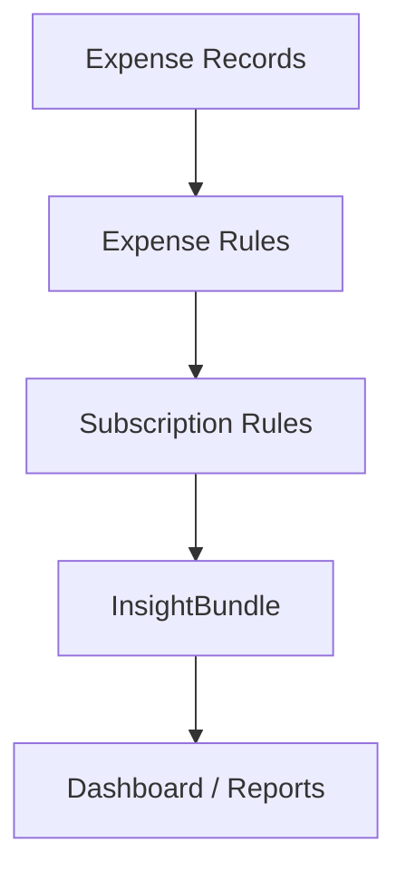

Subscription Intelligence could be added without changing the Health Engine or AI architecture.

---

# 24. Example Extension: Can I Buy This?

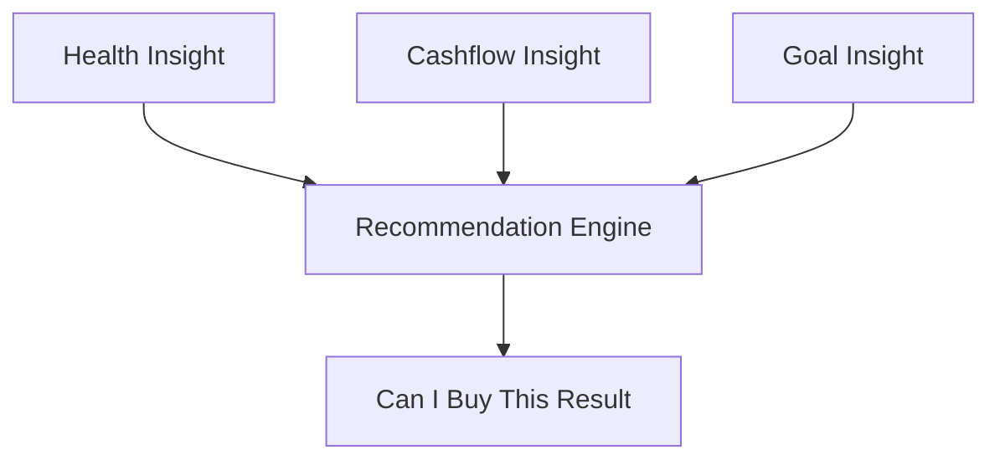

This feature consumes existing insight outputs instead of recalculating the user's finances.

---

# 25. Implementation Boundary

This document defines architecture only.

It does not implement:

* health score formula,
* individual rule thresholds,
* exact DTO fields,
* React component design,
* Spring Boot controllers,
* Ollama prompts.

Those belong to later documents.

---

# 26. Acceptance Criteria for Architecture

The architecture is accepted when:

* all intelligence flows through `insightService`,
* all calculations live in rule modules,
* all consumers use `InsightBundle`,
* no page duplicates insight logic,
* recommendations consume rule outputs,
* summaries consume rule outputs,
* AI receives `InsightBundle` only,
* rule modules are independently testable.

---

# 27. Summary

The Rule-Based Financial Intelligence Architecture establishes PesoPilot's financial reasoning system.

It defines a deterministic pipeline:

```txt
Financial Records
↓
Normalization
↓
Rule Engines
↓
Recommendation Engine
↓
Summary Generator
↓
InsightBundle
↓
Presentation / AI Narrative
```

This architecture ensures that PesoPilot can evolve from a local-first finance tracker into a trustworthy financial intelligence platform without sacrificing explainability, privacy, or maintainability.

Every financial conclusion originates from deterministic rules.

Every AI narrative originates from verified insight data.

Every UI page consumes the same central contract.

That separation is the foundation of PesoPilot v2.0.

---

**End of Document — 01 Rule-Based Financial Intelligence Architecture**
