# 02 — InsightBundle & Data Contracts (Part I)

> **Document Version:** 2.0.0
> **Status:** Draft — Architecture Review Pending
> **Parent Documents:**
>
> * `00-PesoPilot-v2.0-Source-of-Truth.md`
> * `01-Rule-Based-Financial-Intelligence-Architecture.md`
>
> **Phase:** Phase 11A — Rule-Based Financial Intelligence
>
> **Section:** InsightBundle Overview & Core Contracts

---

# 1. Purpose

This document defines the **InsightBundle**, the single contract used by every financial intelligence consumer inside PesoPilot.

Unlike Document 01, which explains the architecture, this document specifies the actual data contract exchanged between every layer of the Financial Intelligence Platform.

The InsightBundle represents the final product of the Rule Engine.

Every consumer—including Dashboard, Reports, Cashflow, Salary Cutoff, future Spring Boot services, and future AI models—must rely on this contract rather than recalculating financial intelligence independently.

---

# 2. Scope

This document defines:

* InsightBundle structure
* Bundle generation lifecycle
* Metadata contract
* Scope contract
* Immutable data rules
* Bundle ownership
* Generation responsibilities
* Consumer responsibilities
* Versioning foundation

This document intentionally does **not** define:

* Health score formulas
* Expense calculations
* Recommendation rules
* Summary algorithms

Those belong to later architecture documents.

---

# 3. Design Goals

The InsightBundle was designed to satisfy the following engineering goals.

---

## 3.1 Single Source of Truth

Every page must consume the exact same intelligence.

Incorrect:

```text
Dashboard calculates Health Score

Reports calculate Health Score

Cashflow calculates Health Score
```

Correct:

```text
Rule Engine

↓

InsightBundle

↓

Dashboard

Reports

Cashflow

Salary Cutoff
```

Only one calculation exists.

---

## 3.2 Immutable Intelligence

Once generated,

the InsightBundle becomes read-only.

No consumer is allowed to modify it.

Instead,

a refresh requests an entirely new bundle.

---

## 3.3 Explainability

Every value inside the bundle should be explainable.

For example,

```text
Health Score

↓

Breakdown

↓

Reason
```

rather than

```text
Health Score = 84

(no explanation)
```

---

## 3.4 Reusability

The same bundle should be usable by:

* Dashboard
* Reports
* Cashflow
* Salary Cutoff
* AI Summary
* Spring Boot
* Flutter
* Future APIs

without modification.

---

## 3.5 Forward Compatibility

Future versions should allow new insight sections without breaking existing consumers.

---

# 4. InsightBundle Philosophy

The InsightBundle is not simply a collection of data.

It represents the complete financial understanding of a user's selected scope.

Think of it as a financial snapshot.

Instead of asking:

> "How much income exists?"

the bundle answers:

> "What is the financial situation?"

---

## Philosophy Diagram

```mermaid
flowchart LR

Records[Financial Records]

↓

Rules[Rule Engines]

↓

Insights[Financial Intelligence]

↓

Bundle[InsightBundle]

↓

Consumers[Dashboard / Reports / AI]
```

---

# 5. InsightBundle Overview

The bundle contains multiple specialized insight sections.

Each section is independently generated.

```text
InsightBundle

├── metadata

├── health

├── income

├── expenses

├── savings

├── goals

├── cashflow

├── cutoff

├── recommendations

└── summary
```

Every section is optional only during generation.

A completed InsightBundle always contains every section, even if a section has no data.

Example:

```text
recommendations: []

instead of

recommendations: null
```

---

# 6. UML Class Overview

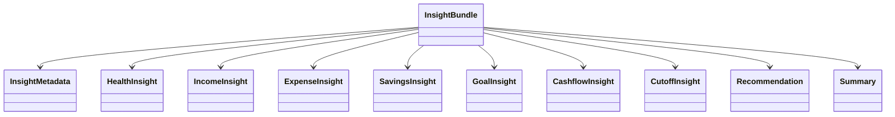

This diagram intentionally omits field definitions.

Those are specified in Part II.

---

# 7. InsightBundle Ownership

Only one service owns bundle generation.

```text
insightService
```

Everything else is a consumer.

---

## Ownership Diagram

```mermaid
graph TD

RuleEngine

↓

InsightService

↓

InsightBundle

↓

Dashboard

Reports

Cashflow

Salary Cutoff

Spring Boot

Flutter
```

---

## Responsibilities

### insightService

Responsible for:

* loading context
* orchestrating rule engines
* assembling bundle
* validating bundle
* returning immutable object

---

### Consumers

Consumers may:

* display
* filter for UI
* sort UI elements
* navigate

Consumers must never:

* recalculate
* mutate
* persist
* overwrite

InsightBundle data.

---

# 8. Bundle Generation Lifecycle

```mermaid
sequenceDiagram

participant Page

participant Hook

participant InsightService

participant RuleEngine

participant Bundle

Page->>Hook: request insights

Hook->>InsightService: loadInsights()

InsightService->>RuleEngine: generate()

RuleEngine-->>InsightService

InsightService->>Bundle: assemble

Bundle-->>InsightService

InsightService-->>Hook

Hook-->>Page
```

---

## Lifecycle Stages

### Stage 1

Load financial context.

---

### Stage 2

Normalize records.

---

### Stage 3

Execute rule engines.

---

### Stage 4

Generate recommendations.

---

### Stage 5

Generate summaries.

---

### Stage 6

Assemble bundle.

---

### Stage 7

Validate bundle.

---

### Stage 8

Return immutable bundle.

---

# 9. Metadata Contract

Every InsightBundle must contain metadata.

Purpose:

* debugging
* compatibility
* future synchronization
* AI context

---

## Metadata Structure

```text
metadata

version

generatedAt

generatorVersion

scope

selectedCutoffId

currentCutoffId

recordCounts

processingTime

warnings
```

---

## Metadata Responsibilities

Metadata does not contain financial intelligence.

Metadata only describes:

* how
* when
* where

the bundle was generated.

---

## Metadata Example

```json
{
  "version": "2.0",

  "generatedAt": "2026-07-01T09:42:16Z",

  "generatorVersion": "11A",

  "scope": "current_cutoff",

  "selectedCutoffId": 12,

  "currentCutoffId": 12,

  "processingTime": 18,

  "warnings": []
}
```

---

# 10. Scope Contract

InsightBundle always represents exactly one scope.

Supported scopes:

```text
all

current_cutoff

specific_cutoff
```

No mixed scopes.

---

## Scope Behavior

### all

Historical intelligence.

All financial records.

---

### current_cutoff

Only current cutoff records.

---

### specific_cutoff

Only selected cutoff records.

---

Consumers should never infer scope.

They must always read it from metadata.

---

# 11. Record Count Contract

Metadata should expose record counts.

Example:

```text
incomeRecords

expenseRecords

savingsRecords

goalRecords

cutoffRecords
```

These values exist for diagnostics only.

They must never be displayed as financial KPIs.

---

# 12. Processing Time Contract

Every bundle should expose generation time.

Purpose:

Future profiling.

Example

```text
processingTime

18 ms
```

This is not user-facing.

---

# 13. Warning Contract

Insight generation may produce warnings.

Examples:

```text
No current cutoff

Missing income

No savings goals

Historical cutoff unavailable
```

Warnings are informational.

They never invalidate the bundle.

---

# 14. Bundle Validation Rules

Before returning,

the bundle must satisfy:

✓ metadata exists

✓ health exists

✓ income exists

✓ expenses exists

✓ savings exists

✓ goals exists

✓ cashflow exists

✓ cutoff exists

✓ recommendations exists

✓ summary exists

Collections must be empty arrays instead of null.

Objects must exist even if values are empty.

---

# 15. Immutable Contract

After generation,

the bundle becomes immutable.

Consumers must never execute:

```text
bundle.health.score = 100
```

or

```text
bundle.recommendations.push(...)
```

Instead,

a new bundle must be generated.

---

## Immutability Diagram

```mermaid
flowchart LR

Generate

↓

InsightBundle

↓

Read Only

↓

Display
```

---

# 16. Consumer Contract

Every consumer agrees to the following.

---

## Allowed

Read.

Display.

Format.

Navigate.

---

## Forbidden

Modify.

Persist.

Overwrite.

Recalculate.

Merge with other bundles.

---

# 17. Compatibility Rules

Future versions may add:

new sections

new metadata

new recommendation fields

new summaries

Future versions may not:

remove existing contracts

rename existing contracts

change field meanings

without version increments.

---

# 18. Architecture Decision Records

---

## ADR-001

### Why One Bundle?

Decision

One bundle.

Reason

One truth.

---

## ADR-002

### Why Immutable?

Decision

Prevent accidental UI corruption.

Reason

Predictable rendering.

---

## ADR-003

### Why Metadata?

Decision

Every bundle is self-describing.

Reason

Future compatibility.

---

## ADR-004

### Why Scopes?

Decision

Bundle always represents one financial context.

Reason

Deterministic intelligence.

---

## ADR-005

### Why Empty Objects Instead of Null?

Decision

Stable contracts.

Reason

Consumers never perform null checks for missing sections.

---

# 19. Acceptance Criteria

This document is considered complete when:

* Every generated InsightBundle follows the defined structure.
* All consumers read from the same immutable contract.
* Metadata fully describes the bundle generation context.
* Scope is explicitly defined and never inferred.
* Empty collections use empty arrays rather than null.
* The InsightBundle can serve as the single interface between the Rule Engine, presentation layers, and future AI orchestration.

---

# Part I Summary

Part I establishes the **InsightBundle** as the canonical data contract of the PesoPilot Financial Intelligence Platform.

It defines:

* the purpose and philosophy of the bundle,
* ownership and lifecycle,
* metadata and scope contracts,
* validation and immutability rules,
* compatibility guarantees,
* and the responsibilities of every consumer.

This document serves as the foundation for all subsequent insight DTO specifications, ensuring that every financial insight generated by the Rule Engine is transported through a stable, versioned, and deterministic contract.

---

**End of Part I**

**Next Section:** **Part II — Individual Insight DTO Specifications**


# 02 — InsightBundle & Data Contracts (Part II)

> **Document Version:** 2.0.0
> **Status:** Draft — Architecture Review Pending
> **Parent Documents:**
>
> * `00-PesoPilot-v2.0-Source-of-Truth.md`
> * `01-Rule-Based-Financial-Intelligence-Architecture.md`
>
> **Section:** Individual Insight DTO Specifications

---

# 20. Purpose

This document defines every primary Insight DTO contained inside the `InsightBundle`.

Unlike Part I, which defined the lifecycle and ownership of the bundle, this section specifies the structure, responsibility, constraints, and guarantees of each individual insight object.

These DTOs represent the canonical financial intelligence produced by the Rule Engine.

---

# 21. InsightBundle Composition

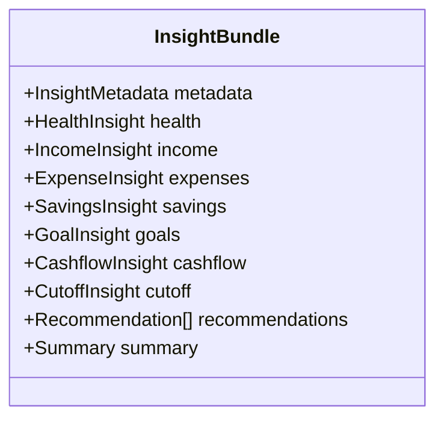

Each object is generated independently and assembled into the final bundle.

---

# 22. HealthInsight

## Purpose

Represents the user's overall financial condition for the selected scope.

HealthInsight is the highest-level summary produced by the Financial Intelligence Platform.

---

## Responsibilities

Responsible for:

* Financial Health Score
* Health Status
* Score Breakdown
* Primary Strengths
* Primary Weaknesses
* Human-readable explanation

Not responsible for:

* Recommendations
* AI narrative
* Cashflow calculations

---

## UML

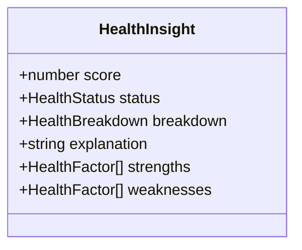

---

## Contract

```text
HealthInsight

score

status

breakdown

strengths

weaknesses

explanation
```

---

## Example

```json
{
  "score": 84,
  "status": "Healthy",
  "explanation": "Your financial condition is stable with positive cashflow and consistent savings.",
  "strengths": [
    "Positive cashflow",
    "Strong savings rate"
  ],
  "weaknesses": [
    "Dining expenses increased"
  ]
}
```

---

# 23. IncomeInsight

## Purpose

Describes income performance.

---

## Responsibilities

Responsible for:

* Total Income
* Current Cutoff Income
* Income Sources
* Trend
* Growth
* Stability
* Missing Income Detection

---

## UML

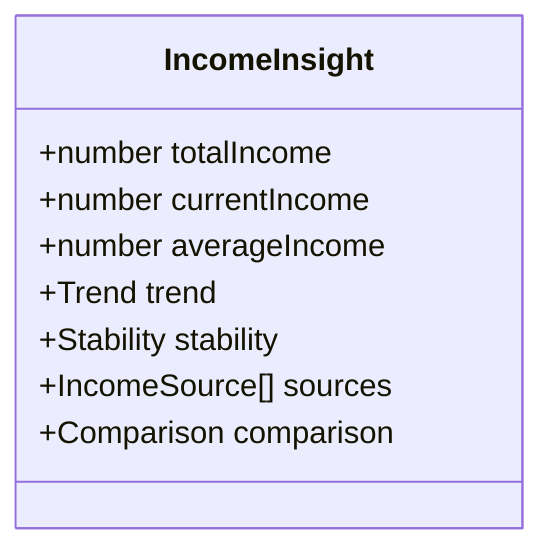

---

## Example

```json
{
  "totalIncome": 98000,
  "currentIncome": 49000,
  "averageIncome": 48500,
  "trend": "Increasing",
  "stability": "Stable"
}
```

---

# 24. ExpenseInsight

## Purpose

Represents spending behavior.

ExpenseInsight answers:

Where is money going?

---

## Responsibilities

* Total Expenses
* Largest Expense
* Largest Category
* Largest Merchant
* Category Distribution
* Expense Trends
* Spending Pace

---

## UML

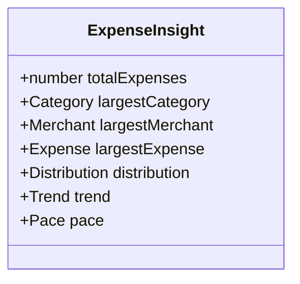

---

## Example

```json
{
  "totalExpenses": 32600,
  "largestCategory": "Food",
  "largestMerchant": "Jollibee",
  "trend": "Increasing"
}
```

---

# 25. SavingsInsight

## Purpose

Measures saving behavior.

Not goal progress.

Not investments.

---

## Responsibilities

* Total Savings
* Savings Rate
* Current Cutoff Savings
* Contribution Count
* Largest Contribution
* Savings Trend

---

## UML

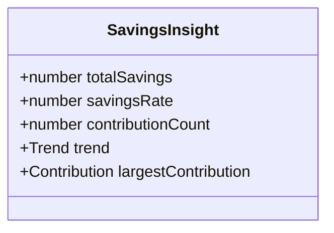

---

## Example

```json
{
  "totalSavings": 8500,
  "savingsRate": 18,
  "trend": "Increasing"
}
```

---

# 26. GoalInsight

## Purpose

Represents the state of Savings Goals.

Unlike SavingsInsight,

this object focuses on objectives.

---

## Responsibilities

* Active Goals
* Completed Goals
* Overall Progress
* Goal Participation
* Highest Progress
* Lowest Progress

---

## UML

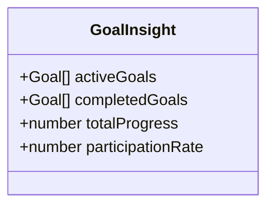

---

## Example

```json
{
  "activeGoals": 3,
  "completedGoals": 1,
  "participationRate": 67
}
```

---

# 27. CashflowInsight

## Purpose

Represents current financial movement.

---

## Responsibilities

* Remaining Cash
* Net Cashflow
* Spending Pace
* Income Coverage
* Savings Coverage
* Stability

---

## UML

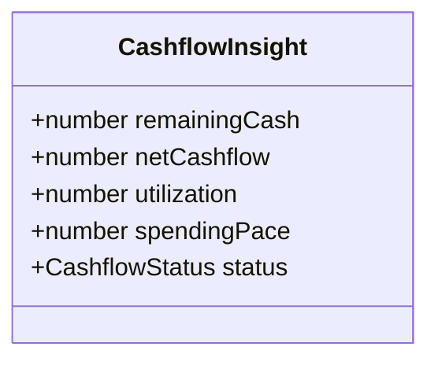

---

## Example

```json
{
  "remainingCash": 12400,
  "netCashflow": 8900,
  "status": "Positive"
}
```

---

# 28. CutoffInsight

## Purpose

Represents the current financial cycle.

---

## Responsibilities

* Current Cutoff
* Previous Cutoff
* Comparison
* Monthly Average
* Trend Direction

---

## UML

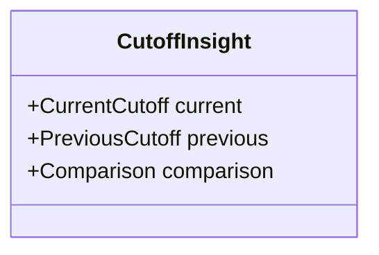

---

## Example

```json
{
  "comparison": {
    "expenses": "-8%",
    "income": "+5%",
    "savings": "+12%"
  }
}
```

---

# 29. DTO Relationships

```mermaid
graph TD

Health

Expense

Income

Savings

Goals

Cashflow

Cutoff

↓

Recommendation Engine

↓

Summary Engine
```

Each DTO is generated independently.

No DTO should directly modify another DTO.

Instead,

they become inputs to Recommendation Rules.

---

# 30. Cross-DTO Dependencies

Allowed:

```text
Expense Rules

↓

ExpenseInsight
```

```text
Savings Rules

↓

SavingsInsight
```

Forbidden:

```text
ExpenseInsight

↓

Health Score
```

HealthScore consumes rule outputs,

not DTOs.

This prevents circular dependencies.

---

# 31. Required Fields

Every DTO must exist.

Example:

Correct

```json
{
  "expenses": {
    "totalExpenses": 0,
    "distribution": [],
    "trend": "No Data"
  }
}
```

Incorrect

```json
{
  "expenses": null
}
```

---

# 32. Optional Fields

Optional fields include:

```text
largestMerchant

largestExpense

highestGoal

latestContribution

comparison
```

Optional means

the field exists,

but its value may be null.

---

# 33. Enumerations

The following enums are standardized.

---

## HealthStatus

```text
Excellent

Healthy

Fair

Needs Attention

Critical
```

---

## Trend

```text
Increasing

Stable

Decreasing

No Data
```

---

## CashflowStatus

```text
Positive

Neutral

Negative
```

---

## Stability

```text
Stable

Moderate

Unstable
```

---

# 34. DTO Generation Rules

Each DTO:

* owns one responsibility.
* is generated once.
* never mutates another DTO.
* contains deterministic values.
* contains no presentation logic.

---

# 35. Validation Rules

Before returning a DTO:

* required fields must exist.
* numeric values must be valid numbers.
* collections must not be null.
* enums must contain valid values.
* explanations may be empty strings but never null.

---

# 36. Serialization Rules

DTOs must be:

* JSON serializable
* backend compatible
* Flutter compatible
* future cloud compatible

No functions.

No Dates as objects.

ISO-8601 strings for timestamps.

---

# 37. Future Compatibility

Future versions may add:

* InvestmentInsight
* SubscriptionInsight
* DebtInsight
* RetirementInsight
* TaxInsight

These are added as new top-level DTOs without changing existing contracts.

Example:

```text
InsightBundle

├── health

├── income

├── expenses

├── savings

├── investments

├── retirement
```

Existing consumers continue functioning.

---

# 38. Acceptance Criteria

This document is complete when:

* Every Insight DTO has a defined responsibility.
* DTO ownership is explicit.
* Required and optional fields are identified.
* Relationships between DTOs are documented.
* Enumerations are standardized.
* Validation rules are defined.
* Serialization rules guarantee cross-platform compatibility.

---

# Part II Summary

Part II specifies the canonical Insight DTOs that compose the `InsightBundle`.

Each DTO owns a single analytical responsibility and is generated independently by its corresponding Rule Engine. Together they provide a complete, deterministic representation of the user's financial state while remaining presentation-agnostic and compatible with future consumers such as Spring Boot services, Flutter applications, and AI narrative generation.

The following parts of this document will define how these DTOs are transformed into actionable recommendations, summaries, and versioned contracts.

---

**End of Part II**

**Next Section:** **Part III — Recommendation, Summary & Metadata Contracts**


# 02 — InsightBundle & Data Contracts (Part III)

> **Document Version:** 2.0.0
> **Status:** Draft — Architecture Review Pending
> **Parent Documents:**
>
> * `00-PesoPilot-v2.0-Source-of-Truth.md`
> * `01-Rule-Based-Financial-Intelligence-Architecture.md`
>
> **Section:** Recommendation, Summary & Metadata Contracts

---

# 39. Purpose

This document defines the **Recommendation**, **Summary**, and **Metadata** contracts produced by the Financial Intelligence Platform.

Unlike the previous sections, which describe financial analysis, these contracts represent the **communication layer** between the Rule Engine and every presentation layer.

The Recommendation Engine answers:

> **"What should the user do?"**

The Summary Engine answers:

> **"What happened financially?"**

Metadata answers:

> **"How and when was this insight generated?"**

---

# 40. Recommendation Philosophy

Recommendations are not financial calculations.

They are **actions derived from completed financial analysis.**

Therefore, Recommendation Rules never inspect raw financial records.

Instead they consume:

```text
Health Insight

Expense Insight

Income Insight

Savings Insight

Goal Insight

Cashflow Insight

Cutoff Insight
```

---

## Recommendation Pipeline

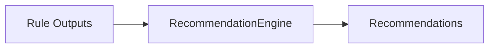

---

# 41. Recommendation Object

Each recommendation represents one actionable financial observation.

Recommendations are intentionally independent.

A user may receive:

* zero recommendations
* one recommendation
* many recommendations

without changing the surrounding InsightBundle.

---

## UML

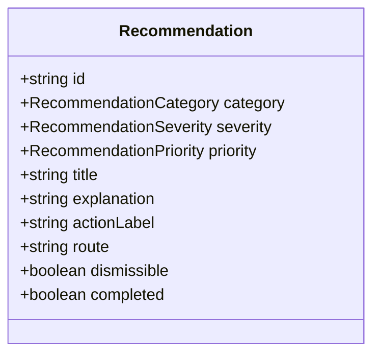

---

## Contract

```text
Recommendation

id

category

severity

priority

title

explanation

actionLabel

route

dismissible

completed
```

---

## Example

```json
{
  "id": "recommendation-001",

  "category": "Savings",

  "severity": "Warning",

  "priority": "High",

  "title": "Increase Savings",

  "explanation": "Your savings rate is below 10% for the current cutoff.",

  "actionLabel": "Add Savings",

  "route": "/savings",

  "dismissible": false,

  "completed": false
}
```

---

# 42. Recommendation Categories

Every recommendation belongs to one category.

Supported values:

```text
Health

Income

Expenses

Savings

Goals

Cashflow

Cutoff

Reports

General
```

This categorization supports:

* filtering
* grouping
* notification routing
* dashboard organization

---

# 43. Recommendation Severity

Severity represents importance.

It is **not** urgency.

---

Supported values

```text
Info

Suggestion

Warning

Critical
```

---

Meaning

## Info

Informational.

No action required.

---

## Suggestion

Improvement opportunity.

---

## Warning

Should receive attention soon.

---

## Critical

Immediate financial concern.

---

# 44. Recommendation Priority

Priority determines display order.

Unlike severity,

priority controls UI ordering.

---

Supported values

```text
Low

Medium

High

Urgent
```

---

Priority Example

```text
Urgent

↓

High

↓

Medium

↓

Low
```

---

# 45. Recommendation Lifecycle

```mermaid
stateDiagram-v2

Generated

-->

Displayed

Displayed

-->

Dismissed

Displayed

-->

Completed

Dismissed

-->

Generated

Completed

--> [*]
```

---

Meaning

Dismissed recommendations may reappear

if the financial condition still exists.

Completed recommendations disappear naturally

because their underlying financial condition changed.

---

# 46. Recommendation Generation Rules

Recommendations:

✔ originate from Rule Outputs

✔ are deterministic

✔ contain navigation targets

✔ explain themselves

Recommendations never:

✘ invent data

✘ calculate new values

✘ duplicate financial analysis

---

# 47. Recommendation Ordering

Ordering is deterministic.

The engine sorts recommendations using:

```text
Priority

↓

Severity

↓

Category

↓

Generated Order
```

Consumers should never sort recommendations differently.

---

# 48. Summary Philosophy

Summaries explain the user's financial situation.

Unlike Recommendations,

Summaries describe.

They do not instruct.

---

Example

Recommendation

```text
Increase Savings
```

Summary

```text
Your savings rate decreased by 4% compared to the previous cutoff.
```

---

# 49. Summary Object

## UML

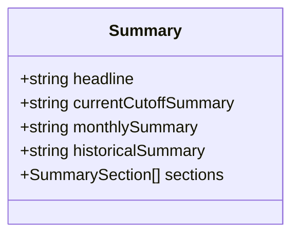

---

## Contract

```text
Summary

headline

currentCutoffSummary

monthlySummary

historicalSummary

sections
```

---

## Example

```json
{
  "headline": "Healthy Financial Cutoff",

  "currentCutoffSummary": "You maintained positive cashflow while increasing savings contributions.",

  "monthlySummary": "...",

  "historicalSummary": "..."
}
```

---

# 50. Summary Sections

Long summaries should be divided.

Example

```text
Overview

Income

Expenses

Savings

Goals

Cashflow

Recommendations
```

These are presentation-independent.

Consumers choose how to render them.

---

# 51. Summary Generation Pipeline

```mermaid
flowchart TD

Health

Expense

Income

Savings

Goals

Cashflow

↓

Summary Rules

↓

Summary DTO
```

---

# 52. Summary Rules

Summary Rules:

consume

```text
Health

Recommendations

Income

Expenses

Savings

Cashflow

Goals
```

They never consume

```text
IndexedDB

Repositories

React

Dexie

UI State
```

---

# 53. Metadata Contract

Metadata describes

how

when

and why

the bundle exists.

Metadata never contains financial intelligence.

---

## UML

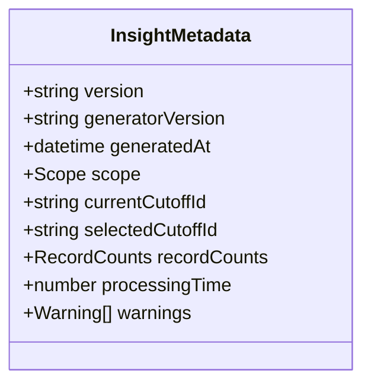

---

## Metadata Example

```json
{
  "version": "2.0",

  "generatorVersion": "11A",

  "generatedAt": "2026-07-01T10:45:12Z",

  "scope": "current_cutoff",

  "processingTime": 22
}
```

---

# 54. Metadata Responsibilities

Metadata enables:

* debugging
* logging
* synchronization
* future APIs
* AI context

It is not user-facing financial information.

---

# 55. Warning Contract

Warnings communicate incomplete context.

Examples

```text
No Current Cutoff

No Income Recorded

No Savings Goals

No Historical Comparison

No Current Month Data
```

Warnings are informational.

They never invalidate the bundle.

---

# 56. Notification Compatibility

Recommendations are **not**

Notifications.

However,

the Notification Center may transform recommendations into notifications.

Example

```text
Recommendation

↓

Notification

↓

Header Bell
```

The recommendation remains the source of truth.

---

# 57. AI Compatibility Contract

Future AI consumes

```text
InsightBundle
```

including

Recommendations

Summary

Metadata

AI does **not** consume:

* repositories
* transactions
* Dexie
* React state

---

## Sequence

```mermaid
sequenceDiagram

Rule Engine->>InsightBundle

InsightBundle->>Spring Boot

Spring Boot->>Prompt Builder

Prompt Builder->>Ollama

Ollama-->>Spring Boot

Spring Boot-->>React
```

---

# 58. Recommendation vs Summary

| Recommendation | Summary     |
| -------------- | ----------- |
| Action         | Explanation |
| Prioritized    | Narrative   |
| Navigable      | Readable    |
| Category       | Sections    |
| Severity       | Tone        |
| Short          | Longer      |

Both coexist.

Neither replaces the other.

---

# 59. Validation Rules

Every Recommendation must contain:

✔ id

✔ category

✔ severity

✔ priority

✔ title

✔ explanation

✔ actionLabel

✔ route

---

Every Summary must contain:

✔ headline

✔ currentCutoffSummary

Collections use empty arrays.

Strings use empty strings.

Never null.

---

# 60. Future Compatibility

Future versions may add

```text
TimelineSummary

ConversationSummary

MonthlyHighlights

ForecastSummary

RetirementSummary
```

without changing existing Summary contracts.

Likewise,

Recommendation categories may expand

without affecting current consumers.

---

# 61. Architecture Decision Records

---

## ADR-006

### Why Recommendations are Separate

Decision

Recommendations are independent DTOs.

Reason

Allows filtering,

sorting,

notifications,

dashboard widgets,

AI explanations.

---

## ADR-007

### Why Summaries are Deterministic

Decision

Summary generation is rule-based.

Reason

Financial narratives must remain explainable.

---

## ADR-008

### Why Metadata Exists

Decision

Every bundle is self-describing.

Reason

Supports AI,

debugging,

future synchronization,

version compatibility.

---

## ADR-009

### Why Recommendations Have Routes

Decision

Recommendations should guide users directly.

Reason

Reduce navigation friction.

---

# 62. Acceptance Criteria

This section is complete when:

* Recommendation DTO is fully specified.
* Summary DTO is fully specified.
* Metadata contract is frozen.
* Categories, severity, and priority are standardized.
* Recommendation ordering is deterministic.
* AI compatibility is documented.
* Validation guarantees are established.

---

# Part III Summary

Part III defines the communication layer of the Financial Intelligence Platform.

Recommendations transform analytical outputs into actionable guidance, while Summaries convert those same outputs into human-readable financial narratives. Metadata provides the contextual information required for versioning, diagnostics, synchronization, and future AI integration.

Together, these contracts complete the semantic layer of the `InsightBundle`, ensuring that every consumer—from the Dashboard to the future Spring Boot AI service—receives deterministic, structured, and explainable financial intelligence.

---

**End of Part III**

**Next Section:** **Part IV — Versioning, Compatibility, Validation & Extension Rules**


# 02 — InsightBundle & Data Contracts (Part IV)

> **Document Version:** 2.0.0
> **Status:** Draft — Architecture Review Pending
> **Parent Documents:**
>
> * `00-PesoPilot-v2.0-Source-of-Truth.md`
> * `01-Rule-Based-Financial-Intelligence-Architecture.md`
>
> **Section:** Versioning, Compatibility, Validation & Extension Rules

---

# 63. Purpose

This section establishes the long-term governance rules for the `InsightBundle`.

The previous parts defined:

* the purpose of the bundle,
* the individual DTOs,
* recommendations,
* summaries,
* metadata.

This section defines how those contracts evolve over time without breaking existing consumers.

These rules ensure that the Financial Intelligence Platform remains stable as PesoPilot grows from a local-first application into a multi-platform ecosystem with backend services and AI integrations.

---

# 64. Versioning Philosophy

The `InsightBundle` is a public architecture contract.

Once released, existing consumers should continue functioning even as the platform evolves.

Versioning protects that contract.

---

## Principle

```text
New versions should extend.

Not break.
```

---

# 65. Version Strategy

Every generated bundle contains:

```text
metadata.version
```

Example

```json
{
  "metadata": {
    "version": "2.0.0"
  }
}
```

Future versions

```text
2.0.0

2.1.0

2.2.0

3.0.0
```

follow semantic versioning.

---

# 66. Semantic Versioning Rules

## Major Version

Increment when:

* removing DTOs
* renaming contracts
* changing field meanings
* breaking compatibility

Example

```text
2.x.x

↓

3.0.0
```

---

## Minor Version

Increment when:

* adding new DTOs
* adding optional fields
* adding metadata
* adding recommendation categories

Example

```text
2.0.0

↓

2.1.0
```

---

## Patch Version

Increment when:

* fixing documentation
* correcting validation
* fixing serialization

without changing the contract.

Example

```text
2.1.0

↓

2.1.1
```

---

# 67. Compatibility Principles

Every new version should satisfy:

✔ Old consumers continue working.

✔ New consumers may use new features.

✔ Missing optional fields are tolerated.

✔ Existing required fields remain stable.

---

## Compatibility Diagram

```mermaid
flowchart LR

V2["InsightBundle v2.0"]

-->

Dashboard

-->

Reports

-->

Cashflow

V21["InsightBundle v2.1"]

-->

Dashboard

-->

Reports

-->

Cashflow

-->

FutureMobile["Future Mobile App"]
```

---

# 68. Backward Compatibility Rules

Allowed

✔ Add optional DTOs

✔ Add optional fields

✔ Add metadata

✔ Add recommendation categories

✔ Add summary sections

Forbidden

✘ Remove DTOs

✘ Rename DTOs

✘ Change field meaning

✘ Change enum meaning

✘ Change recommendation ordering

---

# 69. Forward Compatibility Rules

Consumers should ignore unknown fields.

Example

Old consumer

```json
{
  "health": {},
  "expenses": {}
}
```

New bundle

```json
{
  "health": {},

  "expenses": {},

  "investments": {}
}
```

Old consumer continues functioning.

---

# 70. Nullability Rules

The Financial Intelligence Platform avoids null wherever practical.

---

Collections

Correct

```json
[]
```

Incorrect

```json
null
```

---

Objects

Correct

```json
{
  "summary": {}
}
```

Incorrect

```json
{
  "summary": null
}
```

---

Strings

Correct

```json
""
```

Incorrect

```json
null
```

---

Numbers

Use

```text
0
```

instead of

```text
null
```

unless

zero would be misleading.

---

# 71. Validation Pipeline

Every generated bundle passes validation.

```mermaid
flowchart LR

Rules

-->

Bundle

-->

Validator

-->

ValidBundle

Validator

-->

ValidationErrors
```

---

Validation includes:

* required DTOs
* enum validation
* required metadata
* scope validation
* recommendation validation
* summary validation

---

# 72. Validation Rules

Each bundle must satisfy:

```text
Metadata exists

Health exists

Income exists

Expenses exists

Savings exists

Goals exists

Cashflow exists

Cutoff exists

Recommendations exists

Summary exists
```

No required contract may be omitted.

---

# 73. Enum Validation

Enums must always contain approved values.

Example

Health Status

Allowed

```text
Excellent

Healthy

Fair

Needs Attention

Critical
```

Invalid

```text
Awesome

Great

Okay
```

---

Recommendation Severity

Allowed

```text
Info

Suggestion

Warning

Critical
```

Anything else is invalid.

---

# 74. Serialization Rules

Every DTO must be:

✔ JSON serializable

✔ deterministic

✔ backend compatible

✔ Flutter compatible

✔ future API compatible

Forbidden

```text
Functions

Promises

Dates as JS objects

DOM references

React state

Closures
```

---

# 75. Immutability Rules

After generation,

the bundle is immutable.

---

Forbidden

```javascript
bundle.health.score = 100;
```

---

Forbidden

```javascript
bundle.recommendations.push(...)
```

---

Correct

```text
Generate

↓

New Bundle

↓

Replace Existing Bundle
```

---

## Immutability Sequence

```mermaid
sequenceDiagram

RuleEngine->>InsightBundle: Generate

InsightBundle-->>Dashboard: Read

Dashboard-->>InsightBundle: Display Only

Dashboard--xInsightBundle: Never Modify
```

---

# 76. Extension Guidelines

Future modules should integrate without modifying existing contracts.

Example

Adding

```text
InvestmentInsight
```

should follow

```text
Rule Engine

↓

InvestmentInsight

↓

InsightBundle

↓

Consumers
```

instead of modifying existing DTO responsibilities.

---

# 77. Approved Extension Points

Future Insight DTOs

```text
InvestmentInsight

DebtInsight

SubscriptionInsight

RetirementInsight

TaxInsight

InsuranceInsight

CreditInsight
```

Future Recommendation Categories

```text
Investments

Retirement

Debt

Taxes

Insurance
```

Future Summary Sections

```text
Investments

Retirement

Debt

Forecast

AI Commentary
```

---

# 78. Consumer Responsibilities

Consumers may:

✔ Display

✔ Filter

✔ Search

✔ Sort visually

✔ Group

Consumers must never:

✘ Modify

✘ Merge

✘ Persist

✘ Recalculate

✘ Patch DTO values

---

# 79. Producer Responsibilities

Only the Financial Intelligence Platform may generate an `InsightBundle`.

Producer responsibilities:

* normalize context,
* execute rules,
* validate contracts,
* assemble DTOs,
* return immutable bundle.

---

# 80. API Compatibility

Future Spring Boot APIs should expose the same contract.

Example

```http
GET /api/insights/current
```

Response

```json
InsightBundle
```

No backend-specific DTOs should be introduced unless versioned separately.

---

# 81. AI Compatibility Rules

AI receives only:

```text
InsightBundle
```

AI never receives:

```text
Repositories

Dexie

React State

Transactions

Financial Calculators
```

---

AI outputs

```text
Narratives

Explanations

Suggestions

Educational Content
```

AI never produces

```text
Health Score

Savings Rate

Cashflow

Financial Totals
```

---

# 82. Error Recovery Strategy

If one rule fails:

```text
Expense Rules

↓

Failure
```

the remaining rule modules continue executing.

Example

```text
Health

✓

Income

✓

Expenses

Unavailable

Savings

✓

Goals

✓
```

The bundle remains valid.

The failed section includes an explanatory warning.

---

# 83. Testing Requirements

Every bundle version must be tested for:

* DTO completeness
* enum validation
* serialization
* immutability
* version compatibility
* recommendation ordering
* summary generation
* metadata correctness

---

## Compatibility Tests

Every new version should verify:

```text
v2 Consumer

↓

Reads v2.1 Bundle
```

without failure.

---

# 84. Architecture Decision Records

---

## ADR-010

### Why Semantic Versioning?

Decision

Use semantic versioning.

Reason

Predictable compatibility.

---

## ADR-011

### Why Immutable Contracts?

Decision

Generated bundles never change.

Reason

Predictable rendering and debugging.

---

## ADR-012

### Why Validation Before Return?

Decision

Every consumer receives valid data.

Reason

Prevent runtime inconsistencies.

---

## ADR-013

### Why JSON-Serializable DTOs?

Decision

Platform independence.

Reason

Same contract works across:

* React
* Spring Boot
* Flutter
* Cloud APIs

---

## ADR-014

### Why Extension Instead of Modification?

Decision

Future features become new DTOs.

Reason

Maintain backward compatibility.

---

# 85. Architecture Governance

Every future Financial Intelligence feature must answer:

1. Which Rule Engine owns this calculation?
2. Which DTO owns the result?
3. Does it belong inside an existing DTO or a new one?
4. Does it require a new Recommendation?
5. Does it require a new Summary section?
6. Does it affect contract compatibility?
7. Does it require a version increment?

If these questions cannot be answered clearly, the architecture should be reviewed before implementation.

---

# 86. InsightBundle Evolution Roadmap

```mermaid
flowchart TD

V2["v2.0
Health
Income
Expenses
Savings
Goals
Cashflow
Cutoff"]

-->

V21["v2.1
+ Investments
+ Subscriptions"]

-->

V22["v2.2
+ Debt
+ Retirement"]

-->

V30["v3.0
Cloud Synchronization
Cross-device Intelligence
AI Coaching"]
```

The roadmap illustrates additive growth while preserving contract stability.

---

# 87. Acceptance Criteria

This document is complete when:

* Semantic versioning is formally defined.
* Compatibility rules are frozen.
* Validation requirements are documented.
* Serialization guarantees are established.
* Extension guidelines are standardized.
* Producer and consumer responsibilities are explicit.
* AI compatibility boundaries are defined.
* Architecture governance rules are documented.

---

# Part IV Summary

Part IV defines the governance model for the `InsightBundle`.

It establishes how the contract evolves, how compatibility is preserved, how validation ensures correctness, and how future features integrate without disrupting existing consumers.

Together with Parts I–III, this completes the formal specification of the `InsightBundle`—the central contract of the PesoPilot Financial Intelligence Platform.

From this point forward, every rule engine, frontend page, backend service, mobile application, and AI integration should treat the `InsightBundle` as the single authoritative representation of financial intelligence.

---

# Document Completion Summary

The **InsightBundle & Data Contracts** specification now defines:

* **Part I:** Bundle philosophy, lifecycle, ownership, metadata, and core contracts.
* **Part II:** Individual Insight DTO specifications and their responsibilities.
* **Part III:** Recommendation, Summary, and Metadata contracts.
* **Part IV:** Versioning, compatibility, validation, serialization, immutability, and extension rules.

This document serves as the canonical contract between the Rule-Based Financial Intelligence Platform and all current and future consumers, ensuring deterministic, explainable, extensible, and platform-independent financial intelligence.

---

**End of Document — 02 InsightBundle & Data Contracts**
