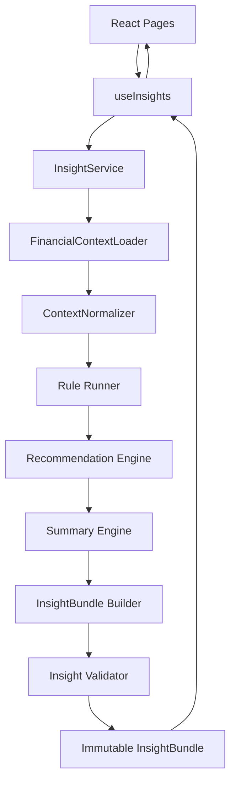
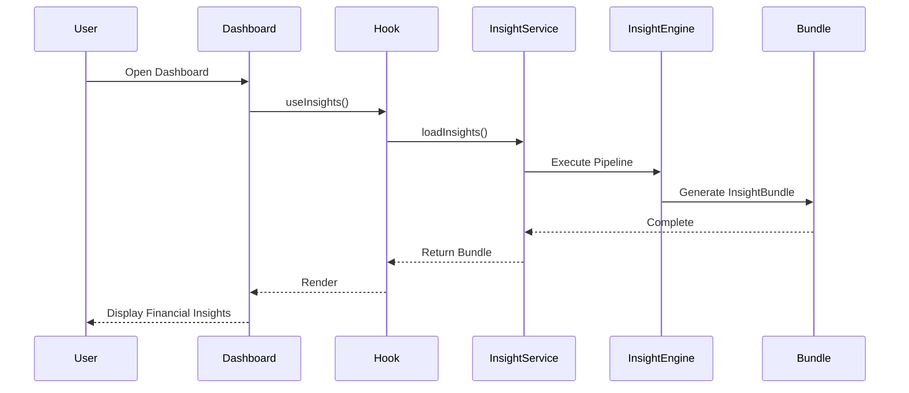
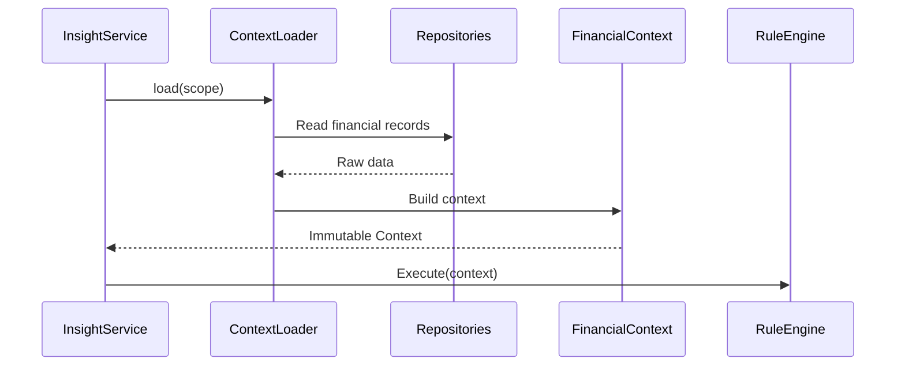
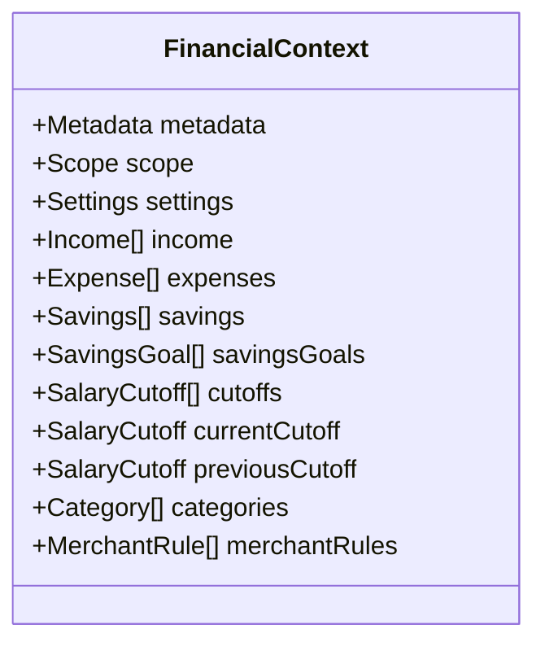
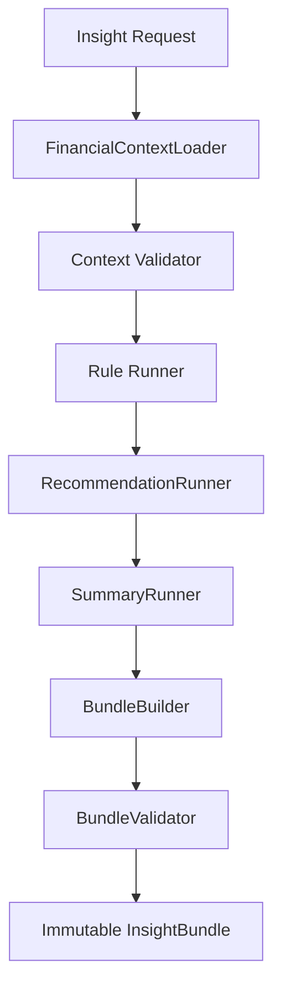
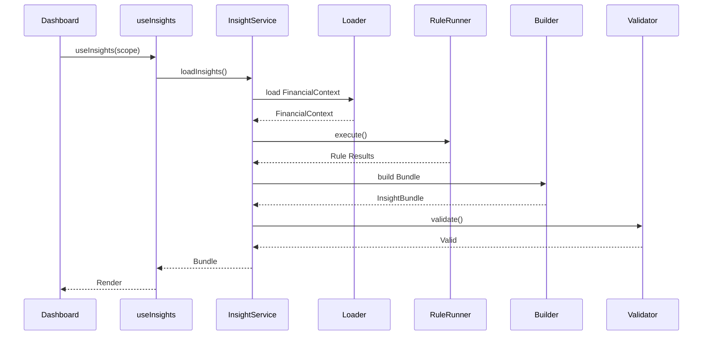
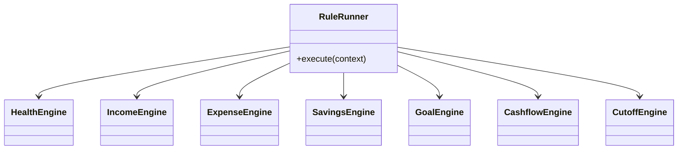
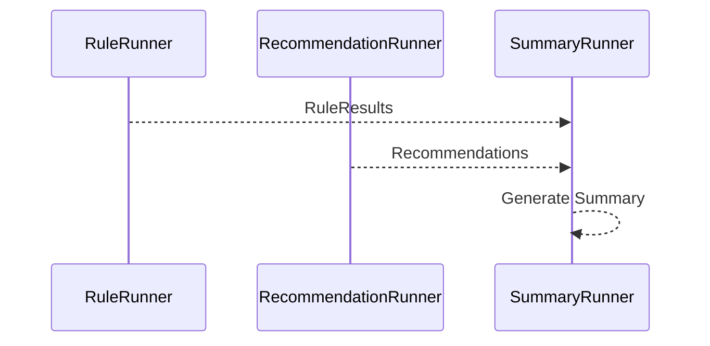
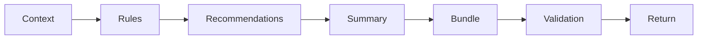

# 03 — Insight Engine Architecture (Part I)

> **Document Version:** 2.0.0
> **Status:** Draft — Architecture Review Pending
> **Parent Documents:**
>
> * `00-PesoPilot-v2.0-Source-of-Truth.md`
> * `01-Rule-Based-Financial-Intelligence-Architecture.md`
> * `02-InsightBundle-and-Data-Contracts.md`
>
> **Phase:** Phase 11A — Rule-Based Financial Intelligence
>
> **Section:** Introduction, Architecture Goals, Responsibilities & High-Level Pipeline

---

# 1. Purpose

This document defines the implementation architecture of the PesoPilot Financial Intelligence Platform.

Unlike previous documents that describe **why** the platform exists and **what** data contracts it exposes, this document explains **how** financial intelligence is generated.

It specifies:

* the execution pipeline,
* orchestration responsibilities,
* data flow,
* component interaction,
* engine independence,
* lifecycle management,
* and implementation boundaries.

This document serves as the implementation blueprint for every Rule Engine developed during Phase 11A.

---

# 2. Position Within the Overall Architecture

The Financial Intelligence Platform is composed of multiple architecture layers.

```text
00 Source of Truth
        │
        ▼
01 Financial Intelligence Architecture
        │
        ▼
02 InsightBundle & Data Contracts
        │
        ▼
03 Insight Engine Architecture
        │
        ▼
04 Rule Engine Architecture
        │
        ▼
Individual Rule Engines
```

Document 03 bridges architecture and implementation.

---

# 3. Architectural Goal

The Insight Engine exists for one reason:

> Convert raw financial records into deterministic financial intelligence.

It owns orchestration.

It does **not** own business rules.

---

# 4. Primary Responsibilities

The Insight Engine is responsible for:

* Loading financial context
* Preparing normalized data
* Executing rule engines
* Executing recommendation generation
* Executing summary generation
* Building the InsightBundle
* Validating generated intelligence
* Returning immutable results

It is **not** responsible for:

* UI rendering
* Database persistence
* AI inference
* Network communication
* Business rule implementation

---

# 5. Architectural Philosophy

The Insight Engine follows five core principles.

---

## 5.1 Orchestration over Calculation

The Insight Engine coordinates work.

It does not calculate financial metrics.

Incorrect

```text
InsightService

↓

calculateHealthScore()

↓

calculateSavingsRate()
```

Correct

```text
InsightService

↓

HealthEngine

↓

SavingsEngine
```

---

## 5.2 Single Execution Pipeline

Every page requesting financial intelligence follows exactly the same pipeline.

Dashboard.

Reports.

Cashflow.

Future AI.

All execute the identical workflow.

---

## 5.3 Engine Independence

Every engine operates independently.

No engine directly depends on another.

Example

```text
Health Engine

↓

Health Insight
```

Expense Engine

```text
Expense Engine

↓

Expense Insight
```

Health Engine never calls Expense Engine.

---

## 5.4 Immutable Outputs

Generated intelligence is never modified.

Instead,

the system regenerates a completely new InsightBundle whenever financial data changes.

---

## 5.5 Explainable Intelligence

Every generated value must be reproducible.

Given identical input,

the platform must always produce identical output.

---

# 6. High-Level Architecture



---

# 7. Insight Engine Component Model

The Insight Engine is composed of specialized components.

```text
Insight Engine

├── FinancialContextLoader

├── ContextNormalizer

├── RuleRunner

├── RecommendationRunner

├── SummaryRunner

├── BundleBuilder

├── BundleValidator

└── Cache Layer (Future)
```

Each component owns a single responsibility.

---

# 8. Execution Pipeline

The pipeline is deterministic.


Every request executes these stages in order.

No stage is skipped.

---

# 9. End-to-End Request Flow



---

# 10. Responsibilities Matrix

| Component              | Responsibility         | Calculates Financial Rules | Owns UI |
| ---------------------- | ---------------------- | -------------------------- | ------- |
| React Page             | Presentation           | No                         | Yes     |
| useInsights            | State Management       | No                         | No      |
| InsightService         | Orchestration          | No                         | No      |
| FinancialContextLoader | Load Financial Context | No                         | No      |
| ContextNormalizer      | Normalize Data         | Minimal                    | No      |
| Rule Runner            | Execute Rule Engines   | No                         | No      |
| Rule Engines           | Financial Analysis     | Yes                        | No      |
| Recommendation Engine  | Build Recommendations  | Yes                        | No      |
| Summary Engine         | Build Summaries        | Yes                        | No      |
| Bundle Builder         | Assemble InsightBundle | No                         | No      |
| Bundle Validator       | Validate Contracts     | No                         | No      |

---

# 11. Data Flow

The Insight Engine never exposes intermediate results.

Only two data structures are visible externally.

```text
Input

↓

FinancialContext

↓

Internal Processing

↓

InsightBundle

↓

Consumers
```

Everything between these stages is implementation detail.

---

# 12. Design Constraints

The Insight Engine must satisfy the following constraints.

---

## Constraint 1

Business calculations belong exclusively inside Rule Engines.

---

## Constraint 2

Repositories must never be accessed after FinancialContext has been created.

---

## Constraint 3

Recommendation generation must consume rule outputs, not repositories.

---

## Constraint 4

Summary generation must consume rule outputs, not repositories.

---

## Constraint 5

Only BundleBuilder creates an InsightBundle.

---

## Constraint 6

Only BundleValidator approves a bundle for release.

---

## Constraint 7

Consumers never modify InsightBundle contents.

---

# 13. System Boundaries

The Insight Engine communicates with surrounding systems through well-defined boundaries.

```mermaid
flowchart LR

Repositories

-->

FinancialContextLoader

-->

Insight Engine

-->

InsightBundle

-->

Dashboard

InsightBundle

-->

Reports

InsightBundle

-->

Cashflow

InsightBundle

-->

Spring Boot

InsightBundle

-->

Flutter
```

The engine has no knowledge of presentation details.

---

# 14. Processing Lifecycle

Every execution follows the same lifecycle.

```text
Request Received

↓

Load Financial Context

↓

Normalize Context

↓

Execute Rule Engines

↓

Generate Recommendations

↓

Generate Summary

↓

Build Bundle

↓

Validate Bundle

↓

Return Immutable Bundle
```

No consumer can bypass this lifecycle.

---

# 15. Why an Insight Engine?

Without an orchestration layer:

* Pages duplicate calculations.
* Rules become tightly coupled.
* AI receives inconsistent data.
* Reports disagree with Dashboard.
* Future maintenance becomes difficult.

The Insight Engine centralizes orchestration so that every consumer receives identical, validated financial intelligence.

---

# 16. Architecture Decision Records

## ADR-001 — Centralized Orchestration

**Decision**

Use a single Insight Engine to coordinate all financial intelligence generation.

**Reason**

Provides one deterministic execution pipeline for every consumer.

---

## ADR-002 — Pipeline-Based Execution

**Decision**

Execute insight generation as a fixed pipeline.

**Reason**

Ensures predictable execution order and simplifies debugging.

---

## ADR-003 — Engine Independence

**Decision**

Rule Engines operate independently.

**Reason**

Improves maintainability, testing, and extensibility.

---

## ADR-004 — Immutable Output

**Decision**

Generated bundles are immutable.

**Reason**

Prevents accidental mutation by UI components and guarantees reproducibility.

---

## ADR-005 — Single Entry Point

**Decision**

All consumers must access financial intelligence through `InsightService`.

**Reason**

Prevents duplicated orchestration logic and enforces consistent execution.

---

# 17. Acceptance Criteria

This section is complete when:

* The purpose of the Insight Engine is clearly defined.
* Responsibilities and boundaries are documented.
* The execution pipeline is established.
* Component responsibilities are assigned.
* The orchestration philosophy is documented.
* The end-to-end lifecycle is standardized.
* Architectural decision records explain the major design choices.

---

# Part I Summary

Part I introduces the Insight Engine as the orchestration layer of the PesoPilot Financial Intelligence Platform.

It establishes the execution philosophy, architectural responsibilities, processing lifecycle, and high-level pipeline that every insight request follows.

The Insight Engine does not calculate financial metrics itself. Instead, it coordinates specialized Rule Engines, assembles the resulting intelligence into an immutable `InsightBundle`, validates the output, and delivers a consistent, deterministic result to every consumer.

This architecture ensures that Dashboard, Reports, Cashflow, future AI services, and any future client applications all consume financial intelligence through the same trusted execution path.

---

**End of Part I**

**Next Section:** **Part II — FinancialContext, Context Loader, Context Normalizer & Context Validation**


# 03 — Insight Engine Architecture (Part II)

> **Document Version:** 2.0.0
> **Status:** Draft — Architecture Review Pending
> **Parent Documents:**
>
> * `00-PesoPilot-v2.0-Source-of-Truth.md`
> * `01-Rule-Based-Financial-Intelligence-Architecture.md`
> * `02-InsightBundle-and-Data-Contracts.md`
>
> **Phase:** Phase 11A — Rule-Based Financial Intelligence
>
> **Section:** FinancialContext, Context Loader, Context Normalizer & Context Validation

---

# 18. Purpose

The FinancialContext is the single input object consumed by the entire Financial Intelligence Platform.

Before any financial intelligence can be generated, the system must first construct a complete, normalized, immutable representation of the user's financial environment.

Every Rule Engine consumes this object.

No Rule Engine is allowed to access repositories, Dexie, hooks, or UI state directly.

---

# 19. Why FinancialContext Exists

Without a centralized context object, every engine would need to perform its own data loading.

Example (incorrect):

```text
Health Engine
    ↓
Expense Repository

Savings Engine
    ↓
Expense Repository

Cashflow Engine
    ↓
Expense Repository
```

Problems:

* duplicate repository calls
* inconsistent calculations
* unnecessary IndexedDB reads
* difficult testing
* tight coupling

Instead:

```text
Repositories

↓

FinancialContextLoader

↓

FinancialContext

↓

All Rule Engines
```

Every engine receives identical input.

---

# 20. FinancialContext Philosophy

FinancialContext represents the user's complete financial state for one specific scope.

It answers:

> "If I stopped reading IndexedDB right now, do I already have everything required to generate financial intelligence?"

If the answer is **no**, the context is incomplete.

---

# 21. FinancialContext Lifecycle



The Rule Engine never communicates with repositories.

---

# 22. FinancialContext Overview

```text
FinancialContext

├── metadata

├── scope

├── settings

├── income

├── expenses

├── savings

├── savingsGoals

├── cutoffs

├── currentCutoff

├── previousCutoff

├── categories

├── merchantRules

├── reports

└── diagnostics
```

This object contains **everything** required for deterministic financial analysis.

---

# 23. UML



---

# 24. FinancialContext Sections

## Metadata

Describes

* generatedAt
* scope
* diagnostics

No financial calculations.

---

## Settings

Current user settings.

Example:

* preferred currency
* display preferences
* locale

Settings influence formatting,

not financial calculations.

---

## Income

Contains every scoped income record.

Already filtered.

Already normalized.

---

## Expenses

Contains every scoped expense.

No further filtering required.

---

## Savings

Contains savings contributions.

Not savings goals.

---

## Savings Goals

Contains goal definitions.

Separate from contributions.

---

## Salary Cutoffs

Contains historical cutoff records.

---

## Current Cutoff

Resolved during loading.

Every engine receives the same object.

---

## Previous Cutoff

Resolved during loading.

Used for comparisons.

---

## Categories

Required by Expense Engine.

---

## Merchant Rules

Required only for specific insight generation.

---

# 25. FinancialContextLoader

The FinancialContextLoader is responsible for building FinancialContext.

It owns:

* repository access
* service access
* data collection

It does **not**:

* calculate insights
* generate recommendations
* compute health scores

---

## Responsibilities

```text
Load records

↓

Load settings

↓

Resolve cutoffs

↓

Load categories

↓

Load merchant rules

↓

Assemble context
```

---

# 26. Loader Sequence

```mermaid
sequenceDiagram

participant Loader

participant IncomeRepository

participant ExpenseRepository

participant SavingsRepository

participant GoalRepository

participant CutoffRepository

Loader->>IncomeRepository: find()

Loader->>ExpenseRepository: find()

Loader->>SavingsRepository: find()

Loader->>GoalRepository: find()

Loader->>CutoffRepository: find()

IncomeRepository-->>Loader

ExpenseRepository-->>Loader

SavingsRepository-->>Loader

GoalRepository-->>Loader

CutoffRepository-->>Loader

Loader->>FinancialContext: Build
```

---

# 27. Scope Resolution

The Loader is responsible for applying scope.

Supported scopes:

```text
all

current_cutoff

specific_cutoff
```

Every repository returns raw records.

The Loader determines which records belong in the context.

Rule Engines never filter by scope.

---

# 28. Current Cutoff Resolution

The Loader delegates cutoff determination to the existing cutoff authority.

```text
cutoffService.findCurrentCutoff()
```

No Rule Engine should determine the current cutoff independently.

---

# 29. Previous Cutoff Resolution

If a current cutoff exists:

```text
Current Cutoff

↓

Find Previous Closed Cutoff

↓

Attach to Context
```

If none exists:

```text
previousCutoff = null
```

No exceptions.

---

# 30. Context Normalizer

The Normalizer converts loaded records into a consistent structure.

Responsibilities include:

* sorting
* lightweight mapping
* date normalization
* currency consistency
* removing presentation-specific fields

It does **not** calculate financial intelligence.

---

# 31. Normalization Pipeline

```mermaid
flowchart LR

Raw Records

-->

Normalize Dates

-->

Normalize Currency

-->

Sort Records

-->

Remove UI Fields

-->

FinancialContext
```

---

# 32. Normalization Rules

Examples

Dates

```text
2026-07-01
```

not

```text
July 1, 2026
```

Amounts

Always numeric.

Not formatted strings.

---

Enums

Must use standardized values.

---

Collections

Never null.

Always arrays.

---

# 33. Sorting Rules

FinancialContext should provide deterministic ordering.

Income

Newest → Oldest

Expenses

Newest → Oldest

Savings

Newest → Oldest

Cutoffs

Newest → Oldest

This prevents every engine from sorting independently.

---

# 34. Context Validation

Before Rule Engines execute,

FinancialContext must be validated.

Validation ensures:

* required collections exist
* metadata exists
* scope exists
* records are normalized
* current cutoff consistency

---

# 35. Validation Pipeline

```mermaid
flowchart TD

FinancialContext

↓

Context Validator

↓

Valid

↓

Rule Engines

Context Validator

↓

Errors

↓

InsightService
```

---

# 36. Validation Rules

The validator checks:

✔ metadata exists

✔ scope exists

✔ collections exist

✔ settings loaded

✔ categories loaded

✔ merchant rules loaded

✔ current cutoff consistency

✔ previous cutoff consistency

---

# 37. Empty Context Rules

Empty data is valid.

Example

```text
Income = []

Expenses = []

Savings = []
```

The Rule Engines should still execute.

They produce

"No Data"

insights instead of failures.

---

# 38. Error Handling

If repositories fail:

```text
Repository Failure

↓

Loader

↓

InsightService

↓

Return ErrorState
```

No partial context is returned.

---

# 39. Context Immutability

After construction,

FinancialContext becomes immutable.

Forbidden

```javascript
context.expenses.push(...)
```

Forbidden

```javascript
context.currentCutoff = ...
```

If financial records change,

a completely new context is generated.

---

# 40. Context Ownership

Only one component owns FinancialContext creation.

```text
FinancialContextLoader
```

Everything else consumes it.

No other component should create a second context.

---

# 41. Architecture Decision Records

## ADR-006

### Why FinancialContext?

Decision

One normalized input object.

Reason

Prevents duplicate repository access and guarantees consistent rule execution.

---

## ADR-007

### Why Scope Filtering Happens in Loader?

Decision

Filter records before entering Rule Engines.

Reason

Keeps Rule Engines simple and scope-independent.

---

## ADR-008

### Why Normalize Before Rules?

Decision

Every Rule Engine receives identical data quality.

Reason

Reduces duplicate preprocessing logic.

---

## ADR-009

### Why Immutable Context?

Decision

Prevent engines from modifying shared data.

Reason

Deterministic execution and easier debugging.

---

## ADR-010

### Why Resolve Current Cutoff Before Rules?

Decision

Use a single cutoff authority.

Reason

Ensures every engine compares against the same financial period.

---

# 42. Acceptance Criteria

This section is complete when:

* FinancialContext is formally defined.
* Loader responsibilities are documented.
* Scope resolution is standardized.
* Current and previous cutoff resolution are centralized.
* Normalization rules are established.
* Validation requirements are documented.
* Context immutability is enforced.
* Rule Engines depend exclusively on FinancialContext.

---

# Part II Summary

Part II defines the **FinancialContext**, the canonical input to the Rule-Based Financial Intelligence Platform.

It establishes a single, immutable, normalized view of the user's financial data before any analytical processing begins. By centralizing data loading, scope resolution, normalization, and validation within the `FinancialContextLoader`, the architecture ensures that every Rule Engine receives identical, trustworthy input without direct access to repositories or IndexedDB.

This separation simplifies rule implementation, improves testability, guarantees deterministic execution, and provides a stable foundation for every subsequent stage of the Insight Engine pipeline.

---

**End of Part II**

**Next Section:** **Part III — InsightService, Rule Runner, Engine Orchestration & Sequence Diagrams**

# 03 — Insight Engine Architecture (Part III)

> **Document Version:** 2.0.0
> **Status:** Draft — Architecture Review Pending
> **Parent Documents:**
>
> * `00-PesoPilot-v2.0-Source-of-Truth.md`
> * `01-Rule-Based-Financial-Intelligence-Architecture.md`
> * `02-InsightBundle-and-Data-Contracts.md`
>
> **Phase:** Phase 11A — Rule-Based Financial Intelligence
>
> **Section:** InsightService, Rule Runner, Engine Orchestration & Sequence Diagrams

---

# 43. Purpose

This section defines the orchestration layer of the Financial Intelligence Platform.

If Part II defined **what enters** the Insight Engine (`FinancialContext`),

Part III defines **how that context becomes financial intelligence.**

The orchestration layer guarantees:

* deterministic execution,
* repeatable results,
* isolated rule engines,
* centralized coordination,
* and a single execution pipeline.

---

# 44. InsightService Overview

The `InsightService` is the entry point into the Financial Intelligence Platform.

Every consumer must use this service.

Examples:

```text
Dashboard

Reports

Cashflow

Salary Cutoff

Future Insight Page

Spring Boot

Future Flutter
```

No consumer may bypass `InsightService`.

---

# 45. InsightService Responsibilities

The service owns orchestration only.

Responsibilities include:

* Loading FinancialContext
* Running validation
* Executing Rule Engines
* Executing Recommendation Engine
* Executing Summary Engine
* Building InsightBundle
* Validating the bundle
* Returning immutable intelligence

The service **never** calculates business rules.

---

# 46. InsightService Pipeline



---

# 47. InsightService Public API

The service exposes a minimal API.

```text
loadInsights(scope)

↓

InsightBundle
```

Future expansion may include:

```text
refreshInsights()

loadHistoricalInsights()

loadMonthlyInsights()

loadGoalInsights()
```

All methods return immutable bundles.

---

# 48. InsightService Sequence



---

# 49. Rule Runner

The Rule Runner coordinates every specialized Rule Engine.

It does not implement financial logic.

It owns:

* execution order
* engine isolation
* result aggregation

---

# 50. Rule Runner Responsibilities

```text
FinancialContext

↓

Health Engine

↓

Income Engine

↓

Expense Engine

↓

Savings Engine

↓

Goal Engine

↓

Cashflow Engine

↓

Cutoff Engine

↓

Rule Results
```

---

# 51. Rule Execution Order

Rule execution follows a deterministic sequence.

```mermaid
flowchart TD

Context

↓

Health

↓

Income

↓

Expenses

↓

Savings

↓

Goals

↓

Cashflow

↓

Cutoff

↓

Recommendation

↓

Summary
```

Recommendation and Summary execute only after all Rule Engines finish.

---

# 52. Why This Order?

Some engines depend on foundational calculations.

Example:

Health Score requires:

* Income
* Expenses
* Savings
* Cashflow

Recommendations require:

* every rule output

Summaries require:

* recommendations

Therefore:

```text
Rules

↓

Recommendations

↓

Summary
```

---

# 53. Rule Runner Output

The Rule Runner returns an intermediate object.

Example:

```text
RuleResults

health

income

expenses

savings

goals

cashflow

cutoff
```

This object is internal only.

It is never exposed outside the Insight Engine.

---

# 54. Rule Runner UML



---

# 55. Rule Engine Independence

Every engine follows the same interface.

```text
FinancialContext

↓

Rule Engine

↓

Insight DTO
```

Examples

```text
HealthEngine

↓

HealthInsight
```

```text
ExpenseEngine

↓

ExpenseInsight
```

No engine communicates directly with another engine.

---

# 56. Dependency Rules

Allowed

```text
FinancialContext

↓

Expense Engine
```

Forbidden

```text
Expense Engine

↓

Savings Engine
```

Forbidden

```text
Cashflow Engine

↓

Repository
```

Forbidden

```text
Health Engine

↓

Dexie
```

The only input is FinancialContext.

---

# 57. Engine Contract

Every Rule Engine must expose the same interface.

```text
generate(context)

↓

Insight DTO
```

No engine should require:

* repositories
* hooks
* services
* React state

---

# 58. Rule Engine Sequence

```mermaid
sequenceDiagram

participant RuleRunner

participant Health

participant Income

participant Expenses

participant Savings

participant Goals

participant Cashflow

participant Cutoff

RuleRunner->>Health: generate(context)

Health-->>RuleRunner

RuleRunner->>Income: generate(context)

Income-->>RuleRunner

RuleRunner->>Expenses: generate(context)

Expenses-->>RuleRunner

RuleRunner->>Savings: generate(context)

Savings-->>RuleRunner

RuleRunner->>Goals: generate(context)

Goals-->>RuleRunner

RuleRunner->>Cashflow: generate(context)

Cashflow-->>RuleRunner

RuleRunner->>Cutoff: generate(context)

Cutoff-->>RuleRunner
```

---

# 59. Engine Isolation

Every engine should be testable independently.

Example

```text
Mock FinancialContext

↓

HealthEngine

↓

HealthInsight
```

No mocks for repositories are required.

---

# 60. Recommendation Runner

The Recommendation Runner executes after all Rule Engines.

Input

```text
Rule Results
```

Output

```text
Recommendation[]
```

It never receives FinancialContext directly.

---

# 61. Recommendation Runner Sequence

```mermaid
sequenceDiagram

participant RuleRunner

participant RecommendationRunner

participant Recommendations

RuleRunner-->>RecommendationRunner: RuleResults

RecommendationRunner->>Recommendations: Build

Recommendations-->>RecommendationRunner
```

---

# 62. Summary Runner

The Summary Runner executes after Recommendation generation.

Input

```text
Rule Results

+

Recommendations
```

Output

```text
Summary
```

It never loads repositories.

---

# 63. Summary Runner Sequence



---

# 64. Orchestration Timeline



This sequence is fixed.

---

# 65. Parallel Execution (Future)

The architecture supports future parallelization.

Potential execution model

```text
FinancialContext

↓

Health

Income

Expense

Savings

Goals

Cashflow

Cutoff

↓

Synchronization

↓

Recommendations
```

Current implementation remains sequential for simplicity.

---

# 66. Failure Handling

If one Rule Engine fails:

```text
Expense Engine

↓

Exception

↓

Warning

↓

Continue
```

Other engines continue.

The Bundle Validator records the failure.

---

# 67. Retry Policy

The orchestration layer does not retry Rule Engines.

Failures are deterministic.

Retrying identical input is unnecessary.

---

# 68. Logging

Each execution stage should log:

```text
Start

Finish

Duration

Warnings

Errors
```

These logs are intended for debugging and future diagnostics.

---

# 69. Architecture Decision Records

---

## ADR-011

### Why InsightService?

Decision

One public orchestration service.

Reason

Every consumer follows identical execution.

---

## ADR-012

### Why RuleRunner?

Decision

Separate orchestration from business logic.

Reason

Simplifies Rule Engines.

---

## ADR-013

### Why Engine Independence?

Decision

Every engine operates in isolation.

Reason

Improves testing and extensibility.

---

## ADR-014

### Why Recommendation After Rules?

Decision

Recommendations depend on completed analysis.

Reason

Avoid duplicated calculations.

---

## ADR-015

### Why Summary Last?

Decision

Summary explains the final financial picture.

Reason

Requires both rule outputs and recommendations.

---

# 70. Acceptance Criteria

This section is complete when:

* InsightService responsibilities are fully defined.
* Rule Runner responsibilities are documented.
* Rule execution order is standardized.
* Engine interfaces are unified.
* Recommendation and Summary orchestration is defined.
* Sequence diagrams describe the complete execution flow.
* Engine dependency rules are enforced.
* Failure handling strategy is documented.

---

# Part III Summary

Part III defines the orchestration layer of the Financial Intelligence Platform.

The `InsightService` acts as the single entry point for all consumers, coordinating the creation of financial intelligence without owning business rules. The `RuleRunner` executes independent Rule Engines in a deterministic sequence, after which the Recommendation Runner and Summary Runner transform analytical outputs into actionable guidance and readable narratives.

By enforcing a fixed execution pipeline, standardized engine interfaces, and strict dependency boundaries, this architecture ensures that every financial insight produced by PesoPilot is consistent, testable, explainable, and ready for both current UI consumers and future AI integrations.

---

**End of Part III**

**Next Section:** **Part IV — Recommendation Runner, Summary Runner, Bundle Builder & Bundle Validator**

# 03 — Insight Engine Architecture (Part IV)

> **Document Version:** 2.0.0
> **Status:** Draft — Architecture Review Pending
> **Parent Documents:**
>
> * `00-PesoPilot-v2.0-Source-of-Truth.md`
> * `01-Rule-Based-Financial-Intelligence-Architecture.md`
> * `02-InsightBundle-and-Data-Contracts.md`
>
> **Phase:** Phase 11A — Rule-Based Financial Intelligence
>
> **Section:** Recommendation Runner, Summary Runner, Bundle Builder & Bundle Validator

---

# 71. Purpose

This section defines the final stages of the Financial Intelligence Pipeline.

After every Rule Engine has completed execution, the platform must:

1. Generate recommendations.
2. Generate deterministic summaries.
3. Assemble the InsightBundle.
4. Validate the completed bundle.
5. Return immutable financial intelligence.

No consumer ever receives partial rule outputs.

Only validated InsightBundles leave the Insight Engine.

---

# 72. End-to-End Processing Pipeline

```mermaid
flowchart LR

FinancialContext

-->

RuleRunner

-->

RuleResults

-->

RecommendationRunner

-->

SummaryRunner

-->

InsightBundleBuilder

-->

InsightBundleValidator

-->

Immutable InsightBundle
```

---

# 73. Recommendation Runner

## Purpose

The Recommendation Runner transforms analytical outputs into actionable guidance.

Unlike Rule Engines, it performs **no financial calculations**.

It interprets completed financial analysis.

---

## Inputs

```text
RuleResults
```

Containing:

* Health Insight
* Income Insight
* Expense Insight
* Savings Insight
* Goal Insight
* Cashflow Insight
* Cutoff Insight

---

## Outputs

```text
Recommendation[]
```

Each recommendation follows the DTO defined in Document 02.

---

## Responsibilities

The Recommendation Runner:

* prioritizes actions,
* determines severity,
* assigns categories,
* generates navigation actions,
* creates explanations,
* ranks recommendations.

It does not:

* read repositories,
* inspect IndexedDB,
* modify Rule Results,
* calculate financial metrics.

---

# 74. Recommendation Pipeline

```mermaid
flowchart TD

Rule Results

↓

Recommendation Rules

↓

Recommendation Ranking

↓

Recommendation Validation

↓

Recommendation List
```

---

# 75. Recommendation Categories

Recommendation Rules may generate guidance related to:

```text
Health

Income

Expenses

Savings

Savings Goals

Cashflow

Salary Cutoff

General
```

Every recommendation belongs to exactly one category.

---

# 76. Recommendation Ranking

Recommendations are sorted using deterministic rules.

Priority:

```text
Urgent

↓

High

↓

Medium

↓

Low
```

Within the same priority:

```text
Critical

↓

Warning

↓

Suggestion

↓

Info
```

Within the same severity:

Generation order remains stable.

---

# 77. Summary Runner

## Purpose

The Summary Runner transforms analytical outputs into financial narratives.

Unlike AI,

the Summary Runner is deterministic.

---

## Inputs

```text
RuleResults

+

Recommendations
```

---

## Outputs

```text
Summary
```

---

## Responsibilities

Generate:

* headline
* current cutoff summary
* monthly summary
* historical summary
* grouped sections

It never:

* performs calculations,
* reads repositories,
* modifies recommendations.

---

# 78. Summary Generation Pipeline

```mermaid
flowchart TD

Rule Results

↓

Recommendations

↓

Summary Rules

↓

Summary DTO
```

---

# 79. Bundle Builder

The Bundle Builder assembles the final contract.

It does not calculate.

It simply combines validated outputs into the canonical structure.

---

## Inputs

```text
Metadata

Health Insight

Income Insight

Expense Insight

Savings Insight

Goal Insight

Cashflow Insight

Cutoff Insight

Recommendations

Summary
```

---

## Output

```text
InsightBundle
```

---

# 80. Bundle Builder Sequence

```mermaid
sequenceDiagram

participant Builder

participant Metadata

participant RuleResults

participant Recommendations

participant Summary

participant Bundle

Metadata-->>Builder

RuleResults-->>Builder

Recommendations-->>Builder

Summary-->>Builder

Builder->>Bundle: Assemble

Bundle-->>Builder
```

---

# 81. Bundle Assembly Order

The builder always assembles the bundle in the same order.

```text
metadata

↓

health

↓

income

↓

expenses

↓

savings

↓

goals

↓

cashflow

↓

cutoff

↓

recommendations

↓

summary
```

The order is fixed for readability and compatibility.

---

# 82. Bundle Validator

Before an InsightBundle is returned,

it must pass validation.

The validator guarantees contract integrity.

---

## Responsibilities

Validate:

* metadata
* DTO completeness
* required fields
* enum correctness
* collection initialization
* summary contract
* recommendation contract
* version compatibility

---

# 83. Validation Pipeline

```mermaid
flowchart TD

Bundle

↓

Schema Validation

↓

Enum Validation

↓

Relationship Validation

↓

Compatibility Validation

↓

Valid Bundle
```

---

# 84. Validation Categories

## Structure Validation

Ensures:

```text
Health exists

Income exists

Expenses exists

Savings exists

Goals exists

Cashflow exists

Cutoff exists

Summary exists
```

---

## Contract Validation

Ensures required DTO fields exist.

Example

HealthInsight

```text
score

status

breakdown
```

must always exist.

---

## Enum Validation

Every enum must contain approved values.

Example

```text
Health Status

Healthy

Fair

Critical
```

Invalid enum values reject the bundle.

---

## Metadata Validation

Ensures:

* version exists,
* scope exists,
* generated timestamp exists,
* processing time exists.

---

# 85. Validation Failure Strategy

Validation failures stop bundle delivery.

```mermaid
flowchart TD

Bundle

↓

Validator

↓

Valid

-->

Return

Validator

↓

Invalid

↓

Error Result
```

Unlike Rule Engine failures,

Bundle validation failures are fatal.

---

# 86. Bundle Immutability

After validation,

the bundle is frozen.

Consumers receive:

```text
Immutable InsightBundle
```

No consumer modifies it.

Updates require regeneration.

---

# 87. Quality Gates

Every generated bundle passes four quality gates.

```text
Stage 1

Rule Results Complete

↓

Stage 2

Recommendations Complete

↓

Stage 3

Summary Complete

↓

Stage 4

Bundle Validated
```

Only then is it returned.

---

# 88. Consumer Sequence

```mermaid
sequenceDiagram

participant Dashboard

participant Hook

participant InsightService

participant Builder

participant Validator

Dashboard->>Hook: Request

Hook->>InsightService: loadInsights()

InsightService->>Builder: Build Bundle

Builder->>Validator: Validate

Validator-->>InsightService: Valid Bundle

InsightService-->>Hook

Hook-->>Dashboard

Dashboard-->>User
```

---

# 89. Error Handling

Recommendation generation failure:

* recommendation list becomes empty.
* warning added to metadata.

Summary generation failure:

* fallback deterministic summary.
* warning added.

Bundle validation failure:

* bundle rejected.
* consumer receives ErrorState.

---

# 90. Performance Expectations

Recommendation generation:

O(number of recommendations)

Summary generation:

O(number of insight sections)

Bundle assembly:

Constant-time object composition.

Validation:

Linear with bundle size.

---

# 91. Architecture Decision Records

---

## ADR-016

### Why Recommendation Runner Is Separate

**Decision**

Recommendations are generated after all analytical engines complete.

**Reason**

Recommendations consume conclusions rather than raw financial data.

---

## ADR-017

### Why Summary Runner Is Separate

**Decision**

Summaries are generated independently from recommendations.

**Reason**

Narrative construction should remain isolated from action generation.

---

## ADR-018

### Why Bundle Builder Exists

**Decision**

Use a dedicated builder to assemble the final contract.

**Reason**

Separates orchestration from object construction and simplifies testing.

---

## ADR-019

### Why Bundle Validator Is Mandatory

**Decision**

Every bundle must be validated before delivery.

**Reason**

Consumers should never receive incomplete or invalid financial intelligence.

---

## ADR-020

### Why Validation Is the Final Step

**Decision**

Validation occurs after assembly.

**Reason**

Only the fully assembled contract can be verified for completeness and compatibility.

---

# 92. Acceptance Criteria

This section is complete when:

* Recommendation Runner responsibilities are documented.
* Summary Runner responsibilities are documented.
* Bundle Builder assembly process is standardized.
* Bundle Validator responsibilities are defined.
* Validation categories are frozen.
* Failure strategy is documented.
* Quality gates are established.
* Consumer delivery sequence is standardized.

---

# Part IV Summary

Part IV completes the Financial Intelligence generation pipeline.

It defines how analytical results are transformed into actionable recommendations, deterministic summaries, and finally into a validated `InsightBundle`.

The Recommendation Runner interprets completed financial analysis, the Summary Runner constructs explainable narratives, the Bundle Builder assembles the canonical contract, and the Bundle Validator guarantees structural integrity before any consumer receives the result.

This stage marks the transition from **analysis** to **delivery**, ensuring that every page, backend service, and future AI integration consumes a single, validated, immutable representation of the user's financial intelligence.

---

**End of Part IV**

**Next Section:** **Part V — Caching, Error Recovery, Performance, Concurrency & Testing Strategy**

# 03 — Insight Engine Architecture (Part V)

> **Document Version:** 2.0.0
> **Status:** Draft — Architecture Review Pending
> **Parent Documents:**
>
> * `00-PesoPilot-v2.0-Source-of-Truth.md`
> * `01-Rule-Based-Financial-Intelligence-Architecture.md`
> * `02-InsightBundle-and-Data-Contracts.md`
>
> **Phase:** Phase 11A — Rule-Based Financial Intelligence
>
> **Section:** Caching, Error Recovery, Performance, Concurrency & Testing Strategy

---

# 93. Purpose

This section defines the operational behavior of the Financial Intelligence Platform.

Previous sections answered:

* How the platform is structured.
* How intelligence is generated.
* How InsightBundles are assembled.

This section answers:

* How fast should it be?
* What happens when something fails?
* How should caching behave?
* Can multiple requests run simultaneously?
* How should the platform be tested?

The goal is to ensure that the Insight Engine remains reliable, deterministic, scalable, and maintainable as PesoPilot grows.

---

# 94. Operational Philosophy

The Insight Engine prioritizes:

1. Correctness
2. Explainability
3. Determinism
4. Performance

Performance must never compromise correctness.

A slower but correct InsightBundle is preferred over a faster but inconsistent one.

---

# 95. Caching Philosophy

The Insight Engine is designed to support caching without changing business logic.

Current implementation:

```text id="cache1"
No caching

Every request generates a fresh
InsightBundle.
```

Future implementation:

```text id="cache2"
Request

↓

Cache Lookup

↓

Cache Hit

↓

Return Bundle

OR

↓

Generate New Bundle
```

The architecture reserves a cache layer but does not require it for Phase 11A.

---

# 96. Cache Architecture

```mermaid
flowchart LR

Request

-->

Cache

Cache -->|Hit| Bundle

Cache -->|Miss| InsightService

InsightService --> Bundle

Bundle --> Cache
```

---

# 97. Cache Ownership

Only one component may manage cache.

```text
InsightCacheManager
```

No Rule Engine is allowed to cache its own results.

This prevents inconsistent cache states.

---

# 98. Cache Keys

Cache keys should uniquely identify the requested financial scope.

Example

```text
current_cutoff

specific_cutoff:15

all

monthly:2026-07
```

Future additions may include:

```text
goal:emergency-fund

year:2026
```

---

# 99. Cache Invalidation

Any financial mutation invalidates cached intelligence.

Examples

* New Expense
* Expense Edit
* Expense Delete
* Income Change
* Savings Contribution
* Savings Goal Update
* Cutoff Change
* Settings affecting calculations

```mermaid
sequenceDiagram

Expense Service->>CacheManager: invalidate()

CacheManager-->>InsightService: Cache Cleared

InsightService-->>Dashboard: Next Request Rebuilds Bundle
```

---

# 100. Cache Lifetime

Current Phase:

```text
No persistent cache.
```

Future:

Memory cache

↓

Optional IndexedDB cache

↓

Cloud cache (future backend)

The caching strategy must remain replaceable.

---

# 101. Error Recovery Philosophy

The platform should fail gracefully.

One failed engine should not crash the entire application.

The user should receive as much valid financial intelligence as possible.

---

# 102. Failure Categories

## Context Loading Failure

Cannot build FinancialContext.

Result:

```text
Abort Generation

↓

Return ErrorState
```

---

## Rule Engine Failure

Example

Expense Engine throws an exception.

Result

```text
Expense Insight

↓

Unavailable

↓

Warning

↓

Continue Pipeline
```

---

## Recommendation Failure

Recommendations become:

```text
[]
```

Bundle remains valid.

---

## Summary Failure

Summary falls back to a deterministic template.

Bundle remains valid.

---

## Validation Failure

Bundle rejected.

Consumer receives ErrorState.

---

# 103. Failure Recovery Flow

```mermaid
flowchart TD

Rule Engine

↓

Exception

↓

Log

↓

Metadata Warning

↓

Continue

↓

Bundle Builder
```

Validation failures stop the pipeline.

---

# 104. Warning Strategy

Warnings are accumulated during execution.

Example

```text
No Current Cutoff

No Previous Cutoff

Expense Rule Failed

Recommendation Engine Failed
```

Warnings become part of

```text
metadata.warnings
```

Consumers may choose whether to display them.

---

# 105. Logging Strategy

Every pipeline stage should log:

```text
Start Time

Finish Time

Duration

Warnings

Errors
```

Logs are intended for debugging and diagnostics.

They must never influence financial calculations.

---

# 106. Performance Goals

The Financial Intelligence Platform should feel instantaneous for normal personal-finance datasets.

Target generation times:

| Stage                    |  Target |
| ------------------------ | ------: |
| Context Loading          | < 15 ms |
| Normalization            | < 10 ms |
| Rule Engines             | < 30 ms |
| Recommendations          | < 10 ms |
| Summary                  | < 10 ms |
| Bundle Assembly          |  < 5 ms |
| Validation               |  < 5 ms |
| Total Insight Generation | < 75 ms |

These are engineering targets rather than hard guarantees.

---

# 107. Scalability Assumptions

The platform is designed for local-first personal finance.

Typical datasets:

| Record Type | Expected Size |
| ----------- | ------------: |
| Expenses    |       10,000+ |
| Income      |        2,000+ |
| Savings     |        5,000+ |
| Goals       |          <100 |
| Cutoffs     |          <500 |

Rule Engines should scale linearly.

---

# 108. Complexity Targets

Preferred complexity:

| Operation              | Target     |
| ---------------------- | ---------- |
| Record Scan            | O(n)       |
| Category Aggregation   | O(n)       |
| Trend Analysis         | O(n)       |
| Summary Generation     | O(1)–O(n)  |
| Recommendation Ranking | O(n log n) |

Nested loops over large datasets should be avoided unless justified.

---

# 109. Concurrency Philosophy

Current Phase:

Execution is sequential.

Future phases may parallelize independent Rule Engines.

---

# 110. Parallel Execution Model

```mermaid
flowchart TD

FinancialContext

-->

Health

FinancialContext

-->

Income

FinancialContext

-->

Expense

FinancialContext

-->

Savings

FinancialContext

-->

Goals

FinancialContext

-->

Cashflow

FinancialContext

-->

Cutoff

Health --> Merge

Income --> Merge

Expense --> Merge

Savings --> Merge

Goals --> Merge

Cashflow --> Merge

Cutoff --> Merge

Merge --> Recommendation
```

This optimization should not change Rule Engine interfaces.

---

# 111. Thread Safety

Every Rule Engine must behave as a pure function.

```text
Input

↓

FinancialContext

↓

Output

↓

Insight DTO
```

No shared mutable state.

No singleton mutation.

No hidden caches.

---

# 112. Determinism

Running the same FinancialContext twice must produce identical output.

```text
Context A

↓

InsightBundle A

Context A

↓

InsightBundle A
```

This property is essential for:

* debugging,
* testing,
* reproducibility,
* AI explainability.

---

# 113. Testing Philosophy

Testing is layered.

Small units are tested first.

Integration tests verify orchestration.

End-to-end tests verify the complete pipeline.

---

# 114. Testing Pyramid

```mermaid
flowchart TD

E2E["End-to-End Tests"]

Integration["Integration Tests"]

Unit["Unit Tests"]

Unit --> Integration

Integration --> E2E
```

Most tests should be unit tests.

---

# 115. Unit Testing

Every component should have isolated tests.

Examples:

```text
FinancialContextLoader

ContextNormalizer

RuleRunner

BundleBuilder

BundleValidator

HealthEngine

ExpenseEngine

RecommendationEngine

SummaryEngine
```

Each test should use mocked FinancialContext rather than repositories whenever possible.

---

# 116. Integration Testing

Integration tests verify collaboration.

Examples

```text
InsightService

↓

FinancialContextLoader

↓

RuleRunner

↓

BundleBuilder

↓

Validator
```

Goal:

Ensure orchestration remains correct.

---

# 117. End-to-End Testing

End-to-end tests verify complete user scenarios.

Examples

* Add Expense

* Generate Insights

* Dashboard updates

* Add Savings Contribution

* Health Score updates

* Close Cutoff

* Reports update

---

# 118. Regression Testing

Every new Rule Engine must not alter existing outputs unexpectedly.

Regression suites compare:

```text
Expected InsightBundle

↓

Generated InsightBundle
```

Changes must be intentional.

---

# 119. Performance Testing

Future benchmarks should verify:

* Insight generation time
* Rule execution time
* Bundle size
* Memory usage

Performance regressions should be detected early.

---

# 120. Architecture Decision Records

## ADR-021 — Cache Is Optional

**Decision**

Support caching without requiring it.

**Reason**

Keeps Phase 11A simple while preserving scalability.

---

## ADR-022 — Sequential First

**Decision**

Implement sequential execution before parallelization.

**Reason**

Simpler debugging and deterministic behavior.

---

## ADR-023 — Rule Engines Are Pure

**Decision**

Rule Engines behave as pure functions.

**Reason**

Improves testing, reproducibility, and future concurrency.

---

## ADR-024 — Validation Before Delivery

**Decision**

No consumer receives unvalidated intelligence.

**Reason**

Guarantees consistent application behavior.

---

## ADR-025 — Layered Testing

**Decision**

Use unit, integration, and end-to-end tests.

**Reason**

Improves maintainability and confidence as the platform grows.

---

# 121. Acceptance Criteria

This section is complete when:

* Caching architecture is defined.
* Cache invalidation rules are documented.
* Error recovery strategies are standardized.
* Logging responsibilities are identified.
* Performance targets are established.
* Concurrency strategy is documented.
* Determinism requirements are explicit.
* Testing strategy covers unit, integration, regression, performance, and end-to-end testing.

---

# Part V Summary

Part V defines the operational characteristics of the Financial Intelligence Platform.

It establishes a forward-compatible caching strategy, graceful error recovery mechanisms, deterministic execution guarantees, scalability expectations, concurrency principles, and a comprehensive testing strategy. By treating Rule Engines as pure functions and separating operational concerns from business logic, the architecture remains robust, predictable, and ready for future optimizations such as parallel execution and distributed AI services.

This operational blueprint ensures that the Insight Engine not only produces correct financial intelligence but also remains performant, testable, and maintainable as PesoPilot evolves.

---

**End of Part V**

**Next Section:** **Part VI — Dependency Rules, Extension Guidelines, Architecture Decision Records, Acceptance Criteria & Implementation Roadmap**

# 03 — Insight Engine Architecture (Part VI)

> **Document Version:** 2.0.0
> **Status:** Draft — Architecture Review Pending
> **Parent Documents:**
>
> * `00-PesoPilot-v2.0-Source-of-Truth.md`
> * `01-Rule-Based-Financial-Intelligence-Architecture.md`
> * `02-InsightBundle-and-Data-Contracts.md`
>
> **Phase:** Phase 11A — Rule-Based Financial Intelligence
>
> **Section:** Dependency Rules, Extension Guidelines, Architecture Decision Records, Acceptance Criteria & Implementation Roadmap

---

# 122. Purpose

This final section establishes the governance rules of the Insight Engine.

Previous sections defined:

* architecture
* execution
* orchestration
* validation
* performance

This section defines how the platform should evolve without sacrificing consistency, maintainability, or architectural integrity.

It serves as the engineering governance document for every future Financial Intelligence feature.

---

# 123. Dependency Philosophy

Every component in the Insight Engine has exactly one direction of dependency.

Dependencies always point downward.

```mermaid
flowchart TD

React

↓

Hook

↓

InsightService

↓

FinancialContextLoader

↓

RuleRunner

↓

RuleEngines

↓

RecommendationRunner

↓

SummaryRunner

↓

BundleBuilder

↓

BundleValidator
```

No upward dependency is allowed.

---

# 124. Dependency Rule

Higher layers know lower layers.

Lower layers never know higher layers.

Correct

```text
Dashboard

↓

InsightService
```

Incorrect

```text
HealthEngine

↓

Dashboard
```

---

# 125. Allowed Dependencies

| Component              | Allowed Dependencies               |
| ---------------------- | ---------------------------------- |
| React Page             | Hooks                              |
| Hooks                  | InsightService                     |
| InsightService         | Loader, Runner, Builder, Validator |
| FinancialContextLoader | Repositories, Existing Services    |
| RuleRunner             | Rule Engines                       |
| Rule Engines           | FinancialContext only              |
| Recommendation Runner  | Rule Results                       |
| Summary Runner         | Rule Results + Recommendations     |
| Bundle Builder         | DTOs                               |
| Bundle Validator       | InsightBundle                      |

---

# 126. Forbidden Dependencies

Rule Engines must never depend on:

* React
* Hooks
* Zustand
* Dexie
* IndexedDB
* Repositories
* Dashboard
* Reports
* Cashflow pages

Recommendation Runner must never access repositories.

Summary Runner must never access repositories.

Bundle Builder must never calculate financial values.

Bundle Validator must never modify data.

---

# 127. Clean Architecture Rule

The Insight Engine follows dependency inversion.

```mermaid
flowchart LR

Infrastructure

-->

FinancialContext

-->

Rule Engines

-->

InsightBundle

-->

Presentation
```

Business logic never depends on presentation.

---

# 128. Extension Philosophy

Every new financial capability should integrate by extending the architecture.

Existing components should remain stable.

Prefer addition over modification.

---

# 129. Extension Pattern

Future features follow the same lifecycle.

```mermaid
flowchart TD

FinancialContext

↓

New Rule Engine

↓

Insight DTO

↓

Recommendation

↓

Summary

↓

InsightBundle
```

No shortcuts.

---

# 130. Adding a New Rule Engine

Example:

Investment Intelligence

Implementation sequence

```text
InvestmentRuleEngine

↓

InvestmentInsight DTO

↓

Recommendation Rules

↓

Summary Rules

↓

Bundle Builder

↓

Validator
```

No existing Rule Engine should be modified unnecessarily.

---

# 131. Adding New Insight Types

Approved future additions

```text
Investment Insight

Debt Insight

Retirement Insight

Insurance Insight

Subscription Insight

Tax Insight

Credit Score Insight

Budget Insight

Forecast Insight
```

Each owns a dedicated Rule Engine.

---

# 132. Adding AI Features

Future AI integrates after Rule-Based Intelligence.

```mermaid
flowchart TD

FinancialContext

↓

Rule Engines

↓

InsightBundle

↓

Spring Boot

↓

Prompt Builder

↓

Ollama

↓

AI Narrative

↓

React
```

AI never replaces deterministic calculations.

---

# 133. Backend Migration

Current

```text
React

↓

InsightService
```

Future

```text
React

↓

Spring Boot

↓

InsightService

↓

Rule Engines
```

No Rule Engine changes required.

Only orchestration moves.

---

# 134. Mobile Compatibility

Flutter should consume exactly the same InsightBundle.

```text
InsightBundle

↓

React

Flutter

REST API

CLI

Desktop
```

One contract.

Multiple consumers.

---

# 135. Multi-AI Compatibility

Future AI providers

```text
Ollama

OpenAI

Claude

Gemini

Local Models
```

All consume:

```text
InsightBundle
```

No provider-specific Rule Engines.

---

# 136. Migration Roadmap

## Phase 11A

Rule-Based Intelligence

---

## Phase 11B

Insight History

---

## Phase 11C

Spring Boot AI Gateway

---

## Phase 11D

Prompt Builder

---

## Phase 11E

Ollama Integration

---

## Phase 12

AI Financial Coach

---

## Phase 13

Predictive Forecasting

---

## Phase 14

Cloud Synchronization

---

# 137. Insight Engine Evolution

```mermaid
flowchart LR

11A["Rule-Based Engine"]

-->

11B["Insight History"]

-->

11C["Spring Boot"]

-->

11D["Prompt Builder"]

-->

11E["Ollama"]

-->

12["AI Coach"]

-->

13["Forecasting"]

-->

14["Cloud Intelligence"]
```

Every phase builds on the same architecture.

---

# 138. Architecture Governance Checklist

Before implementing a new feature, every engineer should answer:

1. Does this require a new Rule Engine?
2. Does it belong in an existing Insight DTO?
3. Should it produce recommendations?
4. Should it appear in summaries?
5. Does it affect Health Score?
6. Does it require a new InsightBundle field?
7. Does it require contract versioning?
8. Does it break backward compatibility?
9. Can it be unit tested independently?
10. Does it preserve deterministic behavior?

If any answer is unclear,

the architecture should be reviewed before implementation.

---

# 139. Code Review Checklist

Every pull request affecting the Financial Intelligence Platform should verify:

* Rule Engine remains pure.
* No repository access inside Rule Engines.
* No UI logic inside Rule Engines.
* InsightBundle contract unchanged unless versioned.
* Recommendation ordering preserved.
* Summary generation remains deterministic.
* Validation passes.
* Tests updated.
* Documentation updated if architecture changes.

---

# 140. Engineering Principles

The Insight Engine follows these principles.

## Single Responsibility

Every component owns one responsibility.

---

## Determinism

Same input.

Same output.

Always.

---

## Explainability

Every generated value can be traced back to business rules.

---

## Immutability

Generated intelligence never changes.

---

## Testability

Every Rule Engine is independently testable.

---

## Extensibility

Future intelligence extends existing architecture.

---

## Platform Independence

The architecture is independent of:

* React
* Spring Boot
* Flutter
* Ollama
* Database technology

---

# 141. Architecture Decision Records

---

## ADR-026

### Why Downward Dependencies?

Decision

Dependencies always point toward business logic.

Reason

Prevents circular architecture.

---

## ADR-027

### Why Pure Rule Engines?

Decision

Rule Engines have no external dependencies.

Reason

Maximum testability.

---

## ADR-028

### Why InsightBundle as Platform Contract?

Decision

Every consumer shares one contract.

Reason

Consistency across web, backend, mobile, and AI.

---

## ADR-029

### Why AI After Rule Engines?

Decision

AI consumes deterministic intelligence.

Reason

Financial calculations remain explainable.

---

## ADR-030

### Why Future-Oriented Architecture?

Decision

Design for Spring Boot and AI now.

Reason

Avoid expensive rewrites later.

---

# 142. Implementation Roadmap

The following sequence should be followed during Phase 11A implementation.

```mermaid
flowchart TD

A["11A.0
Insight Architecture"]

-->

B["11A.1
FinancialContext"]

-->

C["11A.2
Rule Engine Infrastructure"]

-->

D["11A.3
Health Engine"]

-->

E["11A.4
Income Engine"]

-->

F["11A.5
Expense Engine"]

-->

G["11A.6
Savings Engine"]

-->

H["11A.7
Goal Engine"]

-->

I["11A.8
Cashflow Engine"]

-->

J["11A.9
Cutoff Engine"]

-->

K["11A.10
Recommendation Engine"]

-->

L["11A.11
Summary Engine"]

-->

M["11A.12
Dashboard Integration"]

-->

N["11A.13
Insight Page"]

-->

O["11A Complete"]
```

Every implementation milestone should conclude with:

* unit tests,
* integration tests,
* documentation updates,
* and verification through the complete pipeline.

---

# 143. Future Documentation Roadmap

Following Document 03, the remaining architecture documents should be produced in this order:

```text
04 — Rule Engine Architecture

05 — Health Engine

06 — Income Engine

07 — Expense Engine

08 — Savings & Goals Engine

09 — Cashflow & Cutoff Engine

10 — Recommendation Engine

11 — Summary Engine

12 — Spring Boot AI Architecture

13 — Prompt Builder Architecture

14 — Ollama Integration

15 — AI Coach Architecture
```

Each document refines a specific subsystem while remaining consistent with Documents 00–03.

---

# 144. Final Acceptance Criteria

The Insight Engine Architecture is considered complete when:

* A single orchestration pipeline is defined.
* FinancialContext is the only Rule Engine input.
* Rule Engines are independent and deterministic.
* Recommendation and Summary generation are standardized.
* InsightBundle creation and validation are fully specified.
* Performance and testing strategies are documented.
* Dependency rules are enforced.
* Extension mechanisms are defined.
* Implementation roadmap is established.
* Architecture Decision Records document all major design choices.

---

# 145. Document Summary

Document 03 defines the complete implementation architecture of the PesoPilot Financial Intelligence Platform.

It establishes:

* the orchestration pipeline,
* FinancialContext loading,
* Rule Engine execution,
* recommendation generation,
* summary generation,
* InsightBundle construction,
* validation,
* operational behavior,
* dependency governance,
* testing strategy,
* extension rules,
* and the implementation roadmap.

Together with Documents **00**, **01**, and **02**, it forms the architectural foundation upon which every Phase 11A implementation—and every future AI capability—will be built.

---

# Architecture Progress

```text
✅ 00 — Source of Truth

✅ 01 — Rule-Based Financial Intelligence Architecture

✅ 02 — InsightBundle & Data Contracts

✅ 03 — Insight Engine Architecture

⬜ 04 — Rule Engine Architecture

⬜ 05 — Health Engine Architecture

⬜ 06 — Income Engine Architecture

⬜ 07 — Expense Engine Architecture

⬜ 08 — Savings & Goals Engine Architecture

⬜ 09 — Cashflow & Cutoff Engine Architecture

⬜ 10 — Recommendation Engine Architecture

⬜ 11 — Summary Engine Architecture
```

---

**End of Document — 03 Insight Engine Architecture**