# 04 — Rule Engine Architecture (Part I)

> **Document Version:** 2.0.0
> **Status:** Draft — Architecture Review Pending
> **Parent Documents:**
>
> * `00-PesoPilot-v2.0-Source-of-Truth.md`
> * `01-Rule-Based-Financial-Intelligence-Architecture.md`
> * `02-InsightBundle-and-Data-Contracts.md`
> * `03-Insight-Engine-Architecture.md`
>
> **Phase:** Phase 11A — Rule-Based Financial Intelligence
>
> **Section:** Introduction, Rule Philosophy, Responsibilities & Rule Lifecycle

---

# 1. Purpose

This document defines the standard architecture for every Rule Engine inside the PesoPilot Financial Intelligence Platform.

Rather than implementing financial calculations directly inside services, every financial domain is represented by an independent Rule Engine.

Examples include:

* Health Engine
* Income Engine
* Expense Engine
* Savings Engine
* Goal Engine
* Cashflow Engine
* Cutoff Engine

Every Rule Engine follows the same lifecycle, interfaces, and engineering principles defined in this document.

---

# 2. Position Within the Overall Architecture

The Rule Engine layer sits beneath the Insight Engine.

```text
React Pages

↓

useInsights()

↓

InsightService

↓

FinancialContext

↓

Rule Runner

↓

Rule Engines

↓

Insight DTOs

↓

InsightBundle
```

The Rule Engine layer owns financial analysis.

It does **not** own orchestration.

---

# 3. Purpose of a Rule Engine

A Rule Engine answers a single question.

> **"Given a FinancialContext, what financial conclusions can be derived for one domain?"**

Examples

Health Engine

```text
FinancialContext

↓

Health Insight
```

Expense Engine

```text
FinancialContext

↓

Expense Insight
```

Savings Engine

```text
FinancialContext

↓

Savings Insight
```

---

# 4. Rule Engine Philosophy

The architecture follows six core principles.

---

## 4.1 Domain Isolation

Every Rule Engine owns exactly one financial domain.

Examples

Health Engine

Owns:

* Health Score
* Health Status
* Health Explanation

Does **not** own:

* Expense Categories
* Savings Goals
* Recommendations

---

## 4.2 Pure Functions

Rule Engines behave as pure functions.

```text
Input

↓

FinancialContext

↓

Processing

↓

Insight DTO
```

The same FinancialContext always produces the same Insight.

No hidden state.

No randomness.

No external dependencies.

---

## 4.3 Explainable Decisions

Every conclusion must be explainable.

The engine never returns:

```text
Health Score

84
```

Instead it returns:

```text
Health Score

84

↓

Evidence

↓

Rule Results
```

Every number should be traceable.

---

## 4.4 Rule Composition

A Rule Engine is not one large calculation.

Instead,

it is composed of many independent Rules.

Example

```text
Savings Engine

├── Savings Rate Rule

├── Savings Trend Rule

├── Contribution Rule

├── Largest Contribution Rule

└── Goal Participation Rule
```

Small Rules.

Large Intelligence.

---

## 4.5 Deterministic Execution

Rule execution order is fixed.

No random ordering.

No priority inversion.

Every execution should be reproducible.

---

## 4.6 Separation of Responsibilities

Rules evaluate.

Calculators compute.

Aggregators combine.

Builders construct DTOs.

Validators verify.

Every component has one responsibility.

---

# 5. High-Level Rule Engine Architecture

```mermaid
flowchart LR

FinancialContext

-->

Rule Engine

-->

Rule Set

-->

Rule Results

-->

Aggregator

-->

Insight Builder

-->

Insight DTO
```

---

# 6. Rule Engine Responsibilities

Every Rule Engine is responsible for:

* evaluating domain rules,
* producing Rule Results,
* generating one Insight DTO,
* validating the DTO.

Every Rule Engine is **not** responsible for:

* loading repositories,
* orchestration,
* recommendations,
* summaries,
* UI,
* AI prompting,
* persistence.

---

# 7. Rule Engine Responsibilities Matrix

| Responsibility            | Rule Engine |
| ------------------------- | ----------- |
| Financial Analysis        | ✅           |
| Business Rules            | ✅           |
| Rule Evaluation           | ✅           |
| DTO Generation            | ✅           |
| DTO Validation            | ✅           |
| Repository Access         | ❌           |
| IndexedDB Access          | ❌           |
| React State               | ❌           |
| Recommendation Generation | ❌           |
| Summary Generation        | ❌           |
| Bundle Assembly           | ❌           |

---

# 8. Rule Engine Lifecycle

Every Rule Engine follows exactly the same lifecycle.

```mermaid
flowchart TD

FinancialContext

↓

Validate Context

↓

Execute Rules

↓

Aggregate Results

↓

Build Insight DTO

↓

Validate DTO

↓

Return Insight
```

This lifecycle is mandatory.

No engine should skip any stage.

---

# 9. End-to-End Rule Lifecycle

```mermaid
sequenceDiagram

participant RuleRunner

participant RuleEngine

participant RuleSet

participant Aggregator

participant Builder

participant Validator

RuleRunner->>RuleEngine: generate(context)

RuleEngine->>RuleSet: execute()

RuleSet-->>RuleEngine: Rule Results

RuleEngine->>Aggregator: aggregate()

Aggregator-->>RuleEngine

RuleEngine->>Builder: build DTO

Builder-->>RuleEngine

RuleEngine->>Validator: validate()

Validator-->>RuleEngine

RuleEngine-->>RuleRunner: Insight DTO
```

---

# 10. Standard Rule Engine Structure

Every Rule Engine should follow the same internal structure.

```text
Rule Engine

├── Rule Set

├── Calculator(s)

├── Aggregator

├── Insight Builder

└── Validator
```

Future Rule Engines should follow this template without modification.

---

# 11. Inputs

Every Rule Engine receives one input.

```text
FinancialContext
```

Nothing else.

No repositories.

No services.

No hooks.

No React state.

---

# 12. Outputs

Every Rule Engine returns one output.

```text
Insight DTO
```

Examples

Health Engine

↓

HealthInsight

Expense Engine

↓

ExpenseInsight

Savings Engine

↓

SavingsInsight

---

# 13. Context Ownership

FinancialContext is immutable.

Rule Engines must treat it as read-only.

Forbidden

```javascript
context.expenses.push(...)
```

Forbidden

```javascript
context.currentCutoff = ...
```

Every Rule Engine is a consumer.

None are owners.

---

# 14. Rule Engine Independence

Rule Engines never communicate with each other.

Forbidden

```text
Health Engine

↓

Expense Engine
```

Forbidden

```text
Savings Engine

↓

Cashflow Engine
```

Instead,

all engines communicate indirectly through the Insight Engine.

---

# 15. Rule Execution Contract

Every Rule Engine exposes the same interface.

```text
generate(context)

↓

Insight DTO
```

This standardized contract allows the Rule Runner to execute every engine uniformly.

---

# 16. Rule Engine Characteristics

Every Rule Engine must satisfy the following characteristics.

✔ Pure

✔ Deterministic

✔ Explainable

✔ Immutable

✔ Testable

✔ Independent

✔ Platform Agnostic

---

# 17. Why Rule Engines?

Without Rule Engines:

* business rules become scattered,
* calculations become duplicated,
* AI explanations become inconsistent,
* testing becomes difficult.

Rule Engines centralize financial logic.

---

# 18. Architecture Decision Records

---

## ADR-001

### Why Separate Rule Engines?

Decision

One Rule Engine per financial domain.

Reason

Improves modularity and maintainability.

---

## ADR-002

### Why Pure Functions?

Decision

Rule Engines never mutate state.

Reason

Deterministic execution and simpler testing.

---

## ADR-003

### Why Shared Lifecycle?

Decision

Every Rule Engine follows the same processing stages.

Reason

Predictable architecture and reusable tooling.

---

## ADR-004

### Why One Input?

Decision

FinancialContext is the only accepted input.

Reason

Removes repository coupling and guarantees consistent data.

---

## ADR-005

### Why One Output?

Decision

Each Rule Engine produces exactly one Insight DTO.

Reason

Clear ownership and clean integration with the Insight Engine.

---

# 19. Acceptance Criteria

This section is complete when:

* The purpose of Rule Engines is clearly defined.
* Rule Engine responsibilities are documented.
* A standard lifecycle is established.
* Input and output contracts are standardized.
* Domain isolation is enforced.
* Rule Engine independence is defined.
* Architectural principles are documented.
* Shared engineering characteristics are established.

---

# Part I Summary

Part I establishes the architectural foundation shared by every Rule Engine in the PesoPilot Financial Intelligence Platform.

It defines the philosophy, responsibilities, lifecycle, and standard interface that all Rule Engines must follow. Each engine is treated as a pure, deterministic, and domain-specific component that transforms an immutable `FinancialContext` into a single Insight DTO without depending on repositories, UI state, or other engines.

This common architecture provides a reusable template for all subsequent engine-specific documents, ensuring consistency, explainability, and maintainability across the entire Financial Intelligence Platform.

---

**End of Part I**

**Next Section:** **Part II — Rule Model, RuleResult, Evidence, Severity, Weights & Conditions**

# 04 — Rule Engine Architecture (Part II)

> **Document Version:** 2.0.0
> **Status:** Draft — Architecture Review Pending
> **Parent Documents:**
>
> * `00-PesoPilot-v2.0-Source-of-Truth.md`
> * `01-Rule-Based-Financial-Intelligence-Architecture.md`
> * `02-InsightBundle-and-Data-Contracts.md`
> * `03-Insight-Engine-Architecture.md`
>
> **Phase:** Phase 11A — Rule-Based Financial Intelligence
>
> **Section:** Rule Model, RuleResult, Evidence, Severity, Weights & Conditions

---

# 20. Purpose

Part I established **what a Rule Engine is.**

This section defines **what a Rule actually is.**

Every financial conclusion inside PesoPilot originates from one or more Rules.

Examples:

* Savings Rate Rule
* Largest Expense Rule
* Positive Cashflow Rule
* Income Stability Rule
* Spending Pace Rule
* Goal Completion Rule

Every Rule follows a standardized architecture so that all financial intelligence remains deterministic, explainable, reusable, and testable.

---

# 21. Rule Philosophy

A Rule is the smallest unit of financial intelligence.

It answers exactly one business question.

Examples:

> Is the savings rate healthy?

> Did spending increase?

> Is cashflow positive?

> Is the current cutoff fully funded?

A Rule should never answer multiple questions.

---

# 22. Rule Architecture

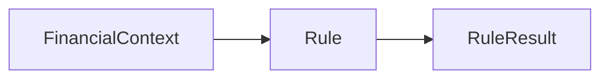

Every Rule receives:

```text
FinancialContext
```

Every Rule returns:

```text
RuleResult
```

Nothing else.

---

# 23. Rule Lifecycle

Every Rule follows the same lifecycle.

```mermaid
flowchart TD

Receive Context

↓

Evaluate Condition

↓

Perform Calculation

↓

Generate Evidence

↓

Determine Status

↓

Assign Severity

↓

Return RuleResult
```

This lifecycle is mandatory.

---

# 24. Rule Responsibilities

A Rule owns:

* one business decision,
* one calculation,
* one evidence set,
* one result.

A Rule does **not** own:

* aggregation,
* recommendations,
* summaries,
* DTO construction,
* persistence.

---

# 25. Standard Rule Structure

Every Rule follows the same internal structure.

```text
Rule

├── Metadata

├── Condition

├── Calculator

├── Evidence Builder

├── Severity Evaluator

└── RuleResult Builder
```

---

# 26. Rule Interface

Every Rule exposes one public method.

```text
evaluate(context)

↓

RuleResult
```

Future implementations should share this interface across every Rule Engine.

---

# 27. RuleResult Overview

RuleResult is the universal output of every Rule.

Instead of returning:

```text
Savings Rate

18%
```

the Rule returns a rich object.

```text
RuleResult

↓

value

status

severity

evidence

weight

passed

message
```

---

# 28. RuleResult UML

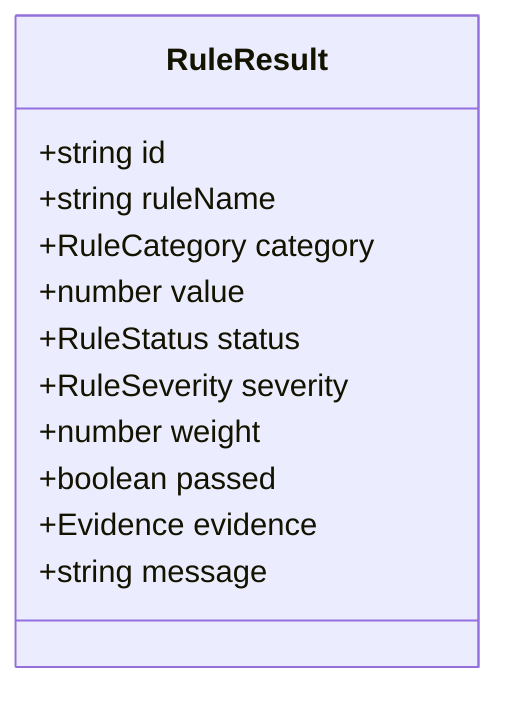

---

# 29. RuleResult Responsibilities

RuleResult contains:

* calculation output,
* evaluation outcome,
* supporting evidence,
* human-readable explanation.

RuleResult never contains:

* UI formatting,
* JSX,
* React state,
* repository references.

---

# 30. Example RuleResult

```json
{
  "ruleName": "SavingsRateRule",

  "value": 18,

  "status": "Healthy",

  "severity": "Info",

  "weight": 8,

  "passed": true,

  "message": "Savings rate is within the healthy range."
}
```

---

# 31. Rule Categories

Every Rule belongs to one category.

Supported categories:

```text
Health

Income

Expenses

Savings

SavingsGoals

Cashflow

Cutoff

General
```

This enables grouping, diagnostics, and analytics.

---

# 32. Rule Status

Status describes the evaluated condition.

Supported values:

```text
Passed

Warning

Failed

Not Applicable

No Data
```

Meaning

Passed

Rule satisfied.

Warning

Condition is acceptable but should be monitored.

Failed

Financial issue detected.

Not Applicable

Rule cannot execute in this scope.

No Data

Required records do not exist.

---

# 33. Rule Severity

Severity indicates importance.

Supported values:

```text
Info

Suggestion

Warning

Critical
```

Severity is independent of pass/fail.

Example

A failed informational rule may still have low business impact.

---

# 34. Rule Weight

Every Rule contributes differently.

Weight represents relative importance.

Example

```text
Positive Cashflow Rule

Weight

10

↓

Dining Trend Rule

Weight

2
```

Weights are later consumed by:

* Health Engine
* Recommendation Engine

---

# 35. Evidence Philosophy

Evidence is the foundation of explainable financial intelligence.

Instead of returning:

```text
Health Score

84
```

the platform should know why.

---

# 36. Evidence Model

Evidence explains:

* inputs,
* calculations,
* comparisons,
* observations.

---

## UML

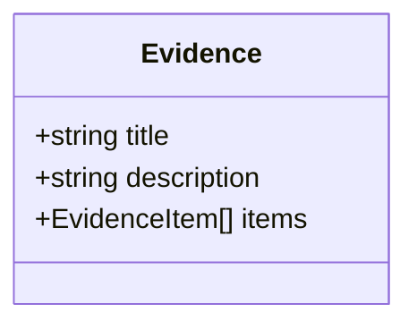

---

# 37. Evidence Items

Each Evidence contains one or more EvidenceItems.

Example

```text
Savings Rate

↓

Income

₱50,000

Savings

₱9,000

Savings Rate

18%
```

---

## UML

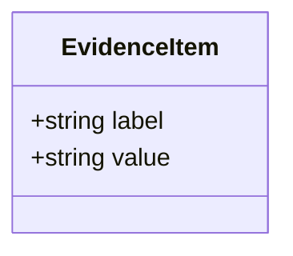

---

# 38. Why Evidence Exists

Evidence serves multiple consumers.

```text
RuleResult

↓

Recommendation

↓

Summary

↓

AI Coach

↓

User Explanation
```

Every explanation originates from Evidence.

---

# 39. Condition Model

Every Rule begins with a condition.

Examples

```text
Income Exists?

↓

Evaluate
```

```text
Current Cutoff Exists?

↓

Evaluate
```

```text
Savings Records Available?

↓

Evaluate
```

If the condition fails,

the Rule returns:

```text
No Data
```

rather than throwing an exception.

---

# 40. Condition Lifecycle

```mermaid
flowchart TD

FinancialContext

↓

Condition

↓

Satisfied?

↓

Yes

↓

Calculator

↓

RuleResult

Satisfied?

↓

No

↓

No Data RuleResult
```

---

# 41. Calculator

The Calculator performs mathematics only.

Examples

```text
Savings Rate

=

Savings

/

Income
```

```text
Cashflow

=

Income

-

Expenses

-

Savings
```

Calculators never assign severity.

---

# 42. Severity Evaluation

After calculation,

the Rule determines business importance.

Example

```text
Savings Rate

18%

↓

Healthy

↓

Info
```

```text
Savings Rate

2%

↓

Critical
```

---

# 43. Message Builder

Every Rule generates a deterministic message.

Example

```text
Your savings rate is healthy.
```

instead of

```text
Everything looks good!
```

Messages should remain factual.

---

# 44. Rule Execution Sequence

```mermaid
sequenceDiagram

participant Rule

participant Calculator

participant Evidence

participant Severity

Rule->>Calculator: Compute

Calculator-->>Rule

Rule->>Evidence: Build

Evidence-->>Rule

Rule->>Severity: Evaluate

Severity-->>Rule

Rule-->>RuleResult
```

---

# 45. Rule Validation

Every RuleResult must satisfy:

✔ id exists

✔ ruleName exists

✔ category exists

✔ status exists

✔ severity exists

✔ weight exists

✔ evidence exists

✔ message exists

---

# 46. Rule Immutability

Once created,

RuleResults become immutable.

Forbidden

```javascript
result.weight = 100;
```

Forbidden

```javascript
result.status = "Passed";
```

If recalculation is required,

the Rule executes again.

---

# 47. Reusable Rule Pattern

Every Rule should resemble:

```text
FinancialContext

↓

Condition

↓

Calculator

↓

Evidence

↓

Severity

↓

RuleResult
```

No Rule should deviate from this architecture.

---

# 48. Architecture Decision Records

---

## ADR-006

### Why RuleResult?

Decision

Every Rule returns the same contract.

Reason

Standardization across all Rule Engines.

---

## ADR-007

### Why Evidence?

Decision

Every financial conclusion must be explainable.

Reason

Supports AI, summaries, and user trust.

---

## ADR-008

### Why Weight?

Decision

Rules contribute unequally.

Reason

Supports Health Score and prioritization.

---

## ADR-009

### Why Separate Calculator and Severity?

Decision

Mathematics and business interpretation are different responsibilities.

Reason

Cleaner architecture and easier testing.

---

## ADR-010

### Why Conditions?

Decision

Rules gracefully handle incomplete financial data.

Reason

Avoid exceptions while maintaining deterministic outputs.

---

# 49. Acceptance Criteria

This section is complete when:

* The Rule model is standardized.
* RuleResult is fully specified.
* Evidence contracts are defined.
* Rule categories, statuses, and severities are standardized.
* Weighting is documented.
* Condition evaluation is established.
* Calculator and Severity responsibilities are separated.
* Rule execution and validation are standardized.

---

# Part II Summary

Part II defines the fundamental building block of the Financial Intelligence Platform: the **Rule**.

It introduces the standardized Rule lifecycle, the universal `RuleResult` contract, evidence generation, condition evaluation, severity assignment, weighting, and validation. Every Rule follows the same architecture, ensuring that all financial analysis remains deterministic, explainable, reusable, and independently testable.

This standard becomes the blueprint for every future Rule—whether calculating a savings rate, detecting spending trends, evaluating financial health, or producing recommendations—providing a consistent foundation for the entire Rule-Based Financial Intelligence Platform.

---

**End of Part II**

**Next Section:** **Part III — Rule Engine Pipeline, Calculator, Aggregator, Insight Builder & Validation**

# 04 — Rule Engine Architecture (Part III)

> **Document Version:** 2.0.0
> **Status:** Draft — Architecture Review Pending
> **Parent Documents:**
>
> * `00-PesoPilot-v2.0-Source-of-Truth.md`
> * `01-Rule-Based-Financial-Intelligence-Architecture.md`
> * `02-InsightBundle-and-Data-Contracts.md`
> * `03-Insight-Engine-Architecture.md`
>
> **Phase:** Phase 11A — Rule-Based Financial Intelligence
>
> **Section:** Rule Engine Pipeline, Calculator, Aggregator, Insight Builder & Validation

---

# 50. Purpose

This section defines the internal implementation pipeline shared by every Rule Engine in PesoPilot.

Parts I and II defined:

* what a Rule Engine is,
* what a Rule is,
* what a RuleResult contains,
* how evidence, severity, weight, and conditions work.

Part III defines how those pieces are assembled into a complete domain-specific Insight DTO.

Every future engine should follow this pipeline:

```text
FinancialContext
    ↓
Rules
    ↓
RuleResults
    ↓
Aggregator
    ↓
InsightBuilder
    ↓
InsightValidator
    ↓
Insight DTO
```

This pipeline becomes the reusable implementation template for:

* Health Engine
* Income Engine
* Expense Engine
* Savings Engine
* Goal Engine
* Cashflow Engine
* Cutoff Engine

---

# 51. Why Rule Engines Are Pipelines

A Rule Engine should not be implemented as one large function.

Incorrect:

```text
generateHealthInsight()
    calculates income
    calculates expenses
    calculates savings
    determines status
    builds explanation
    returns object
```

Correct:

```text
Rule Engine
    ↓
Rules
    ↓
Rule Results
    ↓
Aggregator
    ↓
Builder
    ↓
Validator
```

This makes each responsibility testable and replaceable.

---

# 52. Standard Rule Engine Internal Architecture

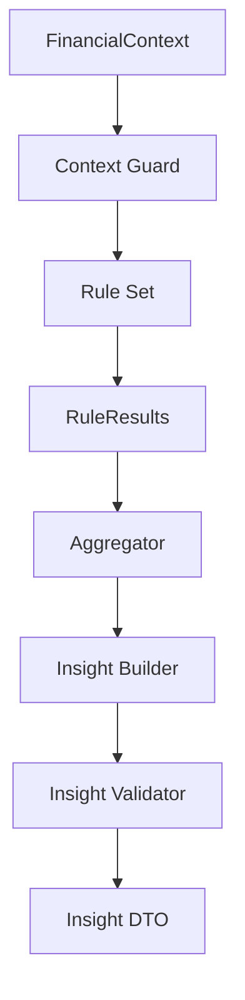

---

# 53. Standard Engine Interface

Every Rule Engine exposes a single public function:

```javascript
generate(context)
```

Input:

```text
FinancialContext
```

Output:

```text
Insight DTO
```

Example:

```javascript
const healthInsight = healthEngine.generate(context)
```

The caller does not know:

* which rules executed,
* how aggregation happened,
* how the DTO was built,
* how validation was performed.

That is internal to the engine.

---

# 54. Internal Engine Components

Every Rule Engine contains these internal components:

```text
Rule Engine

├── Context Guard
├── Rule Set
├── Calculator(s)
├── Aggregator
├── Insight Builder
└── Insight Validator
```

Not every engine needs many calculators, but every engine should conceptually keep calculation, aggregation, construction, and validation separate.

---

# 55. Context Guard

The Context Guard performs lightweight precondition checks before rule execution.

It answers:

> "Can this engine safely run with the provided context?"

Examples:

* Does `context` exist?
* Does `context.scope` exist?
* Are required collections arrays?
* Is current cutoff required for this engine?
* Are records normalized?

The Context Guard should not calculate insights.

---

## Context Guard Result

The Context Guard may return:

```text
valid
invalid
partial
```

Meaning:

* `valid` — engine can run normally.
* `partial` — engine can run but should include warnings or no-data outputs.
* `invalid` — engine should return a safe fallback insight.

---

# 56. Context Guard Flow

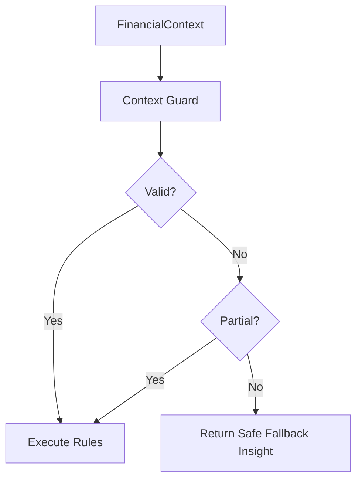

---

# 57. Rule Set

A Rule Set is the ordered collection of Rules owned by one Rule Engine.

Example:

```text
Savings Engine Rule Set

├── SavingsTotalRule
├── SavingsRateRule
├── ContributionCountRule
├── LargestContributionRule
└── SavingsTrendRule
```

The Rule Set is deterministic.

The same context always executes the same rules in the same order.

---

# 58. Rule Set Responsibilities

The Rule Set:

* owns rule ordering,
* executes each rule,
* collects RuleResults,
* handles rule-level no-data responses,
* returns a complete list of RuleResults.

The Rule Set does not:

* aggregate results,
* build DTOs,
* validate final insights,
* generate recommendations.

---

# 59. Rule Set Sequence

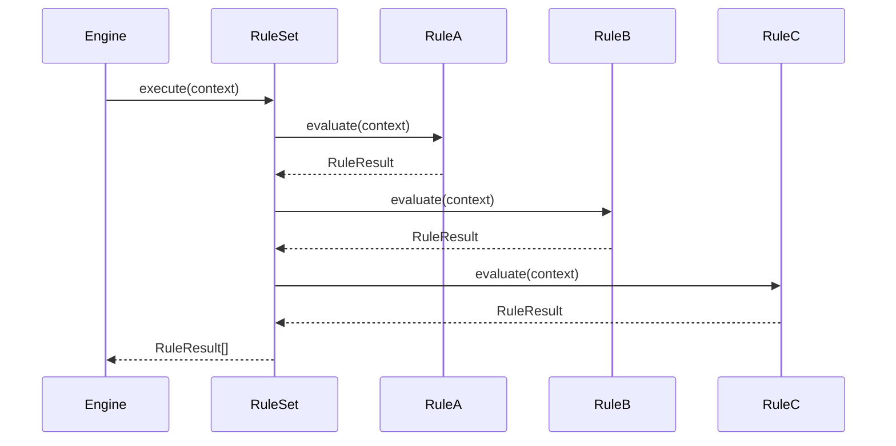

---

# 60. Calculator Architecture

Calculators perform pure mathematical work.

They answer:

> "What is the value?"

They do not answer:

> "Is this good or bad?"

Example:

```javascript
calculateSavingsRate({ incomeTotal, savingsTotal })
```

returns:

```text
18
```

It does not return:

```text
Healthy
```

---

# 61. Calculator Responsibilities

Calculators may:

* sum values,
* compute rates,
* compute differences,
* compute percentages,
* compute averages,
* compute comparisons,
* compute totals.

Calculators must not:

* assign severity,
* assign recommendation priority,
* generate UI text,
* access repositories,
* mutate context,
* create Insight DTOs.

---

# 62. Calculator Contract

Calculators should be pure functions.

```text
Input
    ↓
Plain numbers / normalized records
    ↓
Output
    ↓
Plain calculated value
```

Example:

```javascript
const savingsRate = calculateRate(savingsTotal, incomeTotal)
```

If calculation cannot be performed, return a safe value according to the rule's needs.

Examples:

```text
0
null
NaN-safe fallback
```

The Rule decides how to interpret missing or impossible calculations.

---

# 63. Calculator Error Rules

Calculators should avoid throwing for common no-data cases.

Examples:

* division by zero,
* empty arrays,
* missing optional value.

Instead:

```text
Calculator returns safe value
Rule assigns No Data / Not Applicable
```

Throwing is reserved for programmer errors, not user data gaps.

---

# 64. Aggregator Architecture

The Aggregator combines RuleResults into a domain-level intermediate result.

It answers:

> "What do these RuleResults mean together?"

Example:

Health Engine:

```text
RuleResults
    ↓
Weighted Score
    ↓
Health Breakdown
```

Expense Engine:

```text
RuleResults
    ↓
Top Category
    ↓
Distribution
    ↓
Trend
```

Savings Engine:

```text
RuleResults
    ↓
Savings Total
    ↓
Savings Rate
    ↓
Contribution Insights
```

---

# 65. Aggregator Responsibilities

The Aggregator may:

* combine RuleResults,
* compute weighted scores from RuleResults,
* choose top/bottom values,
* derive domain status,
* organize breakdowns,
* prepare builder-ready intermediate objects.

The Aggregator must not:

* read FinancialContext directly unless explicitly passed as read-only support data,
* execute Rules,
* generate recommendations,
* generate summaries,
* create final InsightBundle.

---

# 66. Aggregation Strategies

Common aggregation strategies:

## Weighted Score Aggregation

Used by:

* Health Engine
* Future risk engines

```text
RuleResult[]
    ↓
weighted total
    ↓
score
```

---

## Ranking Aggregation

Used by:

* Expense Engine
* Savings Goal Engine
* Recommendation Engine

```text
records / results
    ↓
sort
    ↓
top result
```

---

## Distribution Aggregation

Used by:

* Expense Engine
* Income Engine
* Savings Engine

```text
grouped values
    ↓
percent share
    ↓
distribution
```

---

## Trend Aggregation

Used by:

* Income Engine
* Expense Engine
* Savings Engine
* Cashflow Engine

```text
current value
previous value
    ↓
difference
    ↓
trend direction
```

---

# 67. Aggregator Output

The Aggregator returns an internal object.

Example:

```javascript
{
  score: 84,
  status: "Healthy",
  breakdown: [...],
  strengths: [...],
  weaknesses: [...]
}
```

This object is **not** the final DTO yet.

The Builder is responsible for producing the final DTO contract.

---

# 68. Insight Builder

The Insight Builder converts aggregator output into the official Insight DTO.

It answers:

> "How do we shape this domain result into the contract defined in Document 02?"

The Builder is contract-aware.

The Aggregator is logic-aware.

---

# 69. Builder Responsibilities

The Insight Builder:

* maps internal outputs to DTO fields,
* supplies default values,
* normalizes empty states,
* includes explanation strings,
* ensures arrays exist,
* ensures object structure matches Document 02.

The Builder must not:

* run rules,
* recalculate values,
* read repositories,
* mutate FinancialContext,
* generate recommendations.

---

# 70. Insight Builder Pattern

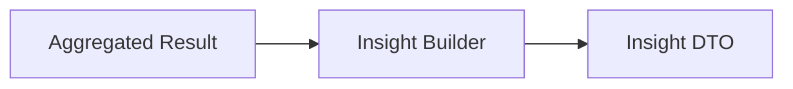

---

# 71. Builder Defaults

Every Builder is responsible for stable defaults.

Examples:

```javascript
recommendations: []
```

not:

```javascript
recommendations: null
```

For domain insights:

```javascript
{
  totalExpenses: 0,
  distribution: [],
  trend: "No Data"
}
```

not:

```javascript
{
  expenses: null
}
```

---

# 72. Insight Validator

The Validator verifies the final DTO before returning it to the Rule Runner.

It answers:

> "Does this DTO satisfy the contract?"

---

# 73. Validator Responsibilities

Validators check:

* required fields,
* allowed enum values,
* numeric safety,
* collection initialization,
* nullability rules,
* DTO-specific invariants.

Validators must not:

* fix calculations silently,
* mutate DTOs,
* query repositories,
* modify RuleResults.

---

# 74. Validation Flow

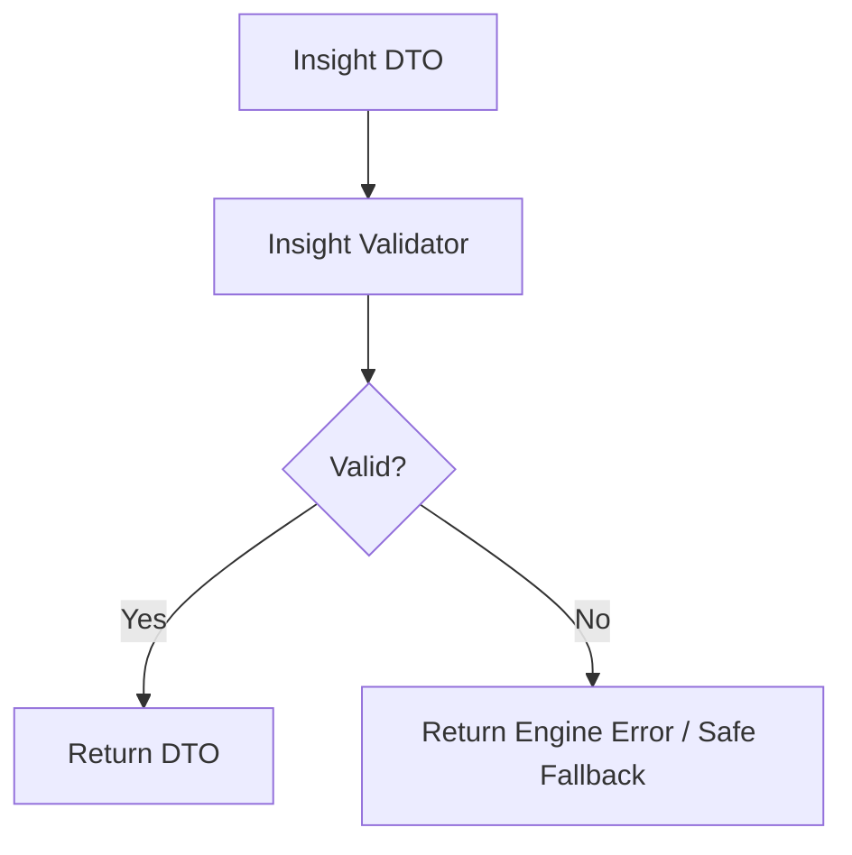

---

# 75. Validation Failure Strategy

Validation failure is serious because it means the engine produced an invalid contract.

Possible responses:

* return a safe fallback DTO,
* add warning to engine diagnostics,
* throw an engine-level error for the InsightService to capture.

The chosen strategy depends on engine severity.

For Phase 11A, prefer safe fallback DTOs where possible.

---

# 76. Complete Rule Engine Pipeline

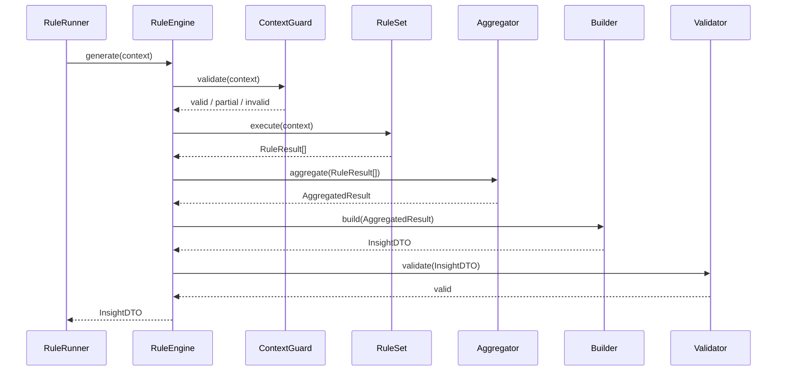

---

# 77. Safe Fallback DTOs

Every engine must define a safe fallback DTO.

Example:

```javascript
{
  status: "No Data",
  explanation: "Not enough data is available to generate this insight."
}
```

Fallback DTOs must still satisfy the contract.

They are not null.

---

# 78. Engine Diagnostics

Each engine may produce diagnostics.

Examples:

```text
ruleCount
rulesPassed
rulesFailed
warnings
processingTime
```

Diagnostics are not user-facing by default.

They support debugging and future observability.

---

# 79. Internal Error Handling

Rule-level failure:

```text
RuleResult = Failed / No Data
```

Engine-level failure:

```text
Fallback DTO + warning
```

Bundle-level failure:

```text
InsightBundle rejected
```

---

# 80. Pipeline Quality Gates

Each engine passes internal quality gates.

```text
Gate 1 — Context Guard passed or fallback used
Gate 2 — RuleResults generated
Gate 3 — Aggregation completed
Gate 4 — DTO built
Gate 5 — DTO validated
```

No engine returns unvalidated output.

---

# 81. Performance Expectations

Each Rule Engine should be lightweight.

Expected target:

```text
Single engine execution < 10ms for normal datasets
```

Complex engines may exceed this, but should remain linear with data size.

---

# 82. Implementation Template

Each engine should conceptually follow:

```javascript
export function generate(context) {
  const guard = validateContext(context)

  if (guard.status === "invalid") {
    return buildFallbackInsight(guard)
  }

  const ruleResults = executeRules(context)
  const aggregated = aggregate(ruleResults)
  const insight = buildInsight(aggregated)
  const validation = validateInsight(insight)

  if (!validation.valid) {
    return buildFallbackInsight(validation)
  }

  return freezeInsight(insight)
}
```

This is a conceptual template, not mandatory code syntax.

---

# 83. Testing Requirements

Every Rule Engine pipeline requires tests for:

* valid context,
* partial context,
* invalid context,
* each Rule,
* aggregation,
* DTO construction,
* DTO validation,
* safe fallback output,
* deterministic output.

---

# 84. Architecture Decision Records

## ADR-011

### Why Pipeline Architecture?

**Decision**

Every Rule Engine uses a fixed internal pipeline.

**Reason**

Improves consistency, testing, and implementation clarity.

---

## ADR-012

### Why Separate Calculator?

**Decision**

Calculations are separated from interpretation.

**Reason**

Mathematical correctness can be tested independently.

---

## ADR-013

### Why Aggregator?

**Decision**

RuleResults are combined before DTO construction.

**Reason**

Keeps Builders contract-focused and Rules isolated.

---

## ADR-014

### Why Builder?

**Decision**

DTO construction is separated from aggregation.

**Reason**

Keeps contract mapping explicit and reusable.

---

## ADR-015

### Why Validator?

**Decision**

Every Insight DTO is validated before return.

**Reason**

Prevents invalid financial intelligence from entering the InsightBundle.

---

# 85. Acceptance Criteria

This section is complete when:

* The internal Rule Engine pipeline is standardized.
* Calculator responsibilities are separated from Rule interpretation.
* Aggregator responsibilities are defined.
* Insight Builder responsibilities are defined.
* DTO validation responsibilities are defined.
* Safe fallback behavior is established.
* Engine diagnostics are documented.
* Quality gates are defined.
* Testing responsibilities are standardized.

---

# Part III Summary

Part III defines the reusable implementation pipeline that every Rule Engine in PesoPilot must follow.

Each engine receives an immutable `FinancialContext`, validates it through a Context Guard, executes its Rule Set, aggregates RuleResults, builds the official Insight DTO, validates that DTO, and returns a safe immutable result. This pipeline separates financial calculation, business interpretation, contract construction, and validation into distinct components.

Because every Rule Engine follows the same architecture, future engines can be implemented consistently, tested independently, extended safely, and integrated into the Insight Engine without redesigning the financial intelligence platform.

---

**End of Part III**

**Next Section:** **Part IV — Rule Registry, Rule Execution Order, Dependency Rules & Engine Composition**

# 04 — Rule Engine Architecture (Part IV)

> **Document Version:** 2.0.0
> **Status:** Draft — Architecture Review Pending
>
> **Parent Documents:**
>
> * `00-PesoPilot-v2.0-Source-of-Truth.md`
> * `01-Rule-Based-Financial-Intelligence-Architecture.md`
> * `02-InsightBundle-and-Data-Contracts.md`
> * `03-Insight-Engine-Architecture.md`
>
> **Phase:** Phase 11A — Rule-Based Financial Intelligence
>
> **Section:** Rule Registry, Rule Execution Order, Dependency Rules & Engine Composition

---

# 86. Purpose

Previous sections defined:

* what a Rule Engine is,
* what a Rule is,
* how a Rule Engine internally operates.

This section defines how Rules are **organized, registered, executed, and composed** inside each Rule Engine.

Without a standard registry architecture, Rule Engines eventually become large collections of manually executed methods.

The Rule Registry solves this problem.

---

# 87. Rule Registry Philosophy

Every Rule Engine owns one Rule Registry.

Instead of manually calling rules:

```javascript
executeRuleA()

executeRuleB()

executeRuleC()
```

the engine executes a registry.

```text
Health Rule Registry

↓

Health Rules

↓

RuleRunner

↓

RuleResults
```

The registry becomes the single source of truth for that engine's Rules.

---

# 88. High-Level Architecture

```mermaid
flowchart TD

RuleEngine

↓

RuleRegistry

↓

Ordered Rules

↓

RuleRunner

↓

RuleResults
```

---

# 89. Why a Rule Registry?

Benefits:

* centralized rule management
* deterministic ordering
* easier testing
* easier maintenance
* easier feature additions
* future dynamic rule loading
* simpler engine implementation

Instead of modifying engine code,

new Rules are registered.

---

# 90. Registry Responsibilities

The Rule Registry is responsible for:

* registering Rules
* exposing execution order
* preventing duplicate registration
* grouping related Rules
* providing Rule metadata

It is **not** responsible for:

* calculations
* aggregation
* recommendations
* summaries

---

# 91. Registry Structure

Every Rule Registry should resemble:

```text
HealthRuleRegistry

├── HealthScoreRule

├── SavingsRateRule

├── EmergencyFundRule

├── SpendingControlRule

├── CashflowRule

└── StabilityRule
```

Expense Registry

```text
ExpenseRuleRegistry

├── LargestExpenseRule

├── SpendingTrendRule

├── CategoryDistributionRule

├── SpendingIncreaseRule

└── LargestMerchantRule
```

---

# 92. Rule Metadata

Every registered Rule should expose metadata.

Example

```text
Rule ID

Rule Name

Description

Category

Priority

Version

Dependencies
```

Example

```text
SavingsRateRule

Category:
Savings

Priority:
40

Version:
1.0
```

Metadata improves diagnostics and future tooling.

---

# 93. Rule Registration Sequence

```mermaid
sequenceDiagram

participant Engine

participant Registry

participant Rule

Engine->>Registry: loadRules()

Registry->>Rule: register()

Rule-->>Registry

Registry-->>Engine: Ordered Rule List
```

---

# 94. Rule Ordering Philosophy

Rule execution must always be deterministic.

The same FinancialContext should execute:

* the same Rules,
* in the same order,
* every time.

Execution order must never depend on:

* JavaScript object order,
* filesystem order,
* import order,
* random insertion order.

---

# 95. Rule Priority

Rules are ordered using priority.

Lower number = earlier execution.

Example

| Priority | Rule                |
| -------: | ------------------- |
|       10 | IncomeExistsRule    |
|       20 | IncomeTotalRule     |
|       30 | IncomeTrendRule     |
|       40 | IncomeGrowthRule    |
|       50 | IncomeBreakdownRule |

The priority values themselves have no business meaning.

They exist only to guarantee stable execution.

---

# 96. Rule Execution Pipeline

```mermaid
flowchart TD

Registry

↓

Sort Rules

↓

Rule 1

↓

Rule 2

↓

Rule 3

↓

Rule N

↓

RuleResults
```

---

# 97. Sequential Execution

Current Phase:

Rules execute sequentially.

```text
Rule A

↓

Rule B

↓

Rule C

↓

Rule D
```

Reasons:

* simpler debugging
* deterministic logs
* easier testing
* predictable execution

Future versions may parallelize independent Rules.

---

# 98. Rule Dependencies

Most Rules should be independent.

Example

```text
Largest Expense Rule

↓

FinancialContext
```

No dependency on:

```text
Spending Trend Rule
```

Independent Rules improve:

* reuse
* testing
* concurrency

---

# 99. Dependent Rules

Some Rules naturally depend on previous Rule outputs.

Example

```text
Savings Total Rule

↓

Savings Rate Rule
```

Savings Rate requires total savings.

Instead of recalculating,

the registry may expose earlier RuleResults.

---

# 100. Dependency Graph

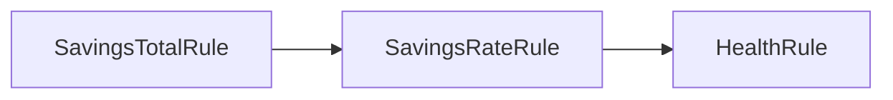

Dependency chains should remain shallow.

---

# 101. Dependency Rules

Allowed

```text
Rule

↓

FinancialContext
```

Allowed

```text
Rule

↓

Earlier RuleResult
```

Forbidden

```text
Rule

↓

Repository
```

Forbidden

```text
Rule

↓

Dexie
```

Forbidden

```text
Rule

↓

React
```

---

# 102. Engine Composition

A Rule Engine is composed of reusable modules.

```text
Rule Engine

├── Registry

├── RuleRunner

├── Calculator(s)

├── Aggregator

├── Builder

└── Validator
```

Every component has one responsibility.

---

# 103. Composition Diagram

```mermaid
flowchart TD

RuleEngine

-->

Registry

Registry

-->

RuleRunner

RuleRunner

-->

Rules

Rules

-->

Aggregator

Aggregator

-->

Builder

Builder

-->

Validator
```

---

# 104. RuleRunner Responsibilities

The RuleRunner executes Rules supplied by the Registry.

Responsibilities:

* iterate Rules
* execute in order
* collect RuleResults
* capture diagnostics
* continue where appropriate

It does not:

* aggregate
* build DTOs
* assign recommendations

---

# 105. RuleRunner Sequence

```mermaid
sequenceDiagram

participant Registry

participant RuleRunner

participant Rule

participant Results

Registry-->>RuleRunner: Ordered Rules

loop Every Rule

RuleRunner->>Rule: evaluate(context)

Rule-->>RuleRunner: RuleResult

end

RuleRunner-->>Results: RuleResult[]
```

---

# 106. Engine Diagnostics

Each engine should expose diagnostics.

Examples

```text
Executed Rules

Passed Rules

Failed Rules

Warnings

Execution Time

Skipped Rules
```

These diagnostics support:

* debugging
* developer tools
* benchmarking

---

# 107. Rule Groups

Large engines may organize Rules into groups.

Example

```text
Expense Rules

├── Totals

├── Distribution

├── Trends

├── Categories

├── Merchants

└── Alerts
```

Grouping improves readability.

---

# 108. Registry Extension

Adding a new Rule should require:

```text
Create Rule

↓

Register Rule

↓

Write Tests
```

No Aggregator changes unless the new Rule contributes new intelligence.

---

# 109. Registry Versioning

Every Registry should expose a version.

Example

```text
Health Registry

Version

1.0
```

Future versions:

```text
1.1

2.0
```

Useful for:

* diagnostics
* AI prompt metadata
* migration tracking

---

# 110. Failure Handling

If one Rule fails:

```text
Rule Failure

↓

Diagnostic

↓

Continue

↓

Next Rule
```

The engine should continue unless the failed Rule is explicitly required for downstream processing.

---

# 111. Registry Validation

Before execution, the Registry should verify:

* duplicate Rule IDs
* duplicate priorities
* missing metadata
* circular dependencies
* invalid Rule configuration

Invalid registries should fail during development rather than at runtime.

---

# 112. Circular Dependency Prevention

Circular dependencies are forbidden.

Example

```text
Rule A

↓

Rule B

↓

Rule A
```

The Registry should detect these during initialization.

---

# 113. Parallel Execution (Future)

Future architecture may support:

```mermaid
flowchart LR

Rule A

-->

Merge

Rule B

-->

Merge

Rule C

-->

Merge

Merge

-->

Aggregator
```

Only independent Rules may execute in parallel.

Dependent Rules remain sequential.

---

# 114. Registry Example

```text
HealthRuleRegistry

├── IncomeStabilityRule

├── ExpenseControlRule

├── SavingsRateRule

├── EmergencyFundRule

├── CashflowRule

├── GoalProgressRule

└── FinancialHealthRule
```

The Registry is descriptive.

The RuleRunner remains generic.

---

# 115. Architecture Decision Records

## ADR-016

### Why Rule Registry?

**Decision**

Each Rule Engine owns a Rule Registry.

**Reason**

Centralizes Rule management and simplifies extension.

---

## ADR-017

### Why Ordered Execution?

**Decision**

Rules execute in deterministic priority order.

**Reason**

Improves reproducibility and debugging.

---

## ADR-018

### Why Metadata?

**Decision**

Every Rule exposes metadata.

**Reason**

Supports diagnostics, tooling, and future AI integrations.

---

## ADR-019

### Why Independent Rules?

**Decision**

Rules should be independent whenever possible.

**Reason**

Improves testing, reuse, and future concurrency.

---

## ADR-020

### Why Registry Validation?

**Decision**

Validate registries before execution.

**Reason**

Prevent runtime failures caused by configuration errors.

---

# 116. Acceptance Criteria

This section is complete when:

* Rule Registry responsibilities are documented.
* Rule registration process is standardized.
* Rule execution order is deterministic.
* Rule metadata requirements are defined.
* Dependency rules are established.
* Engine composition is documented.
* Registry validation is defined.
* Future parallel execution strategy is documented.

---

# Part IV Summary

Part IV defines how Rules are organized and executed within every Rule Engine.

By introducing the **Rule Registry**, the architecture separates Rule management from Rule execution, ensuring deterministic ordering, centralized metadata, and a consistent extension model. The Registry, RuleRunner, and dependency rules together create a scalable execution framework that supports future growth without increasing engine complexity.

This design allows new financial Rules to be added by registration rather than modification, making the Financial Intelligence Platform easier to maintain, test, and extend as PesoPilot evolves.

---

**End of Part IV**

**Next Section:** **Part V — Performance, Caching, Concurrency & Testing Strategy**

# 04 — Rule Engine Architecture (Part V)

> **Document Version:** 2.0.0
> **Status:** Draft — Architecture Review Pending
>
> **Parent Documents:**
>
> * `00-PesoPilot-v2.0-Source-of-Truth.md`
> * `01-Rule-Based-Financial-Intelligence-Architecture.md`
> * `02-InsightBundle-and-Data-Contracts.md`
> * `03-Insight-Engine-Architecture.md`
>
> **Phase:** Phase 11A — Rule-Based Financial Intelligence
>
> **Section:** Performance, Caching, Concurrency & Testing Strategy

---

# 117. Purpose

This section defines the operational characteristics of every Rule Engine.

Previous sections established:

* Rule architecture
* Rule models
* Rule pipeline
* Rule registry

This section ensures that every Rule Engine is:

* performant,
* deterministic,
* scalable,
* cache-friendly,
* concurrency-safe,
* thoroughly tested.

Performance optimizations must never compromise correctness or explainability.

---

# 118. Operational Principles

Every Rule Engine follows these principles.

1. Deterministic execution
2. Pure computation
3. No hidden state
4. Linear scalability
5. Safe concurrency
6. Complete test coverage

These principles apply regardless of the financial domain.

---

# 119. Performance Philosophy

Rule Engines operate on local financial data.

Typical datasets remain relatively small compared to enterprise systems, but performance should still scale predictably.

The objective is:

> **Generate financial intelligence fast enough that the user perceives it as instantaneous.**

---

# 120. Performance Targets

Recommended execution targets per Rule Engine:

| Stage                  |  Target |
| ---------------------- | ------: |
| Context Guard          |  < 1 ms |
| Rule Execution         |  < 5 ms |
| Aggregation            |  < 2 ms |
| DTO Construction       |  < 1 ms |
| Validation             |  < 1 ms |
| Total Engine Execution | < 10 ms |

These are engineering goals rather than hard guarantees.

---

# 121. Time Complexity Guidelines

Preferred complexity:

| Operation        | Target Complexity |
| ---------------- | ----------------- |
| Record scan      | O(n)              |
| Totals           | O(n)              |
| Grouping         | O(n)              |
| Trend comparison | O(n)              |
| Ranking          | O(n log n)        |
| Rule evaluation  | O(n)              |

Nested loops over entire datasets should be avoided unless unavoidable.

---

# 122. Memory Usage

Rule Engines should minimize unnecessary allocations.

Preferred approach:

```text id="m6bn2t"
FinancialContext

↓

Read

↓

Compute

↓

Discard temporary values
```

Avoid:

```text id="5bpnit"
Duplicate entire collections

↓

Modify copies

↓

Return copies
```

Rule Engines should reference FinancialContext without cloning it.

---

# 123. Temporary Objects

Temporary objects are acceptable when:

* grouping records,
* sorting values,
* calculating distributions,
* constructing evidence.

They should exist only for the duration of the engine execution.

---

# 124. Caching Philosophy

Current implementation:

```text id="1l4vba"
Every Rule Engine executes
whenever InsightService runs.
```

No engine-level caching is introduced during Phase 11A.

Caching belongs to the Insight Engine, not individual Rule Engines.

---

# 125. Why No Engine Cache?

Caching inside Rule Engines introduces several risks:

* stale calculations,
* inconsistent results,
* duplicated cache logic,
* invalidation complexity.

Instead:

```text id="b1kgoe"
InsightService

↓

Cache

↓

Rule Engines
```

The orchestration layer owns caching.

---

# 126. Future Cache Flow

```mermaid
flowchart LR

Request

-->

Insight Cache

Insight Cache

-->|Hit| InsightBundle

Insight Cache

-->|Miss| Rule Engines

Rule Engines

--> InsightBundle

InsightBundle --> Insight Cache
```

Rule Engines remain unaware of caching.

---

# 127. Cache Invalidation

Future cache invalidation occurs when:

* Expense created
* Expense updated
* Expense deleted
* Income changes
* Savings contribution changes
* Goal changes
* Cutoff changes
* Settings affecting calculations change

Rule Engines are never responsible for cache invalidation.

---

# 128. Concurrency Philosophy

Current implementation:

Sequential execution.

Future implementation:

Parallel execution of independent Rule Engines and Rules.

The architecture is designed so concurrency can be introduced without changing Rule interfaces.

---

# 129. Thread Safety

Every Rule Engine must behave as a pure function.

```text id="g6nto5"
FinancialContext

↓

Read Only

↓

Insight DTO
```

Rule Engines must never mutate:

* FinancialContext
* RuleResults
* Shared configuration
* Registry metadata

---

# 130. Safe Parallel Execution

Future parallelization is possible because Rule Engines share no mutable state.

```mermaid
flowchart TD

FinancialContext

-->

Health

FinancialContext

-->

Expense

FinancialContext

-->

Savings

FinancialContext

-->

Income

FinancialContext

-->

Cashflow

Health --> Merge

Expense --> Merge

Savings --> Merge

Income --> Merge

Cashflow --> Merge
```

Synchronization occurs only after all engines complete.

---

# 131. Determinism

Determinism is mandatory.

Given identical FinancialContext objects:

```text id="a6hnxg"
Context A

↓

Insight A

Context A

↓

Insight A
```

The result must always be identical.

Determinism supports:

* reproducibility,
* regression testing,
* AI explainability,
* debugging.

---

# 132. Error Recovery

Rule Engines should recover gracefully whenever possible.

Recoverable situations include:

* missing optional data,
* empty datasets,
* missing previous cutoff,
* no savings goals.

These produce:

```text id="q6ynkp"
No Data

or

Not Applicable
```

rather than exceptions.

---

# 133. Fatal Errors

Fatal errors are limited to:

* corrupted FinancialContext,
* invalid DTO construction,
* programming errors.

These should be surfaced to the Insight Engine for centralized handling.

---

# 134. Diagnostics

Each Rule Engine should expose diagnostics.

Suggested fields:

```text id="kqu7v6"
Engine Name

Execution Time

Rule Count

Rules Passed

Rules Failed

Warnings

Version
```

Diagnostics are primarily for developers.

---

# 135. Benchmarking

Future benchmarking should measure:

* execution duration,
* memory usage,
* aggregation cost,
* validation cost,
* total pipeline duration.

Benchmarking should be automated where practical.

---

# 136. Testing Philosophy

Every Rule Engine should be testable in complete isolation.

Testing should not require:

* React,
* Dexie,
* IndexedDB,
* repositories,
* network access.

The preferred test input is a mocked FinancialContext.

---

# 137. Testing Pyramid

```mermaid
flowchart TD

E2E["End-to-End"]

Integration["Integration"]

Unit["Unit"]

Unit --> Integration

Integration --> E2E
```

Most tests should be unit tests.

---

# 138. Unit Testing

Every Rule should have dedicated unit tests.

Examples:

```text id="7q4tgh"
SavingsRateRule

LargestExpenseRule

IncomeTrendRule

CashflowRule

GoalProgressRule
```

Each Rule should be testable independently.

---

# 139. Calculator Testing

Every Calculator should verify:

* normal values,
* zero values,
* negative values (where applicable),
* edge cases,
* rounding behavior,
* division safety.

Calculators should have no dependency on Rule Engines.

---

# 140. Aggregator Testing

Aggregators should verify:

* weighted calculations,
* ranking,
* grouping,
* totals,
* empty results,
* ties,
* ordering.

---

# 141. Builder Testing

Insight Builders should verify:

* DTO completeness,
* default values,
* empty collections,
* null safety,
* contract compatibility.

---

# 142. Validator Testing

Validators should verify:

* required fields,
* enum validity,
* collection initialization,
* invalid DTO rejection,
* valid DTO acceptance.

---

# 143. Integration Testing

Every Rule Engine should have an integration test.

Pipeline:

```text id="sj9rmi"
FinancialContext

↓

Rule Set

↓

Aggregator

↓

Builder

↓

Validator

↓

Insight DTO
```

Goal:

Verify collaboration between components.

---

# 144. Regression Testing

Regression tests compare generated outputs against approved expectations.

```text id="vpuxkp"
Expected Insight DTO

↓

Generated Insight DTO
```

Unexpected changes should fail the test suite.

---

# 145. Performance Testing

Performance tests should verify:

* execution time,
* scaling with larger datasets,
* memory usage,
* stability under repeated execution.

These tests become more valuable as datasets grow.

---

# 146. Code Coverage Goals

Recommended minimum coverage:

| Component               | Target |
| ----------------------- | -----: |
| Rules                   |   100% |
| Calculators             |   100% |
| Aggregators             |   95%+ |
| Builders                |   95%+ |
| Validators              |   100% |
| Rule Engine Integration |   90%+ |

Coverage targets support confidence but should not replace meaningful assertions.

---

# 147. Continuous Verification

Every Rule Engine should pass:

```text id="oe98gs"
npm.cmd run test

↓

npm.cmd run lint

↓

npm.cmd run build
```

before merge.

Architecture documentation should be updated whenever engine behavior changes.

---

# 148. Architecture Decision Records

## ADR-021

### Why No Engine-Level Cache?

**Decision**

Caching belongs to the Insight Engine.

**Reason**

Avoid stale calculations and duplicated cache logic.

---

## ADR-022

### Why Pure Functions?

**Decision**

Rule Engines are stateless.

**Reason**

Supports determinism and future concurrency.

---

## ADR-023

### Why Extensive Unit Testing?

**Decision**

Test every Rule independently.

**Reason**

Business rules change frequently and should remain easy to verify.

---

## ADR-024

### Why Mock FinancialContext?

**Decision**

Tests receive FinancialContext directly.

**Reason**

Removes infrastructure dependencies and speeds execution.

---

## ADR-025

### Why Benchmark Performance?

**Decision**

Monitor execution cost over time.

**Reason**

Prevent gradual performance regressions.

---

# 149. Acceptance Criteria

This section is complete when:

* Performance targets are documented.
* Complexity guidelines are established.
* Memory usage principles are defined.
* Caching responsibilities are assigned.
* Concurrency strategy is documented.
* Determinism requirements are explicit.
* Testing strategy covers Rules, Calculators, Aggregators, Builders, Validators, and full-engine integration.
* Coverage recommendations are established.

---

# Part V Summary

Part V defines the operational standards for every Rule Engine within the PesoPilot Financial Intelligence Platform.

It establishes performance expectations, caching boundaries, concurrency readiness, deterministic execution, error recovery, diagnostics, benchmarking, and a layered testing strategy. By treating Rule Engines as stateless, pure, and independently verifiable components, the platform remains scalable, maintainable, and ready for future optimizations without compromising financial correctness.

This operational blueprint ensures that every Rule Engine not only produces accurate insights but also does so consistently, efficiently, and with a high degree of engineering confidence.

---

**End of Part V**

**Next Section:** **Part VI — Extension Guidelines, Spring Boot Compatibility, AI Compatibility & Future Evolution**

# 04 — Rule Engine Architecture (Part VI)

> **Document Version:** 2.0.0
> **Status:** Draft — Architecture Review Pending
>
> **Parent Documents:**
>
> * `00-PesoPilot-v2.0-Source-of-Truth.md`
> * `01-Rule-Based-Financial-Intelligence-Architecture.md`
> * `02-InsightBundle-and-Data-Contracts.md`
> * `03-Insight-Engine-Architecture.md`
>
> **Phase:** Phase 11A — Rule-Based Financial Intelligence
>
> **Section:** Extension Guidelines, Spring Boot Compatibility, AI Compatibility & Future Evolution

---

# 150. Purpose

This section defines how the Rule Engine Architecture evolves over time.

The architecture designed in Phase 11A is intentionally **larger than today's requirements**.

Although PesoPilot currently executes financial intelligence locally inside the React application, the Rule Engine Architecture is designed to remain unchanged when the project evolves into:

* Spring Boot backend
* REST APIs
* AI Financial Coach
* Ollama
* Cloud synchronization
* Flutter mobile
* Desktop applications

This document ensures future growth requires **extension instead of redesign**.

---

# 151. Extension Philosophy

The Rule Engine Architecture follows the **Open-Closed Principle**.

Rule Engines should be:

* Open for extension
* Closed for modification

Future intelligence should be added by creating new Rules and new Rule Engines rather than rewriting existing ones.

---

# 152. Growth Strategy

Every future feature follows the same lifecycle.

```mermaid
flowchart LR

New Financial Feature

-->

New Rule

-->

Rule Registry

-->

Rule Engine

-->

Insight DTO

-->

InsightBundle

-->

Recommendation Engine

-->

Summary Engine
```

No feature bypasses the Rule Engine Architecture.

---

# 153. Extending Existing Engines

When a new financial metric belongs to an existing domain:

```text
Expense Engine

↓

New Rule

↓

Register Rule

↓

Update Aggregator

↓

Update Builder

↓

Done
```

The engine architecture remains unchanged.

---

# 154. Creating New Rule Engines

When a completely new financial domain is introduced:

```text
Investment Intelligence

↓

Investment Rule Engine

↓

Investment Insight DTO

↓

Recommendation Rules

↓

Summary Rules

↓

InsightBundle
```

Every new engine follows Document 04.

---

# 155. Future Financial Domains

The architecture already supports future domains such as:

```text
Investment Analysis

Debt Management

Subscription Tracking

Insurance Analysis

Retirement Planning

Credit Score Analysis

Tax Insights

Budget Planning

Forecast Intelligence

Net Worth Tracking
```

Each future domain owns its own Rule Engine.

---

# 156. Rule Engine Independence

Future engines should never modify existing engines unnecessarily.

Incorrect

```text
Health Engine

↓

Investment Logic
```

Correct

```text
Investment Rule Engine

↓

Investment Insight
```

The Health Engine may consume Investment Insight in future phases through orchestration—not direct coupling.

---

# 157. Spring Boot Migration Strategy

Current architecture:

```mermaid
flowchart TD

React

↓

InsightService

↓

Rule Engines
```

Future architecture:

```mermaid
flowchart TD

React

↓

REST API

↓

Spring Boot

↓

InsightService

↓

Rule Engines
```

The Rule Engines themselves remain unchanged.

Only orchestration moves from the frontend to the backend.

---

# 158. Why Rule Engines Are Platform Independent

Rule Engines contain:

* business rules
* calculations
* comparisons
* evidence
* explanations

They contain no:

* JSX
* React Hooks
* Zustand
* Dexie
* Browser APIs

This makes them portable.

---

# 159. Future Backend Flow

```mermaid
sequenceDiagram

participant React

participant SpringBoot

participant InsightService

participant RuleEngine

React->>SpringBoot: GET /insights

SpringBoot->>InsightService: loadInsights()

InsightService->>RuleEngine: generate(context)

RuleEngine-->>InsightService

InsightService-->>SpringBoot

SpringBoot-->>React
```

React becomes only a presentation layer.

---

# 160. AI Compatibility Philosophy

Artificial Intelligence never performs deterministic financial calculations.

Instead:

```text
Financial Records

↓

Rule Engines

↓

InsightBundle

↓

AI
```

The AI consumes verified financial intelligence.

It does not create it.

---

# 161. AI Pipeline

```mermaid
flowchart LR

FinancialContext

-->

Rule Engines

-->

InsightBundle

-->

Prompt Builder

-->

Ollama

-->

AI Response
```

The AI layer is downstream from deterministic analysis.

---

# 162. Why AI Consumes InsightBundle

Prompting AI directly with raw transactions introduces:

* duplicated calculations
* inconsistent explanations
* hallucination risk
* different answers from the UI

Instead:

```text
InsightBundle

↓

Prompt Builder

↓

LLM
```

Both the UI and AI reference the same financial facts.

---

# 163. Prompt Builder Relationship

Future Prompt Builder receives:

```text
InsightBundle

+

Conversation Context

↓

Prompt

↓

Ollama
```

Prompt Builder never executes Rules.

It only transforms existing intelligence into natural-language prompts.

---

# 164. Multi-Model Compatibility

Future AI providers:

```text
Ollama

OpenAI

Claude

Gemini

Mistral

DeepSeek

Local Models
```

All consume the same InsightBundle.

No provider-specific Rule Engines should exist.

---

# 165. Mobile Compatibility

Flutter should consume exactly the same intelligence.

```mermaid
flowchart TD

InsightBundle

-->

React

InsightBundle

-->

Flutter

InsightBundle

-->

Desktop

InsightBundle

-->

CLI
```

One contract.

Many consumers.

---

# 166. Cloud Compatibility

Future cloud synchronization changes only data access.

Rule Engines remain unchanged.

```text
Cloud Database

↓

Spring Boot

↓

FinancialContext

↓

Rule Engines
```

Business rules remain independent of storage.

---

# 167. Offline Compatibility

PesoPilot remains local-first.

Offline execution:

```text
IndexedDB

↓

FinancialContext

↓

Rule Engines

↓

InsightBundle
```

No network required.

---

# 168. Version Compatibility

Every Rule Engine should expose:

```text
Engine Version

Registry Version

Rule Version
```

This supports:

* migrations
* debugging
* AI prompt metadata
* future compatibility checks

---

# 169. Backward Compatibility

Changes should preserve existing contracts whenever possible.

Allowed:

* adding new optional DTO fields
* adding new Rules
* adding new Recommendations

Avoid:

* removing DTO fields
* changing enum values
* changing Rule meanings without version updates

---

# 170. Forward Compatibility

The architecture anticipates:

* predictive analytics
* machine learning
* cloud computation
* distributed processing

These should extend the architecture rather than replace it.

---

# 171. Future Insight Evolution

```mermaid
flowchart LR

Rule-Based Intelligence

-->

Recommendations

-->

Summary

-->

AI Coach

-->

Predictive Forecasting

-->

Personalized Financial Advisor
```

Each stage builds on the previous one.

---

# 172. Engineering Guidelines

When implementing future features:

Ask:

1. Does this belong to an existing Rule Engine?
2. Should a new Rule be created?
3. Is a new Insight DTO required?
4. Does the Recommendation Engine need updating?
5. Should the Summary Engine mention it?
6. Does it affect Health Score?
7. Does it require a new contract version?

Only after answering these questions should implementation begin.

---

# 173. Future Documentation Roadmap

Following Document 04:

```text
05 — Health Engine Architecture

06 — Income Engine Architecture

07 — Expense Engine Architecture

08 — Savings & Goal Engine Architecture

09 — Cashflow & Cutoff Engine Architecture

10 — Recommendation Engine Architecture

11 — Summary Engine Architecture

12 — Spring Boot AI Gateway

13 — Prompt Builder Architecture

14 — Ollama Integration

15 — AI Financial Coach
```

Each document extends the framework defined in Documents 00–04.

---

# 174. Architecture Decision Records

## ADR-026

### Why Open-Closed Rule Engines?

**Decision**

Extend Rule Engines through new Rules rather than modifying existing logic.

**Reason**

Reduces regression risk and preserves engine stability.

---

## ADR-027

### Why Backend-Agnostic Architecture?

**Decision**

Rule Engines remain independent of React and Spring Boot.

**Reason**

Supports future backend migration without rewriting financial logic.

---

## ADR-028

### Why AI Consumes InsightBundle?

**Decision**

AI operates on validated financial intelligence rather than raw financial records.

**Reason**

Ensures consistency, explainability, and minimizes hallucination risk.

---

## ADR-029

### Why One Contract Across Platforms?

**Decision**

All clients consume the same InsightBundle.

**Reason**

Maintains feature parity across Web, Mobile, Desktop, and AI.

---

## ADR-030

### Why Design for Future Evolution?

**Decision**

The architecture anticipates future financial domains and AI capabilities.

**Reason**

Enables long-term growth while minimizing architectural rewrites.

---

# 175. Acceptance Criteria

This section is complete when:

* Extension guidelines are defined.
* New Rule Engine creation is standardized.
* Spring Boot migration strategy is documented.
* AI integration boundaries are established.
* Multi-platform compatibility is documented.
* Offline and cloud compatibility are addressed.
* Versioning and compatibility strategies are defined.
* Future documentation roadmap is established.

---

# Part VI Summary

Part VI ensures that the Rule Engine Architecture is not limited to the current React implementation but serves as a long-term foundation for PesoPilot's evolution.

By separating deterministic financial analysis from presentation, infrastructure, and AI concerns, the architecture supports seamless migration to Spring Boot, integration with Ollama and other LLMs, multi-platform clients, cloud synchronization, and future financial domains without requiring fundamental changes to the Rule Engine design.

This future-oriented approach guarantees that the financial intelligence developed during Phase 11A remains reusable, explainable, and maintainable throughout the lifetime of the PesoPilot platform.

---

**End of Part VI**

**Next Section:** **Part VII — Architecture Governance, Engineering Principles, Implementation Roadmap & Final Acceptance Criteria**

# 04 — Rule Engine Architecture (Part VII)

> **Document Version:** 2.0.0
> **Status:** Draft — Architecture Review Pending
>
> **Parent Documents:**
>
> * `00-PesoPilot-v2.0-Source-of-Truth.md`
> * `01-Rule-Based-Financial-Intelligence-Architecture.md`
> * `02-InsightBundle-and-Data-Contracts.md`
> * `03-Insight-Engine-Architecture.md`
>
> **Phase:** Phase 11A — Rule-Based Financial Intelligence
>
> **Section:** Architecture Governance, Engineering Principles, Implementation Roadmap & Final Acceptance Criteria

---

# 176. Purpose

This final section establishes the governance model for the Rule Engine Architecture.

The previous sections defined:

* what Rule Engines are,
* how Rules work,
* how Rule Engines execute,
* how Rules are organized,
* operational behavior,
* future evolution.

This section defines **how the architecture should be protected as PesoPilot grows**.

Every future engineer, AI coding agent, and contributor should follow these governance rules before modifying the Financial Intelligence Platform.

---

# 177. Architecture Governance

The Rule Engine Architecture is considered a foundational subsystem.

Changes to this architecture require:

* architectural review,
* documentation updates,
* regression testing,
* compatibility verification.

Feature development should extend the architecture rather than bypass it.

---

# 178. Governance Principles

The following principles are mandatory.

## Principle 1 — Single Source of Financial Truth

Financial conclusions originate only from Rule Engines.

No page, component, service, or AI model should independently calculate financial intelligence.

---

## Principle 2 — Business Logic Isolation

Business rules belong inside Rule Engines.

Never inside:

* React components,
* hooks,
* repositories,
* DTO builders,
* Prompt Builders.

---

## Principle 3 — Deterministic Outputs

Given the same FinancialContext,

every Rule Engine must generate identical Insight DTOs.

---

## Principle 4 — Explainability

Every generated value must have supporting evidence.

If a value cannot be explained,

it should not exist.

---

## Principle 5 — Immutable Intelligence

Once generated,

Insight DTOs and InsightBundles are read-only.

Consumers never modify generated intelligence.

---

# 179. Engineering Principles

Every implementation should follow these engineering principles.

---

## Single Responsibility

Each component owns one responsibility.

Examples:

Calculator

↓

Calculations

Builder

↓

DTO Construction

Validator

↓

Validation

Aggregator

↓

Aggregation

---

## Open–Closed Principle

New financial intelligence should be added through:

* new Rules,
* new Rule Engines,
* new DTOs.

Existing engines should remain stable.

---

## Dependency Inversion

Higher layers depend on abstractions.

Lower layers never depend on presentation.

---

## Composition Over Inheritance

Rule Engines are composed from:

* Rules
* Calculators
* Aggregators
* Builders
* Validators

rather than relying on deep inheritance trees.

---

## Fail Gracefully

Missing financial data should generate:

```text id="p7k1o4"
No Data

or

Not Applicable
```

rather than application crashes.

---

# 180. Code Review Checklist

Every pull request affecting Rule Engines should verify:

✔ No repository access inside Rules.

✔ No React imports.

✔ No Zustand usage.

✔ No browser APIs.

✔ FinancialContext remains immutable.

✔ Rules remain deterministic.

✔ Rule ordering preserved.

✔ Aggregator unchanged unless required.

✔ Builder still satisfies DTO contract.

✔ Validator updated when DTO changes.

✔ Documentation updated if architecture changed.

---

# 181. Contributor Workflow

Recommended workflow for implementing a new financial feature:

```mermaid id="g3wq8v"
flowchart TD

Requirement

↓

Architecture Review

↓

Rule Design

↓

Calculator

↓

Rule

↓

Tests

↓

Aggregator

↓

Builder

↓

Validator

↓

Documentation

↓

Review

↓

Merge
```

Architecture precedes implementation.

---

# 182. AI Coding Agent Guidelines

Future AI coding assistants (Codex, Claude Code, Cursor, etc.) should follow these rules.

When implementing financial intelligence:

Always:

* create Rules,
* reuse Calculators,
* reuse Builders,
* respect FinancialContext,
* preserve DTO contracts.

Never:

* duplicate calculations,
* embed business logic inside React,
* bypass the Rule Engine Architecture,
* modify FinancialContext.

---

# 183. Architectural Boundaries

The following boundaries must never be crossed.

```text id="wd6rfb"
React

↓

Hooks

↓

InsightService

↓

FinancialContext

↓

Rule Engines

↓

Insight DTOs
```

Forbidden:

```text id="h6p7do"
React

↓

Rule
```

Forbidden:

```text id="z7ye03"
Rule

↓

Repository
```

Forbidden:

```text id="5q6bxt"
Rule

↓

Prompt Builder
```

---

# 184. Quality Gates

Every Rule Engine implementation should satisfy these quality gates.

## Gate 1

Architecture follows Document 04.

---

## Gate 2

Rules have unit tests.

---

## Gate 3

Calculators have unit tests.

---

## Gate 4

Aggregator verified.

---

## Gate 5

Builder verified.

---

## Gate 6

Validator verified.

---

## Gate 7

Insight DTO validated.

---

## Gate 8

Documentation updated.

---

## Gate 9

Integration tests passing.

---

## Gate 10

Application verification complete.

---

# 185. Implementation Roadmap

The Rule Engine implementation should follow this order.

```mermaid id="m9tx4u"
flowchart TD

A["11A.0
Architecture"]

-->

B["11A.1
FinancialContext"]

-->

C["11A.2
Rule Infrastructure"]

-->

D["11A.3
Health Engine"]

-->

E["11A.4
Income Engine"]

-->

F["11A.5
Expense Engine"]

-->

G["11A.6
Savings Engine"]

-->

H["11A.7
Goal Engine"]

-->

I["11A.8
Cashflow Engine"]

-->

J["11A.9
Cutoff Engine"]

-->

K["11A.10
Recommendation Engine"]

-->

L["11A.11
Summary Engine"]

-->

M["11A.12
Dashboard Integration"]

-->

N["11A.13
Insight Page"]

-->

O["11A Complete"]
```

Each phase concludes with:

* tests,
* lint,
* build,
* documentation updates,
* manual verification.

---

# 186. Future Rule Engine Roadmap

The architecture anticipates future financial domains.

```text id="vhofn4"
Investment Engine

Debt Engine

Budget Engine

Retirement Engine

Insurance Engine

Tax Engine

Credit Engine

Subscription Engine

Forecast Engine

Risk Engine
```

Each future engine should follow Document 04 without architectural changes.

---

# 187. Relationship to Future Documents

Document 04 serves as the implementation template for all remaining engine documents.

```text id="zcv4xf"
04

↓

05 Health Engine

↓

06 Income Engine

↓

07 Expense Engine

↓

08 Savings Engine

↓

09 Cashflow Engine

↓

10 Recommendation Engine

↓

11 Summary Engine
```

Documents 05–11 define **business logic**, not infrastructure.

---

# 188. Documentation Governance

Future architectural changes require updates to:

* Document 00 (if platform direction changes)
* Document 01 (if overall architecture changes)
* Document 02 (if contracts change)
* Document 03 (if orchestration changes)
* Document 04 (if Rule Engine architecture changes)

No implementation should invalidate these documents without updating them.

---

# 189. Long-Term Vision

The Rule Engine Architecture is intended to remain stable across multiple generations of PesoPilot.

Planned evolution:

```mermaid id="p8s9vz"
flowchart LR

React

-->

Spring Boot

-->

REST API

-->

Flutter

-->

Desktop

-->

AI Coach

-->

Cloud Intelligence

-->

Predictive Finance
```

The Rule Engine Architecture remains the same throughout.

---

# 190. Final Architecture Decision Records

---

## ADR-031

### Why Architecture Governance?

**Decision**

Protect the Rule Engine Architecture through documented governance.

**Reason**

Prevents architectural drift as the project grows.

---

## ADR-032

### Why Quality Gates?

**Decision**

Every implementation passes standardized checkpoints.

**Reason**

Improves consistency and reduces regressions.

---

## ADR-033

### Why AI Coding Guidelines?

**Decision**

Provide explicit architectural rules for AI-assisted development.

**Reason**

Ensures generated code remains aligned with the platform architecture.

---

## ADR-034

### Why Document Hierarchy?

**Decision**

Separate platform architecture from engine-specific business logic.

**Reason**

Keeps documentation modular, reusable, and easier to maintain.

---

## ADR-035

### Why Long-Term Stability?

**Decision**

Design Rule Engine Architecture to survive infrastructure changes.

**Reason**

Protects years of financial business logic from future technology migrations.

---

# 191. Final Acceptance Criteria

Document 04 is considered complete when:

* Rule Engine philosophy is established.
* Rule lifecycle is standardized.
* RuleResult contract is fully defined.
* Evidence, severity, weights, and conditions are documented.
* Rule Engine pipeline is fully specified.
* Registry architecture is standardized.
* Performance and testing strategies are documented.
* Extension guidelines support future evolution.
* Governance principles protect architectural integrity.
* Implementation roadmap is finalized.

---

# 192. Document Summary

Document 04 defines the complete architectural blueprint for every Rule Engine in the PesoPilot Financial Intelligence Platform.

It standardizes:

* Rule design,
* Rule execution,
* RuleResult contracts,
* calculation,
* aggregation,
* DTO construction,
* validation,
* registry management,
* operational behavior,
* extension strategy,
* governance,
* and implementation practices.

Together with Documents **00–03**, it forms the complete **Financial Intelligence Framework**, providing a stable, deterministic, and extensible foundation for all financial analysis. Every engine developed in subsequent documents—from Health to Summary—builds upon this architecture without redefining it.

---

# Financial Intelligence Architecture Progress

```text id="81s9c3"
█████████████████████████████

✓ 00 — Source of Truth

✓ 01 — Rule-Based Financial Intelligence Architecture

✓ 02 — InsightBundle & Data Contracts

✓ 03 — Insight Engine Architecture

✓ 04 — Rule Engine Architecture

□□□□□□□□□□□□□□□□□□□□□□□□□□□□□□

05 — Health Engine Architecture

06 — Income Engine Architecture

07 — Expense Engine Architecture

08 — Savings & Goal Engine Architecture

09 — Cashflow & Cutoff Engine Architecture

10 — Recommendation Engine Architecture

11 — Summary Engine Architecture

□□□□□□□□□□□□□□□□□□□□□□□□□□□□□□

Spring Boot AI Layer

Prompt Builder

Ollama Integration

AI Financial Coach
```

---

# End of Document

**Document Status:** ✅ **Completed**

**Next Document:** **05 — Health Engine Architecture**

**Milestone Reached:**
With Documents **00–04** complete, the architectural foundation of PesoPilot's Financial Intelligence Platform is established. The remaining documents transition from framework design to domain-specific financial intelligence, beginning with the **Health Engine**, where concrete scoring formulas, rules, thresholds, and calculations will be defined.


