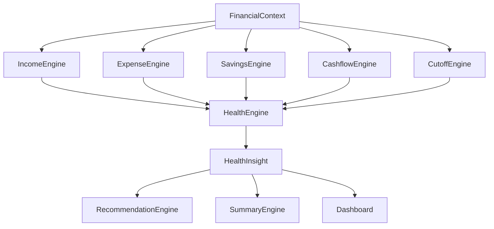
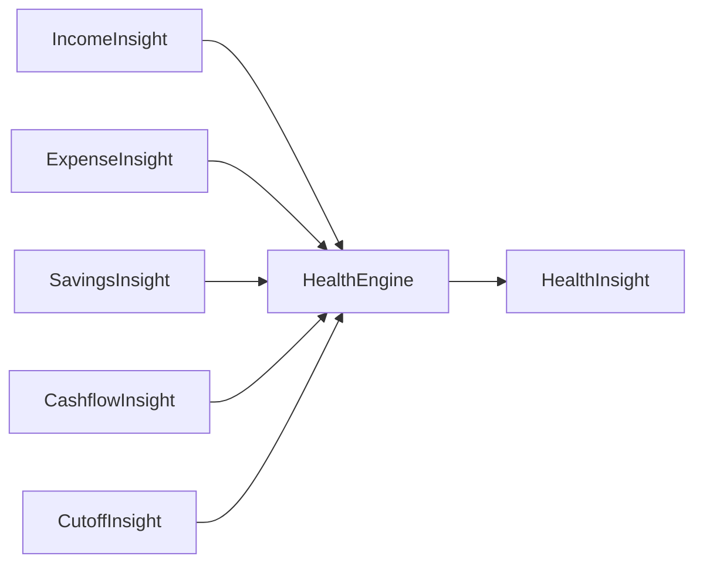
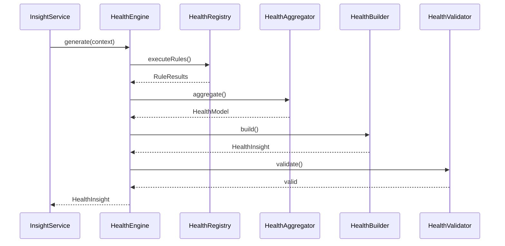
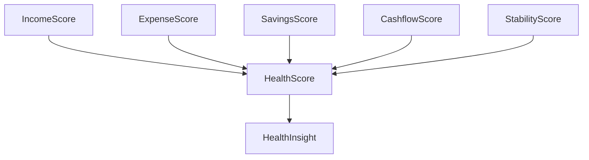
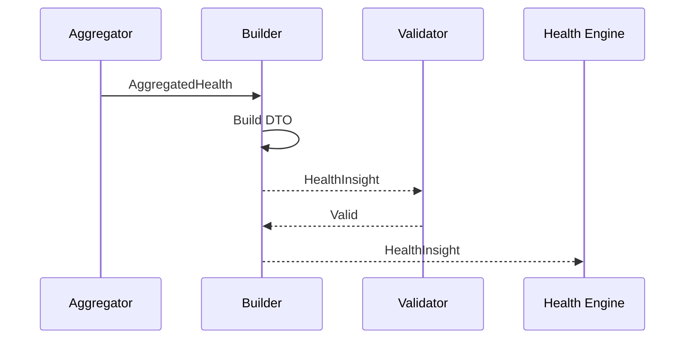
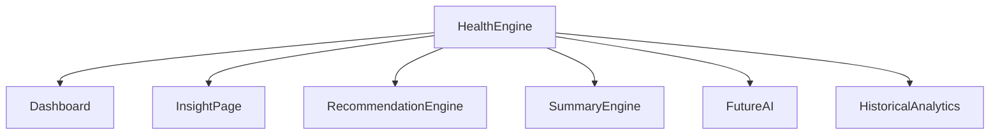
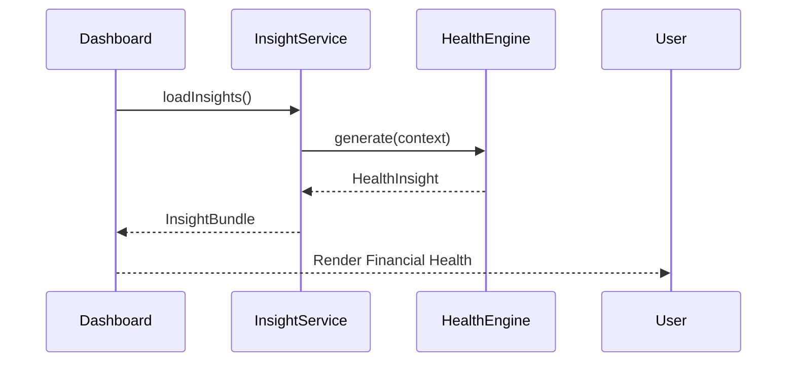

# 05 — Health Engine Architecture (Part I)

> **Document Version:** 2.0.0
> **Status:** Draft — Architecture Review Pending
>
> **Parent Documents:**
>
> * `00-PesoPilot-v2.0-Source-of-Truth.md`
> * `01-Rule-Based-Financial-Intelligence-Architecture.md`
> * `02-InsightBundle-and-Data-Contracts.md`
> * `03-Insight-Engine-Architecture.md`
> * `04-Rule-Engine-Architecture.md`
>
> **Phase:** Phase 11A — Rule-Based Financial Intelligence
>
> **Section:** Introduction, Health Philosophy, Responsibilities & Overall Health Architecture

---

# 1. Purpose

The Health Engine is the highest-level financial evaluation engine within PesoPilot.

While other Rule Engines analyze individual financial domains such as:

* Income
* Expenses
* Savings
* Cashflow
* Salary Cutoffs

the Health Engine combines those domain evaluations into a single, explainable assessment of the user's overall financial condition.

The Health Engine answers one primary question:

> **"Based on the user's current financial behavior, how financially healthy are they?"**

Unlike a credit score or investment score, the Health Score reflects the user's financial habits within PesoPilot using deterministic business rules.

---

# 2. Position Within the Financial Intelligence Platform

The Health Engine sits near the top of the Financial Intelligence hierarchy.



Unlike other engines, the Health Engine consumes multiple financial domains rather than analyzing a single dataset.

---

# 3. Purpose of the Health Engine

The Health Engine is responsible for transforming financial metrics into an overall financial wellness assessment.

Its responsibilities include:

* calculating the Financial Health Score,
* determining the Health Status,
* identifying strengths,
* identifying weaknesses,
* explaining the overall score,
* providing structured evidence for downstream engines.

The Health Engine is intentionally **not** responsible for:

* generating recommendations,
* generating summaries,
* forecasting,
* AI conversations,
* financial predictions.

---

# 4. Health Philosophy

PesoPilot evaluates financial health using observable financial behavior.

It does **not** attempt to measure:

* wealth,
* salary level,
* investment performance,
* credit rating,
* net worth.

Instead, it measures:

* consistency,
* sustainability,
* budgeting discipline,
* savings habits,
* cashflow quality,
* spending behavior.

This philosophy ensures that users with different income levels can still achieve excellent financial health through responsible financial habits.

---

# 5. Health Principles

The Health Engine follows seven guiding principles.

---

## 5.1 Fairness

Users should not receive a lower Health Score simply because they earn less.

Financial discipline is weighted more heavily than income amount.

---

## 5.2 Explainability

Every Health Score must be explainable.

Every deducted point must be traceable to one or more RuleResults.

Every awarded point must have supporting evidence.

---

## 5.3 Determinism

The same FinancialContext always produces the same Health Score.

No randomness.

No machine learning.

No subjective interpretation.

---

## 5.4 Transparency

Users should understand:

* why they received a score,
* what improved their score,
* what reduced their score,
* how they can improve.

The Health Engine should never behave like a "black box."

---

## 5.5 Positive Reinforcement

The Health Engine rewards healthy financial habits.

Rather than emphasizing penalties, it highlights strengths alongside improvement opportunities.

---

## 5.6 Local-First Intelligence

The Health Engine operates entirely on locally available financial records.

No internet connection or external financial APIs are required.

---

## 5.7 Extensibility

The scoring model is designed to evolve as PesoPilot gains new financial domains.

Future engines (Investments, Debt, Insurance, etc.) can contribute additional Health Score components without redesigning the Health Engine.

---

# 6. Responsibilities

The Health Engine owns:

* Health Score generation,
* Health Status classification,
* domain score aggregation,
* score breakdown,
* strengths,
* weaknesses,
* supporting evidence,
* health explanation.

The Health Engine does not own:

* recommendations,
* summaries,
* AI conversations,
* notification generation,
* financial forecasting.

---

# 7. Health Engine Inputs

The Health Engine receives one immutable object:

```text
FinancialContext
```

FinancialContext contains normalized financial information including:

* current cutoff,
* historical cutoffs,
* income,
* expenses,
* savings,
* savings goals,
* cashflow metrics,
* derived financial metrics.

The Health Engine never queries repositories directly.

---

# 8. Health Engine Output

The engine returns one object:

```text
HealthInsight
```

HealthInsight represents the user's financial health for the evaluated scope.

Example:

```text
HealthInsight

├── Overall Score

├── Health Status

├── Domain Breakdown

├── Strengths

├── Weaknesses

├── Supporting Evidence

└── Explanation
```

The Recommendation Engine and Summary Engine consume this object directly.

---

# 9. High-Level Health Engine Pipeline

```mermaid
flowchart TD

FinancialContext

↓

Health Rule Registry

↓

Health Rule Runner

↓

Health RuleResults

↓

Health Aggregator

↓

Health Builder

↓

Health Validator

↓

HealthInsight
```

This pipeline follows the generic Rule Engine Architecture defined in Document 04.

---

# 10. Internal Components

The Health Engine is composed of:

```text
Health Engine

├── Health Rule Registry

├── Health Rule Runner

├── Health Calculators

├── Health Aggregator

├── Health Builder

└── Health Validator
```

Each component follows the Single Responsibility Principle.

---

# 11. Relationship with Other Engines

The Health Engine consumes outputs from domain engines but never modifies them.



This makes the Health Engine an orchestration layer over validated financial intelligence rather than a duplicate calculation engine.

---

# 12. HealthInsight Responsibilities

The HealthInsight DTO should answer six core questions:

1. How healthy is the user's overall financial situation?
2. Which financial domains are strongest?
3. Which financial domains require attention?
4. Why did the user receive this score?
5. Which evidence supports the evaluation?
6. How has the user's financial health changed over time? *(future extension)*

The DTO intentionally avoids recommending actions. Recommendations are delegated to the Recommendation Engine.

---

# 13. Overall Health Architecture



---

# 14. Future Evolution

The Health Engine is intentionally modular.

Future financial domains can contribute additional health dimensions without changing the engine's overall architecture.

Potential future contributors include:

* Investment Engine
* Debt Engine
* Subscription Engine
* Insurance Engine
* Retirement Engine
* Credit Engine

Each contributes its own domain score, which can later be incorporated into the Health Aggregator.

---

# 15. Architecture Decision Records

## ADR-036

### Why a Dedicated Health Engine?

**Decision**

Overall financial health is generated by its own engine rather than being embedded inside the Dashboard.

**Reason**

Keeps financial evaluation reusable, testable, and independent of presentation.

---

## ADR-037

### Why Evaluate Habits Instead of Wealth?

**Decision**

The Health Engine evaluates financial behavior rather than absolute income or wealth.

**Reason**

Creates a fair scoring model that rewards financial discipline across different income levels.

---

## ADR-038

### Why Separate Recommendations?

**Decision**

The Health Engine generates assessments only.

**Reason**

Recommendations belong to the Recommendation Engine, preserving separation of responsibilities.

---

## ADR-039

### Why Consume Domain Insights?

**Decision**

The Health Engine aggregates validated domain intelligence rather than recalculating raw financial data.

**Reason**

Prevents duplicated business logic and keeps each engine focused on its domain.

---

## ADR-040

### Why Future-Proof the Health Engine?

**Decision**

Design the Health Engine to accept additional domain contributors over time.

**Reason**

Allows PesoPilot to expand into investments, debt management, retirement planning, and other financial domains without redesigning the scoring architecture.

---

# 16. Acceptance Criteria

This section is complete when:

* The purpose of the Health Engine is clearly defined.
* Health philosophy is documented.
* Responsibilities and boundaries are established.
* Inputs and outputs are standardized.
* Internal architecture follows Document 04.
* Relationships with other engines are defined.
* Future extensibility is documented.
* Architectural decisions are recorded.

---

# Part I Summary

Part I establishes the conceptual foundation of the Health Engine.

Rather than measuring wealth or income, the Health Engine evaluates the quality of a user's financial habits using deterministic business rules. It acts as the highest-level financial assessment engine, aggregating validated insights from multiple financial domains into a single `HealthInsight` object that explains the user's overall financial health. By separating assessment from recommendations and AI-generated advice, the Health Engine remains transparent, explainable, extensible, and aligned with the architectural principles defined in Documents 00–04.

---

**End of Part I**

**Next Section:** **Part II — Health Score Model, Domain Weights, Scoring Formula, Thresholds & Health Levels**

# 05 — Health Engine Architecture (Part II)

> **Document Version:** 2.0.0
> **Status:** Draft — Architecture Review Pending
>
> **Parent Documents:**
>
> * `00-PesoPilot-v2.0-Source-of-Truth.md`
> * `01-Rule-Based-Financial-Intelligence-Architecture.md`
> * `02-InsightBundle-and-Data-Contracts.md`
> * `03-Insight-Engine-Architecture.md`
> * `04-Rule-Engine-Architecture.md`
>
> **Phase:** Phase 11A — Rule-Based Financial Intelligence
>
> **Section:** Health Score Model, Domain Weights, Scoring Formula, Thresholds & Health Levels

---

# 17. Purpose

Part I defined **what** the Health Engine is.

This section defines **how the Financial Health Score is calculated**.

Unlike traditional credit scores, the PesoPilot Health Score measures **financial behavior**, not financial wealth.

It is:

* deterministic,
* explainable,
* rule-based,
* reproducible,
* transparent.

Every point awarded or deducted must be traceable back to one or more RuleResults.

---

# 18. Health Score Philosophy

The Health Score answers:

> **"How healthy are this user's financial habits based on their actual financial activity?"**

It intentionally does **not** measure:

* salary size,
* total wealth,
* investment returns,
* net worth,
* purchasing power.

Instead, it evaluates:

* income consistency,
* spending discipline,
* savings behavior,
* cashflow quality,
* financial stability.

This allows users earning ₱20,000 and users earning ₱200,000 to achieve the same excellent score through disciplined financial behavior.

---

# 19. Overall Health Model

The Health Score is composed of weighted domain scores.



Each domain contributes independently.

---

# 20. Domain Weights

The initial Phase 11A weighting model is:

| Domain              |  Weight |
| ------------------- | ------: |
| Income Stability    |      20 |
| Spending Control    |      20 |
| Savings Behavior    |      25 |
| Cashflow Health     |      25 |
| Financial Stability |      10 |
| **TOTAL**           | **100** |

The weights intentionally prioritize behaviors that users can directly improve inside PesoPilot.

---

# 21. Why These Weights?

## Income Stability (20)

Income determines financial capacity.

However,

earning more should not automatically produce a better Health Score.

Therefore, income receives meaningful—but not dominant—weight.

---

## Spending Control (20)

Financial discipline is one of the strongest predictors of long-term financial health.

Expense management is therefore weighted equally with income.

---

## Savings Behavior (25)

Savings represent delayed consumption and financial resilience.

PesoPilot encourages building savings consistently.

Savings therefore receive one of the highest weights.

---

## Cashflow Health (25)

Positive cashflow determines whether a financial plan is sustainable.

A user consistently spending beyond income should receive a lower Health Score regardless of salary.

---

## Financial Stability (10)

Stability measures longer-term consistency across multiple cutoffs.

It intentionally has a smaller weight during Phase 11A because historical data may be limited.

Future phases may expand this category.

---

# 22. Domain Score Formula

Each domain produces a normalized score.

```text
Domain Score

0–100
```

The weighted contribution is:

```text
Weighted Contribution

=

Domain Score

×

Domain Weight

÷

100
```

Example:

Savings Score

90

Weight

25

Contribution

22.5

---

# 23. Overall Health Formula

The Financial Health Score is calculated as:

```text
Health Score

=

Income Contribution

+

Expense Contribution

+

Savings Contribution

+

Cashflow Contribution

+

Stability Contribution
```

The result is normalized to:

```text
0–100
```

Every contribution remains individually explainable.

---

# 24. Score Characteristics

The Health Score should satisfy:

✔ Stable

✔ Explainable

✔ Incremental

✔ Fair

✔ Deterministic

✔ Independent of wealth

---

# 25. Domain Independence

Each domain contributes independently.

Example:

Poor savings should not invalidate strong spending discipline.

Instead,

both domains contribute separately.

This allows users to understand exactly where improvements are needed.

---

# 26. Health Levels

The Health Score maps to four user-facing health levels.

|  Score | Level           |
| -----: | --------------- |
| 90–100 | Excellent       |
|  75–89 | Good            |
|  60–74 | Fair            |
|   0–59 | Needs Attention |

These levels are intentionally broad to reduce score volatility.

---

# 27. Excellent

Characteristics:

* healthy savings behavior,
* sustainable cashflow,
* controlled spending,
* consistent income,
* stable financial history.

Example message:

```text
Your finances demonstrate consistently healthy habits across most financial areas.
```

---

# 28. Good

Characteristics:

* financially healthy overall,
* minor improvement opportunities,
* no major financial warning signs.

Example:

```text
Your finances are in good shape, with several opportunities to become even stronger.
```

---

# 29. Fair

Characteristics:

* noticeable weaknesses,
* inconsistent savings,
* cashflow pressure,
* increased spending.

Example:

```text
Your finances remain manageable, but several habits should improve to strengthen long-term stability.
```

---

# 30. Needs Attention

Characteristics:

* persistent overspending,
* weak savings,
* unstable cashflow,
* multiple failed financial rules.

Example:

```text
Several financial behaviors require attention before long-term financial stability can improve.
```

---

# 31. Health Breakdown

The Health Engine should expose domain contributions.

Example:

```text
Overall Score

82

Income

18 / 20

Expenses

16 / 20

Savings

20 / 25

Cashflow

22 / 25

Stability

6 / 10
```

This breakdown becomes one of the most valuable user-facing explanations.

---

# 32. Why Breakdown Matters

Instead of:

```text
Health

82
```

Users should understand:

```text
Savings

↓

Excellent

Cashflow

↓

Excellent

Expenses

↓

Needs Improvement
```

This encourages actionable improvements.

---

# 33. Health Score Stability

Minor financial events should not drastically change the Health Score.

Examples:

Buying coffee.

↓

Small impact.

Missing multiple savings contributions.

↓

Larger impact.

The scoring model should reward consistent long-term behavior over isolated transactions.

---

# 34. Positive vs Negative Contributions

Healthy behaviors contribute positively.

Examples:

* consistent savings,
* positive cashflow,
* controlled spending.

Negative behaviors reduce scores.

Examples:

* spending above income,
* missing savings,
* unstable cashflow,
* rapidly increasing discretionary expenses.

---

# 35. No Hidden Bonuses

The Health Engine should never include undocumented bonus points.

Every point must originate from documented RuleResults.

Example:

```text
Savings Rule

+

Expense Rule

+

Cashflow Rule

↓

Health Score
```

Nothing else.

---

# 36. Explainability Requirement

Every domain contribution should provide:

* score,
* evidence,
* explanation.

Example:

```text
Savings Score

22 / 25

Evidence

Saved ₱8,200

Savings Rate

16%

Contribution Frequency

5
```

This evidence later supports recommendations and AI explanations.

---

# 37. Missing Data Handling

When insufficient financial data exists:

The Health Engine should avoid artificial penalties.

Example:

New user.

One cutoff only.

↓

Stability Score

Not Applicable

rather than

```text
0
```

The Aggregator adjusts calculations accordingly while preserving fairness.

---

# 38. Future Expansion

The scoring model anticipates future domains.

Example:

```text
Current

100

↓

Future

Investment

10

Debt

10

Insurance

5

Retirement

5

↓

Normalized

100
```

Weights may evolve without changing the Health Engine architecture.

---

# 39. Versioning

The scoring model should expose:

```text
Health Model

Version

1.0
```

Future versions:

```text
1.1

2.0
```

This supports:

* migration,
* diagnostics,
* AI prompts,
* historical comparisons.

---

# 40. Sample Evaluation

Example:

```text
Income

85

↓

17

Expenses

70

↓

14

Savings

92

↓

23

Cashflow

88

↓

22

Stability

80

↓

8

↓

Overall

84
```

Health Level:

```text
Good
```

Every number remains traceable.

---

# 41. Architecture Decision Records

## ADR-041

### Why Behavior-Based Scoring?

**Decision**

Health Score evaluates financial habits rather than income size.

**Reason**

Produces a fair, actionable score for users across different income levels.

---

## ADR-042

### Why Weighted Domains?

**Decision**

Each financial domain contributes independently using predefined weights.

**Reason**

Improves explainability and simplifies future expansion.

---

## ADR-043

### Why Four Health Levels?

**Decision**

Use four broad categories instead of many granular levels.

**Reason**

Reduces volatility and improves user understanding.

---

## ADR-044

### Why No Hidden Bonuses?

**Decision**

Every point must originate from documented RuleResults.

**Reason**

Maintains transparency and trust.

---

## ADR-045

### Why Support Future Domains?

**Decision**

Health Score architecture anticipates additional financial domains.

**Reason**

Allows PesoPilot to grow without redesigning its scoring model.

---

# 42. Acceptance Criteria

This section is complete when:

* The Health Score philosophy is defined.
* Domain weights are established.
* Scoring formula is documented.
* Health Levels are standardized.
* Domain breakdown behavior is specified.
* Missing-data handling is documented.
* Explainability requirements are established.
* Future extensibility is documented.

---

# Part II Summary

Part II defines the mathematical and conceptual foundation of the PesoPilot Financial Health Score.

The Health Score is composed of weighted domain evaluations that measure financial behavior rather than financial wealth. Each domain contributes independently, allowing users to understand exactly how income stability, spending control, savings behavior, cashflow health, and long-term stability influence their overall financial health. By combining deterministic calculations with transparent scoring, domain breakdowns, and evidence-based explanations, the Health Engine produces a fair, explainable, and extensible assessment that serves as the foundation for recommendations, summaries, and future AI capabilities.

---

**End of Part II**

**Next Section:** **Part III — Health Rule Registry, Health Rules, Rule Specifications & Evidence Model**

# 05 — Health Engine Architecture (Part III)

> **Document Version:** 2.0.0
> **Status:** Draft — Architecture Review Pending
>
> **Parent Documents:**
>
> * `00-PesoPilot-v2.0-Source-of-Truth.md`
> * `01-Rule-Based-Financial-Intelligence-Architecture.md`
> * `02-InsightBundle-and-Data-Contracts.md`
> * `03-Insight-Engine-Architecture.md`
> * `04-Rule-Engine-Architecture.md`
>
> **Phase:** Phase 11A — Rule-Based Financial Intelligence
>
> **Section:** Health Rule Registry, Health Rules, Rule Specifications & Evidence Model

---

# 43. Purpose

Part II defined **how the Health Score is computed**.

This section defines **what produces those scores**.

The Health Engine does not calculate a Health Score directly.

Instead,

it executes a collection of deterministic Health Rules.

Those Rules produce RuleResults.

The Aggregator combines those RuleResults into the final Health Score.

---

# 44. Health Rule Philosophy

Each Health Rule evaluates exactly one aspect of financial behavior.

Example:

```text
Savings Rate

↓

Healthy?
```

Another Rule:

```text
Cashflow

↓

Positive?
```

Another Rule:

```text
Expense Growth

↓

Stable?
```

Small Rules combine to create a comprehensive financial health assessment.

---

# 45. Health Rule Registry

The Health Engine owns one Rule Registry.

```mermaid
flowchart TD

HealthEngine

↓

HealthRuleRegistry

↓

Income Rules

Expense Rules

Savings Rules

Cashflow Rules

Stability Rules
```

The registry defines:

* execution order,
* metadata,
* priorities,
* dependencies.

---

# 46. Health Rule Categories

Health Rules are grouped into five categories.

```text
Income

Expenses

Savings

Cashflow

Financial Stability
```

These align directly with the weighted Health Score model defined in Part II.

---

# 47. Health Rule Registry Structure

```text
HealthRuleRegistry

├── Income Stability Rules
│
├── Expense Control Rules
│
├── Savings Behavior Rules
│
├── Cashflow Rules
│
└── Stability Rules
```

Each group owns its own Rule specifications.

---

# 48. Income Stability Rules

The Income category evaluates the consistency and reliability of income.

Initial Phase 11A Rules:

```text
IncomeExistsRule

IncomeGrowthRule

IncomeConsistencyRule

IncomeSourceDistributionRule
```

Purpose:

Evaluate whether the user's income supports sustainable financial planning.

---

## IncomeExistsRule

Question:

```text
Does the current cutoff contain recorded income?
```

Evidence:

```text
Current Cutoff

Income Total

Income Record Count
```

Possible Results:

* Passed
* Failed

---

## IncomeGrowthRule

Question:

```text
Has income improved compared to the previous cutoff?
```

Evidence:

```text
Current Income

Previous Income

Difference

Percentage
```

Possible Status:

* Increasing
* Stable
* Decreasing

---

## IncomeConsistencyRule

Question:

```text
Is income relatively consistent across recent cutoffs?
```

Purpose:

Reward predictable earnings.

---

## IncomeSourceDistributionRule

Question:

```text
Is the user dependent on a single income source?
```

Purpose:

Measure income diversification.

Future versions may assign higher resilience scores to diversified income.

---

# 49. Expense Control Rules

Expense Rules evaluate financial discipline.

Phase 11A:

```text
LargestExpenseRule

ExpenseGrowthRule

CategoryConcentrationRule

SpendingControlRule
```

---

## LargestExpenseRule

Purpose:

Identify the largest expense category.

Evidence:

```text
Category

Amount

Percentage
```

---

## ExpenseGrowthRule

Question:

```text
Did expenses increase significantly?
```

Evidence:

```text
Current Total

Previous Total

Difference

Growth Rate
```

---

## CategoryConcentrationRule

Purpose:

Measure whether spending is excessively concentrated in one category.

High concentration may indicate financial imbalance.

---

## SpendingControlRule

Question:

```text
Is spending within healthy limits relative to income?
```

Evidence:

```text
Income

Expenses

Ratio
```

---

# 50. Savings Behavior Rules

Savings receive the highest weighting in the Health Score.

Rules:

```text
SavingsRateRule

ContributionFrequencyRule

SavingsGrowthRule

GoalParticipationRule
```

---

## SavingsRateRule

Purpose:

Measure:

```text
Savings

÷

Income
```

Higher savings rates contribute positively.

---

## ContributionFrequencyRule

Question:

```text
Does the user save consistently?
```

Purpose:

Reward consistent financial habits.

---

## SavingsGrowthRule

Question:

```text
Are savings increasing over time?
```

Evidence:

```text
Current Savings

Previous Savings

Growth %
```

---

## GoalParticipationRule

Purpose:

Determine whether the user actively contributes toward Savings Goals.

This encourages intentional saving rather than passive accumulation.

---

# 51. Cashflow Rules

Cashflow determines sustainability.

Rules:

```text
PositiveCashflowRule

RemainingCashRule

CutoffUtilizationRule

SpendingPaceRule
```

---

## PositiveCashflowRule

Question:

```text
Income

>

Expenses + Savings
```

Purpose:

Reward financially sustainable behavior.

---

## RemainingCashRule

Evaluates:

```text
Remaining Cash

Income

-

Expenses

-

Savings
```

Purpose:

Determine financial flexibility.

---

## CutoffUtilizationRule

Question:

```text
How much of available income has already been allocated?
```

Purpose:

Identify over-allocation.

---

## SpendingPaceRule

Question:

```text
Is spending pace appropriate for the current cutoff?
```

Example:

50% of cutoff elapsed

↓

90% of budget spent

↓

Warning

---

# 52. Financial Stability Rules

Financial Stability measures long-term consistency.

Phase 11A Rules:

```text
HistoricalConsistencyRule

HealthyCutoffRatioRule

FinancialRecoveryRule
```

---

## HistoricalConsistencyRule

Evaluates:

Consistency of financial behavior over multiple cutoffs.

---

## HealthyCutoffRatioRule

Measures:

```text
Healthy Cutoffs

↓

Total Cutoffs
```

A "Healthy Cutoff" satisfies predefined minimum thresholds.

---

## FinancialRecoveryRule

Purpose:

Determine whether financial behavior improves after weak periods.

This rewards recovery instead of punishing past mistakes indefinitely.

---

# 53. Rule Specification Template

Every Health Rule should follow the same structure.

```text
Rule Name

Purpose

Business Question

Inputs

Calculator

Evidence

Weight

Possible Status

Output
```

Future Health Rules must follow this template.

---

# 54. Rule Metadata

Each Health Rule exposes metadata.

```text
Rule ID

Rule Name

Category

Priority

Version

Weight

Description
```

Example:

```text
SavingsRateRule

Category

Savings

Priority

30

Version

1.0

Weight

8
```

---

# 55. Evidence Philosophy

Every Health Rule must provide evidence.

Never:

```text
Savings Score

22
```

Instead:

```text
Savings Score

22

↓

Savings Rate

18%

↓

Saved

₱9,000

↓

Income

₱50,000
```

Evidence supports explainability.

---

# 56. Evidence Structure

Each Rule generates:

```text
Evidence

├── Title

├── Description

└── Evidence Items
```

Example:

```text
Savings Rate

Income

₱50,000

Savings

₱9,000

Savings Rate

18%
```

---

# 57. RuleResult Example

```json
{
  "ruleName": "SavingsRateRule",

  "category": "Savings",

  "status": "Passed",

  "severity": "Info",

  "weight": 8,

  "value": 18,

  "evidence": {

    "income": 50000,

    "savings": 9000,

    "rate": 18

  }

}
```

---

# 58. Rule Execution Order

Health Rules execute in deterministic order.

```mermaid
flowchart TD

Income Rules

↓

Expense Rules

↓

Savings Rules

↓

Cashflow Rules

↓

Stability Rules
```

This ordering simplifies diagnostics while preserving consistent outputs.

---

# 59. Rule Independence

Health Rules should remain independent whenever possible.

Allowed:

```text
SavingsRateRule

↓

FinancialContext
```

Avoid:

```text
SavingsRateRule

↓

ExpenseGrowthRule
```

Dependencies should be minimized.

---

# 60. Rule Dependencies

Where dependencies are unavoidable:

```text
Savings Total

↓

Savings Rate
```

The dependency should occur through prior RuleResults rather than duplicate calculations.

---

# 61. Rule Versioning

Every Rule exposes:

```text
Rule Version

1.0
```

Future versions:

```text
1.1

2.0
```

This supports:

* migration,
* diagnostics,
* regression testing.

---

# 62. Health Rule Expansion

Future Rules may include:

```text
Emergency Fund Rule

Debt-to-Income Rule

Subscription Burden Rule

Investment Participation Rule

Insurance Coverage Rule

Retirement Progress Rule
```

These extend the Registry without changing Health Engine architecture.

---

# 63. Architecture Decision Records

## ADR-046

### Why Many Small Rules?

**Decision**

Health evaluation is composed of many focused Rules.

**Reason**

Improves explainability, reuse, and testing.

---

## ADR-047

### Why Category-Based Registry?

**Decision**

Group Health Rules by financial domain.

**Reason**

Keeps the Registry organized and aligned with the Health Score model.

---

## ADR-048

### Why Evidence for Every Rule?

**Decision**

Every Rule produces structured evidence.

**Reason**

Supports explanations, summaries, recommendations, and AI.

---

## ADR-049

### Why Independent Rules?

**Decision**

Rules should minimize dependencies.

**Reason**

Improves maintainability and enables future parallel execution.

---

## ADR-050

### Why Standard Rule Specification?

**Decision**

Every Health Rule follows the same template.

**Reason**

Creates a consistent implementation model for current and future Rules.

---

# 64. Acceptance Criteria

This section is complete when:

* The Health Rule Registry is defined.
* Rule categories align with Health Score domains.
* Initial Phase 11A Rules are specified.
* Rule templates are standardized.
* Evidence requirements are documented.
* Rule execution order is deterministic.
* Rule metadata and versioning are defined.
* Future Rule expansion strategy is documented.

---

# Part III Summary

Part III defines the Rule-based foundation of the Health Engine.

Instead of calculating the Health Score directly, the Health Engine evaluates a structured registry of deterministic Health Rules covering income stability, expense control, savings behavior, cashflow quality, and long-term financial stability. Each Rule produces an explainable RuleResult with supporting evidence, allowing the Health Aggregator to construct a transparent and auditable Health Score.

This Rule Registry becomes the core source of truth for financial health evaluation and provides the extensible framework that future financial domains can integrate into without changing the underlying Health Engine architecture.

---

**End of Part III**

**Next Section:** **Part IV — Health Aggregation, HealthInsight DTO, Dashboard Integration & Explanation Generation**

# 05 — Health Engine Architecture (Part IV)

> **Document Version:** 2.0.0
> **Status:** Draft — Architecture Review Pending
>
> **Parent Documents:**
>
> * `00-PesoPilot-v2.0-Source-of-Truth.md`
> * `01-Rule-Based-Financial-Intelligence-Architecture.md`
> * `02-InsightBundle-and-Data-Contracts.md`
> * `03-Insight-Engine-Architecture.md`
> * `04-Rule-Engine-Architecture.md`
>
> **Phase:** Phase 11A — Rule-Based Financial Intelligence
>
> **Section:** Health Aggregation, HealthInsight DTO, Dashboard Integration & Explanation Generation

---

# 65. Purpose

Previous sections defined:

* the philosophy of the Health Engine,
* the Health Score model,
* the Health Rule Registry.

This section defines how individual RuleResults become a single HealthInsight object.

The Health Engine itself does not expose RuleResults directly.

Instead, it aggregates them into one coherent financial health assessment.

---

# 66. Health Aggregation Philosophy

Health aggregation is the process of transforming dozens of low-level RuleResults into one understandable financial assessment.

The process should answer:

> **"How healthy is the user's overall financial situation, and why?"**

Aggregation must remain:

* deterministic,
* explainable,
* traceable,
* reproducible.

---

# 67. High-Level Aggregation Pipeline

```mermaid
flowchart TD

RuleResults

-->

HealthAggregator

HealthAggregator

-->

DomainScores

DomainScores

-->

HealthBuilder

HealthBuilder

-->

HealthInsight

HealthInsight

-->

Validator

Validator

-->

Final HealthInsight
```

The Aggregator never builds DTOs directly.

The Builder owns DTO construction.

---

# 68. Health Aggregator Responsibilities

The Aggregator is responsible for:

* combining RuleResults,
* computing weighted domain scores,
* calculating the final Health Score,
* determining Health Status,
* identifying strengths,
* identifying weaknesses,
* preparing explanation inputs,
* preparing visualization data.

The Aggregator is **not** responsible for:

* recommendations,
* summaries,
* AI prompts,
* persistence,
* UI formatting.

---

# 69. Aggregation Inputs

The Health Aggregator receives:

```text
HealthRuleResult[]
```

Each RuleResult contains:

* value,
* status,
* severity,
* evidence,
* weight,
* message.

No raw repositories are accessed during aggregation.

---

# 70. Aggregation Outputs

The Aggregator produces an intermediate model.

Example:

```text
AggregatedHealth

├── Overall Score

├── Health Status

├── Domain Scores

├── Strengths

├── Weaknesses

├── Evidence

├── Warnings

└── Diagnostics
```

This is an internal object.

It is **not** exposed outside the engine.

---

# 71. Domain Aggregation

Each Health domain is aggregated independently.

```mermaid
flowchart LR

Income Rules

-->

Income Score

Expense Rules

-->

Expense Score

Savings Rules

-->

Savings Score

Cashflow Rules

-->

Cashflow Score

Stability Rules

-->

Stability Score
```

Each domain becomes one weighted contribution.

---

# 72. Overall Health Aggregation

```mermaid
flowchart TD

Income Score

-->

Overall

Expense Score

-->

Overall

Savings Score

-->

Overall

Cashflow Score

-->

Overall

Stability Score

-->

Overall

Overall

-->

Health Level
```

The final Health Score is produced only after every domain completes.

---

# 73. Strength Detection

Strengths are generated from successful RuleResults.

Example:

```text
Savings Rate

Excellent

↓

Strength
```

```text
Positive Cashflow

Passed

↓

Strength
```

The Aggregator converts these into user-facing strengths.

Example:

```text
Strong savings habits

Positive cashflow

Consistent income
```

---

# 74. Weakness Detection

Weaknesses originate from:

* Failed Rules,
* Warning Rules,
* Critical Rules.

Example:

```text
Savings Rate

Low

↓

Weakness
```

```text
Expense Growth

High

↓

Weakness
```

Weaknesses remain factual.

---

# 75. Domain Breakdown

The Health Engine exposes a complete breakdown.

Example:

```text
Overall

84

Income

18 / 20

Expenses

16 / 20

Savings

22 / 25

Cashflow

20 / 25

Stability

8 / 10
```

This breakdown is one of the most important UI components.

---

# 76. Explanation Generation

The Health Engine generates deterministic explanations.

It answers:

> **Why is the score what it is?**

Explanation generation is still rule-based.

No AI is involved.

---

# 77. Explanation Pipeline

```mermaid
flowchart LR

RuleResults

-->

Evidence

Evidence

-->

Explanation Builder

Explanation Builder

-->

Health Explanation
```

Every explanation originates from Evidence.

---

# 78. Explanation Structure

Every HealthInsight contains:

```text
Health Explanation

├── Overall Summary

├── Positive Findings

├── Improvement Areas

└── Supporting Evidence
```

This structure is later reused by:

* Dashboard
* Recommendation Engine
* Summary Engine
* AI Coach

---

# 79. Example Explanation

```text
Overall Financial Health

Good

Reason

You maintained positive cashflow throughout the current cutoff and consistently contributed toward your savings goals.

However, discretionary spending increased compared to the previous cutoff, reducing your overall score.

Primary Strengths

• Positive Cashflow

• Healthy Savings Rate

Primary Improvement Areas

• Dining Expenses

• Shopping Expenses
```

Notice that every statement is traceable to RuleResults.

---

# 80. Evidence Aggregation

Evidence from multiple Rules should be merged.

Example:

```text
Savings

↓

Income

₱50,000

Savings

₱8,500

Savings Rate

17%

↓

Savings Evidence
```

Example:

```text
Expenses

↓

Largest Category

Dining

↓

Expense Evidence
```

The user should never need to inspect individual RuleResults.

---

# 81. HealthInsight DTO

The Builder converts the AggregatedHealth object into the public DTO.

Structure:

```text
HealthInsight

├── Score

├── Level

├── Domain Scores

├── Strengths

├── Weaknesses

├── Explanation

├── Evidence

├── Diagnostics

└── Metadata
```

This DTO follows Document 02.

---

# 82. HealthInsight Lifecycle



---

# 83. Health Validator

The Validator ensures:

Required fields exist:

* score,
* level,
* explanation,
* strengths,
* weaknesses,
* evidence.

It also validates:

* score range,
* health level,
* domain totals,
* DTO version.

---

# 84. Score Validation

Rules:

Overall Score

```text
0 ≤ score ≤ 100
```

Domain Scores

```text
0 ≤ domain ≤ domain weight
```

Invalid values should never reach the Dashboard.

---

# 85. Dashboard Integration

Dashboard consumes:

```mermaid
flowchart LR

HealthInsight

-->

Dashboard Cards

HealthInsight

-->

Health Gauge

HealthInsight

-->

Breakdown Card

HealthInsight

-->

Strength Card

HealthInsight

-->

Weakness Card
```

Dashboard never recalculates Health Score.

---

# 86. Dashboard Components

The HealthInsight powers:

```text
Financial Health Score

Health Badge

Domain Breakdown

Strength Highlights

Improvement Areas

Financial Health Explanation
```

These become the primary health widgets.

---

# 87. Recommendation Engine Integration

HealthInsight becomes one input.

```mermaid
flowchart TD

HealthInsight

-->

Recommendation Engine
```

Example:

Health Engine

↓

Savings Score

↓

Recommendation Engine

↓

Increase Savings Recommendation

Health Engine never creates recommendations directly.

---

# 88. Summary Engine Integration

Likewise:

```mermaid
flowchart TD

HealthInsight

-->

Summary Engine
```

The Summary Engine consumes:

* score,
* strengths,
* weaknesses,
* explanation.

It produces natural-language summaries.

---

# 89. AI Financial Coach Integration

Future:

```mermaid
flowchart LR

HealthInsight

-->

Prompt Builder

-->

LLM
```

The AI receives deterministic financial intelligence.

It never calculates Health Score itself.

---

# 90. Historical Health Tracking

Future versions may expose:

```text
Health Timeline

↓

Cutoff

↓

Score

↓

Trend
```

This remains outside Phase 11A but the DTO is designed to accommodate it.

---

# 91. Diagnostics

HealthInsight includes diagnostics for debugging.

Example:

```text
Model Version

Registry Version

Executed Rules

Warnings

Processing Time
```

These are not shown to normal users.

---

# 92. Architecture Decision Records

## ADR-051

### Why Aggregate Before Building?

**Decision**

Aggregation produces an intermediate domain model before DTO construction.

**Reason**

Separates business logic from contract mapping.

---

## ADR-052

### Why Generate Explanations Deterministically?

**Decision**

Health explanations originate from RuleResults rather than AI.

**Reason**

Ensures consistency, traceability, and user trust.

---

## ADR-053

### Why Dashboard Consumes HealthInsight?

**Decision**

Dashboard displays HealthInsight without recalculating values.

**Reason**

Maintains a single source of truth.

---

## ADR-054

### Why Separate Recommendations?

**Decision**

Recommendations consume HealthInsight rather than being produced by the Health Engine.

**Reason**

Maintains clear engine responsibilities.

---

## ADR-055

### Why Design for Historical Health?

**Decision**

HealthInsight anticipates future trend analysis.

**Reason**

Supports long-term financial progress without redesigning the DTO.

---

# 93. Acceptance Criteria

This section is complete when:

* Health aggregation process is documented.
* Strength and weakness generation is defined.
* Explanation generation is standardized.
* HealthInsight DTO structure is established.
* Dashboard integration is documented.
* Recommendation and Summary integrations are defined.
* Validation responsibilities are specified.
* Historical extensibility is documented.

---

# Part IV Summary

Part IV defines how the Health Engine transforms individual RuleResults into a complete HealthInsight.

Through deterministic aggregation, domain scoring, evidence consolidation, and structured explanation generation, the Health Engine produces a transparent representation of the user's financial health. The resulting HealthInsight becomes the authoritative source for the Dashboard, Recommendation Engine, Summary Engine, and future AI Financial Coach while preserving the architectural separation between financial analysis and downstream consumer features.

---

**End of Part IV**

**Next Section:** **Part V — Dashboard Integration, Historical Health, Testing Strategy, Acceptance Criteria & Implementation Roadmap**

# 05 — Health Engine Architecture (Part V)

> **Document Version:** 2.0.0
> **Status:** Draft — Architecture Review Pending
>
> **Parent Documents:**
>
> * `00-PesoPilot-v2.0-Source-of-Truth.md`
> * `01-Rule-Based-Financial-Intelligence-Architecture.md`
> * `02-InsightBundle-and-Data-Contracts.md`
> * `03-Insight-Engine-Architecture.md`
> * `04-Rule-Engine-Architecture.md`
>
> **Phase:** Phase 11A — Rule-Based Financial Intelligence
>
> **Section:** Dashboard Integration, Historical Health, Testing Strategy, Acceptance Criteria & Implementation Roadmap

---

# 94. Purpose

The previous sections established:

* the Health philosophy,
* Health Score model,
* Rule Registry,
* aggregation,
* HealthInsight generation.

This final section defines how the Health Engine integrates with the PesoPilot application and how it should be implemented, tested, and evolved over time.

---

# 95. Health Engine Integration Overview

The Health Engine is not a standalone feature.

It is a foundational service consumed by multiple areas of the application.



The Health Engine should never depend on these consumers.

Consumers depend on the Health Engine.

---

# 96. Dashboard Integration

The Dashboard is the primary consumer of the Health Engine.

The Dashboard never performs financial calculations.

Instead, it renders the HealthInsight DTO.



---

# 97. Dashboard Health Components

The Dashboard should consume the following HealthInsight sections.

```text
HealthInsight

├── Overall Score

├── Health Level

├── Domain Breakdown

├── Strength Highlights

├── Improvement Areas

├── Health Explanation

├── Last Generated Timestamp
```

Each section should be independently renderable.

---

# 98. Dashboard Cards

Phase 11A Dashboard cards include:

```text
Financial Health Score

Health Status Badge

Domain Score Breakdown

Top 3 Strengths

Top 3 Improvement Areas

Health Explanation Card
```

Future releases may add trend visualizations.

---

# 99. Health Score Gauge

The Dashboard may visualize the Health Score using a circular gauge or progress indicator.

The gauge should represent:

```text
0────────────100
```

Only the score is visualized.

Health interpretation remains textual.

---

# 100. Domain Breakdown Card

Each weighted domain is displayed separately.

Example:

```text
Income Stability

18 / 20

█████████░

Expenses

16 / 20

████████░░

Savings

22 / 25

█████████░

Cashflow

20 / 25

████████░░

Financial Stability

8 / 10

████████░░
```

This helps users understand how the overall score is composed.

---

# 101. Strength Highlights

The Dashboard should display the highest-performing financial behaviors.

Example:

```text
✓ Positive Cashflow

✓ Healthy Savings Rate

✓ Stable Income
```

Strengths should always be factual and derived from RuleResults.

---

# 102. Improvement Areas

The Dashboard should display the most impactful opportunities.

Example:

```text
• Dining expenses increased

• Savings contributions slowed

• Spending pace is above expected
```

These are observations—not recommendations.

---

# 103. Health Explanation Card

The explanation card summarizes the evaluation.

Example:

```text
Your finances remain healthy overall.

Positive cashflow and consistent savings continue to strengthen your financial position.

Spending increased this cutoff, reducing your overall score slightly.
```

The explanation is deterministic.

No AI-generated text is involved.

---

# 104. Insight Page Integration

The dedicated Insight Page exposes the full HealthInsight.

```mermaid id="wkjqyu"
flowchart TD

HealthInsight

-->

InsightPage

InsightPage

-->

Domain Sections

InsightPage

-->

Evidence

InsightPage

-->

Rule Breakdown
```

Unlike the Dashboard,

the Insight Page exposes significantly more detail.

---

# 105. Historical Health

Although not implemented during Phase 11A,

the architecture supports historical Health tracking.

Future structure:

```text
Health History

↓

Cutoff

↓

Health Score

↓

Trend

↓

Explanation
```

This enables users to observe long-term financial progress.

---

# 106. Historical Timeline

Future visualization:

```text
Jan

72

↓

Feb

76

↓

Mar

81

↓

Apr

84

↓

May

88
```

The timeline is generated from historical HealthInsight snapshots.

---

# 107. Historical Comparison

Future comparisons include:

```text
Current vs Previous Cutoff

Current vs Monthly Average

Best Score

Worst Score

Rolling Average
```

These comparisons should be deterministic.

---

# 108. Historical Storage

The Health Engine itself should **not** persist history.

Instead:


Persistence belongs to another subsystem.

---

# 109. Recommendation Integration

Recommendations consume HealthInsight.

Example:

```text
Savings Score

↓

Low

↓

Recommendation Engine

↓

Increase Savings
```

The Health Engine never produces recommendations directly.

---

# 110. Summary Integration

Likewise,

Summary Engine consumes:

```text
Health Score

Health Level

Strengths

Weaknesses

Explanation
```

and converts them into user-friendly summaries.

---

# 111. AI Financial Coach Integration

Future AI architecture:

```mermaid id="yhwvpu"
flowchart LR

HealthInsight

-->

PromptBuilder

-->

LLM

-->

FinancialCoach
```

The AI never recalculates the Health Score.

It explains existing intelligence.

---

# 112. Testing Philosophy

The Health Engine must be completely testable without:

* React,
* IndexedDB,
* Zustand,
* repositories,
* APIs.

Tests receive a mocked FinancialContext.

---

# 113. Unit Tests

Every Health Rule should have dedicated tests.

Examples:

```text
Income Stability Rule

Savings Rate Rule

Positive Cashflow Rule

Expense Growth Rule

Historical Stability Rule
```

Every Rule should verify:

* valid inputs,
* edge cases,
* no-data scenarios,
* boundary values.

---

# 114. Calculator Tests

Every Health Calculator verifies:

* arithmetic correctness,
* percentage calculations,
* weighting,
* normalization,
* division safety,
* rounding.

Calculators should remain completely independent.

---

# 115. Aggregator Tests

The Aggregator should verify:

* weighted domain scores,
* total Health Score,
* strengths,
* weaknesses,
* explanation inputs,
* missing domains,
* partial data.

---

# 116. Builder Tests

Builder tests verify:

* HealthInsight completeness,
* default values,
* metadata,
* DTO compatibility,
* explanation mapping.

---

# 117. Validator Tests

Validator tests verify:

* score range,
* domain totals,
* health levels,
* DTO structure,
* required fields,
* metadata.

---

# 118. Integration Tests

The entire Health Engine pipeline should be tested.

Pipeline:

```text
FinancialContext

↓

Rule Registry

↓

RuleResults

↓

Aggregator

↓

Builder

↓

Validator

↓

HealthInsight
```

The resulting HealthInsight should remain deterministic.

---

# 119. Regression Tests

Regression tests compare HealthInsight against approved snapshots.

This prevents unintended score changes after modifying business rules.

Example:

```text
HealthInsight v1

↓

Expected

HealthInsight v1

↓

Generated
```

Any mismatch should be reviewed.

---

# 120. Performance Tests

Future benchmarks should verify:

* total execution time,
* rule execution time,
* aggregation cost,
* DTO construction,
* validation overhead.

Target:

```text
Health Engine

< 10 ms
```

for typical datasets.

---

# 121. Implementation Roadmap

Recommended implementation sequence:

```mermaid id="a5vt6n"
flowchart TD

A["Health DTO"]

-->

B["Health Rule Registry"]

-->

C["Health Calculators"]

-->

D["Health Rules"]

-->

E["Health Aggregator"]

-->

F["Health Builder"]

-->

G["Health Validator"]

-->

H["Health Engine"]

-->

I["InsightService Integration"]

-->

J["Dashboard Integration"]

-->

K["Insight Page"]

-->

L["Recommendation Integration"]

-->

M["Summary Integration"]
```

Each milestone concludes with:

* unit tests,
* lint,
* build,
* documentation updates.

---

# 122. Implementation Checklist

Health Engine is considered complete when:

```text
☑ Health DTO

☑ Rule Registry

☑ Rule Metadata

☑ Health Rules

☑ Calculators

☑ Aggregator

☑ Builder

☑ Validator

☑ Health Engine

☑ InsightService Integration

☑ Dashboard Integration

☑ Insight Page Integration

☑ Recommendation Integration

☑ Summary Integration

☑ Tests

☑ Documentation
```

---

# 123. Future Enhancements

Future versions may include:

```text
Health Trend Graph

Behavior Streaks

Financial Milestones

Seasonality Analysis

Behavior Forecasting

AI Health Coach

Personalized Health Targets
```

Each enhancement consumes HealthInsight rather than changing Health Engine fundamentals.

---

# 124. Architecture Decision Records

## ADR-056

### Why Dashboard Uses HealthInsight?

**Decision**

Dashboard consumes HealthInsight directly.

**Reason**

Maintains a single source of truth for financial health.

---

## ADR-057

### Why Separate Historical Storage?

**Decision**

Health Engine generates insights but does not persist them.

**Reason**

Separates computation from storage responsibilities.

---

## ADR-058

### Why Snapshot Regression Testing?

**Decision**

HealthInsight outputs are regression tested.

**Reason**

Protects business rules from unintended scoring changes.

---

## ADR-059

### Why Future Historical Timeline?

**Decision**

Historical tracking is designed into the architecture from the beginning.

**Reason**

Supports long-term financial coaching without redesigning HealthInsight.

---

## ADR-060

### Why Sequential Implementation?

**Decision**

Implement the Health Engine incrementally from DTO to integration.

**Reason**

Reduces implementation risk and simplifies verification.

---

# 125. Final Acceptance Criteria

Document 05 is complete when:

* Health philosophy is documented.
* Health Score model is finalized.
* Rule Registry is specified.
* Aggregation pipeline is documented.
* HealthInsight DTO is defined.
* Dashboard integration is standardized.
* Historical health architecture is documented.
* Testing strategy is complete.
* Implementation roadmap is established.
* Future evolution is documented.

---

# 126. Document Summary

Document 05 defines the complete architecture of the PesoPilot Health Engine.

It establishes how financial health is measured, how domain scores are aggregated, how HealthInsight is produced, and how that insight integrates with the Dashboard, Recommendation Engine, Summary Engine, and future AI Financial Coach.

The Health Engine serves as the highest-level evaluator of a user's financial behavior, producing a deterministic, explainable, and extensible assessment that remains independent of presentation, storage, and AI technologies.

---

# Financial Intelligence Architecture Progress

```text
██████████████████████████████████

✓ 00 — Source of Truth

✓ 01 — Rule-Based Financial Intelligence Architecture

✓ 02 — InsightBundle & Data Contracts

✓ 03 — Insight Engine Architecture

✓ 04 — Rule Engine Architecture

✓ 05 — Health Engine Architecture

□□□□□□□□□□□□□□□□□□□□□□□□□□□□□□

06 — Income Engine Architecture

07 — Expense Engine Architecture

08 — Savings & Goal Engine Architecture

09 — Cashflow & Cutoff Engine Architecture

10 — Recommendation Engine Architecture

11 — Summary Engine Architecture

□□□□□□□□□□□□□□□□□□□□□□□□□□□□□□

Spring Boot AI Layer

Prompt Builder

Ollama Integration

AI Financial Coach
```

---

# End of Document

**Document Status:** ✅ **Completed**

**Next Document:** **06 — Income Engine Architecture**

**Milestone Achieved:**
The first domain-specific Financial Intelligence Engine is now fully architected. Documents **00–05** define both the platform foundation and the complete specification for the Health Engine, providing the blueprint for implementing the first deterministic financial intelligence capability in Phase 11A.
