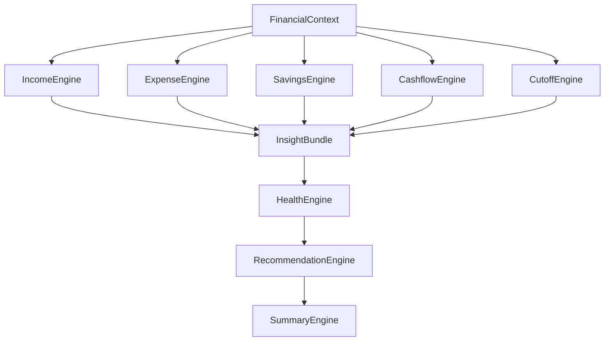
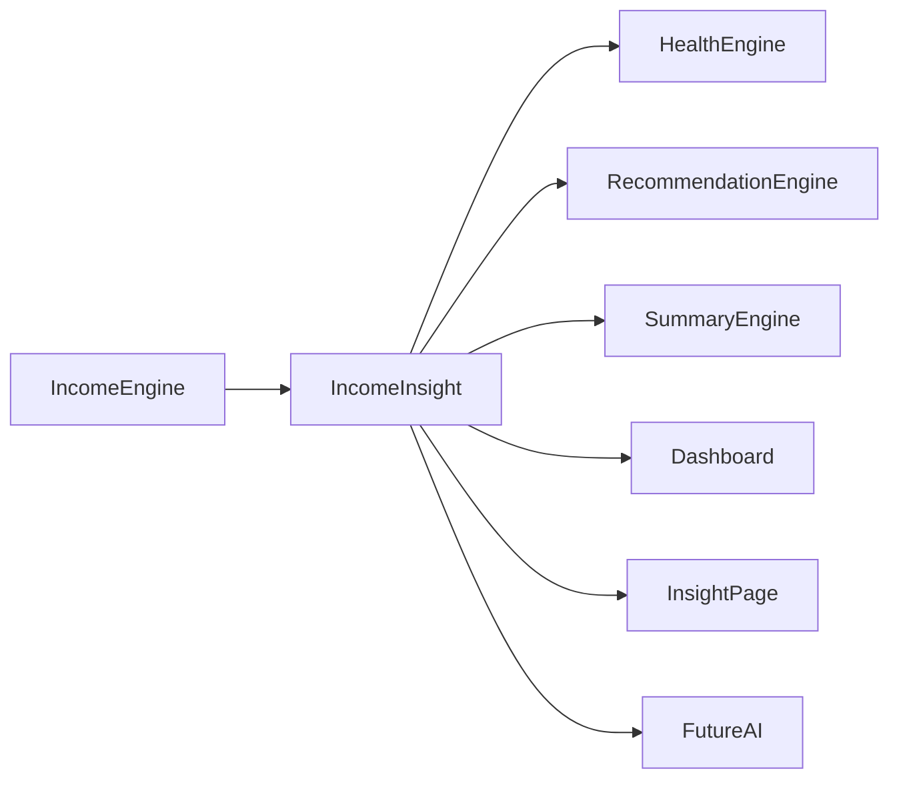
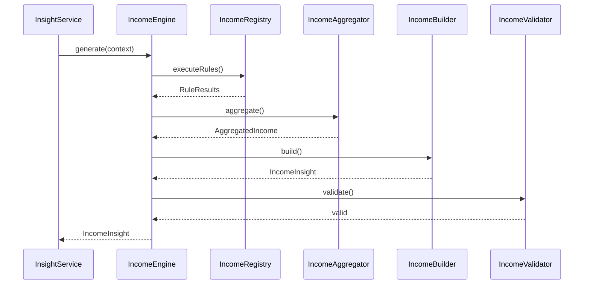
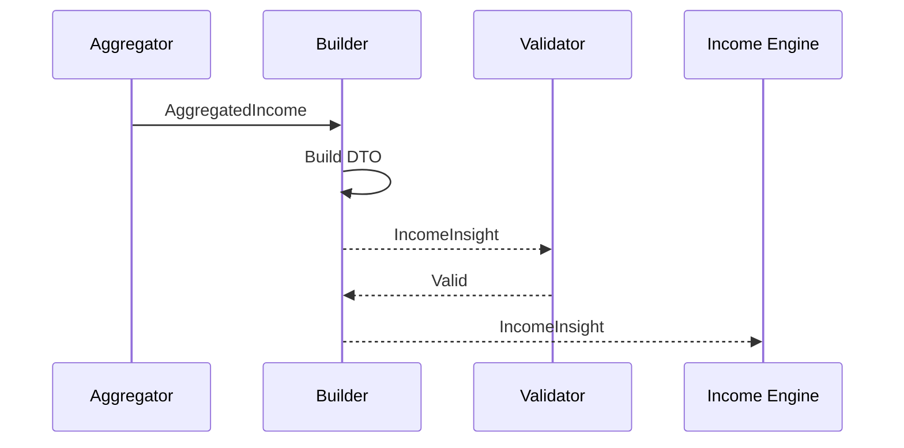
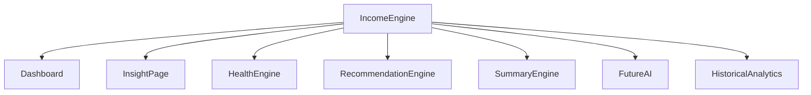
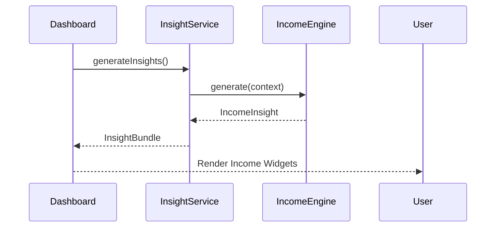

# 06 — Income Engine Architecture

> **Document Version:** 2.0.0
> **Status:** Draft — Architecture Review Pending
>
> **Parent Documents**
>
> * 00 — PesoPilot v2.0 Source of Truth
> * 01 — Rule-Based Financial Intelligence Architecture
> * 02 — InsightBundle & Data Contracts
> * 03 — Insight Engine Architecture
> * 04 — Rule Engine Architecture
> * 05 — Health Engine Architecture
>
> **Phase**
>
> Phase 11A — Rule-Based Financial Intelligence
>
> ---
>
> ## Document Structure
>
> ### Part I
>
> **Introduction, Income Philosophy, Responsibilities & Overall Income Architecture**
>
> Covers:
>
> * Purpose of the Income Engine
> * Position within the Financial Intelligence Platform
> * Income philosophy
> * Responsibilities
> * Inputs
> * Outputs
> * Overall architecture
> * Component responsibilities
> * Relationships with other engines
> * Architecture diagrams
>
> ---
>
> ### Part II
>
> **Income Metrics Model, Trend Analysis, Breakdown Model & Income Health Evaluation**
>
> Covers:
>
> * Income metrics philosophy
> * Income totals
> * Current cutoff income
> * Previous cutoff comparison
> * Monthly averages
> * Growth calculations
> * Decline calculations
> * Income consistency
> * Income source diversification
> * Stability evaluation
> * Income metric formulas
> * Thresholds
> * Versioning
>
> ---
>
> ### Part III
>
> **Income Rule Registry, Income Rules, Rule Specifications & Evidence Model**
>
> Covers:
>
> * Income Rule Registry
> * Income Rule lifecycle
> * Income Rules
> * Rule specifications
> * Evidence generation
> * RuleResult structure
> * Metadata
> * Registry organization
> * Rule priorities
> * Dependencies
> * Versioning
>
> Initial Rule Set:
>
> * Income Exists Rule
> * Total Income Rule
> * Income Growth Rule
> * Income Decline Rule
> * Income Stability Rule
> * Income Source Breakdown Rule
> * Largest Income Source Rule
> * Income Diversification Rule
> * Cutoff Comparison Rule
> * Monthly Average Rule
>
> ---
>
> ### Part IV
>
> **Income Aggregation, IncomeInsight DTO, Dashboard Integration & Explanation Generation**
>
> Covers:
>
> * Aggregation pipeline
> * IncomeInsight DTO
> * Income summaries
> * Income explanation generation
> * Dashboard integration
> * Insight Page integration
> * Recommendation Engine integration
> * Summary Engine integration
> * Historical income architecture
> * Sequence diagrams
> * Validation
>
> ---
>
> ### Part V
>
> **Testing Strategy, Historical Income, Future Evolution, Acceptance Criteria & Implementation Roadmap**
>
> Covers:
>
> * Unit testing
> * Calculator testing
> * Aggregator testing
> * Builder testing
> * Validator testing
> * Integration testing
> * Regression testing
> * Historical income snapshots
> * Performance targets
> * Implementation roadmap
> * ADRs
> * Acceptance Criteria
> * Document Summary
>
> ---
>
> ## Primary Output
>
> The Income Engine produces exactly one public DTO.
>
> ```text
> IncomeInsight
>
> ├── Current Income
> ├── Previous Income
> ├── Monthly Average
> ├── Income Growth
> ├── Income Trend
> ├── Stability
> ├── Income Sources
> ├── Largest Source
> ├── Diversification
> ├── Evidence
> ├── Explanation
> ├── Diagnostics
> └── Metadata
> ```
>
> This DTO becomes part of the global **InsightBundle** defined in Document 02.
>
> ---
>
> ## Relationship with Other Engines
>
> The Income Engine is one of the five primary Financial Intelligence Engines.
>
> ```text
> FinancialContext
> │
> ├── Income Engine
> ├── Expense Engine
> ├── Savings Engine
> ├── Cashflow Engine
> └── Cutoff Engine
>            │
>            ▼
>      Health Engine
>            │
>            ▼
>     Recommendation Engine
>            │
>            ▼
>        Summary Engine
> ```
>
> The Income Engine never calculates recommendations or Health Scores.
>
> It only produces deterministic income intelligence that downstream engines consume.
>
> ---
>
> **Next Section:** **Part I — Introduction, Income Philosophy, Responsibilities & Overall Income Architecture**

# 06 — Income Engine Architecture (Part I)

> **Document Version:** 2.0.0
> **Status:** Draft — Architecture Review Pending
>
> **Parent Documents:**
>
> * `00-PesoPilot-v2.0-Source-of-Truth.md`
> * `01-Rule-Based-Financial-Intelligence-Architecture.md`
> * `02-InsightBundle-and-Data-Contracts.md`
> * `03-Insight-Engine-Architecture.md`
> * `04-Rule-Engine-Architecture.md`
> * `05-Health-Engine-Architecture.md`
>
> **Phase:** Phase 11A — Rule-Based Financial Intelligence
>
> **Section:** Introduction, Income Philosophy, Responsibilities & Overall Income Architecture

---

# 1. Purpose

The Income Engine is the authoritative source of truth for all income-related financial intelligence inside PesoPilot.

While the Health Engine evaluates the user's overall financial condition, the Income Engine focuses exclusively on understanding income behavior.

It answers questions such as:

* How much income was earned?
* Is income increasing or decreasing?
* Is income stable?
* Which income source contributes the most?
* Is income diversified?
* How does the current cutoff compare to previous periods?

Rather than displaying raw income transactions, the Income Engine converts financial records into structured and explainable intelligence.

---

# 2. Position Within the Financial Intelligence Platform

The Income Engine is one of the five primary Financial Intelligence Engines.



The Income Engine contributes only income intelligence.

It does not evaluate spending, savings, or financial health.

---

# 3. Purpose of the Income Engine

The Income Engine transforms raw income transactions into meaningful financial insights.

Its primary responsibilities are:

* calculating current income,
* analyzing income trends,
* comparing historical income,
* evaluating income stability,
* identifying income sources,
* detecting income growth and decline,
* generating explainable income insights.

The engine intentionally avoids making financial recommendations.

---

# 4. Income Philosophy

Income is the foundation of every financial plan.

However, PesoPilot intentionally distinguishes **income amount** from **income quality**.

Someone earning ₱25,000 consistently may have healthier financial behavior than someone earning ₱120,000 inconsistently.

Therefore, the Income Engine evaluates:

* consistency,
* sustainability,
* predictability,
* diversification,
* historical trends,

rather than rewarding high income alone.

---

# 5. Guiding Principles

The Income Engine follows seven principles.

---

## 5.1 Deterministic Intelligence

The same FinancialContext always produces the same IncomeInsight.

No randomness.

No AI.

No probabilistic calculations.

---

## 5.2 Explainability

Every income metric must be explainable.

Users should understand:

* where values came from,
* how comparisons were made,
* why trends changed.

---

## 5.3 Historical Context

Income gains meaning when compared over time.

The engine therefore prioritizes:

* previous cutoff comparisons,
* monthly averages,
* long-term trends,

instead of isolated values.

---

## 5.4 Income Neutrality

The engine never rewards high salaries.

Instead, it evaluates income behavior.

Income size is descriptive.

Income stability is evaluative.

---

## 5.5 Local-First Intelligence

The Income Engine operates entirely from local financial data.

No payroll integrations.

No banking APIs.

No external income verification.

---

## 5.6 Reusability

Every computed income metric should be reusable by:

* Dashboard
* Health Engine
* Recommendation Engine
* Summary Engine
* AI Financial Coach

The Income Engine performs calculations once.

Other engines consume the results.

---

## 5.7 Extensibility

Future income features should be added through:

* new Rules,
* new Calculators,
* new DTO fields,

rather than modifying existing architecture.

---

# 6. Responsibilities

The Income Engine owns:

* income totals,
* cutoff comparisons,
* income trend detection,
* growth calculations,
* decline calculations,
* income stability,
* income source analysis,
* diversification analysis,
* evidence generation,
* IncomeInsight construction.

The Income Engine does **not** own:

* Health Score calculations,
* savings calculations,
* expense calculations,
* recommendations,
* summaries,
* AI conversations,
* persistence.

---

# 7. Inputs

The Income Engine receives one immutable object:

```text
FinancialContext
```

Relevant data includes:

* income records,
* salary cutoffs,
* historical cutoffs,
* current cutoff,
* derived financial metrics.

The engine never communicates directly with:

* repositories,
* IndexedDB,
* React,
* Zustand,
* services.

---

# 8. Outputs

The Income Engine produces exactly one public DTO.

```text
IncomeInsight

├── Current Income

├── Previous Income

├── Monthly Average

├── Income Trend

├── Income Growth

├── Income Stability

├── Income Sources

├── Largest Income Source

├── Diversification

├── Evidence

├── Explanation

├── Diagnostics

└── Metadata
```

The DTO becomes one component of the global InsightBundle.

---

# 9. High-Level Pipeline

```mermaid
flowchart TD

FinancialContext

↓

Income Rule Registry

↓

Income Rule Runner

↓

Income RuleResults

↓

Income Aggregator

↓

Income Builder

↓

Income Validator

↓

IncomeInsight
```

The pipeline mirrors the standard Rule Engine Architecture established in Document 04.

---

# 10. Internal Components

The Income Engine consists of six major components.

```text
Income Engine

├── Income Rule Registry

├── Income Rule Runner

├── Income Calculators

├── Income Aggregator

├── Income Builder

└── Income Validator
```

Each component has a single responsibility.

---

# 11. Relationship with Other Engines

The Income Engine serves as a producer of financial intelligence.



The engine never consumes HealthInsight or Recommendation outputs.

Dependencies remain one-directional.

---

# 12. IncomeInsight Responsibilities

The IncomeInsight DTO answers several core business questions.

* How much income was earned this cutoff?
* How does current income compare to previous cutoffs?
* Is income increasing or decreasing?
* Is income stable over time?
* Which income source contributes the most?
* Is the user dependent on a single income source?
* What evidence supports these conclusions?

It intentionally avoids suggesting what users should do.

Recommendations belong to the Recommendation Engine.

---

# 13. Overall Income Architecture



---

# 14. Future Evolution

The Income Engine is intentionally extensible.

Future enhancements may include:

* recurring income detection,
* seasonal income analysis,
* freelancing income patterns,
* passive income tracking,
* employer diversification,
* forecasted income,
* irregular income smoothing,
* salary progression analytics.

These additions should integrate through new Rules and Calculators without changing the engine's architecture.

---

# 15. Architecture Decision Records

## ADR-061

### Why a Dedicated Income Engine?

**Decision**

Income intelligence is isolated within its own Rule Engine.

**Reason**

Separates income analysis from other financial domains and promotes reuse.

---

## ADR-062

### Why Evaluate Income Behavior Instead of Salary Size?

**Decision**

The engine focuses on consistency, trends, and diversification rather than rewarding higher salaries.

**Reason**

Produces fair and actionable financial intelligence for users across different income levels.

---

## ADR-063

### Why Produce a Single IncomeInsight DTO?

**Decision**

All income intelligence is consolidated into one public DTO.

**Reason**

Simplifies downstream consumption and maintains a single source of truth.

---

## ADR-064

### Why Separate Calculations from Recommendations?

**Decision**

The Income Engine performs deterministic analysis only.

**Reason**

Keeps business calculations independent from coaching logic.

---

## ADR-065

### Why Design for Future Income Analytics?

**Decision**

The architecture anticipates future income analysis features without requiring structural changes.

**Reason**

Supports long-term platform evolution while preserving architectural stability.

---

# 16. Acceptance Criteria

This section is complete when:

* The purpose of the Income Engine is clearly defined.
* Income philosophy is documented.
* Responsibilities and boundaries are established.
* Inputs and outputs are standardized.
* Internal architecture follows Document 04.
* Relationships with other engines are defined.
* Future extensibility is documented.
* Architecture decisions are recorded.

---

# Part I Summary

Part I establishes the conceptual foundation of the Income Engine.

The Income Engine is responsible for converting raw income records into deterministic, explainable financial intelligence. Rather than evaluating salary size, it measures the quality of income through trend analysis, stability, diversification, and historical comparisons. The resulting `IncomeInsight` serves as the authoritative source of income intelligence for the Dashboard, Health Engine, Recommendation Engine, Summary Engine, and future AI Financial Coach while maintaining strict separation from presentation, persistence, and recommendation logic.

---

**End of Part I**

**Next Section:** **Part II — Income Metrics Model, Trend Analysis, Breakdown Model & Income Health Evaluation**

# 06 — Income Engine Architecture (Part II)

> **Document Version:** 2.0.0
> **Status:** Draft — Architecture Review Pending
>
> **Parent Documents:**
>
> * `00-PesoPilot-v2.0-Source-of-Truth.md`
> * `01-Rule-Based-Financial-Intelligence-Architecture.md`
> * `02-InsightBundle-and-Data-Contracts.md`
> * `03-Insight-Engine-Architecture.md`
> * `04-Rule-Engine-Architecture.md`
> * `05-Health-Engine-Architecture.md`
>
> **Phase:** Phase 11A — Rule-Based Financial Intelligence
>
> **Section:** Income Metrics Model, Trend Analysis, Breakdown Model & Income Health Evaluation

---

# 17. Purpose

Part I introduced the purpose and architecture of the Income Engine.

This section defines **how income intelligence is measured**.

Unlike the Health Engine, which produces a weighted behavioral score, the Income Engine focuses on producing accurate financial metrics and objective evaluations of income behavior.

Every metric generated by the Income Engine is deterministic, reproducible, and fully explainable.

---

# 18. Income Metrics Philosophy

Income intelligence is built around one principle:

> **Income should be analyzed as a financial pattern, not merely a monetary amount.**

A single paycheck provides little insight by itself.

Meaningful intelligence emerges through:

* historical comparison,
* stability analysis,
* diversification,
* trend detection,
* cutoff analysis.

The Income Engine therefore evaluates both **current income** and **income behavior over time**.

---

# 19. Income Intelligence Model

The Income Engine produces five primary categories of intelligence.

```mermaid
flowchart TD

Income Records

-->

Income Totals

Income Records

-->

Income Trends

Income Records

-->

Income Sources

Income Records

-->

Income Stability

Income Records

-->

Income Comparisons

Income Totals --> IncomeInsight

Income Trends --> IncomeInsight

Income Sources --> IncomeInsight

Income Stability --> IncomeInsight

Income Comparisons --> IncomeInsight
```

Each category is computed independently.

---

# 20. Current Cutoff Income

The first metric is the total income earned during the currently active salary cutoff.

Formula:

```text
Current Cutoff Income

=

Σ Income Records

(Current Cutoff)
```

Example

```text
Salary

₱35,000

Freelance

₱8,000

Bonus

₱2,000

──────────────

Current Income

₱45,000
```

This becomes the primary income figure displayed throughout PesoPilot.

---

# 21. Previous Cutoff Income

The engine calculates the immediately preceding cutoff's income.

Formula:

```text
Previous Cutoff Income

=

Σ Income Records

(Previous Cutoff)
```

Example

```text
Current

₱45,000

Previous

₱42,000
```

This enables trend comparisons.

---

# 22. Monthly Average Income

The Monthly Average smooths short-term fluctuations.

Formula:

```text
Average Income

=

Total Income

÷

Completed Cutoffs
```

Only completed cutoffs participate.

The active cutoff is excluded unless explicitly requested.

---

# 23. Income Growth

Income Growth measures positive movement between periods.

Formula:

```text
Income Growth %

=

(Current

−

Previous)

÷

Previous

×

100
```

Example

```text
Previous

₱40,000

Current

₱45,000

Growth

12.5%
```

Growth may be:

* Positive
* Neutral
* Negative

---

# 24. Income Decline

Declines are calculated using the same comparison formula.

Example

```text
Previous

₱45,000

Current

₱40,000

↓

-11.1%
```

The engine reports decline factually.

No recommendation is generated.

---

# 25. Income Trend

Income Trend converts numeric comparisons into user-friendly categories.

Supported values:

```text
Increasing

Stable

Decreasing

Insufficient Data
```

Trend classification is deterministic.

---

# 26. Stable Income Threshold

Phase 11A defines the following thresholds.

| Change            | Trend               |
| ----------------- | ------------------- |
| ±5%               | Stable              |
| +5% to +20%       | Increasing          |
| Greater than +20% | Rapid Increase      |
| -5% to -20%       | Decreasing          |
| Less than -20%    | Significant Decline |

These thresholds may evolve in future versions.

---

# 27. Income Stability

Income Stability evaluates consistency across multiple salary cutoffs.

It answers:

> **"How predictable is the user's income?"**

Unlike growth,

stability considers multiple historical periods.

---

# 28. Stability Evaluation

Initial Phase 11A considers:

* completed cutoff count,
* income variance,
* trend consistency.

Example

```text
Cutoff

Income

Jan

₱40,000

Feb

₱41,000

Mar

₱39,500

Apr

₱40,500
```

This represents high stability.

---

# 29. Stability Levels

Income Stability is categorized as:

| Stability | Description               |
| --------- | ------------------------- |
| High      | Income varies very little |
| Moderate  | Normal variation          |
| Low       | Significant fluctuations  |
| Unknown   | Insufficient history      |

---

# 30. Income Source Analysis

The Income Engine groups income by source.

Example

```text
Salary

₱35,000

Freelance

₱8,000

Business

₱2,000
```

Each source contributes to diversification analysis.

---

# 31. Largest Income Source

The engine identifies:

```text
Largest Source

↓

Salary

₱35,000

↓

77%
```

Largest source information supports future resilience analysis.

---

# 32. Income Diversification

Diversification measures dependence on one income source.

Example

```text
Salary

95%

Freelance

5%
```

↓

Low Diversification

Example

```text
Salary

60%

Business

25%

Freelance

15%
```

↓

Higher Diversification

---

# 33. Diversification Levels

The engine classifies diversification as:

| Level                  | Description                               |
| ---------------------- | ----------------------------------------- |
| Highly Diversified     | Multiple balanced sources                 |
| Moderately Diversified | One dominant source with secondary income |
| Low Diversification    | Single primary income source              |
| Unknown                | No income records                         |

This is descriptive only.

---

# 34. Income Distribution

The engine produces percentage distributions.

Formula:

```text
Source %

=

Source Income

÷

Total Income

×

100
```

This supports:

* Dashboard charts,
* Insight Page,
* AI explanations.

---

# 35. Cutoff Comparison

The engine compares:

Current Cutoff

↓

Previous Cutoff

↓

Difference

↓

Percentage

↓

Trend

This becomes the default comparison model throughout PesoPilot.

---

# 36. Monthly Comparison

When sufficient history exists,

the engine also compares:

```text
Current

↓

Monthly Average

↓

Difference
```

This helps identify unusually high or low earning periods.

---

# 37. Income Health Evaluation

Although the Health Engine owns the Financial Health Score,

the Income Engine internally evaluates income quality.

The evaluation summarizes:

* growth,
* stability,
* diversification,
* consistency.

This internal evaluation becomes one contributor to the Health Engine.

---

# 38. Income Health Levels

The Income Engine classifies income quality.

Supported values:

```text
Excellent

Good

Fair

Needs Attention
```

These levels are internal.

They are consumed by the Health Engine rather than displayed independently.

---

# 39. Missing Data Handling

The Income Engine must gracefully handle:

* no income,
* one cutoff only,
* one income source,
* incomplete history.

Examples

```text
Income Trend

↓

Insufficient Data
```

rather than:

```text
Increasing
```

This avoids misleading conclusions.

---

# 40. Metric Versioning

The metric model exposes:

```text
Income Model

Version

1.0
```

Future versions may introduce:

* seasonal adjustments,
* recurring income detection,
* forecast confidence,
* irregular income smoothing.

---

# 41. Architecture Decision Records

## ADR-066

### Why Compare Across Cutoffs?

**Decision**

Income comparisons use salary cutoffs as the primary financial period.

**Reason**

Keeps intelligence aligned with PesoPilot's cutoff-centric financial model.

---

## ADR-067

### Why Separate Growth from Stability?

**Decision**

Growth and stability are evaluated independently.

**Reason**

A growing income is not necessarily a stable income.

---

## ADR-068

### Why Analyze Income Sources?

**Decision**

Income diversification forms part of overall income quality.

**Reason**

Heavy dependence on a single source may represent financial risk.

---

## ADR-069

### Why Internal Income Health?

**Decision**

The Income Engine produces an internal quality assessment.

**Reason**

Provides structured input for the Health Engine without exposing another user-facing score.

---

## ADR-070

### Why Graceful Missing Data Handling?

**Decision**

Unknown financial history produces "Insufficient Data" rather than negative evaluations.

**Reason**

Avoids penalizing new users and improves fairness.

---

# 42. Acceptance Criteria

This section is complete when:

* Income metrics are standardized.
* Current and previous cutoff calculations are defined.
* Growth and decline formulas are documented.
* Stability evaluation is established.
* Diversification model is documented.
* Cutoff comparison methodology is defined.
* Internal income quality evaluation is specified.
* Missing-data handling is documented.
* Future extensibility is addressed.

---

# Part II Summary

Part II defines the analytical model used by the Income Engine to transform raw income transactions into meaningful financial intelligence. Rather than focusing solely on income totals, the engine evaluates trends, stability, diversification, cutoff comparisons, and historical behavior. These deterministic metrics form the foundation of the `IncomeInsight` DTO and provide standardized income intelligence for the Dashboard, Health Engine, Recommendation Engine, Summary Engine, and future AI-powered financial coaching.

---

**End of Part II**

**Next Section:** **Part III — Income Rule Registry, Income Rules, Rule Specifications & Evidence Model**

# 06 — Income Engine Architecture (Part III)

> **Document Version:** 2.0.0
> **Status:** Draft — Architecture Review Pending
>
> **Parent Documents:**
>
> * `00-PesoPilot-v2.0-Source-of-Truth.md`
> * `01-Rule-Based-Financial-Intelligence-Architecture.md`
> * `02-InsightBundle-and-Data-Contracts.md`
> * `03-Insight-Engine-Architecture.md`
> * `04-Rule-Engine-Architecture.md`
> * `05-Health-Engine-Architecture.md`
>
> **Phase:** Phase 11A — Rule-Based Financial Intelligence
>
> **Section:** Income Rule Registry, Income Rules, Rule Specifications & Evidence Model

---

# 43. Purpose

Part II defined the metrics used to evaluate income.

This section defines **how those metrics are produced**.

The Income Engine follows the Rule Engine Architecture established in Document 04.

Instead of calculating every metric inside one large service, the engine executes a collection of deterministic Income Rules.

Each Rule evaluates one business question.

Each Rule produces one RuleResult.

Those RuleResults are aggregated into the final IncomeInsight.

---

# 44. Income Rule Philosophy

Each Income Rule should answer exactly one financial question.

Examples:

```text
Is income increasing?

↓

IncomeGrowthRule
```

```text
Is income stable?

↓

IncomeStabilityRule
```

```text
Which income source contributes the most?

↓

LargestIncomeSourceRule
```

Rules should remain:

* deterministic,
* independent,
* reusable,
* explainable,
* testable.

---

# 45. Income Rule Registry

The Income Engine owns a dedicated Rule Registry.

```mermaid
flowchart TD

IncomeEngine

↓

IncomeRuleRegistry

↓

Income Rules

↓

RuleRunner

↓

Income RuleResults
```

The Registry defines:

* execution order,
* priorities,
* metadata,
* dependencies,
* versions.

---

# 46. Income Rule Categories

Income Rules are grouped into five categories.

```text
Income Presence

Income Totals

Income Trends

Income Sources

Income Stability
```

Grouping improves maintainability and diagnostics.

---

# 47. Registry Structure

```text
IncomeRuleRegistry

├── Presence Rules

├── Total Rules

├── Trend Rules

├── Source Rules

└── Stability Rules
```

Every Rule belongs to exactly one category.

---

# 48. Presence Rules

Presence Rules determine whether sufficient income information exists.

Phase 11A includes:

```text
IncomeExistsRule
```

---

## IncomeExistsRule

Business Question

```text
Does the current cutoff contain at least one income record?
```

Purpose

Prevent downstream Rules from evaluating empty datasets.

Evidence

```text
Income Record Count

Current Cutoff

Total Income
```

Possible Status

* Passed
* Failed

---

# 49. Total Rules

Total Rules calculate deterministic financial totals.

Initial Rules

```text
CurrentIncomeTotalRule

PreviousIncomeTotalRule

MonthlyAverageIncomeRule
```

---

## CurrentIncomeTotalRule

Business Question

```text
How much income exists in the current cutoff?
```

Evidence

```text
Current Cutoff

Income Total

Income Records
```

---

## PreviousIncomeTotalRule

Business Question

```text
How much income existed during the previous cutoff?
```

Evidence

```text
Previous Cutoff

Income Total
```

---

## MonthlyAverageIncomeRule

Business Question

```text
What is the user's average completed-cutoff income?
```

Evidence

```text
Completed Cutoffs

Average Income
```

---

# 50. Trend Rules

Trend Rules compare income across time.

Phase 11A

```text
IncomeGrowthRule

IncomeDeclineRule

IncomeTrendRule

CutoffComparisonRule
```

---

## IncomeGrowthRule

Business Question

```text
Has income increased?
```

Evidence

```text
Current

Previous

Growth %

Difference
```

---

## IncomeDeclineRule

Business Question

```text
Has income decreased?
```

Evidence

```text
Current

Previous

Decline %
```

---

## IncomeTrendRule

Business Question

```text
How should income movement be classified?
```

Possible Results

```text
Increasing

Stable

Decreasing

Insufficient Data
```

---

## CutoffComparisonRule

Purpose

Produce standardized cutoff comparisons.

Output

```text
Difference

Percentage

Trend
```

---

# 51. Source Rules

Source Rules evaluate income composition.

Phase 11A

```text
IncomeSourceBreakdownRule

LargestIncomeSourceRule

IncomeDiversificationRule
```

---

## IncomeSourceBreakdownRule

Purpose

Group income by source.

Example

```text
Salary

Freelance

Business

Allowance
```

Evidence

```text
Each Source

Amount

Percentage
```

---

## LargestIncomeSourceRule

Business Question

```text
Which source contributes the largest percentage?
```

Example

```text
Salary

78%
```

---

## IncomeDiversificationRule

Business Question

```text
Is income dependent on one source?
```

Possible Results

```text
Highly Diversified

Moderately Diversified

Low Diversification

Unknown
```

---

# 52. Stability Rules

Income Stability evaluates consistency.

Initial Rules

```text
IncomeConsistencyRule

IncomeVarianceRule

IncomeStabilityRule
```

---

## IncomeConsistencyRule

Business Question

```text
Has income remained relatively consistent?
```

Evidence

Historical cutoff values.

---

## IncomeVarianceRule

Business Question

```text
How much does income fluctuate?
```

Future versions may use statistical variance.

Phase 11A uses deterministic percentage deviation.

---

## IncomeStabilityRule

Business Question

```text
How stable is overall income?
```

Possible Results

```text
High

Moderate

Low

Unknown
```

---

# 53. Rule Specification Template

Every Income Rule follows the same specification.

```text
Rule Name

Purpose

Business Question

Inputs

Calculator

Evidence

Severity

Priority

Output

Version
```

This standard applies to all future Income Rules.

---

# 54. Rule Metadata

Each Rule exposes metadata.

```text
Rule ID

Rule Name

Category

Priority

Version

Description
```

Example

```text
IncomeGrowthRule

Category

Trend

Priority

40

Version

1.0
```

Metadata supports diagnostics and debugging.

---

# 55. Evidence Philosophy

Every Rule must provide evidence.

Never

```text
Income Trend

Increasing
```

Instead

```text
Income Trend

Increasing

Current

₱45,000

Previous

₱40,000

Growth

12.5%
```

Evidence is mandatory.

---

# 56. Evidence Structure

Each Rule generates structured evidence.

```text
Evidence

├── Title

├── Description

└── Evidence Items
```

Example

```text
Income Growth

Current Income

₱45,000

Previous Income

₱40,000

Growth

12.5%
```

---

# 57. Example RuleResult

```json
{
  "ruleName": "IncomeGrowthRule",
  "category": "Trend",
  "status": "Passed",
  "severity": "Info",
  "value": 12.5,
  "weight": 4,
  "evidence": {
    "currentIncome": 45000,
    "previousIncome": 40000,
    "growthPercentage": 12.5
  }
}
```

---

# 58. Rule Execution Order

Rules execute deterministically.

```mermaid
flowchart TD

Presence Rules

↓

Total Rules

↓

Trend Rules

↓

Source Rules

↓

Stability Rules
```

Execution order never depends on import order or filesystem order.

---

# 59. Rule Independence

Income Rules should remain independent.

Preferred

```text
IncomeGrowthRule

↓

FinancialContext
```

Avoid

```text
IncomeGrowthRule

↓

IncomeTrendRule
```

Duplicate calculations should instead be extracted into shared Calculators.

---

# 60. Rule Dependencies

Where dependencies exist,

they should reference earlier RuleResults rather than recomputing values.

Example

```text
CurrentIncomeTotalRule

↓

IncomeGrowthRule

↓

IncomeTrendRule
```

Dependencies should remain shallow.

---

# 61. Versioning

Every Income Rule exposes:

```text
Rule Version

1.0
```

Future updates:

```text
1.1

2.0
```

Versioning supports:

* migration,
* regression testing,
* diagnostics,
* compatibility.

---

# 62. Future Expansion

Future Rules may include:

```text
RecurringIncomeRule

BonusIncomeRule

PassiveIncomeRule

IncomeSeasonalityRule

EmployerConcentrationRule

IncomeForecastRule

IncomeReliabilityRule
```

These Rules extend the Registry without changing engine architecture.

---

# 63. Architecture Decision Records

## ADR-071

### Why Separate Income Rules?

**Decision**

Income intelligence is produced through multiple specialized Rules.

**Reason**

Improves maintainability, explainability, and unit testing.

---

## ADR-072

### Why Categorize Rules?

**Decision**

Rules are grouped into Presence, Totals, Trends, Sources, and Stability.

**Reason**

Keeps the Registry organized and simplifies diagnostics.

---

## ADR-073

### Why Require Evidence?

**Decision**

Every Rule generates structured evidence.

**Reason**

Supports Dashboard explanations, Health Engine aggregation, Recommendation generation, and AI explanations.

---

## ADR-074

### Why Keep Rules Independent?

**Decision**

Rules should depend primarily on FinancialContext.

**Reason**

Improves reuse, enables future parallel execution, and minimizes coupling.

---

## ADR-075

### Why Standardize Rule Specifications?

**Decision**

Every Income Rule follows a common template.

**Reason**

Ensures consistency across current and future financial intelligence engines.

---

# 64. Acceptance Criteria

This section is complete when:

* The Income Rule Registry is defined.
* Rule categories are documented.
* Initial Phase 11A Rules are specified.
* Rule templates are standardized.
* Evidence requirements are established.
* Rule execution order is deterministic.
* Metadata and versioning are documented.
* Future Rule expansion strategy is defined.

---

# Part III Summary

Part III defines the rule-based execution model of the Income Engine.

Instead of embedding all income analysis into a single service, the Income Engine evaluates a structured registry of deterministic Rules covering income presence, totals, trends, source composition, and stability. Each Rule produces an explainable RuleResult supported by structured evidence, enabling the Income Aggregator to construct an accurate and transparent `IncomeInsight`.

This modular architecture ensures that income intelligence remains extensible, testable, and reusable across the Dashboard, Health Engine, Recommendation Engine, Summary Engine, and future AI Financial Coach.

---

**End of Part III**

**Next Section:** **Part IV — Income Aggregation, IncomeInsight DTO, Dashboard Integration & Explanation Generation**

# 06 — Income Engine Architecture (Part IV)

> **Document Version:** 2.0.0
> **Status:** Draft — Architecture Review Pending
>
> **Parent Documents:**
>
> * `00-PesoPilot-v2.0-Source-of-Truth.md`
> * `01-Rule-Based-Financial-Intelligence-Architecture.md`
> * `02-InsightBundle-and-Data-Contracts.md`
> * `03-Insight-Engine-Architecture.md`
> * `04-Rule-Engine-Architecture.md`
> * `05-Health-Engine-Architecture.md`
>
> **Phase:** Phase 11A — Rule-Based Financial Intelligence
>
> **Section:** Income Aggregation, IncomeInsight DTO, Dashboard Integration & Explanation Generation

---

# 65. Purpose

Previous sections defined:

* the Income Engine philosophy,
* income metrics,
* Income Rule Registry,
* Rule specifications.

This section defines how individual Income RuleResults are transformed into the public **IncomeInsight** DTO.

The Income Engine never exposes raw RuleResults directly.

Instead, it aggregates them into one coherent representation of the user's income behavior.

---

# 66. Income Aggregation Philosophy

The purpose of aggregation is to transform dozens of low-level financial observations into meaningful income intelligence.

Rather than showing:

```text id="it9rj2"
Rule A

Passed

Rule B

Passed

Rule C

Warning
```

the engine produces:

```text id="jfj7vv"
Income Trend

Increasing

Income Stability

High

Income Diversification

Moderate
```

Aggregation exists to simplify understanding without losing explainability.

---

# 67. High-Level Aggregation Pipeline

```mermaid id="rj0d5v"
flowchart TD

Income RuleResults

-->

Income Aggregator

Income Aggregator

-->

Aggregated Income

Aggregated Income

-->

Income Builder

Income Builder

-->

Income Validator

Income Validator

-->

IncomeInsight
```

Aggregation and DTO construction remain separate responsibilities.

---

# 68. Income Aggregator Responsibilities

The Income Aggregator is responsible for:

* combining RuleResults,
* calculating summary metrics,
* selecting trend classifications,
* identifying dominant income sources,
* evaluating diversification,
* preparing explanation inputs,
* preparing visualization data.

The Aggregator does **not**:

* create recommendations,
* generate summaries,
* call AI,
* persist data,
* build UI components.

---

# 69. Aggregation Inputs

The Aggregator receives:

```text id="0hfgfd"
IncomeRuleResult[]
```

Each RuleResult includes:

* status,
* value,
* severity,
* evidence,
* metadata,
* weight.

No repositories or services are accessed.

---

# 70. Aggregation Outputs

The Aggregator produces an internal model.

```text id="l6c9mk"
AggregatedIncome

├── Current Income

├── Previous Income

├── Average Income

├── Growth

├── Trend

├── Stability

├── Sources

├── Diversification

├── Evidence

├── Diagnostics
```

This object is internal to the Income Engine.

---

# 71. Metric Aggregation

Each metric category is aggregated independently.

```mermaid id="swx0x5"
flowchart LR

Total Rules

-->

Income Totals

Trend Rules

-->

Income Trend

Source Rules

-->

Source Analysis

Stability Rules

-->

Income Stability
```

Independent aggregation improves maintainability.

---

# 72. Trend Aggregation

Trend aggregation combines:

* growth,
* decline,
* historical comparison.

Example

```text id="av3cg3"
Growth

12%

↓

Trend

Increasing
```

Trend selection follows the thresholds defined in Part II.

---

# 73. Stability Aggregation

Income stability combines:

* variance,
* consistency,
* historical cutoff behavior.

Example

```text id="0mr65w"
Variance

Low

Consistency

High

↓

Stability

High
```

The Aggregator hides intermediate calculations from consumers.

---

# 74. Source Aggregation

Income source intelligence combines:

* source totals,
* percentages,
* largest contributor,
* diversification.

Example

```text id="mtq50v"
Salary

77%

Freelance

18%

Business

5%

↓

Diversification

Moderate
```

---

# 75. Evidence Aggregation

Multiple Rule evidences are merged into coherent sections.

Instead of exposing:

```text id="tqmdyl"
Growth Rule

Evidence

Largest Source Rule

Evidence
```

the engine groups them.

Example

```text id="hjlwmh"
Income Overview

Current Income

Previous Income

Growth

Largest Source

Average Income
```

This makes explanations easier to understand.

---

# 76. Income Explanation Generation

The Income Engine generates deterministic explanations.

It answers:

> **"What happened to the user's income?"**

Example

```text id="j9uzra"
Income increased compared to the previous cutoff.

Salary remains your primary income source.

Your income has remained stable across recent cutoffs.
```

Every sentence must be traceable to RuleResults.

---

# 77. Explanation Pipeline

```mermaid id="f6olna"
flowchart LR

RuleResults

-->

Evidence

Evidence

-->

Explanation Builder

Explanation Builder

-->

Income Explanation
```

No AI participates in explanation generation.

---

# 78. Explanation Structure

IncomeInsight contains:

```text id="tlzt2r"
Income Explanation

├── Overview

├── Trend Summary

├── Stability Summary

├── Source Summary

└── Supporting Evidence
```

This structure is reused by downstream engines.

---

# 79. Example Explanation

```text id="f4cydt"
Your income increased by 12.5% compared to the previous cutoff.

Salary remains your primary income source, accounting for 77% of total earnings.

Income has remained stable across recent salary cutoffs.
```

Notice that no recommendations are made.

Only factual observations are presented.

---

# 80. IncomeInsight DTO

The Builder converts AggregatedIncome into the public DTO.

Structure

```text id="7eg1x0"
IncomeInsight

├── Current Income

├── Previous Income

├── Average Income

├── Growth

├── Trend

├── Stability

├── Income Sources

├── Largest Source

├── Diversification

├── Explanation

├── Evidence

├── Diagnostics

└── Metadata
```

The DTO conforms to Document 02.

---

# 81. IncomeInsight Lifecycle



---

# 82. Validator Responsibilities

The Income Validator verifies:

Required fields:

* current income,
* trend,
* stability,
* explanation,
* evidence.

It also validates:

* numeric ranges,
* enum values,
* DTO version,
* metadata.

Invalid DTOs must never reach the Dashboard.

---

# 83. Dashboard Integration

The Dashboard consumes IncomeInsight.

```mermaid id="fjz94x"
flowchart LR

IncomeInsight

-->

Income KPI

IncomeInsight

-->

Trend Card

IncomeInsight

-->

Income Chart

IncomeInsight

-->

Source Breakdown

IncomeInsight

-->

Income Summary
```

Dashboard components never recompute income metrics.

---

# 84. Dashboard Components

IncomeInsight powers:

```text id="fmr3h2"
Current Income

Income Trend

Trend Badge

Monthly Average

Largest Source

Income Breakdown

Income Explanation
```

These become reusable Dashboard widgets.

---

# 85. Insight Page Integration

The Insight Page exposes additional information.

```mermaid id="1c6v13"
flowchart TD

IncomeInsight

-->

Insight Page

Insight Page

-->

Historical Trends

Insight Page

-->

Evidence

Insight Page

-->

Rule Breakdown
```

The Insight Page contains significantly more detail than the Dashboard.

---

# 86. Health Engine Integration

The Health Engine consumes IncomeInsight.

```mermaid id="1kh5x0"
flowchart LR

IncomeInsight

-->

Health Engine
```

The Health Engine evaluates:

* stability,
* consistency,
* diversification.

It never recalculates income metrics.

---

# 87. Recommendation Engine Integration

Recommendation Engine consumes:

```text id="6vjlwm"
Trend

Stability

Diversification

Growth
```

Example

Income Trend

↓

Declining

↓

Recommendation Engine

↓

Income Diversification Recommendation

The Income Engine itself never creates recommendations.

---

# 88. Summary Engine Integration

The Summary Engine consumes:

* explanation,
* trends,
* stability,
* growth.

It converts deterministic observations into natural-language summaries.

---

# 89. AI Financial Coach Integration

Future architecture:

```mermaid id="lxy0n7"
flowchart LR

IncomeInsight

-->

Prompt Builder

-->

LLM
```

The AI receives verified income intelligence.

It never computes income metrics itself.

---

# 90. Historical Income Architecture

Future versions may expose:

```text id="g8m8sj"
Income History

↓

Cutoff

↓

Income

↓

Trend

↓

Explanation
```

Historical snapshots remain outside Phase 11A.

---

# 91. Diagnostics

IncomeInsight exposes developer diagnostics.

Example

```text id="xepn3g"
Registry Version

Model Version

Executed Rules

Execution Time

Warnings
```

These fields are intended for debugging and validation.

---

# 92. Architecture Decision Records

## ADR-076

### Why Aggregate Before Building?

**Decision**

Income RuleResults are aggregated before DTO construction.

**Reason**

Separates business logic from contract mapping.

---

## ADR-077

### Why Deterministic Explanations?

**Decision**

Income explanations originate exclusively from RuleResults.

**Reason**

Ensures explainability, reproducibility, and consistency.

---

## ADR-078

### Why Dashboard Uses IncomeInsight?

**Decision**

Dashboard components consume the IncomeInsight DTO directly.

**Reason**

Maintains a single source of truth for income intelligence.

---

## ADR-079

### Why Separate Recommendations?

**Decision**

Income Engine produces observations only.

**Reason**

Recommendation logic belongs to the Recommendation Engine.

---

## ADR-080

### Why Design for Historical Analysis?

**Decision**

IncomeInsight anticipates future historical tracking.

**Reason**

Supports long-term financial coaching without redesigning the DTO.

---

# 93. Acceptance Criteria

This section is complete when:

* Income aggregation is documented.
* IncomeInsight DTO is standardized.
* Explanation generation is defined.
* Dashboard integration is documented.
* Insight Page integration is documented.
* Health, Recommendation, and Summary Engine integrations are established.
* Validation responsibilities are specified.
* Historical extensibility is documented.

---

# Part IV Summary

Part IV defines how the Income Engine converts individual Income RuleResults into a complete `IncomeInsight`. Through deterministic aggregation, structured evidence consolidation, and rule-based explanation generation, the engine produces a reusable source of income intelligence that powers the Dashboard, Insight Page, Health Engine, Recommendation Engine, Summary Engine, and future AI Financial Coach. By separating aggregation, DTO construction, and validation, the architecture preserves a clean, extensible, and testable implementation aligned with the overall Financial Intelligence Platform.

---

**End of Part IV**

**Next Section:** **Part V — Testing Strategy, Historical Income, Future Evolution, Acceptance Criteria & Implementation Roadmap**

# 06 — Income Engine Architecture (Part V)

> **Document Version:** 2.0.0
> **Status:** Draft — Architecture Review Pending
>
> **Parent Documents:**
>
> * `00-PesoPilot-v2.0-Source-of-Truth.md`
> * `01-Rule-Based-Financial-Intelligence-Architecture.md`
> * `02-InsightBundle-and-Data-Contracts.md`
> * `03-Insight-Engine-Architecture.md`
> * `04-Rule-Engine-Architecture.md`
> * `05-Health-Engine-Architecture.md`
>
> **Phase:** Phase 11A — Rule-Based Financial Intelligence
>
> **Section:** Testing Strategy, Historical Income, Future Evolution, Acceptance Criteria & Implementation Roadmap

---

# 94. Purpose

The previous sections defined:

* the purpose of the Income Engine,
* the income metrics model,
* the Rule Registry,
* aggregation,
* IncomeInsight generation.

This final section defines how the Income Engine should be tested, integrated into the application, extended over time, and implemented in a controlled manner.

---

# 95. Income Engine Integration Overview

The Income Engine is a reusable business intelligence component.

It is consumed by multiple application layers.



The Income Engine remains independent of every consumer.

---

# 96. Dashboard Integration

The Dashboard is the primary consumer of IncomeInsight.

Sequence:



The Dashboard performs **no income calculations**.

---

# 97. Dashboard Components

IncomeInsight powers:

```text
Current Income Card

Income Trend Card

Growth Indicator

Monthly Average Card

Largest Income Source

Income Breakdown Chart

Income Explanation Card
```

Every component consumes the DTO directly.

---

# 98. Income Trend Visualization

The Dashboard should visualize:

* Current Income
* Previous Income
* Growth Percentage
* Trend Status

Example

```text
Current

₱45,000

↑

12%

Compared to Previous Cutoff
```

No visualization performs additional calculations.

---

# 99. Income Source Visualization

Income sources may be presented as:

* Pie Chart
* Donut Chart
* Horizontal Bar Chart

Example

```text
Salary

77%

██████████

Freelance

18%

███

Business

5%

█
```

These charts are purely presentational.

---

# 100. Income Explanation Card

Example:

```text
Income increased by 12.5% compared to your previous cutoff.

Salary remains your primary source of income.

Income has remained stable across recent cutoff periods.
```

This explanation originates entirely from RuleResults.

---

# 101. Insight Page Integration

The dedicated Insight Page exposes additional details.

```mermaid
flowchart TD

IncomeInsight

-->

InsightPage

InsightPage

-->

Metric Cards

InsightPage

-->

Trend Analysis

InsightPage

-->

Evidence

InsightPage

-->

Rule Breakdown

InsightPage

-->

Diagnostics
```

Unlike the Dashboard,

the Insight Page exposes developer-friendly transparency.

---

# 102. Historical Income Architecture

Although outside Phase 11A,

the Income Engine supports future historical tracking.

Future structure:

```text
Income History

↓

Cutoff

↓

Income

↓

Growth

↓

Trend

↓

Explanation
```

Historical intelligence is generated from stored IncomeInsight snapshots.

---

# 103. Historical Timeline

Future visualization:

```text
Jan

₱40,000

↓

Feb

₱41,000

↓

Mar

₱42,500

↓

Apr

₱45,000
```

Timeline generation belongs to future analytics modules.

---

# 104. Historical Comparisons

Future comparisons include:

```text
Current vs Previous Cutoff

Current vs Monthly Average

Best Income Month

Largest Increase

Largest Decline

Longest Stable Period
```

These are deterministic calculations.

---

# 105. Historical Storage

The Income Engine should never persist data.

Instead:


Persistence remains outside the engine.

---

# 106. Health Engine Integration

The Health Engine consumes:

```text
Income Stability

Income Trend

Income Diversification

Income Consistency

Income Health Evaluation
```

The Health Engine never recalculates income intelligence.

---

# 107. Recommendation Engine Integration

Recommendation Engine consumes:

* declining income,
* unstable income,
* concentration risk,
* diversification.

Example

```text
Income Stability

↓

Low

↓

Recommendation Engine

↓

Build Additional Income Streams
```

The Income Engine never generates recommendations.

---

# 108. Summary Engine Integration

The Summary Engine consumes:

* explanation,
* trend,
* growth,
* stability,
* largest source.

Example summary:

```text
Your income increased compared to the previous cutoff while remaining stable overall.

Salary continues to be your primary income source.
```

---

# 109. AI Financial Coach Integration

Future architecture:

```mermaid
flowchart LR

IncomeInsight

-->

PromptBuilder

-->

LLM

-->

Financial Coach
```

The AI receives verified financial intelligence.

It never computes metrics independently.

---

# 110. Testing Philosophy

The Income Engine should be fully testable without:

* React,
* IndexedDB,
* Zustand,
* repositories,
* browser APIs,
* Spring Boot.

Tests use mocked FinancialContext objects.

---

# 111. Unit Tests

Every Income Rule requires dedicated tests.

Examples:

```text
IncomeExistsRule

CurrentIncomeTotalRule

IncomeGrowthRule

IncomeTrendRule

IncomeDiversificationRule

IncomeStabilityRule
```

Each Rule should verify:

* valid inputs,
* edge cases,
* missing data,
* boundary conditions.

---

# 112. Calculator Tests

Income Calculators verify:

* totals,
* averages,
* growth,
* percentages,
* comparisons,
* rounding,
* division safety.

Calculators remain framework-independent.

---

# 113. Aggregator Tests

Aggregator tests verify:

* trend selection,
* source aggregation,
* diversification,
* stability,
* evidence merging,
* explanation inputs.

---

# 114. Builder Tests

Builder verifies:

* DTO completeness,
* metadata,
* default values,
* version compatibility,
* explanation mapping.

---

# 115. Validator Tests

Validator verifies:

* required fields,
* enum values,
* numeric ranges,
* DTO structure,
* metadata,
* diagnostics.

---

# 116. Integration Tests

Entire pipeline:

```text
FinancialContext

↓

Income Rule Registry

↓

Income Rules

↓

Income Aggregator

↓

Income Builder

↓

Income Validator

↓

IncomeInsight
```

Every stage should produce deterministic outputs.

---

# 117. Regression Tests

Regression tests compare generated IncomeInsight objects against approved snapshots.

Example

```text
Expected DTO

↓

Generated DTO

↓

Comparison
```

Any deviation requires review.

---

# 118. Performance Targets

Target execution time:

```text
Income Engine

< 5 ms
```

Typical dataset:

* 500 income records
* 24 salary cutoffs
* 10 income sources

Performance should remain deterministic.

---

# 119. Implementation Roadmap

Recommended implementation sequence:

```mermaid
flowchart TD

A["IncomeInsight DTO"]

-->

B["Income Calculators"]

-->

C["Income Rule Registry"]

-->

D["Income Rules"]

-->

E["Income Aggregator"]

-->

F["Income Builder"]

-->

G["Income Validator"]

-->

H["Income Engine"]

-->

I["InsightService Integration"]

-->

J["Dashboard"]

-->

K["Insight Page"]

-->

L["Health Engine Integration"]

-->

M["Recommendation Engine"]

-->

N["Summary Engine"]
```

Each milestone concludes with:

* tests,
* lint,
* build,
* documentation updates,
* manual verification.

---

# 120. Implementation Checklist

The Income Engine is complete when:

```text
☑ IncomeInsight DTO

☑ Income Calculators

☑ Rule Registry

☑ Rule Metadata

☑ Income Rules

☑ Aggregator

☑ Builder

☑ Validator

☑ Income Engine

☑ InsightService Integration

☑ Dashboard Integration

☑ Insight Page

☑ Health Engine Integration

☑ Recommendation Integration

☑ Summary Integration

☑ Unit Tests

☑ Integration Tests

☑ Documentation
```

---

# 121. Future Enhancements

Future releases may include:

```text
Recurring Income Detection

Seasonal Income Analysis

Passive Income Analytics

Employer Dependency Analysis

Income Forecasting

Expected Payday Prediction

Income Reliability Index

Salary Progression Timeline
```

These enhancements should extend existing Rules and DTOs without changing the engine architecture.

---

# 122. Architecture Decision Records

## ADR-081

### Why Dashboard Consumes IncomeInsight?

**Decision**

Dashboard components consume the IncomeInsight DTO directly.

**Reason**

Maintains a single source of truth and prevents duplicate calculations.

---

## ADR-082

### Why Separate Historical Storage?

**Decision**

Historical persistence belongs to a dedicated history subsystem.

**Reason**

Separates computation from storage responsibilities.

---

## ADR-083

### Why Snapshot Regression Tests?

**Decision**

IncomeInsight outputs are regression tested.

**Reason**

Protects business logic from unintended behavioral changes.

---

## ADR-084

### Why Framework-Independent Tests?

**Decision**

Income Engine tests avoid UI and infrastructure dependencies.

**Reason**

Ensures fast, deterministic, and isolated testing.

---

## ADR-085

### Why Plan for Future Income Intelligence?

**Decision**

The architecture anticipates future income analytics.

**Reason**

Allows PesoPilot to evolve without requiring structural redesign.

---

# 123. Final Acceptance Criteria

Document 06 is complete when:

* Income Engine architecture is fully documented.
* Income metrics model is finalized.
* Rule Registry is specified.
* Aggregation pipeline is documented.
* IncomeInsight DTO is standardized.
* Dashboard integration is defined.
* Historical architecture is documented.
* Testing strategy is complete.
* Implementation roadmap is established.
* Future evolution is documented.

---

# 124. Document Summary

Document 06 defines the complete architecture of the Income Engine.

It specifies how raw income transactions are transformed into deterministic financial intelligence through metrics, Rule execution, aggregation, and DTO construction. The resulting `IncomeInsight` serves as the authoritative source of income intelligence for the Dashboard, Insight Page, Health Engine, Recommendation Engine, Summary Engine, and future AI Financial Coach while remaining fully explainable, reusable, extensible, and independently testable.

---

# Financial Intelligence Architecture Progress

```text
██████████████████████████████████████

✓ 00 — Source of Truth

✓ 01 — Rule-Based Financial Intelligence Architecture

✓ 02 — InsightBundle & Data Contracts

✓ 03 — Insight Engine Architecture

✓ 04 — Rule Engine Architecture

✓ 05 — Health Engine Architecture

✓ 06 — Income Engine Architecture

□□□□□□□□□□□□□□□□□□□□□□□□□□□□

07 — Expense Engine Architecture

08 — Savings & Goal Engine Architecture

09 — Cashflow & Cutoff Engine Architecture

10 — Recommendation Engine Architecture

11 — Summary Engine Architecture

□□□□□□□□□□□□□□□□□□□□□□□□□□□□

Spring Boot AI Layer

Prompt Builder

Ollama Integration

AI Financial Coach
```

---

# End of Document

**Document Status:** ✅ **Completed**

**Next Document:** **07 — Expense Engine Architecture**

**Milestone Achieved:**
The second core Financial Intelligence Engine is now fully architected. Documents **00–06** define both the platform framework and the complete specifications for the Health and Income Engines, establishing the deterministic architecture that subsequent engines—Expense, Savings, Cashflow, Recommendation, and Summary—will follow.
