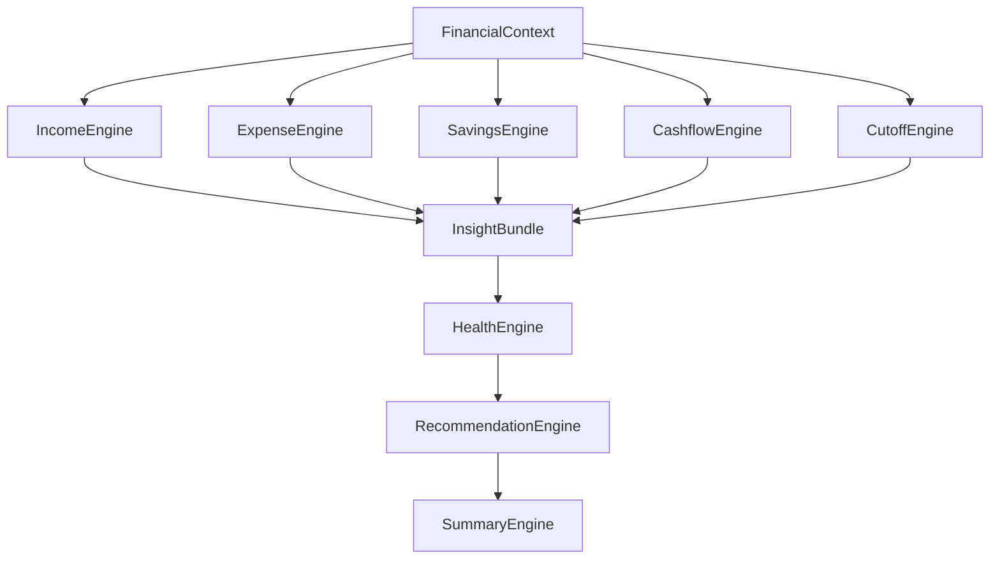
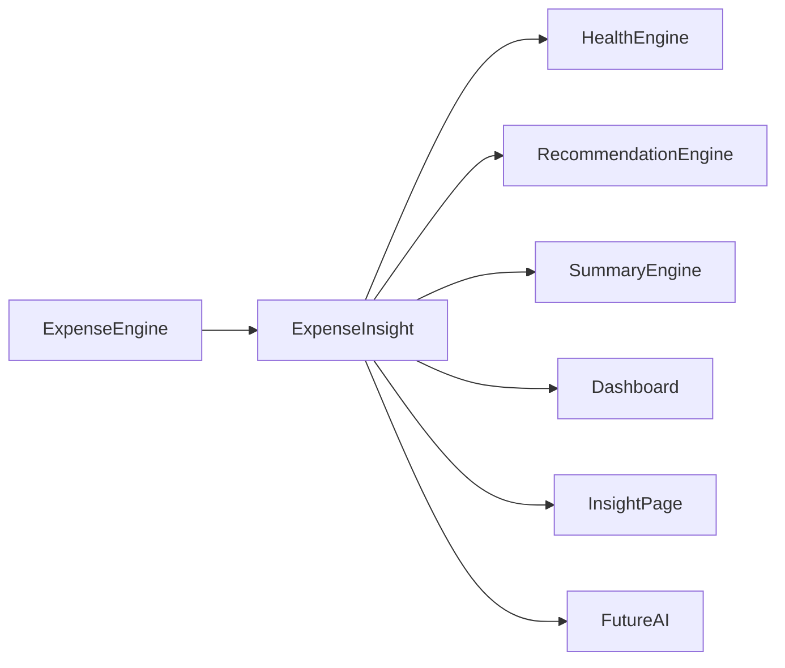
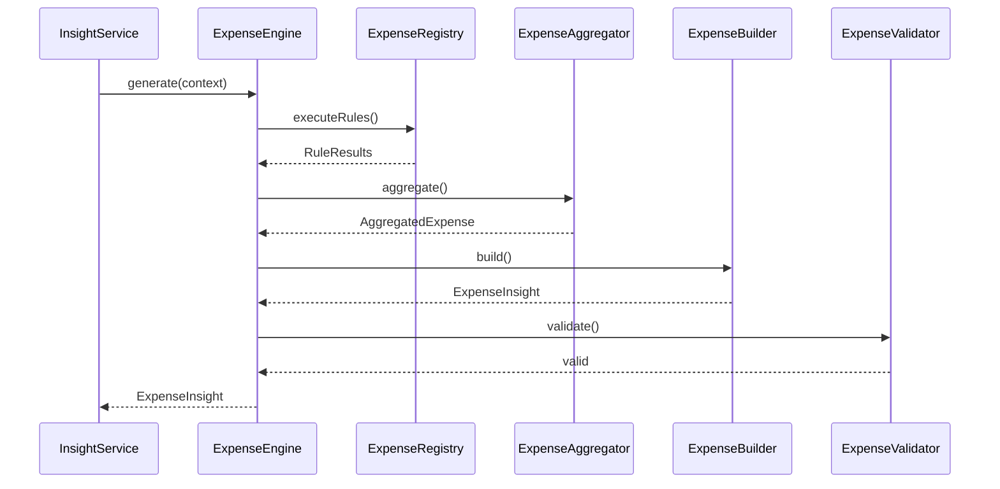
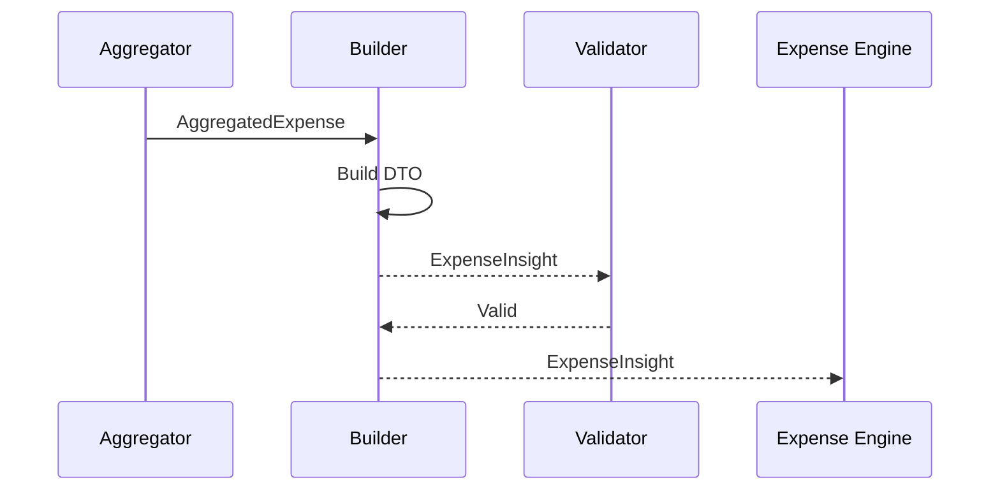
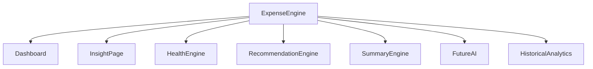
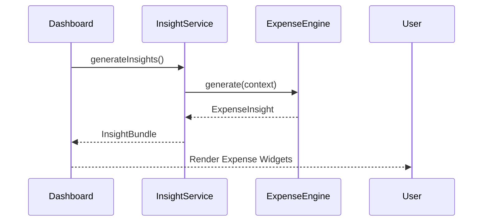
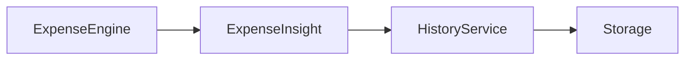
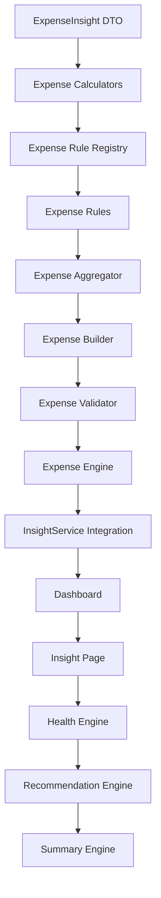

# 07 — Expense Engine Architecture

> **Document Version:** 2.0.0
> **Status:** Draft — Architecture Review Pending
>
> **Parent Documents**
>
> * 00 — PesoPilot v2.0 Source of Truth
> * 01 — Rule-Based Financial Intelligence Architecture
> * 02 — InsightBundle & Data Contracts
> * 03 — Insight Engine Architecture
> * 04 — Rule Engine Architecture
> * 05 — Health Engine Architecture
> * 06 — Income Engine Architecture
>
> **Phase**
>
> Phase 11A — Rule-Based Financial Intelligence
>
> ---
>
> ## Document Structure
>
> ### Part I
>
> **Introduction, Expense Philosophy, Responsibilities & Overall Expense Architecture**
>
> Covers:
>
> * Purpose of the Expense Engine
> * Position within the Financial Intelligence Platform
> * Expense philosophy
> * Responsibilities
> * Inputs
> * Outputs
> * Overall architecture
> * Component responsibilities
> * Relationships with other engines
> * Architecture diagrams
>
> ---
>
> ### Part II
>
> **Expense Metrics Model, Spending Analysis, Category Intelligence & Expense Health Evaluation**
>
> Covers:
>
> * Expense metrics philosophy
> * Current cutoff expenses
> * Previous cutoff comparison
> * Monthly averages
> * Expense growth
> * Expense reduction
> * Spending trend
> * Largest expense detection
> * Category distribution
> * Spending concentration
> * Budget utilization
> * Expense health evaluation
> * Metric formulas
> * Thresholds
> * Versioning
>
> ---
>
> ### Part III
>
> **Expense Rule Registry, Expense Rules, Rule Specifications & Evidence Model**
>
> Covers:
>
> * Expense Rule Registry
> * Expense Rule lifecycle
> * Expense Rules
> * Rule specifications
> * Evidence generation
> * RuleResult structure
> * Metadata
> * Registry organization
> * Rule priorities
> * Dependencies
> * Versioning
>
> Initial Rule Set:
>
> * Expense Exists Rule
> * Total Expense Rule
> * Expense Growth Rule
> * Expense Reduction Rule
> * Spending Trend Rule
> * Largest Expense Rule
> * Largest Category Rule
> * Category Distribution Rule
> * Category Concentration Rule
> * Spending Pace Rule
> * Budget Utilization Rule
> * Cutoff Comparison Rule
>
> ---
>
> ### Part IV
>
> **Expense Aggregation, ExpenseInsight DTO, Dashboard Integration & Explanation Generation**
>
> Covers:
>
> * Aggregation pipeline
> * ExpenseInsight DTO
> * Spending summaries
> * Expense explanation generation
> * Dashboard integration
> * Insight Page integration
> * Health Engine integration
> * Recommendation Engine integration
> * Summary Engine integration
> * Historical expense architecture
> * Sequence diagrams
> * Validation
>
> ---
>
> ### Part V
>
> **Testing Strategy, Historical Expense Analytics, Future Evolution, Acceptance Criteria & Implementation Roadmap**
>
> Covers:
>
> * Unit testing
> * Calculator testing
> * Aggregator testing
> * Builder testing
> * Validator testing
> * Integration testing
> * Regression testing
> * Historical expense snapshots
> * Category trend history
> * Performance targets
> * Implementation roadmap
> * ADRs
> * Acceptance Criteria
> * Document Summary
>
> ---
>
> ## Primary Output
>
> The Expense Engine produces exactly one public DTO.
>
> ```text
> ExpenseInsight
>
> ├── Current Expenses
> ├── Previous Expenses
> ├── Monthly Average
> ├── Expense Growth
> ├── Spending Trend
> ├── Largest Expense
> ├── Largest Category
> ├── Category Breakdown
> ├── Category Distribution
> ├── Spending Pace
> ├── Budget Utilization
> ├── Expense Health
> ├── Evidence
> ├── Explanation
> ├── Diagnostics
> └── Metadata
> ```
>
> This DTO becomes one component of the global **InsightBundle** defined in Document 02.
>
> ---
>
> ## Relationship with Other Engines
>
> The Expense Engine is one of the five primary Financial Intelligence Engines.
>
> ```text
> FinancialContext
> │
> ├── Income Engine
> ├── Expense Engine
> ├── Savings Engine
> ├── Cashflow Engine
> └── Cutoff Engine
>            │
>            ▼
>      Health Engine
>            │
>            ▼
>   Recommendation Engine
>            │
>            ▼
>      Summary Engine
> ```
>
> The Expense Engine is responsible only for producing deterministic spending intelligence.
>
> It never computes Health Scores, recommendations, summaries, or AI responses.
>
> ---
>
> ## Key Difference from the Income Engine
>
> While the Income Engine answers:
>
> > **"How much money came in?"**
>
> the Expense Engine answers:
>
> > **"Where did the money go, how quickly was it spent, how did spending change over time, and are spending patterns financially healthy?"**
>
> The Expense Engine is therefore expected to become the richest analytical engine in Phase 11A, because most financial coaching, budgeting insights, and future AI conversations are ultimately driven by spending behavior.
>
> ---
>
> **Next Section:** **Part I — Introduction, Expense Philosophy, Responsibilities & Overall Expense Architecture**

# 07 — Expense Engine Architecture (Part I)

> **Document Version:** 2.0.0
> **Status:** Draft — Architecture Review Pending
>
> **Parent Documents:**
>
> * `00-PesoPilot-v2.0-Source-of-Truth.md`
> * `01-Rule-Based-Financial-Intelligence-Architecture.md`
> * `02-InsightBundle-and-Data-Contracts.md`
> * `03-Insight-Engine-Architecture.md`
> * `04-Rule-Engine-Architecture.md`
> * `05-Health-Engine-Architecture.md`
> * `06-Income-Engine-Architecture.md`
>
> **Phase:** Phase 11A — Rule-Based Financial Intelligence
>
> **Section:** Introduction, Expense Philosophy, Responsibilities & Overall Expense Architecture

---

# 1. Purpose

The Expense Engine is the authoritative source of truth for all expense-related financial intelligence within PesoPilot.

While the Income Engine explains **how money enters** a user's finances, the Expense Engine explains **how money leaves**.

Its responsibilities extend far beyond computing expense totals.

The Expense Engine answers questions such as:

* How much was spent?
* Where was money spent?
* Which categories consume the largest share?
* Is spending increasing or decreasing?
* Is spending occurring too quickly within the current cutoff?
* Which spending behaviors are improving?
* Which spending behaviors require attention?

The Expense Engine transforms raw expense transactions into structured, explainable financial intelligence that powers nearly every downstream financial coaching feature.

---

# 2. Position Within the Financial Intelligence Platform

The Expense Engine is one of the five core Financial Intelligence Engines.



Unlike the Dashboard, the Expense Engine performs **all expense intelligence calculations**, while presentation layers simply consume the generated ExpenseInsight.

---

# 3. Purpose of the Expense Engine

The Expense Engine converts expense records into deterministic financial intelligence.

Its primary responsibilities include:

* calculating expense totals,
* analyzing spending trends,
* evaluating category distribution,
* identifying the largest expenses,
* detecting spending growth or reduction,
* measuring spending pace,
* evaluating budget utilization,
* determining expense health,
* generating explainable spending insights.

The Expense Engine intentionally does **not** generate financial advice.

---

# 4. Expense Philosophy

Expenses are the strongest indicator of day-to-day financial behavior.

Income provides financial capacity.

Savings represent long-term planning.

Expenses reveal financial habits.

For this reason, the Expense Engine is designed to evaluate:

* spending discipline,
* allocation patterns,
* category priorities,
* consistency,
* timing,
* sustainability.

The engine evaluates **behavior**, not merely expense amounts.

A higher expense total is not automatically unhealthy.

Likewise,

a lower expense total is not automatically healthy.

Expense intelligence must always be interpreted in context.

---

# 5. Guiding Principles

The Expense Engine follows eight architectural principles.

---

## 5.1 Deterministic Intelligence

Every ExpenseInsight generated from the same FinancialContext must be identical.

No AI.

No randomness.

No probabilistic scoring.

---

## 5.2 Explainability

Every expense observation must be supported by evidence.

Users should understand:

* where the numbers came from,
* why a trend changed,
* why a category is considered dominant,
* how spending pace was evaluated.

---

## 5.3 Behavioral Analysis

The engine evaluates financial behavior instead of isolated transactions.

One expensive purchase does not necessarily indicate unhealthy spending.

Long-term patterns carry greater importance.

---

## 5.4 Category-Centric Intelligence

Expenses gain meaning through categorization.

The Expense Engine therefore treats categories as first-class analytical entities.

Examples:

* Food
* Transportation
* Bills
* Shopping
* Emergency
* Healthcare

Most insights originate from category-level analysis.

---

## 5.5 Cutoff-Centric Evaluation

PesoPilot is built around salary cutoffs.

Therefore,

all expense intelligence uses the current cutoff as the primary evaluation period.

Historical cutoffs provide comparison only.

---

## 5.6 Local-First Intelligence

The Expense Engine operates entirely from locally stored financial records.

No banking APIs.

No receipt scanning services.

No cloud analytics.

---

## 5.7 Reusability

Every computed expense metric should be reusable by:

* Dashboard
* Insight Page
* Health Engine
* Recommendation Engine
* Summary Engine
* AI Financial Coach

Expense intelligence is computed once and consumed everywhere.

---

## 5.8 Extensibility

Future expense analysis should be added through:

* new Rules,
* new Calculators,
* new DTO fields,

rather than modifying existing architecture.

---

# 6. Responsibilities

The Expense Engine owns:

* expense totals,
* category analysis,
* spending trends,
* expense comparisons,
* category distributions,
* largest expense detection,
* spending pace,
* budget utilization,
* expense health evaluation,
* evidence generation,
* ExpenseInsight construction.

The Expense Engine does **not** own:

* savings analysis,
* cashflow calculations,
* financial health scoring,
* recommendations,
* summaries,
* AI conversations,
* persistence.

---

# 7. Inputs

The Expense Engine receives a single immutable object.

```text
FinancialContext
```

Relevant information includes:

* expense records,
* expense categories,
* current salary cutoff,
* historical cutoffs,
* budget information,
* derived financial metrics.

The Expense Engine never communicates directly with:

* repositories,
* IndexedDB,
* React,
* Zustand,
* browser APIs.

---

# 8. Outputs

The Expense Engine produces one public DTO.

```text
ExpenseInsight

├── Current Expenses

├── Previous Expenses

├── Monthly Average

├── Expense Growth

├── Spending Trend

├── Largest Expense

├── Largest Category

├── Category Breakdown

├── Category Distribution

├── Spending Pace

├── Budget Utilization

├── Expense Health

├── Evidence

├── Explanation

├── Diagnostics

└── Metadata
```

ExpenseInsight becomes part of the global InsightBundle.

---

# 9. High-Level Pipeline

```mermaid
flowchart TD

FinancialContext

↓

Expense Rule Registry

↓

Expense Rule Runner

↓

Expense RuleResults

↓

Expense Aggregator

↓

Expense Builder

↓

Expense Validator

↓

ExpenseInsight
```

The pipeline follows the generic Rule Engine Architecture defined in Document 04.

---

# 10. Internal Components

The Expense Engine consists of six primary components.

```text
Expense Engine

├── Expense Rule Registry

├── Expense Rule Runner

├── Expense Calculators

├── Expense Aggregator

├── Expense Builder

└── Expense Validator
```

Each component owns one responsibility.

---

# 11. Relationship with Other Engines

The Expense Engine produces expense intelligence for downstream consumers.



The Expense Engine never depends on:

* HealthInsight,
* Recommendation outputs,
* Summary outputs.

Dependencies remain strictly one-directional.

---

# 12. ExpenseInsight Responsibilities

ExpenseInsight answers the following business questions:

* How much was spent during the current cutoff?
* How does current spending compare to previous cutoffs?
* Which categories consume the largest share?
* Which individual expense is largest?
* Are spending habits improving or worsening?
* Is spending occurring too quickly?
* Is the current budget being utilized responsibly?
* What evidence supports these conclusions?

The DTO intentionally avoids generating financial advice.

Recommendations belong exclusively to the Recommendation Engine.

---

# 13. Overall Expense Architecture



---

# 14. Future Evolution

The Expense Engine is intentionally designed for long-term expansion.

Future capabilities may include:

* merchant-level analysis,
* recurring expense detection,
* subscription intelligence,
* discretionary vs essential spending,
* seasonal spending behavior,
* impulse purchase detection,
* inflation-aware spending analysis,
* lifestyle inflation detection,
* predictive spending forecasts.

These capabilities should integrate through additional Rules and Calculators without changing the overall architecture.

---

# 15. Architecture Decision Records

## ADR-086

### Why a Dedicated Expense Engine?

**Decision**

Expense intelligence is isolated within its own Rule Engine.

**Reason**

Keeps spending analysis modular, reusable, and independently testable.

---

## ADR-087

### Why Analyze Spending Behavior Instead of Expense Amounts?

**Decision**

The Expense Engine evaluates patterns and discipline rather than total spending alone.

**Reason**

Higher expenses are not inherently unhealthy without financial context.

---

## ADR-088

### Why Make Categories First-Class Citizens?

**Decision**

Expense categories are treated as primary analytical dimensions.

**Reason**

Most financial insights originate from category behavior rather than transaction totals.

---

## ADR-089

### Why Produce a Single ExpenseInsight DTO?

**Decision**

All expense intelligence is consolidated into one public DTO.

**Reason**

Provides a single, reusable source of truth for downstream engines.

---

## ADR-090

### Why Design for Future Spending Analytics?

**Decision**

The Expense Engine anticipates advanced behavioral analysis while preserving its architecture.

**Reason**

Allows PesoPilot to expand without introducing architectural breaking changes.

---

# 16. Acceptance Criteria

This section is complete when:

* The purpose of the Expense Engine is clearly defined.
* Expense philosophy is documented.
* Responsibilities and boundaries are established.
* Inputs and outputs are standardized.
* Internal architecture follows Document 04.
* Relationships with downstream engines are defined.
* Future extensibility is documented.
* Architecture decisions are recorded.

---

# Part I Summary

Part I establishes the conceptual foundation of the Expense Engine.

The Expense Engine is responsible for transforming raw expense transactions into deterministic, explainable spending intelligence. Rather than focusing solely on expense totals, it evaluates spending behavior through category analysis, trend detection, budget utilization, spending pace, and historical comparisons. The resulting `ExpenseInsight` becomes the authoritative source of expense intelligence for the Dashboard, Insight Page, Health Engine, Recommendation Engine, Summary Engine, and future AI Financial Coach while maintaining strict separation from presentation, persistence, and recommendation logic.

---

**End of Part I**

**Next Section:** **Part II — Expense Metrics Model, Spending Analysis, Category Intelligence & Expense Health Evaluation**

# 07 — Expense Engine Architecture (Part II)

> **Document Version:** 2.0.0
> **Status:** Draft — Architecture Review Pending
>
> **Parent Documents:**
>
> * `00-PesoPilot-v2.0-Source-of-Truth.md`
> * `01-Rule-Based-Financial-Intelligence-Architecture.md`
> * `02-InsightBundle-and-Data-Contracts.md`
> * `03-Insight-Engine-Architecture.md`
> * `04-Rule-Engine-Architecture.md`
> * `05-Health-Engine-Architecture.md`
> * `06-Income-Engine-Architecture.md`
>
> **Phase:** Phase 11A — Rule-Based Financial Intelligence
>
> **Section:** Expense Metrics Model, Spending Analysis, Category Intelligence & Expense Health Evaluation

---

# 17. Purpose

Part I established the purpose and architecture of the Expense Engine.

This section defines **how spending intelligence is measured**.

Unlike the Income Engine, which primarily evaluates financial inflow, the Expense Engine evaluates **financial outflow behavior**, making it one of the richest analytical engines in PesoPilot.

Its metrics focus on:

* spending patterns,
* category behavior,
* spending efficiency,
* budget utilization,
* financial discipline.

---

# 18. Expense Metrics Philosophy

Money leaving an account tells a richer story than money entering it.

For that reason, expense intelligence is built around answering:

> **"How is the user spending their money?"**

rather than

> **"How much did the user spend?"**

The Expense Engine evaluates spending through:

* timing,
* allocation,
* category concentration,
* trend,
* historical comparisons,
* proportional analysis.

---

# 19. Expense Intelligence Model

Expense intelligence consists of six analytical domains.

```mermaid
flowchart TD

Expense Records

-->

Expense Totals

Expense Records

-->

Category Analysis

Expense Records

-->

Trend Analysis

Expense Records

-->

Spending Pace

Expense Records

-->

Budget Utilization

Expense Records

-->

Expense Health

Expense Totals --> ExpenseInsight

Category Analysis --> ExpenseInsight

Trend Analysis --> ExpenseInsight

Spending Pace --> ExpenseInsight

Budget Utilization --> ExpenseInsight

Expense Health --> ExpenseInsight
```

Each domain is evaluated independently before aggregation.

---

# 20. Current Cutoff Expenses

The primary expense metric is the total spending within the current salary cutoff.

Formula

```text
Current Expenses

=

Σ Expenses

(Current Cutoff)
```

Example

```text
Food

₱5,200

Transportation

₱2,000

Bills

₱4,500

Shopping

₱3,000

────────────

Current Expenses

₱14,700
```

This becomes the primary expense KPI across PesoPilot.

---

# 21. Previous Cutoff Expenses

The engine calculates the previous cutoff's expense total.

Formula

```text
Previous Expenses

=

Σ Expenses

(Previous Cutoff)
```

Example

```text
Current

₱14,700

Previous

₱13,400
```

This supports trend detection.

---

# 22. Monthly Average Expenses

Monthly averages smooth short-term fluctuations.

Formula

```text
Average Expenses

=

Total Expenses

÷

Completed Cutoffs
```

Only completed cutoffs participate.

---

# 23. Expense Growth

Expense Growth measures increases in spending.

Formula

```text
Expense Growth %

=

(Current

−

Previous)

÷

Previous

×

100
```

Example

```text
Previous

₱13,000

Current

₱14,300

↓

10%
```

Growth is descriptive.

It is not automatically unhealthy.

---

# 24. Expense Reduction

The same formula also identifies reductions.

Example

```text
Previous

₱15,000

Current

₱13,500

↓

−10%
```

Reduced spending may indicate improved financial discipline,

but requires contextual evaluation.

---

# 25. Spending Trend

Trend converts numerical comparisons into human-readable classifications.

Supported values:

```text
Increasing

Stable

Decreasing

Insufficient Data
```

Trend classification follows deterministic thresholds.

---

# 26. Trend Thresholds

Phase 11A uses:

| Change            | Trend                 |
| ----------------- | --------------------- |
| ±5%               | Stable                |
| +5% to +20%       | Increasing            |
| Greater than +20% | Significant Increase  |
| -5% to -20%       | Decreasing            |
| Less than -20%    | Significant Reduction |

Future versions may refine these values.

---

# 27. Category Analysis

Category analysis is central to the Expense Engine.

Every expense belongs to one category.

Example

```text
Food

Transportation

Bills

Shopping

Emergency

Healthcare

Entertainment
```

Most expense intelligence originates from category behavior.

---

# 28. Category Totals

The engine calculates totals for every category.

Formula

```text
Category Total

=

Σ Expenses

(Category)
```

Example

```text
Food

₱5,200

Bills

₱4,500

Shopping

₱3,000
```

---

# 29. Category Distribution

Distribution measures each category's share of total spending.

Formula

```text
Category %

=

Category Total

÷

Current Expenses

×

100
```

Example

```text
Food

35%

Bills

31%

Shopping

20%

Transportation

14%
```

Distribution becomes the basis for visualization.

---

# 30. Largest Category

The engine identifies the dominant spending category.

Example

```text
Food

35%

Largest Category
```

Largest Category contributes to:

* Dashboard,
* Insight Page,
* Recommendation Engine,
* AI Financial Coach.

---

# 31. Largest Expense

Largest Category and Largest Expense are intentionally different.

Largest Category

↓

Food

Largest Expense

↓

Laptop

₱45,000

This distinction helps explain one-time purchases separately from spending patterns.

---

# 32. Category Concentration

Concentration measures dependency on one spending category.

Example

```text
Food

62%

↓

High Concentration
```

Example

```text
Food

28%

Bills

25%

Shopping

18%

Transportation

15%

Others

14%

↓

Balanced
```

High concentration is not inherently negative.

Interpretation depends on category context.

---

# 33. Spending Pace

Spending Pace evaluates how quickly money is spent during the active cutoff.

Example

```text
Cutoff Progress

40%

Expenses

70%

↓

Fast Spending Pace
```

This metric helps detect premature budget exhaustion.

---

# 34. Spending Pace Formula

Phase 11A:

```text
Spending Pace

=

Expense Utilization

−

Time Elapsed
```

Where:

```text
Expense Utilization

=

Expenses

÷

Income
```

```text
Time Elapsed

=

Elapsed Cutoff Days

÷

Total Cutoff Days
```

Positive values indicate faster-than-expected spending.

---

# 35. Budget Utilization

Budget Utilization evaluates:

```text
Expenses

÷

Allocated Budget
```

Example

```text
Budget

₱30,000

Expenses

₱21,000

↓

70%
```

Budget utilization is informative rather than punitive.

---

# 36. Budget Status

Supported classifications:

```text
Under Budget

On Track

Approaching Budget

Over Budget

Unknown
```

These statuses become reusable UI badges.

---

# 37. Expense Health Evaluation

The Expense Engine produces an internal assessment of spending quality.

It evaluates:

* spending trend,
* category balance,
* spending pace,
* budget utilization,
* historical consistency.

Like the Income Engine,

this evaluation is consumed by the Health Engine rather than exposed as an independent score.

---

# 38. Expense Health Levels

Supported levels:

```text
Excellent

Good

Fair

Needs Attention
```

These are internal classifications.

---

# 39. Missing Data Handling

The Expense Engine gracefully handles:

* zero expenses,
* one cutoff,
* uncategorized expenses,
* incomplete history.

Example

```text
Spending Trend

↓

Insufficient Data
```

rather than

```text
Increasing
```

This avoids misleading interpretations.

---

# 40. Metric Versioning

The Expense metrics model exposes:

```text
Expense Model

Version

1.0
```

Future versions may include:

* merchant behavior,
* recurring expenses,
* subscription intelligence,
* discretionary spending,
* essential spending,
* inflation adjustments,
* behavioral segmentation.

---

# 41. Architecture Decision Records

## ADR-091

### Why Make Categories the Core of Expense Intelligence?

**Decision**

Expense analysis is centered on category behavior.

**Reason**

Categories provide significantly richer financial insight than isolated transactions.

---

## ADR-092

### Why Separate Largest Category from Largest Expense?

**Decision**

Treat category dominance and transaction magnitude independently.

**Reason**

A single large purchase should not distort long-term spending patterns.

---

## ADR-093

### Why Measure Spending Pace?

**Decision**

Evaluate spending relative to cutoff progress.

**Reason**

Provides early warning signals before users exhaust their available income.

---

## ADR-094

### Why Produce Internal Expense Health?

**Decision**

Generate an internal qualitative assessment of spending behavior.

**Reason**

Allows the Health Engine to consume standardized expense intelligence without duplicating calculations.

---

## ADR-095

### Why Handle Missing Data Gracefully?

**Decision**

Unknown financial history results in "Insufficient Data" rather than negative evaluations.

**Reason**

Ensures fairness for new users and incomplete datasets.

---

# 42. Acceptance Criteria

This section is complete when:

* Expense metrics are standardized.
* Current and previous cutoff calculations are defined.
* Trend and growth calculations are documented.
* Category analysis model is established.
* Spending pace is specified.
* Budget utilization model is documented.
* Internal expense health evaluation is defined.
* Missing-data handling is documented.
* Future extensibility is addressed.

---

# Part II Summary

Part II defines the analytical model used by the Expense Engine to transform raw expense records into meaningful spending intelligence. Rather than focusing solely on expense totals, the engine evaluates spending behavior through category analysis, trend detection, concentration, spending pace, budget utilization, and historical comparisons. These deterministic metrics become the foundation of the `ExpenseInsight` DTO and provide standardized expense intelligence for the Dashboard, Health Engine, Recommendation Engine, Summary Engine, and future AI-powered financial coaching.

---

**End of Part II**

**Next Section:** **Part III — Expense Rule Registry, Expense Rules, Rule Specifications & Evidence Model**

# 07 — Expense Engine Architecture (Part III)

> **Document Version:** 2.0.0
> **Status:** Draft — Architecture Review Pending
>
> **Parent Documents:**
>
> * `00-PesoPilot-v2.0-Source-of-Truth.md`
> * `01-Rule-Based-Financial-Intelligence-Architecture.md`
> * `02-InsightBundle-and-Data-Contracts.md`
> * `03-Insight-Engine-Architecture.md`
> * `04-Rule-Engine-Architecture.md`
> * `05-Health-Engine-Architecture.md`
> * `06-Income-Engine-Architecture.md`
>
> **Phase:** Phase 11A — Rule-Based Financial Intelligence
>
> **Section:** Expense Rule Registry, Expense Rules, Rule Specifications & Evidence Model

---

# 43. Purpose

Part II defined the expense metrics that the Expense Engine exposes.

This section defines **how those metrics are generated**.

The Expense Engine does not compute spending intelligence inside one large service.

Instead, it executes a deterministic collection of Expense Rules.

Each Rule evaluates exactly one financial behavior.

Each Rule produces one RuleResult.

The Expense Aggregator combines those RuleResults into the final ExpenseInsight.

---

# 44. Expense Rule Philosophy

Each Expense Rule should answer one business question.

Examples

```text
How much was spent?

↓

CurrentExpenseTotalRule
```

```text
Which category dominates spending?

↓

LargestCategoryRule
```

```text
Is spending occurring too quickly?

↓

SpendingPaceRule
```

Expense Rules should remain:

* deterministic,
* independent,
* reusable,
* explainable,
* testable.

---

# 45. Expense Rule Registry

The Expense Engine owns one Rule Registry.

```mermaid
flowchart TD

ExpenseEngine

↓

ExpenseRuleRegistry

↓

Expense Rules

↓

RuleRunner

↓

Expense RuleResults
```

The Registry defines:

* execution order,
* priorities,
* dependencies,
* metadata,
* versions.

---

# 46. Expense Rule Categories

Expense Rules are grouped into six logical categories.

```text
Presence

Totals

Trends

Category Analysis

Budget & Pace

Expense Health
```

These categories mirror the Expense Metrics Model defined in Part II.

---

# 47. Registry Structure

```text
ExpenseRuleRegistry

├── Presence Rules

├── Total Rules

├── Trend Rules

├── Category Rules

├── Budget & Pace Rules

└── Health Rules
```

Each Rule belongs to exactly one category.

---

# 48. Presence Rules

Presence Rules determine whether sufficient expense information exists.

Phase 11A includes:

```text
ExpenseExistsRule
```

---

## ExpenseExistsRule

Business Question

```text
Does the current cutoff contain at least one expense?
```

Purpose

Prevent downstream Rules from analyzing empty datasets.

Evidence

```text
Current Cutoff

Expense Count

Expense Total
```

Possible Status

* Passed
* Failed

---

# 49. Total Rules

Total Rules calculate deterministic spending totals.

Phase 11A

```text
CurrentExpenseTotalRule

PreviousExpenseTotalRule

MonthlyAverageExpenseRule
```

---

## CurrentExpenseTotalRule

Business Question

```text
How much was spent during the current cutoff?
```

Evidence

```text
Current Cutoff

Expense Total

Transaction Count
```

---

## PreviousExpenseTotalRule

Business Question

```text
How much was spent during the previous cutoff?
```

Evidence

```text
Previous Cutoff

Expense Total
```

---

## MonthlyAverageExpenseRule

Business Question

```text
What is the average spending across completed cutoffs?
```

Evidence

```text
Completed Cutoffs

Average Expenses
```

---

# 50. Trend Rules

Trend Rules evaluate spending changes over time.

Phase 11A

```text
ExpenseGrowthRule

ExpenseReductionRule

SpendingTrendRule

CutoffComparisonRule
```

---

## ExpenseGrowthRule

Business Question

```text
Did total spending increase?
```

Evidence

```text
Current

Previous

Difference

Growth %
```

---

## ExpenseReductionRule

Business Question

```text
Did total spending decrease?
```

Evidence

```text
Current

Previous

Reduction %
```

---

## SpendingTrendRule

Business Question

```text
How should spending movement be classified?
```

Possible Results

```text
Increasing

Stable

Decreasing

Insufficient Data
```

---

## CutoffComparisonRule

Purpose

Standardize current-versus-previous cutoff comparisons.

Output

```text
Difference

Percentage

Trend
```

---

# 51. Category Rules

Category Rules analyze where money is spent.

Phase 11A

```text
CategoryBreakdownRule

LargestCategoryRule

LargestExpenseRule

CategoryDistributionRule

CategoryConcentrationRule
```

---

## CategoryBreakdownRule

Purpose

Calculate spending totals for every expense category.

Evidence

```text
Category

Amount

Percentage
```

---

## LargestCategoryRule

Business Question

```text
Which category represents the largest share of spending?
```

Example

```text
Food

34%
```

---

## LargestExpenseRule

Business Question

```text
Which individual transaction has the highest amount?
```

Example

```text
Laptop

₱52,000
```

Unlike LargestCategory,

this Rule focuses on one transaction.

---

## CategoryDistributionRule

Purpose

Calculate category percentages.

Output

```text
Category

Amount

Percentage
```

Supports:

* Dashboard charts
* Insight Page
* AI explanations

---

## CategoryConcentrationRule

Business Question

```text
Is spending overly concentrated in one category?
```

Possible Results

```text
Balanced

Moderate Concentration

High Concentration
```

---

# 52. Budget & Pace Rules

These Rules evaluate spending relative to available resources.

Phase 11A

```text
BudgetUtilizationRule

SpendingPaceRule

RemainingBudgetRule
```

---

## BudgetUtilizationRule

Business Question

```text
How much of the planned budget has been consumed?
```

Evidence

```text
Budget

Expenses

Utilization %
```

Possible Status

```text
Under Budget

On Track

Approaching Budget

Over Budget
```

---

## SpendingPaceRule

Business Question

```text
Is spending occurring too quickly relative to cutoff progress?
```

Evidence

```text
Cutoff Progress

Expense Utilization

Pace Difference
```

Possible Status

```text
Slow

Expected

Fast

Very Fast
```

---

## RemainingBudgetRule

Business Question

```text
How much budget remains?
```

Evidence

```text
Budget

Expenses

Remaining
```

---

# 53. Expense Health Rules

Expense Health summarizes overall spending behavior.

Phase 11A

```text
ExpenseHealthRule

ExpenseConsistencyRule

ExpenseDisciplineRule
```

---

## ExpenseHealthRule

Purpose

Produce an overall qualitative assessment of spending.

Possible Results

```text
Excellent

Good

Fair

Needs Attention
```

---

## ExpenseConsistencyRule

Business Question

```text
Has spending remained relatively consistent?
```

Evidence

Historical cutoff spending.

---

## ExpenseDisciplineRule

Business Question

```text
Is spending aligned with healthy financial behavior?
```

This Rule combines:

* trend,
* pace,
* budget utilization,
* concentration.

It contributes to the Health Engine.

---

# 54. Rule Specification Template

Every Expense Rule follows the same structure.

```text
Rule Name

Purpose

Business Question

Inputs

Calculator

Evidence

Severity

Priority

Output

Version
```

Future Rules must follow this specification.

---

# 55. Rule Metadata

Each Rule exposes metadata.

```text
Rule ID

Rule Name

Category

Priority

Version

Description
```

Example

```text
BudgetUtilizationRule

Category

Budget

Priority

60

Version

1.0
```

Metadata supports diagnostics and debugging.

---

# 56. Evidence Philosophy

Every Rule must produce structured evidence.

Never

```text
Largest Category

Food
```

Instead

```text
Largest Category

Food

Amount

₱5,400

Percentage

36%

Transactions

18
```

Every conclusion must be traceable.

---

# 57. Evidence Structure

Each Rule generates:

```text
Evidence

├── Title

├── Description

└── Evidence Items
```

Example

```text
Budget Utilization

Budget

₱30,000

Expenses

₱18,000

Utilization

60%
```

---

# 58. Example RuleResult

```json
{
  "ruleName": "BudgetUtilizationRule",
  "category": "Budget",
  "status": "Passed",
  "severity": "Info",
  "value": 60,
  "weight": 5,
  "evidence": {
    "budget": 30000,
    "expenses": 18000,
    "utilization": 60
  }
}
```

---

# 59. Rule Execution Order

Rules execute deterministically.

```mermaid
flowchart TD

Presence Rules

↓

Total Rules

↓

Trend Rules

↓

Category Rules

↓

Budget & Pace Rules

↓

Health Rules
```

Execution order never depends on file imports.

---

# 60. Rule Independence

Expense Rules should remain independent.

Preferred

```text
BudgetUtilizationRule

↓

FinancialContext
```

Avoid

```text
BudgetUtilizationRule

↓

CategoryDistributionRule
```

Shared calculations belong in Calculators.

---

# 61. Rule Dependencies

Where dependencies exist,

they should consume earlier RuleResults.

Example

```text
CurrentExpenseTotalRule

↓

ExpenseGrowthRule

↓

SpendingTrendRule
```

Duplicate calculations should be avoided.

---

# 62. Versioning

Every Expense Rule exposes:

```text
Rule Version

1.0
```

Future versions

```text
1.1

2.0
```

Versioning supports:

* regression testing,
* migrations,
* diagnostics,
* compatibility.

---

# 63. Future Expansion

Future Rules may include:

```text
MerchantAnalysisRule

RecurringExpenseRule

SubscriptionDetectionRule

EssentialExpenseRule

DiscretionaryExpenseRule

ImpulsePurchaseRule

LifestyleInflationRule

MerchantLoyaltyRule
```

These Rules extend the Registry without changing the Expense Engine architecture.

---

# 64. Architecture Decision Records

## ADR-096

### Why Many Specialized Rules?

**Decision**

Expense intelligence is produced through multiple focused Rules.

**Reason**

Improves modularity, explainability, and testability.

---

## ADR-097

### Why Separate Category Rules from Budget Rules?

**Decision**

Category behavior and budget utilization represent different financial dimensions.

**Reason**

Keeps Rules focused and reusable.

---

## ADR-098

### Why Require Evidence?

**Decision**

Every Expense Rule generates structured evidence.

**Reason**

Supports transparent dashboards, AI explanations, recommendations, and debugging.

---

## ADR-099

### Why Keep Rules Independent?

**Decision**

Rules should depend primarily on FinancialContext and shared Calculators.

**Reason**

Improves maintainability and enables future parallel execution.

---

## ADR-100

### Why Standardize Rule Specifications?

**Decision**

Every Expense Rule follows the same implementation contract.

**Reason**

Ensures consistency across all Financial Intelligence Engines.

---

# 65. Acceptance Criteria

This section is complete when:

* The Expense Rule Registry is defined.
* Rule categories are documented.
* Initial Phase 11A Rules are specified.
* Rule templates are standardized.
* Evidence requirements are established.
* Rule execution order is deterministic.
* Metadata and versioning are documented.
* Future Rule expansion strategy is defined.

---

# Part III Summary

Part III defines the deterministic execution model of the Expense Engine.

Rather than embedding all spending analysis within a monolithic service, the Expense Engine evaluates a structured registry of Rules covering expense totals, spending trends, category intelligence, budget utilization, spending pace, and expense health. Each Rule produces an explainable RuleResult supported by structured evidence, enabling the Expense Aggregator to construct a transparent and reusable `ExpenseInsight` that powers the Dashboard, Insight Page, Health Engine, Recommendation Engine, Summary Engine, and future AI Financial Coach.

---

**End of Part III**

**Next Section:** **Part IV — Expense Aggregation, ExpenseInsight DTO, Dashboard Integration & Explanation Generation**

# 07 — Expense Engine Architecture (Part IV)

> **Document Version:** 2.0.0
> **Status:** Draft — Architecture Review Pending
>
> **Parent Documents:**
>
> * `00-PesoPilot-v2.0-Source-of-Truth.md`
> * `01-Rule-Based-Financial-Intelligence-Architecture.md`
> * `02-InsightBundle-and-Data-Contracts.md`
> * `03-Insight-Engine-Architecture.md`
> * `04-Rule-Engine-Architecture.md`
> * `05-Health-Engine-Architecture.md`
> * `06-Income-Engine-Architecture.md`
>
> **Phase:** Phase 11A — Rule-Based Financial Intelligence
>
> **Section:** Expense Aggregation, ExpenseInsight DTO, Dashboard Integration & Explanation Generation

---

# 66. Purpose

Previous sections defined:

* the Expense Engine philosophy,
* expense metrics,
* the Expense Rule Registry,
* Rule specifications.

This section defines how individual Expense RuleResults are transformed into the public **ExpenseInsight** DTO.

The Expense Engine never exposes raw RuleResults.

Instead, RuleResults are aggregated into a comprehensive representation of the user's spending behavior.

---

# 67. Expense Aggregation Philosophy

Expense aggregation converts dozens of isolated financial observations into understandable spending intelligence.

Instead of presenting:

```text
ExpenseGrowthRule

Passed

CategoryDistributionRule

Passed

BudgetUtilizationRule

Warning
```

the engine produces:

```text
Current Spending

₱18,400

Largest Category

Food

Budget Status

On Track

Spending Pace

Slightly Fast

Expense Health

Good
```

Aggregation simplifies interpretation without sacrificing transparency.

---

# 68. High-Level Aggregation Pipeline

```mermaid
flowchart TD

Expense RuleResults

-->

Expense Aggregator

Expense Aggregator

-->

Aggregated Expense

Aggregated Expense

-->

Expense Builder

Expense Builder

-->

Expense Validator

Expense Validator

-->

ExpenseInsight
```

Aggregation, DTO construction, and validation remain separate responsibilities.

---

# 69. Expense Aggregator Responsibilities

The Expense Aggregator is responsible for:

* combining RuleResults,
* computing summary metrics,
* selecting trend classifications,
* merging category intelligence,
* evaluating spending pace,
* determining budget status,
* preparing explanation inputs,
* preparing visualization data.

The Aggregator does **not**:

* create recommendations,
* generate summaries,
* call AI,
* persist data,
* render UI.

---

# 70. Aggregation Inputs

The Aggregator receives:

```text
ExpenseRuleResult[]
```

Each RuleResult contains:

* status,
* severity,
* value,
* weight,
* evidence,
* metadata.

The Aggregator never communicates directly with repositories or services.

---

# 71. Aggregation Outputs

The Expense Aggregator produces one internal object.

```text
AggregatedExpense

├── Current Expenses

├── Previous Expenses

├── Monthly Average

├── Spending Trend

├── Largest Expense

├── Largest Category

├── Category Distribution

├── Spending Pace

├── Budget Status

├── Expense Health

├── Evidence

└── Diagnostics
```

This object exists only inside the Expense Engine.

---

# 72. Metric Aggregation

Each analytical domain is aggregated independently.

```mermaid
flowchart LR

Total Rules

-->

Expense Totals

Trend Rules

-->

Spending Trends

Category Rules

-->

Category Intelligence

Budget Rules

-->

Budget Intelligence

Health Rules

-->

Expense Health
```

This separation allows each domain to evolve independently.

---

# 73. Trend Aggregation

Trend aggregation combines:

* growth,
* reduction,
* cutoff comparison.

Example

```text
Growth

12%

↓

Trend

Increasing
```

Trend selection follows the deterministic thresholds defined in Part II.

---

# 74. Category Aggregation

Category aggregation merges:

* category totals,
* percentages,
* rankings,
* dominant category,
* concentration.

Example

```text
Food

34%

Bills

28%

Transportation

18%

Shopping

12%

Others

8%
```

↓

Largest Category

↓

Food

---

# 75. Spending Pace Aggregation

Spending Pace combines:

* cutoff progress,
* budget utilization,
* income utilization.

Example

```text
Cutoff Progress

45%

Expense Utilization

58%

↓

Spending Pace

Fast
```

Intermediate calculations are hidden from consumers.

---

# 76. Budget Aggregation

Budget intelligence merges:

* allocated budget,
* current expenses,
* utilization,
* remaining budget,
* budget status.

Example

```text
Budget

₱30,000

Expenses

₱18,000

Remaining

₱12,000

Status

On Track
```

---

# 77. Expense Health Aggregation

Expense Health combines:

* spending trend,
* budget utilization,
* spending pace,
* category balance,
* consistency.

Example

```text
Trend

Stable

Budget

Healthy

Pace

Expected

↓

Expense Health

Good
```

This internal evaluation is later consumed by the Health Engine.

---

# 78. Evidence Aggregation

Multiple Rule evidences are merged into logical sections.

Instead of exposing:

```text
LargestCategoryRule

Evidence

BudgetUtilizationRule

Evidence
```

the engine groups them.

Example

```text
Expense Overview

Current Expenses

Budget

Largest Category

Largest Expense

Spending Pace
```

Grouped evidence improves readability.

---

# 79. Explanation Generation

The Expense Engine generates deterministic explanations.

It answers:

> **"How is the user spending money?"**

Example

```text
Food remains your largest spending category this cutoff.

Overall spending increased by 9% compared to the previous cutoff.

Your spending pace is currently faster than your cutoff progress.

You remain within your planned budget.
```

Every sentence originates from RuleResults.

---

# 80. Explanation Pipeline

```mermaid
flowchart LR

RuleResults

-->

Evidence

Evidence

-->

Explanation Builder

Explanation Builder

-->

Expense Explanation
```

No AI participates in explanation generation.

---

# 81. Explanation Structure

ExpenseInsight contains:

```text
Expense Explanation

├── Spending Overview

├── Trend Summary

├── Category Summary

├── Budget Summary

├── Spending Pace Summary

└── Supporting Evidence
```

This structure is shared with downstream engines.

---

# 82. Example Explanation

```text
Your overall spending increased by 9% compared to the previous cutoff.

Food continues to represent the largest spending category, accounting for 34% of total expenses.

You remain within your planned budget, although your spending pace is currently ahead of the expected cutoff timeline.
```

Notice that the engine reports observations rather than advice.

---

# 83. ExpenseInsight DTO

The Builder converts AggregatedExpense into the public DTO.

```text
ExpenseInsight

├── Current Expenses

├── Previous Expenses

├── Monthly Average

├── Spending Trend

├── Largest Expense

├── Largest Category

├── Category Breakdown

├── Category Distribution

├── Spending Pace

├── Budget Status

├── Remaining Budget

├── Expense Health

├── Explanation

├── Evidence

├── Diagnostics

└── Metadata
```

The DTO conforms to Document 02.

---

# 84. ExpenseInsight Lifecycle



---

# 85. Validator Responsibilities

The Expense Validator verifies:

Required fields:

* current expenses,
* spending trend,
* largest category,
* spending pace,
* budget status,
* explanation,
* evidence.

It also validates:

* numeric ranges,
* percentage limits,
* enum values,
* DTO version,
* metadata.

Invalid DTOs must never reach the Dashboard.

---

# 86. Dashboard Integration

The Dashboard consumes ExpenseInsight.

```mermaid
flowchart LR

ExpenseInsight

-->

Expense KPI

ExpenseInsight

-->

Category Chart

ExpenseInsight

-->

Budget Card

ExpenseInsight

-->

Spending Pace Card

ExpenseInsight

-->

Expense Summary
```

Dashboard components never recompute expense metrics.

---

# 87. Dashboard Components

ExpenseInsight powers:

```text
Current Expenses

Largest Category

Largest Expense

Category Distribution Chart

Budget Utilization

Remaining Budget

Spending Pace

Expense Health

Expense Explanation
```

These become reusable Dashboard widgets.

---

# 88. Insight Page Integration

The Insight Page exposes additional analytical details.

```mermaid
flowchart TD

ExpenseInsight

-->

Insight Page

Insight Page

-->

Category Analysis

Insight Page

-->

Budget Analysis

Insight Page

-->

Evidence

Insight Page

-->

Rule Breakdown

Insight Page

-->

Diagnostics
```

The Insight Page provides transparency beyond the Dashboard.

---

# 89. Health Engine Integration

The Health Engine consumes:

```text
Expense Health

Budget Status

Spending Pace

Category Concentration

Spending Trend
```

The Health Engine never recalculates expense intelligence.

---

# 90. Recommendation Engine Integration

Recommendation Engine consumes:

* spending pace,
* budget utilization,
* concentration,
* category behavior,
* expense trend.

Example

```text
Spending Pace

↓

Fast

↓

Recommendation Engine

↓

Review discretionary spending
```

The Expense Engine never generates recommendations itself.

---

# 91. Summary Engine Integration

The Summary Engine consumes:

* explanation,
* trend,
* budget status,
* category analysis,
* expense health.

It converts deterministic observations into natural-language summaries.

---

# 92. AI Financial Coach Integration

Future architecture:

```mermaid
flowchart LR

ExpenseInsight

-->

Prompt Builder

-->

LLM
```

The AI receives verified spending intelligence.

It never computes expense metrics.

---

# 93. Historical Expense Architecture

Future versions may expose:

```text
Expense History

↓

Cutoff

↓

Expenses

↓

Trend

↓

Category Breakdown

↓

Explanation
```

Historical snapshots remain outside Phase 11A.

---

# 94. Diagnostics

ExpenseInsight exposes diagnostic metadata.

Example

```text
Registry Version

Model Version

Executed Rules

Execution Time

Warnings
```

Diagnostics are intended for debugging rather than end users.

---

# 95. Architecture Decision Records

## ADR-101

### Why Aggregate Before Building?

**Decision**

Expense RuleResults are aggregated before DTO construction.

**Reason**

Separates business computation from contract mapping.

---

## ADR-102

### Why Generate Deterministic Explanations?

**Decision**

Expense explanations originate exclusively from RuleResults.

**Reason**

Ensures consistency, transparency, and reproducibility.

---

## ADR-103

### Why Dashboard Uses ExpenseInsight?

**Decision**

Dashboard components consume the ExpenseInsight DTO directly.

**Reason**

Maintains a single source of truth for spending intelligence.

---

## ADR-104

### Why Separate Recommendations?

**Decision**

Expense Engine generates observations only.

**Reason**

Financial coaching belongs to the Recommendation Engine.

---

## ADR-105

### Why Design for Historical Spending?

**Decision**

ExpenseInsight anticipates future historical analytics.

**Reason**

Supports long-term financial coaching without redesigning the DTO.

---

# 96. Acceptance Criteria

This section is complete when:

* Expense aggregation is documented.
* ExpenseInsight DTO is standardized.
* Explanation generation is defined.
* Dashboard integration is documented.
* Insight Page integration is documented.
* Health, Recommendation, and Summary Engine integrations are established.
* Validation responsibilities are specified.
* Historical extensibility is documented.

---

# Part IV Summary

Part IV defines how the Expense Engine transforms individual Expense RuleResults into a complete `ExpenseInsight`. Through deterministic aggregation, structured evidence consolidation, category intelligence, budget analysis, and rule-based explanation generation, the engine produces a comprehensive representation of spending behavior. `ExpenseInsight` becomes the authoritative source of expense intelligence for the Dashboard, Insight Page, Health Engine, Recommendation Engine, Summary Engine, and future AI Financial Coach while preserving strict separation between computation, presentation, and downstream financial coaching.

---

**End of Part IV**

**Next Section:** **Part V — Testing Strategy, Historical Expense Analytics, Future Evolution, Acceptance Criteria & Implementation Roadmap**

# 07 — Expense Engine Architecture (Part V)

> **Document Version:** 2.0.0
> **Status:** Draft — Architecture Review Pending
>
> **Parent Documents:**
>
> * `00-PesoPilot-v2.0-Source-of-Truth.md`
> * `01-Rule-Based-Financial-Intelligence-Architecture.md`
> * `02-InsightBundle-and-Data-Contracts.md`
> * `03-Insight-Engine-Architecture.md`
> * `04-Rule-Engine-Architecture.md`
> * `05-Health-Engine-Architecture.md`
> * `06-Income-Engine-Architecture.md`
>
> **Phase:** Phase 11A — Rule-Based Financial Intelligence
>
> **Section:** Testing Strategy, Historical Expense Analytics, Future Evolution, Acceptance Criteria & Implementation Roadmap

---

# 97. Purpose

The previous sections defined:

* the purpose of the Expense Engine,
* the expense metrics model,
* the Expense Rule Registry,
* aggregation,
* ExpenseInsight generation.

This final section defines how the Expense Engine should be integrated, tested, evolved, and implemented within the PesoPilot Financial Intelligence Platform.

---

# 98. Expense Engine Integration Overview

The Expense Engine is a reusable analytical subsystem.

It is consumed by multiple downstream components.



The Expense Engine remains completely independent of its consumers.

---

# 99. Dashboard Integration

The Dashboard is the primary consumer of ExpenseInsight.



The Dashboard never recalculates expense metrics.

---

# 100. Dashboard Components

ExpenseInsight powers:

```text
Current Expenses Card

Largest Category Card

Largest Expense Card

Expense Trend Card

Budget Status Card

Remaining Budget Card

Spending Pace Card

Expense Health Card

Expense Explanation Card
```

Every Dashboard widget consumes ExpenseInsight directly.

---

# 101. Category Visualization

Category intelligence is visualized using:

* Donut Chart
* Pie Chart
* Horizontal Bar Chart

Example

```text
Food

34%

██████████

Bills

28%

████████

Shopping

18%

█████

Transportation

12%

███

Others

8%

██
```

Charts are presentation-only.

No calculations occur inside UI components.

---

# 102. Spending Pace Visualization

Example

```text
Current Cutoff

45%

█████████░░░░░

Expenses

61%

████████████░

Status

Fast Spending Pace
```

Visualization is derived directly from ExpenseInsight.

---

# 103. Budget Status Visualization

Example

```text
Budget

₱30,000

Expenses

₱18,000

Remaining

₱12,000

Status

On Track
```

Future versions may support:

* gauge charts,
* progress indicators,
* budget timelines.

---

# 104. Expense Explanation Card

Example

```text
Your overall spending increased by 8% compared to the previous cutoff.

Food continues to be your largest spending category.

You remain within your planned budget, although spending is occurring slightly faster than expected.
```

Every statement originates from deterministic RuleResults.

---

# 105. Insight Page Integration

The Insight Page provides significantly deeper analysis.

```mermaid
flowchart TD

ExpenseInsight

-->

InsightPage

InsightPage

-->

Category Analysis

InsightPage

-->

Budget Analysis

InsightPage

-->

Spending Pace

InsightPage

-->

Evidence

InsightPage

-->

Rule Breakdown

InsightPage

-->

Diagnostics
```

Unlike the Dashboard,

the Insight Page emphasizes transparency.

---

# 106. Historical Expense Architecture

Historical analytics are outside Phase 11A.

However,

the Expense Engine is designed to support future history.

Future structure

```text
Expense History

↓

Cutoff

↓

Expense Total

↓

Largest Category

↓

Budget Status

↓

Expense Health

↓

Explanation
```

Historical analytics consume stored ExpenseInsight snapshots.

---

# 107. Historical Category Trends

Future category intelligence includes:

```text
Food

↓

Jan

₱4,200

↓

Feb

₱4,600

↓

Mar

₱5,000

↓

Apr

₱5,800
```

This enables long-term spending behavior analysis.

---

# 108. Historical Comparisons

Future comparisons include:

```text
Current vs Previous Cutoff

Current vs Monthly Average

Largest Spending Month

Lowest Spending Month

Most Expensive Category

Category Trend History
```

These remain deterministic.

---

# 109. Historical Storage

The Expense Engine never persists history.

Instead:



Storage belongs to a dedicated subsystem.

---

# 110. Health Engine Integration

The Health Engine consumes:

```text
Expense Health

Budget Status

Category Balance

Spending Pace

Expense Trend

Category Concentration
```

The Health Engine never recomputes expense intelligence.

---

# 111. Recommendation Engine Integration

Recommendation Engine consumes:

* spending pace,
* budget utilization,
* concentration,
* category behavior,
* spending trends.

Example

```text
Budget Status

↓

Approaching Budget

↓

Recommendation Engine

↓

Reduce discretionary expenses
```

The Expense Engine remains observation-only.

---

# 112. Summary Engine Integration

The Summary Engine consumes:

* explanation,
* category analysis,
* budget status,
* spending pace,
* expense health.

Example

```text
Food remained your largest expense category this cutoff.

Overall spending increased compared to your previous salary period while remaining within your planned budget.
```

---

# 113. AI Financial Coach Integration

Future architecture:

```mermaid
flowchart LR

ExpenseInsight

-->

PromptBuilder

-->

LLM

-->

Financial Coach
```

The AI receives deterministic spending intelligence.

It never calculates expense metrics.

---

# 114. Testing Philosophy

The Expense Engine should be fully testable without:

* React,
* IndexedDB,
* Zustand,
* repositories,
* browser APIs,
* Spring Boot.

Tests operate entirely on mocked FinancialContext objects.

---

# 115. Unit Tests

Every Expense Rule requires dedicated unit tests.

Examples

```text
ExpenseExistsRule

CurrentExpenseTotalRule

LargestCategoryRule

LargestExpenseRule

CategoryDistributionRule

BudgetUtilizationRule

SpendingPaceRule

ExpenseHealthRule
```

Each Rule should verify:

* valid inputs,
* boundary conditions,
* missing data,
* edge cases,
* expected outputs.

---

# 116. Calculator Tests

Expense Calculators verify:

* totals,
* percentages,
* averages,
* category distributions,
* budget utilization,
* spending pace,
* trend calculations,
* rounding,
* division safety.

Calculators remain completely framework-independent.

---

# 117. Aggregator Tests

Aggregator tests verify:

* category aggregation,
* trend selection,
* budget calculations,
* spending pace,
* expense health,
* evidence merging,
* explanation inputs.

---

# 118. Builder Tests

Builder tests verify:

* ExpenseInsight completeness,
* DTO compatibility,
* metadata,
* explanation mapping,
* default values.

---

# 119. Validator Tests

Validator verifies:

* required fields,
* numeric ranges,
* percentages,
* enum values,
* DTO structure,
* metadata,
* diagnostics.

---

# 120. Integration Tests

Complete pipeline:

```text
FinancialContext

↓

Expense Rule Registry

↓

Expense Rules

↓

Expense Aggregator

↓

Expense Builder

↓

Expense Validator

↓

ExpenseInsight
```

Each execution should produce identical output for identical input.

---

# 121. Regression Tests

Regression tests compare generated ExpenseInsight objects against approved snapshots.

Example

```text
Expected DTO

↓

Generated DTO

↓

Comparison
```

Unexpected differences require review before release.

---

# 122. Performance Targets

Target execution time:

```text
Expense Engine

< 10 ms
```

Typical dataset:

* 2,000 expense records
* 36 salary cutoffs
* 30 categories

Performance must remain deterministic.

---

# 123. Implementation Roadmap

Recommended implementation sequence:



Every milestone concludes with:

* unit tests,
* lint,
* build,
* documentation review,
* manual verification.

---

# 124. Implementation Checklist

The Expense Engine is complete when:

```text
☑ ExpenseInsight DTO

☑ Expense Calculators

☑ Rule Registry

☑ Rule Metadata

☑ Expense Rules

☑ Expense Aggregator

☑ Expense Builder

☑ Expense Validator

☑ Expense Engine

☑ InsightService Integration

☑ Dashboard Integration

☑ Insight Page

☑ Health Engine Integration

☑ Recommendation Engine Integration

☑ Summary Engine Integration

☑ Unit Tests

☑ Integration Tests

☑ Documentation
```

---

# 125. Future Enhancements

Future versions may include:

```text
Merchant Intelligence

Recurring Expense Detection

Subscription Management

Essential vs Discretionary Classification

Lifestyle Inflation Detection

Seasonal Spending Analysis

Impulse Purchase Detection

Merchant Risk Analysis

Expense Forecasting

Smart Budget Suggestions
```

These enhancements extend the Rule Registry and Calculators without altering the Expense Engine architecture.

---

# 126. Architecture Decision Records

## ADR-106

### Why Dashboard Uses ExpenseInsight?

**Decision**

Dashboard components consume ExpenseInsight directly.

**Reason**

Maintains a single source of truth and prevents duplicate calculations.

---

## ADR-107

### Why Separate Historical Storage?

**Decision**

Historical persistence belongs to a dedicated History Service.

**Reason**

Separates analytical computation from persistence.

---

## ADR-108

### Why Snapshot Regression Tests?

**Decision**

ExpenseInsight outputs are regression tested.

**Reason**

Protects financial calculations from unintended changes.

---

## ADR-109

### Why Framework-Independent Testing?

**Decision**

Expense Engine tests avoid UI and infrastructure dependencies.

**Reason**

Provides deterministic, fast, and isolated verification.

---

## ADR-110

### Why Design for Advanced Spending Intelligence?

**Decision**

The Expense Engine is architected for future behavioral analytics.

**Reason**

Most future financial coaching capabilities depend primarily on spending behavior rather than income.

---

# 127. Final Acceptance Criteria

Document 07 is complete when:

* Expense Engine architecture is fully documented.
* Expense metrics model is finalized.
* Rule Registry is specified.
* Aggregation pipeline is documented.
* ExpenseInsight DTO is standardized.
* Dashboard integration is defined.
* Historical analytics architecture is documented.
* Testing strategy is complete.
* Implementation roadmap is established.
* Future evolution is documented.

---

# 128. Document Summary

Document 07 defines the complete architecture of the Expense Engine.

It establishes how raw expense transactions are transformed into deterministic spending intelligence through structured metrics, specialized Rule execution, category analysis, budget evaluation, spending pace analysis, aggregation, and DTO construction. The resulting `ExpenseInsight` becomes the authoritative source of expense intelligence for the Dashboard, Insight Page, Health Engine, Recommendation Engine, Summary Engine, and future AI Financial Coach while preserving a clean separation between business computation, presentation, persistence, and financial coaching.

---

# Financial Intelligence Architecture Progress

```text
████████████████████████████████████████████

✓ 00 — Source of Truth

✓ 01 — Rule-Based Financial Intelligence Architecture

✓ 02 — InsightBundle & Data Contracts

✓ 03 — Insight Engine Architecture

✓ 04 — Rule Engine Architecture

✓ 05 — Health Engine Architecture

✓ 06 — Income Engine Architecture

✓ 07 — Expense Engine Architecture

□□□□□□□□□□□□□□□□□□□□□□□□

08 — Savings & Goal Engine Architecture

09 — Cashflow & Cutoff Engine Architecture

10 — Recommendation Engine Architecture

11 — Summary Engine Architecture

□□□□□□□□□□□□□□□□□□□□□□□□

Spring Boot AI Layer

Prompt Builder

Ollama Integration

AI Financial Coach
```

---

# End of Document

**Document Status:** ✅ **Completed**

**Next Document:** **08 — Savings & Goal Engine Architecture**

**Milestone Achieved:**
The third core Financial Intelligence Engine is now fully architected. Documents **00–07** establish the platform foundation along with complete specifications for the Health, Income, and Expense Engines. Together, these engines define the deterministic core of PesoPilot's Financial Intelligence Platform and provide the analytical foundation upon which the Savings, Cashflow, Recommendation, Summary, and future AI coaching capabilities will be built.
