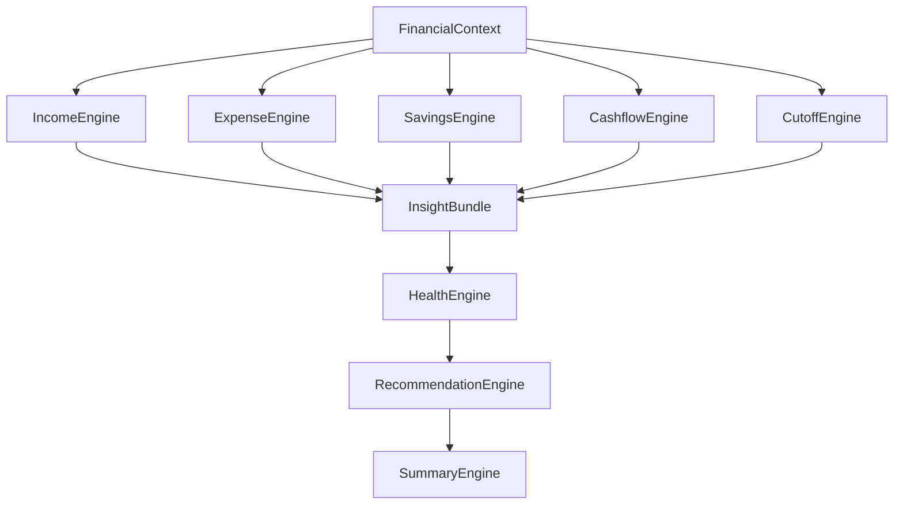
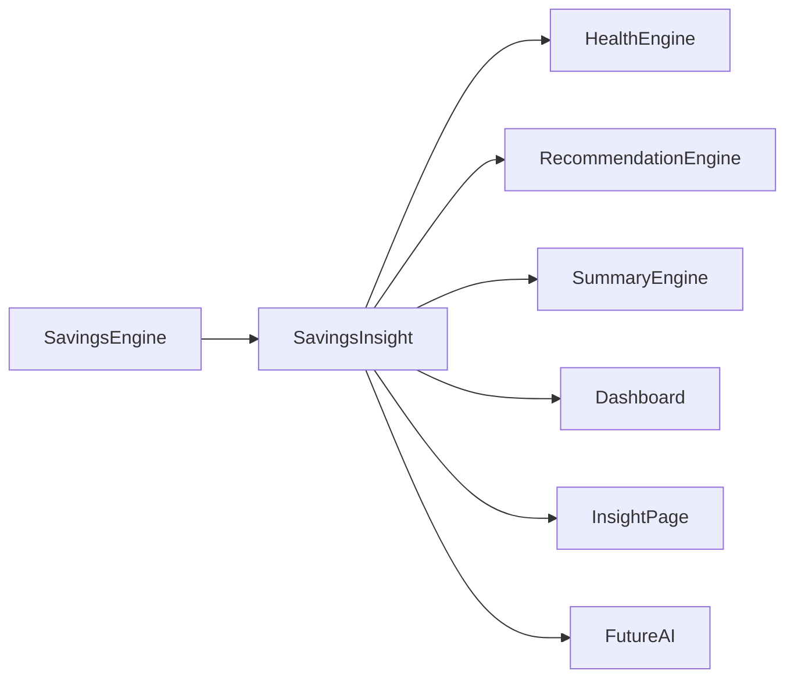
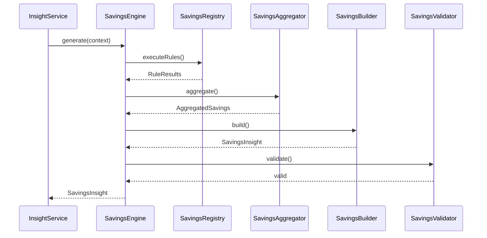
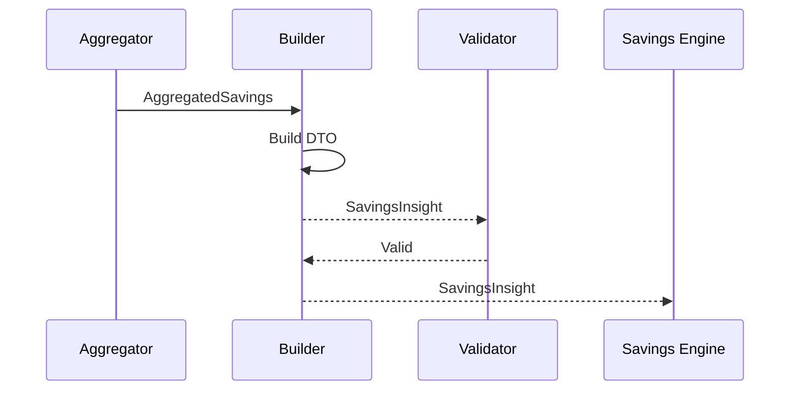
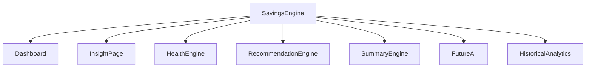
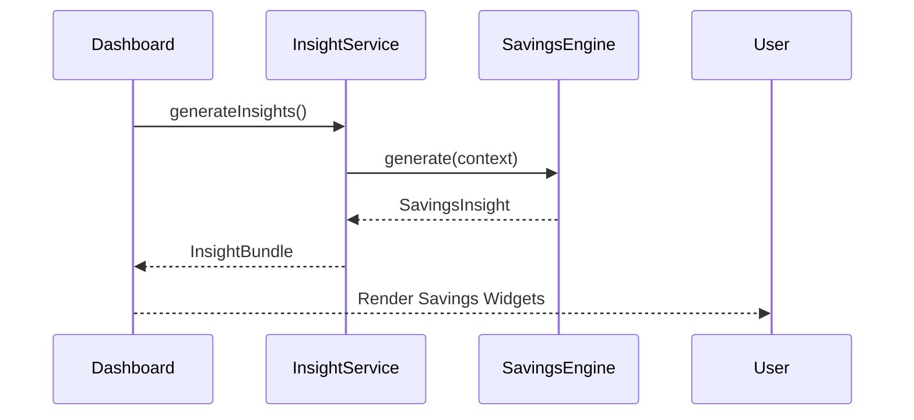
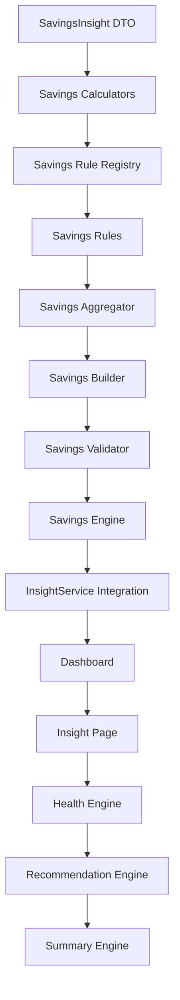

# 08 — Savings & Goal Engine Architecture

> **Document Version:** 2.0.0
> **Status:** Draft — Architecture Review Pending
>
> **Parent Documents**
>
> * 00 — PesoPilot v2.0 Source of Truth
> * 01 — Rule-Based Financial Intelligence Architecture
> * 02 — InsightBundle & Data Contracts
> * 03 — Insight Engine Architecture
> * 04 — Rule Engine Architecture
> * 05 — Health Engine Architecture
> * 06 — Income Engine Architecture
> * 07 — Expense Engine Architecture
>
> **Phase**
>
> Phase 11A — Rule-Based Financial Intelligence
>
> ---
>
> ## Document Structure
>
> ### Part I
>
> **Introduction, Savings Philosophy, Responsibilities & Overall Savings Architecture**
>
> Covers:
>
> * Purpose of the Savings Engine
> * Position within the Financial Intelligence Platform
> * Savings philosophy
> * Goal philosophy
> * Responsibilities
> * Inputs
> * Outputs
> * Overall architecture
> * Component responsibilities
> * Relationships with other engines
> * Architecture diagrams
>
> ---
>
> ### Part II
>
> **Savings Metrics Model, Goal Analysis, Contribution Intelligence & Savings Health Evaluation**
>
> Covers:
>
> * Savings metrics philosophy
> * Current cutoff savings
> * Total savings
> * Savings rate
> * Savings trend
> * Goal contribution analysis
> * Goal completion percentage
> * Goal velocity
> * Contribution consistency
> * Goal prioritization
> * Savings efficiency
> * Savings health evaluation
> * Metric formulas
> * Thresholds
> * Versioning
>
> ---
>
> ### Part III
>
> **Savings Rule Registry, Savings Rules, Goal Rules, Rule Specifications & Evidence Model**
>
> Covers:
>
> * Savings Rule Registry
> * Savings Rule lifecycle
> * Savings Rules
> * Goal Rules
> * Rule specifications
> * Evidence generation
> * RuleResult structure
> * Metadata
> * Registry organization
> * Rule priorities
> * Dependencies
> * Versioning
>
> Initial Rule Set:
>
> * Savings Exists Rule
> * Current Savings Rule
> * Total Savings Rule
> * Savings Rate Rule
> * Savings Trend Rule
> * Goal Progress Rule
> * Goal Completion Rule
> * Goal Contribution Rule
> * Goal Velocity Rule
> * Goal Consistency Rule
> * Savings Efficiency Rule
> * Savings Health Rule
>
> ---
>
> ### Part IV
>
> **Savings Aggregation, SavingsInsight DTO, Dashboard Integration & Explanation Generation**
>
> Covers:
>
> * Aggregation pipeline
> * SavingsInsight DTO
> * Goal summaries
> * Savings explanation generation
> * Dashboard integration
> * Insight Page integration
> * Health Engine integration
> * Recommendation Engine integration
> * Summary Engine integration
> * Historical savings architecture
> * Sequence diagrams
> * Validation
>
> ---
>
> ### Part V
>
> **Testing Strategy, Historical Savings Analytics, Future Evolution, Acceptance Criteria & Implementation Roadmap**
>
> Covers:
>
> * Unit testing
> * Calculator testing
> * Aggregator testing
> * Builder testing
> * Validator testing
> * Integration testing
> * Regression testing
> * Historical savings snapshots
> * Goal history
> * Contribution history
> * Performance targets
> * Implementation roadmap
> * ADRs
> * Acceptance Criteria
> * Document Summary
>
> ---
>
> ## Primary Output
>
> The Savings Engine produces exactly one public DTO.
>
> ```text
> SavingsInsight
>
> ├── Current Savings
> ├── Total Savings
> ├── Savings Rate
> ├── Savings Trend
> ├── Goal Progress
> ├── Goal Completion
> ├── Goal Velocity
> ├── Contribution Consistency
> ├── Active Goals
> ├── Goal Priorities
> ├── Savings Health
> ├── Evidence
> ├── Explanation
> ├── Diagnostics
> └── Metadata
> ```
>
> This DTO becomes one component of the global **InsightBundle** defined in Document 02.
>
> ---
>
> ## Relationship with Other Engines
>
> The Savings Engine is one of the five primary Financial Intelligence Engines.
>
> ```text
> FinancialContext
> │
> ├── Income Engine
> ├── Expense Engine
> ├── Savings Engine
> ├── Cashflow Engine
> └── Cutoff Engine
>            │
>            ▼
>      Health Engine
>            │
>            ▼
>   Recommendation Engine
>            │
>            ▼
>      Summary Engine
> ```
>
> The Savings Engine is responsible for producing deterministic savings and goal intelligence.
>
> It never computes Health Scores, recommendations, summaries, forecasts, or AI responses.
>
> ---
>
> ## Key Difference from Other Engines
>
> The Income Engine answers:
>
> > **"How much money came in?"**
>
> The Expense Engine answers:
>
> > **"Where did the money go?"**
>
> The Savings Engine answers:
>
> > **"How much wealth is being intentionally retained, how consistently is the user saving, and how effectively are they progressing toward their financial goals?"**
>
> Unlike the Income and Expense Engines, the Savings Engine introduces **goal-oriented financial intelligence**, making it the bridge between day-to-day money management and long-term financial planning.
>
> It becomes the foundation for future capabilities such as:
>
> * Goal forecasting
> * Target completion estimation
> * Financial milestone tracking
> * AI financial coaching
> * Smart goal recommendations
>
> while remaining entirely deterministic during Phase 11A.
>
> ---
>
> **Next Section:** **Part I — Introduction, Savings Philosophy, Responsibilities & Overall Savings Architecture**

# 08 — Savings & Goal Engine Architecture (Part I)

> **Document Version:** 2.0.0
> **Status:** Draft — Architecture Review Pending
>
> **Parent Documents:**
>
> * `00-PesoPilot-v2.0-Source-of-Truth.md`
> * `01-Rule-Based-Financial-Intelligence-Architecture.md`
> * `02-InsightBundle-and-Data-Contracts.md`
> * `03-Insight-Engine-Architecture.md`
> * `04-Rule-Engine-Architecture.md`
> * `05-Health-Engine-Architecture.md`
> * `06-Income-Engine-Architecture.md`
> * `07-Expense-Engine-Architecture.md`
>
> **Phase:** Phase 11A — Rule-Based Financial Intelligence
>
> **Section:** Introduction, Savings Philosophy, Responsibilities & Overall Savings Architecture

---

# 1. Purpose

The Savings & Goal Engine is the authoritative source of truth for all savings-related financial intelligence within PesoPilot.

While the:

* Income Engine explains how money is earned,
* Expense Engine explains how money is spent,

the Savings Engine explains **how wealth is intentionally retained and accumulated over time.**

Its responsibilities extend beyond computing savings totals.

The Savings Engine answers questions such as:

* How much money was saved?
* How much has been accumulated?
* Are savings improving?
* How consistent are contributions?
* Which financial goals are progressing?
* Which goals are falling behind?
* How efficiently is the user saving?

The engine transforms raw savings records into structured financial intelligence that supports long-term financial planning.

---

# 2. Position Within the Financial Intelligence Platform

The Savings Engine is one of the five core Financial Intelligence Engines.



Unlike the Savings UI,

the Savings Engine owns all financial intelligence calculations.

Presentation layers simply consume SavingsInsight.

---

# 3. Purpose of the Savings Engine

The Savings Engine converts savings records into deterministic financial intelligence.

Its primary responsibilities include:

* calculating savings totals,
* calculating savings rates,
* evaluating savings consistency,
* analyzing contribution behavior,
* tracking savings goal progress,
* evaluating contribution efficiency,
* detecting savings trends,
* producing explainable savings intelligence.

The engine intentionally avoids generating financial recommendations.

---

# 4. Savings Philosophy

Savings represent intentional financial discipline.

Income provides opportunity.

Expenses represent choices.

Savings represent commitment.

The Savings Engine therefore evaluates:

* consistency,
* discipline,
* progress,
* commitment,
* long-term planning,
* financial resilience.

Rather than rewarding large savings balances,

the engine rewards sustainable saving behavior.

---

# 5. Goal Philosophy

Savings Goals are distinct from savings transactions.

Savings answer:

> **How much has been saved?**

Goals answer:

> **Why is the user saving?**

Every Goal represents a future financial objective.

Examples include:

* Emergency Fund
* New Laptop
* House Downpayment
* Travel Fund
* Retirement
* Car Purchase
* Wedding Fund

Goals provide context that transforms savings into measurable financial progress.

---

# 6. Guiding Principles

The Savings Engine follows eight architectural principles.

---

## 6.1 Deterministic Intelligence

Savings intelligence must always produce identical results for identical FinancialContext objects.

No AI.

No probabilistic forecasting.

No randomness.

---

## 6.2 Explainability

Every savings metric must be supported by evidence.

Users should understand:

* how totals were calculated,
* how goal progress was measured,
* how savings rates were computed,
* why a goal is ahead or behind.

---

## 6.3 Goal-Oriented Intelligence

Unlike other financial domains,

Savings intelligence revolves around intentional objectives.

Goals become first-class analytical entities.

---

## 6.4 Contribution-Centric Analysis

The engine evaluates contributions rather than balances alone.

Saving ₱500 consistently every cutoff may demonstrate healthier financial behavior than saving ₱10,000 once.

---

## 6.5 Cutoff-Centric Evaluation

Savings intelligence is aligned with PesoPilot's salary cutoff model.

Current cutoff contributions receive primary attention.

Historical cutoffs provide context.

---

## 6.6 Local-First Intelligence

The Savings Engine operates entirely from locally stored financial records.

No bank synchronization.

No investment APIs.

No cloud calculations.

---

## 6.7 Reusability

Every computed savings metric should be reusable by:

* Dashboard
* Insight Page
* Health Engine
* Recommendation Engine
* Summary Engine
* AI Financial Coach

Calculations occur once.

Consumers reuse the results.

---

## 6.8 Extensibility

Future savings intelligence should be added through:

* new Rules,
* new Calculators,
* new DTO fields,

rather than changing engine architecture.

---

# 7. Responsibilities

The Savings Engine owns:

* savings totals,
* savings rates,
* contribution analysis,
* contribution consistency,
* goal tracking,
* goal completion,
* savings trends,
* savings efficiency,
* savings health,
* evidence generation,
* SavingsInsight construction.

The Savings Engine does **not** own:

* cashflow forecasting,
* recommendations,
* summaries,
* AI conversations,
* persistence,
* Health Score calculations.

---

# 8. Inputs

The Savings Engine receives one immutable object.

```text
FinancialContext
```

Relevant information includes:

* savings records,
* savings goals,
* contribution history,
* salary cutoffs,
* income records,
* derived financial metrics.

The Savings Engine never communicates directly with:

* repositories,
* IndexedDB,
* React,
* Zustand,
* browser APIs.

---

# 9. Outputs

The Savings Engine produces one public DTO.

```text
SavingsInsight

├── Current Savings

├── Total Savings

├── Savings Rate

├── Savings Trend

├── Active Goals

├── Goal Progress

├── Goal Completion

├── Goal Velocity

├── Contribution Consistency

├── Savings Health

├── Evidence

├── Explanation

├── Diagnostics

└── Metadata
```

SavingsInsight becomes one component of the global InsightBundle.

---

# 10. High-Level Pipeline

```mermaid
flowchart TD

FinancialContext

↓

Savings Rule Registry

↓

Savings Rule Runner

↓

Savings RuleResults

↓

Savings Aggregator

↓

Savings Builder

↓

Savings Validator

↓

SavingsInsight
```

The pipeline follows the standard Rule Engine Architecture established in Document 04.

---

# 11. Internal Components

The Savings Engine consists of six primary components.

```text
Savings Engine

├── Savings Rule Registry

├── Savings Rule Runner

├── Savings Calculators

├── Savings Aggregator

├── Savings Builder

└── Savings Validator
```

Each component owns one responsibility.

---

# 12. Relationship with Other Engines

The Savings Engine produces savings intelligence for downstream consumers.



Dependencies remain strictly one-directional.

The Savings Engine never consumes:

* HealthInsight,
* Recommendation outputs,
* Summary outputs.

---

# 13. SavingsInsight Responsibilities

SavingsInsight answers the following business questions.

* How much was saved during the current cutoff?
* What is the overall savings rate?
* How much total savings have been accumulated?
* Which goals are progressing?
* Which goals are completed?
* Are contributions consistent?
* Is savings behavior improving?
* What evidence supports these conclusions?

SavingsInsight intentionally avoids telling the user **what they should do**.

Recommendations belong to the Recommendation Engine.

---

# 14. Overall Savings Architecture



---

# 15. Future Evolution

The Savings Engine is intentionally designed for long-term evolution.

Future capabilities may include:

* savings forecasting,
* projected goal completion dates,
* missed contribution detection,
* emergency fund analysis,
* investment readiness analysis,
* savings streaks,
* automated milestone tracking,
* AI-assisted goal planning,
* multi-account savings analysis.

These additions integrate through new Rules and Calculators without changing the engine's architecture.

---

# 16. Architecture Decision Records

## ADR-111

### Why a Dedicated Savings Engine?

**Decision**

Savings intelligence is isolated within its own Rule Engine.

**Reason**

Separates wealth accumulation analysis from income and expense behavior while improving maintainability and reuse.

---

## ADR-112

### Why Treat Goals as First-Class Entities?

**Decision**

Savings Goals are evaluated independently from savings transactions.

**Reason**

Goals provide purpose and context that simple balances cannot represent.

---

## ADR-113

### Why Evaluate Contributions Instead of Balances Alone?

**Decision**

Contribution consistency is prioritized over accumulated balance.

**Reason**

Consistent saving behavior is a stronger indicator of long-term financial discipline.

---

## ADR-114

### Why Produce a Single SavingsInsight DTO?

**Decision**

All savings intelligence is consolidated into one public DTO.

**Reason**

Maintains a single reusable source of truth across the Financial Intelligence Platform.

---

## ADR-115

### Why Design for Future Goal Forecasting?

**Decision**

The architecture anticipates future forecasting and milestone intelligence without requiring structural redesign.

**Reason**

Allows deterministic Phase 11A functionality to evolve naturally into AI-assisted financial planning in later phases.

---

# 17. Acceptance Criteria

This section is complete when:

* The purpose of the Savings Engine is clearly defined.
* Savings philosophy is documented.
* Goal philosophy is documented.
* Responsibilities and boundaries are established.
* Inputs and outputs are standardized.
* Internal architecture follows Document 04.
* Relationships with downstream engines are defined.
* Future extensibility is documented.
* Architecture decisions are recorded.

---

# Part I Summary

Part I establishes the conceptual foundation of the Savings & Goal Engine.

The Savings Engine transforms raw savings contributions and financial goals into deterministic, explainable intelligence centered on wealth accumulation and long-term financial planning. Rather than evaluating savings balances alone, it measures contribution consistency, goal progress, savings efficiency, and financial discipline. The resulting `SavingsInsight` becomes the authoritative source of savings intelligence for the Dashboard, Insight Page, Health Engine, Recommendation Engine, Summary Engine, and future AI Financial Coach while maintaining strict separation between business computation, presentation, persistence, and financial coaching.

---

**End of Part I**

**Next Section:** **Part II — Savings Metrics Model, Goal Analysis, Contribution Intelligence & Savings Health Evaluation**

# 08 — Savings & Goal Engine Architecture (Part II)

> **Document Version:** 2.0.0
> **Status:** Draft — Architecture Review Pending
>
> **Parent Documents:**
>
> * `00-PesoPilot-v2.0-Source-of-Truth.md`
> * `01-Rule-Based-Financial-Intelligence-Architecture.md`
> * `02-InsightBundle-and-Data-Contracts.md`
> * `03-Insight-Engine-Architecture.md`
> * `04-Rule-Engine-Architecture.md`
> * `05-Health-Engine-Architecture.md`
> * `06-Income-Engine-Architecture.md`
> * `07-Expense-Engine-Architecture.md`
>
> **Phase:** Phase 11A — Rule-Based Financial Intelligence
>
> **Section:** Savings Metrics Model, Goal Analysis, Contribution Intelligence & Savings Health Evaluation

---

# 18. Purpose

Part I introduced the purpose and architecture of the Savings Engine.

This section defines **how savings intelligence is measured**.

Unlike the Income Engine, which analyzes earnings, and the Expense Engine, which analyzes spending behavior, the Savings Engine evaluates **intentional wealth accumulation**.

Its analytical model focuses on:

* saving behavior,
* contribution consistency,
* financial goal progress,
* long-term financial discipline.

---

# 19. Savings Metrics Philosophy

Saving money is not merely accumulating cash.

It represents delayed consumption for future financial security.

The Savings Engine therefore evaluates:

* commitment,
* consistency,
* discipline,
* efficiency,
* progress,
* sustainability.

Rather than rewarding users who save large amounts once,

the engine rewards users who save consistently over time.

---

# 20. Savings Intelligence Model

Savings intelligence consists of six analytical domains.

```mermaid id="nrmr52"
flowchart TD

Savings Records

-->

Savings Totals

Savings Records

-->

Contribution Analysis

Savings Records

-->

Goal Analysis

Savings Records

-->

Savings Trends

Savings Records

-->

Savings Efficiency

Savings Records

-->

Savings Health

Savings Totals --> SavingsInsight

Contribution Analysis --> SavingsInsight

Goal Analysis --> SavingsInsight

Savings Trends --> SavingsInsight

Savings Efficiency --> SavingsInsight

Savings Health --> SavingsInsight
```

Each domain is evaluated independently before aggregation.

---

# 21. Current Cutoff Savings

The primary metric is the amount saved during the active salary cutoff.

Formula

```text id="h6u61t"
Current Savings

=

Σ Savings

(Current Cutoff)
```

Example

```text id="mzxr8z"
Emergency Fund

₱2,000

Car Fund

₱1,500

Vacation

₱500

────────────

Current Savings

₱4,000
```

---

# 22. Total Savings

The engine computes accumulated savings across all completed and active cutoffs.

Formula

```text id="djl1mn"
Total Savings

=

Σ All Savings Contributions
```

Example

```text id="xshvqm"
Total Savings

₱185,500
```

This becomes the primary wealth accumulation KPI.

---

# 23. Savings Rate

Savings Rate measures the proportion of income intentionally saved.

Formula

```text id="8gk41w"
Savings Rate

=

Current Savings

÷

Current Income

×

100
```

Example

```text id="s9imjp"
Income

₱40,000

Savings

₱8,000

↓

Savings Rate

20%
```

Savings Rate becomes one of the most important inputs for the Health Engine.

---

# 24. Savings Trend

Savings Trend compares current savings against previous cutoff performance.

Supported values

```text id="31hnml"
Increasing

Stable

Decreasing

Insufficient Data
```

Trend classification follows deterministic thresholds.

---

# 25. Trend Thresholds

Phase 11A defines:

| Change            | Trend                |
| ----------------- | -------------------- |
| ±5%               | Stable               |
| +5% to +20%       | Increasing           |
| Greater than +20% | Significant Increase |
| -5% to -20%       | Decreasing           |
| Less than -20%    | Significant Decline  |

These thresholds may evolve in future versions.

---

# 26. Goal Progress

Goal Progress measures completion percentage.

Formula

```text id="eq0x9w"
Goal Progress

=

Current Goal Amount

÷

Target Amount

×

100
```

Example

```text id="vlz2zh"
Target

₱300,000

Saved

₱90,000

↓

30%
```

---

# 27. Goal Completion

Goal Completion identifies finished savings goals.

Supported Status

```text id="5pyfqb"
Not Started

In Progress

Completed
```

Future versions may introduce additional statuses.

---

# 28. Goal Velocity

Goal Velocity measures how quickly a goal is progressing.

Phase 11A evaluates:

* contribution frequency,
* contribution size,
* elapsed cutoff periods.

Example

```text id="awj91r"
Goal

Emergency Fund

Elapsed

5 Cutoffs

Saved

₱40,000

↓

Velocity

₱8,000

per Cutoff
```

Velocity is descriptive.

Forecasting remains outside Phase 11A.

---

# 29. Contribution Analysis

The Savings Engine evaluates contribution behavior.

Metrics include:

* contribution count,
* average contribution,
* largest contribution,
* smallest contribution.

Example

```text id="ubk2rz"
Contributions

12

Average

₱2,000
```

---

# 30. Contribution Consistency

Consistency measures whether savings occur regularly.

Example

```text id="b5vnwz"
Cutoff

Contribution

Jan

✔

Feb

✔

Mar

✔

Apr

✔

↓

High Consistency
```

Example

```text id="c1jp7w"
Jan

✔

Feb

✘

Mar

✘

Apr

✔

↓

Low Consistency
```

---

# 31. Contribution Frequency

Contribution Frequency measures participation.

Formula

```text id="2s3v5l"
Contribution Frequency

=

Contributing Cutoffs

÷

Completed Cutoffs
```

This metric supports consistency evaluation.

---

# 32. Goal Prioritization

The engine identifies active priorities.

Example

```text id="dl7d93"
Emergency Fund

Priority 1

Car Fund

Priority 2

Vacation

Priority 3
```

Phase 11A does not automatically reprioritize goals.

It simply reports them.

---

# 33. Savings Efficiency

Savings Efficiency evaluates how effectively income becomes savings.

Formula

```text id="bmk8o8"
Savings Efficiency

=

Savings

÷

Disposable Income
```

Where:

```text id="mfx2ca"
Disposable Income

=

Income

−

Expenses
```

This metric reflects financial discipline rather than wealth.

---

# 34. Savings Health Evaluation

The Savings Engine performs an internal qualitative assessment.

It evaluates:

* savings rate,
* contribution consistency,
* goal progress,
* savings trend,
* savings efficiency.

This evaluation contributes to the Health Engine.

---

# 35. Savings Health Levels

Supported classifications

```text id="qggu0t"
Excellent

Good

Fair

Needs Attention
```

These are internal values consumed by the Health Engine.

---

# 36. Active Goals

The engine tracks all active goals.

Example

```text id="rqotn0"
Emergency Fund

Car Fund

Travel Fund

Laptop

Wedding
```

Each goal becomes an independent analytical entity.

---

# 37. Completed Goals

Completed goals remain part of historical intelligence.

Example

```text id="f7rnt2"
Emergency Fund

Completed

March 2027
```

Historical goal completion supports future milestone analytics.

---

# 38. Goal Portfolio

The engine evaluates the user's savings portfolio.

Example

```text id="a7h8lb"
Emergency Goals

40%

Lifestyle Goals

30%

Asset Goals

20%

Education Goals

10%
```

This metric is descriptive only during Phase 11A.

---

# 39. Missing Data Handling

The Savings Engine gracefully handles:

* zero savings,
* no active goals,
* one cutoff,
* incomplete contribution history.

Example

```text id="wnfj0v"
Savings Trend

↓

Insufficient Data
```

rather than

```text id="1pbcmv"
Decreasing
```

This prevents misleading evaluations.

---

# 40. Metric Versioning

The Savings metrics model exposes:

```text id="d6v7nh"
Savings Model

Version

1.0
```

Future versions may introduce:

* forecast completion,
* contribution streaks,
* savings milestones,
* inflation-adjusted goals,
* investment readiness,
* retirement projections.

---

# 41. Architecture Decision Records

## ADR-116

### Why Prioritize Savings Rate?

**Decision**

Savings Rate becomes the primary savings metric.

**Reason**

It normalizes savings performance across different income levels.

---

## ADR-117

### Why Separate Goals from Contributions?

**Decision**

Savings Goals and Contributions are evaluated independently.

**Reason**

Goals represent intent, while contributions represent execution.

---

## ADR-118

### Why Introduce Goal Velocity?

**Decision**

Goal Velocity measures progress without forecasting.

**Reason**

Provides meaningful progress analytics while remaining deterministic.

---

## ADR-119

### Why Evaluate Savings Efficiency?

**Decision**

Savings Efficiency considers disposable income rather than total income.

**Reason**

Creates a more realistic measure of financial discipline.

---

## ADR-120

### Why Preserve Completed Goals?

**Decision**

Completed goals remain part of historical financial intelligence.

**Reason**

Supports future milestone tracking and long-term financial coaching.

---

# 42. Acceptance Criteria

This section is complete when:

* Savings metrics are standardized.
* Savings Rate formula is defined.
* Goal Progress model is documented.
* Goal Velocity is specified.
* Contribution analysis is established.
* Savings Health evaluation is documented.
* Missing-data handling is defined.
* Future extensibility is documented.

---

# Part II Summary

Part II defines the analytical model used by the Savings & Goal Engine to transform raw savings contributions and financial goals into deterministic financial intelligence. Rather than evaluating balances alone, the engine measures savings rates, contribution consistency, goal progress, goal velocity, savings efficiency, and long-term financial discipline. These metrics form the foundation of the `SavingsInsight` DTO and provide standardized savings intelligence for the Dashboard, Insight Page, Health Engine, Recommendation Engine, Summary Engine, and future AI-powered financial coaching.

---

**End of Part II**

**Next Section:** **Part III — Savings Rule Registry, Savings Rules, Goal Rules, Rule Specifications & Evidence Model**

# 08 — Savings & Goal Engine Architecture (Part III)

> **Document Version:** 2.0.0
> **Status:** Draft — Architecture Review Pending
>
> **Parent Documents:**
>
> * `00-PesoPilot-v2.0-Source-of-Truth.md`
> * `01-Rule-Based-Financial-Intelligence-Architecture.md`
> * `02-InsightBundle-and-Data-Contracts.md`
> * `03-Insight-Engine-Architecture.md`
> * `04-Rule-Engine-Architecture.md`
> * `05-Health-Engine-Architecture.md`
> * `06-Income-Engine-Architecture.md`
> * `07-Expense-Engine-Architecture.md`
>
> **Phase:** Phase 11A — Rule-Based Financial Intelligence
>
> **Section:** Savings Rule Registry, Savings Rules, Goal Rules, Rule Specifications & Evidence Model

---

# 43. Purpose

Part II defined the metrics used to evaluate savings behavior and financial goals.

This section defines **how those metrics are produced**.

Rather than embedding all savings calculations inside one service, the Savings Engine executes a deterministic collection of specialized Rules.

Each Rule evaluates one financial behavior.

Each Rule produces one RuleResult.

Those RuleResults are aggregated into the final SavingsInsight.

---

# 44. Savings Rule Philosophy

Every Savings Rule answers one business question.

Examples

```text
How much was saved?

↓

CurrentSavingsRule
```

```text
Is the savings rate healthy?

↓

SavingsRateRule
```

```text
How far has this goal progressed?

↓

GoalProgressRule
```

Rules should remain:

* deterministic,
* independent,
* reusable,
* explainable,
* testable.

---

# 45. Savings Rule Registry

The Savings Engine owns one dedicated Rule Registry.

```mermaid
flowchart TD

SavingsEngine

↓

SavingsRuleRegistry

↓

Savings Rules

↓

RuleRunner

↓

Savings RuleResults
```

The Registry defines:

* execution order,
* priorities,
* dependencies,
* metadata,
* versions.

---

# 46. Savings Rule Categories

Savings Rules are grouped into six logical categories.

```text
Presence

Savings Totals

Savings Trends

Goal Analysis

Contribution Analysis

Savings Health
```

These categories directly mirror the Savings Metrics Model.

---

# 47. Registry Structure

```text
SavingsRuleRegistry

├── Presence Rules

├── Savings Rules

├── Trend Rules

├── Goal Rules

├── Contribution Rules

└── Health Rules
```

Every Rule belongs to exactly one category.

---

# 48. Presence Rules

Presence Rules determine whether sufficient savings data exists.

Phase 11A includes:

```text
SavingsExistsRule
```

---

## SavingsExistsRule

Business Question

```text
Does the current cutoff contain at least one savings contribution?
```

Purpose

Prevent downstream Rules from evaluating empty datasets.

Evidence

```text
Savings Count

Current Cutoff

Savings Total
```

Possible Status

* Passed
* Failed

---

# 49. Savings Rules

Savings Rules calculate deterministic savings metrics.

Phase 11A

```text
CurrentSavingsRule

TotalSavingsRule

SavingsRateRule

SavingsTrendRule
```

---

## CurrentSavingsRule

Business Question

```text
How much was saved during the current cutoff?
```

Evidence

```text
Current Cutoff

Savings Total

Contribution Count
```

---

## TotalSavingsRule

Business Question

```text
How much has been accumulated across all savings records?
```

Evidence

```text
Total Savings

Contribution Count
```

---

## SavingsRateRule

Business Question

```text
What percentage of current income was saved?
```

Evidence

```text
Income

Savings

Savings Rate
```

---

## SavingsTrendRule

Business Question

```text
How is savings performance changing?
```

Possible Results

```text
Increasing

Stable

Decreasing

Insufficient Data
```

---

# 50. Goal Rules

Goal Rules evaluate progress toward financial objectives.

Phase 11A

```text
GoalProgressRule

GoalCompletionRule

GoalVelocityRule

GoalPriorityRule

ActiveGoalsRule
```

---

## GoalProgressRule

Business Question

```text
How much of each goal has been completed?
```

Evidence

```text
Goal

Target

Saved

Progress %
```

---

## GoalCompletionRule

Business Question

```text
Has this goal been completed?
```

Possible Status

```text
Not Started

In Progress

Completed
```

---

## GoalVelocityRule

Business Question

```text
How quickly is this goal progressing?
```

Evidence

```text
Elapsed Cutoffs

Saved Amount

Velocity
```

Phase 11A does **not** predict completion dates.

---

## GoalPriorityRule

Business Question

```text
Which goals should be considered active priorities?
```

Phase 11A reports stored priority only.

No automatic prioritization is performed.

---

## ActiveGoalsRule

Business Question

```text
Which savings goals are currently active?
```

Evidence

```text
Goal Count

Goal Names

Goal Status
```

---

# 51. Contribution Rules

Contribution Rules evaluate savings behavior.

Phase 11A

```text
ContributionConsistencyRule

ContributionFrequencyRule

ContributionAverageRule

LargestContributionRule

SavingsEfficiencyRule
```

---

## ContributionConsistencyRule

Business Question

```text
Are savings contributions occurring consistently?
```

Possible Results

```text
High

Moderate

Low

Unknown
```

---

## ContributionFrequencyRule

Business Question

```text
How frequently does the user contribute?
```

Evidence

```text
Completed Cutoffs

Contribution Cutoffs

Frequency
```

---

## ContributionAverageRule

Business Question

```text
What is the average savings contribution?
```

Evidence

```text
Contribution Count

Average Amount
```

---

## LargestContributionRule

Business Question

```text
What is the largest savings contribution?
```

Evidence

```text
Amount

Goal

Date
```

---

## SavingsEfficiencyRule

Business Question

```text
How efficiently is disposable income converted into savings?
```

Evidence

```text
Disposable Income

Savings

Efficiency
```

---

# 52. Savings Health Rules

Savings Health summarizes long-term savings behavior.

Phase 11A

```text
SavingsHealthRule

SavingsDisciplineRule

SavingsConsistencyRule
```

---

## SavingsHealthRule

Purpose

Produce an overall qualitative assessment of savings behavior.

Possible Results

```text
Excellent

Good

Fair

Needs Attention
```

---

## SavingsDisciplineRule

Business Question

```text
Does savings behavior demonstrate financial discipline?
```

The Rule evaluates:

* savings rate,
* contribution consistency,
* savings efficiency,
* goal participation.

---

## SavingsConsistencyRule

Business Question

```text
Has savings behavior remained consistent over time?
```

Evidence

Historical contribution history.

---

# 53. Rule Specification Template

Every Savings Rule follows the same specification.

```text
Rule Name

Purpose

Business Question

Inputs

Calculator

Evidence

Severity

Priority

Output

Version
```

Future Rules must follow this standard.

---

# 54. Rule Metadata

Each Rule exposes metadata.

```text
Rule ID

Rule Name

Category

Priority

Version

Description
```

Example

```text
SavingsRateRule

Category

Savings

Priority

40

Version

1.0
```

Metadata supports diagnostics and debugging.

---

# 55. Evidence Philosophy

Every Rule must produce structured evidence.

Never

```text
Goal Progress

32%
```

Instead

```text
Goal

Emergency Fund

Saved

₱32,000

Target

₱100,000

Progress

32%
```

Every conclusion must be traceable.

---

# 56. Evidence Structure

Each Rule generates:

```text
Evidence

├── Title

├── Description

└── Evidence Items
```

Example

```text
Savings Rate

Income

₱40,000

Savings

₱8,000

Savings Rate

20%
```

---

# 57. Example RuleResult

```json
{
  "ruleName": "SavingsRateRule",
  "category": "Savings",
  "status": "Passed",
  "severity": "Info",
  "value": 20,
  "weight": 5,
  "evidence": {
    "income": 40000,
    "savings": 8000,
    "savingsRate": 20
  }
}
```

---

# 58. Rule Execution Order

Rules execute deterministically.

```mermaid
flowchart TD

Presence Rules

↓

Savings Rules

↓

Trend Rules

↓

Goal Rules

↓

Contribution Rules

↓

Health Rules
```

Execution order never depends on filesystem or import order.

---

# 59. Rule Independence

Savings Rules should remain independent.

Preferred

```text
SavingsRateRule

↓

FinancialContext
```

Avoid

```text
SavingsRateRule

↓

GoalProgressRule
```

Shared calculations belong in Calculators.

---

# 60. Rule Dependencies

Where dependencies exist,

Rules should consume earlier RuleResults.

Example

```text
CurrentSavingsRule

↓

SavingsRateRule

↓

SavingsTrendRule
```

Duplicate calculations should be avoided.

---

# 61. Versioning

Every Savings Rule exposes:

```text
Rule Version

1.0
```

Future versions

```text
1.1

2.0
```

Versioning supports:

* diagnostics,
* regression testing,
* compatibility,
* migrations.

---

# 62. Future Expansion

Future Rules may include:

```text
GoalForecastRule

GoalDeadlineRule

SavingsStreakRule

EmergencyFundRule

RetirementReadinessRule

InvestmentReadinessRule

GoalDependencyRule

GoalRiskRule

MissedContributionRule
```

These Rules extend the Registry without changing the Savings Engine architecture.

---

# 63. Architecture Decision Records

## ADR-121

### Why Separate Savings Rules from Goal Rules?

**Decision**

Savings behavior and goal progress are evaluated independently.

**Reason**

Allows contribution intelligence and goal intelligence to evolve separately while remaining reusable.

---

## ADR-122

### Why Introduce Contribution Rules?

**Decision**

Contribution behavior is evaluated independently from balances.

**Reason**

Financial discipline is demonstrated through recurring behavior rather than accumulated totals.

---

## ADR-123

### Why Require Evidence?

**Decision**

Every Savings Rule generates structured evidence.

**Reason**

Supports Dashboard explanations, Recommendation Engine, AI coaching, and debugging.

---

## ADR-124

### Why Keep Rules Independent?

**Decision**

Rules depend primarily on FinancialContext and shared Calculators.

**Reason**

Improves modularity, maintainability, and future parallel execution.

---

## ADR-125

### Why Standardize Rule Specifications?

**Decision**

Every Savings Rule follows the same implementation contract.

**Reason**

Ensures consistency across every Financial Intelligence Engine.

---

# 64. Acceptance Criteria

This section is complete when:

* The Savings Rule Registry is defined.
* Rule categories are documented.
* Initial Phase 11A Rules are specified.
* Rule templates are standardized.
* Evidence requirements are established.
* Rule execution order is deterministic.
* Metadata and versioning are documented.
* Future Rule expansion strategy is defined.

---

# Part III Summary

Part III defines the deterministic execution model of the Savings & Goal Engine.

Rather than embedding all savings logic inside a monolithic service, the engine evaluates a structured registry of Rules covering savings totals, savings rates, trends, contribution behavior, goal analysis, and savings health. Each Rule produces an explainable RuleResult supported by structured evidence, enabling the Savings Aggregator to construct a transparent and reusable `SavingsInsight` that powers the Dashboard, Insight Page, Health Engine, Recommendation Engine, Summary Engine, and future AI Financial Coach.

---

**End of Part III**

**Next Section:** **Part IV — Savings Aggregation, SavingsInsight DTO, Dashboard Integration & Explanation Generation**

# 08 — Savings & Goal Engine Architecture (Part IV)

> **Document Version:** 2.0.0
> **Status:** Draft — Architecture Review Pending
>
> **Parent Documents:**
>
> * `00-PesoPilot-v2.0-Source-of-Truth.md`
> * `01-Rule-Based-Financial-Intelligence-Architecture.md`
> * `02-InsightBundle-and-Data-Contracts.md`
> * `03-Insight-Engine-Architecture.md`
> * `04-Rule-Engine-Architecture.md`
> * `05-Health-Engine-Architecture.md`
> * `06-Income-Engine-Architecture.md`
> * `07-Expense-Engine-Architecture.md`
>
> **Phase:** Phase 11A — Rule-Based Financial Intelligence
>
> **Section:** Savings Aggregation, SavingsInsight DTO, Dashboard Integration & Explanation Generation

---

# 65. Purpose

Previous sections defined:

* the Savings Engine philosophy,
* savings metrics,
* the Savings Rule Registry,
* Rule specifications.

This section defines how individual Savings RuleResults are transformed into the public **SavingsInsight** DTO.

The Savings Engine never exposes raw RuleResults directly.

Instead, RuleResults are aggregated into a complete representation of the user's savings behavior and financial goal progress.

---

# 66. Savings Aggregation Philosophy

Savings aggregation transforms dozens of individual financial observations into meaningful savings intelligence.

Instead of presenting:

```text
SavingsRateRule

Passed

GoalProgressRule

Passed

ContributionConsistencyRule

Warning
```

the engine produces:

```text
Current Savings

₱8,000

Savings Rate

20%

Goal Progress

32%

Contribution Consistency

High

Savings Health

Good
```

Aggregation simplifies interpretation while preserving explainability.

---

# 67. High-Level Aggregation Pipeline

```mermaid
flowchart TD

Savings RuleResults

-->

Savings Aggregator

Savings Aggregator

-->

Aggregated Savings

Aggregated Savings

-->

Savings Builder

Savings Builder

-->

Savings Validator

Savings Validator

-->

SavingsInsight
```

Aggregation, DTO construction, and validation remain separate responsibilities.

---

# 68. Savings Aggregator Responsibilities

The Savings Aggregator is responsible for:

* combining RuleResults,
* computing savings metrics,
* aggregating goal intelligence,
* evaluating contribution behavior,
* evaluating savings health,
* preparing explanation inputs,
* preparing dashboard visualization data.

The Aggregator does **not**:

* create recommendations,
* generate summaries,
* forecast goal completion,
* call AI,
* persist data,
* render UI.

---

# 69. Aggregation Inputs

The Aggregator receives:

```text
SavingsRuleResult[]
```

Each RuleResult contains:

* status,
* severity,
* value,
* weight,
* evidence,
* metadata.

The Aggregator never communicates directly with repositories or services.

---

# 70. Aggregation Outputs

The Savings Aggregator produces one internal object.

```text
AggregatedSavings

├── Current Savings

├── Total Savings

├── Savings Rate

├── Savings Trend

├── Goal Intelligence

├── Contribution Intelligence

├── Savings Health

├── Evidence

└── Diagnostics
```

This object exists only inside the Savings Engine.

---

# 71. Savings Metric Aggregation

Savings metrics are aggregated independently.

```mermaid
flowchart LR

Savings Rules

-->

Savings Metrics

Goal Rules

-->

Goal Intelligence

Contribution Rules

-->

Contribution Intelligence

Health Rules

-->

Savings Health
```

Each analytical domain evolves independently.

---

# 72. Goal Aggregation

Goal aggregation combines:

* active goals,
* completed goals,
* progress,
* contribution history,
* priorities,
* velocity.

Example

```text
Emergency Fund

32%

Car Fund

65%

Travel Fund

18%

↓

Overall Goal Progress
```

Each goal remains independently traceable.

---

# 73. Contribution Aggregation

Contribution intelligence combines:

* contribution count,
* average contribution,
* largest contribution,
* consistency,
* contribution frequency.

Example

```text
Average Contribution

₱2,500

Consistency

High

Largest Contribution

₱10,000
```

Intermediate calculations remain hidden.

---

# 74. Savings Health Aggregation

Savings Health combines:

* savings rate,
* contribution consistency,
* savings trend,
* savings efficiency,
* goal participation.

Example

```text
Savings Rate

20%

Consistency

High

Trend

Increasing

↓

Savings Health

Good
```

This internal evaluation becomes input for the Health Engine.

---

# 75. Goal Portfolio Aggregation

The Savings Engine aggregates all goals into a portfolio overview.

Example

```text
Active Goals

5

Completed Goals

2

Average Progress

41%

Highest Progress

Emergency Fund

Lowest Progress

Travel Fund
```

This becomes the foundation for future goal analytics.

---

# 76. Evidence Aggregation

Multiple Rule evidences are merged into logical sections.

Instead of exposing:

```text
SavingsRateRule

Evidence

GoalProgressRule

Evidence
```

the engine groups them.

Example

```text
Savings Overview

Current Savings

Savings Rate

Goal Progress

Contribution History

Savings Health
```

Grouped evidence improves readability.

---

# 77. Explanation Generation

The Savings Engine generates deterministic explanations.

It answers:

> **"How effectively is the user saving money and progressing toward financial goals?"**

Example

```text
You saved 20% of your income during the current cutoff.

Your Emergency Fund has reached 32% of its target.

Savings contributions have remained consistent across recent cutoffs.

Overall savings behavior is improving.
```

Every sentence originates from RuleResults.

---

# 78. Explanation Pipeline

```mermaid
flowchart LR

RuleResults

-->

Evidence

Evidence

-->

Explanation Builder

Explanation Builder

-->

Savings Explanation
```

No AI participates in explanation generation.

---

# 79. Explanation Structure

SavingsInsight contains:

```text
Savings Explanation

├── Savings Overview

├── Savings Trend

├── Goal Summary

├── Contribution Summary

├── Savings Health Summary

└── Supporting Evidence
```

This structure is shared with downstream engines.

---

# 80. Example Explanation

```text
You saved ₱8,000 during the current salary cutoff, representing 20% of your income.

Your Emergency Fund continues to make steady progress and is now 32% complete.

Savings contributions have remained consistent across recent cutoffs, indicating disciplined saving behavior.
```

Notice that the engine reports observations rather than advice.

---

# 81. SavingsInsight DTO

The Builder converts AggregatedSavings into the public DTO.

```text
SavingsInsight

├── Current Savings

├── Total Savings

├── Savings Rate

├── Savings Trend

├── Active Goals

├── Goal Progress

├── Goal Completion

├── Goal Velocity

├── Contribution Consistency

├── Savings Health

├── Explanation

├── Evidence

├── Diagnostics

└── Metadata
```

The DTO conforms to Document 02.

---

# 82. SavingsInsight Lifecycle



---

# 83. Validator Responsibilities

The Savings Validator verifies:

Required fields:

* current savings,
* total savings,
* savings rate,
* goal progress,
* contribution consistency,
* explanation,
* evidence.

It also validates:

* numeric ranges,
* percentages,
* enum values,
* DTO version,
* metadata.

Invalid DTOs must never reach the Dashboard.

---

# 84. Dashboard Integration

The Dashboard consumes SavingsInsight.

```mermaid
flowchart LR

SavingsInsight

-->

Savings KPI

SavingsInsight

-->

Goal Progress

SavingsInsight

-->

Savings Rate

SavingsInsight

-->

Goal Cards

SavingsInsight

-->

Savings Summary
```

Dashboard components never recompute savings metrics.

---

# 85. Dashboard Components

SavingsInsight powers:

```text
Current Savings

Savings Rate

Goal Progress

Goal Completion

Contribution Consistency

Savings Health

Goal Portfolio

Savings Explanation
```

These become reusable Dashboard widgets.

---

# 86. Insight Page Integration

The Insight Page exposes more detailed savings intelligence.

```mermaid
flowchart TD

SavingsInsight

-->

Insight Page

Insight Page

-->

Goal Analysis

Insight Page

-->

Contribution Analysis

Insight Page

-->

Evidence

Insight Page

-->

Rule Breakdown

Insight Page

-->

Diagnostics
```

The Insight Page provides analytical transparency beyond the Dashboard.

---

# 87. Health Engine Integration

The Health Engine consumes:

```text
Savings Health

Savings Rate

Contribution Consistency

Savings Trend

Savings Efficiency

Goal Progress
```

The Health Engine never recalculates savings intelligence.

---

# 88. Recommendation Engine Integration

Recommendation Engine consumes:

* savings rate,
* goal progress,
* contribution consistency,
* savings efficiency,
* active goals.

Example

```text
Savings Rate

↓

8%

↓

Recommendation Engine

↓

Increase recurring savings contributions
```

The Savings Engine never generates recommendations.

---

# 89. Summary Engine Integration

The Summary Engine consumes:

* explanation,
* savings trend,
* goal progress,
* contribution behavior,
* savings health.

It converts deterministic observations into natural-language summaries.

---

# 90. AI Financial Coach Integration

Future architecture:

```mermaid
flowchart LR

SavingsInsight

-->

Prompt Builder

-->

LLM
```

The AI receives verified savings intelligence.

It never computes savings metrics.

---

# 91. Historical Savings Architecture

Future versions may expose:

```text
Savings History

↓

Cutoff

↓

Savings

↓

Savings Rate

↓

Goal Progress

↓

Contribution Consistency

↓

Explanation
```

Historical snapshots remain outside Phase 11A.

---

# 92. Goal History Architecture

Each goal maintains independent historical intelligence.

Example

```text
Emergency Fund

↓

Jan

12%

↓

Feb

18%

↓

Mar

25%

↓

Apr

32%
```

This becomes the basis for future forecasting.

---

# 93. Diagnostics

SavingsInsight exposes diagnostic metadata.

Example

```text
Registry Version

Model Version

Executed Rules

Execution Time

Warnings
```

Diagnostics are intended for debugging rather than presentation.

---

# 94. Architecture Decision Records

## ADR-126

### Why Aggregate Before Building?

**Decision**

Savings RuleResults are aggregated before DTO construction.

**Reason**

Separates business computation from contract mapping.

---

## ADR-127

### Why Generate Deterministic Explanations?

**Decision**

Savings explanations originate exclusively from RuleResults.

**Reason**

Ensures transparency, consistency, and reproducibility.

---

## ADR-128

### Why Dashboard Uses SavingsInsight?

**Decision**

Dashboard components consume SavingsInsight directly.

**Reason**

Maintains a single source of truth for savings intelligence.

---

## ADR-129

### Why Separate Recommendations?

**Decision**

Savings Engine generates observations only.

**Reason**

Financial coaching belongs exclusively to the Recommendation Engine.

---

## ADR-130

### Why Design for Goal History?

**Decision**

SavingsInsight anticipates future goal history and forecasting.

**Reason**

Supports long-term financial coaching without redesigning the DTO.

---

# 95. Acceptance Criteria

This section is complete when:

* Savings aggregation is documented.
* SavingsInsight DTO is standardized.
* Explanation generation is defined.
* Dashboard integration is documented.
* Insight Page integration is documented.
* Health, Recommendation, and Summary Engine integrations are established.
* Validation responsibilities are specified.
* Historical extensibility is documented.

---

# Part IV Summary

Part IV defines how the Savings & Goal Engine transforms individual Savings RuleResults into a complete `SavingsInsight`. Through deterministic aggregation, structured evidence consolidation, goal intelligence, contribution analysis, and rule-based explanation generation, the engine produces a comprehensive representation of wealth accumulation and financial goal progress. `SavingsInsight` becomes the authoritative source of savings intelligence for the Dashboard, Insight Page, Health Engine, Recommendation Engine, Summary Engine, and future AI Financial Coach while preserving strict separation between computation, presentation, and downstream financial coaching.

---

**End of Part IV**

**Next Section:** **Part V — Testing Strategy, Historical Savings Analytics, Future Evolution, Acceptance Criteria & Implementation Roadmap**

# 08 — Savings & Goal Engine Architecture (Part V)

> **Document Version:** 2.0.0
> **Status:** Draft — Architecture Review Pending
>
> **Parent Documents:**
>
> * `00-PesoPilot-v2.0-Source-of-Truth.md`
> * `01-Rule-Based-Financial-Intelligence-Architecture.md`
> * `02-InsightBundle-and-Data-Contracts.md`
> * `03-Insight-Engine-Architecture.md`
> * `04-Rule-Engine-Architecture.md`
> * `05-Health-Engine-Architecture.md`
> * `06-Income-Engine-Architecture.md`
> * `07-Expense-Engine-Architecture.md`
>
> **Phase:** Phase 11A — Rule-Based Financial Intelligence
>
> **Section:** Testing Strategy, Historical Savings Analytics, Future Evolution, Acceptance Criteria & Implementation Roadmap

---

# 96. Purpose

The previous sections defined:

* the purpose of the Savings Engine,
* the Savings Metrics Model,
* the Savings Rule Registry,
* aggregation,
* SavingsInsight generation.

This final section defines how the Savings Engine should be integrated, tested, evolved, and implemented within the PesoPilot Financial Intelligence Platform.

---

# 97. Savings Engine Integration Overview

The Savings Engine is a reusable analytical subsystem.

It is consumed by multiple downstream components.



The Savings Engine remains completely independent of its consumers.

---

# 98. Dashboard Integration

The Dashboard is the primary consumer of SavingsInsight.



The Dashboard never recalculates savings metrics.

---

# 99. Dashboard Components

SavingsInsight powers:

```text
Current Savings Card

Total Savings Card

Savings Rate Card

Savings Trend Card

Goal Progress Cards

Contribution Consistency Card

Savings Health Card

Savings Explanation Card
```

Every Dashboard widget consumes SavingsInsight directly.

---

# 100. Goal Progress Visualization

Example

```text
Emergency Fund

████████░░░░░░░░░░

32%

Target

₱100,000

Saved

₱32,000
```

Progress bars visualize data already contained inside SavingsInsight.

---

# 101. Goal Portfolio Visualization

Example

```text
Active Goals

5

Completed Goals

2

Average Progress

41%

Highest Progress

Emergency Fund
```

The UI remains presentation-only.

---

# 102. Contribution Visualization

Example

```text
Current Cutoff

₱8,000

Average Contribution

₱2,500

Contribution Count

4

Consistency

High
```

No calculations occur inside Dashboard components.

---

# 103. Savings Explanation Card

Example

```text
You saved 20% of your income during this salary cutoff.

Your Emergency Fund has reached 32% of its target.

Savings contributions have remained consistent across recent salary periods.
```

Every statement originates from deterministic RuleResults.

---

# 104. Insight Page Integration

The Insight Page provides deeper savings intelligence.

```mermaid
flowchart TD

SavingsInsight

-->

InsightPage

InsightPage

-->

Goal Portfolio

InsightPage

-->

Contribution Analytics

InsightPage

-->

Savings Trends

InsightPage

-->

Evidence

InsightPage

-->

Rule Breakdown

InsightPage

-->

Diagnostics
```

Unlike the Dashboard,

the Insight Page prioritizes transparency.

---

# 105. Historical Savings Architecture

Historical analytics are outside Phase 11A.

However,

the Savings Engine is designed to support future history.

Future structure

```text
Savings History

↓

Cutoff

↓

Savings

↓

Savings Rate

↓

Savings Health

↓

Explanation
```

Historical analytics consume stored SavingsInsight snapshots.

---

# 106. Goal History

Each savings goal maintains independent historical intelligence.

Example

```text
Emergency Fund

↓

Jan

12%

↓

Feb

18%

↓

Mar

25%

↓

Apr

32%
```

Historical Goal Progress enables future forecasting.

---

# 107. Contribution History

Contribution analytics preserve long-term savings behavior.

Example

```text
Jan

₱2,000

↓

Feb

₱2,500

↓

Mar

₱2,000

↓

Apr

₱3,500
```

Future engines can evaluate:

* contribution streaks,
* missed contributions,
* saving habits.

---

# 108. Historical Comparisons

Future comparisons include:

```text
Current vs Previous Cutoff

Current vs Monthly Average

Goal Progress History

Contribution History

Best Savings Month

Longest Savings Streak

Largest Contribution

Goal Completion Timeline
```

These remain deterministic.

---

# 109. Historical Storage

The Savings Engine never persists history.

Instead:


Persistence remains outside the engine.

---

# 110. Health Engine Integration

The Health Engine consumes:

```text
Savings Health

Savings Rate

Savings Trend

Contribution Consistency

Savings Efficiency

Goal Progress
```

The Health Engine never recalculates savings intelligence.

---

# 111. Recommendation Engine Integration

Recommendation Engine consumes:

* savings rate,
* contribution consistency,
* goal progress,
* savings efficiency,
* active goals.

Example

```text
Contribution Consistency

↓

Low

↓

Recommendation Engine

↓

Establish recurring savings contributions
```

The Savings Engine remains observation-only.

---

# 112. Summary Engine Integration

The Summary Engine consumes:

* explanation,
* savings trend,
* goal progress,
* contribution analysis,
* savings health.

Example

```text
Your savings rate improved this salary cutoff while your Emergency Fund continued making steady progress.

Savings contributions remained consistent across recent cutoffs.
```

---

# 113. AI Financial Coach Integration

Future architecture:

```mermaid
flowchart LR

SavingsInsight

-->

PromptBuilder

-->

LLM

-->

Financial Coach
```

The AI receives deterministic savings intelligence.

It never computes savings metrics.

---

# 114. Testing Philosophy

The Savings Engine should be fully testable without:

* React,
* IndexedDB,
* Zustand,
* repositories,
* browser APIs,
* Spring Boot.

Tests operate entirely on mocked FinancialContext objects.

---

# 115. Unit Tests

Every Savings Rule requires dedicated unit tests.

Examples

```text
SavingsExistsRule

CurrentSavingsRule

SavingsRateRule

GoalProgressRule

GoalVelocityRule

ContributionConsistencyRule

SavingsEfficiencyRule

SavingsHealthRule
```

Each Rule should verify:

* valid inputs,
* boundary conditions,
* missing data,
* edge cases,
* expected outputs.

---

# 116. Calculator Tests

Savings Calculators verify:

* savings totals,
* savings rates,
* averages,
* goal progress,
* contribution consistency,
* contribution frequency,
* savings efficiency,
* rounding,
* division safety.

Calculators remain completely framework-independent.

---

# 117. Aggregator Tests

Aggregator tests verify:

* goal aggregation,
* contribution aggregation,
* savings trend selection,
* savings health,
* evidence merging,
* explanation inputs.

---

# 118. Builder Tests

Builder tests verify:

* SavingsInsight completeness,
* DTO compatibility,
* metadata,
* explanation mapping,
* default values.

---

# 119. Validator Tests

Validator verifies:

* required fields,
* numeric ranges,
* percentages,
* enum values,
* DTO structure,
* metadata,
* diagnostics.

---

# 120. Integration Tests

Complete pipeline:

```text
FinancialContext

↓

Savings Rule Registry

↓

Savings Rules

↓

Savings Aggregator

↓

Savings Builder

↓

Savings Validator

↓

SavingsInsight
```

Each execution should produce identical output for identical input.

---

# 121. Regression Tests

Regression tests compare generated SavingsInsight objects against approved snapshots.

Example

```text
Expected DTO

↓

Generated DTO

↓

Comparison
```

Unexpected differences require review before release.

---

# 122. Performance Targets

Target execution time:

```text
Savings Engine

< 8 ms
```

Typical dataset:

* 1,000 savings contributions
* 100 active/completed goals
* 36 salary cutoffs

Performance must remain deterministic.

---

# 123. Implementation Roadmap

Recommended implementation sequence:



Every milestone concludes with:

* unit tests,
* lint,
* build,
* documentation review,
* manual verification.

---

# 124. Implementation Checklist

The Savings Engine is complete when:

```text
☑ SavingsInsight DTO

☑ Savings Calculators

☑ Rule Registry

☑ Rule Metadata

☑ Savings Rules

☑ Goal Rules

☑ Contribution Rules

☑ Savings Aggregator

☑ Savings Builder

☑ Savings Validator

☑ Savings Engine

☑ InsightService Integration

☑ Dashboard Integration

☑ Insight Page

☑ Health Engine Integration

☑ Recommendation Engine Integration

☑ Summary Engine Integration

☑ Unit Tests

☑ Integration Tests

☑ Documentation
```

---

# 125. Future Enhancements

Future versions may include:

```text
Goal Completion Forecasting

Savings Streak Detection

Missed Contribution Detection

Emergency Fund Readiness

Retirement Readiness

Investment Readiness

Inflation-Adjusted Goals

Goal Dependency Analysis

Automatic Goal Prioritization

Milestone Celebrations

AI Goal Planning
```

These enhancements extend the Rule Registry and Calculators without altering the Savings Engine architecture.

---

# 126. Architecture Decision Records

## ADR-131

### Why Dashboard Uses SavingsInsight?

**Decision**

Dashboard components consume SavingsInsight directly.

**Reason**

Maintains a single source of truth and prevents duplicate calculations.

---

## ADR-132

### Why Separate Historical Storage?

**Decision**

Historical persistence belongs to a dedicated History Service.

**Reason**

Separates analytical computation from persistence.

---

## ADR-133

### Why Snapshot Regression Tests?

**Decision**

SavingsInsight outputs are regression tested.

**Reason**

Protects financial calculations from unintended changes.

---

## ADR-134

### Why Framework-Independent Testing?

**Decision**

Savings Engine tests avoid UI and infrastructure dependencies.

**Reason**

Provides deterministic, fast, and isolated verification.

---

## ADR-135

### Why Design for Future Goal Intelligence?

**Decision**

The Savings Engine is architected for future forecasting and long-term financial planning.

**Reason**

Goal-based intelligence is expected to become one of PesoPilot's primary differentiators in future AI-powered financial coaching.

---

# 127. Final Acceptance Criteria

Document 08 is complete when:

* Savings Engine architecture is fully documented.
* Savings Metrics Model is finalized.
* Rule Registry is specified.
* Aggregation pipeline is documented.
* SavingsInsight DTO is standardized.
* Dashboard integration is defined.
* Historical analytics architecture is documented.
* Testing strategy is complete.
* Implementation roadmap is established.
* Future evolution is documented.

---

# 128. Document Summary

Document 08 defines the complete architecture of the Savings & Goal Engine.

It establishes how raw savings contributions and financial goals are transformed into deterministic savings intelligence through structured metrics, specialized Rule execution, goal analysis, contribution analysis, aggregation, and DTO construction. The resulting `SavingsInsight` becomes the authoritative source of savings intelligence for the Dashboard, Insight Page, Health Engine, Recommendation Engine, Summary Engine, and future AI Financial Coach while preserving a clean separation between business computation, presentation, persistence, and financial coaching.

---

# Financial Intelligence Architecture Progress

```text
████████████████████████████████████████████████

✓ 00 — Source of Truth

✓ 01 — Rule-Based Financial Intelligence Architecture

✓ 02 — InsightBundle & Data Contracts

✓ 03 — Insight Engine Architecture

✓ 04 — Rule Engine Architecture

✓ 05 — Health Engine Architecture

✓ 06 — Income Engine Architecture

✓ 07 — Expense Engine Architecture

✓ 08 — Savings & Goal Engine Architecture

□□□□□□□□□□□□□□□□□□□□□□□□

09 — Cashflow & Cutoff Engine Architecture

10 — Recommendation Engine Architecture

11 — Summary Engine Architecture

□□□□□□□□□□□□□□□□□□□□□□□□

Spring Boot AI Layer

Prompt Builder

Ollama Integration

AI Financial Coach
```

---

# End of Document

**Document Status:** ✅ **Completed**

**Next Document:** **09 — Cashflow & Cutoff Engine Architecture**

**Milestone Achieved:**
The fourth core Financial Intelligence Engine is now fully architected. Documents **00–08** now define the platform foundation together with complete specifications for the **Health**, **Income**, **Expense**, and **Savings & Goal** Engines. These engines collectively model how money is earned, spent, retained, and directed toward financial goals, providing the deterministic intelligence required for the upcoming **Cashflow & Cutoff Engine**, which will unify these outputs into a comprehensive view of the user's financial position and salary-cycle behavior.
