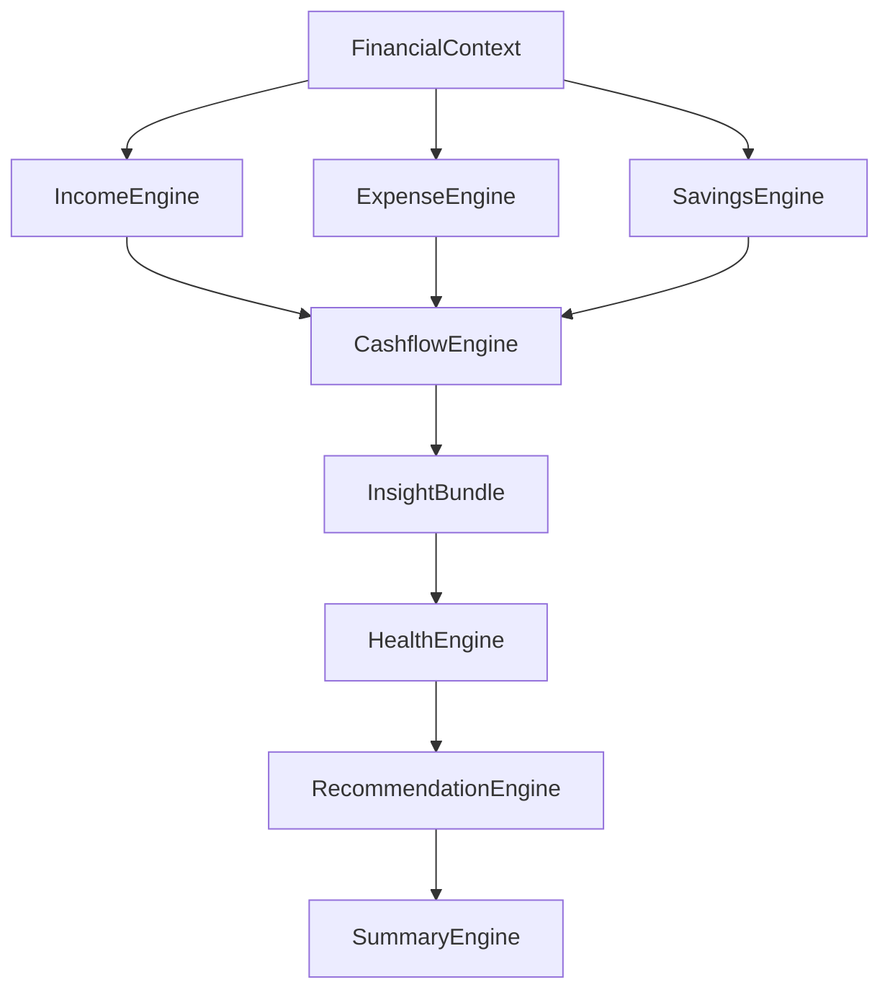
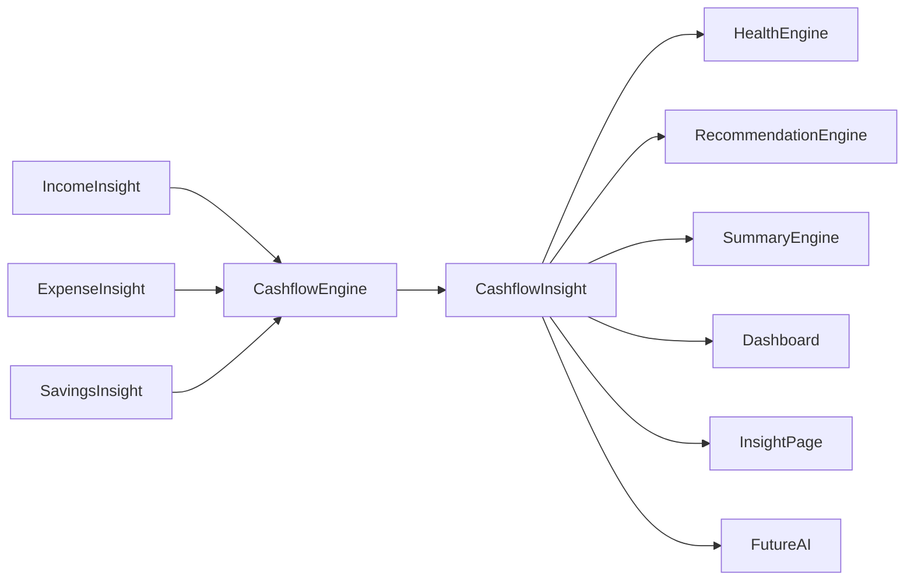
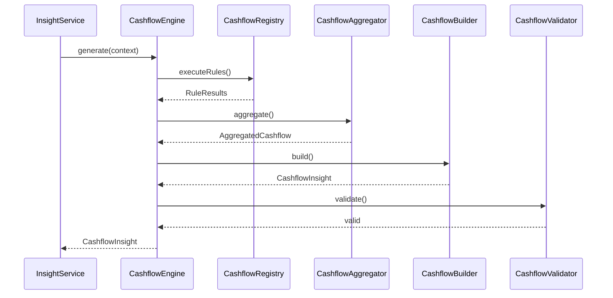
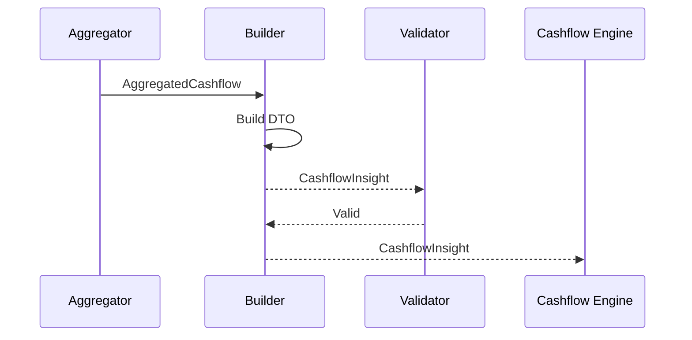
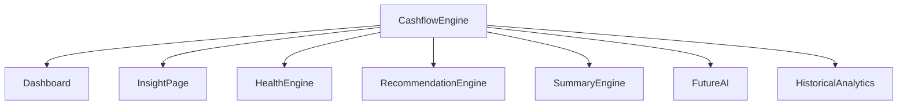
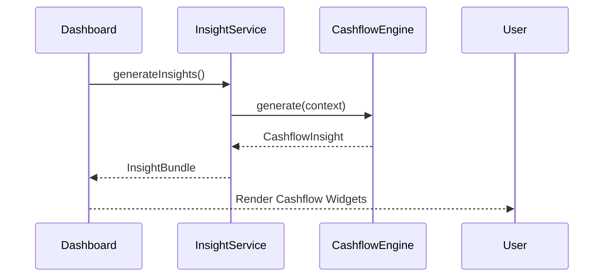

# 09 — Cashflow & Cutoff Engine Architecture

> **Document Version:** 2.0.0
> **Status:** Draft — Architecture Review Pending
>
> **Parent Documents**
>
> * 00 — PesoPilot v2.0 Source of Truth
> * 01 — Rule-Based Financial Intelligence Architecture
> * 02 — InsightBundle & Data Contracts
> * 03 — Insight Engine Architecture
> * 04 — Rule Engine Architecture
> * 05 — Health Engine Architecture
> * 06 — Income Engine Architecture
> * 07 — Expense Engine Architecture
> * 08 — Savings & Goal Engine Architecture
>
> **Phase**
>
> Phase 11A — Rule-Based Financial Intelligence
>
> ---
>
> ## Document Structure
>
> ### Part I
>
> **Introduction, Cashflow Philosophy, Cutoff Philosophy, Responsibilities & Overall Cashflow Architecture**
>
> Covers:
>
> * Purpose of the Cashflow Engine
> * Position within the Financial Intelligence Platform
> * Cashflow philosophy
> * Salary cutoff philosophy
> * Responsibilities
> * Inputs
> * Outputs
> * Overall architecture
> * Component responsibilities
> * Relationships with other engines
> * Architecture diagrams
>
> ---
>
> ### Part II
>
> **Cashflow Metrics Model, Cutoff Analysis, Remaining Money Intelligence & Cashflow Health Evaluation**
>
> Covers:
>
> * Cashflow metrics philosophy
> * Current cutoff income
> * Current cutoff expenses
> * Current cutoff savings
> * Remaining cash
> * Remaining daily budget
> * Remaining weekly budget
> * Cutoff utilization
> * Time utilization
> * Spending pace
> * Cash burn rate
> * Financial runway
> * Cutoff health evaluation
> * Metric formulas
> * Thresholds
> * Versioning
>
> ---
>
> ### Part III
>
> **Cashflow Rule Registry, Cashflow Rules, Cutoff Rules, Rule Specifications & Evidence Model**
>
> Covers:
>
> * Cashflow Rule Registry
> * Cashflow Rule lifecycle
> * Cashflow Rules
> * Cutoff Rules
> * Rule specifications
> * Evidence generation
> * RuleResult structure
> * Metadata
> * Registry organization
> * Rule priorities
> * Dependencies
> * Versioning
>
> **Initial Rule Set**
>
> * CashflowExistsRule
> * CurrentIncomeRule
> * CurrentExpenseRule
> * CurrentSavingsRule
> * RemainingCashRule
> * RemainingDailyBudgetRule
> * RemainingWeeklyBudgetRule
> * CashflowTrendRule
> * CashBurnRateRule
> * CutoffUtilizationRule
> * TimeUtilizationRule
> * RunwayRule
> * CutoffHealthRule
>
> ---
>
> ### Part IV
>
> **Cashflow Aggregation, CashflowInsight DTO, Dashboard Integration & Explanation Generation**
>
> Covers:
>
> * Aggregation pipeline
> * CashflowInsight DTO
> * Remaining cash summary
> * Cashflow explanation generation
> * Dashboard integration
> * Insight Page integration
> * Health Engine integration
> * Recommendation Engine integration
> * Summary Engine integration
> * Historical cashflow architecture
> * Sequence diagrams
> * Validation
>
> ---
>
> ### Part V
>
> **Testing Strategy, Historical Cashflow Analytics, Future Evolution, Acceptance Criteria & Implementation Roadmap**
>
> Covers:
>
> * Unit testing
> * Calculator testing
> * Aggregator testing
> * Builder testing
> * Validator testing
> * Integration testing
> * Regression testing
> * Historical cutoff snapshots
> * Cashflow history
> * Salary-cycle history
> * Performance targets
> * Implementation roadmap
> * ADRs
> * Acceptance Criteria
> * Document Summary
>
> ---
>
> ## Primary Output
>
> The Cashflow Engine produces exactly one public DTO.
>
> ```text
> CashflowInsight
>
> ├── Current Income
> ├── Current Expenses
> ├── Current Savings
> ├── Remaining Cash
> ├── Remaining Daily Budget
> ├── Remaining Weekly Budget
> ├── Cashflow Trend
> ├── Cash Burn Rate
> ├── Cutoff Utilization
> ├── Time Utilization
> ├── Financial Runway
> ├── Cutoff Health
> ├── Evidence
> ├── Explanation
> ├── Diagnostics
> └── Metadata
> ```
>
> This DTO becomes one component of the global **InsightBundle** defined in Document 02.
>
> ---
>
> ## Relationship with Other Engines
>
> The Cashflow Engine is the **integration engine** of the Financial Intelligence Platform.
>
> ```text
>                     FinancialContext
>                           │
>      ┌────────────────────┼────────────────────┐
>      │                    │                    │
>      ▼                    ▼                    ▼
> Income Engine      Expense Engine      Savings Engine
>      │                    │                    │
>      └──────────────┬─────┴──────────────┬────┘
>                     ▼
>           Cashflow & Cutoff Engine
>                     │
>                     ▼
>              Health Engine
>                     │
>                     ▼
>         Recommendation Engine
>                     │
>                     ▼
>             Summary Engine
> ```
>
> Unlike the previous engines, the Cashflow Engine **depends on outputs from Income, Expense, and Savings calculations** to evaluate the user's current financial position.
>
> It remains deterministic and never produces recommendations or summaries.
>
> ---
>
> ## Key Difference from Other Engines
>
> The Income Engine answers:
>
> > **"How much money came in?"**
>
> The Expense Engine answers:
>
> > **"Where did the money go?"**
>
> The Savings Engine answers:
>
> > **"How much wealth is being intentionally retained?"**
>
> The Cashflow Engine answers:
>
> > **"Given today's salary cycle, how much money remains, how quickly is it being consumed, and is the user likely to finish the current cutoff in a healthy financial position?"**
>
> The Cashflow Engine therefore becomes the **operational center** of PesoPilot.
>
> Nearly every real-time dashboard card, salary countdown widget, cutoff summary, and future AI conversation will ultimately depend on `CashflowInsight`.
>
> ---
>
> **Next Section:** **Part I — Introduction, Cashflow Philosophy, Cutoff Philosophy, Responsibilities & Overall Cashflow Architecture**

# 09 — Cashflow & Cutoff Engine Architecture (Part I)

> **Document Version:** 2.0.0
> **Status:** Draft — Architecture Review Pending
>
> **Parent Documents:**
>
> * `00-PesoPilot-v2.0-Source-of-Truth.md`
> * `01-Rule-Based-Financial-Intelligence-Architecture.md`
> * `02-InsightBundle-and-Data-Contracts.md`
> * `03-Insight-Engine-Architecture.md`
> * `04-Rule-Engine-Architecture.md`
> * `05-Health-Engine-Architecture.md`
> * `06-Income-Engine-Architecture.md`
> * `07-Expense-Engine-Architecture.md`
> * `08-Savings-&-Goal-Engine-Architecture.md`
>
> **Phase:** Phase 11A — Rule-Based Financial Intelligence
>
> **Section:** Introduction, Cashflow Philosophy, Cutoff Philosophy, Responsibilities & Overall Cashflow Architecture

---

# 1. Purpose

The Cashflow & Cutoff Engine is the operational center of PesoPilot's Financial Intelligence Platform.

While the previous engines analyze individual financial domains—

* Income,
* Expenses,
* Savings,

—the Cashflow Engine combines them into one real-time representation of the user's financial position within the current salary cycle.

It answers questions such as:

* How much money remains?
* How much can the user safely spend today?
* Is spending occurring too quickly?
* Is the user likely to finish the current cutoff with money remaining?
* Is the current salary period financially healthy?
* How much financial runway is left?

The engine transforms independent financial observations into a unified understanding of the user's day-to-day financial state.

---

# 2. Position Within the Financial Intelligence Platform

The Cashflow Engine is the integration layer of the deterministic intelligence platform.



Unlike the other Financial Engines,

Cashflow combines outputs from multiple domains before producing CashflowInsight.

---

# 3. Purpose of the Cashflow Engine

The Cashflow Engine converts financial activity into operational financial intelligence.

Its primary responsibilities include:

* calculating remaining cash,
* calculating remaining daily budget,
* calculating remaining weekly budget,
* evaluating cutoff utilization,
* evaluating spending pace,
* evaluating cash burn rate,
* calculating financial runway,
* determining cutoff health,
* generating explainable cashflow intelligence.

The Cashflow Engine intentionally avoids generating advice.

Recommendations belong to the Recommendation Engine.

---

# 4. Cashflow Philosophy

Cashflow represents financial movement.

Income creates financial capacity.

Expenses consume financial capacity.

Savings preserve financial capacity.

Cashflow evaluates the relationship between all three.

The objective is not to maximize savings or minimize expenses.

Instead,

the objective is to maintain healthy financial movement throughout an entire salary cycle.

---

# 5. Cutoff Philosophy

PesoPilot is fundamentally built around salary cutoffs rather than calendar months.

Traditional budgeting assumes:

```text
Monthly Income

↓

Monthly Expenses

↓

Monthly Budget
```

PesoPilot instead evaluates:

```text
Salary Cutoff

↓

Income

↓

Expenses

↓

Savings

↓

Remaining Cash

↓

Next Payday
```

The cutoff is therefore the primary financial evaluation period throughout the application.

---

# 6. Guiding Principles

The Cashflow Engine follows eight architectural principles.

---

## 6.1 Real-Time Financial Position

The engine continuously evaluates the user's financial position within the active salary cutoff.

Rather than describing historical activity alone,

it answers:

> **"Where does the user financially stand today?"**

---

## 6.2 Deterministic Intelligence

Cashflow calculations must always produce identical outputs for identical FinancialContext objects.

No AI.

No probabilistic forecasting.

No randomness.

---

## 6.3 Explainability

Every CashflowInsight must explain:

* why remaining cash has its current value,
* why spending pace is considered healthy or unhealthy,
* why cutoff utilization changed,
* why financial runway increased or decreased.

Every metric must be traceable.

---

## 6.4 Cutoff-Centric Evaluation

Every cashflow metric revolves around the active salary cutoff.

Examples:

* Remaining Cash
* Remaining Days
* Remaining Budget
* Cutoff Utilization
* Spending Pace

Monthly calculations are secondary.

---

## 6.5 Operational Intelligence

Unlike Income or Savings,

Cashflow represents operational decision-making.

It answers questions users ask daily.

Examples:

> Can I still spend today?

> How much can I safely spend before payday?

> Am I spending too quickly?

---

## 6.6 Local-First Intelligence

The Cashflow Engine operates entirely on locally stored financial data.

No banking APIs.

No cloud synchronization.

No external financial services.

---

## 6.7 Reusability

Every computed cashflow metric should be reusable by:

* Dashboard
* Insight Page
* Health Engine
* Recommendation Engine
* Summary Engine
* AI Financial Coach

Calculations occur once.

Consumers reuse them.

---

## 6.8 Extensibility

Future cashflow intelligence should be introduced through:

* new Rules,
* new Calculators,
* new DTO fields,

rather than redesigning engine architecture.

---

# 7. Responsibilities

The Cashflow Engine owns:

* remaining cash,
* remaining daily budget,
* remaining weekly budget,
* cutoff utilization,
* time utilization,
* spending pace,
* burn rate,
* financial runway,
* cutoff health,
* evidence generation,
* CashflowInsight construction.

The Cashflow Engine does **not** own:

* savings analysis,
* expense categorization,
* income analysis,
* Health Score calculation,
* recommendations,
* summaries,
* persistence,
* AI conversations.

---

# 8. Inputs

The Cashflow Engine receives one immutable object.

```text
FinancialContext
```

Relevant information includes:

* income intelligence,
* expense intelligence,
* savings intelligence,
* salary cutoff information,
* current date,
* cutoff duration,
* derived financial metrics.

The Cashflow Engine never communicates directly with:

* repositories,
* IndexedDB,
* React,
* Zustand,
* browser APIs.

---

# 9. Outputs

The Cashflow Engine produces one public DTO.

```text
CashflowInsight

├── Current Income

├── Current Expenses

├── Current Savings

├── Remaining Cash

├── Remaining Daily Budget

├── Remaining Weekly Budget

├── Cashflow Trend

├── Cash Burn Rate

├── Cutoff Utilization

├── Time Utilization

├── Financial Runway

├── Cutoff Health

├── Evidence

├── Explanation

├── Diagnostics

└── Metadata
```

CashflowInsight becomes one component of the global InsightBundle.

---

# 10. High-Level Pipeline

```mermaid
flowchart TD

FinancialContext

↓

Income Metrics

↓

Expense Metrics

↓

Savings Metrics

↓

Cashflow Rule Registry

↓

Cashflow Rule Runner

↓

Cashflow RuleResults

↓

Cashflow Aggregator

↓

Cashflow Builder

↓

Cashflow Validator

↓

CashflowInsight
```

Unlike the previous engines,

Cashflow builds upon existing financial intelligence before producing its own analysis.

---

# 11. Internal Components

The Cashflow Engine consists of six primary components.

```text
Cashflow Engine

├── Cashflow Rule Registry

├── Cashflow Rule Runner

├── Cashflow Calculators

├── Cashflow Aggregator

├── Cashflow Builder

└── Cashflow Validator
```

Each component owns exactly one responsibility.

---

# 12. Relationship with Other Engines

The Cashflow Engine depends on the deterministic outputs produced by the previous engines.



The dependency direction is strictly one-way.

Cashflow never modifies or recalculates IncomeInsight, ExpenseInsight, or SavingsInsight.

---

# 13. CashflowInsight Responsibilities

CashflowInsight answers the following business questions.

* How much money remains?
* How much can safely be spent today?
* How much can safely be spent this week?
* How quickly is money being consumed?
* How far through the salary cutoff is the user?
* How much financial runway remains?
* Is the current salary cycle healthy?
* What evidence supports these conclusions?

CashflowInsight intentionally avoids financial coaching.

Advice belongs exclusively to the Recommendation Engine.

---

# 14. Overall Cashflow Architecture



---

# 15. Future Evolution

The Cashflow Engine is intentionally designed for long-term expansion.

Future capabilities may include:

* payday countdown intelligence,
* projected end-of-cutoff balance,
* overspending prediction,
* negative cashflow prediction,
* cashflow forecasting,
* salary cycle simulations,
* unexpected expense resilience,
* dynamic spending recommendations,
* AI cashflow coaching,
* financial runway forecasting.

These capabilities should integrate through additional Rules and Calculators without changing the architecture.

---

# 16. Architecture Decision Records

## ADR-136

### Why Create a Dedicated Cashflow Engine?

**Decision**

Cashflow intelligence is isolated within its own Rule Engine.

**Reason**

Cashflow represents the integration of multiple financial domains and deserves independent architecture.

---

## ADR-137

### Why Make Salary Cutoffs the Primary Evaluation Period?

**Decision**

Cashflow evaluates salary cycles instead of calendar months.

**Reason**

Most users make spending decisions relative to payday rather than month boundaries.

---

## ADR-138

### Why Separate Cashflow from Expense Intelligence?

**Decision**

Cashflow consumes ExpenseInsight but remains a separate engine.

**Reason**

Spending analysis and operational financial position are different business concerns.

---

## ADR-139

### Why Produce a Single CashflowInsight DTO?

**Decision**

All cashflow intelligence is consolidated into one reusable DTO.

**Reason**

Provides one authoritative operational view for every downstream consumer.

---

## ADR-140

### Why Design for Future Forecasting?

**Decision**

The architecture anticipates predictive cashflow capabilities while remaining deterministic in Phase 11A.

**Reason**

Future AI coaching will depend heavily on operational cashflow intelligence.

---

# 17. Acceptance Criteria

This section is complete when:

* The purpose of the Cashflow Engine is clearly defined.
* Cashflow philosophy is documented.
* Cutoff philosophy is documented.
* Responsibilities and boundaries are established.
* Inputs and outputs are standardized.
* Internal architecture follows Document 04.
* Relationships with downstream engines are defined.
* Future extensibility is documented.
* Architecture decisions are recorded.

---

# Part I Summary

Part I establishes the conceptual foundation of the Cashflow & Cutoff Engine.

The Cashflow Engine transforms income, expenses, savings, and salary cutoff information into deterministic operational financial intelligence. Rather than analyzing individual financial domains, it evaluates the user's real-time financial position by measuring remaining cash, spending pace, cutoff utilization, burn rate, financial runway, and overall cutoff health. The resulting `CashflowInsight` becomes the authoritative operational view consumed by the Dashboard, Insight Page, Health Engine, Recommendation Engine, Summary Engine, and future AI Financial Coach while maintaining strict separation between business computation, presentation, persistence, and financial coaching.

---

**End of Part I**

**Next Section:** **Part II — Cashflow Metrics Model, Cutoff Analysis, Remaining Money Intelligence & Cashflow Health Evaluation**

# 09 — Cashflow & Cutoff Engine Architecture (Part II)

> **Document Version:** 2.0.0
> **Status:** Draft — Architecture Review Pending
>
> **Parent Documents:**
>
> * `00-PesoPilot-v2.0-Source-of-Truth.md`
> * `01-Rule-Based-Financial-Intelligence-Architecture.md`
> * `02-InsightBundle-and-Data-Contracts.md`
> * `03-Insight-Engine-Architecture.md`
> * `04-Rule-Engine-Architecture.md`
> * `05-Health-Engine-Architecture.md`
> * `06-Income-Engine-Architecture.md`
> * `07-Expense-Engine-Architecture.md`
> * `08-Savings-&-Goal-Engine-Architecture.md`
>
> **Phase:** Phase 11A — Rule-Based Financial Intelligence
>
> **Section:** Cashflow Metrics Model, Cutoff Analysis, Remaining Money Intelligence & Cashflow Health Evaluation

---

# 18. Purpose

Part I introduced the philosophy and responsibilities of the Cashflow & Cutoff Engine.

This section defines **how operational financial intelligence is measured**.

Unlike the previous Financial Intelligence Engines, which analyze a single domain, the Cashflow Engine evaluates **the interaction between income, expenses, savings, and time**.

Its analytical model focuses on answering one central question:

> **"Given today's date and the current salary cutoff, what is the user's actual financial position?"**

---

# 19. Cashflow Metrics Philosophy

Cashflow intelligence is operational rather than historical.

Income tells us:

> **How much money became available?**

Expenses tell us:

> **How much money has been consumed?**

Savings tell us:

> **How much money has been intentionally preserved?**

Cashflow tells us:

> **How much financial capacity remains today?**

The engine therefore evaluates:

* availability,
* sustainability,
* spending pace,
* financial resilience,
* salary-cycle health.

---

# 20. Cashflow Intelligence Model

Cashflow intelligence consists of seven analytical domains.

```mermaid
flowchart TD

Income Intelligence

-->

Cash Position

Expense Intelligence

-->

Cash Position

Savings Intelligence

-->

Cash Position

Cash Position

-->

Remaining Budget

Cash Position

-->

Burn Rate

Cash Position

-->

Cutoff Analysis

Cash Position

-->

Runway

Cash Position

-->

Cashflow Health

Remaining Budget --> CashflowInsight

Burn Rate --> CashflowInsight

Cutoff Analysis --> CashflowInsight

Runway --> CashflowInsight

Cashflow Health --> CashflowInsight
```

Each analytical domain is evaluated independently before aggregation.

---

# 21. Current Cutoff Income

The first operational metric is total income received during the active cutoff.

Formula

```text
Current Income

=

Σ Income

(Current Cutoff)
```

Example

```text
Salary

₱45,000

Bonus

₱5,000

──────────

Current Income

₱50,000
```

---

# 22. Current Cutoff Expenses

Current Expenses represent all spending recorded within the active salary cutoff.

Formula

```text
Current Expenses

=

Σ Expenses

(Current Cutoff)
```

Example

```text
Bills

₱8,000

Food

₱6,500

Transportation

₱2,500

──────────

Current Expenses

₱17,000
```

---

# 23. Current Cutoff Savings

Current Savings represent all savings contributions assigned to the active cutoff.

Formula

```text
Current Savings

=

Σ Savings

(Current Cutoff)
```

Example

```text
Emergency Fund

₱4,000

Car Fund

₱2,000

──────────

Current Savings

₱6,000
```

---

# 24. Remaining Cash

Remaining Cash represents immediately available money.

It is the single most important operational metric inside PesoPilot.

Formula

```text
Remaining Cash

=

Current Income

−

Current Expenses

−

Current Savings
```

Example

```text
Income

₱50,000

Expenses

₱17,000

Savings

₱6,000

↓

Remaining Cash

₱27,000
```

Every downstream recommendation depends on Remaining Cash.

---

# 25. Remaining Daily Budget

Remaining Daily Budget estimates safe daily spending until the next payday.

Formula

```text
Remaining Daily Budget

=

Remaining Cash

÷

Remaining Days
```

Example

```text
Remaining Cash

₱18,000

Remaining Days

9

↓

Daily Budget

₱2,000/day
```

---

# 26. Remaining Weekly Budget

Remaining Weekly Budget estimates sustainable weekly spending.

Formula

```text
Remaining Weekly Budget

=

Remaining Cash

÷

Remaining Weeks
```

Example

```text
Remaining Cash

₱28,000

Weeks Remaining

4

↓

Weekly Budget

₱7,000/week
```

This metric is easier for many users to understand than daily budgets.

---

# 27. Cutoff Utilization

Cutoff Utilization measures how much of the user's available financial capacity has already been used.

Formula

```text
Cutoff Utilization

=

(Expenses + Savings)

÷

Income

×

100
```

Example

```text
Income

₱50,000

Expenses

₱20,000

Savings

₱5,000

↓

Utilization

50%
```

---

# 28. Time Utilization

Time Utilization measures how much of the salary period has elapsed.

Formula

```text
Time Utilization

=

Elapsed Days

÷

Total Cutoff Days

×

100
```

Example

```text
Elapsed Days

7

Total Days

15

↓

Time Utilization

47%
```

---

# 29. Spending Pace

Spending Pace compares financial utilization against time utilization.

Formula

```text
Spending Pace Index

=

Cutoff Utilization

−

Time Utilization
```

Example

```text
Cutoff Utilization

60%

Time Utilization

40%

↓

Pace Index

+20%
```

Interpretation

| Pace Index   | Status       |
| ------------ | ------------ |
| ≤ -10%       | Conservative |
| -10% to +10% | On Pace      |
| +10% to +25% | Fast         |
| > +25%       | Very Fast    |

---

# 30. Cash Burn Rate

Cash Burn Rate measures average daily cash consumption.

Formula

```text
Cash Burn Rate

=

Expenses

÷

Elapsed Days
```

Example

```text
Expenses

₱18,000

Elapsed Days

9

↓

Burn Rate

₱2,000/day
```

Future forecasting builds upon this metric.

---

# 31. Financial Runway

Financial Runway estimates how long remaining cash can sustain current spending behavior.

Formula

```text
Financial Runway

=

Remaining Cash

÷

Cash Burn Rate
```

Example

```text
Remaining Cash

₱24,000

Burn Rate

₱2,000/day

↓

Runway

12 Days
```

Runway is descriptive only during Phase 11A.

---

# 32. Cutoff Health Evaluation

The Cashflow Engine performs an internal qualitative assessment.

It evaluates:

* Remaining Cash
* Spending Pace
* Burn Rate
* Runway
* Cutoff Utilization
* Time Utilization

This evaluation contributes to the Health Engine.

---

# 33. Cutoff Health Levels

Supported classifications

```text
Excellent

Good

Fair

Needs Attention
```

These are internal values consumed by the Health Engine.

---

# 34. Cashflow Trend

Cashflow Trend compares Remaining Cash across salary cutoffs.

Supported values

```text
Increasing

Stable

Decreasing

Insufficient Data
```

Trend thresholds follow deterministic rules.

---

# 35. Remaining Cash Thresholds

Phase 11A defines:

| Remaining Cash  | Status          |
| --------------- | --------------- |
| ≥ 40% of Income | Excellent       |
| 25–39%          | Good            |
| 10–24%          | Fair            |
| <10%            | Needs Attention |

These thresholds may evolve in future versions.

---

# 36. Spending Pace Thresholds

Phase 11A classifies spending pace using both financial utilization and time utilization.

| Difference   | Classification |
| ------------ | -------------- |
| ≤ -10%       | Conservative   |
| -10% to +10% | Healthy        |
| +10% to +25% | Fast           |
| > +25%       | Critical       |

This prevents evaluating spending without considering how much of the cutoff has already passed.

---

# 37. Runway Thresholds

Financial Runway classifications

| Remaining Days Supported | Status    |
| ------------------------ | --------- |
| Exceeds cutoff           | Excellent |
| Covers cutoff            | Good      |
| Slightly Short           | Fair      |
| Runs Out Before Payday   | Critical  |

These values remain deterministic.

---

# 38. Missing Data Handling

The Cashflow Engine gracefully handles:

* zero income,
* zero expenses,
* zero savings,
* first cutoff,
* incomplete cutoff periods,
* missing dates.

Example

```text
Financial Runway

↓

Insufficient Data
```

rather than

```text
Financial Runway

↓

0 Days
```

This prevents misleading intelligence.

---

# 39. Metric Versioning

The Cashflow metrics model exposes:

```text
Cashflow Model

Version

1.0
```

Future versions may introduce:

* predicted payday balance,
* cashflow forecasting,
* expense projections,
* salary simulations,
* emergency resilience,
* dynamic daily budgets,
* paycheck confidence score.

---

# 40. Relationship Between Metrics

The Cashflow metrics build upon one another.

```mermaid
flowchart TD

Income

-->

Remaining Cash

Expenses

-->

Remaining Cash

Savings

-->

Remaining Cash

Remaining Cash

-->

Daily Budget

Remaining Cash

-->

Weekly Budget

Expenses

-->

Burn Rate

Burn Rate

-->

Runway

Time Utilization

-->

Spending Pace

Cutoff Utilization

-->

Spending Pace

Spending Pace

-->

Cutoff Health

Runway

-->

Cutoff Health
```

Each metric has a single deterministic source.

---

# 41. Architecture Decision Records

## ADR-141

### Why Make Remaining Cash the Primary KPI?

**Decision**

Remaining Cash is the central operational metric.

**Reason**

Nearly every financial decision depends on available money rather than historical totals.

---

## ADR-142

### Why Evaluate Time Utilization?

**Decision**

Spending should always be interpreted relative to elapsed cutoff time.

**Reason**

A user spending 60% of their income on Day 2 differs significantly from spending 60% on Day 12.

---

## ADR-143

### Why Introduce Financial Runway?

**Decision**

Runway measures financial sustainability.

**Reason**

It provides a deterministic indicator of whether current spending behavior can be maintained until payday.

---

## ADR-144

### Why Separate Cashflow Health from Overall Financial Health?

**Decision**

Cashflow Health evaluates only operational salary-cycle performance.

**Reason**

Overall Health combines multiple Financial Intelligence Engines.

---

## ADR-145

### Why Build Metrics Before Forecasting?

**Decision**

Predictive capabilities are deferred until deterministic metrics are fully established.

**Reason**

Reliable forecasting depends on trustworthy foundational calculations.

---

# 42. Acceptance Criteria

This section is complete when:

* Cashflow metrics are standardized.
* Remaining Cash formula is defined.
* Daily and Weekly Budgets are documented.
* Spending Pace model is specified.
* Burn Rate and Runway formulas are established.
* Cutoff Health evaluation is documented.
* Missing-data handling is defined.
* Future extensibility is documented.

---

# Part II Summary

Part II defines the analytical model used by the Cashflow & Cutoff Engine to transform income, expenses, savings, salary-cycle timing, and operational cash movement into deterministic financial intelligence. By measuring Remaining Cash, Daily Budget, Weekly Budget, Spending Pace, Burn Rate, Financial Runway, Cutoff Utilization, and Cutoff Health, the engine provides a real-time operational view of the user's financial position. These metrics form the foundation of the `CashflowInsight` DTO and establish the deterministic basis for future forecasting, intelligent recommendations, and AI-powered financial coaching.

---

**End of Part II**

**Next Section:** **Part III — Cashflow Rule Registry, Cashflow Rules, Cutoff Rules, Rule Specifications & Evidence Model**

# 09 — Cashflow & Cutoff Engine Architecture (Part III)

> **Document Version:** 2.0.0
> **Status:** Draft — Architecture Review Pending
>
> **Parent Documents:**
>
> * `00-PesoPilot-v2.0-Source-of-Truth.md`
> * `01-Rule-Based-Financial-Intelligence-Architecture.md`
> * `02-InsightBundle-and-Data-Contracts.md`
> * `03-Insight-Engine-Architecture.md`
> * `04-Rule-Engine-Architecture.md`
> * `05-Health-Engine-Architecture.md`
> * `06-Income-Engine-Architecture.md`
> * `07-Expense-Engine-Architecture.md`
> * `08-Savings-&-Goal-Engine-Architecture.md`
>
> **Phase:** Phase 11A — Rule-Based Financial Intelligence
>
> **Section:** Cashflow Rule Registry, Cashflow Rules, Cutoff Rules, Rule Specifications & Evidence Model

---

# 43. Purpose

Part II defined the operational metrics used by the Cashflow Engine.

This section defines **how those metrics are produced**.

Instead of embedding all operational calculations inside one service, the Cashflow Engine executes a deterministic collection of specialized Rules.

Each Rule evaluates one operational financial behavior.

Each Rule produces one RuleResult.

Those RuleResults are aggregated into the final CashflowInsight.

---

# 44. Cashflow Rule Philosophy

Every Cashflow Rule answers one operational business question.

Examples

```text
How much money remains?

↓

RemainingCashRule
```

```text
Am I spending too quickly?

↓

SpendingPaceRule
```

```text
How long will my money last?

↓

FinancialRunwayRule
```

Rules should remain:

* deterministic,
* independent,
* reusable,
* explainable,
* testable.

---

# 45. Cashflow Rule Registry

The Cashflow Engine owns one dedicated Rule Registry.

```mermaid
flowchart TD

CashflowEngine

↓

CashflowRuleRegistry

↓

Cashflow Rules

↓

RuleRunner

↓

Cashflow RuleResults
```

The Registry defines:

* execution order,
* priorities,
* dependencies,
* metadata,
* versions.

---

# 46. Cashflow Rule Categories

Cashflow Rules are grouped into seven logical categories.

```text
Presence

Income Position

Expense Position

Savings Position

Cash Position

Cutoff Intelligence

Cashflow Health
```

These categories directly mirror the Cashflow Metrics Model.

---

# 47. Registry Structure

```text
CashflowRuleRegistry

├── Presence Rules

├── Cash Position Rules

├── Budget Rules

├── Burn Rate Rules

├── Cutoff Rules

├── Trend Rules

└── Health Rules
```

Every Rule belongs to exactly one category.

---

# 48. Presence Rules

Presence Rules determine whether sufficient financial data exists.

Phase 11A includes:

```text
CashflowExistsRule
```

---

## CashflowExistsRule

### Business Question

```text
Does the current cutoff contain sufficient financial activity to evaluate cashflow?
```

### Purpose

Prevent downstream Rules from evaluating incomplete financial data.

### Evidence

```text
Income Count

Expense Count

Savings Count

Current Cutoff
```

### Possible Status

* Passed
* Failed

---

# 49. Cash Position Rules

Cash Position Rules determine the user's operational financial state.

Phase 11A

```text
CurrentIncomeRule

CurrentExpenseRule

CurrentSavingsRule

RemainingCashRule
```

---

## CurrentIncomeRule

### Business Question

```text
How much income has been received during the current cutoff?
```

### Evidence

```text
Salary

Bonus

Other Income

Current Income
```

---

## CurrentExpenseRule

### Business Question

```text
How much has been spent during the current cutoff?
```

### Evidence

```text
Expense Count

Expense Total

Largest Expense
```

---

## CurrentSavingsRule

### Business Question

```text
How much has been saved during the current cutoff?
```

### Evidence

```text
Savings Contributions

Savings Total
```

---

## RemainingCashRule

### Business Question

```text
How much money is still available before the next payday?
```

### Evidence

```text
Income

Expenses

Savings

Remaining Cash
```

RemainingCashRule becomes the foundation for every downstream Cashflow Rule.

---

# 50. Budget Rules

Budget Rules determine sustainable spending limits.

Phase 11A

```text
RemainingDailyBudgetRule

RemainingWeeklyBudgetRule
```

---

## RemainingDailyBudgetRule

### Business Question

```text
How much money can safely be spent each remaining day?
```

### Evidence

```text
Remaining Cash

Remaining Days

Daily Budget
```

---

## RemainingWeeklyBudgetRule

### Business Question

```text
How much money can safely be spent each remaining week?
```

### Evidence

```text
Remaining Cash

Remaining Weeks

Weekly Budget
```

---

# 51. Cashflow Rules

Cashflow Rules evaluate operational spending behavior.

Phase 11A

```text
CashBurnRateRule

CashflowTrendRule

FinancialRunwayRule
```

---

## CashBurnRateRule

### Business Question

```text
How quickly is cash being consumed?
```

### Evidence

```text
Expenses

Elapsed Days

Burn Rate
```

---

## CashflowTrendRule

### Business Question

```text
Is Remaining Cash improving compared to previous cutoffs?
```

### Possible Results

```text
Increasing

Stable

Decreasing

Insufficient Data
```

---

## FinancialRunwayRule

### Business Question

```text
How long can current Remaining Cash sustain present spending behavior?
```

### Evidence

```text
Remaining Cash

Burn Rate

Runway
```

Phase 11A reports runway only.

Forecasting remains outside this phase.

---

# 52. Cutoff Rules

Cutoff Rules evaluate progress through the salary period.

Phase 11A

```text
CutoffUtilizationRule

TimeUtilizationRule

SpendingPaceRule
```

---

## CutoffUtilizationRule

### Business Question

```text
How much of available financial capacity has already been utilized?
```

### Evidence

```text
Income

Expenses

Savings

Utilization %
```

---

## TimeUtilizationRule

### Business Question

```text
How much of the salary cutoff has elapsed?
```

### Evidence

```text
Elapsed Days

Remaining Days

Total Days

Time Utilization
```

---

## SpendingPaceRule

### Business Question

```text
Is spending aligned with cutoff progress?
```

### Possible Results

```text
Conservative

Healthy

Fast

Critical
```

Evidence

```text
Cutoff Utilization

Time Utilization

Pace Index
```

---

# 53. Cashflow Health Rules

Cashflow Health summarizes operational financial stability.

Phase 11A

```text
CutoffHealthRule

CashflowStabilityRule

RunwayHealthRule
```

---

## CutoffHealthRule

### Purpose

Produce an overall qualitative assessment of the current salary cycle.

Possible Results

```text
Excellent

Good

Fair

Needs Attention
```

---

## CashflowStabilityRule

### Business Question

```text
Is the user's operational cashflow stable?
```

The Rule evaluates:

* Remaining Cash,
* Spending Pace,
* Burn Rate,
* Cashflow Trend.

---

## RunwayHealthRule

### Business Question

```text
Is the remaining runway sufficient to reach the next payday?
```

Evidence

```text
Remaining Cash

Runway

Remaining Days
```

---

# 54. Rule Specification Template

Every Cashflow Rule follows the same specification.

```text
Rule Name

Purpose

Business Question

Inputs

Calculator

Evidence

Severity

Priority

Output

Version
```

Future Rules must follow this standard.

---

# 55. Rule Metadata

Each Rule exposes metadata.

```text
Rule ID

Rule Name

Category

Priority

Version

Description
```

Example

```text
RemainingCashRule

Category

Cash Position

Priority

100

Version

1.0
```

Metadata supports diagnostics and debugging.

---

# 56. Evidence Philosophy

Every Rule must produce structured evidence.

Never

```text
Remaining Cash

₱18,000
```

Instead

```text
Income

₱50,000

Expenses

₱22,000

Savings

₱10,000

Remaining Cash

₱18,000
```

Every operational conclusion must be traceable.

---

# 57. Evidence Structure

Each Rule generates:

```text
Evidence

├── Title

├── Description

└── Evidence Items
```

Example

```text
Remaining Daily Budget

Remaining Cash

₱18,000

Remaining Days

9

Daily Budget

₱2,000/day
```

---

# 58. Example RuleResult

```json
{
  "ruleName": "RemainingCashRule",
  "category": "Cash Position",
  "status": "Passed",
  "severity": "Info",
  "value": 18000,
  "weight": 10,
  "evidence": {
    "income": 50000,
    "expenses": 22000,
    "savings": 10000,
    "remainingCash": 18000
  }
}
```

---

# 59. Rule Execution Order

Rules execute deterministically.

```mermaid
flowchart TD

Presence Rules

↓

Cash Position Rules

↓

Budget Rules

↓

Cashflow Rules

↓

Cutoff Rules

↓

Health Rules
```

Execution order never depends on filesystem order.

---

# 60. Rule Independence

Cashflow Rules should remain independent.

Preferred

```text
RemainingCashRule

↓

FinancialContext
```

Avoid

```text
RemainingCashRule

↓

CashBurnRateRule
```

Shared calculations belong in Calculators.

---

# 61. Rule Dependencies

Where dependencies exist,

Rules consume earlier RuleResults or shared calculated values.

Example

```text
CurrentIncomeRule

↓

RemainingCashRule

↓

RemainingDailyBudgetRule

↓

FinancialRunwayRule

↓

CutoffHealthRule
```

Duplicate calculations should be avoided.

---

# 62. Versioning

Every Cashflow Rule exposes:

```text
Rule Version

1.0
```

Future versions

```text
1.1

2.0
```

Versioning supports:

* diagnostics,
* regression testing,
* compatibility,
* migrations.

---

# 63. Future Expansion

Future Rules may include:

```text
ProjectedPaydayBalanceRule

UnexpectedExpenseImpactRule

SalaryDelayToleranceRule

NegativeCashflowRiskRule

CashReserveRule

LifestyleInflationRule

EmergencyLiquidityRule

DynamicDailyBudgetRule

CashflowForecastRule

RecurringExpensePressureRule
```

These Rules extend the Registry without changing the Cashflow Engine architecture.

---

# 64. Architecture Decision Records

## ADR-146

### Why Separate Cash Position Rules from Cutoff Rules?

**Decision**

Operational cash calculations and salary-cycle analysis are evaluated independently.

**Reason**

Separates financial availability from time-based behavioral analysis.

---

## ADR-147

### Why Introduce Budget Rules?

**Decision**

Daily and weekly spending limits are computed independently.

**Reason**

Supports future budgeting features without modifying RemainingCashRule.

---

## ADR-148

### Why Require Evidence?

**Decision**

Every Cashflow Rule generates structured evidence.

**Reason**

Supports transparency, Dashboard explanations, AI coaching, and debugging.

---

## ADR-149

### Why Keep Rules Independent?

**Decision**

Rules depend primarily on FinancialContext and shared Calculators.

**Reason**

Improves modularity, maintainability, deterministic execution, and future parallelization.

---

## ADR-150

### Why Standardize Rule Specifications?

**Decision**

Every Cashflow Rule follows the same implementation contract.

**Reason**

Maintains consistency across all Financial Intelligence Engines.

---

# 65. Acceptance Criteria

This section is complete when:

* The Cashflow Rule Registry is defined.
* Rule categories are documented.
* Initial Phase 11A Rules are specified.
* Rule templates are standardized.
* Evidence requirements are established.
* Rule execution order is deterministic.
* Metadata and versioning are documented.
* Future Rule expansion strategy is defined.

---

# Part III Summary

Part III defines the deterministic execution model of the Cashflow & Cutoff Engine. Rather than embedding operational financial logic inside a monolithic service, the engine evaluates a structured Rule Registry covering cash position, budgeting, spending pace, burn rate, financial runway, cutoff analysis, and operational health. Each Rule produces an explainable RuleResult backed by structured evidence, enabling the Cashflow Aggregator to construct a transparent and reusable `CashflowInsight` that powers the Dashboard, Insight Page, Health Engine, Recommendation Engine, Summary Engine, and future AI Financial Coach.

---

**End of Part III**

**Next Section:** **Part IV — Cashflow Aggregation, CashflowInsight DTO, Dashboard Integration & Explanation Generation**

# 09 — Cashflow & Cutoff Engine Architecture (Part IV)

> **Document Version:** 2.0.0
> **Status:** Draft — Architecture Review Pending
>
> **Parent Documents:**
>
> * `00-PesoPilot-v2.0-Source-of-Truth.md`
> * `01-Rule-Based-Financial-Intelligence-Architecture.md`
> * `02-InsightBundle-and-Data-Contracts.md`
> * `03-Insight-Engine-Architecture.md`
> * `04-Rule-Engine-Architecture.md`
> * `05-Health-Engine-Architecture.md`
> * `06-Income-Engine-Architecture.md`
> * `07-Expense-Engine-Architecture.md`
> * `08-Savings-&-Goal-Engine-Architecture.md`
>
> **Phase:** Phase 11A — Rule-Based Financial Intelligence
>
> **Section:** Cashflow Aggregation, CashflowInsight DTO, Dashboard Integration & Explanation Generation

---

# 66. Purpose

Previous sections defined:

* the Cashflow Engine philosophy,
* operational financial metrics,
* the Cashflow Rule Registry,
* Rule specifications.

This section defines how individual Cashflow RuleResults are transformed into the public **CashflowInsight** DTO.

The Cashflow Engine never exposes raw RuleResults directly.

Instead, RuleResults are aggregated into a unified representation of the user's real-time financial position within the active salary cutoff.

---

# 67. Cashflow Aggregation Philosophy

Cashflow aggregation transforms numerous operational financial observations into a single, actionable view of the user's current financial condition.

Instead of presenting:

```text id="6m5x8d"
RemainingCashRule

Passed

CashBurnRateRule

Passed

SpendingPaceRule

Warning
```

the engine produces:

```text id="22mbm4"
Remaining Cash

₱27,000

Daily Budget

₱3,000/day

Financial Runway

13 Days

Spending Pace

Healthy

Cutoff Health

Good
```

Aggregation simplifies interpretation while preserving complete explainability.

---

# 68. High-Level Aggregation Pipeline

```mermaid id="me6pxd"
flowchart TD

Cashflow RuleResults

-->

Cashflow Aggregator

Cashflow Aggregator

-->

Aggregated Cashflow

Aggregated Cashflow

-->

Cashflow Builder

Cashflow Builder

-->

Cashflow Validator

Cashflow Validator

-->

CashflowInsight
```

Aggregation, DTO construction, and validation remain separate responsibilities.

---

# 69. Cashflow Aggregator Responsibilities

The Cashflow Aggregator is responsible for:

* combining RuleResults,
* computing operational financial summaries,
* aggregating budget intelligence,
* evaluating salary cutoff behavior,
* evaluating financial sustainability,
* preparing explanation inputs,
* preparing Dashboard visualization data.

The Aggregator does **not**:

* generate recommendations,
* generate summaries,
* forecast future balances,
* call AI,
* persist data,
* render UI.

---

# 70. Aggregation Inputs

The Aggregator receives:

```text id="ywpl33"
CashflowRuleResult[]
```

Each RuleResult contains:

* status,
* severity,
* value,
* weight,
* evidence,
* metadata.

The Aggregator never communicates directly with repositories or services.

---

# 71. Aggregation Outputs

The Cashflow Aggregator produces one internal object.

```text id="u0q5qm"
AggregatedCashflow

├── Current Income

├── Current Expenses

├── Current Savings

├── Remaining Cash

├── Budget Intelligence

├── Cashflow Intelligence

├── Cutoff Intelligence

├── Cashflow Health

├── Evidence

└── Diagnostics
```

This object exists only inside the Cashflow Engine.

---

# 72. Cash Position Aggregation

Cash Position combines:

* current income,
* current expenses,
* current savings,
* remaining cash.

```mermaid id="2rkp0m"
flowchart LR

Income

-->

Remaining Cash

Expenses

-->

Remaining Cash

Savings

-->

Remaining Cash
```

Example

```text id="6z5v3u"
Income

₱50,000

Expenses

₱17,000

Savings

₱6,000

↓

Remaining Cash

₱27,000
```

Remaining Cash becomes the primary operational KPI.

---

# 73. Budget Aggregation

Budget aggregation combines:

* Remaining Cash,
* Remaining Days,
* Remaining Weeks,
* Daily Budget,
* Weekly Budget.

Example

```text id="wz5ewj"
Remaining Cash

₱27,000

↓

Daily Budget

₱3,000/day

↓

Weekly Budget

₱7,000/week
```

Budget intelligence helps users understand safe spending capacity.

---

# 74. Cashflow Behavior Aggregation

Cashflow behavior combines:

* Burn Rate,
* Spending Pace,
* Cashflow Trend,
* Financial Runway.

Example

```text id="bjp61m"
Burn Rate

₱2,000/day

Runway

13 Days

Pace

Healthy

↓

Operational Status

Stable
```

Intermediate calculations remain hidden.

---

# 75. Cutoff Aggregation

Cutoff aggregation evaluates progress through the current salary period.

It combines:

* Time Utilization,
* Cutoff Utilization,
* Remaining Days,
* Spending Pace.

Example

```text id="lnr4yl"
Elapsed

47%

Utilized

45%

↓

On Pace
```

This becomes the operational heartbeat of PesoPilot.

---

# 76. Cashflow Health Aggregation

Cashflow Health combines:

* Remaining Cash,
* Spending Pace,
* Burn Rate,
* Runway,
* Cutoff Utilization.

Example

```text id="jymsyw"
Remaining Cash

Healthy

Runway

Good

Pace

Healthy

↓

Cashflow Health

Good
```

This evaluation becomes input for the Health Engine.

---

# 77. Evidence Aggregation

Multiple Rule evidences are merged into logical operational sections.

Instead of exposing:

```text id="qpfht4"
RemainingCashRule

Evidence

BurnRateRule

Evidence
```

the engine groups them.

Example

```text id="lqt4s0"
Cash Position

Remaining Cash

Budget

Runway

Cutoff Progress

Spending Pace
```

Grouped evidence improves readability and explainability.

---

# 78. Explanation Generation

The Cashflow Engine generates deterministic explanations.

It answers:

> **"How healthy is the user's current salary cycle?"**

Example

```text id="i4yjlwm"
You currently have ₱27,000 remaining before your next payday.

Your spending pace remains aligned with your salary cutoff progress.

At your current spending rate, your remaining cash is expected to comfortably last until your next salary.
```

Every sentence originates from RuleResults.

---

# 79. Explanation Pipeline

```mermaid id="g5bgvx"
flowchart LR

RuleResults

-->

Evidence

Evidence

-->

Explanation Builder

Explanation Builder

-->

Cashflow Explanation
```

No AI participates in explanation generation.

---

# 80. Explanation Structure

CashflowInsight contains:

```text id="rps6lu"
Cashflow Explanation

├── Cash Position Summary

├── Budget Summary

├── Spending Pace Summary

├── Runway Summary

├── Cutoff Summary

└── Supporting Evidence
```

This structure is shared with downstream engines.

---

# 81. Example Explanation

```text id="frtj8d"
You currently have ₱27,000 available before your next payday.

Your current spending pace closely matches your salary cutoff progress, indicating healthy financial management.

Based on your current daily spending pattern, your available cash should comfortably cover the remainder of this salary cycle.
```

Notice that the engine reports observations rather than financial advice.

---

# 82. CashflowInsight DTO

The Builder converts AggregatedCashflow into the public DTO.

```text id="qzjlwm"
CashflowInsight

├── Current Income

├── Current Expenses

├── Current Savings

├── Remaining Cash

├── Remaining Daily Budget

├── Remaining Weekly Budget

├── Cashflow Trend

├── Cash Burn Rate

├── Cutoff Utilization

├── Time Utilization

├── Financial Runway

├── Cutoff Health

├── Explanation

├── Evidence

├── Diagnostics

└── Metadata
```

The DTO conforms to Document 02.

---

# 83. CashflowInsight Lifecycle



---

# 84. Validator Responsibilities

The Cashflow Validator verifies:

Required fields:

* remaining cash,
* daily budget,
* weekly budget,
* spending pace,
* financial runway,
* cutoff health,
* explanation,
* evidence.

It also validates:

* numeric ranges,
* percentages,
* enum values,
* DTO version,
* metadata.

Invalid DTOs must never reach the Dashboard.

---

# 85. Dashboard Integration

The Dashboard consumes CashflowInsight.

```mermaid id="2m8p2o"
flowchart LR

CashflowInsight

-->

Remaining Cash Card

CashflowInsight

-->

Daily Budget Card

CashflowInsight

-->

Weekly Budget Card

CashflowInsight

-->

Runway Card

CashflowInsight

-->

Cutoff Progress Card

CashflowInsight

-->

Cashflow Summary
```

Dashboard components never recompute operational metrics.

---

# 86. Dashboard Components

CashflowInsight powers:

```text id="k0zjln"
Remaining Cash

Remaining Daily Budget

Remaining Weekly Budget

Spending Pace

Financial Runway

Cutoff Utilization

Time Utilization

Cashflow Health

Cashflow Explanation
```

These become reusable Dashboard widgets.

---

# 87. Insight Page Integration

The Insight Page exposes detailed operational financial intelligence.

```mermaid id="7cx5i7"
flowchart TD

CashflowInsight

-->

Insight Page

Insight Page

-->

Budget Analysis

Insight Page

-->

Runway Analysis

Insight Page

-->

Cutoff Analysis

Insight Page

-->

Evidence

Insight Page

-->

Rule Breakdown

Insight Page

-->

Diagnostics
```

The Insight Page emphasizes analytical transparency.

---

# 88. Health Engine Integration

The Health Engine consumes:

```text id="kq5gs9"
Remaining Cash

Spending Pace

Financial Runway

Cashflow Trend

Cutoff Health
```

The Health Engine never recalculates operational metrics.

---

# 89. Recommendation Engine Integration

Recommendation Engine consumes:

* Remaining Cash,
* Daily Budget,
* Spending Pace,
* Burn Rate,
* Financial Runway.

Example

```text id="hkdjqe"
Remaining Cash

↓

Low

↓

Recommendation Engine

↓

Reduce discretionary spending until payday.
```

The Cashflow Engine never generates recommendations.

---

# 90. Summary Engine Integration

The Summary Engine consumes:

* explanation,
* Remaining Cash,
* Spending Pace,
* Runway,
* Cutoff Health.

It converts deterministic observations into natural-language summaries.

---

# 91. AI Financial Coach Integration

Future architecture

```mermaid id="o5r4mf"
flowchart LR

CashflowInsight

-->

Prompt Builder

-->

LLM
```

The AI receives verified operational financial intelligence.

It never computes cashflow metrics.

---

# 92. Historical Cashflow Architecture

Future versions may expose:

```text id="jlwm0n"
Cashflow History

↓

Salary Cutoff

↓

Remaining Cash

↓

Runway

↓

Pace

↓

Health

↓

Explanation
```

Historical snapshots remain outside Phase 11A.

---

# 93. Salary Cycle History

Every salary cutoff becomes an operational snapshot.

Example

```text id="8iqsuv"
Cutoff 1

↓

Healthy

↓

Cutoff 2

↓

Fast Spending

↓

Cutoff 3

↓

Excellent
```

This becomes the foundation for future forecasting.

---

# 94. Diagnostics

CashflowInsight exposes diagnostic metadata.

Example

```text id="b5b9w8"
Registry Version

Model Version

Executed Rules

Execution Time

Warnings
```

Diagnostics are intended for debugging rather than presentation.

---

# 95. Architecture Decision Records

## ADR-151

### Why Aggregate Before Building?

**Decision**

Cashflow RuleResults are aggregated before DTO construction.

**Reason**

Separates business computation from contract mapping.

---

## ADR-152

### Why Generate Deterministic Explanations?

**Decision**

Cashflow explanations originate exclusively from RuleResults.

**Reason**

Ensures transparency, reproducibility, and user trust.

---

## ADR-153

### Why Dashboard Uses CashflowInsight?

**Decision**

Dashboard components consume CashflowInsight directly.

**Reason**

Maintains a single source of truth for operational financial intelligence.

---

## ADR-154

### Why Separate Recommendations?

**Decision**

Cashflow Engine produces operational observations only.

**Reason**

Financial coaching belongs exclusively to the Recommendation Engine.

---

## ADR-155

### Why Preserve Salary Cycle History?

**Decision**

CashflowInsight is designed for future salary-cycle history and forecasting.

**Reason**

Supports future AI-powered financial coaching without redesigning the DTO.

---

# 96. Acceptance Criteria

This section is complete when:

* Cashflow aggregation is documented.
* CashflowInsight DTO is standardized.
* Explanation generation is defined.
* Dashboard integration is documented.
* Insight Page integration is documented.
* Health, Recommendation, and Summary Engine integrations are established.
* Validation responsibilities are specified.
* Historical extensibility is documented.

---

# Part IV Summary

Part IV defines how the Cashflow & Cutoff Engine transforms individual Cashflow RuleResults into a complete `CashflowInsight`. Through deterministic aggregation, structured evidence consolidation, operational budget analysis, spending pace evaluation, salary-cycle intelligence, and rule-based explanation generation, the engine produces a comprehensive representation of the user's current financial position. `CashflowInsight` becomes the authoritative operational intelligence source for the Dashboard, Insight Page, Health Engine, Recommendation Engine, Summary Engine, and future AI Financial Coach while preserving strict separation between computation, presentation, persistence, and downstream financial coaching.

---

**End of Part IV**

**Next Section:** **Part V — Testing Strategy, Historical Cashflow Analytics, Future Evolution, Acceptance Criteria & Implementation Roadmap**

# 09 — Cashflow & Cutoff Engine Architecture (Part V)

> **Document Version:** 2.0.0
> **Status:** Draft — Architecture Review Pending
>
> **Parent Documents:**
>
> * `00-PesoPilot-v2.0-Source-of-Truth.md`
> * `01-Rule-Based-Financial-Intelligence-Architecture.md`
> * `02-InsightBundle-and-Data-Contracts.md`
> * `03-Insight-Engine-Architecture.md`
> * `04-Rule-Engine-Architecture.md`
> * `05-Health-Engine-Architecture.md`
> * `06-Income-Engine-Architecture.md`
> * `07-Expense-Engine-Architecture.md`
> * `08-Savings-&-Goal-Engine-Architecture.md`
>
> **Phase:** Phase 11A — Rule-Based Financial Intelligence
>
> **Section:** Testing Strategy, Historical Cashflow Analytics, Future Evolution, Acceptance Criteria & Implementation Roadmap

---

# 97. Purpose

The previous sections defined:

* the purpose of the Cashflow Engine,
* the Cashflow Metrics Model,
* the Cashflow Rule Registry,
* aggregation,
* CashflowInsight generation.

This final section defines how the Cashflow Engine should be integrated, tested, evolved, and implemented within the PesoPilot Financial Intelligence Platform.

---

# 98. Cashflow Engine Integration Overview

The Cashflow Engine is a reusable analytical subsystem.

It is consumed by multiple downstream components.



The Cashflow Engine remains completely independent of its consumers.

---

# 99. Dashboard Integration

The Dashboard is the primary consumer of CashflowInsight.



The Dashboard never recalculates cashflow metrics.

---

# 100. Dashboard Components

CashflowInsight powers:

```text
Remaining Cash Card

Daily Budget Card

Weekly Budget Card

Cash Burn Rate Card

Financial Runway Card

Cutoff Progress Card

Spending Pace Card

Cashflow Health Card

Cashflow Explanation Card
```

Every Dashboard widget consumes CashflowInsight directly.

---

# 101. Cash Position Visualization

Example

```text
Remaining Cash

₱27,000

███████████████

54%

Available
```

The visualization reflects the user's immediately available spending capacity.

---

# 102. Budget Visualization

Example

```text
Daily Budget

₱3,000/day

Weekly Budget

₱7,000/week

Days Remaining

9
```

These values are presentation-only.

No calculations occur inside Dashboard components.

---

# 103. Salary Cutoff Visualization

Example

```text
Salary Cutoff

Day 7 of 15

███████░░░░░░░░

47%

Elapsed
```

Combined with utilization metrics, this provides immediate operational context.

---

# 104. Spending Pace Visualization

Example

```text
Time Utilization

47%

Financial Utilization

45%

↓

Healthy Spending Pace
```

Visualization consumes CashflowInsight directly.

---

# 105. Cashflow Explanation Card

Example

```text
You currently have ₱27,000 available before your next payday.

Your spending pace remains aligned with your salary cutoff progress.

At your current spending rate, your remaining cash should comfortably last until your next salary.
```

Every statement originates from deterministic RuleResults.

---

# 106. Insight Page Integration

The Insight Page provides deeper operational analysis.

```mermaid
flowchart TD

CashflowInsight

-->

InsightPage

InsightPage

-->

Cash Position

InsightPage

-->

Budget Analysis

InsightPage

-->

Runway Analysis

InsightPage

-->

Cutoff Timeline

InsightPage

-->

Evidence

InsightPage

-->

Rule Breakdown

InsightPage

-->

Diagnostics
```

Unlike the Dashboard,

the Insight Page prioritizes transparency and explainability.

---

# 107. Historical Cashflow Architecture

Historical analytics are outside Phase 11A.

However,

the Cashflow Engine is designed to support future history.

Future structure

```text
Cashflow History

↓

Salary Cutoff

↓

Remaining Cash

↓

Budget

↓

Runway

↓

Cashflow Health

↓

Explanation
```

Historical analytics consume stored CashflowInsight snapshots.

---

# 108. Salary Cycle History

Each salary cutoff becomes a financial snapshot.

Example

```text
Cutoff 1

Healthy

↓

Cutoff 2

Fast Spending

↓

Cutoff 3

Excellent

↓

Cutoff 4

Healthy
```

This becomes the basis for long-term operational analysis.

---

# 109. Cashflow Trend History

Future versions may expose:

```text
Remaining Cash

↓

Cutoff 1

₱18,000

↓

Cutoff 2

₱23,000

↓

Cutoff 3

₱27,000

↓

Trend

Increasing
```

Trend history supports future forecasting.

---

# 110. Historical Storage

The Cashflow Engine never persists history.

Instead:


Persistence remains outside the engine.

---

# 111. Health Engine Integration

The Health Engine consumes:

```text
Remaining Cash

Spending Pace

Cash Burn Rate

Financial Runway

Cutoff Health

Cashflow Trend
```

The Health Engine never recalculates operational intelligence.

---

# 112. Recommendation Engine Integration

Recommendation Engine consumes:

* Remaining Cash,
* Daily Budget,
* Weekly Budget,
* Spending Pace,
* Financial Runway.

Example

```text
Financial Runway

↓

Below Remaining Days

↓

Recommendation Engine

↓

Reduce discretionary spending until your next payday.
```

The Cashflow Engine remains observation-only.

---

# 113. Summary Engine Integration

The Summary Engine consumes:

* explanation,
* Remaining Cash,
* Spending Pace,
* Runway,
* Cutoff Health.

Example

```text
You have maintained a healthy spending pace throughout the current salary cutoff.

Remaining cash should comfortably support the remainder of your current pay period.
```

---

# 114. AI Financial Coach Integration

Future architecture:

```mermaid
flowchart LR

CashflowInsight

-->

PromptBuilder

-->

LLM

-->

Financial Coach
```

The AI receives deterministic operational financial intelligence.

It never computes cashflow metrics.

---

# 115. Testing Philosophy

The Cashflow Engine should be fully testable without:

* React,
* IndexedDB,
* Zustand,
* repositories,
* browser APIs,
* Spring Boot.

Tests operate entirely on mocked FinancialContext objects.

---

# 116. Unit Tests

Every Cashflow Rule requires dedicated unit tests.

Examples

```text
CashflowExistsRule

RemainingCashRule

RemainingDailyBudgetRule

RemainingWeeklyBudgetRule

CashBurnRateRule

FinancialRunwayRule

CutoffUtilizationRule

TimeUtilizationRule

SpendingPaceRule

CutoffHealthRule
```

Each Rule should verify:

* valid inputs,
* boundary conditions,
* missing data,
* edge cases,
* expected outputs.

---

# 117. Calculator Tests

Cashflow Calculators verify:

* remaining cash,
* daily budgets,
* weekly budgets,
* utilization percentages,
* burn rate,
* runway,
* spending pace,
* percentage calculations,
* rounding,
* division safety.

Calculators remain completely framework-independent.

---

# 118. Aggregator Tests

Aggregator tests verify:

* budget aggregation,
* runway aggregation,
* cutoff aggregation,
* operational health,
* evidence merging,
* explanation inputs.

---

# 119. Builder Tests

Builder tests verify:

* CashflowInsight completeness,
* DTO compatibility,
* metadata,
* explanation mapping,
* default values.

---

# 120. Validator Tests

Validator verifies:

* required fields,
* numeric ranges,
* percentages,
* enum values,
* DTO structure,
* metadata,
* diagnostics.

---

# 121. Integration Tests

Complete pipeline:

```text
FinancialContext

↓

Cashflow Rule Registry

↓

Cashflow Rules

↓

Cashflow Aggregator

↓

Cashflow Builder

↓

Cashflow Validator

↓

CashflowInsight
```

Each execution should produce identical output for identical input.

---

# 122. Regression Tests

Regression tests compare generated CashflowInsight objects against approved snapshots.

Example

```text
Expected DTO

↓

Generated DTO

↓

Comparison
```

Unexpected differences require review before release.

---

# 123. Performance Targets

Target execution time:

```text
Cashflow Engine

< 12 ms
```

Typical dataset:

* 36 salary cutoffs
* 5,000 expense records
* 1,000 savings contributions
* 300 income records

Performance must remain deterministic.

---

# 124. Implementation Roadmap

Recommended implementation sequence:

```mermaid
flowchart TD

A["CashflowInsight DTO"]

-->

B["Cashflow Calculators"]

-->

C["Cashflow Rule Registry"]

-->

D["Cashflow Rules"]

-->

E["Cashflow Aggregator"]

-->

F["Cashflow Builder"]

-->

G["Cashflow Validator"]

-->

H["Cashflow Engine"]

-->

I["InsightService Integration"]

-->

J["Dashboard"]

-->

K["Insight Page"]

-->

L["Health Engine"]

-->

M["Recommendation Engine"]

-->

N["Summary Engine"]
```

Every milestone concludes with:

* unit tests,
* lint,
* build,
* documentation review,
* manual verification.

---

# 125. Implementation Checklist

The Cashflow Engine is complete when:

```text
☑ CashflowInsight DTO

☑ Cashflow Calculators

☑ Rule Registry

☑ Rule Metadata

☑ Cashflow Rules

☑ Cutoff Rules

☑ Budget Rules

☑ Cashflow Aggregator

☑ Cashflow Builder

☑ Cashflow Validator

☑ Cashflow Engine

☑ InsightService Integration

☑ Dashboard Integration

☑ Insight Page

☑ Health Engine Integration

☑ Recommendation Engine Integration

☑ Summary Engine Integration

☑ Unit Tests

☑ Integration Tests

☑ Documentation
```

---

# 126. Future Enhancements

Future versions may include:

```text
Projected Payday Balance

Dynamic Daily Budget

Unexpected Expense Impact

Salary Delay Simulation

Negative Cashflow Prediction

Emergency Cash Reserve Analysis

Recurring Expense Pressure

Financial Runway Forecasting

Cashflow Forecast Timeline

Paycheck Confidence Score

AI Cashflow Coaching
```

These enhancements extend the Rule Registry and Calculators without altering the Cashflow Engine architecture.

---

# 127. Architecture Decision Records

## ADR-156

### Why Dashboard Uses CashflowInsight?

**Decision**

Dashboard components consume CashflowInsight directly.

**Reason**

Maintains a single source of truth and prevents duplicate calculations.

---

## ADR-157

### Why Separate Historical Storage?

**Decision**

Historical persistence belongs to a dedicated History Service.

**Reason**

Separates analytical computation from persistence.

---

## ADR-158

### Why Snapshot Regression Tests?

**Decision**

CashflowInsight outputs are regression tested.

**Reason**

Protects operational financial calculations from unintended changes.

---

## ADR-159

### Why Framework-Independent Testing?

**Decision**

Cashflow Engine tests avoid UI and infrastructure dependencies.

**Reason**

Provides deterministic, fast, and isolated verification.

---

## ADR-160

### Why Design for Future Cashflow Forecasting?

**Decision**

The Cashflow Engine is architected for future predictive operational finance.

**Reason**

Cashflow forecasting is expected to become the core capability powering AI-driven budgeting, proactive financial coaching, and intelligent salary-cycle planning.

---

# 128. Final Acceptance Criteria

Document 09 is complete when:

* Cashflow Engine architecture is fully documented.
* Cashflow Metrics Model is finalized.
* Rule Registry is specified.
* Aggregation pipeline is documented.
* CashflowInsight DTO is standardized.
* Dashboard integration is defined.
* Historical analytics architecture is documented.
* Testing strategy is complete.
* Implementation roadmap is established.
* Future evolution is documented.

---

# 129. Document Summary

Document 09 defines the complete architecture of the Cashflow & Cutoff Engine.

It establishes how income, expenses, savings, and salary-cycle information are transformed into deterministic operational financial intelligence through structured metrics, specialized Rule execution, budget analysis, spending pace evaluation, salary-cycle analysis, aggregation, and DTO construction. The resulting `CashflowInsight` becomes the authoritative source of operational financial intelligence for the Dashboard, Insight Page, Health Engine, Recommendation Engine, Summary Engine, and future AI Financial Coach while preserving a clean separation between business computation, presentation, persistence, and financial coaching.

---

# Financial Intelligence Architecture Progress

```text
██████████████████████████████████████████████████████

✓ 00 — Source of Truth

✓ 01 — Rule-Based Financial Intelligence Architecture

✓ 02 — InsightBundle & Data Contracts

✓ 03 — Insight Engine Architecture

✓ 04 — Rule Engine Architecture

✓ 05 — Health Engine Architecture

✓ 06 — Income Engine Architecture

✓ 07 — Expense Engine Architecture

✓ 08 — Savings & Goal Engine Architecture

✓ 09 — Cashflow & Cutoff Engine Architecture

□□□□□□□□□□□□□□□□□□□□

10 — Recommendation Engine Architecture

11 — Summary Engine Architecture

□□□□□□□□□□□□□□□□□□□□

Spring Boot AI Layer

Prompt Builder

Ollama Integration

AI Financial Coach
```

---

# End of Document

**Document Status:** ✅ **Completed**

**Next Document:** **10 — Recommendation Engine Architecture**

**Milestone Achieved:**
The fifth and final deterministic Financial Intelligence Engine is now fully architected. Documents **00–09** collectively define the complete analytical foundation of PesoPilot, covering how money is earned (Income), spent (Expense), retained (Savings), and managed throughout the salary cycle (Cashflow & Cutoff), together with the shared rule-processing infrastructure. With these core engines established, the next stage is the **Recommendation Engine**, which will transform deterministic financial observations into explainable, actionable guidance while preserving a strict separation between financial analysis and financial coaching.
