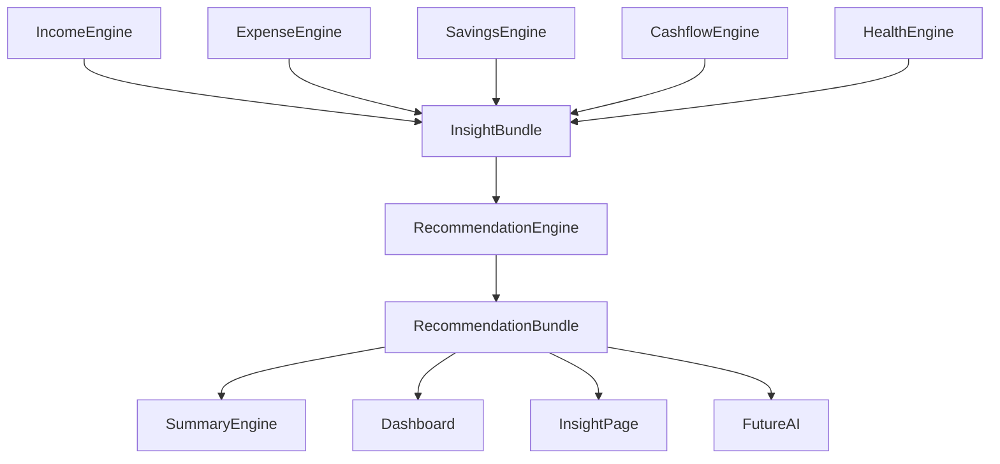
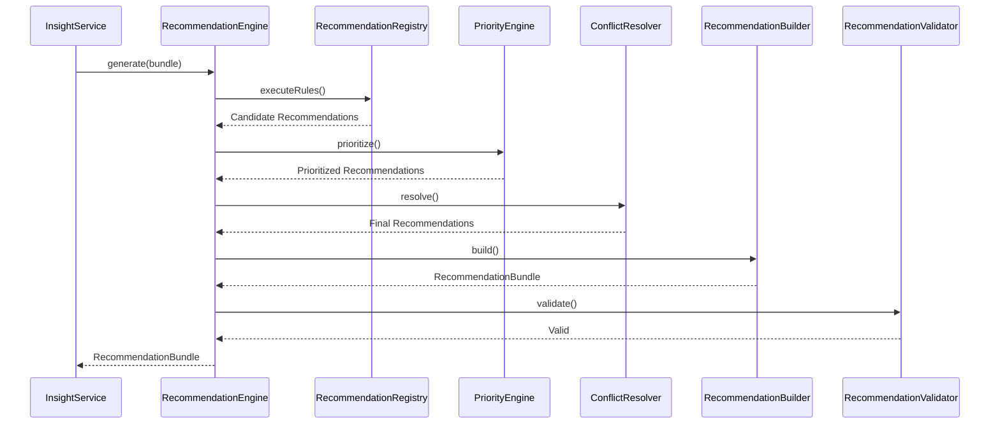
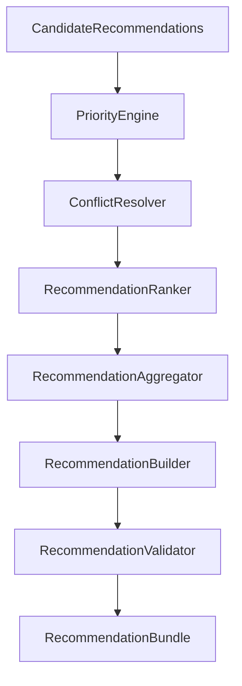
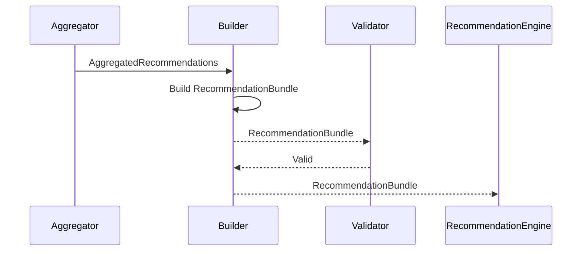
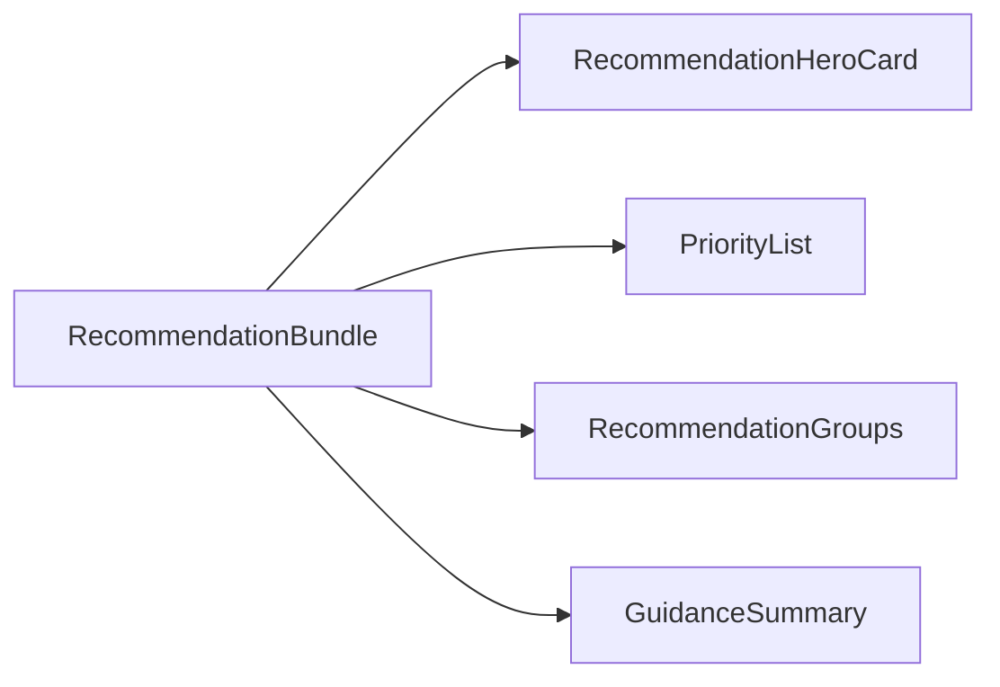
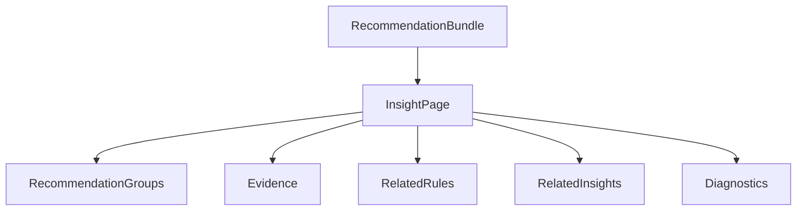
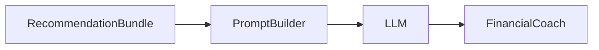
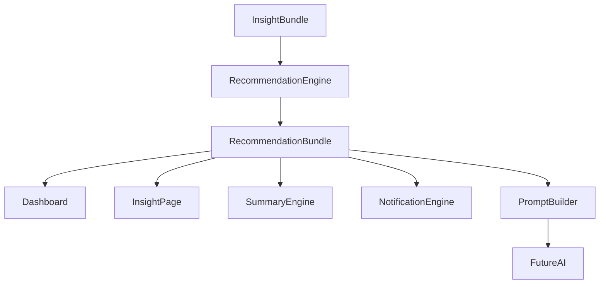
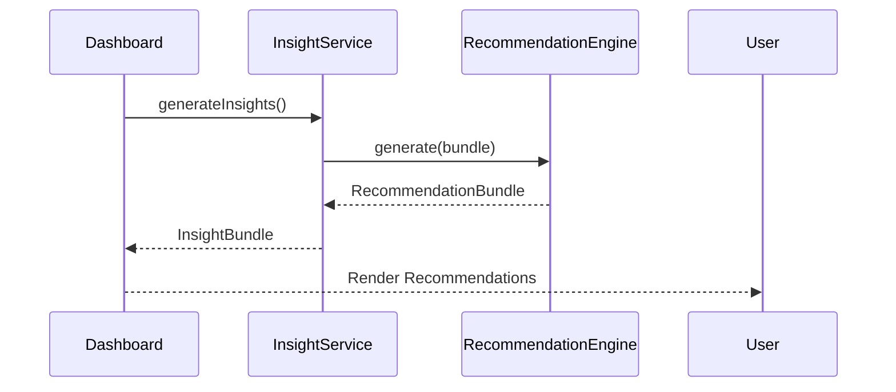

# 10 — Recommendation Engine Architecture (Part I)

> **Document Version:** 2.0.0
> **Status:** Draft — Architecture Review Pending
>
> **Parent Documents**
>
> * `00-PesoPilot-v2.0-Source-of-Truth.md`
> * `01-Rule-Based-Financial-Intelligence-Architecture.md`
> * `02-InsightBundle-and-Data-Contracts.md`
> * `03-Insight-Engine-Architecture.md`
> * `04-Rule-Engine-Architecture.md`
> * `05-Health-Engine-Architecture.md`
> * `06-Income-Engine-Architecture.md`
> * `07-Expense-Engine-Architecture.md`
> * `08-Savings-&-Goal-Engine-Architecture.md`
> * `09-Cashflow-&-Cutoff-Engine-Architecture.md`
>
> **Phase**
>
> Phase 11A — Rule-Based Financial Intelligence
>
> **Section**
>
> Introduction, Recommendation Philosophy, Responsibilities & Overall Recommendation Architecture

---

# 1. Purpose

The Recommendation Engine is the decision-support layer of PesoPilot's Financial Intelligence Platform.

While the previous Financial Intelligence Engines answer:

* What happened?
* Why did it happen?
* How healthy is the user's financial situation?

the Recommendation Engine answers:

> **"Given everything we know, what should the user do next?"**

Unlike previous engines, the Recommendation Engine does **not calculate financial metrics**.

Instead, it converts deterministic financial intelligence into structured, explainable, prioritized recommendations.

Every recommendation is supported by evidence.

Every recommendation is reproducible.

Every recommendation is fully deterministic.

---

# 2. Position Within the Financial Intelligence Platform

The Recommendation Engine consumes every Financial Intelligence Engine.



Unlike previous engines,

the Recommendation Engine never produces new financial calculations.

It interprets existing intelligence.

---

# 3. Recommendation Philosophy

Recommendations should never be guesses.

Recommendations should never rely on intuition.

Recommendations should never contradict financial evidence.

Instead,

every recommendation must originate from deterministic financial observations.

The Recommendation Engine therefore acts like an expert financial advisor who never invents information.

---

# 4. Guiding Principles

The Recommendation Engine follows nine architectural principles.

---

## 4.1 Evidence Before Advice

No recommendation may exist without supporting evidence.

Every recommendation must explain:

* why it exists,
* what triggered it,
* which Rules produced it,
* what financial observations support it.

---

## 4.2 Deterministic Decision Making

Identical InsightBundles must always produce identical RecommendationBundles.

No randomness.

No machine learning.

No LLM participation.

---

## 4.3 Explainability

Every recommendation must answer:

> Why am I seeing this?

The explanation must always reference deterministic financial evidence.

---

## 4.4 Prioritization

Not every recommendation deserves equal attention.

The engine should identify:

* what is urgent,
* what is important,
* what is informational.

Recommendations are ranked before delivery.

---

## 4.5 Conflict Resolution

Recommendations must never contradict each other.

Example

Never produce:

```text
Increase Savings

Reduce Savings
```

within the same RecommendationBundle.

Conflicts are resolved before recommendations reach the user.

---

## 4.6 Actionability

Every recommendation should encourage a concrete action.

Example

Instead of

```text
Dining expenses are high.
```

the engine produces

```text
Reduce discretionary dining spending until your next payday.
```

---

## 4.7 Reusability

RecommendationBundle should be reusable by:

* Dashboard
* Insight Page
* Summary Engine
* AI Financial Coach
* Notifications
* Future Mobile Widgets

Recommendations are generated once and reused everywhere.

---

## 4.8 Separation of Responsibility

The Recommendation Engine never:

* calculates income,
* calculates expenses,
* calculates savings,
* calculates health scores,
* calculates cashflow.

Those responsibilities remain within their respective Financial Engines.

---

## 4.9 AI-Ready Architecture

The Recommendation Engine is intentionally designed to become the primary structured input for the future AI Financial Coach.

The AI explains recommendations.

The Recommendation Engine creates recommendations.

---

# 5. Recommendation Lifecycle

Every recommendation progresses through the same lifecycle.

```mermaid
flowchart LR

InsightBundle

-->

Candidate Recommendation

-->

Priority Engine

-->

Conflict Resolver

-->

Recommendation Ranker

-->

Recommendation Builder

-->

Recommendation Validator

-->

RecommendationBundle
```

Each stage owns exactly one responsibility.

---

# 6. Responsibilities

The Recommendation Engine owns:

* recommendation generation,
* recommendation prioritization,
* recommendation ranking,
* conflict resolution,
* recommendation grouping,
* evidence mapping,
* recommendation explanations,
* RecommendationBundle construction.

The Recommendation Engine does **not** own:

* financial calculations,
* financial metrics,
* persistence,
* summaries,
* AI conversations,
* notifications,
* Dashboard rendering.

---

# 7. Inputs

The Recommendation Engine receives one immutable object.

```text
InsightBundle
```

Relevant information includes:

* IncomeInsight
* ExpenseInsight
* SavingsInsight
* CashflowInsight
* HealthInsight

The engine never communicates directly with:

* repositories,
* IndexedDB,
* React,
* Zustand,
* browser APIs.

---

# 8. Outputs

The Recommendation Engine produces one public DTO.

```text
RecommendationBundle

├── Recommendations

├── Highest Priority Recommendation

├── Recommendation Groups

├── Recommendation Counts

├── Explanations

├── Evidence

├── Diagnostics

└── Metadata
```

RecommendationBundle becomes one component of the global Financial Intelligence Platform.

---

# 9. High-Level Pipeline

```mermaid
flowchart TD

InsightBundle

↓

Recommendation Rule Registry

↓

Recommendation Rule Runner

↓

Candidate Recommendations

↓

Priority Engine

↓

Conflict Resolver

↓

Recommendation Ranker

↓

Recommendation Builder

↓

Recommendation Validator

↓

RecommendationBundle
```

Unlike previous engines,

Recommendation generation is a multi-stage decision pipeline.

---

# 10. Internal Components

```text
Recommendation Engine

├── Recommendation Rule Registry

├── Recommendation Rule Runner

├── Priority Engine

├── Conflict Resolver

├── Recommendation Ranker

├── Recommendation Builder

└── Recommendation Validator
```

Each component owns one responsibility.

---

# 11. Relationship with Other Engines

```mermaid
flowchart LR

InsightBundle

-->

RecommendationEngine

RecommendationEngine

-->

RecommendationBundle

RecommendationBundle

-->

SummaryEngine

RecommendationBundle

-->

Dashboard

RecommendationBundle

-->

InsightPage

RecommendationBundle

-->

Notification Engine

RecommendationBundle

-->

Future AI Coach
```

The Recommendation Engine depends entirely upon deterministic financial intelligence.

It never recalculates financial metrics.

---

# 12. RecommendationBundle Responsibilities

RecommendationBundle answers questions such as:

* What should the user focus on first?
* Which financial issues require immediate attention?
* Which behaviors should continue?
* Which opportunities exist?
* Which recommendations are merely informational?
* Why was each recommendation generated?

RecommendationBundle intentionally avoids generating conversational responses.

That responsibility belongs to the Summary Engine and future AI Financial Coach.

---

# 13. Overall Recommendation Architecture



---

# 14. Future Evolution

The Recommendation Engine is intentionally designed for long-term expansion.

Future capabilities may include:

* personalized recommendation weighting,
* behavioral learning,
* financial habit coaching,
* notification scheduling,
* recurring recommendation suppression,
* recommendation history,
* user feedback loops,
* recommendation effectiveness tracking,
* adaptive coaching,
* AI-generated implementation plans.

These additions should extend existing components without redesigning the Recommendation Engine.

---

# 15. Architecture Decision Records

## ADR-161

### Why Create a Separate Recommendation Engine?

**Decision**

Financial analysis and financial coaching are separated.

**Reason**

Maintains clean architecture and allows independent evolution of analysis and advice.

---

## ADR-162

### Why Introduce a Priority Engine?

**Decision**

Recommendations are prioritized before presentation.

**Reason**

Users should immediately see the highest-value financial actions.

---

## ADR-163

### Why Introduce Conflict Resolution?

**Decision**

Contradictory recommendations are eliminated before delivery.

**Reason**

Improves user trust and recommendation quality.

---

## ADR-164

### Why Keep Recommendations Deterministic?

**Decision**

Recommendations are generated exclusively from deterministic financial intelligence.

**Reason**

Ensures reproducibility, auditability, and consistent financial guidance.

---

## ADR-165

### Why Prepare for AI?

**Decision**

RecommendationBundle becomes the primary structured input to future AI coaching.

**Reason**

The AI should explain and personalize recommendations, not invent financial decisions.

---

# 16. Acceptance Criteria

This section is complete when:

* Recommendation philosophy is documented.
* Recommendation lifecycle is defined.
* Internal architecture is established.
* Responsibilities are clearly separated.
* RecommendationBundle is standardized.
* Future extensibility is documented.
* Architecture decisions are recorded.

---

# Part I Summary

Part I establishes the conceptual foundation of the Recommendation Engine. Unlike the deterministic Financial Intelligence Engines, which measure and explain financial conditions, the Recommendation Engine transforms validated financial intelligence into structured, prioritized, conflict-free recommendations. Through candidate generation, prioritization, conflict resolution, ranking, validation, and bundle construction, it becomes the decision-support layer of PesoPilot and the architectural bridge between deterministic financial analysis and the future AI Financial Coach.

---

**End of Part I**

**Next Section:** **Part II — Recommendation Model, Priority System, Severity Model, Recommendation Categories & Recommendation Lifecycle**

# 10 — Recommendation Engine Architecture (Part II)

> **Document Version:** 2.0.0
> **Status:** Draft — Architecture Review Pending
>
> **Parent Documents**
>
> * `00-PesoPilot-v2.0-Source-of-Truth.md`
> * `01-Rule-Based-Financial-Intelligence-Architecture.md`
> * `02-InsightBundle-and-Data-Contracts.md`
> * `03-Insight-Engine-Architecture.md`
> * `04-Rule-Engine-Architecture.md`
> * `05-Health-Engine-Architecture.md`
> * `06-Income-Engine-Architecture.md`
> * `07-Expense-Engine-Architecture.md`
> * `08-Savings-&-Goal-Engine-Architecture.md`
> * `09-Cashflow-&-Cutoff-Engine-Architecture.md`
>
> **Phase**
>
> Phase 11A — Rule-Based Financial Intelligence
>
> **Section**
>
> Recommendation Model, Priority System, Severity Model, Recommendation Categories & Recommendation Lifecycle

---

# 17. Purpose

Part I introduced the philosophy and architecture of the Recommendation Engine.

This section defines **what a recommendation actually is**.

Rather than representing a recommendation as plain text, PesoPilot models it as a structured business object containing:

* financial context,
* reasoning,
* evidence,
* priority,
* severity,
* suggested action,
* metadata.

This allows recommendations to remain deterministic, explainable, reusable, and AI-ready.

---

# 18. Recommendation Philosophy

A recommendation is **not** a financial calculation.

A recommendation is **not** an AI response.

A recommendation is **the deterministic interpretation of validated financial intelligence into an actionable decision.**

It bridges the gap between:

```mermaid
flowchart LR

Financial Intelligence

-->

Decision Support

-->

Financial Coaching
```

---

# 19. Recommendation Domain Model

Every recommendation follows the same structure.

```text
Recommendation

├── ID
├── Category
├── Title
├── Description
├── Priority
├── Severity
├── Reason
├── Suggested Action
├── Evidence
├── Related Rules
├── Related Insights
├── Confidence
├── Metadata
└── Version
```

Each recommendation represents exactly one actionable financial observation.

---

# 20. Recommendation Lifecycle

Every recommendation progresses through a deterministic lifecycle.

```mermaid
flowchart LR

InsightBundle

-->

Candidate Recommendation

-->

Priority Evaluation

-->

Conflict Resolution

-->

Ranking

-->

Grouping

-->

Bundle Construction

-->

Validation

-->

RecommendationBundle
```

Each stage owns one responsibility.

No stage performs duplicate work.

---

# 21. Candidate Recommendation

Recommendation Rules first generate candidate recommendations.

Example

```text
Remaining Cash

↓

Below Threshold

↓

Candidate Recommendation

↓

Reduce discretionary spending until payday.
```

Candidate recommendations are not yet visible to the user.

---

# 22. Priority Evaluation

The Priority Engine evaluates business importance.

Priority answers:

> **"How urgently should the user see this recommendation?"**

Supported values

```text
Critical

High

Medium

Low

Informational
```

Priority determines display order.

It does not indicate correctness.

---

# 23. Priority Philosophy

Priority is determined by business impact.

Examples

| Situation                            | Priority      |
| ------------------------------------ | ------------- |
| Negative Remaining Cash              | Critical      |
| Runway shorter than remaining cutoff | High          |
| Dining slightly above average        | Medium        |
| Savings improving                    | Low           |
| Informational milestone              | Informational |

Multiple rules may contribute to the same priority score.

---

# 24. Severity Model

Severity describes the financial condition.

Priority describes presentation order.

They are intentionally separate.

Supported values

```text
Success

Info

Warning

Critical
```

Example

| Recommendation               | Severity | Priority |
| ---------------------------- | -------- | -------- |
| Emergency fund growing       | Success  | Low      |
| Spending pace increasing     | Warning  | Medium   |
| Cash exhausted before payday | Critical | Critical |

---

# 25. Why Separate Priority from Severity?

Example

```text
Emergency Fund

Completed
```

Severity

```text
Success
```

Priority

```text
Low
```

Another example

```text
Remaining Cash

₱1,500

Runway

2 Days

Payday

8 Days Away
```

Severity

```text
Critical
```

Priority

```text
Critical
```

Separating these concepts enables more intelligent recommendation ranking.

---

# 26. Recommendation Categories

Recommendations are grouped by business domain.

Phase 11A defines:

```text
Cashflow

Budget

Income

Expenses

Savings

Goals

Health

Behavior

Risk

Upcoming Payday

Financial Discipline

Lifestyle

Emergency Fund

Investment Readiness

Debt

Opportunities
```

Categories improve organization throughout the application.

---

# 27. Recommendation Grouping

Recommendations are grouped before presentation.

Example

```text
Cashflow

├── Reduce Spending

├── Improve Daily Budget

Expenses

├── Reduce Dining

├── Reduce Entertainment

Savings

├── Increase Emergency Fund

├── Maintain Savings Habit
```

Grouping improves readability.

---

# 28. Recommendation Confidence

Phase 11A recommendations are deterministic.

Confidence therefore remains:

```text
100%
```

Future AI-generated recommendations may expose probabilistic confidence values.

---

# 29. Recommendation Reason

Every recommendation must explain why it exists.

Example

```text
Reason

Remaining Cash is below the healthy threshold for the current salary cutoff.
```

Reasons originate from RuleResults.

---

# 30. Suggested Action

Recommendations always contain an action.

Example

Instead of

```text
Dining expenses increased.
```

the Recommendation Engine produces

```text
Reduce discretionary dining expenses until your next salary cutoff.
```

The action should be:

* specific,
* measurable,
* understandable,
* financially appropriate.

---

# 31. Evidence Model

Every recommendation references structured evidence.

Example

```text
Evidence

Income

₱45,000

Expenses

₱41,000

Savings

₱2,000

Remaining Cash

₱2,000
```

Evidence supports every recommendation.

---

# 32. Related Rules

Recommendations retain traceability.

Example

```text
Related Rules

RemainingCashRule

FinancialRunwayRule

SpendingPaceRule
```

This enables debugging and transparency.

---

# 33. Related Insights

Recommendations also reference their originating Insights.

Example

```text
CashflowInsight

SavingsInsight
```

Future AI prompts will consume these relationships.

---

# 34. Recommendation Metadata

Each recommendation exposes metadata.

```text
Recommendation Metadata

├── Recommendation ID

├── Category

├── Priority

├── Severity

├── Created By

├── Engine Version

├── Recommendation Version
```

Metadata improves diagnostics.

---

# 35. RecommendationBundle

The Recommendation Engine produces one public DTO.

```text
RecommendationBundle

├── Recommendations

├── Highest Priority Recommendation

├── Recommendation Groups

├── Recommendation Counts

├── Evidence

├── Diagnostics

└── Metadata
```

The bundle represents the complete coaching output for one execution.

---

# 36. Recommendation Ordering

Recommendations are sorted using multiple criteria.

```mermaid
flowchart TD

Priority

↓

Severity

↓

Business Weight

↓

Category

↓

Recommendation ID
```

Sorting is deterministic.

---

# 37. Recommendation Deduplication

Multiple Rules may produce equivalent recommendations.

Example

```text
Reduce Spending

↓

RemainingCashRule

Reduce Spending

↓

FinancialRunwayRule
```

The Conflict Resolver merges them into one recommendation with combined evidence.

---

# 38. Recommendation Suppression

The engine may suppress recommendations when:

* they duplicate another recommendation,
* a higher-priority recommendation supersedes them,
* financial evidence is insufficient.

Suppressed recommendations remain available for diagnostics but are not exposed to the user.

---

# 39. Recommendation Lifecycle States

Internally, every recommendation transitions through the following states.

```text
Candidate

↓

Prioritized

↓

Conflict Resolved

↓

Ranked

↓

Grouped

↓

Validated

↓

Published
```

These states are internal implementation details.

The public DTO exposes only the final published recommendations.

---

# 40. Future Recommendation Metadata

Future versions may introduce:

```text
Dismiss Count

User Feedback

Accepted

Ignored

Completed

Recommendation Effectiveness

AI Personalization Weight

Behavior Score
```

These additions extend metadata without changing the Recommendation contract.

---

# 41. Architecture Decision Records

## ADR-166

### Why Treat Recommendations as Domain Objects?

**Decision**

Recommendations are modeled as structured business entities rather than plain text.

**Reason**

Enables explainability, reuse, validation, ranking, and future AI integration.

---

## ADR-167

### Why Separate Priority and Severity?

**Decision**

Priority determines presentation order while Severity describes financial condition.

**Reason**

Allows urgent informational messages and low-priority success messages to coexist without ambiguity.

---

## ADR-168

### Why Introduce Recommendation Categories?

**Decision**

Recommendations are classified into financial domains.

**Reason**

Improves organization, filtering, analytics, and future notification targeting.

---

## ADR-169

### Why Require Evidence?

**Decision**

Every recommendation must include structured evidence.

**Reason**

Supports user trust, explainability, auditing, and AI prompt construction.

---

## ADR-170

### Why Model a Recommendation Lifecycle?

**Decision**

Recommendations progress through deterministic lifecycle stages before publication.

**Reason**

Separates candidate generation, prioritization, conflict resolution, validation, and presentation into independent architectural responsibilities.

---

# 42. Acceptance Criteria

This section is complete when:

* Recommendation domain model is standardized.
* Priority model is documented.
* Severity model is documented.
* Recommendation categories are defined.
* Recommendation lifecycle is specified.
* Recommendation ordering rules are established.
* Recommendation metadata is documented.
* Future extensibility is documented.

---

# Part II Summary

Part II defines the Recommendation Engine's domain model and establishes recommendations as first-class business objects within the PesoPilot architecture. Each recommendation encapsulates deterministic financial evidence, priority, severity, reasoning, suggested actions, metadata, and lifecycle state. Through standardized categorization, prioritization, grouping, conflict resolution, and validation, the Recommendation Engine transforms validated financial intelligence into structured decision-support artifacts that can be consistently consumed by the Dashboard, Summary Engine, Notification System, and future AI Financial Coach.

---

**End of Part II**

**Next Section:** **Part III — Recommendation Rule Registry, Recommendation Rules, Rule Specifications, Priority Engine & Conflict Resolution**

# 10 — Recommendation Engine Architecture (Part III)

> **Document Version:** 2.0.0
> **Status:** Draft — Architecture Review Pending
>
> **Parent Documents**
>
> * `00-PesoPilot-v2.0-Source-of-Truth.md`
> * `01-Rule-Based-Financial-Intelligence-Architecture.md`
> * `02-InsightBundle-and-Data-Contracts.md`
> * `03-Insight-Engine-Architecture.md`
> * `04-Rule-Engine-Architecture.md`
> * `05-Health-Engine-Architecture.md`
> * `06-Income-Engine-Architecture.md`
> * `07-Expense-Engine-Architecture.md`
> * `08-Savings-&-Goal-Engine-Architecture.md`
> * `09-Cashflow-&-Cutoff-Engine-Architecture.md`
>
> **Phase**
>
> Phase 11A — Rule-Based Financial Intelligence
>
> **Section**
>
> Recommendation Rule Registry, Recommendation Rules, Rule Specifications, Priority Engine & Conflict Resolution

---

# 43. Purpose

Part II defined the Recommendation domain model.

This section defines **how recommendations are generated**.

Unlike previous engines that produce RuleResults directly,

the Recommendation Engine produces **Candidate Recommendations**.

Candidate Recommendations are later:

* prioritized,
* merged,
* conflict-resolved,
* ranked,
* validated,

before becoming part of the RecommendationBundle.

---

# 44. Recommendation Rule Philosophy

Every Recommendation Rule answers one business question.

Examples

```text
Should the user reduce spending?

↓

ReduceSpendingRule
```

```text
Should the user increase emergency savings?

↓

EmergencyFundRule
```

```text
Should the user continue current behavior?

↓

PositiveReinforcementRule
```

Recommendation Rules evaluate financial situations,

not financial calculations.

---

# 45. Recommendation Rule Registry

The Recommendation Engine owns one dedicated Rule Registry.

```mermaid
flowchart TD

RecommendationEngine

↓

RecommendationRuleRegistry

↓

Recommendation Rules

↓

Rule Runner

↓

Candidate Recommendations
```

The Registry defines:

* execution order,
* priorities,
* dependencies,
* metadata,
* versions.

---

# 46. Recommendation Rule Categories

Recommendation Rules are grouped into business domains.

```text
Cashflow

Budget

Income

Expenses

Savings

Goals

Health

Behavior

Risk

Lifestyle

Emergency Fund

Investment

Debt

Opportunities
```

These categories match the Recommendation Category Model defined in Part II.

---

# 47. Registry Structure

```text
RecommendationRuleRegistry

├── Cashflow Rules

├── Budget Rules

├── Expense Rules

├── Savings Rules

├── Goal Rules

├── Health Rules

├── Risk Rules

└── Opportunity Rules
```

Each Recommendation Rule belongs to exactly one category.

---

# 48. Cashflow Recommendation Rules

Phase 11A includes:

```text
ReduceSpendingRule

MaintainCurrentPaceRule

IncreaseDailyBudgetAwarenessRule

RunwayProtectionRule
```

---

## ReduceSpendingRule

### Business Question

```text
Should discretionary spending be reduced?
```

Trigger

* Remaining Cash below threshold
* Spending Pace = Fast or Critical

Produces

```text
Reduce discretionary spending until your next payday.
```

---

## MaintainCurrentPaceRule

Business Question

```text
Should current spending behavior be maintained?
```

Trigger

* Healthy Spending Pace
* Healthy Runway

Produces

```text
Continue your current spending pattern.
```

---

# 49. Savings Recommendation Rules

Phase 11A

```text
IncreaseSavingsRule

MaintainSavingsHabitRule

EmergencyFundRecommendationRule
```

---

## IncreaseSavingsRule

Trigger

* Savings Rate below target

Produces

```text
Increase recurring savings contributions.
```

---

## MaintainSavingsHabitRule

Trigger

* Savings improving
* Contribution consistency high

Produces

```text
Maintain your current savings habit.
```

---

# 50. Expense Recommendation Rules

Phase 11A

```text
ReduceDiningRule

ReduceEntertainmentRule

ReduceShoppingRule

ReduceLargestCategoryRule
```

Each Rule evaluates one spending behavior.

---

# 51. Goal Recommendation Rules

Phase 11A

```text
GoalAccelerationRule

GoalConsistencyRule

GoalCompletionRule
```

Examples

```text
Your Emergency Fund is progressing well.

Continue contributing consistently.
```

---

# 52. Health Recommendation Rules

Phase 11A

```text
ImproveFinancialHealthRule

MaintainFinancialHealthRule
```

Health recommendations summarize overall financial condition.

---

# 53. Risk Recommendation Rules

Risk recommendations identify financial vulnerabilities.

Phase 11A

```text
LowCashRiskRule

RunwayRiskRule

OverspendingRiskRule
```

Example

```text
Your remaining cash may not comfortably last until your next payday.
```

---

# 54. Opportunity Recommendation Rules

Opportunity Rules identify positive financial situations.

Examples

```text
Extra Savings Opportunity

Additional Goal Contribution

Investment Readiness

Emergency Fund Milestone
```

Unlike Risk Rules,

Opportunity Rules encourage positive behavior.

---

# 55. Rule Specification Template

Every Recommendation Rule follows the same specification.

```text
Rule Name

Purpose

Business Question

Trigger Conditions

Evidence

Candidate Recommendation

Priority Hint

Severity

Version
```

Future Recommendation Rules must follow this contract.

---

# 56. Candidate Recommendation

Recommendation Rules never publish recommendations.

Instead they create Candidate Recommendations.

```text
Candidate Recommendation

├── Recommendation

├── Priority Hint

├── Severity

├── Evidence

├── Trigger Rule

└── Metadata
```

Candidate Recommendations remain internal.

---

# 57. Priority Engine

The Priority Engine evaluates every Candidate Recommendation.

Responsibilities

* assign final priority,
* compare recommendations,
* normalize priorities,
* prepare ranking.

Pipeline

```mermaid
flowchart LR

Candidate Recommendations

-->

Priority Engine

-->

Prioritized Recommendations
```

---

# 58. Priority Evaluation

Priority is determined using multiple factors.

```text
Business Impact

↓

Financial Risk

↓

Urgency

↓

Category Weight

↓

Rule Weight

↓

Priority
```

This produces deterministic ordering.

---

# 59. Example Priority Evaluation

```text
Remaining Cash

₱1,500

↓

Runway

2 Days

↓

Priority

Critical
```

versus

```text
Dining Increased

↓

Priority

Medium
```

The engine always surfaces the most important financial issue first.

---

# 60. Conflict Resolver

Multiple Recommendation Rules may produce contradictory recommendations.

Example

```text
Increase Savings
```

and

```text
Maintain Cash Liquidity
```

Both may be valid.

The Conflict Resolver determines which recommendation better reflects the user's current financial situation.

---

# 61. Conflict Resolution Pipeline

```mermaid
flowchart LR

Prioritized Recommendations

-->

Conflict Resolver

-->

Merged Recommendations

-->

Recommendation Ranker
```

Conflict resolution occurs before ranking.

---

# 62. Conflict Resolution Strategies

Phase 11A supports:

```text
Duplicate Merge

Higher Priority Wins

Evidence Merge

Category Merge

Suppression
```

These strategies ensure users receive a coherent recommendation set.

---

# 63. Duplicate Merge

Example

```text
Reduce Spending

↓

RemainingCashRule
```

and

```text
Reduce Spending

↓

RunwayRule
```

become

```text
Reduce Spending

Supported By

Remaining Cash

+

Runway
```

Evidence is merged.

---

# 64. Higher Priority Wins

Example

```text
Increase Savings

Priority

Medium
```

versus

```text
Protect Remaining Cash

Priority

Critical
```

The critical recommendation is presented first.

The lower-priority recommendation may be retained or suppressed depending on business rules.

---

# 65. Evidence Merge

Evidence from multiple Recommendation Rules is combined.

Example

```text
Remaining Cash

₱2,000

Runway

2 Days

Savings Rate

6%
```

The recommendation becomes stronger because multiple observations support it.

---

# 66. Recommendation Ranker

After conflict resolution,

recommendations are ranked.

Ranking order

```text
Priority

↓

Severity

↓

Business Weight

↓

Category Weight

↓

Recommendation ID
```

Ranking remains deterministic.

---

# 67. Recommendation Builder Inputs

The Builder receives:

```text
Ranked Recommendations

+

Merged Evidence

+

Metadata
```

No Recommendation Rule communicates directly with the Builder.

---

# 68. Recommendation Validation Rules

Before publication,

every recommendation must satisfy:

* title exists,
* description exists,
* evidence exists,
* suggested action exists,
* category exists,
* priority exists,
* severity exists.

Incomplete recommendations are rejected.

---

# 69. Rule Metadata

Every Recommendation Rule exposes:

```text
Rule ID

Rule Name

Category

Version

Priority Weight

Description
```

Metadata supports diagnostics and future analytics.

---

# 70. Future Rule Expansion

Future Recommendation Rules may include:

```text
SubscriptionOptimizationRule

InvestmentDiversificationRule

InflationAdjustmentRule

TaxOptimizationRule

InsuranceCoverageRule

RetirementPlanningRule

BehaviorCoachingRule

AIHybridRecommendationRule
```

The Rule Registry expands without changing engine architecture.

---

# 71. Architecture Decision Records

## ADR-171

### Why Generate Candidate Recommendations?

**Decision**

Recommendation Rules produce Candidate Recommendations instead of final recommendations.

**Reason**

Allows prioritization, merging, conflict resolution, and ranking before publication.

---

## ADR-172

### Why Introduce a Priority Engine?

**Decision**

Recommendation priority is evaluated centrally.

**Reason**

Ensures consistent prioritization across all financial domains.

---

## ADR-173

### Why Introduce a Conflict Resolver?

**Decision**

Conflicting recommendations are resolved before presentation.

**Reason**

Improves recommendation quality, consistency, and user trust.

---

## ADR-174

### Why Merge Evidence?

**Decision**

Recommendations supported by multiple Rules consolidate their evidence.

**Reason**

Provides stronger explanations while reducing duplicate recommendations.

---

## ADR-175

### Why Separate Ranking from Priority?

**Decision**

Priority determines urgency while ranking determines final display order.

**Reason**

Enables deterministic sorting using multiple business dimensions.

---

# 72. Acceptance Criteria

This section is complete when:

* Recommendation Rule Registry is defined.
* Initial Recommendation Rules are documented.
* Candidate Recommendation model is specified.
* Priority Engine is documented.
* Conflict Resolver is documented.
* Recommendation Ranker is defined.
* Validation requirements are established.
* Future extensibility is documented.

---

# Part III Summary

Part III defines the decision-making architecture of the Recommendation Engine. Rather than publishing recommendations directly from individual rules, the engine generates Candidate Recommendations that progress through a deterministic pipeline consisting of prioritization, conflict resolution, evidence consolidation, ranking, validation, and bundle construction. This architecture transforms isolated financial observations into a coherent, explainable, and prioritized set of financial actions, providing the foundation for enterprise-grade decision support while preparing PesoPilot for future AI-assisted financial coaching.

---

**End of Part III**

**Next Section:** **Part IV — Recommendation Aggregation, RecommendationBundle DTO, Dashboard Integration, AI Integration & Explanation Generation**

# 10 — Recommendation Engine Architecture (Part IV)

> **Document Version:** 2.0.0
> **Status:** Draft — Architecture Review Pending
>
> **Parent Documents**
>
> * `00-PesoPilot-v2.0-Source-of-Truth.md`
> * `01-Rule-Based-Financial-Intelligence-Architecture.md`
> * `02-InsightBundle-and-Data-Contracts.md`
> * `03-Insight-Engine-Architecture.md`
> * `04-Rule-Engine-Architecture.md`
> * `05-Health-Engine-Architecture.md`
> * `06-Income-Engine-Architecture.md`
> * `07-Expense-Engine-Architecture.md`
> * `08-Savings-&-Goal-Engine-Architecture.md`
> * `09-Cashflow-&-Cutoff-Engine-Architecture.md`
>
> **Phase**
>
> Phase 11A — Rule-Based Financial Intelligence
>
> **Section**
>
> Recommendation Aggregation, RecommendationBundle DTO, Dashboard Integration, AI Integration & Explanation Generation

---

# 73. Purpose

Previous sections defined:

* the Recommendation Engine philosophy,
* the Recommendation domain model,
* the Recommendation Rule Registry,
* Candidate Recommendations,
* Priority Engine,
* Conflict Resolver,
* Recommendation Ranker.

This section defines how processed recommendations become the public **RecommendationBundle** consumed by the application.

The Recommendation Engine does not expose Candidate Recommendations directly.

Only validated, ranked, conflict-resolved Recommendations are published.

---

# 74. Recommendation Aggregation Philosophy

Recommendation aggregation transforms many possible coaching signals into one coherent decision-support output.

Instead of exposing:

```text
Candidate A

Candidate B

Candidate C

Candidate D
```

the engine produces:

```text
RecommendationBundle

├── Highest Priority Recommendation
├── Cashflow Recommendations
├── Savings Recommendations
├── Expense Recommendations
├── Opportunity Recommendations
└── Supporting Evidence
```

Aggregation ensures the user sees the most important guidance first.

---

# 75. High-Level Aggregation Pipeline



Aggregation occurs after prioritization, conflict resolution, and ranking.

---

# 76. Recommendation Aggregator Responsibilities

The Recommendation Aggregator is responsible for:

* grouping ranked recommendations,
* selecting the highest priority recommendation,
* counting recommendations by category,
* merging supporting evidence,
* preparing Dashboard-ready sections,
* preparing AI-ready structured context,
* preparing explanation inputs.

The Aggregator does **not**:

* calculate financial metrics,
* execute Recommendation Rules,
* resolve conflicts,
* build final DTOs,
* generate AI text,
* render UI.

---

# 77. Aggregation Inputs

The Aggregator receives:

```text
RankedRecommendation[]
```

Each recommendation already contains:

* category,
* priority,
* severity,
* reason,
* suggested action,
* evidence,
* related rules,
* related insights,
* metadata.

The Aggregator does not inspect raw financial records.

---

# 78. Aggregation Outputs

The Aggregator produces one internal object.

```text
AggregatedRecommendations

├── Recommendations
├── Highest Priority Recommendation
├── Recommendation Groups
├── Recommendation Counts
├── Evidence Summary
├── Explanation Inputs
├── AI Context
└── Diagnostics
```

This object exists only inside the Recommendation Engine.

---

# 79. Recommendation Grouping

Recommendations are grouped by category.

Example:

```text
Cashflow

├── Protect remaining cash
├── Keep daily spending below safe budget

Expenses

├── Reduce dining expenses
├── Review shopping purchases

Savings

├── Increase emergency fund contributions

Opportunities

├── Use extra remaining cash toward savings goals
```

Grouping improves Dashboard readability and AI prompt structure.

---

# 80. Highest Priority Recommendation

The Aggregator identifies the first recommendation after final ranking.

```text
Highest Priority Recommendation

=

recommendations[0]
```

This recommendation powers:

* Dashboard hero card,
* notification summaries,
* AI opening prompt,
* Summary Engine headline.

If no recommendation exists, the bundle returns a safe empty state.

---

# 81. Recommendation Counts

The Aggregator computes deterministic counts.

```text
Total Recommendations

Critical Count

High Count

Medium Count

Low Count

Informational Count

Category Counts
```

These counts support:

* Dashboard badges,
* Insight Page filters,
* diagnostics,
* future notification grouping.

---

# 82. Evidence Summary

Evidence Summary merges evidence across recommendations.

Example:

```text
Cashflow Evidence

Remaining Cash: ₱2,000

Runway: 2 days

Remaining Days: 8

Savings Evidence

Savings Rate: 6%

Contribution Consistency: Low
```

The purpose is not to replace per-recommendation evidence.

It provides a higher-level explanation surface.

---

# 83. Explanation Inputs

The Aggregator prepares deterministic explanation inputs.

Example:

```text
Primary Issue:
Remaining cash is low.

Supporting Observations:
- Runway is shorter than remaining cutoff days.
- Spending pace is fast.
- Savings rate is below target.

Suggested Action:
Reduce discretionary spending until payday.
```

The Explanation Builder later converts these into readable text.

---

# 84. RecommendationBundle DTO

The Builder converts AggregatedRecommendations into the public DTO.

```text
RecommendationBundle

├── recommendations
├── highestPriority
├── groups
├── counts
├── evidenceSummary
├── explanation
├── diagnostics
└── metadata
```

This DTO conforms to Document 02.

---

# 85. Recommendation DTO

Each recommendation inside the bundle follows the standardized contract.

```text
Recommendation

├── id
├── title
├── description
├── category
├── priority
├── severity
├── reason
├── suggestedAction
├── evidence
├── relatedRules
├── relatedInsights
├── confidence
├── metadata
└── version
```

Every recommendation must remain independently explainable.

---

# 86. RecommendationBundle Lifecycle



---

# 87. Recommendation Validator Responsibilities

The Validator verifies:

Bundle-level requirements:

* recommendations array exists,
* groups exist,
* counts exist,
* metadata exists.

Recommendation-level requirements:

* title exists,
* description exists,
* category exists,
* priority exists,
* severity exists,
* reason exists,
* suggestedAction exists,
* evidence exists.

Invalid RecommendationBundles must never reach Dashboard or AI layers.

---

# 88. Empty Recommendation State

The engine must support a valid empty state.

Example:

```text
RecommendationBundle

Recommendations: []

Highest Priority: null

Explanation:
No priority recommendations are available right now.
```

This prevents false advice when the user's data is incomplete or no meaningful recommendation exists.

---

# 89. Explanation Generation

The Recommendation Engine generates deterministic explanations.

It answers:

> **"Why are these recommendations being shown?"**

Example:

```text
Your highest priority recommendation is to protect remaining cash because your current runway is shorter than the remaining days before payday.
```

Every explanation must be traceable to evidence.

---

# 90. Explanation Structure

RecommendationBundle contains:

```text
Recommendation Explanation

├── Overall Guidance Summary
├── Highest Priority Explanation
├── Group Summaries
├── Evidence Summary
└── No-Data Explanation
```

This structure supports both UI and future AI prompts.

---

# 91. Example Explanation

```text
Your most important action is to reduce discretionary spending until your next payday.

This recommendation was generated because remaining cash is low, spending pace is fast, and financial runway is shorter than the remaining cutoff period.
```

No AI participates in Phase 11A explanation generation.

---

# 92. Dashboard Integration

The Dashboard consumes RecommendationBundle.



Dashboard components never rerank recommendations.

They consume the bundle as-is.

---

# 93. Dashboard Components

RecommendationBundle powers:

```text
Highest Priority Recommendation Card

Top Recommendations List

Recommendation Category Groups

Recommendation Count Badge

Guidance Summary

No Recommendation Empty State
```

These components are presentation-only.

---

# 94. Insight Page Integration

The Insight Page exposes full recommendation transparency.



The Insight Page may show why each recommendation was generated.

---

# 95. Notification Integration

Future notification systems may consume RecommendationBundle.

Example:

```text
Critical Recommendation

↓

Notification Candidate
```

The Recommendation Engine does not send notifications.

It only provides structured recommendation data.

---

# 96. Summary Engine Integration

The Summary Engine consumes:

* highest priority recommendation,
* recommendation groups,
* evidence summary,
* explanation.

Example summary:

```text
Your top priority is to protect remaining cash until payday because your current financial runway is shorter than the remaining cutoff period.
```

The Summary Engine does not generate new recommendations.

---

# 97. AI Financial Coach Integration

Future AI architecture:



The AI receives verified recommendations.

It does not create financial recommendations independently.

---

# 98. AI Context Model

RecommendationBundle should expose AI-ready context.

```text
AI Recommendation Context

├── Top Recommendation
├── Ranked Recommendations
├── Evidence Summary
├── Related Insights
├── Suggested Actions
├── Guardrails
└── Metadata
```

This structure helps the Prompt Builder create safe, grounded prompts.

---

# 99. AI Guardrails

Future AI systems must follow these rules:

* Do not invent recommendations.
* Do not override deterministic recommendation priority.
* Do not recalculate financial values.
* Explain only the RecommendationBundle.
* Ask for more data when evidence is incomplete.

This preserves financial safety.

---

# 100. Recommendation History

Future versions may store RecommendationBundle snapshots.

Example:

```text
Recommendation History

↓

Cutoff

↓

Highest Priority

↓

Accepted

↓

Dismissed

↓

Completed
```

History remains outside Phase 11A.

---

# 101. Diagnostics

RecommendationBundle exposes diagnostic metadata.

Example:

```text
Registry Version

Engine Version

Candidate Count

Suppressed Count

Conflict Count

Published Count

Execution Time

Warnings
```

Diagnostics support testing and future analytics.

---

# 102. Architecture Decision Records

## ADR-176

### Why Aggregate After Conflict Resolution?

**Decision**

Aggregation occurs only after candidate recommendations have been prioritized and conflict-resolved.

**Reason**

Prevents invalid or contradictory recommendations from entering user-facing bundles.

---

## ADR-177

### Why Expose Highest Priority Recommendation?

**Decision**

RecommendationBundle explicitly identifies the top recommendation.

**Reason**

Supports Dashboard hero cards, summaries, notifications, and AI opening guidance.

---

## ADR-178

### Why Include AI Context?

**Decision**

RecommendationBundle prepares structured AI-ready context.

**Reason**

Future AI should explain deterministic recommendations rather than invent its own.

---

## ADR-179

### Why Support Empty Recommendation State?

**Decision**

Empty recommendations are valid.

**Reason**

Avoids producing weak or misleading advice when evidence is insufficient.

---

## ADR-180

### Why Keep Notifications Separate?

**Decision**

Notification delivery is outside the Recommendation Engine.

**Reason**

Recommendation generation and user notification are different responsibilities.

---

# 103. Acceptance Criteria

This section is complete when:

* Recommendation aggregation is documented.
* RecommendationBundle DTO is standardized.
* Explanation generation is defined.
* Dashboard integration is documented.
* Insight Page integration is documented.
* Summary, Notification, and AI integrations are established.
* Validation responsibilities are specified.
* Empty recommendation handling is documented.
* Future extensibility is documented.

---

# Part IV Summary

Part IV defines how the Recommendation Engine transforms prioritized, conflict-resolved, ranked recommendations into a complete `RecommendationBundle`. Through deterministic aggregation, grouping, evidence summarization, explanation generation, and validation, the engine produces a coherent decision-support artifact that can be consumed by the Dashboard, Insight Page, Summary Engine, Notification System, and future AI Financial Coach. The resulting architecture ensures that recommendations remain evidence-based, conflict-free, prioritized, explainable, and ready for safe AI-assisted financial coaching.

---

**End of Part IV**

**Next Section:** **Part V — Testing Strategy, Future Evolution, Acceptance Criteria & Implementation Roadmap**

# 10 — Recommendation Engine Architecture (Part V)

> **Document Version:** 2.0.0
> **Status:** Draft — Architecture Review Pending
>
> **Parent Documents**
>
> * `00-PesoPilot-v2.0-Source-of-Truth.md`
> * `01-Rule-Based-Financial-Intelligence-Architecture.md`
> * `02-InsightBundle-and-Data-Contracts.md`
> * `03-Insight-Engine-Architecture.md`
> * `04-Rule-Engine-Architecture.md`
> * `05-Health-Engine-Architecture.md`
> * `06-Income-Engine-Architecture.md`
> * `07-Expense-Engine-Architecture.md`
> * `08-Savings-&-Goal-Engine-Architecture.md`
> * `09-Cashflow-&-Cutoff-Engine-Architecture.md`
>
> **Phase**
>
> Phase 11A — Rule-Based Financial Intelligence
>
> **Section**
>
> Testing Strategy, Future Evolution, Acceptance Criteria & Implementation Roadmap

---

# 104. Purpose

The previous sections defined:

* Recommendation philosophy,
* Recommendation domain model,
* Recommendation Rule Registry,
* Priority Engine,
* Conflict Resolver,
* Recommendation aggregation,
* RecommendationBundle generation.

This final section defines how the Recommendation Engine should be implemented, tested, evolved, and integrated into the PesoPilot Financial Intelligence Platform.

---

# 105. Recommendation Engine Integration Overview

The Recommendation Engine is the final deterministic decision-support layer before financial guidance reaches the user.



The Recommendation Engine never communicates directly with UI components.

---

# 106. Dashboard Integration

The Dashboard is the primary consumer of RecommendationBundle.



The Dashboard never reranks or filters recommendations.

---

# 107. Dashboard Components

RecommendationBundle powers:

```text
Highest Priority Recommendation Card

Top Recommendation List

Recommendation Categories

Financial Guidance Summary

Recommendation Badges

Recommendation Count

Empty Recommendation State
```

All Dashboard components remain presentation-only.

---

# 108. Highest Priority Recommendation Card

The hero card displays:

```text
Title

Priority

Severity

Reason

Suggested Action
```

This becomes the first coaching experience the user sees after financial calculations are complete.

---

# 109. Recommendation Timeline

Future versions may display recommendation history.

Example

```text
Current Cutoff

↓

Protect Remaining Cash

↓

Previous Cutoff

Maintain Savings Habit

↓

Earlier Cutoff

Increase Emergency Fund
```

Recommendation history remains outside Phase 11A.

---

# 110. Recommendation Analytics

Future analytics may include:

```text
Recommendation Generated

↓

Recommendation Viewed

↓

Recommendation Accepted

↓

Recommendation Completed

↓

Recommendation Effectiveness
```

These analytics enable future behavioral coaching.

---

# 111. Insight Page Integration

The Insight Page provides complete recommendation transparency.

```mermaid
flowchart TD

RecommendationBundle

-->

InsightPage

InsightPage

-->

Recommendation Details

InsightPage

-->

Evidence

InsightPage

-->

Related Rules

InsightPage

-->

Related Insights

InsightPage

-->

Priority Explanation

InsightPage

-->

Diagnostics
```

Unlike the Dashboard,

the Insight Page prioritizes explainability.

---

# 112. Summary Engine Integration

The Summary Engine consumes:

* highest priority recommendation,
* grouped recommendations,
* evidence summary,
* explanation.

Example

```text
Your highest priority recommendation is to reduce discretionary spending because your remaining cash and financial runway are below healthy thresholds.
```

The Summary Engine converts recommendations into conversational summaries.

---

# 113. Notification Engine Integration

Future Notification Engine architecture

```mermaid
flowchart LR

RecommendationBundle

-->

Notification Selector

-->

Notification Queue

-->

User
```

Recommendation generation and notification delivery remain separate responsibilities.

---

# 114. AI Financial Coach Integration

Future AI architecture

```mermaid
flowchart LR

InsightBundle

-->

RecommendationEngine

RecommendationEngine

-->

RecommendationBundle

RecommendationBundle

-->

Prompt Builder

Prompt Builder

-->

LLM

LLM

-->

Financial Coach
```

The AI never creates recommendations independently.

It explains, personalizes, and expands deterministic recommendations.

---

# 115. Prompt Builder Integration

Future Prompt Builder consumes:

```text
RecommendationBundle

+

InsightBundle

+

Conversation Context

↓

Prompt
```

The Prompt Builder ensures AI responses remain grounded in verified financial intelligence.

---

# 116. AI Guardrails

Future AI implementations must follow these architectural rules.

The AI:

* must never invent recommendations,
* must never override recommendation priorities,
* must never change financial calculations,
* must always explain RecommendationBundle outputs,
* must request additional information when deterministic evidence is insufficient.

These guardrails preserve trust and financial correctness.

---

# 117. Testing Philosophy

The Recommendation Engine must be fully testable without:

* React,
* IndexedDB,
* Zustand,
* repositories,
* browser APIs,
* Spring Boot,
* AI services.

Tests operate entirely on mocked InsightBundle objects.

---

# 118. Unit Tests

Every Recommendation Rule requires dedicated unit tests.

Examples

```text
ReduceSpendingRule

IncreaseSavingsRule

EmergencyFundRule

GoalAccelerationRule

LowCashRiskRule

RunwayProtectionRule

PositiveReinforcementRule
```

Each Rule should verify:

* valid inputs,
* invalid inputs,
* missing data,
* boundary conditions,
* expected candidate recommendation.

---

# 119. Priority Engine Tests

Priority Engine verifies:

* priority assignment,
* deterministic ordering,
* category weighting,
* urgency evaluation,
* business weight evaluation.

Example

```text
Critical

↓

High

↓

Medium

↓

Low

↓

Informational
```

Ordering must always remain deterministic.

---

# 120. Conflict Resolver Tests

Conflict Resolver verifies:

* duplicate merge,
* higher-priority selection,
* suppression,
* evidence merging,
* recommendation consolidation.

Example

```text
Candidate A

+

Candidate B

↓

Merged Recommendation
```

---

# 121. Recommendation Ranker Tests

Recommendation Ranker verifies:

* ordering,
* stable sorting,
* deterministic ranking,
* tie-breaking rules.

Ranking should never depend on insertion order.

---

# 122. Builder Tests

Builder tests verify:

* RecommendationBundle completeness,
* Recommendation structure,
* grouped recommendations,
* counts,
* metadata,
* explanation mapping.

---

# 123. Validator Tests

Validator verifies:

Bundle-level validation:

* recommendations,
* highestPriority,
* groups,
* counts,
* diagnostics,
* metadata.

Recommendation-level validation:

* title,
* description,
* category,
* priority,
* severity,
* reason,
* suggestedAction,
* evidence.

---

# 124. Integration Tests

Complete pipeline

```text
InsightBundle

↓

Recommendation Rules

↓

Candidate Recommendations

↓

Priority Engine

↓

Conflict Resolver

↓

Recommendation Ranker

↓

Aggregator

↓

Builder

↓

Validator

↓

RecommendationBundle
```

Each execution must produce identical RecommendationBundles for identical InsightBundles.

---

# 125. Regression Tests

Regression tests compare generated RecommendationBundles against approved snapshots.

Example

```text
Expected Bundle

↓

Generated Bundle

↓

Comparison
```

Unexpected differences require review before release.

---

# 126. Performance Targets

Target execution time

```text
Recommendation Engine

< 8 ms
```

Typical dataset

* 200 Recommendation Rules
* 100 Candidate Recommendations
* 50 Final Recommendations

Performance must remain deterministic.

---

# 127. Implementation Roadmap

Recommended implementation sequence

```mermaid
flowchart TD

A["Recommendation DTO"]

-->

B["Recommendation Rule Registry"]

-->

C["Recommendation Rules"]

-->

D["Priority Engine"]

-->

E["Conflict Resolver"]

-->

F["Recommendation Ranker"]

-->

G["Recommendation Aggregator"]

-->

H["Recommendation Builder"]

-->

I["Recommendation Validator"]

-->

J["Recommendation Engine"]

-->

K["InsightService Integration"]

-->

L["Dashboard"]

-->

M["Insight Page"]

-->

N["Summary Engine"]

-->

O["Notification Engine"]

-->

P["Prompt Builder"]
```

Every milestone concludes with:

* unit tests,
* lint,
* build,
* documentation review,
* manual verification.

---

# 128. Implementation Checklist

The Recommendation Engine is complete when:

```text
☑ Recommendation DTO

☑ Recommendation Rule Registry

☑ Recommendation Rules

☑ Candidate Recommendation Model

☑ Priority Engine

☑ Conflict Resolver

☑ Recommendation Ranker

☑ Recommendation Aggregator

☑ Recommendation Builder

☑ Recommendation Validator

☑ Recommendation Engine

☑ Dashboard Integration

☑ Insight Page Integration

☑ Summary Engine Integration

☑ Notification Integration

☑ Prompt Builder Integration

☑ Unit Tests

☑ Integration Tests

☑ Documentation
```

---

# 129. Future Evolution

Future Recommendation Engine capabilities may include:

```text
Personalized Recommendation Ranking

Behavior Learning

Recommendation Acceptance Tracking

Recommendation Suppression Learning

Habit Coaching

Notification Scheduling

Recurring Recommendation Detection

Behavior Prediction

Goal-Based Coaching

Adaptive Financial Coaching

Hybrid AI Recommendations

Recommendation Effectiveness Analytics
```

These capabilities extend existing architecture without redesigning the Recommendation Engine.

---

# 130. Architecture Decision Records

## ADR-176

### Why Keep Recommendation Generation Separate from AI?

**Decision**

The Recommendation Engine remains fully deterministic.

**Reason**

Financial decisions should be transparent, reproducible, and independently verifiable.

---

## ADR-177

### Why Test Candidate Recommendations?

**Decision**

Recommendation Rules are tested before prioritization.

**Reason**

Ensures each business rule functions correctly in isolation.

---

## ADR-178

### Why Introduce Recommendation Analytics?

**Decision**

Recommendation effectiveness will be measurable in future versions.

**Reason**

Supports adaptive coaching and continuous improvement.

---

## ADR-179

### Why Integrate Through Prompt Builder?

**Decision**

RecommendationBundle is transformed into prompts by a dedicated Prompt Builder.

**Reason**

Separates recommendation generation from conversational AI orchestration.

---

## ADR-180

### Why Prepare for Hybrid Coaching?

**Decision**

The Recommendation Engine is designed as the deterministic foundation for future AI-assisted financial coaching.

**Reason**

Allows AI to personalize guidance while preserving deterministic financial correctness.

---

# 131. Final Acceptance Criteria

Document 10 is complete when:

* Recommendation Engine architecture is fully documented.
* Recommendation model is finalized.
* Rule Registry is specified.
* Priority Engine is documented.
* Conflict Resolver is documented.
* Recommendation aggregation is finalized.
* RecommendationBundle DTO is standardized.
* Dashboard integration is documented.
* AI integration architecture is documented.
* Testing strategy is complete.
* Implementation roadmap is established.
* Future evolution is documented.

---

# 132. Document Summary

Document 10 defines the complete architecture of the Recommendation Engine.

It establishes how deterministic financial intelligence is transformed into structured, explainable, prioritized, and conflict-free financial guidance through Recommendation Rules, candidate generation, prioritization, conflict resolution, ranking, aggregation, and bundle construction. The resulting `RecommendationBundle` becomes the authoritative decision-support artifact for the Dashboard, Insight Page, Summary Engine, Notification System, Prompt Builder, and future AI Financial Coach while maintaining strict separation between financial analysis, recommendation generation, presentation, and conversational AI.

---

# Financial Intelligence Architecture Progress

```text
██████████████████████████████████████████████████████████

✓ 00 — Source of Truth

✓ 01 — Rule-Based Financial Intelligence Architecture

✓ 02 — InsightBundle & Data Contracts

✓ 03 — Insight Engine Architecture

✓ 04 — Rule Engine Architecture

✓ 05 — Health Engine Architecture

✓ 06 — Income Engine Architecture

✓ 07 — Expense Engine Architecture

✓ 08 — Savings & Goal Engine Architecture

✓ 09 — Cashflow & Cutoff Engine Architecture

✓ 10 — Recommendation Engine Architecture

□□□□□□□□□□□□

11 — Summary Engine Architecture

□□□□□□□□□□□□

Spring Boot AI Layer

Prompt Builder

Ollama Integration

AI Financial Coach
```

---

# End of Document

**Document Status:** ✅ **Completed**

**Next Document:** **11 — Summary Engine Architecture**

**Milestone Achieved:**
The Recommendation Engine completes the deterministic decision-support layer of PesoPilot. Documents **00–10** now define the complete pipeline from raw financial data to prioritized financial guidance: financial records are transformed into insights, insights become health evaluations, and validated intelligence becomes actionable recommendations. The remaining architecture document, **Summary Engine**, will focus on converting structured recommendations and insights into clear, human-readable narratives that serve the Dashboard, reports, notifications, and the future AI Financial Coach without performing any additional financial reasoning.
