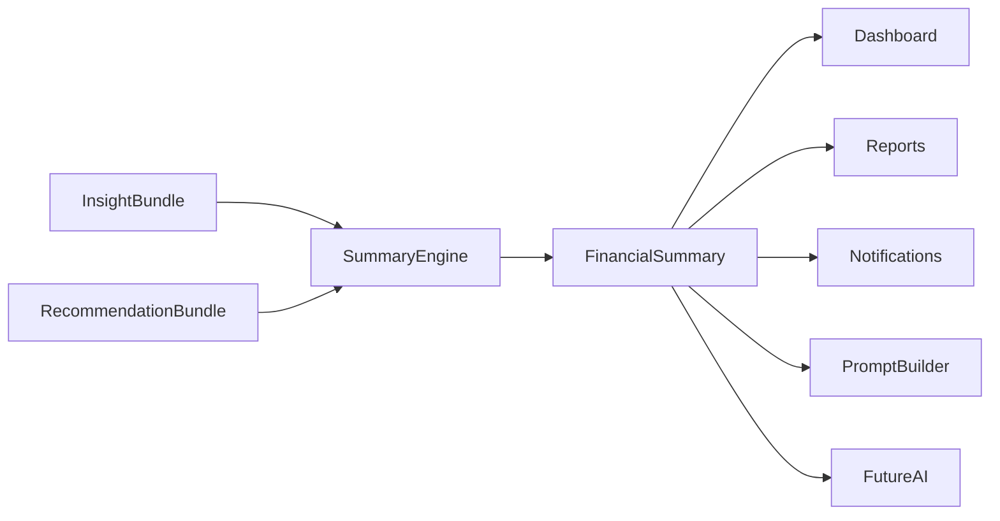
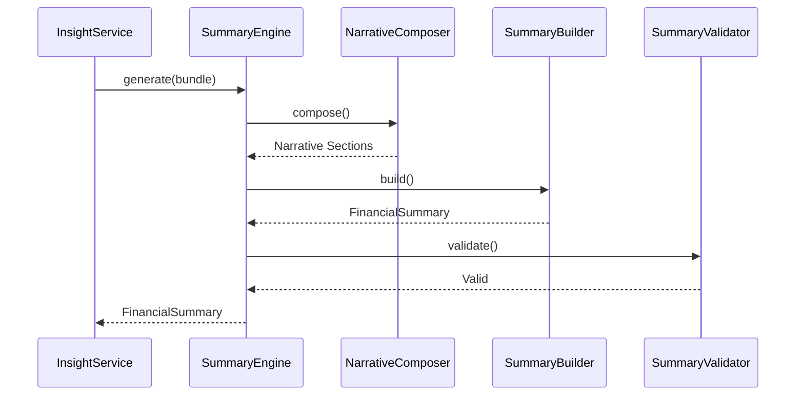
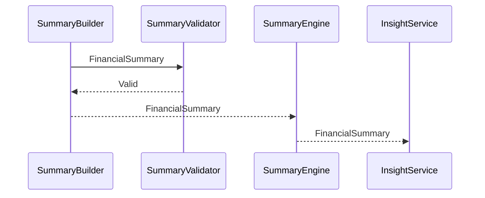
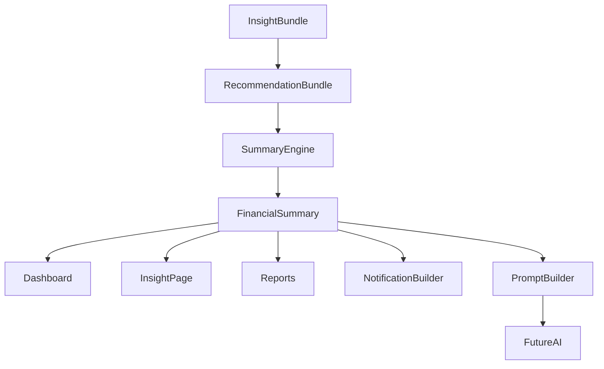
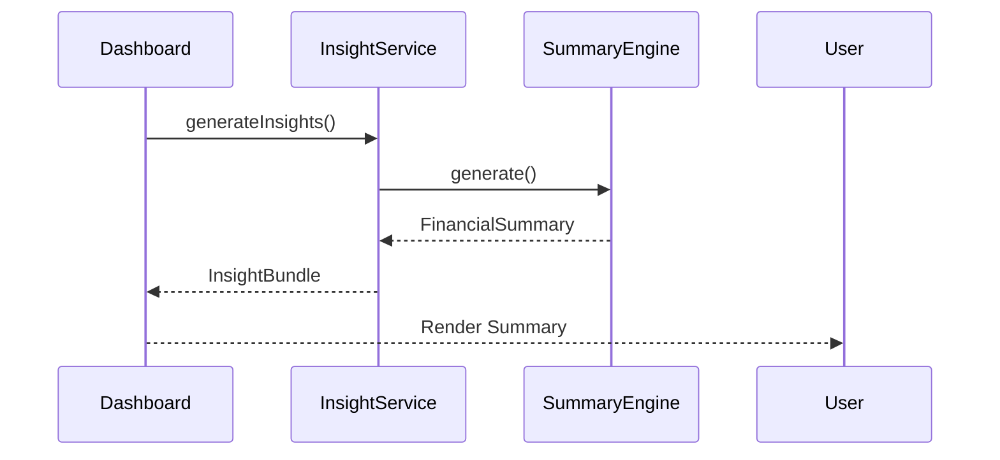

# 11 — Summary Engine Architecture (Part I)

> **Document Version:** 2.0.0
> **Status:** Draft — Architecture Review Pending
>
> **Parent Documents**
>
> * `00-PesoPilot-v2.0-Source-of-Truth.md`
> * `01-Rule-Based-Financial-Intelligence-Architecture.md`
> * `02-InsightBundle-and-Data-Contracts.md`
> * `03-Insight-Engine-Architecture.md`
> * `04-Rule-Engine-Architecture.md`
> * `05-Health-Engine-Architecture.md`
> * `06-Income-Engine-Architecture.md`
> * `07-Expense-Engine-Architecture.md`
> * `08-Savings-&-Goal-Engine-Architecture.md`
> * `09-Cashflow-&-Cutoff-Engine-Architecture.md`
> * `10-Recommendation-Engine-Architecture.md`
>
> **Phase**
>
> Phase 11A — Rule-Based Financial Intelligence
>
> **Section**
>
> Introduction, Summary Philosophy, Responsibilities & Overall Summary Architecture

---

# 1. Purpose

The Summary Engine is the narrative layer of the PesoPilot Financial Intelligence Platform.

While previous engines answer questions such as:

* What happened?
* Why did it happen?
* How healthy are the finances?
* What should the user do next?

the Summary Engine answers:

> **"How do we communicate all of this clearly to the user?"**

The Summary Engine does not calculate financial values.

It does not evaluate financial health.

It does not generate recommendations.

Instead, it transforms deterministic financial intelligence into a coherent, human-readable financial narrative.

---

# 2. Position Within the Financial Intelligence Platform

The Summary Engine is the final deterministic layer before conversational AI.

```mermaid
flowchart TD

Financial Records

-->

Insight Engines

Insight Engines

-->

InsightBundle

InsightBundle

-->

RecommendationEngine

RecommendationEngine

-->

RecommendationBundle

RecommendationBundle

-->

SummaryEngine

SummaryEngine

-->

FinancialSummary

FinancialSummary

-->

Dashboard

FinancialSummary

-->

Reports

FinancialSummary

-->

Notifications

FinancialSummary

-->

PromptBuilder

PromptBuilder

-->

FutureAI
```

Unlike previous engines,

the Summary Engine never generates new financial intelligence.

It communicates existing intelligence.

---

# 3. Summary Philosophy

Financial intelligence should be understandable.

Users should never need to interpret dozens of DTOs, percentages, or RuleResults.

Instead,

the system should explain:

* current financial position,
* important risks,
* positive achievements,
* recommended actions,

using one consistent financial narrative.

---

# 4. Guiding Principles

The Summary Engine follows nine architectural principles.

---

## 4.1 Facts Before Narrative

Every sentence must originate from deterministic financial intelligence.

No sentence may introduce new financial facts.

---

## 4.2 Narrative Without Interpretation

The Summary Engine communicates.

It does not analyze.

Analysis belongs to:

* Health Engine
* Income Engine
* Expense Engine
* Savings Engine
* Cashflow Engine
* Recommendation Engine

---

## 4.3 Deterministic Composition

Identical inputs must always produce identical FinancialSummary objects.

No randomness.

No AI.

No language model participation.

---

## 4.4 Consistent Narrative Structure

Every summary follows the same hierarchy.

Users should immediately recognize where:

* financial position,
* risks,
* achievements,
* actions,

appear in every report.

---

## 4.5 Readability

The Summary Engine should prioritize:

* clarity,
* brevity,
* consistency,
* professionalism.

Technical financial terminology should be avoided where simpler wording is sufficient.

---

## 4.6 Explainability

Every paragraph must be traceable back to:

* InsightBundle,
* RecommendationBundle,
* deterministic evidence.

---

## 4.7 Reusability

FinancialSummary should be reusable by:

* Dashboard
* Monthly Reports
* Notifications
* Email Reports
* Prompt Builder
* AI Financial Coach

Narratives are generated once and reused everywhere.

---

## 4.8 Separation of Responsibility

The Summary Engine never:

* recalculates metrics,
* changes recommendation priorities,
* generates recommendations,
* performs financial forecasting.

Its sole responsibility is narrative composition.

---

## 4.9 AI-Ready Architecture

The Summary Engine becomes the deterministic narrative layer consumed by the future AI Financial Coach.

The AI personalizes the conversation.

The Summary Engine defines the financial story.

---

# 5. Narrative Philosophy

Unlike previous engines,

the Summary Engine does not process Rules.

It processes narratives.

The objective is to transform structured financial intelligence into a logical financial story.

Example

Instead of

```text
Remaining Cash

₱5,000

Runway

3 Days

Recommendation

Reduce Spending
```

the Summary Engine produces

```text
You currently have ₱5,000 remaining before your next payday.

Based on your current spending pace, this amount may not comfortably last until your next salary.

Reducing discretionary spending during the remainder of this salary cycle is recommended.
```

---

# 6. Narrative Hierarchy

Every FinancialSummary follows the same hierarchy.

```mermaid
flowchart TD

Executive Summary

-->

Current Financial Position

-->

Financial Highlights

-->

Risks

-->

Positive Observations

-->

Priority Actions

-->

Closing Summary
```

This hierarchy remains consistent across every execution.

---

# 7. Responsibilities

The Summary Engine owns:

* narrative composition,
* section ordering,
* paragraph generation,
* summary assembly,
* FinancialSummary construction,
* summary validation.

The Summary Engine does **not** own:

* financial calculations,
* recommendations,
* AI conversations,
* financial forecasting,
* persistence,
* notifications,
* Dashboard rendering.

---

# 8. Inputs

The Summary Engine receives two immutable objects.

```text
InsightBundle

+

RecommendationBundle
```

Relevant information includes:

* HealthInsight
* IncomeInsight
* ExpenseInsight
* SavingsInsight
* CashflowInsight
* RecommendationBundle

The Summary Engine never communicates directly with repositories, IndexedDB, React, Zustand, browser APIs, or AI services.

---

# 9. Outputs

The Summary Engine produces one public DTO.

```text
FinancialSummary

├── Executive Summary

├── Financial Highlights

├── Priority Actions

├── Positive Observations

├── Risks

├── Closing Summary

├── Diagnostics

└── Metadata
```

FinancialSummary becomes the narrative representation of the user's financial state.

---

# 10. High-Level Pipeline

```mermaid
flowchart TD

InsightBundle

-->

RecommendationBundle

InsightBundle

-->

Narrative Sections

RecommendationBundle

-->

Narrative Sections

Narrative Sections

-->

Narrative Composer

Narrative Composer

-->

Summary Builder

Summary Builder

-->

Summary Validator

Summary Validator

-->

FinancialSummary
```

Unlike previous engines,

the Summary Engine builds stories rather than calculations.

---

# 11. Internal Components

```text
Summary Engine

├── Narrative Section Builder

├── Narrative Composer

├── Summary Builder

├── Summary Validator

└── Template Registry
```

Each component owns one responsibility.

---

# 12. Relationship with Other Engines



The Summary Engine consumes deterministic intelligence but never modifies it.

---

# 13. FinancialSummary Responsibilities

FinancialSummary answers questions such as:

* How is the user's overall financial situation?
* What are the most important financial highlights?
* What financial risks require attention?
* Which recommendations should the user prioritize?
* What positive financial behaviors should continue?

FinancialSummary intentionally avoids conversational dialogue.

That responsibility belongs to the future AI Financial Coach.

---

# 14. Overall Summary Architecture



---

# 15. Future Evolution

The Summary Engine is intentionally designed for future expansion.

Future capabilities may include:

* monthly financial reports,
* annual financial reviews,
* goal progress summaries,
* executive financial dashboards,
* personalized narrative styles,
* multilingual summaries,
* adaptive reading levels,
* PDF financial reports,
* email financial digests,
* AI-assisted conversational summaries.

These enhancements extend the narrative layer without changing the deterministic architecture.

---

# 16. Architecture Decision Records

## ADR-181

### Why Create a Separate Summary Engine?

**Decision**

Narrative generation is isolated from financial analysis and recommendation generation.

**Reason**

Separates communication responsibilities from business computation and decision support.

---

## ADR-182

### Why Introduce Narrative Composition?

**Decision**

Financial summaries are composed through structured narrative sections rather than string concatenation.

**Reason**

Produces consistent, readable, and maintainable financial reports.

---

## ADR-183

### Why Place the Summary Engine Before AI?

**Decision**

The Summary Engine generates deterministic narratives before AI interaction.

**Reason**

Allows AI to personalize communication while preserving factual correctness.

---

## ADR-184

### Why Standardize Narrative Hierarchy?

**Decision**

Every FinancialSummary follows the same section ordering.

**Reason**

Improves readability, consistency, and user familiarity across reports.

---

## ADR-185

### Why Separate Summary from Recommendations?

**Decision**

Recommendations determine **what** actions should be taken, while the Summary Engine determines **how** those actions are communicated.

**Reason**

Maintains a clear separation between decision-making and narrative presentation.

---

# 17. Acceptance Criteria

This section is complete when:

* Summary philosophy is documented.
* Narrative philosophy is established.
* Responsibilities are clearly separated.
* FinancialSummary is standardized.
* Narrative hierarchy is defined.
* Internal architecture is documented.
* Future extensibility is described.
* Architecture decisions are recorded.

---

# Part I Summary

Part I establishes the conceptual foundation of the Summary Engine. Unlike the deterministic Financial Intelligence and Recommendation Engines, the Summary Engine serves as PesoPilot's narrative layer, transforming structured financial intelligence into consistent, human-readable financial stories. Through narrative composition, standardized section hierarchy, summary construction, and validation, it produces the `FinancialSummary` DTO, which becomes the primary communication artifact for dashboards, reports, notifications, prompt building, and the future AI Financial Coach while preserving a strict separation between financial computation, decision support, and user communication.

---

**End of Part I**

**Next Section:** **Part II — FinancialSummary Model, Narrative Model, Summary Sections, Narrative Hierarchy & Summary Lifecycle**

# 11 — Summary Engine Architecture (Part II)

> **Document Version:** 2.0.0
> **Status:** Draft — Architecture Review Pending
>
> **Parent Documents**
>
> * `00-PesoPilot-v2.0-Source-of-Truth.md`
> * `01-Rule-Based-Financial-Intelligence-Architecture.md`
> * `02-InsightBundle-and-Data-Contracts.md`
> * `03-Insight-Engine-Architecture.md`
> * `04-Rule-Engine-Architecture.md`
> * `05-Health-Engine-Architecture.md`
> * `06-Income-Engine-Architecture.md`
> * `07-Expense-Engine-Architecture.md`
> * `08-Savings-&-Goal-Engine-Architecture.md`
> * `09-Cashflow-&-Cutoff-Engine-Architecture.md`
> * `10-Recommendation-Engine-Architecture.md`
>
> **Phase**
>
> Phase 11A — Rule-Based Financial Intelligence
>
> **Section**
>
> FinancialSummary Model, Narrative Model, Summary Sections, Narrative Hierarchy & Summary Lifecycle

---

# 18. Purpose

Part I introduced the philosophy and architecture of the Summary Engine.

This section defines **what a FinancialSummary actually is**.

Rather than representing a summary as plain text,

PesoPilot models it as a structured narrative object composed of deterministic sections.

This allows summaries to be:

* reusable,
* explainable,
* testable,
* AI-ready,
* presentation-independent.

---

# 19. FinancialSummary Philosophy

A FinancialSummary is **not** a chatbot response.

A FinancialSummary is **not** an AI-generated paragraph.

A FinancialSummary is

> **the deterministic narrative representation of validated financial intelligence.**

It transforms structured financial observations into structured communication.

---

# 20. Narrative Model

Every FinancialSummary follows the same domain model.

```text
FinancialSummary

├── Executive Summary
├── Current Financial Position
├── Financial Highlights
├── Risks
├── Positive Observations
├── Priority Actions
├── Closing Summary
├── Metadata
├── Diagnostics
└── Version
```

Each section owns one communication responsibility.

---

# 21. FinancialSummary Lifecycle

Every FinancialSummary progresses through the same deterministic lifecycle.

```mermaid
flowchart LR

InsightBundle

-->

RecommendationBundle

-->

Narrative Sections

-->

Narrative Composition

-->

Summary Assembly

-->

Validation

-->

FinancialSummary
```

Unlike RecommendationBundle,

FinancialSummary contains narrative rather than decision-support objects.

---

# 22. Executive Summary

The Executive Summary is always the first section.

Purpose

Provide a concise overview of the user's overall financial condition.

Example

```text
Your finances remain generally healthy this salary cycle.

Cashflow remains stable, savings contributions continue consistently, and your highest priority is maintaining controlled discretionary spending until your next payday.
```

Characteristics

* one paragraph,
* concise,
* high-level,
* deterministic.

---

# 23. Current Financial Position

This section describes the user's present financial state.

Typical topics

* Remaining Cash
* Salary Cutoff
* Spending Pace
* Financial Health
* Financial Runway

Example

```text
You currently have ₱27,000 remaining before your next payday.

Your spending pace remains aligned with your salary cutoff, indicating stable financial management.
```

---

# 24. Financial Highlights

Highlights summarize the most important positive financial observations.

Examples

```text
Savings contributions increased.

Cashflow remains stable.

Expense growth slowed.

Financial Health improved.
```

Highlights celebrate progress.

They do not contain advice.

---

# 25. Risks

The Risk section summarizes financial concerns.

Examples

```text
Remaining cash is approaching the healthy threshold.

Dining expenses continue increasing.

Financial runway has shortened compared to the previous cutoff.
```

Risks remain factual.

Recommendations belong elsewhere.

---

# 26. Positive Observations

Positive Observations reinforce healthy financial behavior.

Examples

```text
You maintained consistent savings.

Essential expenses remained under budget.

Cashflow improved compared to your previous salary cutoff.
```

This section promotes positive reinforcement.

---

# 27. Priority Actions

Priority Actions summarize the highest-ranked recommendations.

Example

```text
Reduce discretionary spending until your next payday.

Maintain your emergency fund contributions.

Avoid large discretionary purchases this week.
```

The Summary Engine never invents these actions.

They originate from RecommendationBundle.

---

# 28. Closing Summary

The Closing Summary provides the final deterministic narrative.

Example

```text
Overall, your finances remain stable.

Continuing your current spending discipline while maintaining regular savings contributions should keep your financial position healthy throughout the remainder of this salary cycle.
```

The Closing Summary should leave the user with a clear understanding of their overall financial direction.

---

# 29. Narrative Sections

Internally,

every section is modeled independently.

```text
Narrative Section

├── Section Type

├── Title

├── Paragraphs

├── Related Insights

├── Related Recommendations

└── Metadata
```

Sections are later assembled into FinancialSummary.

---

# 30. Narrative Hierarchy

Narratives always follow the same order.

```mermaid
flowchart TD

Executive Summary

-->

Current Financial Position

-->

Financial Highlights

-->

Risks

-->

Positive Observations

-->

Priority Actions

-->

Closing Summary
```

Section order never depends on recommendation order.

---

# 31. Narrative Composition Rules

The Summary Engine follows deterministic composition rules.

Examples

* Executive Summary always appears first.
* Closing Summary always appears last.
* Risks never precede the Executive Summary.
* Priority Actions always follow Risks.
* Positive Observations always precede Priority Actions.

These rules ensure consistent reading flow.

---

# 32. Narrative Paragraph Model

Each narrative paragraph follows a standard structure.

```text
Narrative Paragraph

├── Statement

├── Supporting Evidence

├── Related Insights

└── Metadata
```

Paragraphs remain independently traceable.

---

# 33. Narrative Length

Phase 11A defines three summary sizes.

```text
Compact

Standard

Detailed
```

Typical usage

| Format   | Purpose      |
| -------- | ------------ |
| Compact  | Dashboard    |
| Standard | Insight Page |
| Detailed | Reports      |

All formats originate from the same FinancialSummary.

---

# 34. Narrative Tone

The Summary Engine uses one deterministic tone.

Characteristics

* professional,
* supportive,
* objective,
* encouraging,
* non-judgmental.

It avoids:

* emotional language,
* fear-based wording,
* speculation,
* financial guarantees.

---

# 35. Narrative Evidence

Every narrative paragraph references deterministic evidence.

Example

```text
Statement

Remaining cash remains healthy.

Evidence

Remaining Cash

₱27,000

Runway

13 Days

Related Insight

CashflowInsight
```

Narratives remain fully explainable.

---

# 36. FinancialSummary Metadata

Each FinancialSummary exposes metadata.

```text
FinancialSummary Metadata

├── Summary ID

├── Summary Type

├── Narrative Version

├── Generated At

├── Engine Version

└── Language
```

Metadata supports diagnostics and future localization.

---

# 37. Narrative Variants

Future versions may introduce:

```text
Executive

Professional

Simple

Student

Family

Business Owner

Retirement

Custom
```

These variants change communication style without changing financial facts.

---

# 38. Narrative Localization

Future localization supports:

* English,
* Filipino,
* Japanese,
* multilingual summaries.

Localization changes wording only.

Financial facts remain identical.

---

# 39. Summary Lifecycle States

Internally,

FinancialSummary progresses through:

```text
Sections Built

↓

Composed

↓

Assembled

↓

Validated

↓

Published
```

Only Published summaries leave the Summary Engine.

---

# 40. Future Narrative Metadata

Future versions may include:

```text
Reading Time

Accessibility Score

Complexity Level

Tone

Localization

Reading Level

AI Compatibility
```

These additions extend metadata without changing the FinancialSummary contract.

---

# 41. Architecture Decision Records

## ADR-186

### Why Model FinancialSummary as a Domain Object?

**Decision**

FinancialSummary is treated as a structured business entity rather than a text blob.

**Reason**

Improves reuse, testing, localization, reporting, and AI integration.

---

## ADR-187

### Why Separate Narrative Sections?

**Decision**

Each summary section has a dedicated responsibility.

**Reason**

Supports multiple presentation formats and improves maintainability.

---

## ADR-188

### Why Standardize Narrative Hierarchy?

**Decision**

Financial summaries always follow the same communication order.

**Reason**

Creates predictable, readable, executive-quality financial reports.

---

## ADR-189

### Why Separate Narrative Tone from Financial Facts?

**Decision**

Tone may evolve independently of financial intelligence.

**Reason**

Supports localization and personalization without affecting correctness.

---

## ADR-190

### Why Support Multiple Narrative Sizes?

**Decision**

One FinancialSummary supports Compact, Standard, and Detailed presentations.

**Reason**

Allows different UI surfaces to reuse the same deterministic narrative model.

---

# 42. Acceptance Criteria

This section is complete when:

* FinancialSummary model is standardized.
* Narrative model is documented.
* Summary sections are defined.
* Narrative hierarchy is established.
* Narrative lifecycle is specified.
* Paragraph model is documented.
* Metadata is standardized.
* Future extensibility is documented.

---

# Part II Summary

Part II defines the Summary Engine's domain model by establishing `FinancialSummary` as a first-class narrative object within the PesoPilot architecture. Rather than producing unstructured text, the Summary Engine constructs deterministic narrative sections that communicate financial intelligence through a standardized hierarchy, reusable paragraph model, and consistent presentation contract. This architecture enables dashboards, reports, notifications, localization, and future AI coaching to consume the same structured financial narrative while preserving deterministic behavior and complete traceability.

---

**End of Part II**

**Next Section:** **Part III — Summary Builder Pipeline, Narrative Composer, Summary Rules, Template Registry & Narrative Assembly**

# 11 — Summary Engine Architecture (Part III)

> **Document Version:** 2.0.0
> **Status:** Draft — Architecture Review Pending
>
> **Parent Documents**
>
> * `00-PesoPilot-v2.0-Source-of-Truth.md`
> * `01-Rule-Based-Financial-Intelligence-Architecture.md`
> * `02-InsightBundle-and-Data-Contracts.md`
> * `03-Insight-Engine-Architecture.md`
> * `04-Rule-Engine-Architecture.md`
> * `05-Health-Engine-Architecture.md`
> * `06-Income-Engine-Architecture.md`
> * `07-Expense-Engine-Architecture.md`
> * `08-Savings-&-Goal-Engine-Architecture.md`
> * `09-Cashflow-&-Cutoff-Engine-Architecture.md`
> * `10-Recommendation-Engine-Architecture.md`
>
> **Phase**
>
> Phase 11A — Rule-Based Financial Intelligence
>
> **Section**
>
> Summary Builder Pipeline, Narrative Composer, Summary Rules, Template Registry & Narrative Assembly

---

# 43. Purpose

Part II defined the FinancialSummary domain model.

This section defines **how the Summary Engine constructs that model**.

Unlike the previous engines,

the Summary Engine does not execute financial Rules.

Instead,

it composes deterministic narratives using:

* InsightBundle,
* RecommendationBundle,
* narrative templates,
* narrative composition rules,
* deterministic assembly.

---

# 44. Narrative Composition Philosophy

Narrative composition transforms structured financial intelligence into structured communication.

Instead of exposing:

```text id="pcw4ba"
CashflowInsight

RecommendationBundle

HealthInsight
```

the Summary Engine produces

```text id="edhdb7"
Executive Summary

Financial Position

Highlights

Risks

Priority Actions

Closing Summary
```

Composition emphasizes readability rather than computation.

---

# 45. Summary Builder Pipeline

The Summary Engine follows a deterministic pipeline.

```mermaid id="q4af1r"
flowchart TD

InsightBundle

-->

RecommendationBundle

InsightBundle

-->

Narrative Section Builder

RecommendationBundle

-->

Narrative Section Builder

Narrative Section Builder

-->

Narrative Composer

Narrative Composer

-->

Template Registry

Template Registry

-->

Summary Builder

Summary Builder

-->

Summary Validator

Summary Validator

-->

FinancialSummary
```

Each stage owns exactly one responsibility.

---

# 46. Internal Components

```text id="4xwl4d"
Summary Engine

├── Narrative Section Builder

├── Narrative Composer

├── Template Registry

├── Summary Builder

└── Summary Validator
```

These components replace the Rule Engine architecture used by previous documents.

---

# 47. Narrative Section Builder

The Narrative Section Builder extracts structured narrative inputs.

Inputs

```text id="xtchmq"
InsightBundle

RecommendationBundle
```

Outputs

```text id="wkp8k2"
Executive Summary Section

Financial Position Section

Highlights Section

Risk Section

Priority Actions Section

Closing Section
```

The builder performs extraction only.

No narrative wording occurs here.

---

# 48. Narrative Composer

The Narrative Composer is the heart of the Summary Engine.

Responsibilities

* determine section order,
* merge narrative fragments,
* apply composition rules,
* maintain logical reading flow,
* eliminate duplicate statements,
* prepare template variables.

The Composer never creates financial facts.

---

# 49. Narrative Composition Pipeline

```mermaid id="2uik8m"
flowchart LR

Narrative Sections

-->

Narrative Composer

-->

Ordered Sections

-->

Summary Builder
```

Narrative ordering remains deterministic.

---

# 50. Narrative Composition Rules

The Composer follows deterministic rules.

Examples

* Executive Summary always first.
* Closing Summary always last.
* Risks never precede Financial Position.
* Positive Observations always precede Priority Actions.
* Empty sections are omitted.
* Duplicate observations are merged.
* Contradictory wording is rejected.

These rules guarantee consistency.

---

# 51. Narrative Deduplication

Example

Input

```text id="y0nxt6"
Cashflow

Healthy

Health

Healthy
```

Output

```text id="nqarfq"
Your financial position remains healthy this salary cycle.
```

The Summary Engine communicates each observation once.

---

# 52. Narrative Prioritization

Narratives follow business importance.

Priority order

```text id="5ajcgv"
Executive Summary

↓

Current Position

↓

Critical Risks

↓

Positive Highlights

↓

Priority Actions

↓

Closing Summary
```

Narrative priority is independent of Recommendation priority.

---

# 53. Template Registry

The Summary Engine owns one Template Registry.

```mermaid id="nv2zsk"
flowchart TD

Narrative Composer

-->

Template Registry

Template Registry

-->

Narrative Templates

Narrative Templates

-->

Summary Builder
```

Templates separate financial facts from wording.

---

# 54. Template Philosophy

Templates contain language.

Insights contain facts.

Recommendations contain actions.

The Summary Engine combines them.

Example

Template

```text id="sk5oqs"
You currently have {remainingCash} remaining before your next payday.
```

Variables

```text id="tkvzrf"
remainingCash

↓

₱27,000
```

Output

```text id="t12twy"
You currently have ₱27,000 remaining before your next payday.
```

---

# 55. Template Categories

Phase 11A templates include:

```text id="zkjlwm"
Executive Summary

Financial Position

Financial Highlights

Risks

Positive Observations

Priority Actions

Closing Summary

Empty State
```

Each category contains deterministic templates.

---

# 56. Template Selection

Template selection depends on:

```text id="b4qlqv"
Section Type

↓

Financial Situation

↓

Available Variables

↓

Narrative Template
```

Selection never depends on AI.

---

# 57. Summary Rules

Unlike Recommendation Rules,

Summary Rules define communication behavior.

Examples

```text id="9zwylu"
Merge Similar Statements

Hide Empty Sections

Limit Paragraph Length

Avoid Duplicate Evidence

Prefer Positive Wording

Respect Narrative Hierarchy
```

Summary Rules never calculate financial values.

---

# 58. Paragraph Assembly

Each paragraph follows the same pattern.

```text id="fx9ej5"
Observation

↓

Supporting Context

↓

Action (optional)
```

Example

```text id="zpfbws"
Remaining cash remains healthy.

Your spending pace is aligned with your salary cutoff.

Continue maintaining your current spending discipline.
```

---

# 59. Executive Summary Assembly

Executive Summary combines:

* Financial Health
* Cashflow
* Highest Recommendation

Pipeline

```mermaid id="h5z03i"
flowchart LR

HealthInsight

-->

Executive Summary

CashflowInsight

-->

Executive Summary

Highest Recommendation

-->

Executive Summary
```

---

# 60. Financial Highlights Assembly

Highlights combine:

* positive Health observations,
* Income improvements,
* Savings improvements,
* Expense improvements,
* Goal milestones.

The section emphasizes progress rather than coaching.

---

# 61. Risk Assembly

Risk section combines:

* Health warnings,
* Cashflow risks,
* Expense concerns,
* Savings concerns,
* Goal risks.

Risk statements remain factual.

---

# 62. Priority Action Assembly

Priority Actions originate exclusively from RecommendationBundle.

Example

```text id="vpsuv8"
RecommendationBundle

↓

Top Recommendations

↓

Priority Actions Section
```

The Summary Engine never invents new actions.

---

# 63. Closing Summary Assembly

Closing Summary combines:

* overall financial direction,
* encouragement,
* long-term outlook.

Example

```text id="uyjlwm"
Overall, your financial position remains stable.

Maintaining your current savings habits while following your priority recommendations should support continued financial improvement.
```

---

# 64. Summary Builder

The Summary Builder assembles ordered sections.

```mermaid id="pcjquh"
flowchart TD

Ordered Sections

-->

Summary Builder

Summary Builder

-->

FinancialSummary
```

The Builder performs no financial analysis.

---

# 65. Summary Validator

Validator verifies:

Required sections

* Executive Summary
* Closing Summary

Required metadata

* Version
* Generated Time
* Diagnostics

Narrative quality

* no duplicate sections,
* valid ordering,
* valid references,
* complete metadata.

---

# 66. Empty Summary Handling

Example

```text id="8kb0n8"
FinancialSummary

Executive Summary

No financial summary is currently available because insufficient financial data has been recorded.

Priority Actions

None
```

The Summary Engine must never fabricate narratives.

---

# 67. Template Versioning

Every template exposes:

```text id="2vgvwz"
Template ID

Template Version

Language

Category
```

Versioning enables localization and future template evolution.

---

# 68. Future Template Registry

Future templates may include:

```text id="jlwm53"
Monthly Report

Weekly Report

Goal Achievement

Budget Review

Retirement Summary

Investment Summary

Family Finance

Business Finance
```

The registry expands without changing Summary Engine architecture.

---

# 69. Architecture Decision Records

## ADR-191

### Why Introduce a Narrative Composer?

**Decision**

Narrative composition is isolated into a dedicated component.

**Reason**

Separates financial communication from section extraction and DTO construction.

---

## ADR-192

### Why Introduce a Template Registry?

**Decision**

Financial wording is externalized into reusable templates.

**Reason**

Supports localization, consistency, maintenance, and future personalization.

---

## ADR-193

### Why Keep Summary Rules Separate from Financial Rules?

**Decision**

Summary Rules govern communication rather than financial analysis.

**Reason**

Maintains a strict separation between computation and presentation.

---

## ADR-194

### Why Assemble Sections Instead of Paragraphs?

**Decision**

Narratives are composed from structured sections.

**Reason**

Supports multiple presentation formats and improves maintainability.

---

## ADR-195

### Why Prohibit Narrative Fabrication?

**Decision**

Every narrative sentence must be traceable to deterministic financial intelligence.

**Reason**

Preserves user trust and prepares the architecture for safe AI-assisted communication.

---

# 70. Acceptance Criteria

This section is complete when:

* Summary Builder pipeline is documented.
* Narrative Composer responsibilities are defined.
* Template Registry is specified.
* Summary Rules are documented.
* Narrative assembly process is standardized.
* Validation requirements are established.
* Template versioning is documented.
* Future extensibility is defined.

---

# Part III Summary

Part III defines the composition architecture of the Summary Engine. Rather than executing financial rules, the engine transforms structured financial intelligence into structured communication through deterministic narrative composition. Using the Narrative Section Builder, Narrative Composer, Template Registry, Summary Builder, and Summary Validator, the engine assembles executive-quality financial narratives that remain fully traceable to underlying financial evidence. This architecture establishes a clear separation between financial computation, recommendation generation, and narrative communication, enabling consistent reporting, localization, and future AI-assisted financial conversations without compromising deterministic correctness.

---

**End of Part III**

**Next Section:** **Part IV — FinancialSummary DTO, Dashboard Integration, Reports, Notifications, AI Integration & Explanation Generation**

# 11 — Summary Engine Architecture (Part IV)

> **Document Version:** 2.0.0
> **Status:** Draft — Architecture Review Pending
>
> **Parent Documents**
>
> * `00-PesoPilot-v2.0-Source-of-Truth.md`
> * `01-Rule-Based-Financial-Intelligence-Architecture.md`
> * `02-InsightBundle-and-Data-Contracts.md`
> * `03-Insight-Engine-Architecture.md`
> * `04-Rule-Engine-Architecture.md`
> * `05-Health-Engine-Architecture.md`
> * `06-Income-Engine-Architecture.md`
> * `07-Expense-Engine-Architecture.md`
> * `08-Savings-&-Goal-Engine-Architecture.md`
> * `09-Cashflow-&-Cutoff-Engine-Architecture.md`
> * `10-Recommendation-Engine-Architecture.md`
>
> **Phase**
>
> Phase 11A — Rule-Based Financial Intelligence
>
> **Section**
>
> FinancialSummary DTO, Dashboard Integration, Reports, Notifications, AI Integration & Explanation Generation

---

# 71. Purpose

The previous sections defined:

* Summary philosophy,
* FinancialSummary model,
* Narrative model,
* Summary Builder pipeline,
* Narrative Composer,
* Template Registry.

This section defines how the completed **FinancialSummary** is consumed throughout the PesoPilot platform.

Unlike previous stages,

the Summary Engine now exposes a reusable communication artifact instead of internal narrative components.

---

# 72. FinancialSummary DTO Philosophy

The Summary Engine does not expose:

* Narrative Sections,
* Template variables,
* Composition state.

Instead,

it exposes one finalized communication object.

```text
FinancialSummary
```

Every consumer receives the same deterministic financial narrative.

---

# 73. FinancialSummary DTO

```text
FinancialSummary

├── Executive Summary
├── Current Financial Position
├── Financial Highlights
├── Risks
├── Positive Observations
├── Priority Actions
├── Closing Summary
├── Diagnostics
├── Metadata
└── Version
```

This DTO becomes the official communication contract of PesoPilot.

---

# 74. FinancialSummary Lifecycle



Only validated summaries leave the Summary Engine.

---

# 75. Summary Validator Responsibilities

The Validator verifies:

Required sections

* Executive Summary
* Current Financial Position
* Closing Summary

Required metadata

* Version
* Engine Version
* Generated Time
* Diagnostics

Narrative quality

* section ordering,
* duplicate removal,
* empty section handling,
* valid references.

Invalid summaries are rejected.

---

# 76. Dashboard Integration

The Dashboard consumes FinancialSummary directly.

```mermaid
flowchart LR

FinancialSummary

-->

Dashboard

Dashboard

-->

Executive Card

Dashboard

-->

Highlights

Dashboard

-->

Priority Actions

Dashboard

-->

Summary Card
```

Dashboard components never reconstruct narratives.

---

# 77. Dashboard Components

FinancialSummary powers:

```text
Executive Summary Card

Current Financial Position Card

Financial Highlights Card

Priority Actions Card

Closing Summary Card
```

The Dashboard selects only the sections it needs.

---

# 78. Insight Page Integration

The Insight Page exposes the complete FinancialSummary.

```mermaid
flowchart TD

FinancialSummary

-->

Insight Page

Insight Page

-->

All Narrative Sections

Insight Page

-->

Supporting Evidence

Insight Page

-->

Diagnostics

Insight Page

-->

Metadata
```

Unlike the Dashboard,

the Insight Page presents the entire narrative.

---

# 79. Report Generation

Future reports reuse FinancialSummary.

Example

```text
Monthly Report

↓

Executive Summary

↓

Financial Position

↓

Highlights

↓

Risks

↓

Priority Actions

↓

Closing Summary
```

No report-specific narrative generation occurs.

---

# 80. PDF Report Integration

Future PDF reports consume:

```text
FinancialSummary

↓

PDF Generator

↓

Monthly Financial Report
```

The Summary Engine remains independent of PDF generation.

---

# 81. Email Report Integration

Future email reports consume:

```text
FinancialSummary

↓

Email Formatter

↓

Weekly Digest

↓

Monthly Financial Report

↓

Year-End Review
```

Formatting belongs to the Email layer.

---

# 82. Notification Integration

Notifications consume only relevant sections.

Example

```text
Priority Actions

↓

Notification Builder

↓

Push Notification
```

Example notification

```text
Protect your remaining cash by reducing discretionary spending until your next payday.
```

The Summary Engine never sends notifications.

---

# 83. Financial Report Architecture

```mermaid
flowchart TD

FinancialSummary

-->

Report Builder

Report Builder

-->

Monthly Report

Report Builder

-->

Annual Report

Report Builder

-->

Goal Progress Report

Report Builder

-->

Executive Report
```

One FinancialSummary supports multiple reporting formats.

---

# 84. Explanation Generation

Unlike Recommendation explanations,

FinancialSummary explanations communicate the entire financial story.

Example

```text
Your finances remain stable throughout the current salary cycle.

Cashflow remains healthy, savings continue to improve, and your highest priority is maintaining your current spending discipline until your next payday.
```

Every sentence originates from deterministic financial intelligence.

---

# 85. Explanation Hierarchy

Every FinancialSummary follows:

```text
Executive Summary

↓

Financial Position

↓

Highlights

↓

Risks

↓

Priority Actions

↓

Closing Summary
```

Narrative ordering never changes.

---

# 86. Explanation Traceability

Every paragraph references:

* InsightBundle,
* RecommendationBundle,
* supporting evidence.

Example

```text
Executive Summary

↓

HealthInsight

CashflowInsight

RecommendationBundle
```

This enables complete explainability.

---

# 87. Prompt Builder Integration

The Prompt Builder consumes:

```text
FinancialSummary

+

RecommendationBundle

+

InsightBundle

↓

AI Prompt
```

The Prompt Builder becomes the only AI-facing orchestration layer.

---

# 88. AI Financial Coach Integration

Future architecture

```mermaid
flowchart LR

InsightBundle

-->

RecommendationBundle

RecommendationBundle

-->

FinancialSummary

FinancialSummary

-->

Prompt Builder

Prompt Builder

-->

LLM

LLM

-->

AI Financial Coach
```

The AI receives:

* facts,
* recommendations,
* narrative.

It does **not** reconstruct them.

---

# 89. AI Responsibilities

Future AI may:

* explain recommendations,
* personalize communication,
* answer follow-up questions,
* simplify financial terminology,
* motivate the user.

The AI must never:

* generate financial calculations,
* change priorities,
* override recommendations,
* modify FinancialSummary.

---

# 90. Empty Summary Handling

When insufficient data exists:

```text
Executive Summary

Not enough financial information is currently available to generate a financial summary.

Priority Actions

None
```

The Summary Engine never fabricates narratives.

---

# 91. Summary History

Future versions may store:

```text
FinancialSummary

↓

Weekly History

↓

Monthly History

↓

Annual History
```

History enables longitudinal financial storytelling.

---

# 92. Narrative Analytics

Future analytics may include:

```text
Summary Generated

↓

Summary Viewed

↓

Report Exported

↓

Recommendation Accepted

↓

Goal Completed
```

Analytics remain outside Phase 11A.

---

# 93. Diagnostics

FinancialSummary exposes:

```text
Narrative Version

Template Version

Engine Version

Generated Time

Execution Time

Warnings

Language
```

Diagnostics support debugging and localization.

---

# 94. Future Communication Channels

Future consumers may include:

```text
Smart Widgets

Wearables

Voice Assistant

SMS

Slack

Discord

WhatsApp

Desktop Widgets
```

The communication contract remains unchanged.

---

# 95. Architecture Decision Records

## ADR-196

### Why Make FinancialSummary the Communication Contract?

**Decision**

FinancialSummary is the single communication artifact exposed by the Summary Engine.

**Reason**

Provides a stable interface for all presentation channels.

---

## ADR-197

### Why Separate Narrative Generation from Presentation?

**Decision**

The Summary Engine produces narratives while presentation layers control rendering.

**Reason**

Supports dashboards, reports, notifications, and AI without duplicating logic.

---

## ADR-198

### Why Integrate AI Through FinancialSummary?

**Decision**

The Prompt Builder receives completed narratives rather than low-level DTOs.

**Reason**

Reduces prompt complexity and lowers hallucination risk.

---

## ADR-199

### Why Support Multiple Communication Channels?

**Decision**

FinancialSummary is designed for reuse across every delivery platform.

**Reason**

Future expansion should not require changes to the Summary Engine.

---

## ADR-200

### Why Preserve Deterministic Narratives?

**Decision**

Narratives remain deterministic even when consumed by AI.

**Reason**

Financial communication should remain traceable, reproducible, and trustworthy.

---

# 96. Acceptance Criteria

This section is complete when:

* FinancialSummary DTO is standardized.
* Dashboard integration is documented.
* Report architecture is documented.
* Notification integration is defined.
* AI integration architecture is documented.
* Explanation generation is documented.
* Communication channels are standardized.
* Future extensibility is established.

---

# Part IV Summary

Part IV defines how the `FinancialSummary` becomes the primary communication artifact of the PesoPilot platform. Through a standardized DTO, deterministic validation, reusable narrative sections, and integration with dashboards, reports, notifications, prompt building, and the future AI Financial Coach, the Summary Engine establishes a stable communication layer between financial intelligence and every user-facing experience. By separating narrative generation from presentation and conversational AI, the architecture ensures consistent, explainable, and reusable financial communication across all current and future delivery channels.

---

**End of Part IV**

**Next Section:** **Part V — Testing Strategy, Future Evolution, Acceptance Criteria & Implementation Roadmap**

# 11 — Summary Engine Architecture (Part V)

> **Document Version:** 2.0.0
> **Status:** Draft — Architecture Review Pending
>
> **Parent Documents**
>
> * `00-PesoPilot-v2.0-Source-of-Truth.md`
> * `01-Rule-Based-Financial-Intelligence-Architecture.md`
> * `02-InsightBundle-and-Data-Contracts.md`
> * `03-Insight-Engine-Architecture.md`
> * `04-Rule-Engine-Architecture.md`
> * `05-Health-Engine-Architecture.md`
> * `06-Income-Engine-Architecture.md`
> * `07-Expense-Engine-Architecture.md`
> * `08-Savings-&-Goal-Engine-Architecture.md`
> * `09-Cashflow-&-Cutoff-Engine-Architecture.md`
> * `10-Recommendation-Engine-Architecture.md`
>
> **Phase**
>
> Phase 11A — Rule-Based Financial Intelligence
>
> **Section**
>
> Testing Strategy, Future Evolution, Acceptance Criteria & Implementation Roadmap

---

# 97. Purpose

The previous sections defined:

* Summary philosophy,
* FinancialSummary domain model,
* Narrative composition,
* Template Registry,
* FinancialSummary DTO,
* Dashboard integration,
* AI integration.

This final section defines how the Summary Engine should be implemented, tested, evolved, and governed throughout the PesoPilot platform.

---

# 98. Summary Engine Integration Overview

The Summary Engine is the final deterministic component before any presentation or conversational layer.



The Summary Engine is presentation-independent.

---

# 99. Dashboard Integration

Dashboard consumes FinancialSummary directly.



Dashboard components never compose narratives.

---

# 100. Dashboard Components

FinancialSummary powers:

```text
Executive Summary Card

Financial Position Card

Financial Highlights

Risk Summary

Priority Actions

Closing Summary
```

Each widget consumes one section.

---

# 101. Insight Page Integration

The Insight Page displays the complete FinancialSummary.

```mermaid
flowchart TD

FinancialSummary

-->

InsightPage

InsightPage

-->

Narrative Sections

InsightPage

-->

Evidence

InsightPage

-->

Diagnostics

InsightPage

-->

Metadata
```

Unlike Dashboard,

the Insight Page emphasizes transparency and traceability.

---

# 102. Report Generation

Future reporting architecture

```mermaid
flowchart LR

FinancialSummary

-->

Report Builder

Report Builder

-->

Monthly Report

Report Builder

-->

Quarterly Report

Report Builder

-->

Annual Report

Report Builder

-->

Goal Progress Report
```

The Summary Engine remains independent of report generation.

---

# 103. Email Integration

Future email architecture

```text
FinancialSummary

↓

Email Formatter

↓

Weekly Digest

↓

Monthly Financial Report

↓

Year-End Summary
```

Formatting belongs outside the Summary Engine.

---

# 104. Notification Integration

Notifications consume only selected narrative sections.

Example

```text
Priority Actions

↓

Notification Builder

↓

Push Notification
```

Example notification

```text
Your current spending pace may reduce your remaining cash before payday.

Consider reducing discretionary spending this week.
```

Notification delivery remains outside the Summary Engine.

---

# 105. Prompt Builder Integration

Future Prompt Builder architecture

```mermaid
flowchart TD

InsightBundle

-->

Prompt Builder

RecommendationBundle

-->

Prompt Builder

FinancialSummary

-->

Prompt Builder

Conversation Context

-->

Prompt Builder

Prompt Builder

-->

LLM
```

Prompt Builder becomes the only AI orchestration layer.

---

# 106. AI Financial Coach Integration

Future AI architecture

```mermaid
flowchart LR

FinancialSummary

-->

Prompt Builder

Prompt Builder

-->

LLM

LLM

-->

Financial Coach
```

The AI receives:

* FinancialSummary,
* RecommendationBundle,
* InsightBundle.

It does not recreate narratives.

---

# 107. AI Guardrails

Future AI implementations must follow these rules.

The AI:

* explains FinancialSummary,
* personalizes communication,
* answers questions,
* simplifies financial terminology,
* motivates users.

The AI must never:

* generate financial calculations,
* modify FinancialSummary,
* override recommendations,
* change recommendation priorities,
* fabricate financial evidence.

These guardrails preserve deterministic correctness.

---

# 108. Testing Philosophy

The Summary Engine must be fully testable without:

* React,
* IndexedDB,
* Zustand,
* Spring Boot,
* Prompt Builder,
* AI services,
* browser APIs.

Tests operate entirely on mocked InsightBundle and RecommendationBundle objects.

---

# 109. Unit Tests

Every narrative component requires dedicated unit tests.

Examples

```text
Narrative Section Builder

Narrative Composer

Template Registry

Summary Builder

Summary Validator
```

Each component should verify:

* valid inputs,
* missing data,
* empty sections,
* ordering,
* deterministic outputs.

---

# 110. Narrative Composer Tests

Narrative Composer verifies:

* section ordering,
* duplicate removal,
* empty section suppression,
* composition rules,
* narrative hierarchy.

Example

```text
Input

↓

Narrative Sections

↓

Output

↓

Ordered Narrative
```

---

# 111. Template Registry Tests

Template Registry verifies:

* template lookup,
* variable replacement,
* localization support,
* version compatibility,
* missing template handling.

Templates must always produce deterministic output.

---

# 112. Summary Builder Tests

Builder verifies:

* FinancialSummary completeness,
* required sections,
* metadata,
* diagnostics,
* paragraph assembly,
* section ordering.

---

# 113. Summary Validator Tests

Validator verifies:

Required sections

* Executive Summary
* Closing Summary

Required metadata

* Version
* Engine Version
* Generated Time

Narrative quality

* duplicate detection,
* ordering,
* references,
* empty summary handling.

---

# 114. Integration Tests

Complete pipeline

```text
InsightBundle

↓

RecommendationBundle

↓

Narrative Sections

↓

Narrative Composer

↓

Summary Builder

↓

Summary Validator

↓

FinancialSummary
```

Identical inputs must always produce identical FinancialSummary objects.

---

# 115. Regression Tests

Regression tests compare FinancialSummary objects against approved snapshots.

Example

```text
Expected Summary

↓

Generated Summary

↓

Comparison
```

Unexpected changes require architecture review before release.

---

# 116. Performance Targets

Target execution time

```text
Summary Engine

< 6 ms
```

Typical dataset

* 5 Insight DTOs
* 1 RecommendationBundle
* 50 recommendations
* 20 narrative templates

Performance remains deterministic.

---

# 117. Implementation Roadmap

Recommended implementation sequence

```mermaid
flowchart TD

A["FinancialSummary DTO"]

-->

B["Narrative Section Builder"]

-->

C["Narrative Composer"]

-->

D["Template Registry"]

-->

E["Summary Builder"]

-->

F["Summary Validator"]

-->

G["Summary Engine"]

-->

H["InsightService Integration"]

-->

I["Dashboard"]

-->

J["Insight Page"]

-->

K["Report Builder"]

-->

L["Notification Builder"]

-->

M["Prompt Builder"]
```

Each milestone concludes with:

* unit tests,
* integration tests,
* lint,
* build,
* documentation review,
* manual verification.

---

# 118. Implementation Checklist

The Summary Engine is complete when:

```text
☑ FinancialSummary DTO

☑ Narrative Section Builder

☑ Narrative Composer

☑ Template Registry

☑ Summary Builder

☑ Summary Validator

☑ Summary Engine

☑ Dashboard Integration

☑ Insight Page Integration

☑ Report Integration

☑ Notification Integration

☑ Prompt Builder Integration

☑ Unit Tests

☑ Integration Tests

☑ Documentation
```

---

# 119. Future Evolution

Future Summary Engine capabilities may include:

```text
Executive Financial Reports

Monthly Financial Reviews

Quarterly Business Reports

Goal Achievement Stories

Adaptive Narrative Styles

Localized Templates

Accessibility Modes

Voice Summaries

Financial Podcasts

AI Conversation Starters

Interactive Reports

Visual Storytelling
```

These additions extend the communication layer without changing deterministic architecture.

---

# 120. Architecture Decision Records

## ADR-201

### Why Create a Dedicated Summary Engine?

**Decision**

Narrative generation is isolated into its own engine.

**Reason**

Separates financial communication from financial analysis and decision support.

---

## ADR-202

### Why Test Narrative Composition?

**Decision**

Narrative composition is tested independently.

**Reason**

Ensures communication remains deterministic, readable, and reproducible.

---

## ADR-203

### Why Introduce a Template Registry?

**Decision**

Narrative wording is externalized into reusable templates.

**Reason**

Supports localization, maintainability, consistency, and future personalization.

---

## ADR-204

### Why Make FinancialSummary the Final Deterministic Artifact?

**Decision**

FinancialSummary becomes the final communication layer before AI.

**Reason**

Provides a stable, validated narrative that AI can explain without recomputing financial intelligence.

---

## ADR-205

### Why Keep Presentation Separate?

**Decision**

Presentation channels consume FinancialSummary without modifying it.

**Reason**

Supports multiple platforms while preserving a single source of narrative truth.

---

# 121. Final Acceptance Criteria

Document 11 is complete when:

* Summary Engine architecture is fully documented.
* FinancialSummary model is finalized.
* Narrative composition architecture is specified.
* Template Registry is documented.
* FinancialSummary DTO is standardized.
* Dashboard integration is documented.
* Report and Notification integration are defined.
* AI integration architecture is established.
* Testing strategy is complete.
* Implementation roadmap is finalized.
* Future evolution is documented.

---

# 122. Document Summary

Document 11 defines the complete architecture of the Summary Engine.

It establishes how deterministic financial intelligence and structured recommendations are transformed into coherent executive-quality financial narratives through narrative composition, template-driven assembly, validation, and standardized communication contracts. The resulting `FinancialSummary` becomes the authoritative communication artifact for dashboards, reports, notifications, prompt building, and the future AI Financial Coach while maintaining strict separation between financial computation, decision support, narrative generation, presentation, and conversational AI.

---

# Financial Intelligence Architecture Progress

```text
████████████████████████████████████████████████████████████████

✓ 00 — Source of Truth

✓ 01 — Rule-Based Financial Intelligence Architecture

✓ 02 — InsightBundle & Data Contracts

✓ 03 — Insight Engine Architecture

✓ 04 — Rule Engine Architecture

✓ 05 — Health Engine Architecture

✓ 06 — Income Engine Architecture

✓ 07 — Expense Engine Architecture

✓ 08 — Savings & Goal Engine Architecture

✓ 09 — Cashflow & Cutoff Engine Architecture

✓ 10 — Recommendation Engine Architecture

✓ 11 — Summary Engine Architecture

□□□□□□□□□□□□□□□□□□□□

Spring Boot AI Layer

Prompt Builder

Ollama Integration

AI Financial Coach
```

---

# End of Document

**Document Status:** ✅ **Completed**

**Next Phase:** **Phase 12 — Spring Boot AI Layer**

**Milestone Achieved:**
With Document **11** complete, the deterministic Financial Intelligence Platform is fully architected. Documents **00–11** define the end-to-end pipeline from financial data ingestion through insight generation, health evaluation, recommendation synthesis, and executive narrative composition. This architecture provides a deterministic, explainable, and reusable foundation upon which the Spring Boot AI Layer can safely operate. In the next phase, the focus shifts to building the AI orchestration layer—including the Prompt Builder, Ollama integration, conversation management, safety guardrails, and AI Financial Coach—while ensuring the language model remains a consumer of validated financial intelligence rather than its source.

