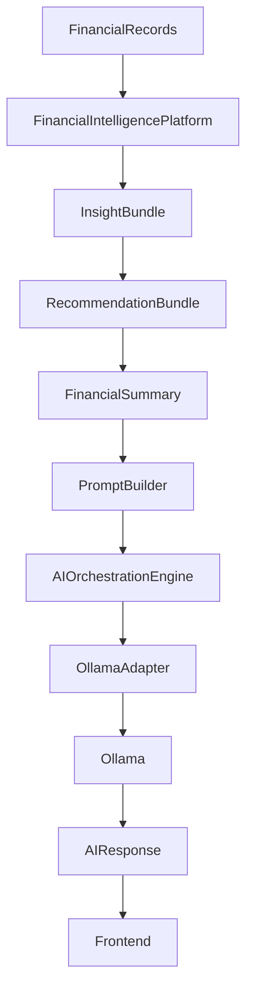
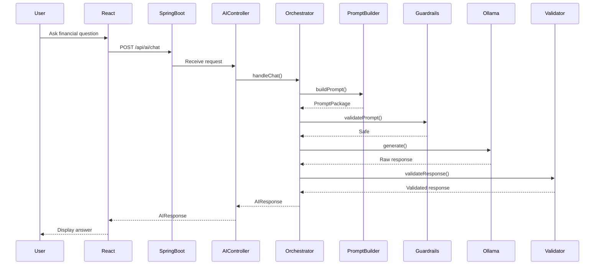

# 12.0 — AI Platform Architecture Overview

> **Document Version:** 2.0.0
> **Status:** Draft — Architecture Review Pending
>
> **Parent Documents**
>
> * `00-PesoPilot-v2.0-Source-of-Truth.md`
> * `01-Rule-Based-Financial-Intelligence-Architecture.md`
> * `02-InsightBundle-and-Data-Contracts.md`
> * `03-Insight-Engine-Architecture.md`
> * `04-Rule-Engine-Architecture.md`
> * `05-Health-Engine-Architecture.md`
> * `06-Income-Engine-Architecture.md`
> * `07-Expense-Engine-Architecture.md`
> * `08-Savings-&-Goal-Engine-Architecture.md`
> * `09-Cashflow-&-Cutoff-Engine-Architecture.md`
> * `10-Recommendation-Engine-Architecture.md`
> * `11-Summary-Engine-Architecture.md`
>
> **Phase**
>
> Phase 11B / Phase 12 — AI Financial Intelligence Platform
>
> **Section**
>
> AI Platform Architecture Overview

---

# 1. Purpose

The AI Platform Architecture defines how PesoPilot safely integrates artificial intelligence on top of the deterministic Financial Intelligence Platform.

The AI layer does not replace:

* Rule Engine
* Insight Engine
* Health Engine
* Income Engine
* Expense Engine
* Savings Engine
* Cashflow Engine
* Recommendation Engine
* Summary Engine

Instead, it consumes their validated outputs.

The AI layer exists to make financial intelligence easier to understand, discuss, and act on.

---

# 2. Core Principle

The most important principle of the AI Platform is:

> **AI explains financial intelligence. AI does not create financial truth.**

This means the LLM must never independently calculate:

* health scores,
* savings rates,
* cashflow,
* budget utilization,
* remaining cash,
* financial runway,
* recommendations.

Those values must come from deterministic services.

---

# 3. Position Within PesoPilot



The AI layer begins only after deterministic intelligence has been generated.

---

# 4. High-Level Architecture

```text
React Frontend

↓

Spring Boot API

↓

AI Controller

↓

AI Orchestration Engine

↓

Prompt Builder

↓

Context Packager

↓

Safety Guardrails

↓

LLM Adapter

↓

Ollama

↓

Response Validator

↓

AI Response DTO

↓

React Frontend
```

Spring Boot owns the AI orchestration boundary.

React never communicates directly with Ollama.

---

# 5. AI Platform Responsibilities

The AI Platform owns:

* prompt construction,
* conversation orchestration,
* context packaging,
* safety validation,
* LLM provider abstraction,
* Ollama communication,
* response validation,
* streaming response support,
* AI REST APIs,
* conversation memory coordination.

The AI Platform does **not** own:

* financial calculations,
* financial scoring,
* recommendation generation,
* summary generation,
* database schema changes,
* frontend business logic.

---

# 6. Primary Inputs

The AI Platform consumes:

```text
InsightBundle

RecommendationBundle

FinancialSummary

Conversation Context

User Message
```

These inputs form the full AI context.

The LLM receives prepared context, not raw application state.

---

# 7. Primary Outputs

The AI Platform produces:

```text
AIResponse

├── answer
├── referencedInsights
├── referencedRecommendations
├── safetyStatus
├── modelMetadata
├── conversationMetadata
└── diagnostics
```

The AI response is conversational, but still grounded.

---

# 8. AI Platform Components

```text
AI Platform

├── AI Controller
├── AI Orchestration Engine
├── Prompt Builder
├── Context Packager
├── Conversation Engine
├── Memory Service
├── Safety Guardrails
├── LLM Adapter Interface
├── Ollama Adapter
├── Response Validator
├── Streaming Service
└── AI Diagnostics
```

Each component has one responsibility.

---

# 9. Request Lifecycle



---

# 10. Prompt Builder Role

The Prompt Builder converts deterministic financial intelligence into LLM-ready instructions.

It receives:

```text
FinancialSummary
RecommendationBundle
InsightBundle
User Message
Conversation Context
```

It produces:

```text
PromptPackage
```

The Prompt Builder does not call Ollama.

It only prepares structured prompts.

---

# 11. Context Packager Role

The Context Packager decides which financial context is safe and relevant to include.

It prevents prompt overload by selecting only:

* relevant summary sections,
* top recommendations,
* related insights,
* necessary evidence,
* conversation context.

It avoids sending unnecessary raw financial history.

---

# 12. AI Orchestration Engine Role

The AI Orchestration Engine coordinates the entire AI request.

It owns:

* request validation,
* context loading,
* prompt generation,
* safety checks,
* LLM call,
* response validation,
* diagnostics,
* error recovery.

It is the central AI application service.

---

# 13. LLM Adapter Interface

PesoPilot should not directly depend on Ollama-specific logic.

Instead:

```text
AI Orchestration Engine

↓

LLM Adapter Interface

↓

Ollama Adapter
```

Future adapters may include:

* OpenAI
* Claude
* Gemini
* Mistral
* DeepSeek
* Local GGUF runners

---

# 14. Ollama Adapter

The Ollama Adapter owns:

* Ollama request formatting,
* model selection,
* timeout handling,
* streaming handling,
* retry behavior,
* response parsing.

It does not know PesoPilot financial rules.

It only sends prompts and receives responses.

---

# 15. Conversation Engine

The Conversation Engine manages multi-turn financial conversations.

It tracks:

* user message,
* assistant response,
* selected context,
* conversation state,
* referenced financial artifacts.

It does not calculate financial intelligence.

---

# 16. Memory Service

Memory allows the AI to maintain useful context across conversation turns.

Memory may include:

* recent user questions,
* previous AI answers,
* referenced recommendations,
* active financial topic,
* user clarification history.

Memory must not modify financial records.

---

# 17. Safety Guardrails

Safety Guardrails protect financial correctness.

They ensure the AI:

* does not invent financial data,
* does not override deterministic recommendations,
* does not fabricate calculations,
* does not claim unsupported certainty,
* does not provide unsafe financial guarantees.

Guardrails run before and after the LLM call.

---

# 18. Response Validator

The Response Validator checks whether the AI response is acceptable.

It verifies:

* no unsupported calculations,
* no fabricated financial values,
* no recommendation priority changes,
* no unsafe guarantees,
* references align with provided context.

Invalid responses are rejected or regenerated.

---

# 19. Streaming Architecture

Future streaming support should follow:

```text
React

↓

Spring Boot Streaming Endpoint

↓

AI Orchestration Engine

↓

Ollama Streaming

↓

Token Stream

↓

React UI
```

Streaming improves perceived performance but does not change AI behavior.

---

# 20. REST API Boundary

Initial AI endpoints may include:

```text
POST /api/ai/chat

POST /api/ai/explain-summary

POST /api/ai/explain-recommendation

POST /api/ai/ask-insights

GET /api/ai/conversations/{id}
```

These endpoints belong to Spring Boot.

---

# 21. Data Flow Rule

AI requests must follow this flow:

```text
Frontend

↓

Spring Boot

↓

Deterministic Context

↓

Prompt Builder

↓

Guardrails

↓

LLM

↓

Response Validator

↓

Frontend
```

Forbidden:

```text
Frontend

↓

Ollama
```

Forbidden:

```text
LLM

↓

Database Mutation
```

Forbidden:

```text
LLM

↓

Financial Calculation Source of Truth
```

---

# 22. AI Capability Boundaries

The AI may:

* explain financial summaries,
* explain recommendations,
* answer questions about insights,
* simplify financial terms,
* compare provided financial observations,
* help users understand tradeoffs.

The AI must not:

* create new official expenses,
* edit financial records,
* approve inbox records,
* change goals,
* calculate authoritative scores,
* generate unsupported forecasts,
* make guaranteed financial claims.

---

# 23. AI Response Modes

Phase 12 supports multiple response modes.

```text
Explain Summary

Explain Recommendation

Ask About Finances

What Should I Focus On?

Clarify Financial Term

Compare Cutoffs

Goal Coaching
```

Each mode uses a different prompt template.

---

# 24. Prompt Grounding Strategy

Every prompt must include:

* role boundary,
* deterministic financial context,
* allowed actions,
* forbidden actions,
* answer style,
* citation/reference instructions,
* fallback behavior.

Fallback behavior:

```text
If the provided context is insufficient, say what is missing instead of guessing.
```

---

# 25. AI Safety Strategy

The AI platform uses layered safety.

```text
Request Validation

↓

Context Filtering

↓

Prompt Guardrails

↓

LLM Call

↓

Response Validation

↓

Safe Output
```

Safety is not delegated to the LLM alone.

---

# 26. Testing Strategy

Testing should cover:

* Prompt Builder tests
* Context Packager tests
* Guardrail tests
* Response Validator tests
* Ollama Adapter contract tests
* AI Controller tests
* Orchestration tests
* streaming tests
* failure recovery tests

LLM-dependent tests should be isolated from deterministic unit tests.

---

# 27. Failure Handling

The AI Platform should gracefully handle:

* Ollama unavailable,
* model timeout,
* unsafe response,
* invalid prompt package,
* missing financial context,
* streaming interruption.

User-facing fallback:

```text
AI explanation is temporarily unavailable, but your financial data remains safe.
```

---

# 28. Deployment Model

Phase 12 assumes:

```text
Frontend: Vercel

Backend: Spring Boot

AI Runtime: Ollama local/server

Database: Future backend persistence

Financial Intelligence: deterministic service layer
```

Ollama may run locally during development and on a controlled server in production.

---

# 29. Future Multi-LLM Strategy

The adapter pattern allows provider replacement.

```text
LLM Adapter

├── Ollama Adapter
├── OpenAI Adapter
├── Claude Adapter
├── Gemini Adapter
└── Local Model Adapter
```

No provider-specific logic should leak into the AI Orchestration Engine.

---

# 30. Architecture Decision Records

## ADR-206

### Why AI Consumes Deterministic Intelligence?

**Decision**

AI receives InsightBundle, RecommendationBundle, and FinancialSummary instead of raw financial authority.

**Reason**

Prevents hallucinated financial calculations and preserves correctness.

---

## ADR-207

### Why Use Spring Boot as AI Boundary?

**Decision**

AI orchestration is owned by the backend.

**Reason**

Protects prompts, model configuration, safety logic, and provider credentials from the frontend.

---

## ADR-208

### Why Use an LLM Adapter Interface?

**Decision**

Ollama is accessed through an adapter interface.

**Reason**

Allows future model/provider replacement without rewriting orchestration.

---

## ADR-209

### Why Validate AI Responses?

**Decision**

AI output is checked before returning to the frontend.

**Reason**

Prevents unsupported claims, fabricated values, and unsafe financial guidance.

---

## ADR-210

### Why Keep AI Read-Only in Phase 12?

**Decision**

AI cannot mutate financial records.

**Reason**

Protects user data and prevents unintended financial state changes.

---

# 31. Acceptance Criteria

Document 12.0 is complete when:

* AI Platform purpose is defined.
* AI boundaries are established.
* Spring Boot orchestration role is documented.
* Prompt Builder role is defined.
* Ollama integration boundary is documented.
* Safety strategy is established.
* REST API boundary is outlined.
* Testing strategy is documented.
* Multi-LLM future path is defined.
* Architecture decisions are recorded.

---

# 32. Document Summary

Document 12.0 defines the master architecture for PesoPilot's AI Platform.

It establishes AI as a consumer of deterministic financial intelligence rather than the source of financial truth. The AI Platform uses Spring Boot as the orchestration boundary, Prompt Builder for grounded prompt construction, Safety Guardrails for correctness, an LLM Adapter Interface for provider independence, and Ollama as the initial local model runtime. This design allows PesoPilot to offer AI-powered financial explanations and coaching while preserving deterministic calculations, recommendation integrity, user trust, and long-term provider flexibility.

---

# Phase 12 Architecture Progress

```text
██████

✓ 12.0 — AI Platform Architecture Overview

□□□□□□□□□□□□

12.1 — Prompt Builder Architecture

12.2 — Conversation Engine Architecture

12.3 — Ollama Integration Architecture

12.4 — AI Orchestration Engine

12.5 — Conversation Memory Architecture

12.6 — AI Safety & Guardrails

12.7 — Spring Boot AI REST API

12.8 — Streaming & Real-Time Response Architecture

12.9 — AI Testing Strategy

12.10 — Future Multi-LLM Architecture
```

---

# End of Document

**Document Status:** ✅ **Completed**

**Next Document:** **12.1 — Prompt Builder Architecture**
