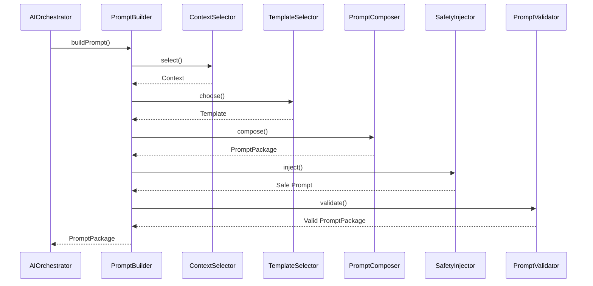
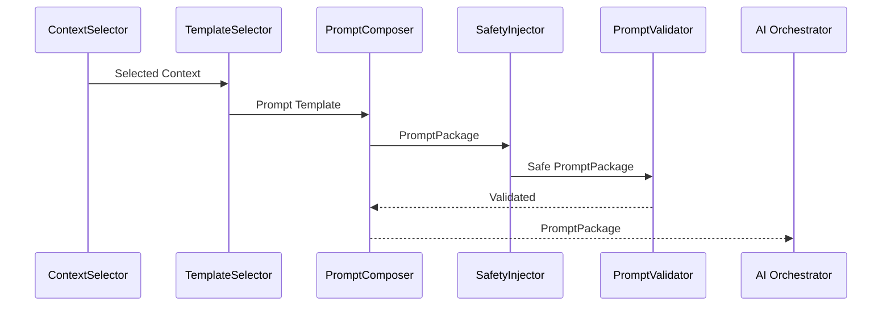
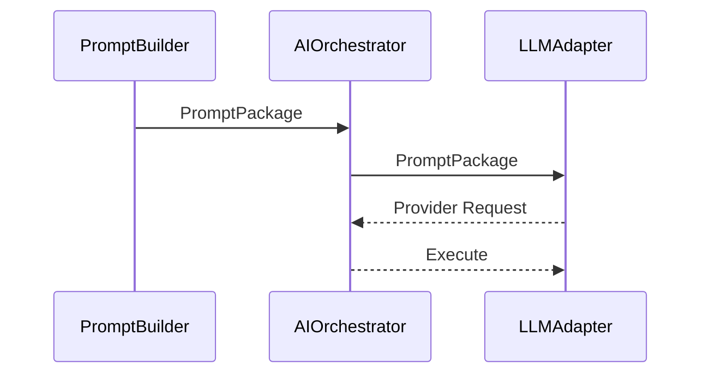
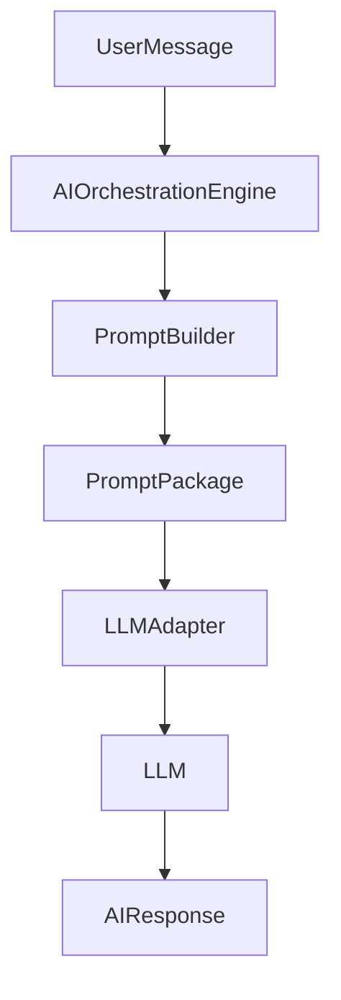
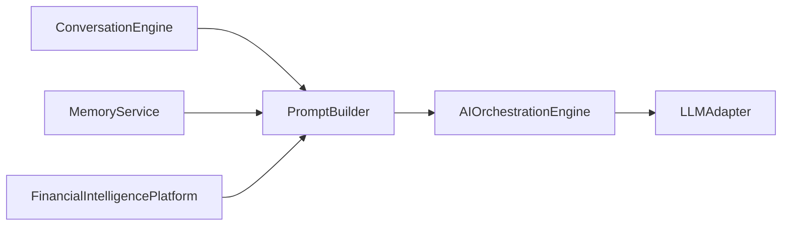
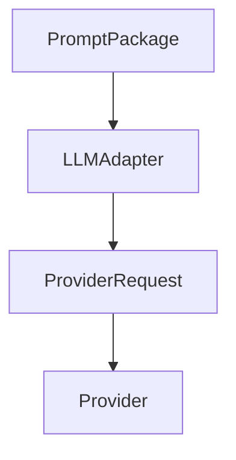
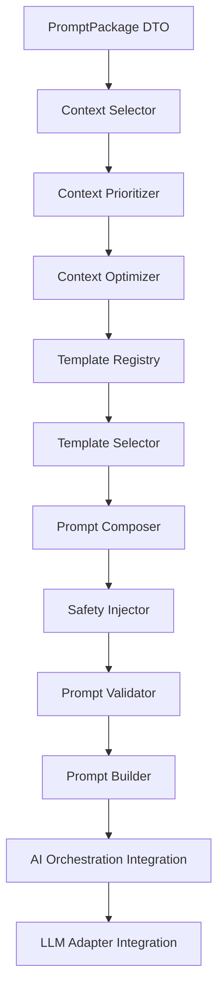

# 12.1 — Prompt Builder Architecture (Part I)

> **Document Version:** 2.0.0
> **Status:** Draft — Architecture Review Pending
>
> **Parent Documents**
>
> * `00-PesoPilot-v2.0-Source-of-Truth.md`
> * `01-Rule-Based-Financial-Intelligence-Architecture.md`
> * `02-InsightBundle-and-Data-Contracts.md`
> * `03-Insight-Engine-Architecture.md`
> * `04-Rule-Engine-Architecture.md`
> * `05-Health-Engine-Architecture.md`
> * `06-Income-Engine-Architecture.md`
> * `07-Expense-Engine-Architecture.md`
> * `08-Savings-&-Goal-Engine-Architecture.md`
> * `09-Cashflow-&-Cutoff-Engine-Architecture.md`
> * `10-Recommendation-Engine-Architecture.md`
> * `11-Summary-Engine-Architecture.md`
> * `12.0-AI-Platform-Architecture-Overview.md`
>
> **Phase**
>
> Phase 11B / Phase 12 — AI Financial Intelligence Platform
>
> **Section**
>
> Introduction, Prompt Philosophy, Responsibilities & Overall Prompt Builder Architecture

---

# 1. Purpose

The Prompt Builder is the Context Engineering layer of the PesoPilot AI Platform.

Its purpose is to transform deterministic financial intelligence into a structured, validated, and AI-ready PromptPackage.

The Prompt Builder does **not** generate AI responses.

It prepares the information required for the LLM to generate safe, grounded, and contextually relevant responses.

---

# 2. Position Within the AI Platform

The Prompt Builder is positioned between the Financial Intelligence Platform and the Large Language Model.

```mermaid
flowchart TD

Financial Intelligence Platform

-->

InsightBundle

InsightBundle

-->

RecommendationBundle

RecommendationBundle

-->

FinancialSummary

FinancialSummary

-->

Prompt Builder

Conversation Context

-->

Prompt Builder

User Message

-->

Prompt Builder

Prompt Builder

-->

PromptPackage

PromptPackage

-->

LLM Adapter

LLM Adapter

-->

Ollama
```

The LLM never communicates directly with deterministic services.

All context flows through the Prompt Builder.

---

# 3. Prompt Philosophy

The Prompt Builder follows one fundamental principle:

> **The quality of an AI response depends more on the quality of its context than the quality of the language model itself.**

Therefore,

the Prompt Builder is responsible for engineering context rather than engineering prompts.

It determines:

* what information should be included,
* what information should be excluded,
* how information is ordered,
* which instructions are mandatory,
* how safety constraints are enforced.

---

# 4. Context Engineering Philosophy

Traditional prompt engineering focuses on writing better prompts.

PesoPilot instead adopts **Context Engineering**.

```mermaid
flowchart LR

Financial Intelligence

-->

Context Engineering

-->

Prompt Package

-->

LLM

-->

AI Response
```

Context Engineering ensures that every AI request contains:

* relevant financial intelligence,
* structured recommendations,
* deterministic summaries,
* conversation history,
* safety instructions,
* response constraints.

---

# 5. Guiding Principles

The Prompt Builder follows ten architectural principles.

---

## 5.1 Context Before Language

Financial intelligence is prepared before any prompt text is assembled.

The LLM receives structured context rather than raw financial objects.

---

## 5.2 Deterministic Context Selection

Identical inputs must always produce identical PromptPackages.

No randomness.

No hidden prompt mutation.

No model-specific prompt construction.

---

## 5.3 Single Prompt Boundary

All AI requests must pass through the Prompt Builder.

No component may construct prompts independently.

---

## 5.4 Separation of Responsibility

The Prompt Builder:

* prepares context,
* assembles prompts,
* injects guardrails,
* selects templates.

It does **not**:

* call Ollama,
* stream responses,
* manage conversations,
* validate AI responses,
* calculate financial intelligence.

---

## 5.5 Grounded AI

Every prompt must be grounded in deterministic financial intelligence.

The AI must never infer financial facts that are absent from the provided context.

---

## 5.6 Prompt Reusability

Prompt templates must be reusable across:

* Summary explanations,
* Recommendation explanations,
* General financial questions,
* Goal coaching,
* Educational conversations.

---

## 5.7 Provider Independence

Prompt construction must remain independent of the underlying LLM provider.

The same PromptPackage should work with:

* Ollama,
* OpenAI,
* Claude,
* Gemini,
* future providers.

---

## 5.8 Safety by Design

Safety instructions are injected during prompt construction rather than relying solely on model behavior.

---

## 5.9 Minimal Context Principle

Only information necessary to answer the user's request should be included.

Unnecessary context increases latency, token usage, and hallucination risk.

---

## 5.10 AI as a Consumer

The Prompt Builder treats the AI as a consumer of financial intelligence.

It never allows the AI to become the source of financial truth.

---

# 6. Responsibilities

The Prompt Builder owns:

* context selection,
* prompt template selection,
* prompt assembly,
* safety instruction injection,
* conversation context injection,
* financial context packaging,
* PromptPackage construction,
* prompt metadata generation.

The Prompt Builder does **not** own:

* financial calculations,
* recommendation generation,
* summary generation,
* conversation storage,
* Ollama communication,
* AI response validation.

---

# 7. Inputs

The Prompt Builder receives:

```text
User Message

FinancialSummary

RecommendationBundle

InsightBundle

Conversation Context

AI Configuration
```

All inputs are immutable.

The Prompt Builder never modifies financial intelligence.

---

# 8. Outputs

The Prompt Builder produces one public object.

```text
PromptPackage

├── System Prompt
├── User Prompt
├── Context Sections
├── Conversation Context
├── Safety Instructions
├── Output Instructions
├── Prompt Metadata
└── Version
```

PromptPackage becomes the only object passed to the LLM Adapter.

---

# 9. High-Level Pipeline

```mermaid
flowchart TD

User Message

-->

Context Selection

FinancialSummary

-->

Context Selection

RecommendationBundle

-->

Context Selection

InsightBundle

-->

Context Selection

Conversation Context

-->

Context Selection

Context Selection

-->

Template Selection

Template Selection

-->

Prompt Assembly

Prompt Assembly

-->

Safety Injection

Safety Injection

-->

PromptPackage

PromptPackage

-->

LLM Adapter
```

Every stage owns exactly one responsibility.

---

# 10. Internal Components

```text
Prompt Builder

├── Context Selector

├── Template Selector

├── Prompt Composer

├── Safety Injector

├── Output Instruction Builder

├── Prompt Metadata Builder

└── Prompt Validator
```

Each component performs a single deterministic transformation.

---

# 11. Relationship with Other AI Components

```mermaid
flowchart LR

Conversation Engine

-->

Prompt Builder

Memory Service

-->

Prompt Builder

Financial Intelligence Platform

-->

Prompt Builder

Prompt Builder

-->

AI Orchestration Engine

AI Orchestration Engine

-->

LLM Adapter
```

The Prompt Builder is upstream of every LLM interaction.

---

# 12. Prompt Builder Responsibilities

The Prompt Builder answers questions such as:

* What financial context is relevant?
* Which recommendations should be included?
* Which summary sections are necessary?
* What safety instructions must be injected?
* Which prompt template should be used?
* How should the final PromptPackage be structured?

It does **not** determine how the AI responds.

---

# 13. Overall Prompt Builder Architecture



---

# 14. Future Evolution

The Prompt Builder is intentionally designed for future expansion.

Potential enhancements include:

* adaptive context compression,
* automatic token budgeting,
* semantic context retrieval,
* user preference injection,
* multilingual prompt generation,
* provider-specific prompt optimization,
* retrieval-augmented context,
* prompt version experimentation,
* dynamic template selection.

These enhancements extend the Prompt Builder without changing its architectural role.

---

# 15. Architecture Decision Records

## ADR-211

### Why Create a Dedicated Prompt Builder?

**Decision**

Prompt construction is isolated into a dedicated subsystem.

**Reason**

Prevents prompt generation logic from being scattered throughout the application.

---

## ADR-212

### Why Adopt Context Engineering?

**Decision**

The Prompt Builder focuses on selecting and organizing context rather than writing free-form prompts.

**Reason**

Grounded context has a greater impact on AI quality than prompt wording alone.

---

## ADR-213

### Why Require a Single Prompt Boundary?

**Decision**

Every LLM request must pass through the Prompt Builder.

**Reason**

Ensures consistency, safety, and maintainability.

---

## ADR-214

### Why Keep Provider Independence?

**Decision**

Prompt construction remains independent of the LLM provider.

**Reason**

Allows Ollama to be replaced without redesigning the AI Platform.

---

## ADR-215

### Why Build PromptPackage as a Domain Object?

**Decision**

PromptPackage is treated as a first-class architecture artifact.

**Reason**

Improves validation, testing, diagnostics, provider abstraction, and long-term maintainability.

---

# 16. Acceptance Criteria

This section is complete when:

* Prompt Builder philosophy is documented.
* Context Engineering principles are established.
* Responsibilities are clearly separated.
* Prompt Builder pipeline is defined.
* Internal components are documented.
* PromptPackage role is standardized.
* Future extensibility is documented.
* Architecture decisions are recorded.

---

# Part I Summary

Part I establishes the Prompt Builder as the Context Engineering layer of the PesoPilot AI Platform. Rather than assembling ad hoc prompts, the Prompt Builder transforms deterministic financial intelligence into a structured, validated, and provider-independent `PromptPackage`. Through deterministic context selection, template selection, safety injection, and prompt validation, it creates a consistent boundary between the Financial Intelligence Platform and the LLM, ensuring that every AI interaction is grounded, explainable, secure, and maintainable.

---

**End of Part I**

**Next Section:** **Part II — PromptPackage Model, Context Model, Prompt Sections, Context Hierarchy & Prompt Lifecycle**

# 12.1 — Prompt Builder Architecture (Part II)

> **Document Version:** 2.0.0
> **Status:** Draft — Architecture Review Pending
>
> **Parent Documents**
>
> * `00-PesoPilot-v2.0-Source-of-Truth.md`
> * `01-Rule-Based-Financial-Intelligence-Architecture.md`
> * `02-InsightBundle-and-Data-Contracts.md`
> * `03-Insight-Engine-Architecture.md`
> * `04-Rule-Engine-Architecture.md`
> * `05-Health-Engine-Architecture.md`
> * `06-Income-Engine-Architecture.md`
> * `07-Expense-Engine-Architecture.md`
> * `08-Savings-&-Goal-Engine-Architecture.md`
> * `09-Cashflow-&-Cutoff-Engine-Architecture.md`
> * `10-Recommendation-Engine-Architecture.md`
> * `11-Summary-Engine-Architecture.md`
> * `12.0-AI-Platform-Architecture-Overview.md`
>
> **Phase**
>
> Phase 11B / Phase 12 — AI Financial Intelligence Platform
>
> **Section**
>
> PromptPackage Model, Context Model, Prompt Sections, Context Hierarchy & Prompt Lifecycle

---

# 17. Purpose

Part I established the philosophy and architecture of the Prompt Builder.

This section defines **what the Prompt Builder produces**.

Rather than representing a prompt as a single string, PesoPilot models it as a structured architecture object called **PromptPackage**.

PromptPackage contains every piece of information required for an LLM request while remaining provider-independent, deterministic, and fully testable.

---

# 18. PromptPackage Philosophy

A PromptPackage is **not** a completed prompt.

A PromptPackage is **not** provider-specific.

A PromptPackage is

> **the structured representation of AI context prepared for language model consumption.**

The final textual prompt is produced by the LLM Adapter using the PromptPackage.

---

# 19. PromptPackage Domain Model

Every AI request is represented by one PromptPackage.

```text
PromptPackage

├── System Prompt
├── User Prompt
├── Context Model
├── Context Sections
├── Conversation Context
├── Safety Instructions
├── Output Instructions
├── Metadata
├── Diagnostics
└── Version
```

PromptPackage becomes the official AI communication contract inside the backend.

---

# 20. Prompt Lifecycle

Every PromptPackage follows the same lifecycle.

```mermaid
flowchart LR

Context Sources

-->

Context Selection

-->

Prompt Assembly

-->

Prompt Validation

-->

PromptPackage

-->

LLM Adapter

-->

Provider Prompt

-->

LLM
```

Only validated PromptPackages may leave the Prompt Builder.

---

# 21. Context Model

The Context Model defines every source of information available to the Prompt Builder.

```text
Context Model

├── FinancialSummary
├── RecommendationBundle
├── InsightBundle
├── Conversation Context
├── User Message
├── User Preferences
├── AI Configuration
└── Runtime Metadata
```

Every context source is immutable during prompt construction.

---

# 22. Context Philosophy

The Prompt Builder follows one rule:

> **Only include context that materially improves the AI response.**

Adding unnecessary information:

* increases token usage,
* increases latency,
* increases hallucination risk,
* reduces response quality.

Context selection is therefore a deterministic optimization problem.

---

# 23. Context Sections

Internally, PromptPackage separates context into sections.

```text
Context Sections

├── Identity Context
├── Financial Context
├── Recommendation Context
├── Summary Context
├── Conversation Context
├── Safety Context
├── Output Context
└── Runtime Context
```

Each section serves a unique purpose.

---

# 24. Identity Context

Identity Context defines the AI's role.

Example

```text
You are PesoPilot's AI Financial Coach.

You explain deterministic financial intelligence.

You never invent financial calculations.

You never override recommendation priorities.
```

Identity Context remains constant across most requests.

---

# 25. Financial Context

Financial Context contains deterministic intelligence.

Typical contents

* FinancialSummary
* HealthInsight
* IncomeInsight
* ExpenseInsight
* SavingsInsight
* CashflowInsight

This section represents the user's current financial state.

---

# 26. Recommendation Context

Recommendation Context contains validated actions.

Example

```text
Priority Recommendation

Reduce discretionary spending.

Reason

Remaining cash is below the healthy threshold.
```

The AI explains recommendations.

It never generates official recommendations.

---

# 27. Summary Context

Summary Context contains the executive narrative produced by the Summary Engine.

Example

```text
Executive Summary

Your finances remain stable, but your remaining cash should be monitored closely until your next payday.
```

This provides conversational grounding.

---

# 28. Conversation Context

Conversation Context contains recent interactions relevant to the current discussion.

Typical contents

```text
Previous Question

Previous Answer

Active Topic

Clarifications

Open Questions
```

Conversation Context improves continuity without exposing unnecessary history.

---

# 29. Safety Context

Safety Context injects mandatory constraints.

Examples

```text
Do not fabricate financial values.

Do not change recommendation priorities.

If context is insufficient, state what additional information is required.

Do not provide guaranteed financial outcomes.
```

Safety Context is always included.

---

# 30. Output Context

Output Context specifies how the AI should respond.

Examples

```text
Explain clearly.

Use simple financial language.

Reference available recommendations.

Do not repeat identical information.

Keep the response concise unless additional detail is requested.
```

This standardizes response quality across providers.

---

# 31. Runtime Context

Runtime Context contains execution metadata.

Examples

```text
Language

Model Name

Temperature

Maximum Tokens

Streaming Enabled

Request Mode
```

Runtime Context supports provider-specific execution without affecting financial logic.

---

# 32. Context Hierarchy

The Prompt Builder applies context in a fixed order.

```mermaid
flowchart TD

Identity Context

-->

Financial Context

-->

Recommendation Context

-->

Summary Context

-->

Conversation Context

-->

Safety Context

-->

Output Context

-->

Runtime Context
```

Hierarchy remains deterministic.

---

# 33. Prompt Sections

Internally, PromptPackage is assembled from ordered sections.

```text
Prompt Sections

├── System Instructions
├── User Instructions
├── Financial Intelligence
├── Conversation Memory
├── Safety Rules
├── Output Instructions
└── Metadata
```

The final provider prompt is assembled from these sections.

---

# 34. Prompt Modes

PromptPackage supports multiple interaction modes.

```text
Explain Summary

Explain Recommendation

Financial Q&A

Goal Coaching

Financial Education

Budget Discussion

Expense Review

General Conversation
```

Each mode activates different templates while using the same PromptPackage model.

---

# 35. Context Prioritization

When prompt size becomes constrained, context is reduced in the following order:

```text
Conversation History

↓

Historical Insights

↓

Secondary Recommendations

↓

Detailed Diagnostics

↓

Primary Recommendation

↓

Financial Summary

↓

Safety Instructions
```

Safety instructions are never removed.

---

# 36. PromptPackage Metadata

Every PromptPackage exposes metadata.

```text
Prompt Metadata

├── Prompt ID
├── Prompt Version
├── Prompt Mode
├── Generated Time
├── Language
├── Model Target
├── Context Size
└── Template Version
```

Metadata supports diagnostics and prompt evolution.

---

# 37. Diagnostics

PromptPackage diagnostics include:

```text
Selected Context Sources

Excluded Context Sources

Prompt Length

Estimated Token Count

Template Used

Compression Applied

Validation Result
```

Diagnostics help optimize prompt quality over time.

---

# 38. Future Context Sources

Future versions may introduce:

```text
Calendar Context

Location Context

Investment Portfolio

Bill Reminders

Spending Predictions

Behavior Analytics

External Financial APIs

Wearable Data
```

New context sources extend the Context Model without changing PromptPackage.

---

# 39. Future Prompt Modes

Additional prompt modes may include:

```text
Tax Preparation

Retirement Planning

Investment Coaching

Family Budget Planning

Business Finance

Debt Reduction Planning

Scenario Simulation
```

Each mode remains grounded in deterministic financial intelligence.

---

# 40. Prompt Lifecycle States

Internally, every PromptPackage progresses through:

```text
Context Selected

↓

Template Applied

↓

Prompt Assembled

↓

Validated

↓

Published
```

Only Published PromptPackages are sent to the LLM Adapter.

---

# 41. Architecture Decision Records

## ADR-216

### Why Treat PromptPackage as a Domain Object?

**Decision**

PromptPackage is modeled as a first-class architecture artifact.

**Reason**

Improves validation, diagnostics, testing, caching, and provider independence.

---

## ADR-217

### Why Separate Context into Sections?

**Decision**

Context is organized into independent sections.

**Reason**

Improves maintainability, optimization, and selective inclusion.

---

## ADR-218

### Why Introduce Context Hierarchy?

**Decision**

Context is always assembled in a deterministic order.

**Reason**

Ensures consistent AI behavior and simplifies prompt optimization.

---

## ADR-219

### Why Keep Safety Context Mandatory?

**Decision**

Safety instructions are injected into every PromptPackage.

**Reason**

Prevents provider-specific behavior from weakening financial safety guarantees.

---

## ADR-220

### Why Support Multiple Prompt Modes?

**Decision**

PromptPackage supports multiple interaction scenarios through configuration rather than structural changes.

**Reason**

Allows future capabilities without redesigning the Prompt Builder.

---

# 42. Acceptance Criteria

This section is complete when:

* PromptPackage model is standardized.
* Context Model is documented.
* Context Sections are defined.
* Prompt Sections are standardized.
* Context Hierarchy is established.
* Prompt lifecycle is documented.
* Metadata and diagnostics are defined.
* Future extensibility is documented.

---

# Part II Summary

Part II establishes `PromptPackage` as the core domain object of the AI Platform. Rather than treating prompts as plain strings, the Prompt Builder constructs a structured, validated package containing identity, financial context, recommendations, summaries, conversation state, safety constraints, output instructions, metadata, and diagnostics. By introducing a deterministic Context Model, Context Hierarchy, and Prompt Lifecycle, PesoPilot creates a provider-independent foundation for AI interactions that is scalable, testable, explainable, and optimized for future LLM providers and advanced context engineering.

---

**End of Part II**

**Next Section:** **Part III — Prompt Builder Pipeline, Context Selection, Template Registry, Prompt Assembly & Validation**

# 12.1 — Prompt Builder Architecture (Part III)

> **Document Version:** 2.0.0
> **Status:** Draft — Architecture Review Pending
>
> **Parent Documents**
>
> * `00-PesoPilot-v2.0-Source-of-Truth.md`
> * `01-Rule-Based-Financial-Intelligence-Architecture.md`
> * `02-InsightBundle-and-Data-Contracts.md`
> * `03-Insight-Engine-Architecture.md`
> * `04-Rule-Engine-Architecture.md`
> * `05-Health-Engine-Architecture.md`
> * `06-Income-Engine-Architecture.md`
> * `07-Expense-Engine-Architecture.md`
> * `08-Savings-&-Goal-Engine-Architecture.md`
> * `09-Cashflow-&-Cutoff-Engine-Architecture.md`
> * `10-Recommendation-Engine-Architecture.md`
> * `11-Summary-Engine-Architecture.md`
> * `12.0-AI-Platform-Architecture-Overview.md`
>
> **Phase**
>
> Phase 11B / Phase 12 — AI Financial Intelligence Platform
>
> **Section**
>
> Prompt Builder Pipeline, Context Selection, Template Registry, Prompt Assembly & Validation

---

# 43. Purpose

Part II defined the PromptPackage domain model.

This section defines how the Prompt Builder constructs that PromptPackage.

Unlike traditional AI applications that concatenate prompt strings, PesoPilot builds prompts through a deterministic Context Engineering pipeline.

Every prompt follows the same architecture regardless of the underlying LLM provider.

---

# 44. Context Engineering Pipeline

The Prompt Builder transforms structured application state into an AI-ready PromptPackage.

```mermaid
flowchart TD

Context Sources

-->

Context Selection

Context Selection

-->

Template Selection

Template Selection

-->

Prompt Assembly

Prompt Assembly

-->

Safety Injection

Safety Injection

-->

Prompt Validation

Prompt Validation

-->

PromptPackage
```

Every stage owns one architectural responsibility.

---

# 45. Internal Pipeline Components

```text
Prompt Builder

├── Context Selector

├── Context Prioritizer

├── Context Optimizer

├── Template Registry

├── Template Selector

├── Prompt Composer

├── Safety Injector

├── Prompt Validator

└── PromptPackage Builder
```

The pipeline is deterministic.

No LLM participates during prompt construction.

---

# 46. Context Sources

The Context Selector evaluates all available sources.

```text
FinancialSummary

RecommendationBundle

InsightBundle

Conversation Memory

User Message

User Preferences

Runtime Configuration
```

Each source is evaluated independently.

---

# 47. Context Selection

The Context Selector determines which information is relevant to the user's request.

Example

User asks:

```text
Why is my health score low?
```

Selected context:

```text
HealthInsight

FinancialSummary

Relevant Recommendation

Recent Conversation
```

Ignored context:

```text
Expense History (older)

Goal History

Archived Recommendations
```

Only relevant context is forwarded.

---

# 48. Context Selection Pipeline

```mermaid
flowchart LR

Available Context

-->

Relevance Filter

-->

Priority Filter

-->

Size Filter

-->

Selected Context
```

Each filter progressively reduces unnecessary information.

---

# 49. Context Prioritization

The Prompt Builder prioritizes context by business value.

Priority order:

```text
User Message

↓

FinancialSummary

↓

Highest Priority Recommendation

↓

Related Insights

↓

Conversation Context

↓

Supporting Diagnostics

↓

Historical Context
```

Higher-priority context is never discarded before lower-priority context.

---

# 50. Context Optimization

After selection, context is optimized.

Optimization goals:

* remove duplicates,
* eliminate unused fields,
* compress repetitive information,
* normalize formatting,
* reduce token consumption.

Optimization must never change financial meaning.

---

# 51. Token Budget Management

Prompt Builder manages a configurable token budget.

Example allocation:

```text
System Instructions

20%

Financial Context

35%

Recommendations

20%

Conversation Memory

15%

User Message

10%
```

Unused capacity may be reallocated dynamically.

---

# 52. Context Compression

If the selected context exceeds the token budget, compression is applied.

Compression order:

```text
Historical Conversation

↓

Historical Insights

↓

Low Priority Recommendations

↓

Verbose Diagnostics
```

The following must never be compressed:

* Safety Instructions
* User Message
* Executive Summary
* Highest Priority Recommendation

---

# 53. Template Registry

Prompt Builder owns one centralized Template Registry.

```mermaid
flowchart TD

Prompt Builder

-->

Template Registry

Template Registry

-->

Prompt Templates
```

Templates define prompt structure.

They never contain business logic.

---

# 54. Template Categories

Phase 12 supports:

```text
Explain Summary

Explain Recommendation

Financial Question

Budget Coaching

Savings Coaching

Goal Coaching

Educational Response

General Conversation

Fallback Response
```

Each category has multiple templates.

---

# 55. Template Selection

Template selection depends on:

```text
Prompt Mode

↓

Conversation Intent

↓

Context Availability

↓

Template Version
```

Template selection is deterministic.

---

# 56. Prompt Assembly

The Prompt Composer combines all validated components.

```mermaid
flowchart TD

System Prompt

-->

Prompt Composer

Financial Context

-->

Prompt Composer

Conversation Context

-->

Prompt Composer

Safety Instructions

-->

Prompt Composer

Output Instructions

-->

Prompt Composer

Prompt Composer

-->

PromptPackage
```

Prompt assembly performs no financial calculations.

---

# 57. Prompt Composition Rules

Prompt assembly follows strict rules.

Examples:

* Identity always appears first.
* Financial context precedes recommendations.
* Recommendations precede conversation memory.
* Safety instructions are always included.
* Output instructions appear last.

The order never changes.

---

# 58. Safety Injection

Safety instructions are injected automatically.

Examples:

```text
Do not fabricate financial values.

Do not modify deterministic recommendations.

If context is incomplete, request clarification.

Do not provide guaranteed financial outcomes.
```

Applications cannot bypass safety injection.

---

# 59. Output Instruction Builder

Output instructions define expected response characteristics.

Examples:

```text
Use professional language.

Keep explanations concise.

Reference recommendations where appropriate.

Avoid repeating information.

Answer only using available context.
```

These instructions remain provider-independent.

---

# 60. Prompt Validator

Prompt validation verifies:

Required sections:

* System Prompt
* User Prompt
* Financial Context
* Safety Instructions

Validation rules:

* no duplicate sections,
* valid context references,
* supported prompt mode,
* version compatibility,
* token budget compliance.

Only valid PromptPackages proceed to the LLM Adapter.

---

# 61. Prompt Assembly Lifecycle



---

# 62. Empty Context Handling

If insufficient context exists:

```text
PromptPackage

↓

Minimal Financial Context

↓

Clarification Request

↓

LLM
```

The Prompt Builder never fabricates missing context.

---

# 63. Prompt Versioning

Every PromptPackage references:

```text
Prompt Version

Template Version

Safety Version

Schema Version

Context Version
```

Versioning supports reproducibility and safe evolution.

---

# 64. Diagnostics

Prompt diagnostics include:

```text
Selected Context

Excluded Context

Compression Applied

Estimated Tokens

Prompt Mode

Template Used

Validation Status

Generation Time
```

Diagnostics are never sent to the LLM.

---

# 65. Future Context Engineering

Future capabilities may include:

```text
Semantic Context Ranking

Retrieval-Augmented Generation (RAG)

Vector Search

Adaptive Token Budgeting

Automatic Context Summarization

User Preference Injection

Dynamic Context Expansion
```

These enhancements extend the pipeline without changing PromptPackage.

---

# 66. Architecture Decision Records

## ADR-221

### Why Introduce a Context Selection Pipeline?

**Decision**

Context selection is performed before prompt assembly.

**Reason**

Reduces unnecessary information, improves relevance, and lowers token consumption.

---

## ADR-222

### Why Separate Template Selection from Prompt Assembly?

**Decision**

Templates are selected independently of prompt composition.

**Reason**

Improves maintainability, localization, and future experimentation.

---

## ADR-223

### Why Centralize Token Budget Management?

**Decision**

Token allocation is managed by the Prompt Builder.

**Reason**

Provides predictable prompt sizes across providers.

---

## ADR-224

### Why Inject Safety Automatically?

**Decision**

Safety instructions are always added by the Prompt Builder.

**Reason**

Prevents callers from accidentally omitting critical financial guardrails.

---

## ADR-225

### Why Validate PromptPackages?

**Decision**

PromptPackages are validated before reaching the LLM Adapter.

**Reason**

Ensures structural consistency, safety compliance, and provider-independent correctness.

---

# 67. Acceptance Criteria

This section is complete when:

* Prompt Builder pipeline is documented.
* Context Selection pipeline is defined.
* Context prioritization and optimization are specified.
* Template Registry is documented.
* Prompt assembly rules are established.
* Prompt validation is defined.
* Token budget management is documented.
* Future extensibility is described.

---

# Part III Summary

Part III defines the operational architecture of the Prompt Builder. Through deterministic context selection, prioritization, optimization, template selection, prompt composition, safety injection, and validation, the Prompt Builder transforms structured financial intelligence into a validated `PromptPackage` ready for LLM consumption. By separating context engineering from provider-specific execution, the architecture ensures scalable, testable, token-efficient, and provider-independent AI interactions while maintaining strict financial safety and deterministic behavior.

---

**End of Part III**

**Next Section:** **Part IV — PromptPackage DTO, AI Integration, Ollama Integration, Prompt Safety & Context Optimization**

# 12.1 — Prompt Builder Architecture (Part IV)

> **Document Version:** 2.0.0
> **Status:** Draft — Architecture Review Pending
>
> **Parent Documents**
>
> * `00-PesoPilot-v2.0-Source-of-Truth.md`
> * `01-Rule-Based-Financial-Intelligence-Architecture.md`
> * `02-InsightBundle-and-Data-Contracts.md`
> * `03-Insight-Engine-Architecture.md`
> * `04-Rule-Engine-Architecture.md`
> * `05-Health-Engine-Architecture.md`
> * `06-Income-Engine-Architecture.md`
> * `07-Expense-Engine-Architecture.md`
> * `08-Savings-&-Goal-Engine-Architecture.md`
> * `09-Cashflow-&-Cutoff-Engine-Architecture.md`
> * `10-Recommendation-Engine-Architecture.md`
> * `11-Summary-Engine-Architecture.md`
> * `12.0-AI-Platform-Architecture-Overview.md`
>
> **Phase**
>
> Phase 11B / Phase 12 — AI Financial Intelligence Platform
>
> **Section**
>
> PromptPackage DTO, AI Integration, Ollama Integration, Prompt Safety & Context Optimization

---

# 68. Purpose

The previous sections defined:

* Prompt Builder philosophy,
* PromptPackage model,
* Context Engineering,
* Prompt Builder pipeline.

This section defines how the completed PromptPackage is consumed by the AI Platform.

Unlike internal Prompt Builder components,

the PromptPackage becomes the official communication contract between the Prompt Builder and the LLM Adapter.

---

# 69. PromptPackage DTO Philosophy

PromptPackage is the final output of the Prompt Builder.

It is:

* validated,
* deterministic,
* provider-independent,
* immutable,
* AI-ready.

PromptPackage is **not**:

* an Ollama request,
* an OpenAI request,
* a Claude request,
* a Gemini request.

Those provider-specific payloads are generated by the LLM Adapter.

---

# 70. PromptPackage DTO

```text
PromptPackage

├── System Prompt
├── User Prompt
├── Context Sections
├── Conversation Context
├── Safety Instructions
├── Output Instructions
├── Runtime Configuration
├── Metadata
├── Diagnostics
└── Version
```

Every provider receives its request from this DTO.

---

# 71. Logical Prompt vs Provider Prompt

The AI Platform distinguishes two layers.

```mermaid
flowchart LR

PromptPackage

-->

LLM Adapter

LLM Adapter

-->

Provider Prompt

Provider Prompt

-->

LLM
```

PromptPackage is internal.

Provider Prompt is provider-specific.

This separation keeps Prompt Builder completely provider-independent.

---

# 72. AI Integration

The AI Orchestration Engine consumes PromptPackage.



The Prompt Builder never communicates directly with the LLM.

---

# 73. AI Request Flow

Complete request lifecycle

```mermaid
flowchart TD

User Message

-->

Prompt Builder

Prompt Builder

-->

PromptPackage

PromptPackage

-->

AI Orchestrator

AI Orchestrator

-->

LLM Adapter

LLM Adapter

-->

Provider Prompt

Provider Prompt

-->

LLM

LLM

-->

AI Response
```

Each stage performs one responsibility.

---

# 74. Ollama Integration

For Phase 12,

Ollama is the initial LLM provider.

```mermaid
flowchart LR

PromptPackage

-->

Ollama Adapter

Ollama Adapter

-->

Ollama REST API

Ollama REST API

-->

Local Model
```

The Prompt Builder never formats Ollama-specific JSON.

---

# 75. Ollama Adapter Responsibilities

The Ollama Adapter owns:

* request serialization,
* model selection,
* temperature configuration,
* token configuration,
* timeout handling,
* streaming support,
* response parsing,
* retry handling.

It does not modify PromptPackage.

---

# 76. Provider Independence

Future providers reuse the same PromptPackage.

```text
PromptPackage

↓

LLM Adapter

├── Ollama

├── OpenAI

├── Claude

├── Gemini

├── DeepSeek

└── Future Providers
```

Only adapters change.

Prompt Builder remains unchanged.

---

# 77. Prompt Safety

Prompt safety begins before the LLM request.

Mandatory safety layers include:

* context validation,
* safety instruction injection,
* prompt validation,
* runtime policy enforcement.

Safety is architecture-driven rather than provider-dependent.

---

# 78. Safety Instructions

Every PromptPackage includes mandatory instructions.

Examples

```text
Do not fabricate financial values.

Do not create recommendations.

Do not override recommendation priorities.

Use only supplied financial context.

Request clarification if context is insufficient.
```

These instructions are injected automatically.

---

# 79. Runtime Safety

The AI Orchestrator enforces runtime rules.

Examples

```text
Approved Model

Maximum Tokens

Allowed Prompt Mode

Streaming Policy

Temperature Range

Timeout Policy
```

Runtime rules protect system stability and consistency.

---

# 80. Prompt Validation

Prompt validation verifies:

Required sections

* System Prompt
* User Prompt
* Financial Context
* Safety Instructions

Validation rules

* no empty context,
* supported prompt mode,
* valid template,
* valid metadata,
* valid token estimate.

Invalid PromptPackages are rejected before reaching the adapter.

---

# 81. Context Optimization

Prompt Builder optimizes context before execution.

Optimization goals

* reduce token usage,
* eliminate duplicate information,
* remove irrelevant history,
* normalize formatting,
* preserve deterministic meaning.

Optimization must never remove mandatory safety instructions.

---

# 82. Token Optimization Strategy

Prompt Builder prioritizes token allocation.

```text
Identity

↓

Financial Summary

↓

Primary Recommendations

↓

Relevant Insights

↓

Conversation Context

↓

Diagnostics
```

Lower-priority information is removed first when limits are reached.

---

# 83. Prompt Compression

Compression techniques may include:

```text
Duplicate Removal

Section Pruning

Whitespace Normalization

Context Trimming

Historical Compression

Metadata Reduction
```

Compression must never change financial meaning.

---

# 84. PromptPackage Versioning

Each PromptPackage exposes:

```text
Prompt Version

Schema Version

Template Version

Safety Version

Builder Version
```

Versioning enables reproducibility and rollback.

---

# 85. PromptPackage Diagnostics

Diagnostics include:

```text
Prompt Mode

Template Used

Context Sources

Excluded Sources

Estimated Tokens

Compression Applied

Generation Time

Validation Status
```

Diagnostics remain internal.

They are never sent to the provider.

---

# 86. AI Response Traceability

Every PromptPackage can be traced to:

```text
User Message

↓

Context Sources

↓

PromptPackage

↓

Provider Prompt

↓

AI Response
```

This supports debugging and auditing.

---

# 87. Streaming Integration

PromptPackage supports both:

```text
Synchronous Response

Streaming Response
```

The Prompt Builder remains identical.

Only the adapter changes execution mode.

---

# 88. Failure Handling

If PromptPackage validation fails:

```text
PromptPackage

↓

Validation Failed

↓

Error Response

↓

AI Orchestrator
```

If the provider is unavailable:

```text
PromptPackage

↓

Retry Policy

↓

Fallback Response
```

PromptPackage itself remains unchanged.

---

# 89. Future Context Optimization

Future optimization may include:

```text
Semantic Compression

Adaptive Context Ranking

Intent-Aware Context Selection

Retrieval-Augmented Context

Dynamic Token Budgeting

Context Window Prediction
```

These features extend optimization without modifying PromptPackage.

---

# 90. Architecture Decision Records

## ADR-226

### Why Separate PromptPackage from Provider Prompt?

**Decision**

PromptPackage remains provider-independent.

**Reason**

Allows LLM providers to change without redesigning Prompt Builder.

---

## ADR-227

### Why Keep Provider Logic Inside Adapters?

**Decision**

Only adapters understand provider APIs.

**Reason**

Preserves separation of concerns and simplifies provider replacement.

---

## ADR-228

### Why Optimize Context Before Execution?

**Decision**

Prompt optimization occurs before adapter execution.

**Reason**

Reduces token usage while maintaining deterministic context.

---

## ADR-229

### Why Make Safety Mandatory?

**Decision**

Safety instructions are injected into every PromptPackage.

**Reason**

Prevents accidental omission of critical financial constraints.

---

## ADR-230

### Why Support Prompt Traceability?

**Decision**

Every PromptPackage can be traced to its originating context.

**Reason**

Improves debugging, auditing, explainability, and AI quality assurance.

---

# 91. Acceptance Criteria

This section is complete when:

* PromptPackage DTO is finalized.
* AI integration architecture is documented.
* Ollama integration boundary is defined.
* Provider abstraction is established.
* Prompt safety is documented.
* Context optimization strategy is specified.
* Versioning is standardized.
* Diagnostics and traceability are documented.

---

# Part IV Summary

Part IV establishes the PromptPackage as the official integration contract between the Prompt Builder and the AI Platform. Through provider-independent DTOs, adapter-based provider integration, mandatory prompt safety, deterministic context optimization, runtime validation, and comprehensive traceability, the architecture enables PesoPilot to support Ollama today and additional LLM providers in the future without changing the Prompt Builder. This separation ensures scalable, secure, explainable, and maintainable AI interactions while preserving the deterministic financial intelligence foundation established in earlier phases.

---

**End of Part IV**

**Next Section:** **Part V — Testing Strategy, Future Evolution, Acceptance Criteria & Implementation Roadmap**

# 12.1 — Prompt Builder Architecture (Part V)

> **Document Version:** 2.0.0
> **Status:** Draft — Architecture Review Pending
>
> **Parent Documents**
>
> * `00-PesoPilot-v2.0-Source-of-Truth.md`
> * `01-Rule-Based-Financial-Intelligence-Architecture.md`
> * `02-InsightBundle-and-Data-Contracts.md`
> * `03-Insight-Engine-Architecture.md`
> * `04-Rule-Engine-Architecture.md`
> * `05-Health-Engine-Architecture.md`
> * `06-Income-Engine-Architecture.md`
> * `07-Expense-Engine-Architecture.md`
> * `08-Savings-&-Goal-Engine-Architecture.md`
> * `09-Cashflow-&-Cutoff-Engine-Architecture.md`
> * `10-Recommendation-Engine-Architecture.md`
> * `11-Summary-Engine-Architecture.md`
> * `12.0-AI-Platform-Architecture-Overview.md`
>
> **Phase**
>
> Phase 11B / Phase 12 — AI Financial Intelligence Platform
>
> **Section**
>
> Testing Strategy, Future Evolution, Acceptance Criteria & Implementation Roadmap

---

# 92. Purpose

The previous sections defined:

* Prompt Builder philosophy,
* PromptPackage domain model,
* Context Engineering,
* Prompt Builder pipeline,
* AI integration,
* provider abstraction,
* prompt optimization.

This final section defines how the Prompt Builder is implemented, tested, evolved, and governed throughout the PesoPilot AI Platform.

---

# 93. Prompt Builder Integration Overview

The Prompt Builder is the first executable component of the AI Platform.



Every AI request must pass through the Prompt Builder.

---

# 94. AI Platform Integration

The Prompt Builder integrates with every major AI subsystem.



Prompt construction remains centralized.

---

# 95. AI Orchestration Integration

The AI Orchestration Engine owns execution.

The Prompt Builder owns preparation.

Responsibilities remain separate.

```text
Prompt Builder

↓

PromptPackage

↓

AI Orchestrator

↓

Provider Adapter

↓

LLM
```

The Prompt Builder never executes requests.

---

# 96. Conversation Engine Integration

Conversation Engine provides:

* active conversation,
* previous questions,
* previous answers,
* active financial topic,
* clarification history.

The Prompt Builder determines which conversation elements belong inside the PromptPackage.

Conversation management remains outside the Prompt Builder.

---

# 97. Memory Integration

Memory Service provides:

* short-term memory,
* session memory,
* referenced recommendations,
* active financial entities,
* user preferences.

The Prompt Builder selects only relevant memory.

Memory retrieval remains outside Prompt Builder responsibilities.

---

# 98. Financial Intelligence Integration

The Prompt Builder consumes deterministic outputs.

```text
FinancialSummary

RecommendationBundle

InsightBundle
```

The Prompt Builder never requests raw database entities.

It always operates on validated architecture contracts.

---

# 99. LLM Adapter Integration

PromptPackage is converted into a provider request.



Adapters own provider-specific serialization.

Prompt Builder remains provider-independent.

---

# 100. Prompt Safety Integration

Prompt safety is enforced before execution.

Safety pipeline

```text
Context Validation

↓

Safety Injection

↓

Prompt Validation

↓

PromptPackage

↓

Provider
```

Prompt Builder guarantees structural safety.

Response safety belongs to the AI Orchestration layer.

---

# 101. Testing Philosophy

Prompt Builder testing is deterministic.

Tests never require:

* Ollama,
* OpenAI,
* Claude,
* Gemini,
* network access,
* streaming,
* external APIs.

Prompt Builder tests execute entirely within Spring Boot.

---

# 102. Unit Tests

Every internal component requires isolated tests.

Components

```text
Context Selector

Context Prioritizer

Context Optimizer

Template Selector

Prompt Composer

Safety Injector

Prompt Validator

PromptPackage Builder
```

Each component is tested independently.

---

# 103. Context Selection Tests

Verify:

* correct context inclusion,
* irrelevant context exclusion,
* deterministic ordering,
* priority handling,
* token reduction.

Example

```text
Question

↓

Selected Context

↓

Expected Context
```

---

# 104. Template Registry Tests

Verify:

* template lookup,
* version selection,
* prompt mode selection,
* missing template handling,
* localization compatibility.

Templates must always resolve deterministically.

---

# 105. Prompt Assembly Tests

Prompt assembly verifies:

* section ordering,
* complete PromptPackage,
* safety inclusion,
* metadata generation,
* version assignment,
* context merging.

No duplicated sections should appear.

---

# 106. Prompt Validator Tests

Validator verifies:

Required sections

* System Prompt
* User Prompt
* Safety Instructions
* Output Instructions

Validation rules

* supported Prompt Mode,
* valid metadata,
* valid template,
* context integrity,
* token estimation.

---

# 107. Integration Tests

Complete pipeline

```text
FinancialSummary

↓

RecommendationBundle

↓

Conversation Context

↓

Context Selection

↓

Template Selection

↓

Prompt Assembly

↓

Prompt Validation

↓

PromptPackage
```

The same inputs must always produce identical PromptPackages.

---

# 108. Regression Tests

Regression testing compares PromptPackages against approved snapshots.

```text
Expected PromptPackage

↓

Generated PromptPackage

↓

Comparison
```

Unexpected changes require review before release.

---

# 109. Performance Targets

Target execution time

```text
Prompt Builder

< 5 ms
```

Typical dataset

* FinancialSummary
* RecommendationBundle
* InsightBundle
* 20 conversation messages
* 10 prompt templates

Prompt generation should remain deterministic and lightweight.

---

# 110. Implementation Roadmap

Recommended implementation sequence



Each milestone concludes with:

* unit tests,
* integration tests,
* lint,
* build,
* documentation review,
* manual verification.

---

# 111. Implementation Checklist

The Prompt Builder is complete when:

```text
☑ PromptPackage DTO

☑ Context Selector

☑ Context Prioritizer

☑ Context Optimizer

☑ Template Registry

☑ Template Selector

☑ Prompt Composer

☑ Safety Injector

☑ Prompt Validator

☑ Prompt Builder

☑ AI Orchestration Integration

☑ Provider Adapter Integration

☑ Unit Tests

☑ Integration Tests

☑ Documentation
```

---

# 112. Future Evolution

Future Prompt Builder capabilities may include:

```text
Semantic Context Selection

Retrieval-Augmented Generation (RAG)

Adaptive Prompt Compression

Intent Classification

Multi-Agent Context Routing

Dynamic Prompt Policies

Provider-Specific Optimization Profiles

Context Caching

Prompt Analytics

Automatic Token Budget Optimization

Semantic Deduplication
```

These enhancements extend the Prompt Builder without changing its architectural role.

---

# 113. Architecture Decision Records

## ADR-231

### Why Centralize Prompt Construction?

**Decision**

Every LLM request is built exclusively by the Prompt Builder.

**Reason**

Prevents duplicated prompt logic and ensures consistent context engineering.

---

## ADR-232

### Why Test Prompt Builder Without an LLM?

**Decision**

Prompt Builder tests are independent of model providers.

**Reason**

Prompt construction is deterministic and should remain fast, repeatable, and provider-agnostic.

---

## ADR-233

### Why Consume Architecture Contracts Instead of Database Entities?

**Decision**

The Prompt Builder receives FinancialSummary, RecommendationBundle, and InsightBundle.

**Reason**

Keeps the AI Platform decoupled from persistence and guarantees validated business context.

---

## ADR-234

### Why Keep Context Engineering Separate from Execution?

**Decision**

Prompt construction ends with PromptPackage generation.

**Reason**

Separates deterministic preparation from provider-specific execution and simplifies maintenance.

---

## ADR-235

### Why Design Prompt Builder for Future AI Capabilities?

**Decision**

The Prompt Builder supports future context engineering enhancements through extension points.

**Reason**

Allows RAG, semantic retrieval, adaptive context selection, and multi-agent workflows to be introduced without redesigning the Prompt Builder.

---

# 114. Final Acceptance Criteria

Document 12.1 is complete when:

* Prompt Builder architecture is fully documented.
* PromptPackage model is finalized.
* Context Engineering architecture is established.
* Context selection and optimization are documented.
* Template Registry is specified.
* AI integration is defined.
* Provider abstraction is documented.
* Testing strategy is complete.
* Implementation roadmap is finalized.
* Future extensibility is documented.

---

# 115. Document Summary

Document 12.1 defines the complete architecture of the Prompt Builder, establishing it as the Context Engineering layer of the PesoPilot AI Platform. Through deterministic context selection, template-driven prompt composition, safety injection, validation, and provider-independent PromptPackage generation, the Prompt Builder creates a consistent boundary between deterministic financial intelligence and language model execution. This architecture enables scalable, testable, secure, and maintainable AI interactions while ensuring that every LLM request remains grounded in validated financial data rather than ad hoc prompt construction.

---

# AI Platform Architecture Progress

```text
██████████

✓ 12.0 — AI Platform Architecture Overview

✓ 12.1 — Prompt Builder Architecture

□□□□□□□□□□□□□□□□

12.2 — Conversation Engine Architecture

12.3 — Ollama Integration Architecture

12.4 — AI Orchestration Engine

12.5 — Conversation Memory Architecture

12.6 — AI Safety & Guardrails

12.7 — Spring Boot AI REST API

12.8 — Streaming & Real-Time Response Architecture

12.9 — AI Testing Strategy

12.10 — Future Multi-LLM Architecture
```

---

# End of Document

**Document Status:** ✅ **Completed**

**Next Document:** **12.2 — Conversation Engine Architecture**

---

## Milestone Achieved

With **Document 12.1** complete, the AI Platform now has a fully specified **Context Engineering layer**. The Prompt Builder serves as the single, deterministic gateway between PesoPilot's Financial Intelligence Platform and any LLM provider, ensuring that all AI interactions are grounded in validated financial intelligence, consistently structured, provider-independent, and protected by architectural safety boundaries. Documents **12.0** and **12.1** together establish the core foundation upon which the remaining AI Platform components—Conversation Engine, Memory, Orchestration, Adapters, Streaming, and Safety—will be built.
