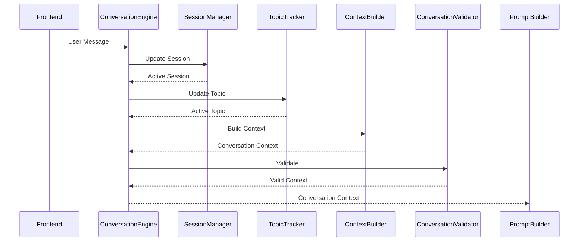
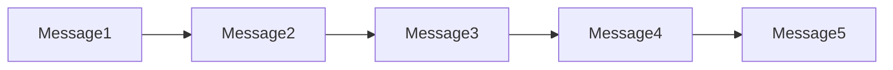
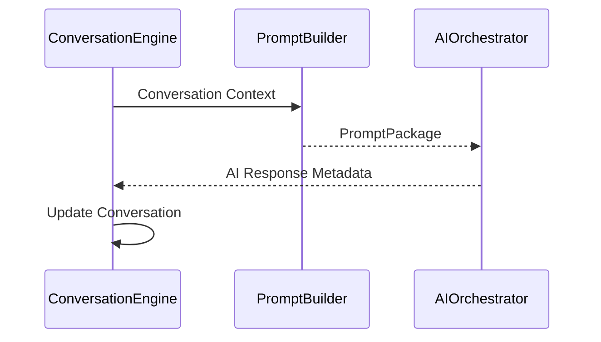
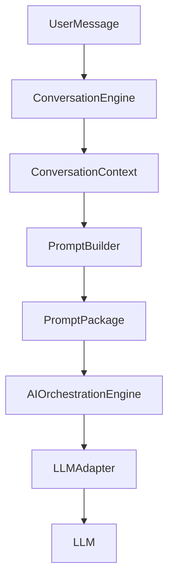
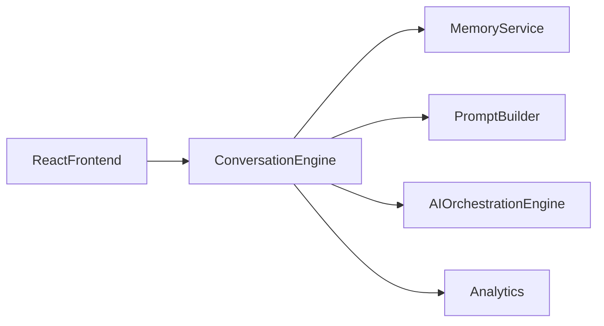
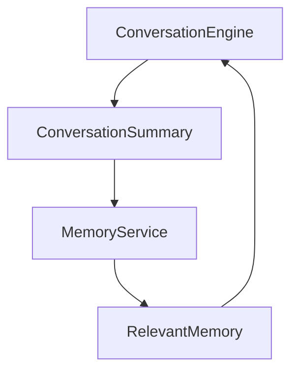
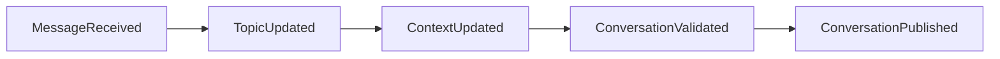

# 12.2 — Conversation Engine Architecture (Part I)

> **Document Version:** 2.0.0
> **Status:** Draft — Architecture Review Pending
>
> **Parent Documents**
>
> * `00-PesoPilot-v2.0-Source-of-Truth.md`
> * `01-Rule-Based-Financial-Intelligence-Architecture.md`
> * `02-InsightBundle-and-Data-Contracts.md`
> * `03-Insight-Engine-Architecture.md`
> * `04-Rule-Engine-Architecture.md`
> * `05-Health-Engine-Architecture.md`
> * `06-Income-Engine-Architecture.md`
> * `07-Expense-Engine-Architecture.md`
> * `08-Savings-&-Goal-Engine-Architecture.md`
> * `09-Cashflow-&-Cutoff-Engine-Architecture.md`
> * `10-Recommendation-Engine-Architecture.md`
> * `11-Summary-Engine-Architecture.md`
> * `12.0-AI-Platform-Architecture-Overview.md`
> * `12.1-Prompt-Builder-Architecture.md`
>
> **Phase**
>
> Phase 11B / Phase 12 — AI Financial Intelligence Platform
>
> **Section**
>
> Introduction, Conversation Philosophy, Responsibilities & Overall Conversation Architecture

---

# 1. Purpose

The Conversation Engine manages the lifecycle and state of every AI conversation within PesoPilot.

Its purpose is to maintain conversational continuity across multiple user interactions while providing structured conversation context to the Prompt Builder.

The Conversation Engine does **not** generate prompts.

It does **not** execute language models.

It does **not** calculate financial intelligence.

Instead, it manages **how conversations evolve over time**.

---

# 2. Position Within the AI Platform

The Conversation Engine sits between user interaction and context engineering.

```mermaid
flowchart TD

User

-->

React Frontend

React Frontend

-->

Spring Boot API

Spring Boot API

-->

Conversation Engine

Conversation Engine

-->

Prompt Builder

Prompt Builder

-->

AI Orchestration Engine

AI Orchestration Engine

-->

LLM Adapter

LLM Adapter

-->

Ollama
```

Every conversational request first passes through the Conversation Engine.

---

# 3. Conversation Philosophy

The Conversation Engine follows one fundamental principle:

> **A conversation is more than a collection of messages. It is structured context that evolves over time.**

Therefore,

PesoPilot models conversations as domain objects rather than simple chat histories.

A conversation captures:

* intent,
* active topics,
* referenced financial intelligence,
* clarification state,
* conversational flow,
* execution metadata.

---

# 4. Conversation Management Philosophy

Conversation management is distinct from memory.

Conversation Engine manages:

* active sessions,
* current context,
* message sequencing,
* topic transitions,
* clarification flow.

Memory Service manages:

* persistent memory,
* historical conversations,
* user preferences,
* long-term knowledge.

This separation keeps each subsystem focused on a single responsibility.

---

# 5. Guiding Principles

The Conversation Engine follows ten architectural principles.

---

## 5.1 Session-Centric Design

Every interaction belongs to exactly one active conversation session.

Conversation state never exists outside a session.

---

## 5.2 Deterministic State Management

Conversation state transitions are deterministic.

Given identical inputs and conversation history, the resulting conversation state must be identical.

---

## 5.3 Context Before Messages

Conversation context is the primary architecture artifact.

Individual messages are events that modify context.

---

## 5.4 Single Conversation Boundary

All conversational requests pass through the Conversation Engine.

No other component may independently manage conversation state.

---

## 5.5 Separation of Responsibilities

The Conversation Engine:

* manages sessions,
* tracks topics,
* manages clarification,
* organizes messages,
* prepares conversation context.

It does **not**:

* construct prompts,
* execute LLMs,
* validate AI responses,
* persist long-term memory,
* calculate financial intelligence.

---

## 5.6 Explicit Conversation State

Conversation status is always represented explicitly.

Hidden or implicit state is prohibited.

---

## 5.7 Topic Awareness

The engine continuously tracks the active financial topic.

Examples include:

* Health Score
* Cashflow
* Savings Goals
* Expenses
* Recommendations

Topic awareness improves conversational continuity.

---

## 5.8 Provider Independence

Conversation management remains independent of any LLM provider.

Conversation logic must never depend on Ollama-specific behavior.

---

## 5.9 Explainability

Conversation context must remain explainable.

Every topic, clarification, and referenced artifact should be traceable.

---

## 5.10 AI as a Participant

The Conversation Engine treats the AI as a participant in a structured conversation rather than the owner of the conversation.

Conversation state always belongs to the application.

---

# 6. Responsibilities

The Conversation Engine owns:

* conversation lifecycle,
* session management,
* message ordering,
* active topic tracking,
* clarification tracking,
* conversation state,
* conversation metadata,
* conversation context generation.

The Conversation Engine does **not** own:

* financial calculations,
* prompt generation,
* response generation,
* long-term memory storage,
* provider communication,
* AI safety validation.

---

# 7. Inputs

The Conversation Engine receives:

```text
User Message

Conversation Session

Conversation State

Conversation Metadata

Runtime Configuration
```

These inputs are combined to produce an updated conversation context.

---

# 8. Outputs

The Conversation Engine produces:

```text
Conversation Context

├── Active Session
├── Message Timeline
├── Active Topic
├── Pending Clarifications
├── Referenced Financial Artifacts
├── Conversation Metadata
├── Conversation State
└── Version
```

Conversation Context becomes an input to the Prompt Builder.

---

# 9. High-Level Conversation Flow

```mermaid
flowchart TD

User Message

-->

Conversation Engine

Conversation Engine

-->

Session Update

Session Update

-->

Context Update

Context Update

-->

Conversation Context

Conversation Context

-->

Prompt Builder
```

The Prompt Builder never receives raw messages alone.

It receives structured conversation context.

---

# 10. Internal Components

```text
Conversation Engine

├── Session Manager

├── Message Tracker

├── Topic Tracker

├── Clarification Manager

├── Conversation State Manager

├── Context Builder

├── Metadata Builder

└── Conversation Validator
```

Each component performs a single deterministic transformation.

---

# 11. Relationship with Other AI Components

```mermaid
flowchart LR

React Frontend

-->

Conversation Engine

Conversation Engine

-->

Prompt Builder

Conversation Engine

-->

Memory Service

Conversation Engine

-->

AI Orchestration Engine
```

The Conversation Engine coordinates with other components but remains responsible only for conversational state.

---

# 12. Conversation Engine Responsibilities

The Conversation Engine answers questions such as:

* Which conversation is active?
* What topic is currently being discussed?
* Is the AI waiting for clarification?
* Which financial artifacts have already been referenced?
* Should previous conversation context be included?
* Has the user changed topics?

It does **not** determine the AI's response.

---

# 13. Overall Conversation Architecture



---

# 14. Future Evolution

The Conversation Engine is designed for future expansion.

Potential enhancements include:

* multi-session conversations,
* cross-device session synchronization,
* conversation branching,
* collaborative financial conversations,
* voice conversation support,
* multimodal interactions,
* conversation summarization,
* intelligent topic prediction,
* interruption recovery,
* conversation analytics.

These enhancements extend the Conversation Engine without changing its architectural role.

---

# 15. Architecture Decision Records

## ADR-236

### Why Create a Dedicated Conversation Engine?

**Decision**

Conversation management is isolated into a dedicated subsystem.

**Reason**

Separates conversational state management from prompt construction and AI execution.

---

## ADR-237

### Why Separate Conversation from Memory?

**Decision**

Conversation Engine manages active sessions, while Memory Service manages persistent knowledge.

**Reason**

Improves modularity, scalability, and clear ownership of responsibilities.

---

## ADR-238

### Why Treat Conversations as Domain Objects?

**Decision**

Conversations are modeled as structured domain entities rather than simple message lists.

**Reason**

Supports topic tracking, clarification handling, metadata, and future advanced conversational features.

---

## ADR-239

### Why Centralize Conversation State?

**Decision**

All conversational state transitions occur within the Conversation Engine.

**Reason**

Ensures deterministic behavior and eliminates inconsistent state management across components.

---

## ADR-240

### Why Keep Provider Independence?

**Decision**

Conversation management is completely independent of LLM providers.

**Reason**

Allows provider replacement without affecting conversational behavior.

---

# 16. Acceptance Criteria

This section is complete when:

* Conversation philosophy is documented.
* Conversation management principles are established.
* Responsibilities are clearly separated.
* High-level architecture is defined.
* Internal components are documented.
* Conversation Context role is standardized.
* Future extensibility is documented.
* Architecture decisions are recorded.

---

# Part I Summary

Part I establishes the Conversation Engine as the conversation management layer of the PesoPilot AI Platform. Rather than treating conversations as simple message histories, the Conversation Engine models them as structured, deterministic domain objects containing sessions, topics, clarification state, metadata, and conversational context. By separating conversation management from memory persistence, prompt construction, and AI execution, the architecture provides a scalable, explainable, provider-independent foundation for multi-turn financial conversations while maintaining clear boundaries between all AI Platform subsystems.

---

**End of Part I**

**Next Section:** **Part II — Conversation Model, Session Model, Message Model, Conversation Context & Conversation Lifecycle**

# 12.2 — Conversation Engine Architecture (Part II)

> **Document Version:** 2.0.0
> **Status:** Draft — Architecture Review Pending
>
> **Parent Documents**
>
> * `00-PesoPilot-v2.0-Source-of-Truth.md`
> * `01-Rule-Based-Financial-Intelligence-Architecture.md`
> * `02-InsightBundle-and-Data-Contracts.md`
> * `03-Insight-Engine-Architecture.md`
> * `04-Rule-Engine-Architecture.md`
> * `05-Health-Engine-Architecture.md`
> * `06-Income-Engine-Architecture.md`
> * `07-Expense-Engine-Architecture.md`
> * `08-Savings-&-Goal-Engine-Architecture.md`
> * `09-Cashflow-&-Cutoff-Engine-Architecture.md`
> * `10-Recommendation-Engine-Architecture.md`
> * `11-Summary-Engine-Architecture.md`
> * `12.0-AI-Platform-Architecture-Overview.md`
> * `12.1-Prompt-Builder-Architecture.md`
>
> **Phase**
>
> Phase 11B / Phase 12 — AI Financial Intelligence Platform
>
> **Section**
>
> Conversation Model, Session Model, Message Model, Conversation Context & Conversation Lifecycle

---

# 17. Purpose

Part I established the philosophy and responsibilities of the Conversation Engine.

This section defines the Conversation Engine's domain model.

Rather than representing conversations as simple message lists, PesoPilot models conversations as structured domain objects that preserve conversational state, active topics, clarification flow, and financial context.

---

# 18. Conversation Domain Philosophy

The Conversation Engine models five distinct concepts:

```text
Conversation

↓

Session

↓

Messages

↓

Conversation Context

↓

Conversation State
```

Each concept owns a different responsibility.

Together they describe the complete conversational state of the AI Platform.

---

# 19. Conversation Model

The Conversation represents the complete dialogue between the user and PesoPilot.

```text
Conversation

├── Conversation ID
├── Active Session
├── Conversation State
├── Active Topic
├── Message Timeline
├── Referenced Financial Artifacts
├── Conversation Context
├── Metadata
└── Version
```

Conversation is the root aggregate of the Conversation Engine.

---

# 20. Conversation Philosophy

A Conversation exists independently of:

* prompt generation,
* LLM execution,
* streaming,
* memory persistence.

It is a business object owned entirely by the Conversation Engine.

---

# 21. Session Model

A Conversation contains one active Session.

```text
Conversation

↓

Conversation Session
```

Session represents one continuous interaction period.

---

# 22. Session Model Structure

```text
Conversation Session

├── Session ID
├── Started Time
├── Last Activity
├── Current State
├── Active Topic
├── Message Count
├── Clarification Count
├── Runtime Metadata
└── Version
```

A new session begins when a new conversation starts or when a previous session has expired.

---

# 23. Session Philosophy

A Session defines conversational continuity.

Examples

```text
Morning Conversation

↓

Session A

Evening Conversation

↓

Session B
```

Both sessions may belong to the same user while remaining independent.

---

# 24. Message Model

Messages are immutable conversation events.

```text
Message

├── Message ID
├── Session ID
├── Sender
├── Message Type
├── Content
├── Timestamp
├── Referenced Artifacts
├── Metadata
└── Version
```

Messages are never edited after creation.

---

# 25. Message Types

Supported message types include:

```text
User Message

Assistant Message

Clarification Request

Clarification Response

System Message

Error Message
```

Future message types may be introduced without modifying the Conversation model.

---

# 26. Message Timeline

Messages are stored in chronological order.



Timeline order is deterministic.

---

# 27. Conversation Context

Conversation Context represents the AI's current working context.

It contains only information relevant to the current interaction.

```text
Conversation Context

├── Active Topic
├── Current Intent
├── Referenced Messages
├── Referenced Insights
├── Referenced Recommendations
├── Referenced Summary
├── Pending Clarifications
├── Context Metadata
└── Version
```

Conversation Context is rebuilt as the conversation evolves.

---

# 28. Conversation Context Philosophy

Conversation Context is **not** the same as memory.

Conversation Context contains:

* current discussion,
* active financial entities,
* immediate references.

Long-term historical information belongs to the Memory Service.

---

# 29. Conversation State

Conversation State represents the execution status of the current session.

```text
Conversation State

Idle

↓

Receiving Message

↓

Updating Context

↓

Waiting Clarification

↓

Building Prompt

↓

Waiting AI Response

↓

Responding

↓

Completed

↓

Archived
```

State transitions remain deterministic.

---

# 30. Conversation Metadata

Every conversation exposes metadata.

```text
Conversation Metadata

├── Language
├── Conversation Mode
├── AI Provider
├── Model Name
├── Session Duration
├── Total Messages
├── Last Updated
└── Engine Version
```

Metadata supports diagnostics and analytics.

---

# 31. Referenced Financial Artifacts

Conversation Context tracks referenced business objects.

Examples

```text
FinancialSummary

RecommendationBundle

InsightBundle

HealthInsight

CashflowInsight

SavingsInsight
```

These references enable the Prompt Builder to include only relevant financial context.

---

# 32. Conversation Modes

Conversation supports multiple interaction modes.

```text
General Chat

Financial Q&A

Recommendation Review

Summary Explanation

Goal Coaching

Budget Discussion

Educational Mode

Clarification Mode
```

Conversation Mode influences downstream prompt selection.

---

# 33. Conversation Hierarchy

The Conversation Engine follows a fixed hierarchy.

```mermaid
flowchart TD

Conversation

-->

Session

Session

-->

Message Timeline

Session

-->

Conversation Context

Conversation Context

-->

Referenced Artifacts

Conversation Context

-->

Conversation State
```

Hierarchy remains stable across implementations.

---

# 34. Conversation Lifecycle

Every conversation follows the same lifecycle.

```mermaid
flowchart LR

Created

-->

Session Started

-->

Messages Received

-->

Context Updated

-->

Prompt Generated

-->

AI Responded

-->

Completed

-->

Archived
```

Every transition is explicitly managed.

---

# 35. Conversation Lifecycle Rules

The engine follows deterministic lifecycle rules.

Examples:

* Every conversation starts with one session.
* Messages are immutable.
* Context is rebuilt after every message.
* Active Topic may change during a session.
* Clarification pauses normal execution.
* Archived conversations are read-only.

---

# 36. Conversation Versioning

Every conversation exposes version information.

```text
Conversation Version

Session Version

Message Schema Version

Context Version

Engine Version
```

Versioning enables reproducibility and future evolution.

---

# 37. Diagnostics

Conversation diagnostics include:

```text
Conversation ID

Session ID

Current State

Current Topic

Message Count

Clarification Count

Execution Time

Validation Status
```

Diagnostics are used internally by the AI Platform.

---

# 38. Future Conversation Features

Future enhancements may include:

```text
Conversation Branching

Conversation Merge

Voice Sessions

Multimodal Conversations

Collaborative Sessions

Cross-Device Continuity

Conversation Summaries

Topic History

Conversation Search

Session Recovery
```

These capabilities extend the model without changing its core architecture.

---

# 39. Architecture Decision Records

## ADR-241

### Why Separate Conversation and Session?

**Decision**

Conversation and Session are independent domain concepts.

**Reason**

Supports multiple interaction periods while preserving a single conversation history.

---

## ADR-242

### Why Treat Messages as Immutable?

**Decision**

Messages are append-only events.

**Reason**

Improves traceability, auditing, and deterministic replay.

---

## ADR-243

### Why Separate Conversation Context from Memory?

**Decision**

Conversation Context represents the current discussion only.

**Reason**

Keeps short-term conversational state independent from persistent knowledge.

---

## ADR-244

### Why Track Referenced Financial Artifacts?

**Decision**

Conversation Context records references to business objects instead of duplicating data.

**Reason**

Reduces coupling and enables efficient context selection by the Prompt Builder.

---

## ADR-245

### Why Use Explicit Conversation States?

**Decision**

Conversation execution state is modeled explicitly.

**Reason**

Supports predictable workflows, debugging, streaming, and future asynchronous execution.

---

# 40. Acceptance Criteria

This section is complete when:

* Conversation model is defined.
* Session model is standardized.
* Message model is documented.
* Conversation Context is established.
* Conversation lifecycle is documented.
* State model is defined.
* Versioning and diagnostics are specified.
* Future extensibility is documented.

---

# Part II Summary

Part II establishes the domain model of the Conversation Engine by introducing structured representations for Conversations, Sessions, Messages, Conversation Context, and Conversation State. Together these models provide a deterministic foundation for managing multi-turn financial conversations while remaining independent of prompt construction, memory persistence, and LLM execution. By modeling conversations as explicit business objects rather than simple message histories, the AI Platform gains stronger traceability, extensibility, and support for future conversational capabilities.

---

**End of Part II**

**Next Section:** **Part III — Conversation Pipeline, Context Tracking, Topic Detection, Clarification Handling & State Management**

# 12.2 — Conversation Engine Architecture (Part III)

> **Document Version:** 2.0.0
> **Status:** Draft — Architecture Review Pending
>
> **Parent Documents**
>
> * `00-PesoPilot-v2.0-Source-of-Truth.md`
> * `01-Rule-Based-Financial-Intelligence-Architecture.md`
> * `02-InsightBundle-and-Data-Contracts.md`
> * `03-Insight-Engine-Architecture.md`
> * `04-Rule-Engine-Architecture.md`
> * `05-Health-Engine-Architecture.md`
> * `06-Income-Engine-Architecture.md`
> * `07-Expense-Engine-Architecture.md`
> * `08-Savings-&-Goal-Engine-Architecture.md`
> * `09-Cashflow-&-Cutoff-Engine-Architecture.md`
> * `10-Recommendation-Engine-Architecture.md`
> * `11-Summary-Engine-Architecture.md`
> * `12.0-AI-Platform-Architecture-Overview.md`
> * `12.1-Prompt-Builder-Architecture.md`
>
> **Phase**
>
> Phase 11B / Phase 12 — AI Financial Intelligence Platform
>
> **Section**
>
> Conversation Pipeline, Context Tracking, Topic Detection, Clarification Handling & State Management

---

# 41. Purpose

Part II defined the Conversation domain model.

This section defines how the Conversation Engine transforms incoming user interactions into an updated, validated Conversation Context.

Rather than forwarding raw chat messages, the Conversation Engine continuously maintains conversational state, active topics, clarification requirements, and contextual relevance.

---

# 42. Conversation Management Pipeline

Every user interaction follows the same deterministic processing pipeline.

```mermaid
flowchart TD

User Message

-->

Session Resolution

Session Resolution

-->

Message Registration

Message Registration

-->

Topic Detection

Topic Detection

-->

Context Tracking

Context Tracking

-->

Clarification Evaluation

Clarification Evaluation

-->

State Transition

State Transition

-->

Conversation Validation

Conversation Validation

-->

Conversation Context
```

Each stage owns one responsibility.

---

# 43. Internal Pipeline Components

```text
Conversation Engine

├── Session Resolver

├── Message Registrar

├── Topic Tracker

├── Context Tracker

├── Clarification Manager

├── State Manager

├── Conversation Validator

└── Context Publisher
```

The Conversation Engine coordinates these components.

Each component remains independently testable.

---

# 44. Session Resolution

Every request belongs to one active conversation session.

Responsibilities:

* locate active session,
* create new session if required,
* validate session status,
* recover interrupted sessions,
* update session metadata.

No downstream processing occurs until a valid session exists.

---

# 45. Message Registration

Incoming messages become immutable conversation events.

Responsibilities:

* assign Message ID,
* timestamp,
* identify sender,
* classify message type,
* append to timeline.

Messages are never modified after registration.

---

# 46. Topic Detection

Topic Detection determines what financial subject the user is discussing.

Example

User:

```text
Why is my health score low?
```

Detected Topic:

```text
Health Score
```

Later:

```text
How can I improve it?
```

The Topic Tracker resolves:

```text
"It"

↓

Health Score
```

Topic resolution occurs before prompt construction.

---

# 47. Topic Tracker

Topic Tracker maintains the active conversational topic.

```text
Topic Tracker

├── Current Topic

├── Previous Topic

├── Topic Confidence

├── Referenced Financial Entity

├── Topic History

└── Version
```

The Topic Tracker exposes structured topic information to the Prompt Builder.

---

# 48. Topic Transition

Topic changes occur explicitly.

Example

```text
Health Score

↓

Savings Goal

↓

Cashflow

↓

Budget
```

Transitions are recorded for diagnostics.

Conversation history remains intact.

---

# 49. Context Tracking

The Context Tracker maintains the AI's working context.

Responsibilities:

* update referenced financial artifacts,
* update referenced messages,
* remove stale references,
* synchronize active topic,
* refresh context metadata.

Conversation Context is rebuilt after every interaction.

---

# 50. Context Tracking Pipeline

```mermaid
flowchart LR

Current Context

-->

New Message

-->

Topic Update

-->

Reference Update

-->

Context Refresh

-->

Updated Context
```

Context rebuilding remains deterministic.

---

# 51. Referenced Artifact Tracking

The Context Tracker records relevant business objects.

Examples

```text
FinancialSummary

RecommendationBundle

HealthInsight

ExpenseInsight

CashflowInsight

SavingsInsight
```

Only references are stored.

Business objects remain owned by their respective engines.

---

# 52. Clarification Handling

Sometimes additional information is required before AI execution.

Example

User:

```text
How can I improve it?
```

If no active topic exists:

```text
Clarification Required
```

Conversation execution pauses until clarification is received.

---

# 53. Clarification Manager

Responsibilities:

* detect ambiguous requests,
* identify missing context,
* create clarification requests,
* resolve pending clarifications,
* resume conversation after clarification.

Clarifications become part of the conversation timeline.

---

# 54. Clarification Lifecycle

```mermaid
flowchart TD

Ambiguous Message

-->

Clarification Required

-->

Waiting User

-->

User Response

-->

Clarification Resolved

-->

Conversation Continues
```

Clarification flow remains explicit.

---

# 55. Conversation State Manager

The State Manager owns all state transitions.

Supported states:

```text
Idle

Receiving Message

Processing

Tracking Context

Waiting Clarification

Building Prompt

Waiting AI

Responding

Completed

Archived
```

Hidden state transitions are prohibited.

---

# 56. State Transition Rules

Examples

```text
Idle

↓

Receiving Message

↓

Processing

↓

Tracking Context

↓

Completed
```

If clarification is required:

```text
Processing

↓

Waiting Clarification

↓

Processing

↓

Completed
```

Every transition is deterministic.

---

# 57. Conversation Validation

Before publishing Conversation Context, validation verifies:

Required elements:

* active session,
* valid conversation state,
* valid topic,
* message timeline,
* metadata.

Validation rules:

* chronological messages,
* valid state transition,
* consistent topic references,
* resolved session ownership.

Only validated contexts proceed downstream.

---

# 58. Context Publisher

After validation:

```mermaid
flowchart LR

Conversation Context

-->

Context Publisher

-->

Prompt Builder
```

The Context Publisher provides a stable interface to downstream AI components.

---

# 59. Conversation Synchronization

The Conversation Engine synchronizes with:

```text
Prompt Builder

Memory Service

AI Orchestration Engine

Streaming Engine

Analytics
```

Synchronization occurs through published Conversation Context.

---

# 60. Error Recovery

The Conversation Engine handles:

* missing sessions,
* corrupted state,
* interrupted conversations,
* invalid transitions,
* unresolved clarifications.

Recovery restores the last valid conversation state whenever possible.

---

# 61. Future Conversation Pipeline

Future enhancements may include:

```text
Topic Prediction

Intent Classification

Semantic Conversation Search

Automatic Context Summaries

Conversation Branching

Parallel Conversations

Voice Turn Detection

Multimodal Context Tracking
```

These capabilities extend the pipeline without altering the Conversation domain model.

---

# 62. Architecture Decision Records

## ADR-246

### Why Introduce a Dedicated Topic Tracker?

**Decision**

Topic tracking is isolated into its own component.

**Reason**

Separates conversational subject management from general session management and improves multi-turn understanding.

---

## ADR-247

### Why Rebuild Context After Every Message?

**Decision**

Conversation Context is regenerated after each interaction.

**Reason**

Ensures the Prompt Builder always receives the latest conversational state.

---

## ADR-248

### Why Make Clarification an Explicit Workflow?

**Decision**

Clarification handling is modeled as part of the conversation lifecycle.

**Reason**

Improves transparency, user experience, and deterministic execution.

---

## ADR-249

### Why Publish Conversation Context Instead of Raw Messages?

**Decision**

Downstream components consume structured Conversation Context.

**Reason**

Reduces coupling and eliminates repeated context interpretation.

---

## ADR-250

### Why Separate State Management?

**Decision**

Conversation state transitions are centralized in the State Manager.

**Reason**

Provides predictable execution, easier debugging, and support for asynchronous workflows.

---

# 63. Acceptance Criteria

This section is complete when:

* Conversation Management Pipeline is documented.
* Topic Tracking architecture is defined.
* Context Tracking is specified.
* Clarification workflow is documented.
* State Management is standardized.
* Validation pipeline is documented.
* Synchronization architecture is established.
* Future extensibility is described.

---

# Part III Summary

Part III defines the operational architecture of the Conversation Engine. Through deterministic session resolution, message registration, topic detection, context tracking, clarification handling, state management, validation, and context publication, the Conversation Engine transforms individual user interactions into structured Conversation Context for the AI Platform. By treating topics, clarifications, and conversational state as first-class architectural concepts, PesoPilot enables scalable, explainable, and context-aware multi-turn financial conversations while maintaining clear boundaries between conversation management, prompt construction, and language model execution.

---

**End of Part III**

**Next Section:** **Part IV — Conversation DTO, Memory Integration, Prompt Builder Integration, AI Integration & Context Synchronization**

# 12.2 — Conversation Engine Architecture (Part IV)

> **Document Version:** 2.0.0
> **Status:** Draft — Architecture Review Pending
>
> **Parent Documents**
>
> * `00-PesoPilot-v2.0-Source-of-Truth.md`
> * `01-Rule-Based-Financial-Intelligence-Architecture.md`
> * `02-InsightBundle-and-Data-Contracts.md`
> * `03-Insight-Engine-Architecture.md`
> * `04-Rule-Engine-Architecture.md`
> * `05-Health-Engine-Architecture.md`
> * `06-Income-Engine-Architecture.md`
> * `07-Expense-Engine-Architecture.md`
> * `08-Savings-&-Goal-Engine-Architecture.md`
> * `09-Cashflow-&-Cutoff-Engine-Architecture.md`
> * `10-Recommendation-Engine-Architecture.md`
> * `11-Summary-Engine-Architecture.md`
> * `12.0-AI-Platform-Architecture-Overview.md`
> * `12.1-Prompt-Builder-Architecture.md`
>
> **Phase**
>
> Phase 11B / Phase 12 — AI Financial Intelligence Platform
>
> **Section**
>
> Conversation DTO, Memory Integration, Prompt Builder Integration, AI Integration & Context Synchronization

---

# 64. Purpose

The previous sections defined:

* Conversation philosophy,
* Conversation domain model,
* Conversation pipeline,
* Topic tracking,
* Context tracking,
* Clarification management.

This section defines how the Conversation Engine integrates with the remaining AI Platform through stable architecture contracts.

Rather than exposing internal engine state, the Conversation Engine publishes deterministic DTOs that downstream components consume.

---

# 65. Conversation DTO Philosophy

The Conversation Engine owns the complete Conversation.

Other AI components should not access internal Conversation state directly.

Instead, the engine publishes standardized DTOs.

This preserves encapsulation while enabling integration.

---

# 66. Conversation DTO

The Conversation DTO represents the complete conversational state.

```text id="0ffl6s"
Conversation DTO

├── Conversation ID
├── Active Session
├── Session State
├── Message Timeline
├── Active Topic
├── Referenced Financial Artifacts
├── Pending Clarifications
├── Conversation Metadata
├── Diagnostics
└── Version
```

This DTO is intended for internal coordination, diagnostics, and future administrative tooling.

---

# 67. Conversation Context DTO

Unlike the Conversation DTO,

Conversation Context is optimized for AI execution.

```text id="bq4f7t"
Conversation Context

├── Active Topic
├── Current Intent
├── Relevant Messages
├── Referenced Insights
├── Referenced Recommendations
├── Referenced Summary
├── Pending Clarifications
├── Context Metadata
└── Version
```

Conversation Context intentionally excludes unnecessary historical data.

---

# 68. DTO Separation

```mermaid id="yj0q7p"
flowchart LR

Conversation

-->

Conversation DTO

Conversation DTO

-->

Conversation Context

Conversation Context

-->

Prompt Builder
```

Conversation DTO is authoritative.

Conversation Context is optimized.

---

# 69. Memory Integration Philosophy

Conversation Engine and Memory Service have complementary responsibilities.

Conversation Engine manages:

* active session,
* current discussion,
* conversation state.

Memory Service manages:

* long-term memory,
* historical sessions,
* user preferences,
* durable conversational knowledge.

Neither subsystem duplicates the other's responsibilities.

---

# 70. Memory Integration

```mermaid id="e4wb7s"
flowchart TD

Conversation Engine

-->

Memory Service

Memory Service

-->

Relevant Memory

Relevant Memory

-->

Conversation Engine

Conversation Engine

-->

Conversation Context
```

Memory is queried only when additional historical context is required.

---

# 71. Memory Synchronization

Conversation Engine synchronizes:

```text id="m9vx7j"
Conversation Completed

↓

Conversation Summary

↓

Memory Service

↓

Long-Term Memory
```

Active sessions remain in the Conversation Engine until synchronization occurs.

---

# 72. Prompt Builder Integration

Conversation Context is the Conversation Engine's public contract with the Prompt Builder.

```mermaid id="8uk5c4"
flowchart LR

Conversation Engine

-->

Conversation Context

Conversation Context

-->

Prompt Builder

Prompt Builder

-->

PromptPackage
```

Prompt Builder never consumes raw Conversation DTOs.

---

# 73. Prompt Context Synchronization

Whenever conversation state changes:

```text id="gj7n9m"
Conversation Updated

↓

Conversation Context Rebuilt

↓

Prompt Builder Notified

↓

PromptPackage Updated
```

Synchronization is deterministic.

---

# 74. AI Orchestration Integration

Conversation Engine coordinates with the AI Orchestration Engine.



The Conversation Engine owns conversational continuity.

---

# 75. AI Response Synchronization

After each AI response:

The Conversation Engine updates:

* message timeline,
* conversation state,
* active topic,
* clarification status,
* referenced artifacts,
* metadata.

Conversation always reflects the latest exchange.

---

# 76. Financial Intelligence Integration

Conversation Context references deterministic outputs.

Examples

```text id="gbq3kd"
FinancialSummary

RecommendationBundle

InsightBundle
```

Only references are stored.

Financial Intelligence remains owned by its respective engines.

---

# 77. Context Synchronization

Synchronization occurs whenever:

* user sends a message,
* AI returns a response,
* clarification is resolved,
* active topic changes,
* financial references change,
* session changes.

Conversation Context always reflects the latest state.

---

# 78. Conversation Synchronization Pipeline

```mermaid id="7jx0ke"
flowchart TD

Conversation Update

-->

Topic Refresh

-->

Reference Refresh

-->

Context Refresh

-->

Conversation Validation

-->

Published Context
```

Every update follows the same deterministic process.

---

# 79. Conversation Diagnostics

Conversation DTO exposes diagnostics.

```text id="d9ry2m"
Conversation ID

Session ID

Current Topic

Conversation State

Referenced Artifacts

Synchronization Status

Validation Status

Engine Version
```

Diagnostics are used internally by the AI Platform.

---

# 80. Provider Independence

Conversation Engine has no knowledge of:

* Ollama,
* OpenAI,
* Claude,
* Gemini,
* provider APIs.

Conversation Context is provider-independent.

Provider adapters consume PromptPackage, not Conversation DTOs.

---

# 81. Synchronization Rules

The Conversation Engine follows these rules:

* Conversation Context is always derived from Conversation DTO.
* Memory synchronization occurs after conversation updates.
* Prompt Builder receives only validated Conversation Context.
* AI responses never modify historical messages.
* Conversation state remains the single source of conversational truth.

---

# 82. Future AI Integrations

Future integrations may include:

```text id="gk3w6r"
Voice Engine

Desktop Agent

Mobile Assistant

Wearable Assistant

Multi-Agent Coordinator

Workflow Engine

Notification Engine

Calendar Assistant
```

Each consumes Conversation Context rather than internal Conversation state.

---

# 83. Architecture Decision Records

## ADR-251

### Why Separate Conversation DTO from Conversation Context?

**Decision**

The Conversation Engine publishes both a complete DTO and an optimized context.

**Reason**

Supports diagnostics while minimizing downstream context size.

---

## ADR-252

### Why Keep Memory Independent?

**Decision**

Memory Service remains a separate subsystem.

**Reason**

Prevents session management from becoming tightly coupled with long-term memory.

---

## ADR-253

### Why Publish Conversation Context?

**Decision**

Downstream AI components consume Conversation Context instead of Conversation DTO.

**Reason**

Reduces token usage, improves privacy, and simplifies prompt construction.

---

## ADR-254

### Why Synchronize After Every Interaction?

**Decision**

Conversation Context is rebuilt whenever conversational state changes.

**Reason**

Ensures downstream components always operate on current context.

---

## ADR-255

### Why Keep Conversation Provider-Independent?

**Decision**

Conversation Engine never depends on LLM-specific behavior.

**Reason**

Preserves portability across providers and keeps conversation management deterministic.

---

# 84. Acceptance Criteria

This section is complete when:

* Conversation DTO is standardized.
* Conversation Context DTO is defined.
* Memory integration is documented.
* Prompt Builder integration is established.
* AI Orchestration integration is documented.
* Context synchronization is specified.
* Provider independence is documented.
* Future extensibility is defined.

---

# Part IV Summary

Part IV establishes the Conversation Engine as the coordination layer of the AI Platform through standardized Conversation DTOs and optimized Conversation Context. By separating complete conversation state from AI-ready context, integrating cleanly with the Memory Service, Prompt Builder, AI Orchestration Engine, and Financial Intelligence Platform, and enforcing deterministic synchronization after every interaction, the architecture provides a scalable, provider-independent foundation for maintaining conversational continuity while ensuring downstream components receive only the context necessary to perform their responsibilities.

---

**End of Part IV**

**Next Section:** **Part V — Testing Strategy, Future Evolution, Acceptance Criteria & Implementation Roadmap**

# 12.2 — Conversation Engine Architecture (Part V)

> **Document Version:** 2.0.0
> **Status:** Draft — Architecture Review Pending
>
> **Parent Documents**
>
> * `00-PesoPilot-v2.0-Source-of-Truth.md`
> * `01-Rule-Based-Financial-Intelligence-Architecture.md`
> * `02-InsightBundle-and-Data-Contracts.md`
> * `03-Insight-Engine-Architecture.md`
> * `04-Rule-Engine-Architecture.md`
> * `05-Health-Engine-Architecture.md`
> * `06-Income-Engine-Architecture.md`
> * `07-Expense-Engine-Architecture.md`
> * `08-Savings-&-Goal-Engine-Architecture.md`
> * `09-Cashflow-&-Cutoff-Engine-Architecture.md`
> * `10-Recommendation-Engine-Architecture.md`
> * `11-Summary-Engine-Architecture.md`
> * `12.0-AI-Platform-Architecture-Overview.md`
> * `12.1-Prompt-Builder-Architecture.md`
>
> **Phase**
>
> Phase 11B / Phase 12 — AI Financial Intelligence Platform
>
> **Section**
>
> Testing Strategy, Future Evolution, Acceptance Criteria & Implementation Roadmap

---

# 85. Purpose

The previous sections defined:

* Conversation philosophy,
* Conversation domain model,
* Conversation pipeline,
* Topic tracking,
* Conversation Context,
* Memory integration,
* Prompt Builder integration,
* AI synchronization.

This final section defines how the Conversation Engine is implemented, tested, evolved, and governed throughout the PesoPilot AI Platform.

---

# 86. Conversation Engine Integration Overview

The Conversation Engine is the entry point for every conversational AI request.



Conversation management always precedes prompt generation.

---

# 87. AI Platform Integration

The Conversation Engine coordinates with all major AI subsystems.



Conversation ownership remains centralized.

---

# 88. Prompt Builder Integration

Conversation Engine provides:

```text
Conversation Context

↓

Prompt Builder

↓

PromptPackage
```

Prompt Builder never accesses Session or Message storage directly.

Conversation Engine remains the single source of conversational truth.

---

# 89. Memory Integration

Memory synchronization occurs after conversation updates.



Conversation Engine owns active sessions.

Memory Service owns persistent knowledge.

---

# 90. AI Orchestration Integration

Conversation Engine prepares the conversation.

AI Orchestration Engine executes the request.

```text
Conversation Context

↓

PromptPackage

↓

AI Orchestrator

↓

LLM Adapter

↓

Provider
```

Responsibilities remain clearly separated.

---

# 91. Internal Event Flow

Internally, the Conversation Engine publishes domain events.

Example events:

```text
ConversationStarted

MessageReceived

TopicChanged

ClarificationRequested

ClarificationResolved

ConversationCompleted

ConversationArchived
```

These events are internal implementation details.

They prepare the platform for future asynchronous capabilities without changing the public API.

---

# 92. Event Processing

Example lifecycle



Each event triggers deterministic state updates.

---

# 93. Testing Philosophy

Conversation Engine testing is fully deterministic.

Tests never require:

* Ollama,
* Prompt Builder,
* AI Orchestrator,
* network communication,
* streaming,
* external APIs.

Conversation Engine behavior is verified independently.

---

# 94. Unit Tests

Every internal component requires isolated tests.

Components

```text
Session Resolver

Message Registrar

Topic Tracker

Context Tracker

Clarification Manager

State Manager

Conversation Validator

Context Publisher
```

Each component should be independently testable.

---

# 95. Session Tests

Verify:

* session creation,
* session recovery,
* expiration handling,
* metadata updates,
* concurrent session protection.

Session behavior must remain deterministic.

---

# 96. Topic Tracking Tests

Verify:

* topic detection,
* topic persistence,
* topic transitions,
* topic confidence,
* ambiguous topic handling.

Example

```text
Health

↓

How can I improve it?

↓

Health
```

Topic continuity should be preserved across follow-up questions.

---

# 97. Context Tracking Tests

Verify:

* referenced artifact updates,
* stale reference removal,
* context rebuilding,
* context synchronization,
* deterministic ordering.

Conversation Context should always reflect the latest valid conversation state.

---

# 98. Clarification Tests

Verify:

* ambiguity detection,
* clarification creation,
* clarification resolution,
* conversation resumption,
* nested clarification handling.

Clarification flow must remain explicit.

---

# 99. Conversation Validation Tests

Validator verifies:

Required elements

* Session
* Active Topic
* Conversation State
* Metadata

Validation rules

* chronological messages,
* valid state transitions,
* valid references,
* consistent metadata.

Only valid conversations are published.

---

# 100. Integration Tests

Complete conversation pipeline

```text
User Message

↓

Session Resolution

↓

Topic Tracking

↓

Context Tracking

↓

Clarification Handling

↓

Conversation Validation

↓

Conversation Context
```

Identical conversations must produce identical Conversation Context objects.

---

# 101. Regression Tests

Regression tests compare Conversation Context against approved snapshots.

```text
Expected Context

↓

Generated Context

↓

Comparison
```

Unexpected structural changes require architecture review.

---

# 102. Performance Targets

Target execution time

```text
Conversation Engine

< 3 ms
```

Typical dataset

* 1 active session
* 50 messages
* 10 referenced financial artifacts
* 5 active conversation topics

Conversation processing should remain lightweight.

---

# 103. Implementation Roadmap

Recommended implementation sequence

```mermaid
flowchart TD

A["Conversation DTO"]

-->

B["Session Manager"]

-->

C["Message Registrar"]

-->

D["Topic Tracker"]

-->

E["Context Tracker"]

-->

F["Clarification Manager"]

-->

G["State Manager"]

-->

H["Conversation Validator"]

-->

I["Context Publisher"]

-->

J["Conversation Engine"]

-->

K["Prompt Builder Integration"]

-->

L["Memory Integration"]

-->

M["AI Orchestration Integration"]
```

Each milestone concludes with:

* unit tests,
* integration tests,
* lint,
* build,
* documentation review,
* manual verification.

---

# 104. Implementation Checklist

The Conversation Engine is complete when:

```text
☑ Conversation DTO

☑ Session Manager

☑ Message Registrar

☑ Topic Tracker

☑ Context Tracker

☑ Clarification Manager

☑ State Manager

☑ Conversation Validator

☑ Context Publisher

☑ Conversation Engine

☑ Prompt Builder Integration

☑ Memory Integration

☑ AI Orchestration Integration

☑ Unit Tests

☑ Integration Tests

☑ Documentation
```

---

# 105. Future Evolution

Future Conversation Engine capabilities may include:

```text
Conversation Branching

Parallel Conversations

Cross-Device Synchronization

Voice Conversation

Multimodal Sessions

Conversation Replay

Conversation Analytics

AI Collaboration

Multi-Agent Conversations

Conversation Recovery

Semantic Topic Tracking

Real-Time Collaborative Coaching
```

These enhancements extend the Conversation Engine without changing its architectural responsibilities.

---

# 106. Architecture Decision Records

## ADR-256

### Why Centralize Conversation Management?

**Decision**

All conversational state is managed exclusively by the Conversation Engine.

**Reason**

Prevents duplicated session logic and ensures deterministic conversation behavior.

---

## ADR-257

### Why Test the Conversation Engine Independently?

**Decision**

Conversation Engine tests remain isolated from Prompt Builder and LLM providers.

**Reason**

Conversation management is deterministic business logic and should not depend on AI execution.

---

## ADR-258

### Why Publish Conversation Context Instead of Messages?

**Decision**

Downstream components consume Conversation Context.

**Reason**

Reduces coupling and provides optimized, AI-ready conversational state.

---

## ADR-259

### Why Introduce Internal Conversation Events?

**Decision**

Conversation state changes are represented internally as domain events.

**Reason**

Supports future asynchronous workflows, analytics, streaming, and extensibility while preserving synchronous behavior in Phase 12.

---

## ADR-260

### Why Design for Future Conversation Capabilities?

**Decision**

The Conversation Engine exposes extension points for future conversational features.

**Reason**

Allows voice interactions, branching conversations, multi-agent workflows, and collaborative coaching without redesigning the Conversation Engine.

---

# 107. Final Acceptance Criteria

Document 12.2 is complete when:

* Conversation Engine architecture is fully documented.
* Conversation domain model is finalized.
* Conversation pipeline is established.
* Topic tracking architecture is defined.
* Clarification workflow is documented.
* Integration with Memory, Prompt Builder, and AI Orchestration is specified.
* Testing strategy is complete.
* Implementation roadmap is finalized.
* Future extensibility is documented.

---

# 108. Document Summary

Document 12.2 defines the complete architecture of the Conversation Engine, establishing it as the conversation management layer of the PesoPilot AI Platform. Through deterministic session management, topic tracking, context construction, clarification workflows, structured Conversation DTOs, and integration with the Memory Service, Prompt Builder, and AI Orchestration Engine, the Conversation Engine provides a scalable, provider-independent foundation for multi-turn financial conversations. By treating conversations as structured business objects rather than simple chat histories, the architecture supports explainability, continuity, extensibility, and future conversational capabilities while preserving strict separation of responsibilities across the AI Platform.

---

# AI Platform Architecture Progress

```text
████████████

✓ 12.0 — AI Platform Architecture Overview

✓ 12.1 — Prompt Builder Architecture

✓ 12.2 — Conversation Engine Architecture

□□□□□□□□□□□□□□□□□□□□

12.3 — Ollama Integration Architecture

12.4 — AI Orchestration Engine

12.5 — Conversation Memory Architecture

12.6 — AI Safety & Guardrails

12.7 — Spring Boot AI REST API

12.8 — Streaming & Real-Time Response Architecture

12.9 — AI Testing Strategy

12.10 — Future Multi-LLM Architecture
```

---

# End of Document

**Document Status:** ✅ **Completed**

**Next Document:** **12.3 — Ollama Integration Architecture**

---

## Milestone Achieved

With **Document 12.2** complete, the AI Platform now has a fully specified **Conversation Management layer**. Together, Documents **12.0**, **12.1**, and **12.2** establish the architectural foundation of PesoPilot's conversational AI: the AI Platform defines system boundaries, the Prompt Builder transforms deterministic financial intelligence into validated context, and the Conversation Engine manages structured multi-turn interactions. This layered architecture creates a clear separation between conversation management, context engineering, and AI execution, enabling future capabilities such as long-running coaching sessions, voice interactions, multi-agent collaboration, and advanced memory integration without compromising the deterministic Financial Intelligence Platform.
