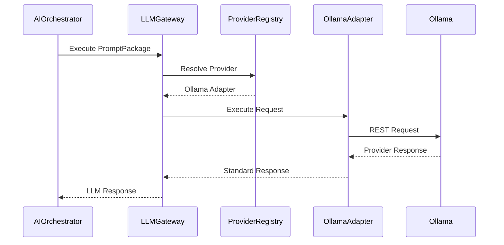
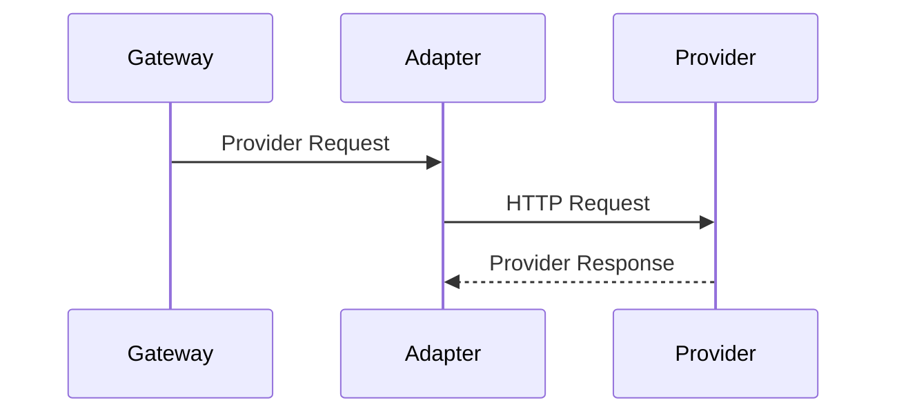
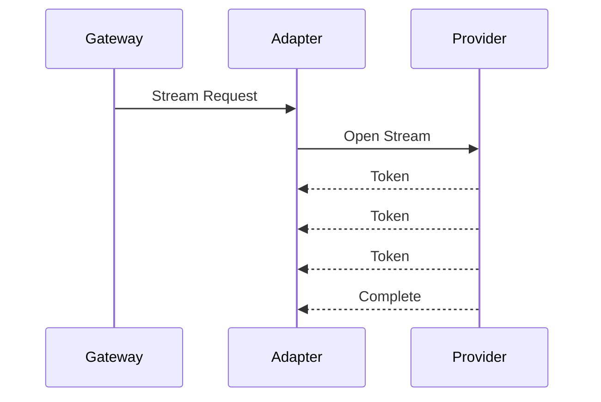
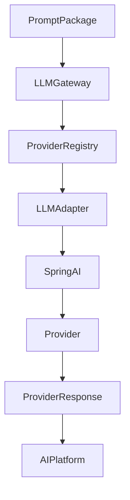

# 12.3 — Ollama Integration Architecture (Part I)

> **Document Version:** 2.0.0
> **Status:** Draft — Architecture Review Pending
>
> **Parent Documents**
>
> * `00-PesoPilot-v2.0-Source-of-Truth.md`
> * `01-Rule-Based-Financial-Intelligence-Architecture.md`
> * `02-InsightBundle-and-Data-Contracts.md`
> * `03-Insight-Engine-Architecture.md`
> * `04-Rule-Engine-Architecture.md`
> * `05-Health-Engine-Architecture.md`
> * `06-Income-Engine-Architecture.md`
> * `07-Expense-Engine-Architecture.md`
> * `08-Savings-&-Goal-Engine-Architecture.md`
> * `09-Cashflow-&-Cutoff-Engine-Architecture.md`
> * `10-Recommendation-Engine-Architecture.md`
> * `11-Summary-Engine-Architecture.md`
> * `12.0-AI-Platform-Architecture-Overview.md`
> * `12.1-Prompt-Builder-Architecture.md`
> * `12.2-Conversation-Engine-Architecture.md`
>
> **Phase**
>
> Phase 11B / Phase 12 — AI Financial Intelligence Platform
>
> **Section**
>
> Introduction, Provider Philosophy, Responsibilities & Overall LLM Integration Architecture

---

# 1. Purpose

The LLM Integration Architecture defines how the PesoPilot AI Platform communicates with Large Language Models.

Its purpose is to isolate provider-specific implementation details behind stable application interfaces, allowing the Financial Intelligence Platform and AI Platform to remain independent of any particular LLM provider.

Although Phase 12 initially integrates with Ollama, the architecture is intentionally provider-agnostic and designed to support multiple providers without modifying business logic.

---

# 2. Position Within the AI Platform

The Provider Integration Layer sits beneath the AI Orchestration Engine.

```mermaid
flowchart TD

Financial Intelligence Platform

-->

Conversation Engine

Conversation Engine

-->

Prompt Builder

Prompt Builder

-->

AI Orchestration Engine

AI Orchestration Engine

-->

LLM Gateway

LLM Gateway

-->

LLM Adapter Interface

LLM Adapter Interface

-->

Ollama Adapter

Ollama Adapter

-->

Ollama
```

Business logic never communicates directly with provider implementations.

---

# 3. Provider Philosophy

The Provider Integration Layer follows one fundamental principle:

> **The AI Platform depends on provider abstractions, never on provider implementations.**

Every interaction with a language model occurs through architecture contracts rather than vendor-specific APIs.

Replacing a provider should require changing only its adapter.

---

# 4. Provider Integration Philosophy

The Provider Layer exists to translate provider-independent application requests into provider-specific requests.

Responsibilities include:

* request translation,
* response translation,
* provider configuration,
* transport communication,
* runtime policies,
* provider diagnostics.

Business logic remains unaware of provider implementation details.

---

# 5. Guiding Principles

The Provider Integration Layer follows ten architectural principles.

---

## 5.1 Provider Independence

Every provider implements the same LLM Adapter Interface.

The AI Platform never depends directly on Ollama-specific APIs.

---

## 5.2 Stable Contracts

Application layers exchange stable DTOs.

Provider-specific payloads are created only inside adapters.

---

## 5.3 Single Provider Boundary

All outbound LLM requests pass through the LLM Gateway.

No application service communicates directly with provider adapters.

---

## 5.4 Separation of Responsibilities

The Provider Layer:

* translates requests,
* executes provider communication,
* parses responses,
* manages provider configuration.

It does **not**:

* construct prompts,
* manage conversations,
* calculate financial intelligence,
* validate financial rules,
* generate recommendations.

---

## 5.5 Deterministic Translation

Given the same PromptPackage and configuration, adapters must produce identical provider requests.

Translation behavior must remain deterministic.

---

## 5.6 Runtime Flexibility

Provider selection is determined by configuration rather than application code.

This allows providers to be replaced without recompiling business logic.

---

## 5.7 Provider Isolation

Failures occurring inside one provider must not affect the architecture of the remaining AI Platform.

Provider-specific exceptions are translated into standardized application exceptions.

---

## 5.8 Observability

Every provider request and response should expose telemetry for diagnostics, performance monitoring, and troubleshooting.

Observability must not expose sensitive financial information.

---

## 5.9 Scalability

The architecture must support multiple simultaneous providers, models, and deployment environments without structural changes.

---

## 5.10 Extensibility

New providers should be introduced by implementing the LLM Adapter Interface and registering them with the LLM Gateway.

Existing application components should remain unchanged.

---

# 6. Responsibilities

The Provider Integration Layer owns:

* provider selection,
* request serialization,
* response deserialization,
* provider configuration,
* transport communication,
* retry coordination,
* timeout handling,
* provider diagnostics.

The Provider Integration Layer does **not** own:

* PromptPackage generation,
* conversation management,
* memory retrieval,
* AI orchestration,
* financial intelligence,
* response validation.

---

# 7. Inputs

The Provider Layer receives:

```text
PromptPackage

Provider Configuration

Execution Options

Runtime Metadata
```

These inputs are translated into provider-specific requests.

---

# 8. Outputs

The Provider Layer produces:

```text
Provider Response

├── Generated Content
├── Usage Metrics
├── Provider Metadata
├── Execution Statistics
├── Finish Reason
└── Diagnostics
```

The AI Orchestration Engine receives provider-independent responses.

---

# 9. Overall Provider Flow

```mermaid
flowchart TD

PromptPackage

-->

LLM Gateway

LLM Gateway

-->

LLM Adapter Interface

LLM Adapter Interface

-->

Provider Adapter

Provider Adapter

-->

Provider API

Provider API

-->

Language Model
```

Each layer performs one architectural responsibility.

---

# 10. Internal Components

```text
Provider Integration Layer

├── LLM Gateway

├── Provider Registry

├── LLM Adapter Interface

├── Provider Configuration Manager

├── Provider Health Monitor

├── Provider Diagnostics

├── Retry Coordinator

└── Response Translator
```

Every component has a single responsibility.

---

# 11. Relationship with Other AI Components

```mermaid
flowchart LR

AI Orchestration Engine

-->

LLM Gateway

LLM Gateway

-->

LLM Adapter Interface

LLM Adapter Interface

-->

Provider Adapters

Provider Adapters

-->

Language Models
```

The Provider Layer acts as the execution boundary of the AI Platform.

---

# 12. LLM Gateway Responsibilities

The LLM Gateway answers questions such as:

* Which provider should execute this request?
* Which model should be selected?
* Which adapter should handle the request?
* Which execution policies apply?
* How should provider failures be handled?

It does **not** construct prompts or interpret AI responses.

---

# 13. Overall LLM Integration Architecture



---

# 14. Future Evolution

The Provider Integration Layer is designed for future expansion.

Potential enhancements include:

* intelligent provider routing,
* multi-provider execution,
* provider failover,
* load balancing,
* provider health scoring,
* capability-based model routing,
* hybrid local/cloud execution,
* cost-aware provider selection,
* latency-aware routing,
* enterprise policy enforcement.

These enhancements extend the Provider Layer without changing the AI Platform.

---

# 15. Architecture Decision Records

## ADR-261

### Why Introduce a Provider Integration Layer?

**Decision**

Provider communication is isolated into a dedicated architectural layer.

**Reason**

Separates business logic from provider implementations and simplifies future provider replacement.

---

## ADR-262

### Why Introduce an LLM Gateway?

**Decision**

All provider communication passes through a centralized gateway.

**Reason**

Enables provider routing, policy enforcement, telemetry, and future failover without affecting upstream components.

---

## ADR-263

### Why Depend on an LLM Adapter Interface?

**Decision**

All providers implement a common adapter interface.

**Reason**

Preserves provider independence and minimizes application coupling.

---

## ADR-264

### Why Keep Provider Translation Deterministic?

**Decision**

PromptPackage translation must always produce predictable provider requests.

**Reason**

Supports reproducibility, testing, diagnostics, and consistent execution.

---

## ADR-265

### Why Keep Provider Logic Isolated?

**Decision**

Provider-specific APIs and payloads remain inside adapters.

**Reason**

Protects the rest of the architecture from vendor-specific changes.

---

# 16. Acceptance Criteria

This section is complete when:

* Provider philosophy is documented.
* Provider responsibilities are defined.
* LLM Gateway architecture is established.
* Adapter abstraction is documented.
* Overall provider integration flow is defined.
* Internal components are documented.
* Future extensibility is specified.
* Architecture decisions are recorded.

---

# Part I Summary

Part I establishes the Provider Integration Layer as the execution boundary between the AI Platform and external language models. Through the introduction of the LLM Gateway, Provider Registry, and LLM Adapter Interface, the architecture ensures that business logic depends only on stable abstractions while provider-specific communication remains isolated within dedicated adapters. Although Ollama is the initial implementation for Phase 12, the architecture is intentionally provider-independent, enabling future support for additional LLM providers without requiring changes to the Financial Intelligence Platform, Conversation Engine, Prompt Builder, or AI Orchestration Engine.

---

**End of Part I**

**Next Section:** **Part II — LLM Adapter Interface, Provider Model, Ollama Adapter, Provider Configuration & Request Lifecycle**

# 12.3 — Ollama Integration Architecture (Part II)

> **Document Version:** 2.0.0
> **Status:** Draft — Architecture Review Pending
>
> **Parent Documents**
>
> * `00-PesoPilot-v2.0-Source-of-Truth.md`
> * `01-Rule-Based-Financial-Intelligence-Architecture.md`
> * `02-InsightBundle-and-Data-Contracts.md`
> * `03-Insight-Engine-Architecture.md`
> * `04-Rule-Engine-Architecture.md`
> * `05-Health-Engine-Architecture.md`
> * `06-Income-Engine-Architecture.md`
> * `07-Expense-Engine-Architecture.md`
> * `08-Savings-&-Goal-Engine-Architecture.md`
> * `09-Cashflow-&-Cutoff-Engine-Architecture.md`
> * `10-Recommendation-Engine-Architecture.md`
> * `11-Summary-Engine-Architecture.md`
> * `12.0-AI-Platform-Architecture-Overview.md`
> * `12.1-Prompt-Builder-Architecture.md`
> * `12.2-Conversation-Engine-Architecture.md`
>
> **Phase**
>
> Phase 11B / Phase 12 — AI Financial Intelligence Platform
>
> **Section**
>
> LLM Adapter Interface, Provider Model, Ollama Adapter, Provider Configuration & Request Lifecycle

---

# 17. Purpose

Part I established the philosophy and architectural boundaries of the Provider Integration Layer.

This section defines the Provider Layer's domain model and execution contracts.

Rather than allowing application services to communicate directly with provider implementations, PesoPilot introduces standardized provider abstractions that isolate runtime behavior from business logic.

---

# 18. Provider Domain Philosophy

The Provider Layer models three primary concepts.

```text id="1v0n5x"
LLM Adapter Interface

↓

Provider Model

↓

Provider Session
```

Together they define:

* how providers are discovered,
* how requests are executed,
* how runtime behavior is tracked.

---

# 19. LLM Adapter Interface

Every provider implements the same interface.

```text id="0hm7bq"
LLM Adapter Interface

├── initialize()

├── validate()

├── execute()

├── stream()

├── cancel()

├── health()

└── shutdown()
```

The AI Platform depends exclusively on this interface.

---

# 20. Adapter Philosophy

Adapters translate provider-independent contracts into provider-specific implementations.

Adapters are responsible for:

* request translation,
* provider communication,
* response translation,
* provider diagnostics.

Adapters never contain business logic.

---

# 21. Provider Model

The Provider Model describes a configured LLM provider.

```text id="ah26d8"
Provider Model

├── Provider ID
├── Provider Name
├── Provider Type
├── Supported Models
├── Capabilities
├── Configuration
├── Health Status
├── Version
└── Metadata
```

The Provider Model is immutable during execution.

---

# 22. Provider Types

Supported provider categories include:

```text id="gl6n7q"
Local Runtime

Cloud API

Enterprise Gateway

Hybrid Provider

Future Provider
```

Ollama belongs to the Local Runtime category.

---

# 23. Provider Capabilities

Each provider advertises its capabilities.

Examples

```text id="vxpm8m"
Streaming

Chat Completion

Structured Output

Function Calling

Vision

Embedding

Tool Calling

Reasoning Models
```

Capabilities allow the AI Platform to select compatible providers.

---

# 24. Provider Configuration

Provider configuration remains externalized.

```text id="nq8rsl"
Provider Configuration

├── Base URL
├── Default Model
├── Timeout
├── Retry Policy
├── Maximum Tokens
├── Temperature
├── Streaming Enabled
├── Authentication
└── Version
```

Configuration is loaded during application startup.

---

# 25. Ollama Adapter

The Ollama Adapter implements the LLM Adapter Interface.

```mermaid id="t9huw5"
flowchart TD

LLM Adapter Interface

-->

Ollama Adapter

Ollama Adapter

-->

Ollama REST API

Ollama REST API

-->

Local Model
```

The adapter is responsible only for Ollama-specific behavior.

---

# 26. Ollama Adapter Responsibilities

The Ollama Adapter owns:

* request serialization,
* HTTP communication,
* model selection,
* streaming communication,
* response parsing,
* provider diagnostics,
* timeout handling,
* retry execution.

It does **not** own prompt construction or orchestration.

---

# 27. Provider Registry

The Provider Registry manages available adapters.

```text id="m3hvpy"
Provider Registry

├── Registered Providers
├── Default Provider
├── Provider Resolution
├── Health Status
└── Metadata
```

The LLM Gateway consults the registry before execution.

---

# 28. Provider Session

Every execution creates a Provider Session.

```text id="a8tf6e"
Provider Session

├── Session ID
├── Provider
├── Model
├── PromptPackage ID
├── Request Metadata
├── Execution State
├── Diagnostics
└── Version
```

Provider Sessions are short-lived runtime objects.

---

# 29. Provider Session Philosophy

Provider Session represents one execution.

Example

```text id="y9nrzt"
PromptPackage

↓

Provider Session

↓

Provider Response

↓

Session Completed
```

Sessions do not persist conversation history.

---

# 30. Request Lifecycle

Every provider request follows the same lifecycle.

```mermaid id="x7kgjv"
flowchart LR

PromptPackage

-->

Provider Session

-->

Adapter Translation

-->

Provider Request

-->

Provider Execution

-->

Provider Response
```

Lifecycle remains provider-independent.

---

# 31. Provider Request

The Provider Request represents the serialized payload sent to the provider.

```text id="3txx7v"
Provider Request

├── System Prompt
├── User Prompt
├── Runtime Configuration
├── Model Selection
├── Generation Options
└── Metadata
```

This object is created by the adapter.

---

# 32. Provider Response

Provider responses are normalized before returning to the AI Platform.

```text id="d8h8sw"
Provider Response

├── Generated Content
├── Finish Reason
├── Usage Metrics
├── Provider Metadata
├── Diagnostics
└── Version
```

Normalization ensures provider-independent behavior.

---

# 33. Provider Lifecycle

```mermaid id="sikmfr"
flowchart TD

Provider Loaded

-->

Configuration Validated

-->

Provider Registered

-->

Ready

-->

Executing

-->

Completed

-->

Shutdown
```

Lifecycle management is owned by the Provider Layer.

---

# 34. Provider Health

Every provider exposes health information.

```text id="76v3tb"
Health Status

Available

Busy

Unavailable

Recovering

Disabled
```

Health status supports routing and failover.

---

# 35. Provider Selection

Provider selection considers:

```text id="h2ik7g"
Requested Model

↓

Capabilities

↓

Provider Availability

↓

Configuration Policy

↓

Default Provider
```

Selection remains deterministic.

---

# 36. Configuration Reload

Configuration updates may occur without restarting the AI Platform.

Supported updates include:

* default model,
* timeout,
* retry policy,
* token limits,
* provider enablement.

Runtime configuration changes do not affect active Provider Sessions.

---

# 37. Diagnostics

Provider diagnostics include:

```text id="e1t3sx"
Provider ID

Model

Execution Time

Retry Count

Latency

Streaming Mode

Health Status

Request Size
```

Diagnostics are used internally for monitoring and troubleshooting.

---

# 38. Future Provider Support

Future providers may include:

```text id="shv6p1"
OpenAI

Claude

Gemini

DeepSeek

Mistral

Azure OpenAI

AWS Bedrock

Self-Hosted Models
```

Each provider implements the same adapter interface.

---

# 39. Architecture Decision Records

## ADR-266

### Why Introduce a Provider Model?

**Decision**

Providers are represented as domain objects.

**Reason**

Separates provider configuration from execution logic and enables provider discovery and health management.

---

## ADR-267

### Why Create Provider Sessions?

**Decision**

Each execution uses a dedicated Provider Session.

**Reason**

Supports runtime diagnostics, retries, streaming, and execution metadata without polluting adapter implementations.

---

## ADR-268

### Why Normalize Provider Responses?

**Decision**

Adapters translate provider responses into a standard Provider Response.

**Reason**

Allows the AI Platform to remain independent of provider-specific response formats.

---

## ADR-269

### Why Externalize Provider Configuration?

**Decision**

Provider settings are configuration-driven.

**Reason**

Supports environment-specific deployments and runtime flexibility.

---

## ADR-270

### Why Use a Provider Registry?

**Decision**

The LLM Gateway resolves providers through a centralized registry.

**Reason**

Simplifies provider discovery, health monitoring, and future multi-provider routing.

---

# 40. Acceptance Criteria

This section is complete when:

* LLM Adapter Interface is defined.
* Provider Model is standardized.
* Provider Session is documented.
* Ollama Adapter responsibilities are established.
* Provider Configuration is specified.
* Request lifecycle is documented.
* Response normalization is defined.
* Future provider extensibility is documented.

---

# Part II Summary

Part II defines the core execution contracts of the Provider Integration Layer. Through the introduction of the `LLM Adapter Interface`, `Provider Model`, `Provider Session`, centralized `Provider Registry`, and standardized request and response models, the architecture establishes a provider-independent execution framework. The Ollama Adapter serves as the first concrete implementation, translating standardized PromptPackages into Ollama REST requests while keeping provider-specific concerns isolated from the rest of the AI Platform. This design enables future providers to be integrated with minimal architectural impact while preserving deterministic behavior, extensibility, and maintainability.

---

**End of Part II**

**Next Section:** **Part III — Request Pipeline, Response Pipeline, Streaming, Retry Strategy, Error Recovery & Provider Validation**

# 12.3 — Ollama Integration Architecture (Part III)

> **Document Version:** 2.0.0
> **Status:** Draft — Architecture Review Pending
>
> **Parent Documents**
>
> * `00-PesoPilot-v2.0-Source-of-Truth.md`
> * `01-Rule-Based-Financial-Intelligence-Architecture.md`
> * `02-InsightBundle-and-Data-Contracts.md`
> * `03-Insight-Engine-Architecture.md`
> * `04-Rule-Engine-Architecture.md`
> * `05-Health-Engine-Architecture.md`
> * `06-Income-Engine-Architecture.md`
> * `07-Expense-Engine-Architecture.md`
> * `08-Savings-&-Goal-Engine-Architecture.md`
> * `09-Cashflow-&-Cutoff-Engine-Architecture.md`
> * `10-Recommendation-Engine-Architecture.md`
> * `11-Summary-Engine-Architecture.md`
> * `12.0-AI-Platform-Architecture-Overview.md`
> * `12.1-Prompt-Builder-Architecture.md`
> * `12.2-Conversation-Engine-Architecture.md`
>
> **Phase**
>
> Phase 11B / Phase 12 — AI Financial Intelligence Platform
>
> **Section**
>
> Request Pipeline, Response Pipeline, Streaming, Retry Strategy, Error Recovery & Provider Validation

---

# 41. Purpose

Part II defined the Provider Layer domain model.

This section defines how Provider Sessions execute requests and responses while maintaining deterministic behavior, provider independence, reliability, and observability.

The Provider Layer owns communication with language model providers but remains isolated from business logic and conversation management.

---

# 42. Provider Execution Philosophy

Every provider execution is modeled as two independent pipelines.

```text
Outbound Pipeline

↓

Provider

↓

Inbound Pipeline
```

Separating outbound and inbound processing improves extensibility and keeps request concerns independent from response concerns.

---

# 43. Overall Provider Execution Pipeline

```mermaid
flowchart TD

PromptPackage

-->

Outbound Pipeline

Outbound Pipeline

-->

Provider Session

Provider Session

-->

Provider

Provider

-->

Inbound Pipeline

Inbound Pipeline

-->

Provider Response
```

Both pipelines remain deterministic.

---

# 44. Outbound Pipeline

The Outbound Pipeline prepares provider execution.

Responsibilities:

* validate PromptPackage,
* create Provider Session,
* resolve provider,
* translate request,
* apply runtime policies,
* execute provider request.

The outbound pipeline owns everything before the provider call.

---

# 45. Outbound Pipeline Stages

```mermaid
flowchart LR

PromptPackage

-->

Validation

-->

Provider Resolution

-->

Request Translation

-->

Policy Injection

-->

Provider Request

-->

Provider
```

Each stage performs exactly one transformation.

---

# 46. PromptPackage Validation

Before execution the Provider Layer verifies:

Required fields

* System Prompt
* User Prompt
* Runtime Configuration
* Provider Configuration

Validation rules

* supported provider,
* supported model,
* valid PromptPackage version,
* valid execution mode,
* valid token limits.

Invalid requests never reach the provider.

---

# 47. Provider Resolution

The LLM Gateway resolves:

```text
Execution Request

↓

Provider Registry

↓

Selected Provider

↓

Adapter
```

Resolution is deterministic.

Configuration drives provider selection.

---

# 48. Request Translation

Each adapter converts the PromptPackage into a provider-specific request.

Example

```text
PromptPackage

↓

Ollama Request JSON
```

Translation remains adapter-specific.

Business logic never generates provider payloads.

---

# 49. Runtime Policy Injection

Execution policies are injected before sending the request.

Examples

```text
Timeout

Retry Policy

Temperature

Maximum Tokens

Streaming

Provider Options
```

Policies originate from configuration rather than application code.

---

# 50. Provider Execution

Provider execution represents the only external communication performed by the Provider Layer.



The Provider Layer owns transport communication.

---

# 51. Inbound Pipeline

The Inbound Pipeline processes provider responses.

Responsibilities:

* response parsing,
* response normalization,
* diagnostics,
* execution metrics,
* provider validation.

The inbound pipeline never modifies generated content.

---

# 52. Inbound Pipeline Stages

```mermaid
flowchart LR

Provider Response

-->

Response Parsing

-->

Normalization

-->

Validation

-->

Diagnostics

-->

Standard Response
```

Each stage remains independent.

---

# 53. Response Parsing

Adapters parse provider-specific payloads.

Example

```text
Ollama JSON

↓

Provider Response DTO
```

Parsing is isolated inside adapters.

---

# 54. Response Normalization

Provider responses are normalized into a common format.

```text
Provider Response

├── Generated Content
├── Finish Reason
├── Usage Metrics
├── Provider Metadata
└── Diagnostics
```

Normalization hides provider-specific differences.

---

# 55. Provider Validation

Before returning responses to the AI Platform, validation verifies:

* response completeness,
* successful execution,
* supported finish reason,
* provider metadata,
* usage metrics consistency.

Malformed responses are rejected.

---

# 56. Streaming Architecture

Streaming follows the same architecture.

```mermaid
flowchart TD

PromptPackage

-->

Provider Session

Provider Session

-->

Streaming Adapter

Streaming Adapter

-->

Provider Stream

Provider Stream

-->

Token Aggregator

Token Aggregator

-->

Streaming Response
```

Streaming does not change business logic.

Only execution mode changes.

---

# 57. Streaming Lifecycle



Tokens are processed incrementally.

---

# 58. Retry Strategy

Retries occur only for recoverable failures.

Examples

* transient network failures,
* provider timeouts,
* temporary provider overload.

Retries are **not** performed for:

* invalid PromptPackage,
* unsupported models,
* malformed requests,
* validation failures.

Retry behavior is policy-driven.

---

# 59. Retry Lifecycle

```mermaid
flowchart LR

Execution

-->

Failure

-->

Retry Policy

-->

Retry

-->

Success

Failure

-->

Max Retries

-->

Error
```

Retry count is configurable.

---

# 60. Error Recovery

The Provider Layer handles:

* provider unavailable,
* connection failure,
* timeout,
* malformed response,
* streaming interruption,
* configuration errors.

Errors are translated into standardized application exceptions.

---

# 61. Provider Health Recovery

When provider failures occur repeatedly:

```text
Failure

↓

Health Monitor

↓

Provider Unavailable

↓

Gateway Update
```

The gateway can avoid unhealthy providers.

---

# 62. Execution Metrics

Each Provider Session records:

```text
Execution Time

Latency

Retry Count

Prompt Tokens

Completion Tokens

Streaming Duration

Provider Version
```

Metrics support monitoring and optimization.

---

# 63. Provider Diagnostics

Diagnostics include:

```text
Provider ID

Model

Request ID

Session ID

Execution Status

Finish Reason

Transport Status

Health Status
```

Diagnostics remain internal.

---

# 64. Future Execution Features

Future enhancements may include:

```text
Parallel Provider Execution

Provider Voting

Speculative Decoding

Adaptive Retry Policies

Automatic Failover

Provider Load Balancing

Cost-Based Routing

Latency-Based Routing
```

These capabilities extend execution without changing business logic.

---

# 65. Architecture Decision Records

## ADR-271

### Why Separate Outbound and Inbound Pipelines?

**Decision**

Provider execution is modeled as two independent pipelines.

**Reason**

Allows request and response processing to evolve independently while improving maintainability and extensibility.

---

## ADR-272

### Why Centralize Runtime Policies?

**Decision**

Execution policies are injected before provider communication.

**Reason**

Keeps adapters focused on translation and transport while maintaining consistent runtime behavior.

---

## ADR-273

### Why Normalize Responses?

**Decision**

All provider responses are translated into a common Provider Response.

**Reason**

Prevents provider-specific response formats from leaking into the AI Platform.

---

## ADR-274

### Why Restrict Retry Behavior?

**Decision**

Retries occur only for recoverable infrastructure failures.

**Reason**

Prevents unnecessary provider calls for deterministic validation errors.

---

## ADR-275

### Why Track Provider Metrics?

**Decision**

Every Provider Session records execution metrics and diagnostics.

**Reason**

Supports monitoring, optimization, troubleshooting, capacity planning, and future intelligent provider routing.

---

# 66. Acceptance Criteria

This section is complete when:

* Outbound Pipeline is documented.
* Inbound Pipeline is documented.
* Request translation is defined.
* Response normalization is specified.
* Streaming architecture is documented.
* Retry strategy is established.
* Error recovery is documented.
* Provider validation is standardized.
* Diagnostics and metrics are defined.
* Future extensibility is documented.

---

# Part III Summary

Part III defines the runtime execution architecture of the Provider Integration Layer. By separating provider execution into deterministic outbound and inbound pipelines, the architecture isolates request preparation, provider communication, response normalization, streaming, retry policies, validation, and diagnostics into well-defined stages. This layered design keeps provider-specific behavior confined to adapters while exposing a consistent execution model to the AI Platform, ensuring reliability, extensibility, observability, and long-term support for multiple LLM providers.

---

**End of Part III**

**Next Section:** **Part IV — Provider DTOs, Spring AI Integration, Ollama Integration, Model Management & Multi-Provider Support**

# 12.3 — Ollama Integration Architecture (Part IV)

> **Document Version:** 2.0.0
> **Status:** Draft — Architecture Review Pending
>
> **Parent Documents**
>
> * `00-PesoPilot-v2.0-Source-of-Truth.md`
> * `01-Rule-Based-Financial-Intelligence-Architecture.md`
> * `02-InsightBundle-and-Data-Contracts.md`
> * `03-Insight-Engine-Architecture.md`
> * `04-Rule-Engine-Architecture.md`
> * `05-Health-Engine-Architecture.md`
> * `06-Income-Engine-Architecture.md`
> * `07-Expense-Engine-Architecture.md`
> * `08-Savings-&-Goal-Engine-Architecture.md`
> * `09-Cashflow-&-Cutoff-Engine-Architecture.md`
> * `10-Recommendation-Engine-Architecture.md`
> * `11-Summary-Engine-Architecture.md`
> * `12.0-AI-Platform-Architecture-Overview.md`
> * `12.1-Prompt-Builder-Architecture.md`
> * `12.2-Conversation-Engine-Architecture.md`
>
> **Phase**
>
> Phase 11B / Phase 12 — AI Financial Intelligence Platform
>
> **Section**
>
> Provider DTOs, Spring AI Integration, Ollama Integration, Model Management & Multi-Provider Support

---

# 67. Purpose

The previous sections defined:

* Provider philosophy,
* Provider abstractions,
* Provider models,
* execution pipelines,
* streaming,
* retry strategies,
* validation.

This section defines how the Provider Integration Layer communicates with Spring AI, Ollama, and future providers while maintaining complete isolation between the AI Platform and provider-specific technologies.

---

# 68. Provider DTO Philosophy

The Provider Layer owns every object exchanged with external providers.

The remainder of the AI Platform communicates exclusively through Provider DTOs.

External framework classes must never cross architectural boundaries.

---

# 69. Provider DTO Architecture


Every boundary communicates using standardized DTOs.

---

# 70. Provider Request DTO

Every execution begins with a standardized request object.

```text
ProviderRequestDTO

├── PromptPackage ID
├── System Prompt
├── User Prompt
├── Runtime Configuration
├── Model Selection
├── Execution Options
├── Metadata
└── Version
```

ProviderRequestDTO remains provider-independent.

---

# 71. Provider Response DTO

Every provider returns a normalized response.

```text
ProviderResponseDTO

├── Generated Content
├── Finish Reason
├── Usage Metrics
├── Provider Metadata
├── Diagnostics
└── Version
```

The AI Platform never consumes raw provider payloads.

---

# 72. DTO Translation

```mermaid
flowchart LR

PromptPackage

-->

ProviderRequestDTO

-->

Spring AI Request

-->

Provider

-->

Spring AI Response

-->

ProviderResponseDTO
```

Translation occurs only inside the Provider Layer.

---

# 73. Spring AI Integration Philosophy

Spring AI is treated as an infrastructure library.

It provides:

* provider clients,
* transport abstraction,
* streaming support,
* model integration,
* request execution.

Spring AI is **not** part of the application domain.

Business services never depend directly on Spring AI classes.

---

# 74. Spring AI Position

```mermaid
flowchart TD

AI Orchestration Engine

-->

LLM Gateway

LLM Gateway

-->

LLM Adapter

LLM Adapter

-->

Spring AI

Spring AI

-->

Provider API
```

Spring AI is hidden behind the adapter.

---

# 75. Spring AI Responsibilities

Spring AI is responsible for:

* HTTP communication,
* request execution,
* streaming transport,
* provider client management,
* connection handling.

Spring AI is not responsible for:

* prompt construction,
* conversation management,
* financial intelligence,
* provider selection,
* business validation.

---

# 76. Ollama Integration

For Phase 12, Ollama is the primary implementation.

```mermaid
flowchart TD

ProviderRequestDTO

-->

Ollama Adapter

Ollama Adapter

-->

Spring AI Ollama Client

Spring AI Ollama Client

-->

Ollama REST API

Ollama REST API

-->

Local Model
```

The rest of the AI Platform remains unaware of Ollama-specific APIs.

---

# 77. Ollama Model Management

The Provider Layer manages:

```text
Available Models

Default Model

Model Version

Capabilities

Memory Requirements

Status

Configuration
```

Model selection is configuration-driven.

---

# 78. Model Selection

Model selection follows deterministic rules.

```text
Requested Capability

↓

Provider Policy

↓

Configured Default

↓

Selected Model
```

Examples include selecting lighter models for simple explanations and larger reasoning models for complex financial coaching.

The selection policy remains centralized within the Provider Layer.

---

# 79. Runtime Model Configuration

Each execution may specify:

```text
Model Name

Temperature

Maximum Tokens

Context Window

Streaming Mode

Seed

Reasoning Level

Provider Options
```

Runtime settings remain independent of business logic.

---

# 80. Model Registry

The Provider Layer maintains a registry.

```text
Model Registry

├── Model ID
├── Provider
├── Version
├── Context Window
├── Supported Features
├── Status
└── Metadata
```

The registry enables capability-aware execution.

---

# 81. Multi-Provider Support

Future providers follow the same architecture.

```text
LLM Gateway

↓

LLM Adapter Interface

├── Ollama Adapter

├── OpenAI Adapter

├── Claude Adapter

├── Gemini Adapter

├── Azure OpenAI Adapter

├── AWS Bedrock Adapter

└── Future Providers
```

No upstream component changes.

---

# 82. Provider Capability Routing

Providers advertise supported capabilities.

```text
Structured Output

Streaming

Vision

Reasoning

Embeddings

Tool Calling

Function Calling
```

The gateway can route requests to providers capable of satisfying the requested features.

---

# 83. Provider Compatibility

Compatibility is evaluated using:

```text
Prompt Mode

↓

Required Capability

↓

Provider Capability

↓

Model Availability

↓

Execution
```

Unsupported providers are rejected before execution begins.

---

# 84. Provider Synchronization

Configuration changes propagate through:

```mermaid
flowchart LR

Configuration

-->

Provider Registry

-->

LLM Gateway

-->

Provider Adapters

-->

Execution
```

Active Provider Sessions remain unaffected until completion.

---

# 85. Provider Diagnostics

Provider DTOs expose diagnostics.

```text
Provider

Model

Execution Time

Latency

Streaming

Retry Count

Finish Reason

Provider Version

Framework Version
```

Diagnostics support monitoring and operational analysis.

---

# 86. Future Provider Architecture

Future enhancements may include:

```text
Dynamic Model Discovery

Automatic Capability Detection

Provider Benchmarking

Cost-Based Model Selection

Hybrid Local + Cloud Execution

Intelligent Provider Routing

Enterprise Provider Policies

Regional Provider Selection
```

These enhancements build on the existing Provider Layer without changing application architecture.

---

# 87. Architecture Decision Records

## ADR-276

### Why Introduce Provider DTOs?

**Decision**

The Provider Layer communicates using provider-independent DTOs.

**Reason**

Prevents framework and provider classes from leaking into application code.

---

## ADR-277

### Why Treat Spring AI as Infrastructure?

**Decision**

Spring AI is isolated behind adapters.

**Reason**

Allows framework replacement or upgrades without affecting business logic.

---

## ADR-278

### Why Centralize Model Management?

**Decision**

Model discovery, configuration, and selection are managed by the Provider Layer.

**Reason**

Provides consistent execution policies and simplifies provider administration.

---

## ADR-279

### Why Maintain a Model Registry?

**Decision**

Available models are registered as managed resources.

**Reason**

Supports capability-aware routing, diagnostics, and future dynamic provider selection.

---

## ADR-280

### Why Design for Multi-Provider Execution?

**Decision**

The architecture assumes multiple providers from the beginning.

**Reason**

Protects long-term flexibility and avoids provider lock-in.

---

# 88. Acceptance Criteria

This section is complete when:

* Provider DTOs are standardized.
* Spring AI integration is documented.
* Ollama integration boundary is defined.
* Model management is established.
* Model registry is documented.
* Multi-provider support is specified.
* Capability routing is documented.
* Future extensibility is defined.

---

# Part IV Summary

Part IV establishes the Provider Layer as the runtime integration boundary between the AI Platform and external language model technologies. By introducing Provider DTOs, isolating Spring AI as infrastructure, encapsulating Ollama-specific behavior inside dedicated adapters, centralizing model management through a Model Registry, and supporting capability-driven multi-provider routing, the architecture ensures that the Financial Intelligence Platform, Conversation Engine, Prompt Builder, and AI Orchestration Engine remain completely independent of provider implementations. This provider-neutral design enables PesoPilot to adopt new frameworks, models, and LLM providers with minimal architectural impact while preserving deterministic behavior, maintainability, and long-term extensibility.

---

**End of Part IV**

**Next Section:** **Part V — Testing Strategy, Future Evolution, Acceptance Criteria & Implementation Roadmap**

# 12.3 — Ollama Integration Architecture (Part V)

> **Document Version:** 2.0.0
> **Status:** Draft — Architecture Review Pending
>
> **Parent Documents**
>
> * `00-PesoPilot-v2.0-Source-of-Truth.md`
> * `01-Rule-Based-Financial-Intelligence-Architecture.md`
> * `02-InsightBundle-and-Data-Contracts.md`
> * `03-Insight-Engine-Architecture.md`
> * `04-Rule-Engine-Architecture.md`
> * `05-Health-Engine-Architecture.md`
> * `06-Income-Engine-Architecture.md`
> * `07-Expense-Engine-Architecture.md`
> * `08-Savings-&-Goal-Engine-Architecture.md`
> * `09-Cashflow-&-Cutoff-Engine-Architecture.md`
> * `10-Recommendation-Engine-Architecture.md`
> * `11-Summary-Engine-Architecture.md`
> * `12.0-AI-Platform-Architecture-Overview.md`
> * `12.1-Prompt-Builder-Architecture.md`
> * `12.2-Conversation-Engine-Architecture.md`
>
> **Phase**
>
> Phase 11B / Phase 12 — AI Financial Intelligence Platform
>
> **Section**
>
> Testing Strategy, Future Evolution, Acceptance Criteria & Implementation Roadmap

---

# 89. Purpose

The previous sections defined:

* Provider philosophy,
* Provider abstractions,
* LLM Adapter Interface,
* Provider execution pipeline,
* Spring AI integration,
* Ollama integration,
* model management,
* multi-provider architecture.

This final section defines how the Provider Integration Layer is implemented, tested, evolved, and governed throughout the PesoPilot AI Platform.

---

# 90. Provider Layer Integration Overview

The Provider Integration Layer represents the execution boundary between the AI Platform and external language models.



Every execution follows the same deterministic architecture.

---

# 91. AI Platform Integration

The Provider Layer integrates with:

```mermaid
flowchart LR

AIOrchestrationEngine

-->

LLMGateway

LLMGateway

-->

ProviderRegistry

ProviderRegistry

-->

ProviderAdapters

ProviderAdapters

-->

LanguageModels
```

Only the AI Orchestration Engine communicates with the Provider Layer.

---

# 92. Spring AI Integration

Spring AI remains the infrastructure abstraction.

Responsibilities:

* provider client creation,
* transport execution,
* streaming support,
* provider communication,
* framework integration.

Spring AI never performs business logic.

---

# 93. Provider Lifecycle

Every provider follows the same lifecycle.

```mermaid
flowchart LR

Registered

-->

Initialized

-->

Validated

-->

Ready

-->

Executing

-->

Completed

-->

Shutdown
```

Lifecycle management is owned by the Provider Layer.

---

# 94. Testing Philosophy

Provider Layer testing follows three principles.

1. Business logic must never depend on providers.

2. Provider adapters must be independently testable.

3. Infrastructure failures must not affect deterministic business logic.

The Provider Layer is tested separately from the AI Orchestration Engine.

---

# 95. Unit Tests

Every provider component requires isolated tests.

Components

```text
LLM Gateway

Provider Registry

Provider Configuration Manager

LLM Adapter Interface

Ollama Adapter

Response Translator

Retry Coordinator

Provider Health Monitor
```

Each component should be independently testable.

---

# 96. Adapter Tests

Each provider adapter verifies:

* request translation,
* response translation,
* configuration loading,
* timeout handling,
* retry execution,
* streaming compatibility,
* diagnostics generation.

Adapters should be tested without the remainder of the AI Platform.

---

# 97. Request Pipeline Tests

Verify:

* PromptPackage validation,
* provider resolution,
* request translation,
* runtime policy injection,
* provider execution.

Identical PromptPackages must always produce identical Provider Requests.

---

# 98. Response Pipeline Tests

Verify:

* response parsing,
* normalization,
* finish reason mapping,
* diagnostics generation,
* usage metric extraction.

The AI Platform should receive identical response structures regardless of provider.

---

# 99. Streaming Tests

Streaming validation includes:

* token ordering,
* stream completion,
* interruption recovery,
* cancellation,
* timeout handling,
* partial response handling.

Streaming execution must remain deterministic from the application's perspective.

---

# 100. Retry & Recovery Tests

Verify:

* retry policies,
* timeout recovery,
* transient failures,
* provider unavailability,
* configuration failures.

Retries should occur only for recoverable infrastructure failures.

---

# 101. Provider Validation Tests

Provider validation verifies:

Required capabilities

* request execution,
* response normalization,
* diagnostics,
* configuration loading,
* health reporting.

Validation ensures provider compliance with the LLM Adapter Interface.

---

# 102. Provider Certification

Before becoming production-ready, every provider adapter must satisfy a certification checklist.

```text
✓ Implements LLM Adapter Interface

✓ Supports Provider Request DTO

✓ Produces Provider Response DTO

✓ Passes Request Pipeline Tests

✓ Passes Response Pipeline Tests

✓ Supports Diagnostics

✓ Supports Health Monitoring

✓ Supports Retry Policies

✓ Supports Configuration

✓ Documentation Complete
```

Only certified adapters may be registered in production.

---

# 103. Performance Targets

Target execution overhead introduced by the Provider Layer:

```text
Gateway Resolution

< 1 ms

Request Translation

< 2 ms

Response Normalization

< 2 ms

Provider Layer Overhead

< 5 ms
```

Provider latency is measured separately.

---

# 104. Implementation Roadmap

Recommended implementation sequence

```mermaid
flowchart TD

A["Provider DTOs"]

-->

B["LLM Adapter Interface"]

-->

C["Provider Registry"]

-->

D["LLM Gateway"]

-->

E["Ollama Adapter"]

-->

F["Spring AI Integration"]

-->

G["Request Translation"]

-->

H["Response Translation"]

-->

I["Streaming Support"]

-->

J["Retry Coordinator"]

-->

K["Provider Health Monitor"]

-->

L["Diagnostics"]

-->

M["Provider Certification"]
```

Each milestone concludes with:

* unit tests,
* integration tests,
* documentation review,
* lint,
* build,
* manual verification.

---

# 105. Implementation Checklist

The Provider Layer is complete when:

```text
☑ Provider DTOs

☑ LLM Adapter Interface

☑ Provider Registry

☑ LLM Gateway

☑ Ollama Adapter

☑ Spring AI Integration

☑ Request Pipeline

☑ Response Pipeline

☑ Streaming

☑ Retry Coordinator

☑ Health Monitor

☑ Diagnostics

☑ Provider Certification

☑ Unit Tests

☑ Integration Tests

☑ Documentation
```

---

# 106. Future Evolution

Future Provider Layer capabilities may include:

```text
Dynamic Provider Discovery

Automatic Failover

Capability-Based Routing

Cost Optimization

Latency Optimization

Provider Benchmarking

Multi-Provider Consensus

Hybrid Cloud Execution

Regional Routing

Enterprise Governance Policies

Automatic Model Selection

Provider Analytics Dashboard
```

These enhancements extend the Provider Layer without changing the surrounding AI Platform.

---

# 107. Architecture Decision Records

## ADR-281

### Why Test Provider Adapters Independently?

**Decision**

Provider adapters are tested separately from business logic.

**Reason**

Ensures infrastructure failures cannot compromise deterministic application behavior.

---

## ADR-282

### Why Introduce Provider Certification?

**Decision**

Every provider implementation must satisfy a standardized certification process before production use.

**Reason**

Guarantees consistent behavior, quality, and compliance across all current and future providers.

---

## ADR-283

### Why Keep Spring AI as Replaceable Infrastructure?

**Decision**

Spring AI remains encapsulated within the Provider Layer.

**Reason**

Allows framework upgrades or replacement without affecting application architecture.

---

## ADR-284

### Why Measure Provider Layer Overhead Separately?

**Decision**

Infrastructure overhead is measured independently from model inference time.

**Reason**

Provides accurate performance analysis and identifies bottlenecks within the application rather than the model.

---

## ADR-285

### Why Build for Multi-Provider Evolution?

**Decision**

The Provider Layer is designed for future expansion from the outset.

**Reason**

Supports new providers, new execution strategies, and future AI capabilities without architectural redesign.

---

# 108. Final Acceptance Criteria

Document 12.3 is complete when:

* Provider Layer architecture is fully documented.
* LLM Adapter Interface is finalized.
* Provider execution pipeline is documented.
* Spring AI integration is defined.
* Ollama integration is established.
* Model management is standardized.
* Testing strategy is complete.
* Provider certification process is documented.
* Implementation roadmap is finalized.
* Future extensibility is documented.

---

# 109. Document Summary

Document 12.3 defines the complete architecture of the Provider Integration Layer, establishing it as the runtime execution boundary between the AI Platform and external language model providers. Through standardized Provider DTOs, the LLM Gateway, Provider Registry, LLM Adapter Interface, Spring AI integration, provider-specific adapters, and deterministic execution pipelines, the architecture isolates infrastructure concerns from business logic while enabling scalable, observable, and provider-independent AI execution. By introducing provider certification, comprehensive testing, and multi-provider readiness, the Provider Layer ensures that future LLM providers can be integrated without impacting the Financial Intelligence Platform, Conversation Engine, Prompt Builder, or AI Orchestration Engine.

---

# AI Platform Architecture Progress

```text
██████████████

✓ 12.0 — AI Platform Architecture Overview

✓ 12.1 — Prompt Builder Architecture

✓ 12.2 — Conversation Engine Architecture

✓ 12.3 — Ollama Integration Architecture

□□□□□□□□□□□□□□□□□□

12.4 — AI Orchestration Engine

12.5 — Conversation Memory Architecture

12.6 — AI Safety & Guardrails

12.7 — Spring Boot AI REST API

12.8 — Streaming & Real-Time Response Architecture

12.9 — AI Testing Strategy

12.10 — Future Multi-LLM Architecture
```

---

# End of Document

**Document Status:** ✅ **Completed**

**Next Document:** **12.4 — AI Orchestration Engine**

---

## Milestone Achieved

With **Document 12.3** complete, the AI Platform now has a fully specified **Provider Integration layer**. Together, Documents **12.0–12.3** establish the architectural backbone of PesoPilot's AI Platform: the AI Platform defines overall system boundaries, the Prompt Builder performs deterministic context engineering, the Conversation Engine manages structured conversational state, and the Provider Integration Layer executes requests through provider-independent abstractions. This layered design isolates business logic from external AI providers, allowing PesoPilot to evolve from a single Ollama deployment into a multi-provider, enterprise-grade AI platform while maintaining clean architecture, deterministic behavior, and long-term maintainability.
