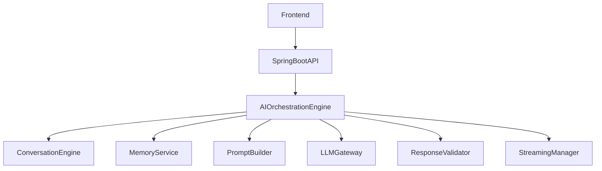
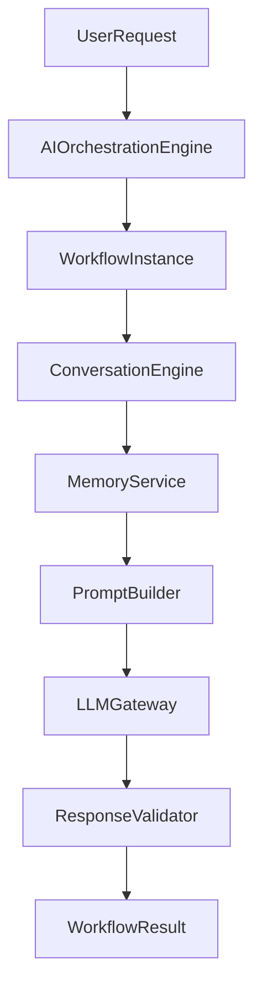
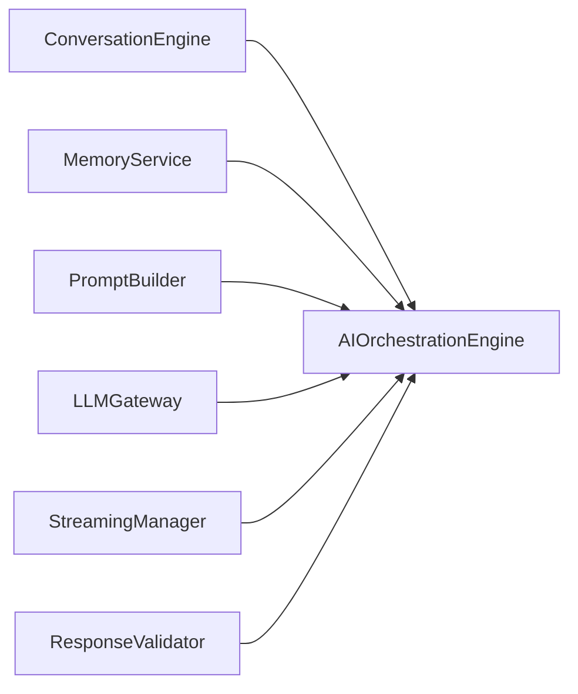
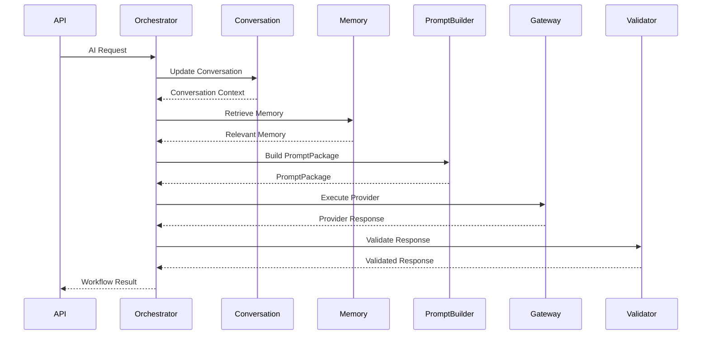
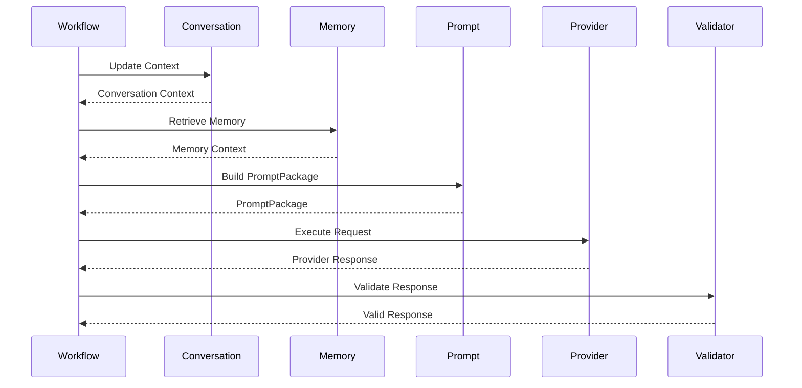

# 12.4 — AI Orchestration Engine (Part I)

> **Document Version:** 2.0.0
> **Status:** Draft — Architecture Review Pending
>
> **Parent Documents**
>
> * `00-PesoPilot-v2.0-Source-of-Truth.md`
> * `01-Rule-Based-Financial-Intelligence-Architecture.md`
> * `02-InsightBundle-and-Data-Contracts.md`
> * `03-Insight-Engine-Architecture.md`
> * `04-Rule-Engine-Architecture.md`
> * `05-Health-Engine-Architecture.md`
> * `06-Income-Engine-Architecture.md`
> * `07-Expense-Engine-Architecture.md`
> * `08-Savings-&-Goal-Engine-Architecture.md`
> * `09-Cashflow-&-Cutoff-Engine-Architecture.md`
> * `10-Recommendation-Engine-Architecture.md`
> * `11-Summary-Engine-Architecture.md`
> * `12.0-AI-Platform-Architecture-Overview.md`
> * `12.1-Prompt-Builder-Architecture.md`
> * `12.2-Conversation-Engine-Architecture.md`
> * `12.3-Ollama-Integration-Architecture.md`
>
> **Phase**
>
> Phase 11B / Phase 12 — AI Financial Intelligence Platform
>
> **Section**
>
> Introduction, Orchestration Philosophy, Responsibilities & Overall AI Orchestration Architecture

---

# 1. Purpose

The AI Orchestration Engine coordinates every AI workflow executed within PesoPilot.

It is the central execution coordinator of the AI Platform.

The AI Orchestration Engine does not perform financial analysis, construct prompts, manage conversations, or communicate directly with language model providers.

Instead, it coordinates specialized AI subsystems in a deterministic execution workflow.

---

# 2. Position Within the AI Platform

The AI Orchestration Engine sits at the center of the AI Platform.



Every AI request passes through the AI Orchestration Engine.

---

# 3. Orchestration Philosophy

The AI Orchestration Engine follows one fundamental principle.

> **Coordinate services. Never replace them.**

Every subsystem owns one responsibility.

The Orchestration Engine determines:

* when a subsystem executes,
* execution order,
* workflow state,
* coordination between services.

It never duplicates subsystem behavior.

---

# 4. Workflow-Oriented Architecture

The AI Platform models every AI request as a workflow.

```text
AI Request

↓

Workflow Instance

↓

Coordinated Execution

↓

AI Response
```

The workflow becomes the unit of execution rather than individual service calls.

---

# 5. Guiding Principles

The AI Orchestration Engine follows ten architectural principles.

---

## 5.1 Single Coordination Layer

Only the AI Orchestration Engine coordinates AI workflows.

Controllers and other services never orchestrate multiple AI components directly.

---

## 5.2 Service Independence

Each AI subsystem remains independently deployable, testable, and maintainable.

The Orchestration Engine coordinates services without modifying their internal behavior.

---

## 5.3 Deterministic Execution

Given identical workflow inputs and system state, the execution sequence must remain identical.

---

## 5.4 Explicit Workflow State

Every workflow exposes an explicit execution state.

Hidden workflow transitions are prohibited.

---

## 5.5 Provider Independence

The Orchestration Engine never communicates directly with Ollama or any provider implementation.

All provider communication occurs through the Provider Integration Layer.

---

## 5.6 Failure Isolation

Failures within one subsystem must not corrupt workflow execution.

Each subsystem reports standardized results and exceptions.

---

## 5.7 Workflow Observability

Every workflow exposes diagnostics, execution timing, and state transitions.

This enables monitoring, troubleshooting, and auditing.

---

## 5.8 Cancellation Support

Workflow execution supports graceful cancellation.

Cancellation propagates through participating services without leaving inconsistent workflow state.

---

## 5.9 Extensibility

Additional workflow stages may be introduced without redesigning the orchestration architecture.

---

## 5.10 Business Logic Isolation

The AI Orchestration Engine contains no financial intelligence rules.

Business logic remains inside dedicated domain engines.

---

# 6. Responsibilities

The AI Orchestration Engine owns:

* workflow coordination,
* execution sequencing,
* workflow lifecycle,
* service coordination,
* execution state,
* cancellation,
* timeout coordination,
* retry coordination,
* execution telemetry.

The AI Orchestration Engine does **not** own:

* financial calculations,
* conversation management,
* memory persistence,
* prompt construction,
* provider communication,
* recommendation generation,
* summary generation.

---

# 7. Inputs

The AI Orchestration Engine receives:

```text
User Request

Conversation Context

Runtime Configuration

Execution Options

Workflow Metadata
```

These inputs initialize a new workflow instance.

---

# 8. Outputs

The AI Orchestration Engine produces:

```text
Workflow Result

├── AI Response
├── Conversation Updates
├── Workflow Diagnostics
├── Execution Metrics
├── Provider Metadata
└── Version
```

The workflow result is returned to the API layer.

---

# 9. High-Level Workflow



Each subsystem performs one deterministic responsibility.

---

# 10. Internal Components

```text
AI Orchestration Engine

├── Workflow Manager

├── Workflow Scheduler

├── Service Coordinator

├── Execution State Manager

├── Timeout Manager

├── Retry Manager

├── Cancellation Manager

├── Response Coordinator

├── Diagnostics Manager

└── Workflow Validator
```

Each internal component performs one well-defined orchestration task.

---

# 11. Relationship with Other AI Components



The AI Orchestration Engine coordinates all participating AI services while preserving their independence.

---

# 12. AI Workflow Instance

Every AI request creates a dedicated workflow instance.

```text
AI Workflow Instance

├── Workflow ID
├── Current State
├── Active Stage
├── Participating Services
├── Execution Context
├── Timing
├── Diagnostics
└── Version
```

Workflow instances exist only for the duration of execution.

---

# 13. Overall AI Orchestration Architecture



The AI Orchestration Engine owns execution sequencing while each participating subsystem remains responsible for its own domain.

---

# 14. Future Evolution

The orchestration architecture is designed for future expansion.

Potential enhancements include:

* parallel workflow execution,
* multi-agent orchestration,
* workflow branching,
* tool execution,
* human approval stages,
* scheduled AI workflows,
* event-driven orchestration,
* distributed execution,
* workflow persistence,
* workflow replay.

These enhancements extend orchestration without changing subsystem responsibilities.

---

# 15. Architecture Decision Records

## ADR-286

### Why Introduce an AI Orchestration Engine?

**Decision**

AI workflow coordination is centralized into a dedicated orchestration layer.

**Reason**

Prevents controllers and application services from becoming tightly coupled to multiple AI subsystems.

---

## ADR-287

### Why Model AI Requests as Workflow Instances?

**Decision**

Every AI request creates an independent workflow instance.

**Reason**

Supports execution tracking, cancellation, retries, diagnostics, and future long-running workflows.

---

## ADR-288

### Why Keep Business Logic Outside the Orchestrator?

**Decision**

The Orchestration Engine coordinates services but never performs domain-specific calculations.

**Reason**

Preserves single responsibility and prevents orchestration code from becoming a business logic layer.

---

## ADR-289

### Why Require Deterministic Workflow Execution?

**Decision**

Workflow sequencing is deterministic for identical inputs.

**Reason**

Improves testing, reproducibility, debugging, and operational reliability.

---

## ADR-290

### Why Centralize AI Workflow Coordination?

**Decision**

All AI execution passes through a single orchestration component.

**Reason**

Provides a consistent execution model while simplifying future enhancements such as streaming, tool execution, multi-agent coordination, and advanced workflow management.

---

# 16. Acceptance Criteria

This section is complete when:

* Orchestration philosophy is documented.
* Workflow-oriented architecture is established.
* Responsibilities are clearly defined.
* Internal orchestration components are documented.
* AI Workflow Instance is standardized.
* High-level orchestration architecture is defined.
* Future extensibility is documented.
* Architecture decisions are recorded.

---

# Part I Summary

Part I establishes the AI Orchestration Engine as the workflow coordination layer of the PesoPilot AI Platform. By modeling every AI interaction as a deterministic workflow instance and centralizing execution sequencing while preserving the independence of the Conversation Engine, Memory Service, Prompt Builder, Provider Layer, and Response Validator, the architecture creates a scalable, observable, and extensible foundation for AI execution. The Orchestration Engine becomes the single coordination point for all AI workflows without absorbing business logic or provider-specific responsibilities.

---

**End of Part I**

**Next Section:** **Part II — AI Workflow Model, Workflow Context, Execution State, Workflow Lifecycle & Execution Contracts**

# 12.4 — AI Orchestration Engine (Part II)

> **Document Version:** 2.0.0
> **Status:** Draft — Architecture Review Pending
>
> **Parent Documents**
>
> * `00-PesoPilot-v2.0-Source-of-Truth.md`
> * `01-Rule-Based-Financial-Intelligence-Architecture.md`
> * `02-InsightBundle-and-Data-Contracts.md`
> * `03-Insight-Engine-Architecture.md`
> * `04-Rule-Engine-Architecture.md`
> * `05-Health-Engine-Architecture.md`
> * `06-Income-Engine-Architecture.md`
> * `07-Expense-Engine-Architecture.md`
> * `08-Savings-&-Goal-Engine-Architecture.md`
> * `09-Cashflow-&-Cutoff-Engine-Architecture.md`
> * `10-Recommendation-Engine-Architecture.md`
> * `11-Summary-Engine-Architecture.md`
> * `12.0-AI-Platform-Architecture-Overview.md`
> * `12.1-Prompt-Builder-Architecture.md`
> * `12.2-Conversation-Engine-Architecture.md`
> * `12.3-Ollama-Integration-Architecture.md`
>
> **Phase**
>
> Phase 11B / Phase 12 — AI Financial Intelligence Platform
>
> **Section**
>
> AI Workflow Model, Workflow Context, Execution State, Workflow Lifecycle & Execution Contracts

---

# 17. Purpose

Part I established the philosophy and responsibilities of the AI Orchestration Engine.

This section defines the orchestration domain model.

Rather than representing AI execution as individual service calls, PesoPilot models every AI request as a structured workflow with its own context, lifecycle, execution state, and contracts.

---

# 18. Workflow Domain Philosophy

The AI Orchestration Engine models five primary concepts.

```text
AI Workflow

↓

Workflow Context

↓

Execution State

↓

Workflow Lifecycle

↓

Execution Contracts
```

Together these concepts define the execution model of the AI Platform.

---

# 19. AI Workflow Model

The AI Workflow is the root aggregate of orchestration.

```text
AI Workflow

├── Workflow ID
├── Workflow Context
├── Current State
├── Active Stage
├── Participating Services
├── Execution Contracts
├── Diagnostics
├── Metadata
└── Version
```

Every AI request creates exactly one workflow instance.

---

# 20. Workflow Philosophy

An AI Workflow exists independently of:

* Conversation state
* Prompt construction
* Provider execution
* Streaming implementation
* Memory persistence

Its responsibility is to coordinate execution.

---

# 21. Workflow Context

Workflow Context represents everything required to execute a workflow.

```text
Workflow Context

├── Conversation Context
├── PromptPackage
├── Runtime Configuration
├── Provider Configuration
├── Execution Options
├── Memory References
├── Diagnostics
└── Version
```

Workflow Context evolves throughout execution.

---

# 22. Workflow Context Philosophy

Workflow Context is not Conversation Context.

Conversation Context answers:

> What is the user discussing?

Workflow Context answers:

> What information is required to execute this workflow?

This distinction separates conversational concerns from execution concerns.

---

# 23. Execution State

Every workflow exposes an explicit execution state.

```text
Execution State

Created

↓

Initializing

↓

Running

↓

Waiting Provider

↓

Processing Response

↓

Completed

↓

Cancelled

↓

Failed
```

Hidden execution states are prohibited.

---

# 24. Workflow State Model

Execution state contains:

```text
Workflow State

├── Current Stage
├── Previous Stage
├── Status
├── Started Time
├── Updated Time
├── Completion Status
├── Failure Reason
└── Version
```

State transitions are deterministic.

---

# 25. Participating Services

Each workflow records participating services.

```text
Conversation Engine

Memory Service

Prompt Builder

LLM Gateway

Response Validator

Streaming Manager
```

Participation is determined dynamically by workflow requirements.

---

# 26. Execution Contracts

Execution Contracts define the interfaces between orchestration stages.

```text
Execution Contract

├── Input DTO
├── Output DTO
├── Validation Rules
├── Failure Rules
├── Retry Rules
└── Version
```

Every stage communicates through explicit contracts.

---

# 27. Workflow Metadata

Workflow metadata includes:

```text
Workflow Metadata

├── Workflow Type
├── Priority
├── Execution Mode
├── Requested Provider
├── Model
├── Request Source
├── Correlation ID
└── Version
```

Metadata supports diagnostics and observability.

---

# 28. Workflow Types

Supported workflow categories include:

```text
Financial Question

Recommendation Request

Summary Generation

Goal Coaching

Conversation Continuation

Clarification

General AI Chat

System Workflow
```

Workflow type influences orchestration behavior.

---

# 29. Workflow Hierarchy

The orchestration hierarchy remains fixed.

```mermaid
flowchart TD

AI Workflow

-->

Workflow Context

Workflow Context

-->

Execution Contracts

Workflow Context

-->

Participating Services

Workflow Context

-->

Execution State
```

This hierarchy remains consistent across implementations.

---

# 30. Workflow Lifecycle

Every workflow follows the same lifecycle.

```mermaid
flowchart LR

Created

-->

Initialized

-->

Executing

-->

Waiting Provider

-->

Processing Response

-->

Completed
```

Alternative paths:

```text
Executing

↓

Cancelled
```

or

```text
Executing

↓

Failed
```

Every transition is explicit.

---

# 31. Workflow Lifecycle Rules

The AI Orchestration Engine follows these rules:

* Every request creates one workflow.
* Every workflow has one active execution state.
* Every workflow has one Workflow Context.
* Execution Contracts are immutable during execution.
* Completed workflows become read-only.
* Failed workflows retain diagnostics.

---

# 32. Workflow Versioning

Each workflow exposes version information.

```text
Workflow Version

Context Version

Contract Version

Execution Version

Engine Version
```

Versioning supports deterministic replay and future compatibility.

---

# 33. Workflow Diagnostics

Diagnostics include:

```text
Workflow ID

Current State

Current Stage

Execution Time

Participating Services

Retry Count

Cancellation Status

Validation Status
```

Diagnostics remain internal to the AI Platform.

---

# 34. Future Workflow Features

Future orchestration capabilities may include:

```text
Nested Workflows

Workflow Composition

Parallel Execution

Workflow Replay

Checkpoint Recovery

Distributed Execution

Multi-Agent Workflows

Scheduled AI Jobs

Workflow Templates

Event-Driven Execution
```

These enhancements extend orchestration without changing the core workflow model.

---

# 35. Architecture Decision Records

## ADR-291

### Why Model AI Requests as Workflows?

**Decision**

Every AI request is represented as an AI Workflow.

**Reason**

Provides a consistent execution model that supports tracking, diagnostics, cancellation, and future orchestration capabilities.

---

## ADR-292

### Why Separate Workflow Context from Conversation Context?

**Decision**

Workflow Context is a distinct execution model.

**Reason**

Separates conversational information from runtime execution concerns, reducing coupling between orchestration and conversation management.

---

## ADR-293

### Why Require Explicit Execution States?

**Decision**

Workflow execution state is modeled explicitly.

**Reason**

Improves debugging, monitoring, cancellation handling, and deterministic execution.

---

## ADR-294

### Why Introduce Execution Contracts?

**Decision**

Every orchestration stage communicates through standardized contracts.

**Reason**

Ensures subsystem independence and stable integration points across the AI Platform.

---

## ADR-295

### Why Keep Workflows Independent from Provider Implementations?

**Decision**

Workflow models remain provider-agnostic.

**Reason**

Allows execution to remain stable regardless of the underlying LLM provider or infrastructure.

---

# 36. Acceptance Criteria

This section is complete when:

* AI Workflow model is defined.
* Workflow Context is standardized.
* Execution State model is documented.
* Workflow Lifecycle is specified.
* Execution Contracts are defined.
* Workflow metadata and diagnostics are documented.
* Versioning is established.
* Future extensibility is described.

---

# Part II Summary

Part II defines the execution domain of the AI Orchestration Engine through the introduction of the AI Workflow, Workflow Context, Execution State, Workflow Lifecycle, and Execution Contracts. By modeling AI requests as structured workflow instances rather than simple service invocations, the architecture provides deterministic execution, clear service boundaries, explicit state management, and standardized coordination across the AI Platform. Separating Workflow Context from Conversation Context ensures that orchestration remains focused on execution while conversational understanding remains the responsibility of the Conversation Engine, resulting in a scalable, observable, and extensible foundation for future AI workflow capabilities.

---

**End of Part II**

**Next Section:** **Part III — Workflow Pipeline, Service Coordination, Execution Flow, Cancellation, Timeout & Retry Management**

# 12.4 — AI Orchestration Engine (Part III)

> **Document Version:** 2.0.0
> **Status:** Draft — Architecture Review Pending
>
> **Parent Documents**
>
> * `00-PesoPilot-v2.0-Source-of-Truth.md`
> * `01-Rule-Based-Financial-Intelligence-Architecture.md`
> * `02-InsightBundle-and-Data-Contracts.md`
> * `03-Insight-Engine-Architecture.md`
> * `04-Rule-Engine-Architecture.md`
> * `05-Health-Engine-Architecture.md`
> * `06-Income-Engine-Architecture.md`
> * `07-Expense-Engine-Architecture.md`
> * `08-Savings-&-Goal-Engine-Architecture.md`
> * `09-Cashflow-&-Cutoff-Engine-Architecture.md`
> * `10-Recommendation-Engine-Architecture.md`
> * `11-Summary-Engine-Architecture.md`
> * `12.0-AI-Platform-Architecture-Overview.md`
> * `12.1-Prompt-Builder-Architecture.md`
> * `12.2-Conversation-Engine-Architecture.md`
> * `12.3-Ollama-Integration-Architecture.md`
>
> **Phase**
>
> Phase 11B / Phase 12 — AI Financial Intelligence Platform
>
> **Section**
>
> Workflow Pipeline, Service Coordination, Execution Flow, Cancellation, Timeout & Retry Management

---

# 37. Purpose

Part II defined the orchestration domain model.

This section defines how AI Workflows execute through deterministic execution stages while coordinating all participating AI subsystems.

Rather than invoking services directly, the AI Orchestration Engine manages execution through a structured workflow pipeline.

---

# 38. Workflow Execution Philosophy

Every AI Workflow is executed through a sequence of independent execution stages.

Each stage owns:

* one responsibility,
* one input contract,
* one output contract,
* one validation boundary,
* one completion condition.

Execution stages are coordinated by the Workflow Manager.

---

# 39. Overall Workflow Pipeline

```mermaid
flowchart TD

Workflow

-->

Workflow Initialization

-->

Conversation Stage

-->

Memory Stage

-->

Prompt Stage

-->

Provider Stage

-->

Response Validation Stage

-->

Conversation Update Stage

-->

Workflow Completion
```

Every workflow follows the same execution model.

---

# 40. Execution Stage Model

```text
Execution Stage

├── Stage ID
├── Stage Name
├── Stage State
├── Input Contract
├── Output Contract
├── Timeout Policy
├── Retry Policy
├── Cancellation Policy
└── Version
```

Stages remain immutable during execution.

---

# 41. Workflow Initialization Stage

Responsibilities:

* create Workflow Instance,
* initialize Workflow Context,
* validate execution request,
* assign Workflow ID,
* initialize diagnostics.

No business services execute before initialization completes.

---

# 42. Conversation Stage

The Conversation Stage coordinates:

* Session resolution,
* Conversation updates,
* Topic tracking,
* Context refresh.

The Orchestration Engine coordinates execution but does not manage conversations directly.

---

# 43. Memory Stage

The Memory Stage coordinates retrieval of relevant information.

Responsibilities:

* retrieve relevant memory,
* retrieve user preferences,
* retrieve historical summaries,
* retrieve long-term references.

Memory retrieval is optional and workflow-dependent.

---

# 44. Prompt Stage

The Prompt Stage invokes the Prompt Builder.

Responsibilities:

* build PromptPackage,
* validate PromptPackage,
* estimate token usage,
* prepare execution metadata.

Prompt construction remains the responsibility of the Prompt Builder.

---

# 45. Provider Stage

The Provider Stage coordinates execution through the Provider Layer.

Responsibilities:

* select provider,
* execute request,
* receive provider response,
* capture provider diagnostics.

Provider execution remains isolated within the Provider Layer.

---

# 46. Response Validation Stage

The Response Validation Stage verifies:

* response completeness,
* execution success,
* response schema,
* provider metadata,
* finish reason.

Invalid responses do not proceed to downstream stages.

---

# 47. Conversation Update Stage

After successful validation, the workflow coordinates:

* conversation updates,
* clarification resolution,
* topic updates,
* conversation metadata updates.

Conversation ownership remains with the Conversation Engine.

---

# 48. Workflow Completion Stage

The final stage:

* finalizes diagnostics,
* records execution metrics,
* closes the workflow,
* publishes the Workflow Result.

Completed workflows become immutable.

---

# 49. Service Coordination

The AI Orchestration Engine coordinates these services:

```text
Conversation Engine

↓

Memory Service

↓

Prompt Builder

↓

LLM Gateway

↓

Response Validator

↓

Streaming Manager
```

Services never coordinate one another directly.

---

# 50. Workflow Coordination Flow



The Orchestration Engine remains the sole coordinator.

---

# 51. Workflow State Transitions

Example

```text
Created

↓

Initializing

↓

Executing

↓

Waiting Provider

↓

Validating

↓

Updating Conversation

↓

Completed
```

Alternative paths:

```text
Executing

↓

Cancelled
```

or

```text
Executing

↓

Failed
```

Transitions remain deterministic.

---

# 52. Cancellation Management

Cancellation may occur when:

* user cancels,
* timeout occurs,
* provider disconnects,
* workflow termination is requested.

Cancellation propagates gracefully to participating services.

---

# 53. Cancellation Lifecycle

```mermaid
flowchart LR

Running

-->

Cancellation Requested

-->

Notify Services

-->

Cleanup

-->

Cancelled
```

Cleanup occurs before workflow termination.

---

# 54. Timeout Management

Each execution stage defines its own timeout policy.

Examples

```text
Conversation Stage

5 seconds

Memory Stage

2 seconds

Prompt Stage

3 seconds

Provider Stage

60 seconds

Validation Stage

5 seconds
```

Timeout values remain configurable.

---

# 55. Retry Management

Retries are stage-specific.

Retry candidates include:

* Memory retrieval,
* Provider execution,
* transient infrastructure failures.

Retries are prohibited for:

* validation failures,
* malformed requests,
* deterministic business errors.

---

# 56. Retry Lifecycle

```mermaid
flowchart LR

Execution

-->

Failure

-->

Retry Policy

-->

Retry

-->

Success

Failure

-->

Exceeded Retries

-->

Workflow Failed
```

Retry behavior is controlled by stage policy.

---

# 57. Workflow Validation

Before advancing to the next stage:

Validation verifies:

* stage completion,
* output contract,
* execution state,
* diagnostics,
* workflow consistency.

Only valid stages may continue.

---

# 58. Execution Metrics

Every workflow records:

```text
Workflow Duration

Stage Duration

Retries

Timeouts

Cancellation Status

Provider Latency

Validation Time
```

Metrics remain available for diagnostics.

---

# 59. Workflow Diagnostics

Diagnostics include:

```text
Workflow ID

Current Stage

Completed Stages

Execution Status

Failure Cause

Retry Count

Timing

Participating Services
```

Diagnostics remain internal.

---

# 60. Future Workflow Features

Future orchestration enhancements may include:

```text
Conditional Stages

Parallel Stage Execution

Dynamic Workflow Assembly

Tool Invocation

Human Approval Stage

Workflow Branching

Multi-Agent Coordination

Event-Driven Workflow

Checkpoint Recovery

Distributed Orchestration
```

These capabilities extend execution without changing the workflow model.

---

# 61. Architecture Decision Records

## ADR-296

### Why Introduce Execution Stages?

**Decision**

AI Workflows are composed of independent execution stages.

**Reason**

Supports extensibility, composability, and future advanced orchestration patterns.

---

## ADR-297

### Why Centralize Service Coordination?

**Decision**

Only the AI Orchestration Engine coordinates AI subsystems.

**Reason**

Prevents tight coupling between services and simplifies execution flow.

---

## ADR-298

### Why Make Timeout Policies Stage-Specific?

**Decision**

Each execution stage defines its own timeout behavior.

**Reason**

Different stages have different performance characteristics and reliability requirements.

---

## ADR-299

### Why Limit Retry Behavior?

**Decision**

Retries are permitted only for recoverable infrastructure failures.

**Reason**

Avoids repeating deterministic failures while improving resilience against transient errors.

---

## ADR-300

### Why Validate Between Stages?

**Decision**

Every execution stage validates its output before the workflow advances.

**Reason**

Ensures workflow integrity, simplifies debugging, and prevents downstream propagation of invalid state.

---

# 62. Acceptance Criteria

This section is complete when:

* Workflow Pipeline is documented.
* Execution Stage model is defined.
* Service coordination is specified.
* Workflow execution flow is documented.
* Cancellation management is defined.
* Timeout policies are established.
* Retry strategy is documented.
* Validation pipeline is specified.
* Diagnostics and metrics are documented.
* Future extensibility is described.

---

# Part III Summary

Part III defines the operational execution model of the AI Orchestration Engine. By decomposing AI Workflows into deterministic execution stages with explicit contracts, timeout policies, retry behavior, validation boundaries, and cancellation handling, the architecture provides a scalable and resilient orchestration framework. The AI Orchestration Engine coordinates the Conversation Engine, Memory Service, Prompt Builder, Provider Layer, Response Validator, and Streaming Manager while preserving their independence, resulting in a maintainable workflow architecture that can evolve toward advanced capabilities such as tool invocation, parallel execution, and multi-agent orchestration without architectural redesign.

---

**End of Part III**

**Next Section:** **Part IV — Workflow DTOs, Conversation Integration, Prompt Builder Integration, Provider Integration, Streaming Integration & Response Validation**

# 12.4 — AI Orchestration Engine (Part IV)

> **Document Version:** 2.0.0
> **Status:** Draft — Architecture Review Pending
>
> **Parent Documents**
>
> * `00-PesoPilot-v2.0-Source-of-Truth.md`
> * `01-Rule-Based-Financial-Intelligence-Architecture.md`
> * `02-InsightBundle-and-Data-Contracts.md`
> * `03-Insight-Engine-Architecture.md`
> * `04-Rule-Engine-Architecture.md`
> * `05-Health-Engine-Architecture.md`
> * `06-Income-Engine-Architecture.md`
> * `07-Expense-Engine-Architecture.md`
> * `08-Savings-&-Goal-Engine-Architecture.md`
> * `09-Cashflow-&-Cutoff-Engine-Architecture.md`
> * `10-Recommendation-Engine-Architecture.md`
> * `11-Summary-Engine-Architecture.md`
> * `12.0-AI-Platform-Architecture-Overview.md`
> * `12.1-Prompt-Builder-Architecture.md`
> * `12.2-Conversation-Engine-Architecture.md`
> * `12.3-Ollama-Integration-Architecture.md`
>
> **Phase**
>
> Phase 11B / Phase 12 — AI Financial Intelligence Platform
>
> **Section**
>
> Workflow DTOs, Conversation Integration, Prompt Builder Integration, Provider Integration, Streaming Integration & Response Validation

---

# 63. Purpose

The previous sections defined:

* orchestration philosophy,
* AI Workflow model,
* execution stages,
* workflow pipeline,
* execution management.

This section defines how the AI Orchestration Engine integrates with surrounding AI Platform components through standardized contracts and DTOs.

The AI Orchestration Engine becomes the coordination hub of the AI Platform while preserving subsystem independence.

---

# 64. Workflow DTO Philosophy

The AI Orchestration Engine owns the complete execution workflow.

Other components never access internal orchestration state directly.

Instead, integration occurs through standardized Workflow DTOs.

This preserves encapsulation while allowing deterministic coordination.

---

# 65. Workflow DTO

The Workflow DTO represents the complete orchestration state.

```text
Workflow DTO

├── Workflow ID
├── Workflow Context
├── Execution State
├── Current Stage
├── Stage Results
├── Participating Services
├── Diagnostics
├── Metadata
└── Version
```

Workflow DTO remains internal to the orchestration layer.

---

# 66. Workflow Result DTO

The Workflow Result DTO represents the completed execution.

```text
Workflow Result DTO

├── AI Response
├── Conversation Updates
├── Memory Updates
├── Provider Metadata
├── Execution Metrics
├── Diagnostics
└── Version
```

This DTO is published to the API layer.

---

# 67. DTO Separation

```mermaid
flowchart LR

Workflow

-->

Workflow DTO

Workflow DTO

-->

Workflow Result DTO

Workflow Result DTO

-->

API Layer
```

Internal workflow state remains hidden from external consumers.

---

# 68. Conversation Engine Integration

The AI Orchestration Engine coordinates with the Conversation Engine.

```mermaid
flowchart LR

Workflow

-->

Conversation Engine

Conversation Engine

-->

Conversation Context

Conversation Context

-->

Workflow
```

Conversation ownership always remains with the Conversation Engine.

---

# 69. Conversation Synchronization

Conversation synchronization occurs:

* before PromptPackage generation,
* after AI response generation,
* after clarification resolution,
* after workflow completion.

Conversation updates are coordinated but never owned by the Orchestration Engine.

---

# 70. Memory Service Integration

The AI Orchestration Engine requests memory through the Memory Service.

```mermaid
flowchart LR

Workflow

-->

Memory Service

Memory Service

-->

Relevant Memory

Relevant Memory

-->

Workflow
```

Memory retrieval remains provider-independent.

---

# 71. Prompt Builder Integration

The Prompt Builder is responsible for creating PromptPackage objects.

```mermaid
flowchart LR

Workflow Context

-->

Prompt Builder

Prompt Builder

-->

PromptPackage
```

The Orchestration Engine never constructs prompts directly.

---

# 72. Provider Integration

Provider execution is delegated to the Provider Layer.

```mermaid
flowchart LR

PromptPackage

-->

LLM Gateway

LLM Gateway

-->

Provider Adapter

Provider Adapter

-->

Language Model
```

The Orchestration Engine remains provider-agnostic.

---

# 73. Streaming Integration

Streaming execution is coordinated as a workflow stage.

```mermaid
flowchart TD

Workflow

-->

Streaming Manager

Streaming Manager

-->

Provider Stream

Provider Stream

-->

Response Aggregator

Response Aggregator

-->

Workflow Result
```

Streaming is optional and determined by workflow configuration.

---

# 74. Streaming Synchronization

During streaming:

* workflow state remains active,
* partial responses are aggregated,
* diagnostics are updated,
* cancellation remains available.

Workflow completion occurs only after stream termination.

---

# 75. Response Validation Integration

Response validation is executed after provider completion.

Responsibilities include:

* schema validation,
* finish reason verification,
* content completeness,
* provider metadata validation,
* execution diagnostics.

Invalid responses never reach the API layer.

---

# 76. Response Publication

After validation:

```mermaid
flowchart LR

Validated Response

-->

Workflow Result DTO

Workflow Result DTO

-->

API Layer
```

Only validated responses are published.

---

# 77. Workflow Synchronization

Workflow synchronization occurs whenever:

* execution stage completes,
* conversation updates,
* memory retrieval finishes,
* provider returns,
* streaming events arrive,
* validation completes.

Workflow state always reflects the latest execution progress.

---

# 78. Integration Overview

```mermaid
flowchart TD

Workflow

-->

Conversation Engine

Workflow

-->

Memory Service

Workflow

-->

Prompt Builder

Workflow

-->

Provider Layer

Workflow

-->

Streaming Manager

Workflow

-->

Response Validator

Workflow

-->

API Layer
```

The Orchestration Engine coordinates without owning subsystem logic.

---

# 79. Execution Contracts

Every subsystem communicates through contracts.

```text
Conversation Context

↓

PromptPackage

↓

Provider Request

↓

Provider Response

↓

Validated Response

↓

Workflow Result
```

No subsystem accesses another subsystem's internal models.

---

# 80. Workflow Diagnostics

Workflow DTO exposes:

```text
Workflow ID

Current Stage

Execution Status

Stage Timing

Provider Metadata

Retries

Timeouts

Cancellation Status

Validation Status
```

Diagnostics remain internal unless explicitly surfaced.

---

# 81. Future Integrations

Future orchestration integrations may include:

```text
Tool Execution Engine

Agent Coordinator

Knowledge Retrieval

Calendar Integration

Desktop Agent

Notification Engine

Background Workflow Scheduler

Task Automation

External API Connectors

Business Workflow Engine
```

These integrations extend orchestration while preserving subsystem boundaries.

---

# 82. Architecture Decision Records

## ADR-301

### Why Separate Workflow DTO from Workflow Result DTO?

**Decision**

The Orchestration Engine maintains an internal Workflow DTO and publishes a separate Workflow Result DTO.

**Reason**

Protects internal execution state while providing a stable public integration contract.

---

## ADR-302

### Why Keep Subsystems Independent?

**Decision**

Every AI subsystem communicates only through contracts.

**Reason**

Reduces coupling and enables independent evolution of each subsystem.

---

## ADR-303

### Why Coordinate Rather Than Execute?

**Decision**

The AI Orchestration Engine delegates execution to specialized services.

**Reason**

Preserves single responsibility and keeps orchestration focused on workflow management.

---

## ADR-304

### Why Treat Streaming as a Workflow Stage?

**Decision**

Streaming is modeled as another orchestration stage rather than a separate execution model.

**Reason**

Allows streaming and non-streaming workflows to share the same lifecycle and execution semantics.

---

## ADR-305

### Why Validate Before Publishing?

**Decision**

Only validated responses are converted into Workflow Result DTOs.

**Reason**

Prevents invalid or incomplete AI responses from propagating to consumers and preserves workflow integrity.

---

# 83. Acceptance Criteria

This section is complete when:

* Workflow DTO is standardized.
* Workflow Result DTO is defined.
* Conversation integration is documented.
* Memory integration is specified.
* Prompt Builder integration is documented.
* Provider integration is established.
* Streaming integration is defined.
* Response validation integration is documented.
* Execution contracts are standardized.
* Future extensibility is described.

---

# Part IV Summary

Part IV establishes the AI Orchestration Engine as the integration hub of the PesoPilot AI Platform. Through standardized Workflow DTOs, Workflow Result DTOs, deterministic execution contracts, and coordinated integration with the Conversation Engine, Memory Service, Prompt Builder, Provider Layer, Streaming Manager, and Response Validator, the orchestration layer provides a stable and provider-independent execution framework. By separating internal workflow state from externally published workflow results and enforcing contract-based communication between all participating subsystems, the architecture maintains clean boundaries while enabling future capabilities such as tool execution, agent coordination, background workflows, and advanced AI orchestration without compromising maintainability or scalability.

---

**End of Part IV**

**Next Section:** **Part V — Testing Strategy, Future Evolution, Acceptance Criteria & Implementation Roadmap**

# 12.4 — AI Orchestration Engine (Part V)

> **Document Version:** 2.0.0
> **Status:** Draft — Architecture Review Pending
>
> **Parent Documents**
>
> * `00-PesoPilot-v2.0-Source-of-Truth.md`
> * `01-Rule-Based-Financial-Intelligence-Architecture.md`
> * `02-InsightBundle-and-Data-Contracts.md`
> * `03-Insight-Engine-Architecture.md`
> * `04-Rule-Engine-Architecture.md`
> * `05-Health-Engine-Architecture.md`
> * `06-Income-Engine-Architecture.md`
> * `07-Expense-Engine-Architecture.md`
> * `08-Savings-&-Goal-Engine-Architecture.md`
> * `09-Cashflow-&-Cutoff-Engine-Architecture.md`
> * `10-Recommendation-Engine-Architecture.md`
> * `11-Summary-Engine-Architecture.md`
> * `12.0-AI-Platform-Architecture-Overview.md`
> * `12.1-Prompt-Builder-Architecture.md`
> * `12.2-Conversation-Engine-Architecture.md`
> * `12.3-Ollama-Integration-Architecture.md`
>
> **Phase**
>
> Phase 11B / Phase 12 — AI Financial Intelligence Platform
>
> **Section**
>
> Testing Strategy, Future Evolution, Acceptance Criteria & Implementation Roadmap

---

# 84. Purpose

The previous sections defined:

* orchestration philosophy,
* workflow model,
* execution stages,
* workflow pipeline,
* subsystem integration.

This final section defines how the AI Orchestration Engine is implemented, tested, evolved, and governed throughout the PesoPilot AI Platform.

---

# 85. AI Platform Integration Overview

The AI Orchestration Engine is the execution hub of the AI Platform.

```mermaid
flowchart TD

API

-->

AI Orchestration Engine

AI Orchestration Engine

-->

Conversation Engine

AI Orchestration Engine

-->

Memory Service

AI Orchestration Engine

-->

Prompt Builder

AI Orchestration Engine

-->

Provider Layer

AI Orchestration Engine

-->

Streaming Manager

AI Orchestration Engine

-->

Response Validator

AI Orchestration Engine

-->

Workflow Result
```

Every AI request follows this orchestration path.

---

# 86. Workflow Template Architecture

The Orchestration Engine executes predefined workflow templates.

Examples include:

```text
Financial Question

Recommendation

Goal Coaching

Summary Generation

Conversation Continuation

Clarification

General AI Chat
```

Workflow templates define:

* execution stages,
* participating services,
* retry behavior,
* timeout policies,
* validation requirements.

The workflow engine executes templates rather than hardcoded sequences.

---

# 87. Workflow Template Lifecycle

```mermaid
flowchart LR

Workflow Request

-->

Template Selection

-->

Workflow Instance

-->

Execution

-->

Completed
```

Template selection occurs before workflow initialization.

---

# 88. Testing Philosophy

The AI Orchestration Engine is tested independently from every participating subsystem.

Tests focus on:

* workflow coordination,
* execution sequencing,
* workflow state,
* orchestration behavior.

Subsystem business logic is verified in its own architecture.

---

# 89. Unit Tests

Every orchestration component requires isolated tests.

Components

```text
Workflow Manager

Workflow Scheduler

Execution State Manager

Service Coordinator

Timeout Manager

Retry Manager

Cancellation Manager

Diagnostics Manager

Workflow Validator
```

Each component should be independently testable.

---

# 90. Workflow Tests

Verify:

* workflow creation,
* workflow completion,
* workflow failure,
* workflow cancellation,
* workflow replay,
* workflow diagnostics.

Every workflow must follow deterministic execution.

---

# 91. Service Coordination Tests

Verify:

* Conversation Engine invocation,
* Memory Service invocation,
* Prompt Builder invocation,
* Provider Layer invocation,
* Response Validator invocation,
* Streaming Manager invocation.

The execution order must remain deterministic.

---

# 92. Workflow Stage Tests

Every stage verifies:

* input contract,
* output contract,
* timeout policy,
* retry policy,
* validation,
* diagnostics.

Each stage should execute independently.

---

# 93. Timeout & Retry Tests

Verify:

* timeout handling,
* cancellation,
* retry behavior,
* recoverable failures,
* unrecoverable failures.

Retry behavior must remain policy-driven.

---

# 94. Integration Tests

Complete orchestration pipeline

```text
Workflow Request

↓

Conversation Engine

↓

Memory Service

↓

Prompt Builder

↓

Provider Layer

↓

Response Validator

↓

Workflow Result
```

Identical requests must produce identical workflow behavior.

---

# 95. Regression Tests

Regression testing compares:

```text
Expected Workflow

↓

Actual Workflow

↓

Comparison
```

Changes to workflow sequencing require architecture review.

---

# 96. Performance Targets

Target orchestration overhead

```text
Workflow Initialization

< 2 ms

Workflow Coordination

< 5 ms

Workflow Completion

< 2 ms

Total Orchestration Overhead

< 10 ms
```

Provider inference time is measured separately.

---

# 97. Implementation Roadmap

Recommended implementation sequence

```mermaid
flowchart TD

A["Workflow DTO"]

-->

B["Workflow Manager"]

-->

C["Workflow Templates"]

-->

D["Workflow Scheduler"]

-->

E["Execution State Manager"]

-->

F["Service Coordinator"]

-->

G["Timeout Manager"]

-->

H["Retry Manager"]

-->

I["Cancellation Manager"]

-->

J["Workflow Validator"]

-->

K["Diagnostics"]

-->

L["Subsystem Integration"]
```

Each milestone concludes with:

* unit tests,
* integration tests,
* documentation review,
* lint,
* build,
* manual verification.

---

# 98. Implementation Checklist

The AI Orchestration Engine is complete when:

```text
☑ Workflow DTO

☑ Workflow Result DTO

☑ Workflow Templates

☑ Workflow Manager

☑ Workflow Scheduler

☑ Service Coordinator

☑ Execution State Manager

☑ Timeout Manager

☑ Retry Manager

☑ Cancellation Manager

☑ Workflow Validator

☑ Diagnostics

☑ Conversation Integration

☑ Memory Integration

☑ Prompt Builder Integration

☑ Provider Integration

☑ Streaming Integration

☑ Unit Tests

☑ Integration Tests

☑ Documentation
```

---

# 99. Future Evolution

Future orchestration capabilities may include:

```text
Dynamic Workflow Assembly

Workflow Branching

Parallel Execution

Multi-Agent Coordination

Tool Invocation

Background AI Jobs

Scheduled Workflows

Human Approval Stages

Workflow Analytics

Distributed Execution

Workflow Persistence

Workflow Versioning
```

These capabilities extend orchestration without changing existing workflow contracts.

---

# 100. Architecture Decision Records

## ADR-306

### Why Introduce Workflow Templates?

**Decision**

The AI Orchestration Engine executes predefined workflow templates rather than hardcoded execution paths.

**Reason**

Separates workflow definition from workflow execution, enabling future configurability and extensibility.

---

## ADR-307

### Why Test the Orchestration Engine Independently?

**Decision**

Workflow coordination is tested independently of participating subsystems.

**Reason**

Ensures orchestration behavior remains deterministic regardless of subsystem implementation details.

---

## ADR-308

### Why Keep Workflow Sequencing Deterministic?

**Decision**

Workflow execution order is fixed for a given workflow template.

**Reason**

Improves reproducibility, debugging, observability, and operational reliability.

---

## ADR-309

### Why Centralize Timeout and Retry Management?

**Decision**

The AI Orchestration Engine owns execution policies while individual services execute business logic.

**Reason**

Provides consistent operational behavior across all workflow stages.

---

## ADR-310

### Why Design for Future Workflow Evolution?

**Decision**

Workflow templates expose extension points for branching, parallelism, tool execution, and multi-agent coordination.

**Reason**

Allows the orchestration layer to evolve without redesigning workflow contracts or subsystem integrations.

---

# 101. Final Acceptance Criteria

Document 12.4 is complete when:

* AI Orchestration Engine architecture is fully documented.
* AI Workflow model is finalized.
* Workflow pipeline is established.
* Execution stage architecture is documented.
* Workflow DTOs are standardized.
* Integration with Conversation Engine, Memory Service, Prompt Builder, Provider Layer, Streaming Manager, and Response Validator is specified.
* Testing strategy is complete.
* Workflow templates are documented.
* Implementation roadmap is finalized.
* Future extensibility is documented.

---

# 102. Document Summary

Document 12.4 defines the complete architecture of the AI Orchestration Engine, establishing it as the workflow coordination layer of the PesoPilot AI Platform. Through structured AI Workflows, execution stages, workflow templates, deterministic service coordination, standardized DTOs, and centralized execution policies, the Orchestration Engine coordinates every AI interaction while preserving the independence of all participating subsystems. By separating orchestration from business logic and introducing extensible workflow definitions, the architecture provides a scalable foundation for future capabilities such as tool invocation, workflow branching, parallel execution, long-running processes, and multi-agent collaboration.

---

# AI Platform Architecture Progress

```text
████████████████

✓ 12.0 — AI Platform Architecture Overview

✓ 12.1 — Prompt Builder Architecture

✓ 12.2 — Conversation Engine Architecture

✓ 12.3 — Ollama Integration Architecture

✓ 12.4 — AI Orchestration Engine

□□□□□□□□□□□□□□□□

12.5 — Conversation Memory Architecture

12.6 — AI Safety & Guardrails

12.7 — Spring Boot AI REST API

12.8 — Streaming & Real-Time Response Architecture

12.9 — AI Testing Strategy

12.10 — Future Multi-LLM Architecture
```

---

# End of Document

**Document Status:** ✅ **Completed**

**Next Document:** **12.5 — Conversation Memory Architecture**

---

## Milestone Achieved

With **Document 12.4** complete, the AI Platform now has a fully specified **workflow coordination layer**. Documents **12.0–12.4** collectively define the execution backbone of PesoPilot: the platform architecture establishes system boundaries, the Prompt Builder performs deterministic context engineering, the Conversation Engine manages conversational state, the Provider Layer encapsulates language model communication, and the AI Orchestration Engine coordinates all participating subsystems through structured workflows. This layered architecture enables deterministic execution today while providing clear extension points for advanced AI capabilities—including workflow branching, tool invocation, parallel execution, long-running processes, and multi-agent collaboration—without compromising clean architecture or subsystem independence.
