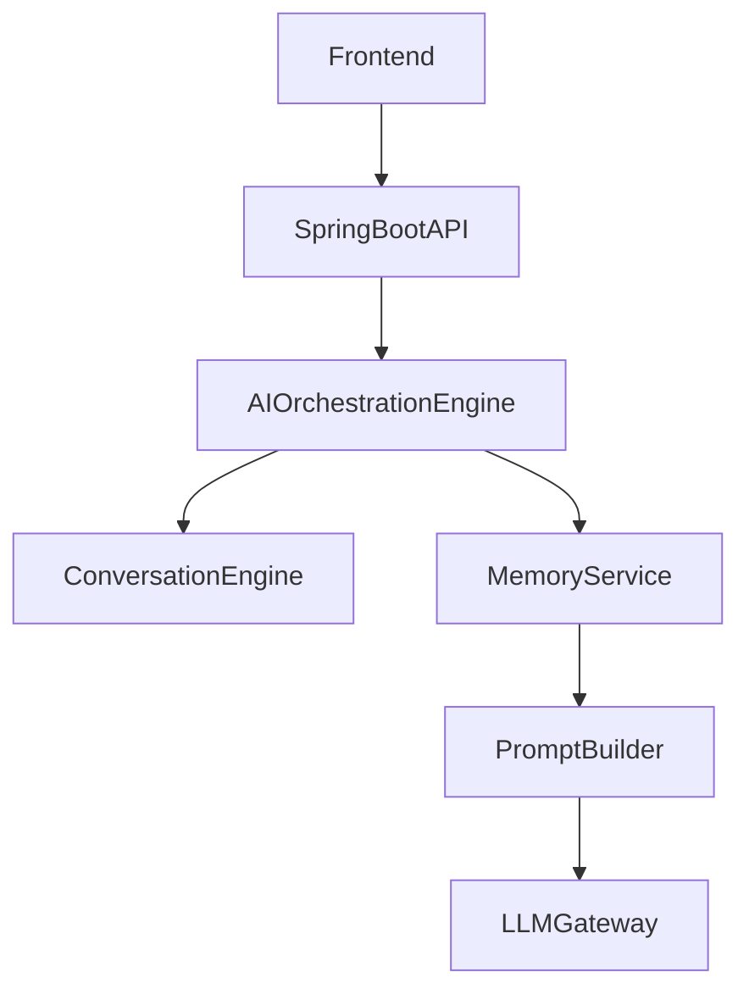
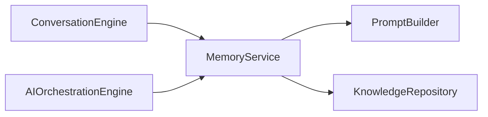
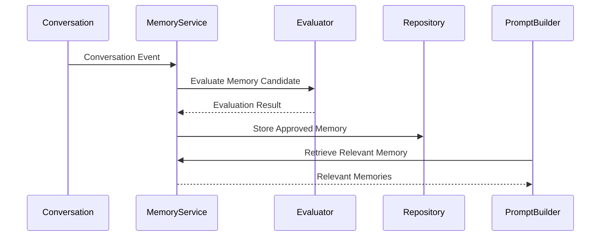
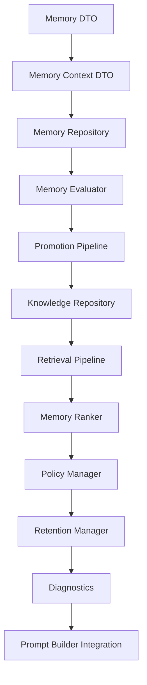

# 12.5 — Conversation Memory Architecture (Part I)

> **Document Version:** 2.0.0
> **Status:** Draft — Architecture Review Pending
>
> **Parent Documents**
>
> * `00-PesoPilot-v2.0-Source-of-Truth.md`
> * `01-Rule-Based-Financial-Intelligence-Architecture.md`
> * `02-InsightBundle-and-Data-Contracts.md`
> * `03-Insight-Engine-Architecture.md`
> * `04-Rule-Engine-Architecture.md`
> * `05-Health-Engine-Architecture.md`
> * `06-Income-Engine-Architecture.md`
> * `07-Expense-Engine-Architecture.md`
> * `08-Savings-&-Goal-Engine-Architecture.md`
> * `09-Cashflow-&-Cutoff-Engine-Architecture.md`
> * `10-Recommendation-Engine-Architecture.md`
> * `11-Summary-Engine-Architecture.md`
> * `12.0-AI-Platform-Architecture-Overview.md`
> * `12.1-Prompt-Builder-Architecture.md`
> * `12.2-Conversation-Engine-Architecture.md`
> * `12.3-Ollama-Integration-Architecture.md`
> * `12.4-AI-Orchestration-Engine.md`
>
> **Phase**
>
> Phase 11B / Phase 12 — AI Financial Intelligence Platform
>
> **Section**
>
> Introduction, Memory Philosophy, Responsibilities & Overall Conversation Memory Architecture

---

# 1. Purpose

The Conversation Memory Architecture defines how PesoPilot retains, evaluates, retrieves, and manages durable conversational knowledge across AI interactions.

Its purpose is not to store complete conversations.

Its purpose is to preserve meaningful knowledge that improves future AI interactions while maintaining privacy, determinism, explainability, and clean architectural boundaries.

The Memory Service is therefore a knowledge management subsystem rather than a conversation storage subsystem.

---

# 2. Position Within the AI Platform

The Memory Service sits alongside the Conversation Engine and is coordinated by the AI Orchestration Engine.



Conversation and Memory are independent subsystems.

---

# 3. Memory Philosophy

The Conversation Memory Architecture follows one fundamental principle.

> **Memory is curated knowledge, not conversation history.**

Conversation history belongs to the Conversation Engine.

Durable knowledge belongs to the Memory Service.

Only meaningful information is promoted into memory.

---

# 4. Knowledge Philosophy

The Memory Service distinguishes between remembering and learning.

Remembering stores information.

Learning transforms validated memories into structured knowledge that can influence future AI behavior.

This distinction prevents accidental long-term storage of transient conversations.

---

# 5. Guiding Principles

The Memory Service follows ten architectural principles.

---

## 5.1 Separation of Responsibilities

Conversation management and memory management are independent responsibilities.

The Conversation Engine owns active dialogue.

The Memory Service owns durable knowledge.

---

## 5.2 Selective Retention

Not every conversation becomes memory.

Only information that passes memory evaluation may be retained.

---

## 5.3 Deterministic Retrieval

Given identical retrieval criteria and stored knowledge, the Memory Service returns identical results.

Retrieval behavior must remain deterministic.

---

## 5.4 Context Relevance

Only memories relevant to the current workflow are retrieved.

Irrelevant memories never enter PromptPackages.

---

## 5.5 Knowledge Promotion

Memory is promoted into long-term knowledge only after validation.

Knowledge influences future workflows.

Raw memory does not.

---

## 5.6 Explainability

Every retrieved memory must be traceable to its origin and promotion reason.

Memory retrieval should remain auditable.

---

## 5.7 Provider Independence

The Memory Service never depends on language model providers.

Memory remains deterministic business logic.

---

## 5.8 Privacy First

Sensitive conversational data should not automatically become durable memory.

Retention policies govern what may be preserved.

---

## 5.9 Extensibility

The architecture supports future retrieval mechanisms including semantic search, embeddings, vector databases, and hybrid retrieval without changing public contracts.

---

## 5.10 Knowledge Quality

The quality of remembered information is more important than the quantity stored.

Knowledge must remain accurate, relevant, and maintainable.

---

# 6. Responsibilities

The Memory Service owns:

* memory evaluation,
* memory storage,
* knowledge promotion,
* memory retrieval,
* memory ranking,
* memory expiration,
* memory validation,
* knowledge management.

The Memory Service does **not** own:

* conversation management,
* prompt construction,
* provider communication,
* financial calculations,
* AI orchestration.

---

# 7. Inputs

The Memory Service receives:

```text
Conversation Events

Conversation Context

Workflow Context

Memory Evaluation Requests

Retrieval Requests

Retention Policies
```

These inputs determine whether memories are retrieved, promoted, or discarded.

---

# 8. Outputs

The Memory Service produces:

```text
Relevant Memories

Knowledge References

Memory Diagnostics

Retrieval Metadata

Promotion Results

Memory Version
```

These outputs are consumed by the AI Orchestration Engine and Prompt Builder.

---

# 9. Overall Memory Architecture

```mermaid
flowchart TD

Conversation

-->

Memory Evaluation

Memory Evaluation

-->

Memory Repository

Memory Repository

-->

Knowledge Repository

Knowledge Repository

-->

Memory Retrieval

Memory Retrieval

-->

Prompt Builder
```

Memory progresses through evaluation before becoming durable knowledge.

---

# 10. Internal Components

```text
Conversation Memory Architecture

├── Memory Evaluator

├── Memory Repository

├── Knowledge Repository

├── Memory Retriever

├── Memory Ranker

├── Memory Validator

├── Retention Manager

├── Memory Diagnostics

└── Knowledge Manager
```

Each component performs one architectural responsibility.

---

# 11. Relationship with Other AI Components



The Memory Service integrates with other AI components through stable contracts while preserving ownership boundaries.

---

# 12. Overall Conversation Memory Architecture



The Memory Service is responsible for evaluating, storing, and retrieving knowledge, not managing conversations.

---

# 13. Future Evolution

The Conversation Memory Architecture is designed for future enhancements including:

* semantic retrieval,
* vector embeddings,
* hybrid search,
* memory decay,
* confidence scoring,
* personalized coaching profiles,
* adaptive knowledge ranking,
* cross-device synchronization,
* knowledge graph integration,
* enterprise memory governance.

These capabilities extend the Memory Service without changing its core responsibilities.

---

# 14. Architecture Decision Records

## ADR-311

### Why Separate Conversation from Memory?

**Decision**

Conversation state and durable memory are managed by different subsystems.

**Reason**

Preserves clean architecture and prevents conversational state from becoming persistent knowledge automatically.

---

## ADR-312

### Why Treat Memory as Curated Knowledge?

**Decision**

The Memory Service stores curated knowledge rather than complete chat history.

**Reason**

Improves retrieval quality, reduces unnecessary context, and avoids uncontrolled memory growth.

---

## ADR-313

### Why Introduce Knowledge Promotion?

**Decision**

Only validated memories may become durable knowledge.

**Reason**

Ensures that long-term memory influences future AI behavior only after evaluation and validation.

---

## ADR-314

### Why Keep Memory Provider-Independent?

**Decision**

Memory management is implemented as deterministic application logic.

**Reason**

Allows memory behavior to remain stable regardless of the underlying language model provider.

---

## ADR-315

### Why Prioritize Knowledge Quality Over Quantity?

**Decision**

The Memory Service emphasizes selective retention and high-quality retrieval.

**Reason**

Maintains efficient prompts, improves personalization, and reduces long-term maintenance costs.

---

# 15. Acceptance Criteria

This section is complete when:

* Memory philosophy is documented.
* Knowledge philosophy is defined.
* Responsibilities are clearly established.
* Overall Conversation Memory Architecture is documented.
* Internal components are specified.
* Relationships with surrounding AI subsystems are defined.
* Future extensibility is documented.
* Architecture decisions are recorded.

---

# Part I Summary

Part I establishes the Conversation Memory Architecture as the long-term knowledge management subsystem of the PesoPilot AI Platform. By separating conversation management from durable memory, introducing knowledge promotion, emphasizing selective retention, and maintaining provider-independent deterministic behavior, the architecture creates a scalable foundation for personalized financial coaching. Rather than treating memory as accumulated chat history, the Memory Service curates validated knowledge that can safely influence future AI interactions while preserving explainability, privacy, and clean architectural boundaries.

---

**End of Part I**

**Next Section:** **Part II — Memory Model, Working Memory, Session Memory, Long-Term Memory, Memory Types & Memory Lifecycle**

# 12.5 — Conversation Memory Architecture (Part II)

> **Document Version:** 2.0.0
> **Status:** Draft — Architecture Review Pending
>
> **Parent Documents**
>
> * `00-PesoPilot-v2.0-Source-of-Truth.md`
> * `01-Rule-Based-Financial-Intelligence-Architecture.md`
> * `02-InsightBundle-and-Data-Contracts.md`
> * `03-Insight-Engine-Architecture.md`
> * `04-Rule-Engine-Architecture.md`
> * `05-Health-Engine-Architecture.md`
> * `06-Income-Engine-Architecture.md`
> * `07-Expense-Engine-Architecture.md`
> * `08-Savings-&-Goal-Engine-Architecture.md`
> * `09-Cashflow-&-Cutoff-Engine-Architecture.md`
> * `10-Recommendation-Engine-Architecture.md`
> * `11-Summary-Engine-Architecture.md`
> * `12.0-AI-Platform-Architecture-Overview.md`
> * `12.1-Prompt-Builder-Architecture.md`
> * `12.2-Conversation-Engine-Architecture.md`
> * `12.3-Ollama-Integration-Architecture.md`
> * `12.4-AI-Orchestration-Engine.md`
>
> **Phase**
>
> Phase 11B / Phase 12 — AI Financial Intelligence Platform
>
> **Section**
>
> Memory Model, Working Memory, Session Memory, Long-Term Memory, Memory Types & Memory Lifecycle

---

# 16. Purpose

Part I established the philosophy and responsibilities of the Conversation Memory Architecture.

This section defines the domain model of the Memory Service.

Rather than representing memory as simple stored conversation history, PesoPilot models memory as structured knowledge that evolves through multiple stages before influencing future AI workflows.

---

# 17. Memory Domain Philosophy

The Memory Service models six primary concepts.

```text
Working Memory

↓

Session Memory

↓

Memory Record

↓

Memory Collection

↓

Knowledge Profile

↓

Knowledge Retrieval
```

Together these concepts define how conversational information evolves into durable knowledge.

---

# 18. Memory Model

The Memory Model is the root aggregate of the Memory Service.

```text
Memory

├── Working Memory
├── Session Memory
├── Memory Records
├── Memory Collections
├── Knowledge Profile
├── Retrieval Metadata
├── Diagnostics
├── Version
└── Metadata
```

The Memory Model represents the complete state of remembered knowledge.

---

# 19. Working Memory

Working Memory exists only during workflow execution.

```text
Working Memory

├── Workflow Context
├── Conversation Context
├── PromptPackage
├── Active AI Response
├── Runtime Metadata
└── Version
```

Working Memory is transient.

It is destroyed after workflow completion.

---

# 20. Working Memory Philosophy

Working Memory is execution-oriented.

Its purpose is to support the current AI Workflow.

Working Memory never becomes durable storage.

---

# 21. Session Memory

Session Memory persists for the lifetime of a conversation.

```text
Session Memory

├── Conversation ID
├── Messages
├── Topics
├── Clarifications
├── Referenced Financial Artifacts
├── Session Metadata
└── Version
```

Session Memory is owned by the Conversation Engine.

The Memory Service references it but does not own it.

---

# 22. Long-Term Memory

Long-Term Memory stores durable knowledge.

```text
Long-Term Memory

├── Memory Records
├── Memory Collections
├── Knowledge Profiles
├── Historical Summaries
├── Learned Preferences
├── Coaching Preferences
├── User Goals
└── Version
```

Long-Term Memory survives across conversations.

---

# 23. Memory Record

Memory Record is the smallest persistent memory unit.

```text
Memory Record

├── Memory ID
├── Memory Type
├── Content
├── Confidence
├── Source
├── Created Date
├── Last Used
├── Status
└── Version
```

Each Memory Record represents one validated piece of remembered information.

---

# 24. Memory Collection

Related Memory Records are grouped into collections.

```text
Memory Collection

├── Collection ID
├── Category
├── Memory Records
├── Importance
├── Confidence
├── Metadata
└── Version
```

Collections improve retrieval and organization.

---

# 25. Knowledge Profile

Knowledge Profiles represent synthesized understanding.

```text
Knowledge Profile

├── User Preferences
├── Financial Goals
├── Coaching Style
├── Spending Habits
├── Risk Preferences
├── Communication Style
├── Summary
└── Version
```

Knowledge Profiles are generated from validated Memory Collections.

---

# 26. Memory Types

The Memory Service supports multiple memory categories.

```text
Preference Memory

Goal Memory

Financial Memory

Behavior Memory

Conversation Memory

Coaching Memory

System Memory

Administrative Memory
```

Each type follows its own retention policy.

---

# 27. Memory Hierarchy

```mermaid
flowchart TD

Conversation

-->

Working Memory

Working Memory

-->

Session Memory

Session Memory

-->

Memory Record

Memory Record

-->

Memory Collection

Memory Collection

-->

Knowledge Profile
```

Knowledge becomes progressively more structured.

---

# 28. Memory Lifecycle

Every memory follows the same lifecycle.


Each transition is explicit and deterministic.

---

# 29. Memory Lifecycle Rules

The Memory Service follows these rules:

* Every Memory Record begins as a candidate.
* Only validated records become durable.
* Collections are built from validated records.
* Knowledge Profiles are synthesized from collections.
* Archived memories remain auditable.
* Expired memories are excluded from retrieval.

---

# 30. Memory Confidence

Each Memory Record includes a confidence score.

Confidence represents the system's certainty that the memory accurately reflects durable user knowledge.

Confidence may increase through repeated confirmation or decrease as memories become stale.

Confidence never replaces validation.

---

# 31. Memory Importance

Every Memory Record receives an importance level.

Examples include:

```text
Critical

High

Medium

Low

Temporary
```

Importance influences retrieval ranking but does not override relevance.

---

# 32. Knowledge Evolution

Knowledge evolves over time.

```text
Conversation

↓

Memory Candidate

↓

Validated Memory

↓

Memory Collection

↓

Knowledge Profile

↓

Prompt Builder
```

Only Knowledge Profiles directly influence future AI behavior.

---

# 33. Versioning

Every memory object exposes version information.

```text
Memory Version

Collection Version

Knowledge Version

Schema Version

Engine Version
```

Versioning supports migration and replay.

---

# 34. Diagnostics

Memory diagnostics include:

```text
Memory ID

Collection ID

Knowledge Profile

Confidence

Importance

Lifecycle State

Last Retrieval

Source
```

Diagnostics remain internal.

---

# 35. Future Memory Features

Future enhancements may include:

```text
Semantic Embeddings

Vector Search

Memory Decay

Automatic Consolidation

Knowledge Graphs

Cross-Device Memory

Temporal Memory

Adaptive Confidence

Relationship Mapping

Memory Compression
```

These capabilities extend the Memory Service without changing its core model.

---

# 36. Architecture Decision Records

## ADR-316

### Why Separate Working, Session, and Long-Term Memory?

**Decision**

Memory is modeled as three distinct layers.

**Reason**

Separates execution state, conversational state, and durable knowledge, reducing coupling and improving lifecycle management.

---

## ADR-317

### Why Introduce Memory Records?

**Decision**

Memory Records are the smallest persistent memory unit.

**Reason**

Provides fine-grained storage, validation, retrieval, and auditing.

---

## ADR-318

### Why Group Records into Memory Collections?

**Decision**

Related memories are organized into collections.

**Reason**

Improves retrieval efficiency, maintainability, and synthesis into higher-level knowledge.

---

## ADR-319

### Why Introduce Knowledge Profiles?

**Decision**

Knowledge Profiles synthesize validated collections into durable user understanding.

**Reason**

Allows AI components to reason from structured knowledge rather than isolated facts.

---

## ADR-320

### Why Track Confidence and Importance Separately?

**Decision**

Confidence measures reliability while importance measures business value.

**Reason**

A highly reliable memory may not be highly relevant, and an important memory may require additional validation before influencing future workflows.

---

# 37. Acceptance Criteria

This section is complete when:

* Memory Model is defined.
* Working Memory is documented.
* Session Memory is documented.
* Long-Term Memory is defined.
* Memory Record is standardized.
* Memory Collection is documented.
* Knowledge Profile is established.
* Memory lifecycle is specified.
* Confidence and importance models are documented.
* Future extensibility is described.

---

# Part II Summary

Part II defines the domain model of the Conversation Memory Architecture by introducing Working Memory, Session Memory, Long-Term Memory, Memory Records, Memory Collections, and Knowledge Profiles. Through explicit lifecycle stages, layered memory responsibilities, confidence and importance metadata, and structured knowledge evolution, the Memory Service provides a scalable foundation for transforming transient conversational information into durable, validated knowledge. This layered model enables personalized financial coaching, efficient retrieval, and future semantic capabilities while preserving clear separation between workflow execution, conversation management, and long-term user understanding.

---

**End of Part II**

**Next Section:** **Part III — Memory Pipeline, Memory Promotion, Memory Retrieval, Memory Ranking & Memory Validation**

# 12.5 — Conversation Memory Architecture (Part III)

> **Document Version:** 2.0.0
> **Status:** Draft — Architecture Review Pending
>
> **Parent Documents**
>
> * `00-PesoPilot-v2.0-Source-of-Truth.md`
> * `01-Rule-Based-Financial-Intelligence-Architecture.md`
> * `02-InsightBundle-and-Data-Contracts.md`
> * `03-Insight-Engine-Architecture.md`
> * `04-Rule-Engine-Architecture.md`
> * `05-Health-Engine-Architecture.md`
> * `06-Income-Engine-Architecture.md`
> * `07-Expense-Engine-Architecture.md`
> * `08-Savings-&-Goal-Engine-Architecture.md`
> * `09-Cashflow-&-Cutoff-Engine-Architecture.md`
> * `10-Recommendation-Engine-Architecture.md`
> * `11-Summary-Engine-Architecture.md`
> * `12.0-AI-Platform-Architecture-Overview.md`
> * `12.1-Prompt-Builder-Architecture.md`
> * `12.2-Conversation-Engine-Architecture.md`
> * `12.3-Ollama-Integration-Architecture.md`
> * `12.4-AI-Orchestration-Engine.md`
>
> **Phase**
>
> Phase 11B / Phase 12 — AI Financial Intelligence Platform
>
> **Section**
>
> Memory Pipeline, Memory Promotion, Memory Retrieval, Memory Ranking & Memory Validation

---

# 38. Purpose

Part II defined the Memory domain model.

This section defines how conversational information flows through the Memory Service, from initial observation to durable knowledge and finally back into future AI workflows through deterministic retrieval.

---

# 39. Memory Processing Philosophy

The Memory Service executes two independent pipelines.

```text
Promotion Pipeline

↓

Long-Term Memory

↓

Retrieval Pipeline
```

The Promotion Pipeline determines **what should be remembered**.

The Retrieval Pipeline determines **what should be used**.

These responsibilities remain completely independent.

---

# 40. Overall Memory Pipeline

```mermaid
flowchart TD

Conversation

-->

Promotion Pipeline

Promotion Pipeline

-->

Long-Term Memory

Long-Term Memory

-->

Retrieval Pipeline

Retrieval Pipeline

-->

Prompt Builder
```

Every memory follows this architecture.

---

# 41. Promotion Pipeline

The Promotion Pipeline evaluates conversational information before it becomes durable memory.

Responsibilities include:

* candidate extraction,
* relevance evaluation,
* validation,
* confidence scoring,
* memory creation,
* knowledge updates.

Promotion is intentionally conservative.

---

# 42. Promotion Pipeline Stages

```mermaid
flowchart LR

Conversation

-->

Memory Candidate

-->

Validation

-->

Confidence Evaluation

-->

Memory Record

-->

Memory Collection

-->

Knowledge Profile
```

Each stage performs one transformation.

---

# 43. Memory Candidate Extraction

Candidate extraction identifies potentially valuable information.

Examples include:

* user preferences,
* financial goals,
* recurring habits,
* communication style,
* confirmed decisions,
* long-term plans.

Transient conversational details are ignored.

---

# 44. Memory Validation

Before promotion, validation verifies:

Required criteria

* relevance,
* consistency,
* completeness,
* confidence threshold,
* retention policy.

Only validated candidates become Memory Records.

---

# 45. Confidence Evaluation

Each candidate receives a confidence score based on:

```text
Explicit User Confirmation

Repeated Mentions

Behavior Consistency

Recency

Source Reliability
```

Confidence is calculated independently from importance.

---

# 46. Memory Record Creation

Validated candidates become Memory Records.

```text
Memory Candidate

↓

Validated Memory

↓

Memory Record
```

Records are immutable once created.

Updates generate new versions rather than modifying historical records.

---

# 47. Knowledge Synthesis

Memory Records are periodically synthesized into higher-level structures.

```mermaid
flowchart LR

Memory Records

-->

Memory Collections

-->

Knowledge Profiles
```

Knowledge Profiles summarize durable user understanding without exposing every underlying memory.

---

# 48. Retrieval Pipeline

The Retrieval Pipeline prepares knowledge for AI execution.

Responsibilities include:

* query interpretation,
* memory search,
* relevance scoring,
* ranking,
* context optimization,
* retrieval diagnostics.

Retrieval is optimized for relevance rather than completeness.

---

# 49. Retrieval Pipeline Stages

```mermaid
flowchart LR

Workflow Context

-->

Memory Search

-->

Ranking

-->

Filtering

-->

Context Optimization

-->

Prompt Builder
```

Only relevant memories continue through the pipeline.

---

# 50. Memory Search

The Memory Service searches:

```text
Memory Records

Memory Collections

Knowledge Profiles
```

Search remains deterministic.

Future semantic retrieval extends this stage without changing downstream contracts.

---

# 51. Memory Ranking

Candidate memories are ranked using multiple factors.

Examples include:

```text
Relevance

Importance

Confidence

Recency

Usage Frequency

Workflow Type
```

Ranking determines retrieval priority.

---

# 52. Context Optimization

Before returning memories to the Prompt Builder, optimization:

* removes duplicates,
* merges related memories,
* eliminates expired knowledge,
* reduces unnecessary context,
* preserves deterministic ordering.

Optimization minimizes prompt size while maximizing relevance.

---

# 53. Memory Validation During Retrieval

Retrieved memories are validated again before publication.

Validation verifies:

* lifecycle state,
* expiration,
* confidence,
* retention policy,
* accessibility.

Invalid memories are excluded from results.

---

# 54. Memory Expiration

The Memory Service supports expiration policies.

Possible outcomes:

```text
Active

Archived

Expired

Superseded
```

Expired memories remain auditable but are excluded from retrieval.

---

# 55. Memory Refresh

Long-term knowledge may evolve over time.

Examples include:

* updated financial goals,
* changed coaching preferences,
* revised communication style,
* corrected user preferences.

Refresh operations preserve historical versions for auditability.

---

# 56. Retrieval Diagnostics

Every retrieval operation records:

```text
Query

Retrieved Records

Ranking Score

Optimization Time

Filtered Records

Knowledge Profiles Used

Execution Time
```

Diagnostics support explainability and performance analysis.

---

# 57. Memory Synchronization

Promotion and retrieval remain synchronized through the Knowledge Repository.

```mermaid
flowchart TD

Promotion Pipeline

-->

Knowledge Repository

Knowledge Repository

-->

Retrieval Pipeline
```

Neither pipeline accesses the Conversation Engine directly.

---

# 58. Future Retrieval Features

Future retrieval capabilities may include:

```text
Semantic Search

Vector Embeddings

Hybrid Retrieval

Knowledge Graph Traversal

Temporal Retrieval

Adaptive Ranking

Personalized Retrieval

Context Compression

Memory Summarization

Cross-Profile Retrieval
```

These enhancements extend retrieval while preserving existing contracts.

---

# 59. Architecture Decision Records

## ADR-321

### Why Separate Promotion and Retrieval Pipelines?

**Decision**

Memory promotion and memory retrieval are modeled as independent pipelines.

**Reason**

Promotion focuses on retention quality while retrieval focuses on contextual relevance. Separating them simplifies evolution and optimization.

---

## ADR-322

### Why Make Promotion Conservative?

**Decision**

Only validated conversational knowledge becomes durable memory.

**Reason**

Prevents uncontrolled memory growth and improves long-term knowledge quality.

---

## ADR-323

### Why Rank Retrieved Memories?

**Decision**

Retrieved memories are ordered by multiple deterministic factors.

**Reason**

Ensures the Prompt Builder receives the most relevant knowledge while minimizing prompt size.

---

## ADR-324

### Why Preserve Historical Memory Versions?

**Decision**

Memory updates create new versions rather than overwriting existing records.

**Reason**

Supports auditability, explainability, and future historical analysis.

---

## ADR-325

### Why Optimize Context Before Prompt Generation?

**Decision**

Retrieved memories are filtered and optimized before reaching the Prompt Builder.

**Reason**

Reduces token consumption while preserving the highest-value contextual information.

---

# 60. Acceptance Criteria

This section is complete when:

* Promotion Pipeline is documented.
* Retrieval Pipeline is documented.
* Memory validation is defined.
* Confidence evaluation is specified.
* Knowledge synthesis is documented.
* Memory ranking is established.
* Context optimization is defined.
* Retrieval diagnostics are documented.
* Future extensibility is described.

---

# Part III Summary

Part III defines the operational processing model of the Conversation Memory Architecture through two complementary pipelines: the Promotion Pipeline and the Retrieval Pipeline. The Promotion Pipeline transforms validated conversational observations into durable Memory Records, Memory Collections, and Knowledge Profiles, while the Retrieval Pipeline selects, ranks, optimizes, and validates the most relevant knowledge for current AI workflows. By separating long-term retention from runtime retrieval, the architecture maintains high-quality knowledge, efficient prompt construction, deterministic behavior, and a scalable foundation for future capabilities such as semantic search, vector embeddings, adaptive retrieval, and personalized financial coaching.

---

**End of Part III**

**Next Section:** **Part IV — Memory DTOs, Conversation Integration, Prompt Builder Integration, AI Orchestration Integration, Memory Synchronization & Context Injection**

# 12.5 — Conversation Memory Architecture (Part IV)

> **Document Version:** 2.0.0
> **Status:** Draft — Architecture Review Pending
>
> **Parent Documents**
>
> * `00-PesoPilot-v2.0-Source-of-Truth.md`
> * `01-Rule-Based-Financial-Intelligence-Architecture.md`
> * `02-InsightBundle-and-Data-Contracts.md`
> * `03-Insight-Engine-Architecture.md`
> * `04-Rule-Engine-Architecture.md`
> * `05-Health-Engine-Architecture.md`
> * `06-Income-Engine-Architecture.md`
> * `07-Expense-Engine-Architecture.md`
> * `08-Savings-&-Goal-Engine-Architecture.md`
> * `09-Cashflow-&-Cutoff-Engine-Architecture.md`
> * `10-Recommendation-Engine-Architecture.md`
> * `11-Summary-Engine-Architecture.md`
> * `12.0-AI-Platform-Architecture-Overview.md`
> * `12.1-Prompt-Builder-Architecture.md`
> * `12.2-Conversation-Engine-Architecture.md`
> * `12.3-Ollama-Integration-Architecture.md`
> * `12.4-AI-Orchestration-Engine.md`
>
> **Phase**
>
> Phase 11B / Phase 12 — AI Financial Intelligence Platform
>
> **Section**
>
> Memory DTOs, Conversation Integration, Prompt Builder Integration, AI Orchestration Integration, Memory Synchronization & Context Injection

---

# 61. Purpose

The previous sections defined:

* Memory philosophy,
* Memory domain model,
* Promotion Pipeline,
* Retrieval Pipeline,
* Memory validation,
* Knowledge synthesis.

This section defines how the Memory Service integrates with the remaining AI Platform through stable contracts and deterministic data exchange.

The Memory Service remains the authoritative owner of durable conversational knowledge.

---

# 62. Memory DTO Philosophy

The Memory Service never exposes its internal repositories directly.

All integration occurs through standardized Memory DTOs.

This preserves encapsulation while allowing surrounding AI components to consume memory through stable application contracts.

---

# 63. Memory DTO

The Memory DTO represents the complete internal state of the Memory Service.

```text
Memory DTO

├── Working Memory
├── Session Memory
├── Memory Records
├── Memory Collections
├── Knowledge Profiles
├── Retrieval Metadata
├── Diagnostics
├── Metadata
└── Version
```

Memory DTO remains internal to the Memory Service.

---

# 64. Memory Context DTO

The Memory Context DTO represents optimized knowledge prepared for a single workflow.

```text
Memory Context DTO

├── Relevant Memory Records
├── Relevant Collections
├── Relevant Knowledge Profiles
├── Retrieval Metadata
├── Ranking Metadata
├── Confidence Summary
├── Diagnostics
└── Version
```

Memory Context is optimized for Prompt Builder consumption.

---

# 65. DTO Separation

```mermaid
flowchart LR

Memory Repository

-->

Memory DTO

Memory DTO

-->

Memory Context DTO

Memory Context DTO

-->

Prompt Builder
```

Internal storage remains isolated from execution context.

---

# 66. Conversation Engine Integration

The Conversation Engine notifies the Memory Service about relevant conversational events.

```mermaid
flowchart LR

Conversation Engine

-->

Memory Evaluation

Memory Evaluation

-->

Promotion Pipeline
```

Conversation ownership always remains with the Conversation Engine.

---

# 67. Conversation Synchronization

Memory synchronization may occur after:

* confirmed user preferences,
* completed conversations,
* clarified ambiguities,
* financial goal updates,
* coaching preference changes,
* significant financial decisions.

Not every conversation produces memory updates.

---

# 68. Prompt Builder Integration

The Prompt Builder retrieves curated knowledge through the Memory Context DTO.

```mermaid
flowchart LR

Workflow Context

-->

Memory Service

Memory Service

-->

Memory Context

Memory Context

-->

Prompt Builder
```

The Prompt Builder never queries memory repositories directly.

---

# 69. Context Injection

Memory injection occurs after retrieval and optimization.

```text
Workflow Context

↓

Memory Retrieval

↓

Memory Context

↓

PromptPackage
```

Only validated and ranked knowledge is injected.

---

# 70. AI Orchestration Integration

The AI Orchestration Engine coordinates every memory operation.

```mermaid
flowchart TD

Workflow

-->

Memory Service

Memory Service

-->

Memory Context

Memory Context

-->

Workflow
```

The Memory Service never initiates workflows independently.

---

# 71. Memory Synchronization

Promotion and retrieval synchronize through the Knowledge Repository.

```mermaid
flowchart LR

Promotion Pipeline

-->

Knowledge Repository

Knowledge Repository

-->

Retrieval Pipeline

Retrieval Pipeline

-->

Memory Context
```

Synchronization is deterministic.

---

# 72. Memory Publication

Only validated knowledge may be published.

```text
Validated Knowledge

↓

Memory Context

↓

Prompt Builder
```

Raw Memory Records are never exposed directly.

---

# 73. Context Injection Rules

The Memory Service follows these rules:

* inject only relevant memories,
* preserve deterministic ordering,
* remove expired knowledge,
* avoid duplicate memories,
* respect retrieval limits,
* maintain confidence ordering.

Prompt Builder always receives optimized context.

---

# 74. Context Composition

The Prompt Builder receives three complementary contexts.

```text
Conversation Context

+

Workflow Context

+

Memory Context

↓

PromptPackage
```

Each context has a distinct responsibility.

---

# 75. Memory Synchronization Events

Synchronization occurs when:

* Memory Record created,
* Memory Record updated,
* Memory Collection updated,
* Knowledge Profile updated,
* memory archived,
* memory expired.

Synchronization events remain internal.

---

# 76. Retrieval Diagnostics

Every Memory Context includes diagnostics.

```text
Retrieval Timestamp

Retrieved Records

Collections Used

Knowledge Profiles Used

Ranking Summary

Optimization Summary

Execution Time
```

Diagnostics support explainability and operational monitoring.

---

# 77. Future Integrations

Future Memory Service integrations may include:

```text
Vector Database

Knowledge Graph

Semantic Search

Embedding Service

Document Retrieval

Personal Coaching Engine

Agent Memory

Cross-Device Synchronization

Enterprise Knowledge Store

External Knowledge Sources
```

These integrations extend the Memory Service while preserving architectural boundaries.

---

# 78. Architecture Decision Records

## ADR-326

### Why Introduce Memory Context DTO?

**Decision**

The Memory Service publishes optimized Memory Context DTOs instead of exposing repositories.

**Reason**

Decouples storage implementation from execution and provides a stable integration contract for the Prompt Builder.

---

## ADR-327

### Why Keep Conversation and Memory Separate?

**Decision**

Conversation events are inputs to memory evaluation rather than direct writes.

**Reason**

Prevents conversational history from automatically becoming durable knowledge.

---

## ADR-328

### Why Inject Curated Knowledge Instead of Raw Memory?

**Decision**

Only ranked and validated Memory Context is injected into prompts.

**Reason**

Improves prompt quality, reduces token usage, and avoids exposing low-value or stale memories.

---

## ADR-329

### Why Centralize Memory Operations Through the AI Orchestrator?

**Decision**

The AI Orchestration Engine coordinates retrieval and promotion requests.

**Reason**

Maintains consistent workflow execution and prevents hidden interactions between AI subsystems.

---

## ADR-330

### Why Separate Storage DTOs from Execution DTOs?

**Decision**

Memory DTO and Memory Context DTO represent different architectural concerns.

**Reason**

Protects internal storage models while providing lightweight, workflow-specific knowledge to downstream consumers.

---

# 79. Acceptance Criteria

This section is complete when:

* Memory DTO is standardized.
* Memory Context DTO is defined.
* Conversation integration is documented.
* Prompt Builder integration is established.
* AI Orchestration integration is specified.
* Memory synchronization is documented.
* Context injection rules are defined.
* Retrieval diagnostics are documented.
* Future extensibility is described.

---

# Part IV Summary

Part IV establishes the Memory Service as the knowledge integration layer of the PesoPilot AI Platform. Through standardized Memory DTOs, Memory Context DTOs, deterministic synchronization, and contract-based integration with the Conversation Engine, Prompt Builder, and AI Orchestration Engine, the architecture ensures that durable knowledge is retrieved, optimized, and injected into AI workflows without exposing internal storage structures. By introducing Memory Context as a dedicated execution artifact, the Memory Service preserves clean architectural boundaries while enabling efficient, personalized, and explainable AI interactions across future conversations.

---

**End of Part IV**

**Next Section:** **Part V — Testing Strategy, Future Evolution, Acceptance Criteria & Implementation Roadmap**

# 12.5 — Conversation Memory Architecture (Part V)

> **Document Version:** 2.0.0
> **Status:** Draft — Architecture Review Pending
>
> **Parent Documents**
>
> * `00-PesoPilot-v2.0-Source-of-Truth.md`
> * `01-Rule-Based-Financial-Intelligence-Architecture.md`
> * `02-InsightBundle-and-Data-Contracts.md`
> * `03-Insight-Engine-Architecture.md`
> * `04-Rule-Engine-Architecture.md`
> * `05-Health-Engine-Architecture.md`
> * `06-Income-Engine-Architecture.md`
> * `07-Expense-Engine-Architecture.md`
> * `08-Savings-&-Goal-Engine-Architecture.md`
> * `09-Cashflow-&-Cutoff-Engine-Architecture.md`
> * `10-Recommendation-Engine-Architecture.md`
> * `11-Summary-Engine-Architecture.md`
> * `12.0-AI-Platform-Architecture-Overview.md`
> * `12.1-Prompt-Builder-Architecture.md`
> * `12.2-Conversation-Engine-Architecture.md`
> * `12.3-Ollama-Integration-Architecture.md`
> * `12.4-AI-Orchestration-Engine.md`
>
> **Phase**
>
> Phase 11B / Phase 12 — AI Financial Intelligence Platform
>
> **Section**
>
> Testing Strategy, Future Evolution, Acceptance Criteria & Implementation Roadmap

---

# 80. Purpose

The previous sections defined:

* Memory philosophy,
* Memory domain model,
* Promotion Pipeline,
* Retrieval Pipeline,
* Memory integration,
* Memory Context,
* synchronization.

This final section defines how the Memory Service is implemented, tested, evolved, and governed throughout the PesoPilot AI Platform.

---

# 81. AI Platform Integration Overview

The Memory Service serves as the durable knowledge subsystem of the AI Platform.

```mermaid id="mwm9k4"
flowchart TD

Conversation Engine

-->

Memory Service

Memory Service

-->

Knowledge Repository

Knowledge Repository

-->

Memory Retrieval

Memory Retrieval

-->

Prompt Builder

Prompt Builder

-->

AI Orchestration Engine
```

Knowledge flows through deterministic retrieval and promotion pipelines.

---

# 82. Memory Policy Architecture

The Memory Service applies configurable policies before storing or retrieving knowledge.

```text
Memory Policies

├── Promotion Policy
├── Retention Policy
├── Expiration Policy
├── Refresh Policy
├── Retrieval Policy
├── Privacy Policy
└── Governance Policy
```

Policies define memory behavior without modifying business logic.

---

# 83. Memory Policy Lifecycle

```mermaid
flowchart LR

Conversation

-->

Promotion Policy

-->

Retention Policy

-->

Knowledge Repository

Knowledge Repository

-->

Retrieval Policy

-->

Memory Context
```

Policies remain deterministic and centrally managed.

---

# 84. Testing Philosophy

The Memory Service is tested independently from:

* Conversation Engine,
* Prompt Builder,
* AI Orchestration Engine,
* Provider Layer,
* language model providers.

Testing focuses on deterministic memory behavior.

---

# 85. Unit Tests

Every Memory Service component requires isolated tests.

Components

```text
Memory Evaluator

Memory Validator

Memory Retriever

Memory Ranker

Knowledge Manager

Retention Manager

Policy Manager

Diagnostics Manager
```

Each component should be independently testable.

---

# 86. Promotion Pipeline Tests

Verify:

* candidate extraction,
* validation,
* confidence evaluation,
* Memory Record creation,
* Memory Collection creation,
* Knowledge Profile synthesis.

Identical inputs must produce identical promotion outcomes.

---

# 87. Retrieval Pipeline Tests

Verify:

* retrieval query,
* memory search,
* ranking,
* filtering,
* context optimization,
* Memory Context generation.

Retrieval should remain deterministic and reproducible.

---

# 88. Memory Policy Tests

Verify:

* retention rules,
* expiration rules,
* refresh behavior,
* privacy restrictions,
* governance policies,
* promotion eligibility.

Policy behavior must be predictable and configurable.

---

# 89. Memory Lifecycle Tests

Verify:

* candidate creation,
* validation,
* storage,
* retrieval,
* updates,
* archival,
* expiration.

Lifecycle transitions must remain explicit and auditable.

---

# 90. Integration Tests

Complete memory integration pipeline

```text
Conversation Event

↓

Memory Evaluation

↓

Promotion Pipeline

↓

Knowledge Repository

↓

Retrieval Pipeline

↓

Memory Context

↓

Prompt Builder
```

Every stage should preserve deterministic behavior.

---

# 91. Regression Tests

Regression testing compares:

```text
Expected Knowledge

↓

Generated Knowledge

↓

Comparison
```

Unexpected changes require architecture review.

---

# 92. Performance Targets

Target execution times

```text
Memory Evaluation

< 5 ms

Memory Retrieval

< 10 ms

Ranking

< 5 ms

Context Optimization

< 5 ms

Total Memory Overhead

< 20 ms
```

Repository latency is measured separately.

---

# 93. Implementation Roadmap

Recommended implementation sequence



Each milestone concludes with:

* unit tests,
* integration tests,
* documentation review,
* lint,
* build,
* manual verification.

---

# 94. Implementation Checklist

The Memory Service is complete when:

```text
☑ Memory DTO

☑ Memory Context DTO

☑ Memory Repository

☑ Knowledge Repository

☑ Memory Evaluator

☑ Promotion Pipeline

☑ Retrieval Pipeline

☑ Memory Ranker

☑ Policy Manager

☑ Retention Manager

☑ Diagnostics

☑ Conversation Integration

☑ Prompt Builder Integration

☑ AI Orchestration Integration

☑ Unit Tests

☑ Integration Tests

☑ Documentation
```

---

# 95. Future Evolution

Future Memory Service capabilities may include:

```text
Vector Embeddings

Hybrid Retrieval

Knowledge Graph

Semantic Ranking

Memory Compression

Adaptive Memory Policies

Personalized Coaching Profiles

Cross-Device Synchronization

Federated Memory

Enterprise Knowledge Governance

Memory Analytics Dashboard

Temporal Reasoning
```

These enhancements extend the Memory Service without changing existing architectural contracts.

---

# 96. Architecture Decision Records

## ADR-331

### Why Introduce Memory Policies?

**Decision**

Memory behavior is governed by configurable policies rather than embedded rules.

**Reason**

Separates governance from implementation, simplifies maintenance, and allows retention, privacy, and retrieval behavior to evolve without changing the Memory Service architecture.

---

## ADR-332

### Why Test Promotion and Retrieval Independently?

**Decision**

The Promotion Pipeline and Retrieval Pipeline are tested as separate processing systems.

**Reason**

Promotion focuses on durable knowledge quality, while retrieval focuses on execution relevance. Independent testing improves reliability and simplifies debugging.

---

## ADR-333

### Why Treat Knowledge as Versioned?

**Decision**

Knowledge objects retain historical versions instead of being overwritten.

**Reason**

Supports explainability, auditing, rollback, and historical analysis while preserving the evolution of user knowledge over time.

---

## ADR-334

### Why Centralize Memory Governance?

**Decision**

Retention, expiration, refresh, and privacy rules are managed by dedicated policies.

**Reason**

Provides consistent governance across all memory operations and prepares the platform for future regulatory or enterprise requirements.

---

## ADR-335

### Why Design the Memory Service for Semantic Evolution?

**Decision**

The Memory Service exposes stable retrieval contracts while allowing future semantic technologies to replace or augment internal retrieval mechanisms.

**Reason**

Enables adoption of vector databases, embeddings, and advanced retrieval strategies without impacting the Conversation Engine, Prompt Builder, or AI Orchestration Engine.

---

# 97. Final Acceptance Criteria

Document 12.5 is complete when:

* Conversation Memory Architecture is fully documented.
* Memory Model is finalized.
* Promotion Pipeline is established.
* Retrieval Pipeline is established.
* Memory Context architecture is defined.
* Memory integration with the Conversation Engine, Prompt Builder, and AI Orchestration Engine is documented.
* Memory Policies are specified.
* Testing strategy is complete.
* Implementation roadmap is finalized.
* Future extensibility is documented.

---

# 98. Document Summary

Document 12.5 defines the complete architecture of the Conversation Memory Service, establishing it as the durable knowledge management subsystem of the PesoPilot AI Platform. Through layered memory models, deterministic promotion and retrieval pipelines, configurable memory policies, structured Memory Context DTOs, and contract-based integration with the Conversation Engine, Prompt Builder, and AI Orchestration Engine, the architecture transforms transient conversational information into curated long-term knowledge. By separating memory governance, retrieval, and promotion from conversation management and AI execution, the Memory Service provides a scalable foundation for personalized financial coaching, explainable AI behavior, and future semantic retrieval technologies while preserving clean architectural boundaries and deterministic system behavior.

---

# AI Platform Architecture Progress

```text
██████████████████

✓ 12.0 — AI Platform Architecture Overview

✓ 12.1 — Prompt Builder Architecture

✓ 12.2 — Conversation Engine Architecture

✓ 12.3 — Ollama Integration Architecture

✓ 12.4 — AI Orchestration Engine

✓ 12.5 — Conversation Memory Architecture

□□□□□□□□□□□□□□

12.6 — AI Safety & Guardrails

12.7 — Spring Boot AI REST API

12.8 — Streaming & Real-Time Response Architecture

12.9 — AI Testing Strategy

12.10 — Future Multi-LLM Architecture
```

---

# End of Document

**Document Status:** ✅ **Completed**

**Next Document:** **12.6 — AI Safety & Guardrails**

---

## Milestone Achieved

With **Document 12.5** complete, the AI Platform now has a fully specified **durable knowledge layer**. Together, Documents **12.0–12.5** establish the core intelligence architecture of PesoPilot: the platform defines system boundaries, the Prompt Builder constructs optimized prompts, the Conversation Engine manages dialogue, the Provider Layer abstracts language model execution, the AI Orchestration Engine coordinates end-to-end workflows, and the Memory Service transforms validated conversational insights into long-term knowledge. This layered architecture enables personalized, explainable, and deterministic AI interactions while remaining extensible for future capabilities such as semantic retrieval, vector search, knowledge graphs, adaptive coaching, and enterprise governance.
