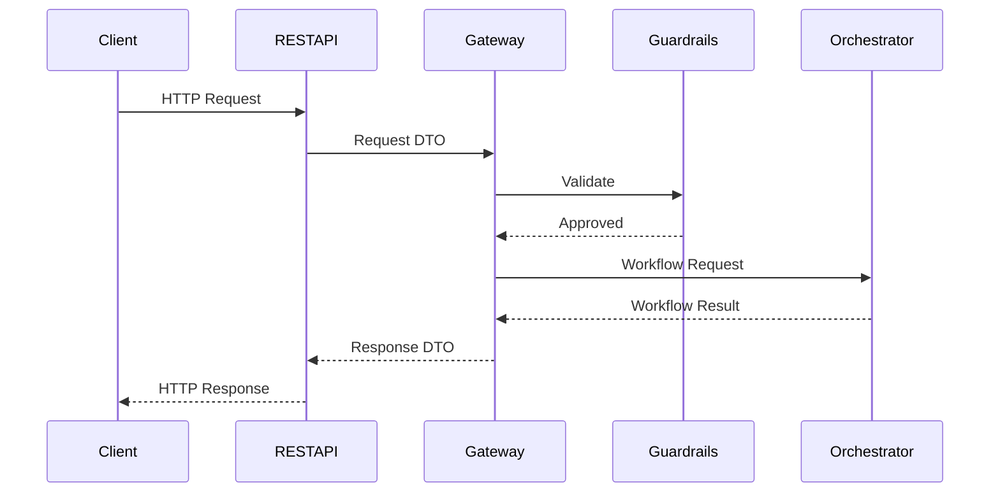

# 12.7 — Spring Boot AI REST API

> **Document Version:** 2.0.0
> **Status:** Draft — Architecture Review Pending
>
> **Parent Documents**
>
> * `00-PesoPilot-v2.0-Source-of-Truth.md`
> * `01-Rule-Based-Financial-Intelligence-Architecture.md`
> * `02-InsightBundle-and-Data-Contracts.md`
> * `03-Insight-Engine-Architecture.md`
> * `04-Rule-Engine-Architecture.md`
> * `05-Health-Engine-Architecture.md`
> * `06-Income-Engine-Architecture.md`
> * `07-Expense-Engine-Architecture.md`
> * `08-Savings-&-Goal-Engine-Architecture.md`
> * `09-Cashflow-&-Cutoff-Engine-Architecture.md`
> * `10-Recommendation-Engine-Architecture.md`
> * `11-Summary-Engine-Architecture.md`
> * `12.0-AI-Platform-Architecture-Overview.md`
> * `12.1-Prompt-Builder-Architecture.md`
> * `12.2-Conversation-Engine-Architecture.md`
> * `12.3-Ollama-Integration-Architecture.md`
> * `12.4-AI-Orchestration-Engine.md`
> * `12.5-Conversation-Memory-Architecture.md`
> * `12.6-AI-Safety-&-Guardrails.md`
>
> **Phase**
>
> Phase 11B / Phase 12 — AI Financial Intelligence Platform
>
> **Document**
>
> Spring Boot AI REST API

---

# 1. Purpose

The Spring Boot AI REST API defines the public HTTP interface of the PesoPilot AI Platform.

It provides a stable, versioned, and provider-independent contract through which clients interact with AI capabilities.

The REST API is responsible for:

* receiving client requests,
* validating request contracts,
* authenticating callers,
* authorizing operations,
* coordinating with the AI Gateway,
* returning standardized responses,
* supporting synchronous and streaming interactions.

The REST API does **not** execute AI workflows or communicate directly with language model providers.

---

# 2. REST API Philosophy

The REST API follows one guiding principle.

> **Expose stable contracts. Hide implementation details.**

Clients communicate with well-defined API contracts.

Internal AI architecture—including orchestration, prompt construction, provider execution, and memory management—remains completely hidden behind the API boundary.

---

# 3. AI Gateway Philosophy

The AI Gateway is the application boundary between HTTP transport and AI execution.

Responsibilities include:

* request validation,
* DTO mapping,
* authentication integration,
* authorization,
* correlation IDs,
* response mapping,
* streaming negotiation,
* error translation,
* observability.

The AI Gateway never performs orchestration or business logic.

---

# 4. Position Within the AI Platform

```mermaid
flowchart TD

Client

-->

SpringBootRESTAPI

SpringBootRESTAPI

-->

AI Gateway

AI Gateway

-->

Guardrail Engine

Guardrail Engine

-->

AI Orchestration Engine

AI Orchestration Engine

-->

AI Platform
```

The REST API acts as the external boundary of the AI Platform.

---

# 5. Responsibilities

The REST API owns:

* HTTP endpoint exposure,
* API versioning,
* request validation,
* authentication,
* authorization,
* DTO serialization,
* streaming negotiation,
* response formatting,
* exception translation,
* API documentation.

The REST API does **not** own:

* workflow execution,
* prompt construction,
* provider execution,
* memory management,
* financial intelligence,
* recommendation generation.

---

# 6. Overall REST API Architecture

```mermaid
flowchart LR

HTTP Request

-->

REST Controller

-->

AI Gateway

-->

Guardrail Engine

-->

AI Orchestrator

-->

Workflow Result

-->

REST Response
```

Every AI interaction follows this architecture.

---

# 7. REST API Principles

The AI REST API follows these architectural principles.

* Version-first API design.
* DTO-only communication.
* Stateless request processing.
* Provider independence.
* Deterministic contracts.
* Consistent error responses.
* Streaming support.
* Backward compatibility.
* Observable execution.
* Secure-by-default endpoints.

---

# 8. Primary REST Resources

The AI Platform exposes resources rather than provider operations.

Examples include:

```text
Chat

Conversation

Summary

Recommendation

Health

Memory

Session

Streaming

Diagnostics
```

Resources remain independent of provider implementations.

---

# 9. REST API High-Level Flow



The REST API remains a transport layer, while the AI Gateway provides the stable application contract and the AI Orchestration Engine coordinates execution throughout the platform.

---

# 10. REST Resources

The AI Platform exposes business-oriented resources rather than implementation-specific endpoints.

Clients communicate using stable domain concepts instead of provider operations.

Primary resources include:

```text
/api/v1/ai/chat

/api/v1/ai/conversations

/api/v1/ai/sessions

/api/v1/ai/memory

/api/v1/ai/summary

/api/v1/ai/recommendations

/api/v1/ai/health

/api/v1/ai/stream

/api/v1/ai/diagnostics
```

This approach keeps the public API independent of internal AI architecture and LLM providers.

---

## 10.1 Resource Design Principles

Resources should:

* represent business capabilities,
* remain provider-independent,
* use predictable URIs,
* support future expansion,
* remain backward compatible.

The API must never expose:

* provider names,
* prompt templates,
* internal workflows,
* orchestration stages.

---

# 11. Request & Response DTOs

Every endpoint communicates exclusively through DTOs.

Controllers never expose:

* entities,
* domain aggregates,
* provider DTOs,
* workflow models,
* persistence objects.

---

## 11.1 Request DTO Example

```text
ChatRequestDTO

├── conversationId
├── message
├── workflowType
├── stream
├── locale
├── metadata
└── version
```

The Request DTO defines the public contract.

---

## 11.2 Response DTO Example

```text
ChatResponseDTO

├── responseId
├── conversationId
├── message
├── recommendations
├── references
├── diagnostics
├── timestamp
└── version
```

The client never receives internal workflow state.

---

## 11.3 Standard API Envelope

Every response follows a consistent structure.

```text
ApiResponse<T>

├── success
├── data
├── errors
├── warnings
├── metadata
├── timestamp
├── requestId
└── version
```

A consistent response envelope simplifies client integration and future evolution.

---

# 12. Authentication & Authorization

The AI Platform integrates with the application's existing authentication and authorization mechanisms.

The REST API validates identity before forwarding requests to the AI Gateway.

Authentication is completed before any AI workflow is created.

---

## 12.1 Authentication Flow

```mermaid
flowchart LR

Client

-->

Authentication

-->

Authorization

-->

AI Gateway

-->

Workflow
```

Unauthorized requests are rejected immediately.

---

## 12.2 Authorization

Authorization determines:

* accessible AI capabilities,
* permitted workflow types,
* available models,
* streaming permissions,
* diagnostic visibility,
* administrative operations.

Authorization decisions remain independent of provider implementations.

---

## 12.3 Security Context

Authenticated requests carry a security context.

Examples include:

```text
User ID

Roles

Permissions

Organization

Locale

Request Metadata
```

The Security Context becomes part of the Workflow Context but never enters prompts unless explicitly required.

---

# 13. API Versioning

The AI Platform adopts explicit URI versioning.

Example:

```text
/api/v1/ai/chat

/api/v2/ai/chat
```

Major changes require a new API version.

Minor enhancements preserve existing contracts.

---

## 13.1 Versioning Principles

The platform guarantees:

* backward compatibility,
* stable DTOs,
* predictable deprecation,
* deterministic behavior,
* documented migration paths.

Existing clients should continue functioning throughout the supported lifecycle.

---

# 14. Streaming Endpoints

The REST API supports both synchronous and streaming interactions.

The transport mechanism remains independent from workflow execution.

---

## 14.1 Streaming Flow

```mermaid
flowchart TD

Client

-->

REST API

-->

AI Gateway

-->

Streaming Manager

-->

Provider

-->

Client
```

The Streaming Manager coordinates incremental delivery while the AI Orchestration Engine continues managing workflow execution.

---

## 14.2 Streaming Responsibilities

Streaming endpoints manage:

* connection establishment,
* incremental response delivery,
* cancellation,
* heartbeat messages,
* completion events,
* error propagation.

Streaming logic remains isolated from business logic.

---

# 15. Error Handling

The REST API exposes standardized error responses.

Internal exceptions never leak implementation details.

---

## 15.1 Error Categories

Examples include:

```text
Validation Error

Authentication Error

Authorization Error

Workflow Error

Provider Error

Safety Error

Rate Limit Error

Unexpected Error
```

Each category maps to deterministic HTTP responses.

---

## 15.2 Error Response

```text
ApiError

├── code
├── message
├── details
├── timestamp
├── requestId
└── version
```

Errors remain machine-readable and developer-friendly.

---

## 15.3 Exception Translation

```mermaid
flowchart LR

Exception

-->

Exception Handler

-->

ApiError

-->

HTTP Response
```

Exception translation occurs before the response leaves the REST API.

---

# 16. Observability & Correlation IDs

Every AI request receives a unique Correlation ID.

The Correlation ID follows the request through every subsystem.

```text
REST API

↓

AI Gateway

↓

Guardrail Engine

↓

AI Orchestrator

↓

Memory

↓

Prompt Builder

↓

Provider

↓

Response
```

This enables complete end-to-end tracing.

---

## 16.1 Request Diagnostics

Each request records:

```text
Correlation ID

Workflow ID

Conversation ID

Execution Time

Provider

Model

HTTP Status

Streaming Mode

Version
```

Diagnostics improve monitoring and troubleshooting.

---

## 16.2 Metrics

The REST API exposes operational metrics such as:

* request count,
* latency,
* streaming duration,
* validation failures,
* provider failures,
* authentication failures,
* response size,
* throughput.

Metrics remain independent from business analytics.

---

# 17. Integration with the AI Platform

The REST API coordinates with the AI Platform through the AI Gateway.

```mermaid
flowchart TD

REST Controller

-->

AI Gateway

AI Gateway

-->

Guardrail Engine

Guardrail Engine

-->

AI Orchestrator

AI Orchestrator

-->

Conversation Engine

AI Orchestrator

-->

Memory Service

AI Orchestrator

-->

Prompt Builder

AI Orchestrator

-->

Provider Layer
```

The REST API never communicates directly with:

* Prompt Builder,
* Provider Layer,
* Memory Repository,
* Conversation Repository,
* Workflow Manager.

All communication passes through the AI Gateway.

---

## 17.1 Integration Contracts

Subsystem communication follows explicit contracts.

```text
REST Request DTO

↓

Gateway Request DTO

↓

Workflow Request DTO

↓

Workflow Result DTO

↓

Gateway Response DTO

↓

REST Response DTO
```

Every layer owns its own DTOs.

No subsystem exposes its internal models outside its architectural boundary.

---

# 18. API Documentation

The AI REST API is self-documenting.

API documentation is generated directly from the application source to ensure consistency between implementation and published contracts.

Recommended technologies include:

* SpringDoc OpenAPI
* Swagger UI
* OpenAPI 3.x Specification

Documentation should include:

* endpoint descriptions,
* request schemas,
* response schemas,
* authentication requirements,
* streaming support,
* example payloads,
* error responses,
* version information.

Documentation becomes part of the public contract of the AI Platform.

---

## 18.1 Documentation Standards

Every endpoint should document:

```text id="k6fh9q"
Summary

Description

Authentication

Authorization

Request DTO

Response DTO

HTTP Status Codes

Error Responses

Examples

Version
```

Generated documentation must remain synchronized with the source code.

---

# 19. Testing Strategy

The AI REST API is tested independently from the AI Platform.

Testing focuses on transport behavior rather than workflow implementation.

---

## 19.1 Unit Tests

Each REST component requires isolated testing.

Examples include:

```text id="k3gq8d"
REST Controllers

AI Gateway

DTO Mappers

Exception Handlers

Authentication Filters

Authorization Filters

Request Validators

Response Builders
```

Controllers should be tested without invoking actual AI providers.

---

## 19.2 Integration Tests

Integration tests verify:

* endpoint availability,
* DTO serialization,
* authentication,
* authorization,
* streaming behavior,
* AI Gateway integration,
* HTTP status mapping,
* response contracts.

Integration tests ensure correct interaction between the REST layer and the AI Platform.

---

## 19.3 Contract Tests

API contracts must remain stable.

Contract testing verifies:

* request compatibility,
* response compatibility,
* field naming,
* schema evolution,
* version compatibility.

Breaking changes require a new API version.

---

## 19.4 Regression Tests

Regression testing compares:

```text id="v0mjlwm"
Expected Response

↓

Actual Response

↓

Schema Comparison
```

Unexpected API changes require architecture review.

---

# 20. Performance Targets

The REST API should introduce minimal overhead.

Recommended targets:

```text id="t2e6fb"
Request Validation

< 2 ms

DTO Mapping

< 1 ms

Gateway Processing

< 3 ms

Response Serialization

< 2 ms

Total REST Overhead

< 10 ms
```

Provider inference time is excluded from these measurements.

---

## 20.1 Scalability

The REST API should support:

* horizontal scaling,
* stateless deployment,
* connection pooling,
* asynchronous processing,
* streaming workloads,
* high concurrency.

No REST controller should maintain conversational state.

---

# 21. Deployment Considerations

The AI REST API is designed for cloud-native deployment.

Recommended deployment characteristics:

* stateless application instances,
* load balancing,
* HTTPS-only communication,
* centralized configuration,
* health endpoints,
* readiness probes,
* graceful shutdown,
* distributed logging.

The API should remain independent of deployment topology.

---

## 21.1 Configuration Management

Configuration should be externalized.

Examples include:

```text id="jgl6v2"
API Version

Authentication

Rate Limits

Timeouts

Streaming Settings

Provider Selection

Logging

Observability
```

Environment-specific configuration should not require code changes.

---

# 22. Future Evolution

The REST API is designed for long-term evolution.

Future capabilities may include:

```text id="x0ngpn"
WebSocket APIs

GraphQL Gateway

gRPC APIs

Batch AI Requests

Webhook Callbacks

Tool Invocation APIs

Multi-Agent APIs

Background Workflow APIs

Event Streaming APIs

Enterprise Administration APIs

SDK Generation
```

These additions extend the public interface while preserving existing contracts.

---

# 23. Architecture Decision Records

## ADR-341

### Why Introduce an AI Gateway?

**Decision**

The REST API delegates all application-level AI interactions to an AI Gateway.

**Reason**

Separates HTTP concerns from workflow orchestration, improving maintainability and allowing the API boundary to evolve independently.

---

## ADR-342

### Why Expose Business Resources Instead of Provider Operations?

**Decision**

Endpoints represent business capabilities rather than underlying language model functionality.

**Reason**

Keeps the public API provider-independent and aligned with domain-driven design principles.

---

## ADR-343

### Why Use DTO-Only Communication?

**Decision**

All external communication uses dedicated Request and Response DTOs.

**Reason**

Protects internal models, enables API evolution, and preserves architectural boundaries.

---

## ADR-344

### Why Adopt Explicit API Versioning?

**Decision**

Major API changes require explicit version increments.

**Reason**

Preserves backward compatibility while allowing controlled evolution of public contracts.

---

## ADR-345

### Why Treat the REST API as a Transport Layer?

**Decision**

Business logic, orchestration, and provider execution remain outside the REST layer.

**Reason**

Maintains single responsibility, simplifies testing, and supports multiple transport protocols in the future.

---

# 24. Final Acceptance Criteria

Document 12.7 is complete when:

* REST API philosophy is documented.
* AI Gateway architecture is defined.
* Resource design is standardized.
* Request and Response DTOs are specified.
* Authentication and authorization are documented.
* API versioning strategy is defined.
* Streaming architecture is documented.
* Error handling is standardized.
* Observability is specified.
* Testing strategy is complete.
* Performance targets are documented.
* Deployment considerations are defined.
* Future extensibility is documented.
* Architecture decisions are recorded.

---

# 25. Document Summary

Document 12.7 defines the complete Spring Boot AI REST API architecture, establishing the public integration boundary of the PesoPilot AI Platform. Through a dedicated AI Gateway, stable REST resources, standardized DTOs, explicit versioning, robust authentication and authorization, streaming support, consistent error handling, and comprehensive observability, the REST layer exposes AI capabilities without revealing internal implementation details. By separating transport concerns from orchestration, safety enforcement, provider integration, and business logic, the architecture delivers a scalable, provider-independent, and enterprise-ready API that can evolve to support future protocols and advanced AI capabilities while preserving backward compatibility.

---

# 26. AI Platform Progress & End of Document

```text id="3zjlwm"
██████████████████████

✓ 12.0 — AI Platform Architecture Overview

✓ 12.1 — Prompt Builder Architecture

✓ 12.2 — Conversation Engine Architecture

✓ 12.3 — Ollama Integration Architecture

✓ 12.4 — AI Orchestration Engine

✓ 12.5 — Conversation Memory Architecture

✓ 12.6 — AI Safety & Guardrails

✓ 12.7 — Spring Boot AI REST API

□□□□□□□□□□

12.8 — Streaming & Real-Time Response Architecture

12.9 — AI Testing Strategy

12.10 — Future Multi-LLM Architecture
```

---

## End of Document

**Document Status:** ✅ **Completed**

**Next Document:** **12.8 — Streaming & Real-Time Response Architecture**

---

## Milestone Achieved

With **Document 12.7** complete, the AI Platform now has a fully specified **external application interface**. Documents **12.0–12.7** collectively define the complete end-to-end execution path of PesoPilot AI—from client interaction at the REST API boundary, through the AI Gateway, Guardrail Engine, AI Orchestration Engine, Conversation Engine, Memory Service, Prompt Builder, and Provider Layer, and back to the client through standardized, versioned, and observable API contracts. This establishes a transport-independent, enterprise-grade foundation capable of supporting web applications, mobile clients, external integrations, SDKs, and future communication protocols while maintaining strong architectural boundaries and long-term maintainability.

