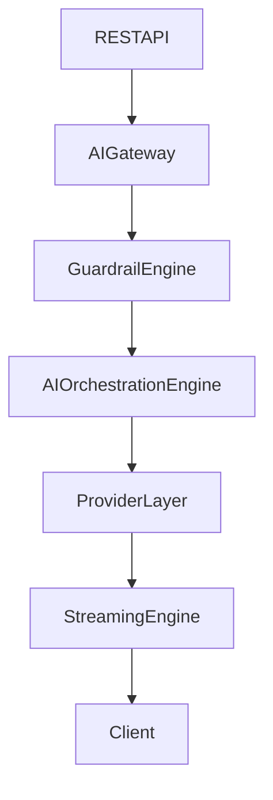
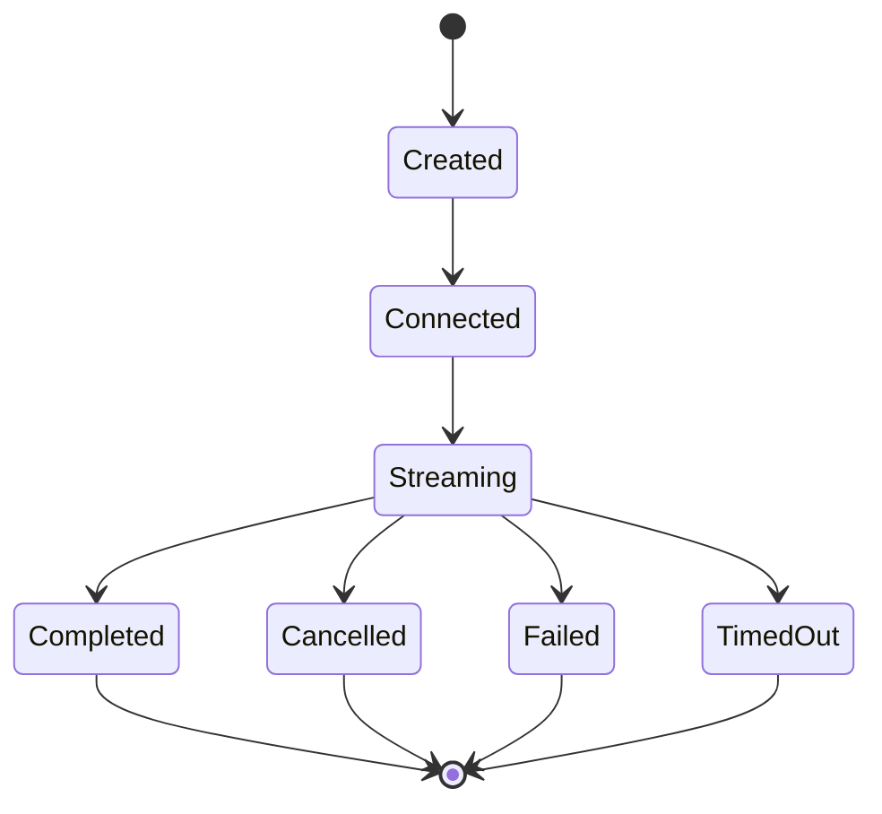
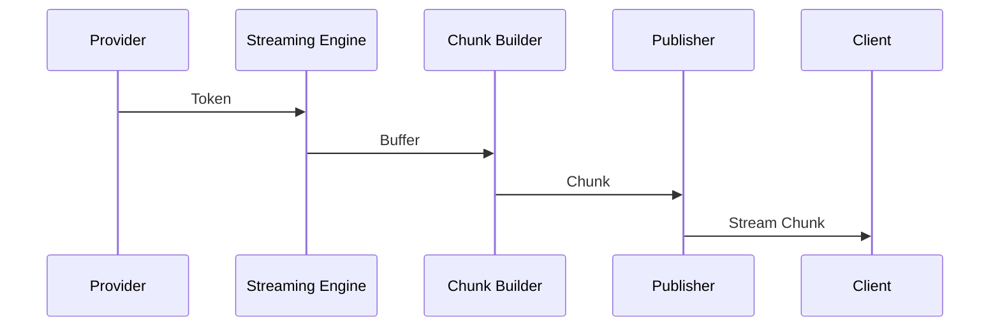
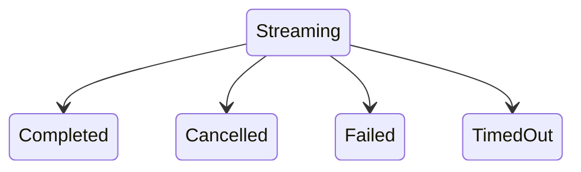

# 12.8 — Streaming & Real-Time Response Architecture

> **Document Version:** 2.0.0
> **Status:** Draft — Architecture Review Pending
>
> **Parent Documents**
>
> * `00-PesoPilot-v2.0-Source-of-Truth.md`
> * `01`–`12.7` (All previously completed AI Platform architecture documents)
>
> **Phase**
>
> Phase 11B / Phase 12 — AI Financial Intelligence Platform
>
> **Document**
>
> Streaming & Real-Time Response Architecture

---

# 1. Purpose

The Streaming & Real-Time Response Architecture defines how PesoPilot delivers AI-generated content incrementally, efficiently, and reliably to clients.

Unlike traditional request-response systems that wait for complete output before responding, the AI Platform streams responses as they are produced, enabling significantly lower perceived latency and a more interactive user experience.

This document defines the architecture responsible for:

* real-time token delivery,
* stream lifecycle management,
* buffering,
* synchronization,
* cancellation,
* completion,
* diagnostics,
* provider-independent streaming.

The Streaming Engine operates independently of language model providers while integrating seamlessly with the AI Platform.

---

# 2. Streaming Philosophy

PesoPilot follows one guiding principle.

> **Generate once. Deliver continuously.**

The platform should begin delivering useful information as soon as it becomes available rather than waiting for complete response generation.

Streaming is therefore considered an execution concern rather than a provider capability.

Every provider capable of incremental generation is abstracted behind a common streaming architecture.

---

# 3. Position Within the AI Platform

The Streaming Engine participates after provider execution begins.



The Streaming Engine is responsible only for response delivery.

Provider execution remains within the Provider Layer.

---

# 4. Streaming Engine Philosophy

The Streaming Engine is a dedicated subsystem responsible for managing every active stream.

Its responsibilities include:

* stream creation,
* stream management,
* token buffering,
* chunk publication,
* synchronization,
* cancellation,
* completion,
* diagnostics.

The Streaming Engine never:

* generates prompts,
* invokes providers,
* performs orchestration,
* manages conversations,
* stores memory.

It exists solely to manage live response delivery.

---

# 5. Responsibilities

The Streaming Engine owns:

* stream lifecycle,
* stream registration,
* client synchronization,
* token buffering,
* chunk sequencing,
* heartbeat management,
* cancellation,
* completion detection,
* stream diagnostics,
* transport abstraction.

The Streaming Engine does **not** own:

* AI generation,
* workflow execution,
* provider communication,
* financial intelligence,
* recommendation generation,
* memory retrieval,
* prompt construction.

---

# 6. Overall Streaming Architecture

```mermaid
flowchart LR

Provider

-->

Streaming Engine

-->

Token Buffer

-->

Chunk Publisher

-->

Transport Layer

-->

Client
```

Every streaming response follows the same execution path regardless of provider.

---

# 7. Streaming Principles

The Streaming Architecture follows ten architectural principles.

---

## 7.1 Provider Independence

Streaming behavior must remain identical regardless of the underlying language model provider.

---

## 7.2 Transport Independence

Streaming logic must remain independent of HTTP transport mechanisms.

Whether the client uses:

* Server-Sent Events,
* WebSockets,
* HTTP chunked responses,
* future protocols,

the Streaming Engine behaves identically.

---

## 7.3 Deterministic Ordering

Chunks are always published in the exact order they are generated.

Clients never receive reordered content.

---

## 7.4 Low Latency

Streaming should minimize perceived response time.

The first chunk should be delivered as quickly as practical without sacrificing correctness.

---

## 7.5 Recoverability

Temporary network interruptions should not necessarily terminate workflow execution.

Future versions may support resumable streams.

---

## 7.6 Cancelability

Clients may terminate active streams at any time.

Cancellation should propagate cleanly throughout the platform.

---

## 7.7 Observability

Every stream produces diagnostics suitable for monitoring, troubleshooting, and performance analysis.

---

## 7.8 Scalability

The Streaming Engine must support many concurrent active streams without coupling stream state to REST controllers.

---

## 7.9 Stateless Transport

Application instances should remain horizontally scalable.

Persistent stream state should be managed by the Streaming Engine rather than individual HTTP requests.

---

## 7.10 Extensibility

The Streaming Architecture should support future capabilities without changing existing public contracts.

---

# 8. Stream Lifecycle

Every stream follows a deterministic lifecycle.



Each state transition is explicit.

No stream may skip lifecycle stages.

---

# 9. Streaming Engine Components

The Streaming Engine is composed of specialized components.

```text
Streaming Engine

├── Stream Manager
├── Stream Registry
├── Token Buffer
├── Chunk Publisher
├── Transport Adapter
├── Heartbeat Manager
├── Completion Manager
├── Cancellation Manager
├── Retry Manager
├── Stream Validator
├── Diagnostics Manager
└── Version
```

### Stream Manager

Coordinates the lifecycle of every active stream.

---

### Stream Registry

Tracks all active streaming sessions.

---

### Token Buffer

Temporarily stores provider tokens before publication.

---

### Chunk Publisher

Packages buffered tokens into client-visible chunks.

---

### Transport Adapter

Publishes chunks through the configured transport mechanism without exposing transport-specific details to the Streaming Engine.

---

### Heartbeat Manager

Maintains long-lived streaming connections.

---

### Completion Manager

Detects successful stream completion and coordinates finalization.

---

### Cancellation Manager

Handles client-initiated, workflow-initiated, and provider-initiated cancellations.

---

### Retry Manager

Coordinates recoverable streaming failures according to configured retry policies.

---

### Stream Validator

Validates stream state transitions, sequencing, and protocol compliance.

---

### Diagnostics Manager

Collects operational metrics and execution diagnostics for every stream.

Together, these components provide a provider-independent, transport-agnostic, and highly scalable streaming subsystem capable of supporting real-time AI interactions across the entire PesoPilot AI Platform.

---

# 10. Streaming Pipeline

The Streaming Engine transforms provider output into a deterministic stream of client-visible events.

Every active stream follows the same execution pipeline.

```mermaid
flowchart LR

Provider

-->

Token Receiver

-->

Token Buffer

-->

Chunk Builder

-->

Stream Publisher

-->

Transport Adapter

-->

Client
```

Each stage performs one responsibility.

The Streaming Engine coordinates the pipeline independently of the Provider Layer.

---

# 11. Token Buffer Architecture

Provider output is received incrementally.

Instead of immediately forwarding every token, the Streaming Engine temporarily buffers generated tokens.

Responsibilities include:

* preserving ordering,
* minimizing network overhead,
* reducing transport fragmentation,
* supporting configurable buffering strategies,
* enabling cancellation before publication.

```text
Provider Tokens

↓

Token Buffer

↓

Chunk Builder
```

The buffering strategy remains configurable.

Possible modes include:

* Immediate
* Buffered
* Adaptive

---

# 12. Stream Event Model

The Streaming Engine publishes structured stream events instead of raw provider tokens.

```text
Stream Event

├── Event ID
├── Stream ID
├── Event Type
├── Sequence Number
├── Timestamp
├── Payload
├── Metadata
└── Version
```

Event Types include:

```text
StreamStarted

ChunkReceived

ChunkPublished

Heartbeat

Progress

Warning

Completed

Cancelled

Failed
```

Future versions may introduce additional event types such as:

* ToolInvocation
* ToolResult
* AgentSwitch
* ReasoningProgress
* VoiceChunk

The event model provides extensibility without changing client contracts.

---

# 13. Chunk Model

Chunks represent the client-visible units of streamed content.

```text
Stream Chunk

├── Chunk ID
├── Stream ID
├── Sequence
├── Content
├── Finish Flag
├── Metadata
└── Version
```

Chunks remain immutable after publication.

Each chunk is published exactly once.

Ordering is preserved throughout the stream.

---

# 14. Client Synchronization

The Streaming Engine guarantees deterministic synchronization between server and client.

Responsibilities include:

* preserving sequence order,
* preventing duplicate chunks,
* detecting missing chunks,
* handling reconnect scenarios,
* maintaining stream consistency.



Clients reconstruct responses using ordered chunks rather than provider tokens.

---

# 15. Backpressure Management

Streaming performance depends on balancing provider throughput and client consumption speed.

The Streaming Engine manages backpressure through controlled buffering and publication.

Possible situations include:

* provider generates faster than client receives,
* network latency increases,
* client temporarily pauses,
* transport bandwidth decreases.

Backpressure strategies include:

```text
Adaptive Buffering

Queue Management

Publication Throttling

Chunk Aggregation

Graceful Degradation
```

Provider execution should remain isolated from client transport conditions whenever practical.

---

# 16. Stream Cancellation & Completion

Streams may terminate for multiple reasons.

Normal completion occurs when the Provider Layer signals successful generation.

Cancellation may occur due to:

* user cancellation,
* workflow cancellation,
* timeout,
* provider interruption,
* transport failure,
* administrative termination.



Every termination path generates a final stream event before cleanup.

Cleanup includes:

* releasing buffers,
* unregistering the stream,
* updating diagnostics,
* notifying the AI Orchestration Engine.

---

# 17. Streaming Diagnostics

Every stream produces comprehensive operational diagnostics.

Examples include:

```text
Stream ID

Workflow ID

Conversation ID

Provider

Model

Start Time

Completion Time

Duration

First Token Latency

Chunk Count

Token Count

Bytes Sent

Average Chunk Size

Reconnect Count

Cancellation Status

Completion Status

Transport Type

Version
```

These diagnostics support:

* observability,
* troubleshooting,
* performance tuning,
* capacity planning,
* operational analytics.

Streaming diagnostics remain independent of business analytics and financial intelligence, focusing exclusively on the operational health of the real-time response subsystem.

---

# 18. Streaming DTOs

The Streaming Engine communicates exclusively through standardized DTOs.

Internal stream models are never exposed directly.

---

## 18.1 Stream Request DTO

```text id="2cqzkh"
StreamRequestDTO

├── Conversation ID
├── Workflow Type
├── User Message
├── Stream Options
├── Metadata
└── Version
```

This DTO initializes a streaming workflow.

---

## 18.2 Stream Chunk DTO

```text id="wt4bnl"
StreamChunkDTO

├── Stream ID
├── Sequence Number
├── Chunk Content
├── Event Type
├── Timestamp
├── Metadata
└── Version
```

Each published chunk represents a deterministic portion of the overall response.

---

## 18.3 Stream Completion DTO

```text id="tzxqfk"
StreamCompletionDTO

├── Stream ID
├── Completion Status
├── Finish Reason
├── Total Chunks
├── Total Tokens
├── Duration
└── Version
```

Completion DTOs notify clients that the stream has ended successfully.

---

## 18.4 Stream Error DTO

```text id="h2xgq7"
StreamErrorDTO

├── Stream ID
├── Error Code
├── Message
├── Timestamp
├── Diagnostics
└── Version
```

Errors remain structured and transport-independent.

---

# 19. REST & AI Gateway Integration

The Streaming Engine integrates with the REST API through the AI Gateway.

```mermaid id="7knrgu"
flowchart TD

Client

-->

REST API

-->

AI Gateway

-->

Guardrail Engine

-->

AI Orchestration Engine

-->

Provider Layer

-->

Streaming Engine

-->

Transport Adapter

-->

Client
```

The AI Gateway remains responsible for:

* request validation,
* authentication,
* authorization,
* correlation IDs,
* transport negotiation.

The Streaming Engine remains responsible for live response delivery.

---

## 19.1 Transport Support

The Streaming Architecture supports multiple transport mechanisms.

Current transport:

```text id="jufnlo"
Server-Sent Events (SSE)
```

Future transport options:

```text id="n2ndv6"
WebSockets

HTTP Chunked Transfer

gRPC Streaming

HTTP/3 Streams

Message Queues
```

Transport implementation does not change Streaming Engine behavior.

---

# 20. Testing Strategy

The Streaming Engine is tested independently from:

* Provider Layer,
* AI Gateway,
* AI Orchestration Engine,
* Conversation Engine,
* Memory Service.

Testing focuses on deterministic stream behavior.

---

## 20.1 Unit Tests

Each streaming component requires isolated testing.

Examples include:

```text id="2e5dtx"
Stream Manager

Token Buffer

Chunk Builder

Publisher

Heartbeat Manager

Completion Manager

Retry Manager

Cancellation Manager

Transport Adapter

Diagnostics Manager
```

---

## 20.2 Integration Tests

Verify:

* provider streaming,
* chunk ordering,
* cancellation,
* completion,
* client synchronization,
* REST integration,
* transport adapters.

---

## 20.3 Chaos Testing

The Streaming Engine should tolerate:

* provider disconnects,
* slow networks,
* dropped connections,
* delayed chunks,
* client cancellation,
* retry scenarios.

Operational resilience is part of the architecture.

---

# 21. Performance Targets

Recommended targets:

```text id="q1kpdo"
First Token Latency

< 500 ms

Chunk Publication

< 50 ms

Cancellation

< 100 ms

Completion

< 50 ms

Heartbeat

< 30 seconds

Streaming Overhead

< 10 ms
```

These targets exclude language model inference time.

---

# 22. Future Evolution

The Streaming Architecture is designed to support future capabilities.

Examples include:

```text id="h4k0hq"
Bidirectional Streaming

Voice Streaming

Tool Streaming

Multi-Agent Streaming

Progress Events

Reasoning Events

Live Charts

Live Financial Dashboards

Collaborative AI Sessions

Background Workflow Streaming

Cross-Device Synchronization

Adaptive Streaming Policies
```

These features extend the Streaming Engine without changing its core contracts.

---

# 23. Architecture Decision Records

## ADR-346

### Why Introduce a Dedicated Streaming Engine?

**Decision**

Streaming is implemented as an independent execution subsystem.

**Reason**

Separates response delivery from provider execution, improving modularity, scalability, and maintainability.

---

## ADR-347

### Why Stream Structured Events Instead of Raw Tokens?

**Decision**

The Streaming Engine publishes typed stream events.

**Reason**

Supports future capabilities such as tool invocation, reasoning updates, progress notifications, and multi-agent collaboration without changing client protocols.

---

## ADR-348

### Why Keep Streaming Provider-Independent?

**Decision**

Streaming behavior is abstracted from provider implementations.

**Reason**

Allows providers to be replaced or combined while preserving a consistent client experience.

---

## ADR-349

### Why Make Streaming Transport-Independent?

**Decision**

Transport protocols are isolated behind Transport Adapters.

**Reason**

Enables migration between SSE, WebSockets, gRPC, and future protocols without redesigning the Streaming Engine.

---

## ADR-350

### Why Treat Streaming as an Observable Subsystem?

**Decision**

Every stream automatically produces diagnostics, metrics, and operational events.

**Reason**

Improves production monitoring, troubleshooting, performance optimization, and operational visibility.

---

# 24. Final Acceptance Criteria

Document 12.8 is complete when:

* Streaming philosophy is documented.
* Streaming Engine architecture is defined.
* Stream lifecycle is specified.
* Streaming pipeline is documented.
* Token buffering is defined.
* Event model is standardized.
* Chunk model is documented.
* Client synchronization is specified.
* Backpressure handling is defined.
* Cancellation and completion are documented.
* Streaming DTOs are standardized.
* REST integration is documented.
* Testing strategy is complete.
* Performance targets are defined.
* Future extensibility is documented.
* Architecture decisions are recorded.

---

# 25. Document Summary

Document 12.8 defines the complete Streaming & Real-Time Response Architecture of the PesoPilot AI Platform. Through a dedicated Streaming Engine, deterministic stream lifecycles, structured event models, transport-independent delivery, token buffering, client synchronization, cancellation management, and comprehensive diagnostics, the platform provides responsive and reliable real-time AI interactions. By separating provider execution from response delivery and introducing observable streaming as a first-class architectural capability, the Streaming Engine establishes a scalable foundation for future enhancements including voice interaction, tool streaming, progress events, multi-agent collaboration, and bidirectional communication while preserving clean architectural boundaries and provider independence.

---

# 26. AI Platform Progress & End of Document

```text id="wvrpj9"
██████████████████████████

✓ 12.0 — AI Platform Architecture Overview

✓ 12.1 — Prompt Builder Architecture

✓ 12.2 — Conversation Engine Architecture

✓ 12.3 — Ollama Integration Architecture

✓ 12.4 — AI Orchestration Engine

✓ 12.5 — Conversation Memory Architecture

✓ 12.6 — AI Safety & Guardrails

✓ 12.7 — Spring Boot AI REST API

✓ 12.8 — Streaming & Real-Time Response Architecture

□□□□□□

12.9 — AI Testing Strategy

12.10 — Future Multi-LLM Architecture
```

---

## End of Document

**Document Status:** ✅ **Completed**

**Next Document:** **12.9 — AI Testing Strategy**

---

## Milestone Achieved

With **Document 12.8** complete, the AI Platform now has a fully specified **real-time response subsystem**. Documents **12.0–12.8** collectively define the complete runtime architecture of PesoPilot AI—from client entry through the AI Gateway, Guardrail Engine, AI Orchestration Engine, Conversation Engine, Memory Service, Prompt Builder, Provider Layer, and finally the Streaming Engine. The introduction of a dedicated Streaming Engine elevates response delivery to a first-class architectural concern, providing deterministic, provider-independent, transport-agnostic, and observable streaming that supports today's incremental text generation while establishing a robust foundation for future capabilities such as voice streaming, tool execution events, live dashboards, and multi-agent interactions.


