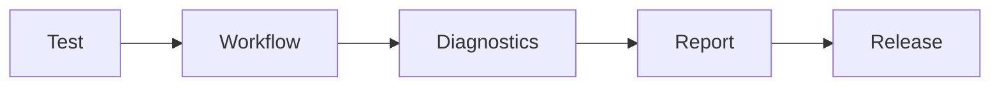

# 12.9 — AI Testing Strategy

> **Document Version:** 2.0.0
> **Status:** Draft — Architecture Review Pending
>
> **Parent Documents**
>
> * `00-PesoPilot-v2.0-Source-of-Truth.md`
> * `01`–`12.8` (All previously completed AI Platform architecture documents)
>
> **Phase**
>
> Phase 11B / Phase 12 — AI Financial Intelligence Platform
>
> **Document**
>
> AI Testing Strategy

---

# 1. Purpose

The AI Testing Strategy defines the quality assurance architecture of the PesoPilot AI Platform.

Unlike subsystem-specific testing sections, this document establishes a unified testing framework that governs every AI capability across the platform.

The strategy ensures that AI workflows remain:

* correct,
* deterministic where applicable,
* reliable,
* explainable,
* observable,
* performant,
* maintainable.

Testing is treated as a first-class architectural concern rather than a development activity.

---

# 2. Testing Philosophy

PesoPilot follows one guiding principle.

> **Every deterministic component must be provably correct. Every probabilistic component must be measurably reliable.**

Traditional software testing validates correctness.

AI testing validates:

* correctness,
* consistency,
* reliability,
* safety,
* quality,
* user experience.

Since AI systems contain probabilistic behavior, success is measured using repeatable evaluation criteria rather than exact output matching alone.

---

# 3. Position Within the AI Platform

The AI Test Harness operates independently from production workflows.

```mermaid
flowchart TD

Developer

-->

AI Test Harness

AI Test Harness

-->

AI Platform

AI Platform

-->

Evaluation Engine

Evaluation Engine

-->

Reports

Reports

-->

Developer
```

The testing architecture never participates in production AI execution.

Instead, it continuously validates production readiness.

---

# 4. AI Test Harness

The AI Test Harness is the centralized testing subsystem for the AI Platform.

Rather than allowing each subsystem to create its own testing framework, the AI Test Harness provides common infrastructure for validation, simulation, benchmarking, and quality evaluation.

Its responsibilities include:

* test orchestration,
* workflow simulation,
* provider mocking,
* prompt simulation,
* conversation simulation,
* memory simulation,
* regression execution,
* performance benchmarking,
* quality evaluation,
* diagnostics generation.

---

## 4.1 AI Test Harness Components

```text
AI Test Harness

├── Test Orchestrator
├── Unit Test Runner
├── Integration Runner
├── Workflow Simulator
├── Prompt Simulator
├── Conversation Simulator
├── Memory Simulator
├── Provider Mock
├── Stream Simulator
├── Evaluation Engine
├── Benchmark Runner
├── Diagnostics
└── Version
```

Each component has a single responsibility and can evolve independently.

---

# 5. Testing Principles

The AI Platform follows ten testing principles.

---

## 5.1 Deterministic Testing

Deterministic components should always produce identical outputs for identical inputs.

Examples include:

* Rule Engine
* Health Engine
* Recommendation scoring
* Financial calculations
* DTO mapping

---

## 5.2 Probabilistic Evaluation

LLM-generated responses are evaluated using measurable quality criteria rather than exact string comparisons.

Evaluation considers:

* factual consistency,
* completeness,
* clarity,
* safety,
* relevance.

---

## 5.3 Isolation

Every subsystem should be testable independently.

No component should require the entire AI Platform to validate its own behavior.

---

## 5.4 Provider Independence

Testing should produce consistent results regardless of the underlying LLM provider.

Provider-specific differences should be isolated within Provider Layer tests.

---

## 5.5 Repeatability

Every automated test must be repeatable.

Identical test configurations should produce identical evaluation metrics.

---

## 5.6 Automation

Testing should execute automatically as part of the CI/CD pipeline whenever practical.

Manual testing complements—but never replaces—automated validation.

---

## 5.7 Observability

Every test execution produces:

* metrics,
* logs,
* diagnostics,
* execution reports.

Results should support troubleshooting and trend analysis.

---

## 5.8 Explainability

Failed tests should provide sufficient diagnostic information to identify the cause of failure.

Testing outcomes should be understandable by developers without requiring manual reproduction.

---

## 5.9 Scalability

The testing framework should support increasing numbers of:

* workflows,
* providers,
* prompts,
* conversations,
* datasets,
* benchmarks.

---

## 5.10 Continuous Validation

Testing is performed continuously throughout development rather than exclusively before releases.

Quality assurance is an ongoing architectural capability.

---

# 6. AI Testing Pyramid

Testing is organized into multiple layers.

```text
Acceptance Testing

↓

Platform Testing

↓

Workflow Testing

↓

Integration Testing

↓

Unit Testing
```

Additional cross-cutting test categories include:

```text
Performance

Regression

Evaluation

Security

Chaos

Compatibility
```

Each layer validates progressively larger portions of the AI Platform.

---

# 7. Testing Components

Every AI subsystem participates in the unified testing architecture.

```text
AI Platform

├── Rule Engine Tests
├── Health Engine Tests
├── Income Engine Tests
├── Expense Engine Tests
├── Savings Engine Tests
├── Cashflow Engine Tests
├── Recommendation Engine Tests
├── Summary Engine Tests
├── Prompt Builder Tests
├── Conversation Engine Tests
├── Memory Service Tests
├── Guardrail Engine Tests
├── AI Orchestration Tests
├── Provider Layer Tests
├── Streaming Engine Tests
├── REST API Tests
└── Diagnostics Tests
```

Each subsystem owns its implementation-specific tests while adhering to the platform-wide testing strategy.

---

# 8. Test Data Strategy

Reliable testing requires deterministic and reproducible datasets.

The AI Platform defines multiple categories of test data.

---

## 8.1 Synthetic Data

Artificially generated financial datasets used to validate deterministic business logic.

Examples include:

* expenses,
* income,
* savings,
* budgets,
* financial goals.

---

## 8.2 Synthetic Conversations

Curated conversations representing common financial coaching scenarios.

Examples include:

* budgeting,
* savings planning,
* expense analysis,
* financial goal tracking,
* recommendation requests.

---

## 8.3 Golden Datasets

Golden datasets contain validated reference outputs.

They are used for:

* regression testing,
* evaluation,
* benchmark comparison.

---

## 8.4 Replay Datasets

Replay datasets capture historical workflows and conversations.

They allow previous execution scenarios to be replayed against newer platform versions to detect unintended behavioral changes.

---

# 9. Testing Lifecycle

Every platform change follows the same validation lifecycle.

```mermaid
flowchart LR

Build

-->

Unit Tests

-->

Integration Tests

-->

Workflow Tests

-->

Regression Tests

-->

Performance Tests

-->

Evaluation

-->

Release Candidate

-->

Production
```

Each stage must complete successfully before progressing to the next.

This layered lifecycle ensures that correctness, integration, performance, AI quality, and overall platform stability are validated before deployment.

---

# 10. Unit Testing Strategy

Unit testing validates each AI Platform component in complete isolation.

Every component should be executable without requiring the remainder of the AI Platform.

The primary objective is to verify deterministic business behavior and implementation correctness.

---

## 10.1 Unit Test Scope

Every major subsystem maintains its own unit test suite.

Examples include:

```text
Rule Engine

Health Engine

Income Engine

Expense Engine

Savings Engine

Cashflow Engine

Recommendation Engine

Summary Engine

Prompt Builder

Conversation Engine

Memory Service

Guardrail Engine

AI Orchestration Engine

Provider Layer

Streaming Engine

REST API
```

Unit tests should never invoke external providers.

---

## 10.2 Unit Testing Principles

Each unit test should verify:

* one responsibility,
* one expected behavior,
* deterministic output,
* isolated dependencies,
* repeatable execution.

Mocking should be preferred over external integration whenever practical.

---

# 11. Integration Testing Strategy

Integration testing validates collaboration between multiple subsystems.

Rather than testing individual business logic, integration tests verify architectural contracts.

---

## 11.1 Integration Scope

Typical integration scenarios include:

```text
REST API

↓

AI Gateway

↓

Guardrail Engine

↓

AI Orchestration Engine

↓

Prompt Builder
```

Other examples:

* Prompt Builder → Provider Layer
* Conversation Engine → Memory Service
* Memory Service → Prompt Builder
* AI Orchestrator → Streaming Engine
* Streaming Engine → REST API

---

## 11.2 Integration Objectives

Integration testing validates:

* contract compatibility,
* DTO mapping,
* service communication,
* error propagation,
* workflow sequencing,
* dependency boundaries.

Subsystems should collaborate without exposing internal implementation details.

---

# 12. Workflow Testing

Workflow testing validates complete end-to-end AI execution.

Unlike integration testing, workflow testing evaluates the behavior of an entire AI workflow from initiation to completion.

---

## 12.1 Example Workflow

```mermaid
flowchart TD

User

-->

REST API

-->

AI Gateway

-->

Guardrail Engine

-->

AI Orchestration Engine

-->

Prompt Builder

-->

Provider Layer

-->

Streaming Engine

-->

Client
```

The entire execution path is validated as one cohesive workflow.

---

## 12.2 Workflow Validation

Workflow testing verifies:

* workflow initialization,
* prompt generation,
* provider execution,
* streaming,
* memory interaction,
* safety enforcement,
* response generation,
* diagnostics.

Every workflow should produce deterministic execution behavior even when AI-generated content varies.

---

# 13. Regression Testing

Regression testing ensures that architectural improvements do not unintentionally change existing platform behavior.

The AI Platform maintains curated regression datasets known as **Golden Scenarios**.

---

## 13.1 Golden Scenarios

Golden Scenarios represent validated AI interactions.

Examples include:

```text
Budget Planning

Expense Review

Savings Coaching

Income Analysis

Cashflow Forecast

Financial Summary

Recommendation Session
```

Each scenario contains:

* input,
* workflow,
* expected behavior,
* evaluation metrics.

---

## 13.2 Regression Validation

Regression testing compares:

```mermaid
flowchart LR

Historical Execution

-->

Comparison Engine

Current Execution

-->

Comparison Engine

Comparison Engine

-->

Evaluation Report
```

Behavioral differences are reviewed before release.

---

# 14. Performance Testing

Performance testing evaluates platform responsiveness under realistic workloads.

Testing includes both deterministic services and AI execution.

---

## 14.1 Performance Categories

Examples include:

```text
REST Latency

Workflow Latency

Prompt Generation

Memory Retrieval

Provider Latency

Streaming Performance

Concurrency

Resource Utilization
```

Performance testing distinguishes platform overhead from provider inference time.

---

## 14.2 Load Testing

The AI Platform should support concurrent workloads.

Load testing evaluates:

* concurrent users,
* simultaneous conversations,
* active streaming sessions,
* provider utilization,
* memory consumption,
* request throughput.

---

## 14.3 Stress Testing

Stress testing intentionally exceeds expected operating conditions.

Objectives include:

* graceful degradation,
* recovery validation,
* stability verification,
* resource exhaustion behavior.

---

# 15. Provider Testing

Provider testing validates compatibility across supported language models.

Testing remains provider-independent whenever possible.

---

## 15.1 Mock Provider Testing

Development environments primarily use mock providers.

Mock providers enable:

* deterministic outputs,
* repeatable execution,
* rapid testing,
* offline development.

---

## 15.2 Real Provider Testing

Real provider testing validates:

* request compatibility,
* response compatibility,
* streaming,
* token handling,
* retry behavior,
* timeout handling.

These tests confirm interoperability without replacing deterministic unit tests.

---

## 15.3 Provider Compatibility Matrix

The platform maintains compatibility verification for each supported provider.

Examples include:

```text
Ollama

Spring AI

Future OpenAI

Future Anthropic

Future Google Gemini

Future Azure OpenAI
```

Provider-specific capabilities remain isolated within the Provider Layer.

---

# 16. AI Evaluation Strategy

Unlike deterministic software, AI-generated responses require quality evaluation.

The Evaluation Engine measures response quality using objective criteria.

---

## 16.1 Evaluation Dimensions

Responses are evaluated for:

* factual consistency,
* financial correctness,
* relevance,
* completeness,
* clarity,
* safety,
* coherence,
* explainability.

Each dimension contributes to an overall evaluation score.

---

## 16.2 Hallucination Evaluation

Evaluation verifies that generated responses remain grounded in platform data.

Checks include:

* unsupported claims,
* fabricated financial values,
* invented recommendations,
* inconsistent summaries,
* invalid references.

Hallucination detection complements the Guardrail Engine.

---

## 16.3 Safety Evaluation

Safety evaluation verifies:

* policy compliance,
* prompt safety,
* memory safety,
* privacy compliance,
* financial guidance boundaries.

Safety metrics are tracked independently from response quality.

---

# 17. Benchmarking

Benchmarking measures AI Platform improvements across releases.

Rather than evaluating individual responses, benchmarking evaluates long-term platform evolution.

---

## 17.1 Benchmark Categories

Examples include:

```text
Prompt Quality

Workflow Success

Recommendation Accuracy

Summary Quality

Memory Retrieval

Streaming Performance

Guardrail Effectiveness

Provider Compatibility
```

---

## 17.2 Historical Benchmarks

Each release is compared against previous platform versions.

Historical benchmarks identify:

* performance improvements,
* quality improvements,
* regressions,
* behavioral drift.

---

## 17.3 Release Benchmarks

Every production release records benchmark results.

These benchmarks become part of the platform's quality history and guide future architectural decisions.

---

# 18. Chaos Testing

Chaos Testing validates the resilience of the AI Platform under unexpected failures and adverse operating conditions.

Rather than verifying correctness, Chaos Testing evaluates the platform's ability to recover, degrade gracefully, and maintain operational stability.

The objective is to identify architectural weaknesses before they occur in production.

---

## 18.1 Chaos Testing Philosophy

The AI Platform assumes that failures are inevitable.

Examples include:

* provider outages,
* network interruptions,
* streaming failures,
* corrupted requests,
* unavailable services,
* resource exhaustion.

Every subsystem should respond predictably and recover safely.

---

## 18.2 Chaos Scenarios

Representative scenarios include:

```text id="eqm29j"
Provider Unavailable

Streaming Interrupted

Memory Repository Failure

Prompt Builder Failure

Workflow Timeout

REST API Timeout

Guardrail Rejection

Conversation State Corruption

Network Partition

High Concurrency
```

Each scenario validates resilience rather than functionality.

---

## 18.3 Recovery Validation

Chaos Testing verifies:

* graceful degradation,
* retry behavior,
* fallback execution,
* workflow cancellation,
* state consistency,
* recovery diagnostics.

Failures should never compromise platform integrity.

---

# 19. Observability & Diagnostics

Testing produces structured operational data.

Observability enables developers to understand how the AI Platform behaves during test execution.

---

## 19.1 Testing Metrics

Examples include:

```text id="yhivpw"
Execution Time

Success Rate

Failure Rate

Coverage

Workflow Duration

Prompt Generation Time

Provider Latency

Memory Retrieval Time

Streaming Latency
```

Metrics support trend analysis and continuous improvement.

---

## 19.2 Diagnostics

Each test execution records:

```text id="wp6ly7"
Test ID

Workflow ID

Correlation ID

Execution Stage

Result

Duration

Assertions

Logs

Version
```

Diagnostics simplify troubleshooting and regression analysis.

---

## 19.3 Traceability

Testing artifacts should be traceable across the entire AI Platform.



Traceability supports reproducibility and auditing.

---

# 20. CI/CD Integration

AI testing is fully integrated into the Continuous Integration and Continuous Delivery pipeline.

Testing executes automatically throughout development.

---

## 20.1 Continuous Integration Pipeline

```mermaid id="jlwm24"
flowchart LR

Commit

-->

Build

-->

Unit Tests

-->

Integration Tests

-->

Workflow Tests

-->

Regression

-->

Benchmark

-->

Quality Gate

-->

Package
```

No build progresses unless mandatory quality gates succeed.

---

## 20.2 Continuous Delivery

Deployment validation includes:

* smoke tests,
* deployment verification,
* health checks,
* post-deployment monitoring,
* rollback validation.

Production deployments should remain automated whenever practical.

---

## 20.3 Quality Gates

Representative quality gates include:

```text id="m9wj2g"
Build Success

Unit Tests

Integration Tests

Regression Tests

Performance Targets

Evaluation Score

Coverage Threshold

Security Validation
```

Failure of any mandatory gate prevents release progression.

---

# 21. Performance Targets

The AI Platform establishes measurable testing objectives.

Representative targets include:

```text id="1tg52h"
Unit Test Success

100%

Integration Success

100%

Workflow Success

≥ 99%

Regression Success

100%

API Availability

≥ 99.9%

Evaluation Completion

100%
```

Performance thresholds should be reviewed periodically as the platform evolves.

---

## 21.1 Coverage Targets

Recommended minimum coverage:

```text id="ztjlwm"
Business Logic

≥ 90%

Application Services

≥ 85%

REST API

≥ 80%

AI Workflows

≥ 80%

Critical Components

100%
```

Coverage metrics complement—not replace—quality evaluation.

---

# 22. Future Evolution

The AI Testing Architecture is designed to evolve alongside the AI Platform.

Future capabilities may include:

```text id="fmp4tq"
Automated Prompt Evaluation

Continuous LLM Evaluation

Semantic Regression Testing

AI Self-Evaluation

Synthetic User Generation

Scenario Generation

Automated Benchmark Creation

Production Replay Testing

Policy Validation

Risk-Based Test Selection

Multi-Provider Evaluation

AI Quality Dashboard
```

These enhancements extend the testing architecture without altering existing testing contracts.

---

# 23. Architecture Decision Records

## ADR-351

### Why Introduce an AI Test Harness?

**Decision**

All AI testing infrastructure is centralized within a dedicated AI Test Harness.

**Reason**

Provides consistent tooling, shared simulation capabilities, unified diagnostics, and scalable quality governance across the entire AI Platform.

---

## ADR-352

### Why Separate Deterministic and Probabilistic Testing?

**Decision**

Business logic and AI-generated behavior are evaluated using different testing methodologies.

**Reason**

Deterministic software requires exact correctness, while probabilistic AI systems require measurable quality and reliability.

---

## ADR-353

### Why Include Provider Mocks?

**Decision**

Provider mocking is the default approach for automated testing.

**Reason**

Improves repeatability, reduces testing costs, enables offline development, and isolates platform behavior from external providers.

---

## ADR-354

### Why Treat Evaluation as Part of Testing?

**Decision**

AI evaluation is integrated into the testing architecture rather than treated as a separate activity.

**Reason**

Response quality, safety, and consistency are essential quality attributes that must be continuously measured.

---

## ADR-355

### Why Automate Quality Gates?

**Decision**

Release progression depends on automated quality validation.

**Reason**

Prevents regressions, improves release confidence, and ensures consistent platform quality.

---

# 24. Final Acceptance Criteria

Document 12.9 is complete when:

* AI Testing philosophy is documented.
* AI Test Harness architecture is defined.
* Testing pyramid is established.
* Test data strategy is specified.
* Unit testing strategy is documented.
* Integration testing strategy is documented.
* Workflow testing is documented.
* Regression testing is documented.
* Performance testing is documented.
* Provider testing is documented.
* AI evaluation strategy is defined.
* Benchmarking strategy is documented.
* Chaos testing is established.
* Observability is documented.
* CI/CD integration is defined.
* Performance targets are documented.
* Future extensibility is specified.
* Architecture decisions are recorded.

---

# 25. Document Summary

Document 12.9 defines the complete AI Testing Strategy for the PesoPilot AI Platform. By introducing a centralized AI Test Harness, layered testing methodologies, deterministic and probabilistic validation, provider-independent simulations, workflow evaluation, benchmarking, chaos testing, and automated quality gates, the architecture establishes a comprehensive quality assurance framework for every AI subsystem. Rather than treating testing as an isolated development activity, the platform embeds quality verification throughout the software lifecycle, ensuring that AI capabilities remain reliable, explainable, observable, and production-ready as the platform evolves.

---

# 26. AI Platform Progress & End of Document

```text id="3c8vya"
████████████████████████████

✓ 12.0 — AI Platform Architecture Overview

✓ 12.1 — Prompt Builder Architecture

✓ 12.2 — Conversation Engine Architecture

✓ 12.3 — Ollama Integration Architecture

✓ 12.4 — AI Orchestration Engine

✓ 12.5 — Conversation Memory Architecture

✓ 12.6 — AI Safety & Guardrails

✓ 12.7 — Spring Boot AI REST API

✓ 12.8 — Streaming & Real-Time Response Architecture

✓ 12.9 — AI Testing Strategy

□□

12.10 — Future Multi-LLM Architecture
```

---

## End of Document

**Document Status:** ✅ **Completed**

**Next Document:** **12.10 — Future Multi-LLM Architecture**

---

## Milestone Achieved

With **Document 12.9** complete, the AI Platform now has a fully specified **quality assurance architecture**. Documents **12.0–12.9** collectively define the operational, governance, delivery, and validation aspects of PesoPilot's AI Platform. The introduction of the **AI Test Harness** provides a unified testing capability that spans deterministic business logic, AI workflows, provider integrations, streaming, safety policies, and quality evaluation. This architecture enables continuous verification throughout the development lifecycle, ensuring that every AI subsystem can evolve confidently while maintaining correctness, reliability, observability, and production readiness.


